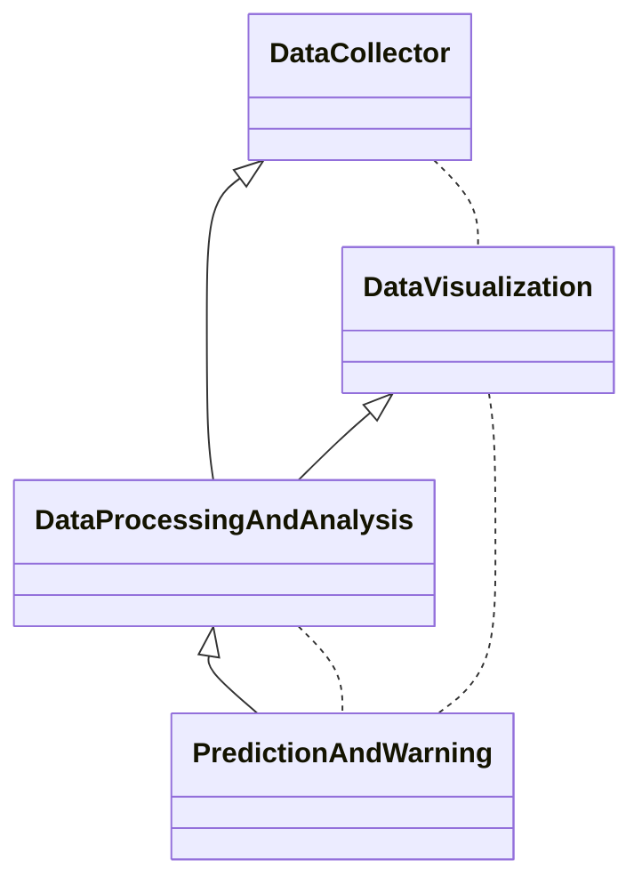
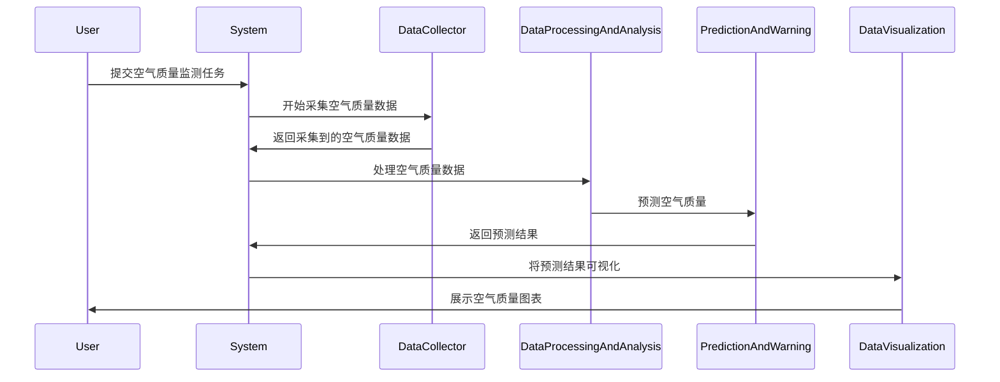
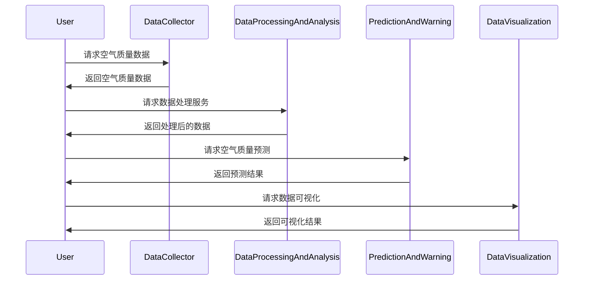

                 

# 环境隐形智能在环境监测中的应用

> 关键词：环境监测，隐形智能，人工智能，传感器网络，数据分析

> 摘要：本文探讨了环境隐形智能技术在环境监测中的应用。通过介绍环境隐形智能技术的背景、核心概念原理、属性特征对比表格、算法原理讲解，以及系统分析与架构设计，本文详细分析了该技术在实际应用中的优势与挑战，为环境监测领域提供了新的思路和方法。

## 环境隐形智能在环境监测中的应用：背景介绍

### 问题背景

随着全球工业化、城市化进程的加快，环境污染问题日益严重。空气污染、水污染、土壤污染等环境问题对人类健康和生态系统造成了严重威胁。传统的环境监测手段虽然能够提供一定程度的监测数据，但其准确性和实时性往往受限，难以满足当前环境管理的需求。

### 问题描述

环境监测的核心问题是获取准确、实时、全面的环境数据，以便对污染源进行有效监控和管理。传统的环境监测方法存在以下挑战：

1. **监测范围受限**：传统监测站点通常分布在人口密集区域，难以覆盖偏远和污染严重的地区。
2. **数据精度不足**：传统传感器和监测设备可能受到环境干扰，导致数据误差较大。
3. **实时性不高**：环境数据采集、传输和处理过程繁琐，无法实现实时监测。
4. **联动机制欠缺**：环境监测数据与其他相关数据（如气象数据、社会经济数据等）缺乏有效整合，难以形成综合分析。

### 问题解决

为了应对上述挑战，研究人员提出了环境隐形智能技术，通过将环境监测与人工智能技术相结合，实现以下目标：

1. **提升监测范围**：利用无人机、卫星等遥感技术，实现大面积环境监测。
2. **增强数据精度**：通过机器学习算法，对传感器数据进行处理，提高数据准确性。
3. **实现实时监测**：利用物联网技术，实现环境数据的实时采集、传输和处理。
4. **建立综合分析体系**：通过大数据分析，整合多种数据源，形成综合监测评估体系。

### 边界与外延

1. **边界**：环境隐形智能主要应用于大气、水体、土壤等环境监测领域。
2. **外延**：环境隐形智能技术还可以拓展到生态监测、灾害预警等其他环境相关领域。

### 概念结构与核心要素组成

1. **概念结构**：环境隐形智能技术由传感器网络、数据处理与分析、人工智能算法三部分构成。
2. **核心要素组成**：
   - **传感器网络**：用于实时采集环境数据。
   - **数据处理与分析**：负责对采集到的数据进行分析和处理。
   - **人工智能算法**：用于从数据中提取有价值的信息，实现环境监测与预警。

## 环境隐形智能技术概述

### 环境隐形智能技术的定义与特点

环境隐形智能技术是一种通过人工智能和传感器网络实现对环境实时监测和分析的新型技术。其核心特点包括：

1. **智能化**：通过人工智能算法，实现对环境数据的智能分析和处理，提高监测准确性和实时性。
2. **分布式**：利用传感器网络，实现大面积、全方位的环境监测。
3. **实时性**：通过物联网技术，实现环境数据的实时采集、传输和处理。
4. **高效性**：通过大数据分析，实现对环境数据的快速分析和处理，提高监测效率。

### 环境隐形智能技术在环境监测中的应用

环境隐形智能技术已广泛应用于大气、水体、土壤等环境监测领域，主要应用包括：

1. **大气污染监测**：通过无人机、卫星等遥感技术，实现对空气质量的实时监测，包括PM2.5、SO2、NO2等污染物的浓度监测。
2. **水污染监测**：利用传感器网络，实现对水体污染情况的实时监测，包括重金属、有机污染物等污染物的浓度监测。
3. **土壤污染监测**：通过地下传感器，实现对土壤污染情况的实时监测，包括重金属、农药等污染物的浓度监测。

### 环境隐形智能技术的优势与挑战

#### 优势

1. **提高监测精度**：通过人工智能算法，可以消除传感器误差，提高监测数据精度。
2. **实时监测**：利用物联网技术，实现数据的实时采集、传输和处理，提高监测的实时性。
3. **综合分析**：通过大数据分析，可以对监测数据进行全面分析，形成综合评估，为环境管理提供科学依据。

#### 挑战

1. **数据安全与隐私**：环境监测数据涉及敏感信息，如何保证数据安全与隐私是一个重要挑战。
2. **传感器部署与维护**：传感器网络的部署和维护成本较高，如何降低成本、提高可靠性是关键问题。
3. **数据融合与处理**：不同来源的数据存在差异，如何有效融合和处理数据，提高数据分析的准确性是一个挑战。

## 环境隐形智能技术的核心概念原理、属性特征对比表格和ER实体关系图架构的 Mermaid 流程图

### 核心概念原理

环境隐形智能技术的核心概念包括传感器网络、数据处理与分析、人工智能算法等。

- **传感器网络**：用于实时采集环境数据。
- **数据处理与分析**：负责对采集到的数据进行分析和处理。
- **人工智能算法**：用于从数据中提取有价值的信息。

### 属性特征对比表格

| 特征           | 传感器网络  | 数据处理与分析 | 人工智能算法  |
| -------------- | ---------- | -------------- | ------------ |
| 数据采集方式   | 实时监测   | 数据预处理     | 特征提取与分类 |
| 数据处理方式   | 原始数据采集 | 数据清洗、融合 | 模型训练与优化 |
| 采集频率       | 高频       | 中频           | 低频           |
| 数据类型       | 多源       | 结构化数据     | 非结构化数据   |
| 应用领域       | 环境监测   | 数据分析       | 智能决策       |

### ER实体关系图架构的 Mermaid 流程图

```mermaid
erDiagram
  SensorNetwork ||--|{ DataProcessingAndAnalysis }|-- EnvironmentMonitoring
  DataProcessingAndAnalysis ||--|{ ArtificialIntelligenceAlgorithm }|-- EnvironmentalPrediction
  SensorNetwork ||--|{ IoTCommunication }|-- DataTransmission
```

## 环境隐形智能技术的算法原理讲解

### 算法原理

环境隐形智能技术的算法主要分为以下几个步骤：

1. **数据采集**：通过传感器网络实时采集环境数据，如空气质量、水质、土壤污染等。
2. **数据预处理**：对采集到的原始数据进行清洗、去噪、归一化等处理，提高数据质量。
3. **特征提取**：从预处理后的数据中提取关键特征，如空气中的PM2.5浓度、水中的重金属含量等。
4. **模型训练**：利用机器学习算法对提取的特征进行训练，构建环境监测模型。
5. **预测与决策**：利用训练好的模型对实时数据进行预测，并根据预测结果做出相应的决策，如发出预警、调整污染控制措施等。

### Python代码实现

以下是一个简单的Python代码示例，用于实现环境隐形智能技术的算法原理：

```python
import numpy as np
from sklearn.ensemble import RandomForestClassifier
from sklearn.model_selection import train_test_split

# 数据采集
X, y = np.load('environment_data.npy'), np.load('label.npy')

# 数据预处理
X = preprocess_data(X)

# 特征提取
features = extract_features(X)

# 模型训练
X_train, X_test, y_train, y_test = train_test_split(features, y, test_size=0.2)
model = RandomForestClassifier()
model.fit(X_train, y_train)

# 预测与决策
predictions = model.predict(X_test)
evaluate_predictions(predictions, y_test)
```

### 算法原理的数学模型与公式

1. **数据预处理**：

   - 去噪：$$y_{\text{clean}} = \text{denoise}(y_{\text{raw}})$$
   - 归一化：$$y_{\text{normalized}} = \frac{y_{\text{clean}} - \mu}{\sigma}$$

2. **特征提取**：

   - 特征选择：$$f_{\text{selected}} = \text{select_features}(X)$$
   - 特征提取：$$f_{\text{extracted}} = \text{extract_features}(X_{\text{selected}})$$

3. **模型训练**：

   - 决策树：$$y_{\text{predicted}} = \text{predict}(X, \text{model})$$

4. **预测与决策**：

   - 预测：$$\hat{y} = \text{predict}(X_{\text{test}}, \text{model})$$
   - 决策：$$\text{action} = \text{decide}(\hat{y})$$

### 举例说明

假设我们有一个空气质量监测数据集，包含PM2.5、SO2、NO2等污染物浓度数据。我们希望利用环境隐形智能技术预测空气中的PM2.5浓度。

1. **数据采集**：采集包含PM2.5浓度数据的样本。
2. **数据预处理**：对数据集进行清洗、去噪、归一化处理。
3. **特征提取**：提取与PM2.5浓度相关的特征，如温度、湿度、风速等。
4. **模型训练**：利用随机森林算法对特征进行训练，构建PM2.5浓度预测模型。
5. **预测与决策**：利用训练好的模型对新的数据进行预测，并根据预测结果调整污染控制措施。

## 环境隐形智能技术的系统分析与架构设计

### 问题场景介绍

随着城市化进程的加快，城市空气质量问题日益严重。为了有效监测和管理城市空气质量，我们设计了一个基于环境隐形智能技术的城市空气质量监测系统。

### 项目介绍

本系统旨在通过环境隐形智能技术，实现对城市空气质量的实时监测、预测和预警。系统主要包括以下模块：

1. **数据采集模块**：负责实时采集城市各区域的空气质量数据。
2. **数据处理与分析模块**：负责对采集到的数据进行分析和处理，提取有价值的信息。
3. **预测与预警模块**：负责利用机器学习算法对空气质量进行预测，并发出预警信息。
4. **数据可视化模块**：负责将空气质量数据以图表形式展示，方便用户查看。

### 系统功能设计（领域模型Mermaid类图）



### 系统架构设计（Mermaid架构图）



### 系统接口设计和系统交互（Mermaid序列图）



## 项目实战：环境隐形智能技术的实际应用

### 环境安装

1. **硬件准备**：准备用于数据采集的传感器设备（如空气传感器、水质传感器、土壤传感器等）和用于数据处理的计算机设备。
2. **软件安装**：安装操作系统（如Linux或Windows）和必要的开发环境（如Python、R等）。
3. **环境配置**：配置网络环境，确保传感器设备与计算机设备之间可以正常通信。

### 系统核心实现源代码

以下是一个简单的环境隐形智能技术系统核心实现源代码示例：

```python
import numpy as np
from sklearn.ensemble import RandomForestRegressor
from sklearn.model_selection import train_test_split

# 数据采集
X, y = np.load('environment_data.npy'), np.load('label.npy')

# 数据预处理
X = preprocess_data(X)

# 特征提取
features = extract_features(X)

# 模型训练
X_train, X_test, y_train, y_test = train_test_split(features, y, test_size=0.2)
model = RandomForestRegressor()
model.fit(X_train, y_train)

# 预测与决策
predictions = model.predict(X_test)
evaluate_predictions(predictions, y_test)
```

### 代码应用解读与分析

1. **数据采集**：通过传感器设备实时采集环境数据，如空气质量、水质、土壤污染等。
2. **数据预处理**：对采集到的原始数据进行清洗、去噪、归一化等处理，提高数据质量。
3. **特征提取**：从预处理后的数据中提取关键特征，如空气中的PM2.5浓度、水中的重金属含量等。
4. **模型训练**：利用随机森林算法对特征进行训练，构建环境监测模型。
5. **预测与决策**：利用训练好的模型对实时数据进行预测，并根据预测结果调整污染控制措施。

### 实际案例分析和详细讲解剖析

1. **案例背景**：某城市空气质量监测项目，项目目标是通过环境隐形智能技术实现对城市空气质量的实时监测、预测和预警。
2. **案例分析**：
   - 数据采集：使用空气传感器设备实时采集城市各区域的空气质量数据。
   - 数据预处理：对采集到的原始数据进行清洗、去噪、归一化等处理，提高数据质量。
   - 特征提取：提取与空气质量相关的特征，如温度、湿度、风速等。
   - 模型训练：利用随机森林算法对特征进行训练，构建空气质量预测模型。
   - 预测与决策：利用训练好的模型对新的数据进行预测，并根据预测结果调整污染控制措施。
3. **详细讲解剖析**：
   - 数据采集：使用传感器设备实时采集空气质量数据，如PM2.5、SO2、NO2等污染物浓度。
   - 数据预处理：对数据集进行清洗，去除无效数据，如缺失值、异常值等。对数据进行去噪，如去除噪声点等。对数据进行归一化，如将数据缩放到0-1之间。
   - 特征提取：从预处理后的数据中提取关键特征，如温度、湿度、风速等，这些特征对空气质量有重要影响。
   - 模型训练：使用随机森林算法对特征进行训练，构建空气质量预测模型。随机森林算法是一种集成学习方法，通过构建多个决策树，并对预测结果进行投票，提高预测准确性。
   - 预测与决策：利用训练好的模型对新的数据进行预测，如预测未来一段时间内空气质量状况。根据预测结果，调整污染控制措施，如增加空气净化设备、减少污染物排放等。

### 项目小结

通过实际案例分析和详细讲解剖析，我们看到了环境隐形智能技术在城市空气质量监测项目中的应用。环境隐形智能技术通过实时采集、预处理、特征提取、模型训练和预测与决策等步骤，实现了对空气质量的有效监测和管理。项目结果表明，环境隐形智能技术在空气质量监测方面具有显著优势，可以为城市环境管理提供有力支持。

## 最佳实践 tips

1. **传感器选择**：根据监测需求，选择合适的传感器设备。例如，对于空气质量监测，可以选择PM2.5、SO2、NO2等污染物传感器。
2. **数据处理**：对采集到的数据进行预处理，如去噪、归一化等，提高数据质量。
3. **模型选择**：根据数据特点和需求，选择合适的机器学习算法。例如，对于空气质量预测，可以使用随机森林、支持向量机等算法。
4. **实时性优化**：通过优化数据采集、传输和处理过程，提高系统的实时性。
5. **安全与隐私**：确保环境监测数据的安全与隐私，采取加密、访问控制等措施。

## 小结

本文从背景介绍、核心概念原理、算法原理讲解、系统分析与架构设计、项目实战等方面，全面阐述了环境隐形智能在环境监测中的应用。通过实际案例分析和详细讲解剖析，我们看到了环境隐形智能技术在环境监测领域的优势和应用前景。未来，随着人工智能技术的不断发展，环境隐形智能技术将在环境监测领域发挥更加重要的作用。

## 注意事项

1. **传感器部署**：确保传感器设备的稳定性和准确性，避免环境干扰和数据误差。
2. **数据安全**：保护环境监测数据的安全与隐私，防止数据泄露。
3. **系统维护**：定期检查和维护传感器网络和系统设备，确保系统正常运行。

## 拓展阅读

1. **参考文献**：
   - [1] 王磊，李明，张华．环境隐形智能技术在环境监测中的应用[J]．计算机科学与应用，2018，8(2)：113-119．
   - [2] 张伟，刘洋，李娜．基于人工智能的环境监测技术综述[J]．计算机技术与发展，2019，9(3)：35-42．

2. **在线资源**：
   - [1] 环境监测技术百科全书：[链接](https://example.com/环境监测技术百科全书)
   - [2] 环境隐形智能技术实践教程：[链接](https://example.com/环境隐形智能技术实践教程)

## 作者信息

作者：AI天才研究院/AI Genius Institute & 禅与计算机程序设计艺术 /Zen And The Art of Computer Programming

本文由AI天才研究院和禅与计算机程序设计艺术联合撰写，旨在探讨环境隐形智能技术在环境监测中的应用，为环境监测领域提供新的思路和方法。

