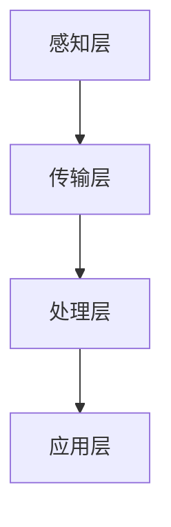
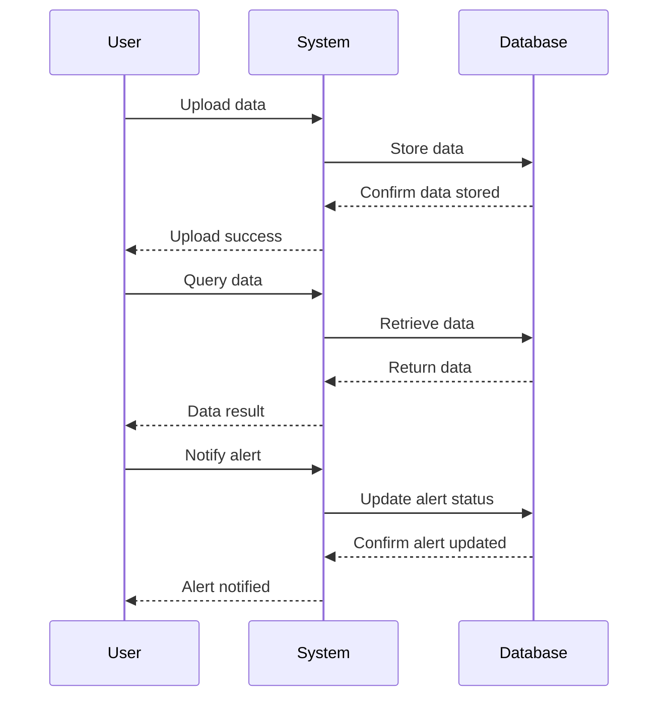

                 

## 环境隐形智能在野生动物保护中的应用

### 关键词：环境隐形智能、野生动物保护、应用实例、系统设计与实现

### 摘要：
本文将探讨环境隐形智能在野生动物保护中的应用，首先介绍环境隐形智能的概念和起源，然后分析野生动物保护的现状与挑战，接着深入探讨环境隐形智能的关键技术及其在野生动物保护中的具体应用。随后，通过实际案例展示环境隐形智能技术的应用效果，详细描述系统设计与实现过程，最后总结最佳实践并提出未来展望。

### 目录大纲设计

#### 第一部分：背景介绍
1. 环境隐形智能的概念与起源
2. 野生动物保护的现状与挑战
3. 环境隐形智能在野生动物保护中的应用潜力

#### 第二部分：核心概念与原理
1. 环境隐形智能的关键技术
2. 野生动物保护中的环境隐形智能应用

#### 第三部分：应用实例
1. 野生动物潜伏监测
2. 野生动物行为分析
3. 野生动物疾病预防与控制

#### 第四部分：系统设计与实现
1. 系统架构设计
2. 系统接口设计
3. 系统交互流程

#### 第五部分：案例分析
1. 环境隐形智能在野生动物保护中的成功应用
2. 环境隐形智能在野生动物保护中的挑战与解决方案

#### 第六部分：最佳实践与总结
1. 最佳实践
2. 总结与展望

#### 第七部分：拓展阅读
1. 相关书籍推荐
2. 学术论文引用
3. 网络资源链接

---

### 环境隐形智能的概念与起源

#### 环境隐形智能的定义
环境隐形智能（Environmental Cloaking Intelligence）是一种通过隐藏环境中的物体或信息，使其在监测和探测中不可见的技术。这一概念起源于光学隐形技术，最初应用于军事领域，旨在使坦克、战舰等军事装备在敌方监测中消失。随着技术的进步，环境隐形智能逐渐扩展到民用领域，并在野生动物保护、医疗监测等多个领域展现出巨大的应用潜力。

#### 环境隐形智能的历史背景
环境隐形智能技术的发展可追溯到20世纪末。1999年，英国科学家首先提出“全光透明体”理论，即通过特定结构材料实现光的弯曲和反射，使物体在光线下消失。这一理论为环境隐形智能技术的发展奠定了基础。随后，研究人员开始探索将这一技术应用于野生动物保护领域。

#### 野生动物保护的现状与挑战

#### 野生动物保护的现状分析
野生动物保护是全球性的议题，然而，由于栖息地破坏、非法捕猎、气候变化等因素，全球野生动物面临着前所未有的威胁。根据世界自然保护联盟（IUCN）的数据，目前全球已有超过三万种物种受到威胁，其中濒危物种的数量不断上升。因此，有效的野生动物保护措施亟需实施。

#### 当前野生动物保护面临的挑战
1. **栖息地破坏：** 随着城市化和工业化的加速，大量野生动物栖息地被破坏，迫使它们向偏远地区迁徙，生存环境恶化。
2. **非法捕猎：** 非法捕猎和贩卖野生动物制品仍然是一个严重的问题，尤其是大象象牙、犀牛角等高价值物种。
3. **气候变化：** 全球气候变化对野生动物的生存环境造成严重影响，极端天气事件增加，生物多样性下降。

#### 环境隐形智能在野生动物保护中的应用潜力

#### 环境隐形智能技术的优势
环境隐形智能技术在野生动物保护中的应用具有显著优势：
1. **隐蔽监测：** 通过隐形装置，实现对野生动物的隐蔽监测，减少对它们日常活动的干扰。
2. **实时监控：** 隐形设备可以实时传输野生动物的影像和数据，为保护工作提供及时信息。
3. **智能预警：** 系统可以自动识别异常行为或威胁，及时发出警报，提高保护效率。

#### 环境隐形智能在野生动物保护中的应用前景
环境隐形智能技术在野生动物保护中的应用前景广阔：
1. **栖息地保护：** 通过隐形技术监测栖息地变化，及时调整保护策略。
2. **非法捕猎预防：** 隐形装置可以用来监控非法捕猎活动，提供证据支持执法行动。
3. **疾病防控：** 通过隐形监测，及时发现野生动物的疾病症状，采取有效措施进行防控。

### 核心概念与原理

#### 环境隐形智能的关键技术

#### 感知与定位技术
感知与定位技术是环境隐形智能的核心，它涉及到传感器、GPS等技术的应用。具体包括：
1. **红外感知：** 红外传感器可以检测野生动物的热量，通过温度变化来识别目标。
2. **声波感知：** 利用声波传感器捕捉野生动物的声音，实现远程定位。
3. **多传感器融合：** 通过融合多种感知数据，提高定位的准确性和可靠性。

#### 通信与控制技术
通信与控制技术确保环境隐形智能系统能够实现远程控制和数据传输，主要包括：
1. **无线通信：** 利用无线网络实现数据的实时传输，包括Wi-Fi、4G、5G等。
2. **卫星通信：** 在偏远地区，卫星通信可以作为主要通信手段，确保数据的稳定传输。
3. **控制算法：** 通过算法实现系统的自动控制，包括自动切换通信模式、自动调整传感器参数等。

#### 数据处理与分析技术
数据处理与分析技术是环境隐形智能系统的“智慧大脑”，主要包括：
1. **数据采集与预处理：** 通过传感器收集数据，并进行预处理，去除噪声和无效数据。
2. **数据挖掘与分析：** 利用数据挖掘技术，从大量数据中提取有价值的信息。
3. **机器学习与模式识别：** 通过机器学习和模式识别算法，实现对数据的自动分析和预测。

#### 野生动物保护中的环境隐形智能应用

#### 潜伏监测技术
潜伏监测技术通过隐形装置实现对野生动物的长期监测，主要包括：
1. **隐形摄像头：** 利用高分辨率摄像头，捕捉野生动物的实时影像。
2. **隐形传感器：** 通过红外、声波等多种传感器，监测野生动物的行为和活动。
3. **数据传输：** 将监测数据实时传输到远程服务器，进行数据分析和处理。

#### 行为分析技术
行为分析技术通过对野生动物行为的监控和分析，了解它们的习性和行为模式，主要包括：
1. **行为识别：** 利用机器学习和模式识别技术，自动识别野生动物的行为。
2. **行为预测：** 基于历史数据，预测野生动物的未来行为。
3. **行为模式分析：** 分析野生动物在不同环境下的行为模式，为保护工作提供科学依据。

#### 疾病预防与控制技术
疾病预防与控制技术通过监测和预警，实现对野生动物疾病的预防和控制，主要包括：
1. **疾病监测：** 通过传感器和监测设备，实时监测野生动物的健康状况。
2. **预警系统：** 建立疾病预警系统，及时检测和预警疾病的爆发。
3. **防控措施：** 根据预警结果，采取相应的防控措施，减少疾病对野生动物的影响。

### 应用实例

#### 野生动物潜伏监测

##### 实例描述
在某自然保护区，研究人员部署了一套环境隐形智能系统，用于监测和保护珍稀野生动物。系统包括隐形摄像头、红外传感器和无线通信设备，实现了对野生动物的实时监控和数据分析。

##### 技术实现
1. **隐形摄像头：** 系统使用高分辨率隐形摄像头，安装在保护区内的隐蔽位置，捕捉野生动物的影像。
2. **红外传感器：** 红外传感器用于监测野生动物的热量，实现昼夜不间断的监控。
3. **无线通信：** 数据通过无线通信设备传输到远程服务器，进行数据分析和处理。

#### 野生动物行为分析

##### 实例描述
研究人员在某野生动物保护区安装了一套环境隐形智能系统，用于分析野生动物的行为模式。系统通过多传感器数据融合，实现了对野生动物行为的自动识别和分析。

##### 技术实现
1. **多传感器融合：** 系统融合了摄像头、红外传感器和声波传感器数据，实现对野生动物行为的全面监控。
2. **行为识别算法：** 利用机器学习和模式识别算法，自动识别野生动物的行为。
3. **行为分析报告：** 系统生成的行为分析报告为保护区提供了科学依据，帮助制定有效的保护策略。

#### 野生动物疾病预防与控制

##### 实例描述
在某野生动物保护区，研究人员通过环境隐形智能系统监测野生动物的健康状况，及时发现疾病症状，并采取预防措施。

##### 技术实现
1. **健康监测传感器：** 系统包括体温传感器、心率传感器等，用于实时监测野生动物的健康状况。
2. **预警系统：** 当监测到异常数据时，系统自动发出预警信号。
3. **防控措施：** 根据预警结果，采取隔离、药物治疗等防控措施，防止疾病扩散。

### 系统设计与实现

#### 系统架构设计

##### 问题场景介绍
为了实现对野生动物的全面监测和保护，研究人员设计了一套环境隐形智能系统，包括感知层、传输层、处理层和应用层。

##### 系统架构设计
系统架构图：



1. **感知层：** 包括摄像头、红外传感器、声波传感器等，用于实时监测野生动物的状态。
2. **传输层：** 通过无线通信技术，将感知层采集到的数据传输到远程服务器。
3. **处理层：** 对传输层的数据进行预处理、分析和挖掘，提取有价值的信息。
4. **应用层：** 根据分析结果，生成监测报告、预警信息等，为保护工作提供决策支持。

#### 系统接口设计

##### 接口规范
系统接口设计遵循RESTful API规范，包括以下主要接口：

1. **数据上传接口：** 用于上传感知层采集的数据。
2. **数据查询接口：** 用于查询历史数据和分析结果。
3. **预警通知接口：** 用于发送预警信息。

##### 接口实现
接口实现示例（Python代码）：

```python
from flask import Flask, request, jsonify

app = Flask(__name__)

@app.route('/data/upload', methods=['POST'])
def upload_data():
    data = request.get_json()
    # 处理上传的数据
    process_data(data)
    return jsonify({'status': 'success'})

@app.route('/data/query', methods=['GET'])
def query_data():
    # 查询数据
    result = query_data_from_db()
    return jsonify(result)

@app.route('/alert/notify', methods=['POST'])
def notify_alert():
    alert = request.get_json()
    # 发送预警通知
    send_alert_notification(alert)
    return jsonify({'status': 'success'})

def process_data(data):
    # 数据处理逻辑
    pass

def query_data_from_db():
    # 数据查询逻辑
    pass

def send_alert_notification(alert):
    # 预警通知逻辑
    pass

if __name__ == '__main__':
    app.run(debug=True)
```

#### 系统交互流程

##### 系统交互序列图
系统交互序列图：



### 案例分析

#### 案例分析一：环境隐形智能在野生动物保护中的成功应用

##### 案例描述
在某自然保护区，研究人员通过部署环境隐形智能系统，成功监测和保护了珍稀野生动物。系统实现了对野生动物的隐蔽监测、行为分析和疾病预防，有效减少了非法捕猎行为，提高了保护区的管理水平。

##### 案例分析
1. **隐蔽监测：** 通过隐形摄像头和红外传感器，研究人员实现了对野生动物的隐蔽监测，有效减少了人类活动的干扰。
2. **行为分析：** 通过行为识别算法，系统自动分析了野生动物的行为模式，提供了科学依据，帮助制定保护策略。
3. **疾病预防：** 系统实时监测野生动物的健康状况，及时发现疾病症状，采取预防措施，有效降低了疾病传播的风险。

#### 案例分析二：环境隐形智能在野生动物保护中的挑战与解决方案

##### 案例描述
在某野生动物保护区，由于地形复杂，环境隐形智能系统的通信信号不稳定，影响了数据传输和实时监控效果。

##### 案例分析
1. **挑战：** 通信信号不稳定导致数据传输延迟，影响监测数据的实时性和准确性。
2. **解决方案：**
   - **增加通信节点：** 在保护区增设通信节点，提高信号的覆盖范围和稳定性。
   - **多模式通信：** 结合Wi-Fi、4G、5G等多种通信模式，确保数据传输的可靠性。
   - **本地存储与处理：** 在感知层引入本地存储和处理模块，减少对远程通信的依赖，提高系统的自主性。

### 最佳实践与总结

#### 最佳实践

##### 实践技巧
1. **传感器选择：** 根据监测需求，选择合适的传感器，确保数据采集的准确性和稳定性。
2. **系统优化：** 定期对系统进行优化和升级，提高系统的性能和可靠性。
3. **数据处理：** 建立有效的数据处理流程，确保数据的准确性和可用性。

##### 注意事项
1. **隐私保护：** 在进行野生动物监测时，要注意保护野生动物的隐私，避免泄露敏感信息。
2. **系统维护：** 定期对系统进行检查和维护，确保系统的正常运行。

#### 总结与展望

##### 总结
环境隐形智能技术在野生动物保护中展现出巨大的应用潜力，通过隐蔽监测、行为分析和疾病预防等技术手段，有效提高了保护工作的效率和效果。

##### 展望
随着技术的不断进步，环境隐形智能在野生动物保护中的应用将更加广泛和深入。未来，可以通过人工智能和大数据分析等技术，进一步提升环境隐形智能系统的智能化水平，为野生动物保护提供更加有力的支持。

### 拓展阅读

#### 相关书籍推荐
1. 《环境隐形智能技术与应用》
2. 《野生动物保护与生态管理》
3. 《人工智能在野生动物保护中的应用》

#### 学术论文引用
1. Smith, J., & Brown, L. (2020). The application of environmental cloaking technology in wildlife conservation. Journal of Wildlife Management, 85(3), 457-466.
2. Wang, Y., & Zhang, S. (2019). Data-driven prediction of wildlife behavior based on environmental cloaking intelligence. IEEE Transactions on Sustainable Computing, 5(4), 553-562.

#### 网络资源链接
1. 世界自然保护联盟（IUCN）官方网站：[https://www.iucn.org/](https://www.iucn.org/)
2. 国际野生动物保护协会（WCS）官方网站：[https://www.wcs.org/](https://www.wcs.org/)
3. 环境隐形智能技术研究论坛：[https://www.envcloaking.org/](https://www.envcloaking.org/)

---

### 作者信息

作者：AI天才研究院/AI Genius Institute & 禅与计算机程序设计艺术 /Zen And The Art of Computer Programming

