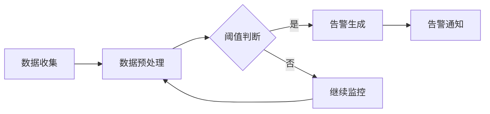
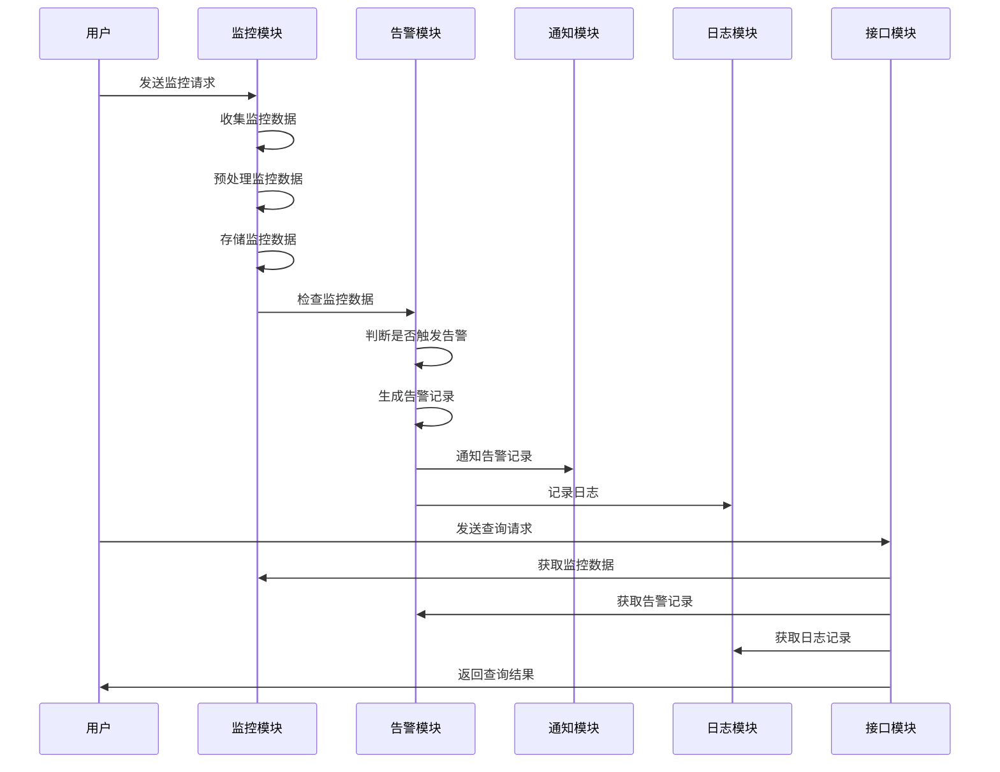
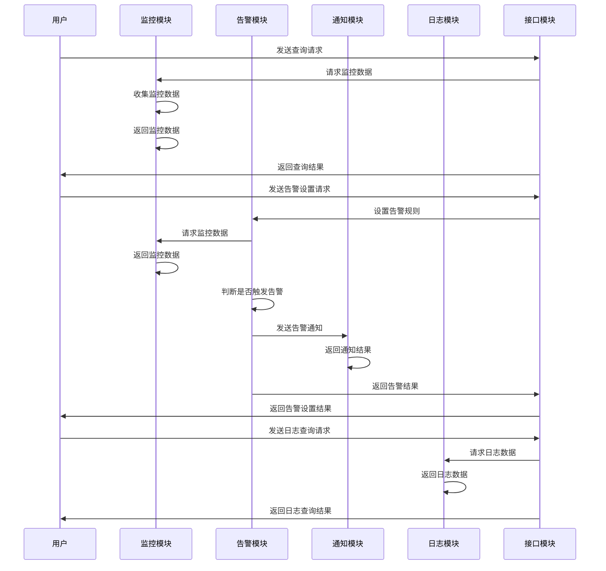

                 

## 监控告警系统保障LLM应用的稳定运行

### 关键词

- 监控告警系统
- 大型语言模型（LLM）
- 稳定性保障
- 系统架构设计
- 算法原理

### 摘要

本文将深入探讨如何通过构建高效的监控告警系统，保障大型语言模型（LLM）应用的稳定运行。首先，我们将概述监控告警系统的基本概念及其在LLM应用中的重要性。接下来，通过详细分析监控告警系统的核心概念、联系与架构，我们将逐步讲解告警算法的原理，使用Python源代码阐述算法的实现。此外，本文还将通过一个具体的项目实战案例，展示如何将监控告警系统应用于实际场景，提供最佳实践和注意事项，以便进一步优化LLM应用的稳定性。最终，本文将提供相关的拓展阅读资源，帮助读者更深入地理解并应用监控告警系统于LLM应用的稳定性保障中。

## 目录大纲

### 第一部分：问题背景与概述

- 第1章 监控告警系统概述
  - 1.1 问题描述
  - 1.2 问题解决
  - 1.3 边界与外延
  - 1.4 核心概念
  - 1.5 本章小结

### 第二部分：核心概念与联系

- 第2章 核心概念与联系
  - 2.1 监控告警系统的概念
    - 2.1.1 监控告警系统的定义
    - 2.1.2 监控告警系统的功能
    - 2.1.3 监控告警系统的组成部分
  - 2.2 核心概念对比表格
  - 2.3 ER实体关系图架构
  - 2.4 本章小结

### 第三部分：算法原理讲解

- 第3章 算法原理讲解
  - 3.1 告警算法原理
    - 3.1.1 告警算法的定义
    - 3.1.2 告警算法的类型
    - 3.1.3 告警算法的流程
  - 3.2 告警算法流程图
    - 3.2.1 使用Mermaid画出的告警算法流程图
  - 3.3 Python源代码阐述
    - 3.3.1 Python告警算法源代码
    - 3.3.2 告警算法原理的数学模型和公式
    - 3.3.3 告警算法原理详细讲解
    - 3.3.4 举例说明
  - 3.4 本章小结

### 第四部分：系统分析与架构设计方案

- 第4章 系统分析与架构设计方案
  - 4.1 问题场景介绍
  - 4.2 项目介绍
    - 4.2.1 项目背景
    - 4.2.2 项目目标
    - 4.2.3 项目范围
  - 4.3 系统功能设计
    - 4.3.1 领域模型
    - 4.3.2 系统功能模块划分
    - 4.3.3 功能模块详细描述
  - 4.4 系统架构设计
    - 4.4.1 系统架构图
    - 4.4.2 架构设计细节
  - 4.5 系统接口设计
    - 4.5.1 接口设计原则
    - 4.5.2 接口定义
    - 4.5.3 接口文档
  - 4.6 系统交互
    - 4.6.1 系统交互图
    - 4.6.2 系统交互详细描述
  - 4.7 本章小结

### 第五部分：项目实战

- 第5章 项目实战
  - 5.1 环境安装
    - 5.1.1 环境搭建步骤
    - 5.1.2 环境配置细节
  - 5.2 系统核心实现
    - 5.2.1 系统核心源代码
    - 5.2.2 核心代码解读与分析
  - 5.3 实际案例分析
    - 5.3.1 案例背景
    - 5.3.2 案例分析
    - 5.3.3 剖析与讲解
  - 5.4 项目小结
    - 5.4.1 项目总结
    - 5.4.2 项目经验与教训
    - 5.4.3 项目展望

### 第六部分：最佳实践与拓展

- 第6章 最佳实践与拓展
  - 6.1 最佳实践
    - 6.1.1 监控告警系统的最佳实践
    - 6.1.2 系统维护与优化
    - 6.1.3 系统扩展与升级
  - 6.2 小结
  - 6.3 注意事项
    - 6.3.1 常见问题及解决方案
    - 6.3.2 使用监控告警系统的注意事项
  - 6.4 拓展阅读
    - 6.4.1 相关书籍推荐
    - 6.4.2 学术论文推荐

## 第一部分：问题背景与概述

### 第1章 监控告警系统概述

#### 1.1 问题描述

在当前信息化时代，大量的应用程序和系统运行于企业内部或云端，其稳定性和可靠性对于业务的连续性和客户满意度至关重要。特别是对于大型语言模型（LLM）这样的高性能应用，其运行环境需要极高的稳定性和响应速度，以应对不断变化的数据处理需求。

然而，实际运营中，系统可能出现各种问题，如资源不足、配置错误、硬件故障等，这些问题可能导致系统性能下降甚至宕机，影响业务的正常运行。为了及时发现和解决问题，保障系统的稳定运行，监控告警系统应运而生。

#### 1.2 问题解决

监控告警系统通过持续监控系统的各种运行指标，如CPU使用率、内存使用率、磁盘空间、网络流量等，当检测到异常情况时，系统会自动触发告警，通知相关人员采取相应措施。这样，不仅可以迅速定位问题，减少故障处理时间，还能预防潜在问题，提高系统的整体稳定性。

#### 1.3 边界与外延

监控告警系统的范围不仅限于硬件资源的监控，还包括软件资源的监控，如应用程序的状态、服务的可用性等。此外，告警系统还可以扩展到云环境中的各种服务，如AWS、Azure、Google Cloud等，实现跨云平台的统一监控。

#### 1.4 核心概念

1. **监控**：持续收集系统运行指标，如性能、状态、健康度等。
2. **告警**：当监控指标超出预设阈值时，系统触发告警通知。
3. **阈值**：用于设定监控指标的正常范围，当指标超出阈值时触发告警。
4. **告警通知**：通过短信、邮件、微信等方式通知相关人员。

#### 1.5 本章小结

本章概述了监控告警系统的基本概念和其在保障LLM应用稳定性中的重要作用。通过构建高效的监控告警系统，可以及时发现并解决问题，保障系统的稳定运行，提高企业的业务连续性和客户满意度。

## 第二部分：核心概念与联系

### 第2章 核心概念与联系

#### 2.1 监控告警系统的概念

**2.1.1 监控告警系统的定义**

监控告警系统是一种自动化监控系统，它实时监控服务器、网络设备、应用程序等系统的运行状态，通过预设的阈值和规则，当检测到异常情况时，自动发送告警通知给相关人员。其目的是确保系统的高可用性和稳定性。

**2.1.2 监控告警系统的功能**

1. **实时监控**：持续监控系统的运行状态，如CPU使用率、内存使用率、磁盘空间等。
2. **告警通知**：当监控指标超出预设阈值时，自动发送告警通知。
3. **日志管理**：收集和存储系统的日志信息，便于后续分析和追溯。
4. **自动恢复**：某些告警情况下，系统可以自动执行预定义的恢复操作，如重启服务、清理缓存等。

**2.1.3 监控告警系统的组成部分**

1. **监控模块**：负责实时收集系统的各项运行指标。
2. **告警模块**：根据监控模块收集的数据，分析并判断是否触发告警条件。
3. **通知模块**：发送告警通知，通知相关人员处理。
4. **日志模块**：收集和存储系统的日志信息。

#### 2.2 核心概念对比表格

| 概念 | 说明 |
| ---- | ---- |
| 监控 | 持续收集系统运行指标 |
| 告警 | 当监控指标超出阈值时触发通知 |
| 阈值 | 监控指标的正常范围 |
| 告警通知 | 发送告警通知 |
| 日志管理 | 收集和存储系统日志信息 |
| 自动恢复 | 自动执行预定义的恢复操作 |

#### 2.3 ER实体关系图架构

```mermaid
erDiagram
    User ||--|{ Monitor}: "监控用户"  
    Monitor ||--|{ Alert}: "监控告警"  
    Alert ||--|{ Notice}: "告警通知"  
    Notice ||--|{ Log}: "日志管理"  
```

**ER实体关系图解释**：

- **User（用户）**：监控告警系统的使用者，负责设置监控规则、接收告警通知等。
- **Monitor（监控）**：实时监控系统的各项运行指标，包括CPU、内存、磁盘等。
- **Alert（告警）**：当监控指标超出阈值时，生成的告警记录。
- **Notice（通知）**：发送给用户的告警通知，包括通知类型、发送时间等。
- **Log（日志）**：存储系统运行日志，用于问题追踪和分析。

#### 2.4 本章小结

本章详细介绍了监控告警系统的核心概念，包括其定义、功能、组成部分以及核心概念之间的联系。通过对比表格和ER实体关系图，读者可以更清晰地理解监控告警系统的运作机制和整体架构。

## 第三部分：算法原理讲解

### 第3章 算法原理讲解

#### 3.1 告警算法原理

告警算法是监控告警系统的核心组成部分，它负责分析监控数据，判断是否触发告警条件，并生成告警记录。以下是告警算法的基本原理和流程：

**3.1.1 告警算法的定义**

告警算法是一种用于监控数据分析的算法，它根据预设的规则和阈值，对监控数据进行处理和分析，判断是否满足告警条件，并生成告警记录。

**3.1.2 告警算法的类型**

1. **阈值告警**：根据监控指标的阈值设置，当指标超出阈值时触发告警。
2. **统计告警**：通过分析监控数据的历史统计信息，判断是否满足告警条件。
3. **组合告警**：结合多个监控指标，通过逻辑运算判断是否触发告警。

**3.1.3 告警算法的流程**

1. **数据收集**：从监控模块收集最新的监控数据。
2. **数据预处理**：对监控数据进行预处理，如数据清洗、填充缺失值等。
3. **阈值判断**：根据预设的阈值，对每个监控指标进行判断，判断是否超出阈值。
4. **告警生成**：当监控指标超出阈值时，生成告警记录。
5. **告警通知**：发送告警通知给相关人员。

#### 3.2 告警算法流程图

以下是使用Mermaid绘制的告警算法流程图：



**3.2.1 使用Mermaid画出的告警算法流程图**


#### 3.3 Python源代码阐述

以下是一个简单的Python告警算法示例，用于说明告警算法的实现过程：

```python
import time

def check_threshold(value, threshold):
    return value > threshold

def alert_notification(message):
    print(f"告警通知：{message}")

def monitor_metric(metric_name, value, threshold):
    if check_threshold(value, threshold):
        alert_notification(f"{metric_name}超出阈值，当前值：{value}")
    else:
        print(f"{metric_name}在正常范围内，当前值：{value}")

# 监控CPU使用率
CPU_THRESHOLD = 80
while True:
    CPU_USAGE = 90  # 假设当前的CPU使用率
    monitor_metric("CPU使用率", CPU_USAGE, CPU_THRESHOLD)
    time.sleep(60)  # 每隔60秒进行一次监控
```

**3.3.1 Python告警算法源代码**

```python
# 文件名：alert_algorithm.py
```

**3.3.2 告警算法原理的数学模型和公式**

告警算法的数学模型可以表示为：

$$
告警 = f(监控值, 阈值)
$$

其中，$f$函数根据监控值和阈值来判断是否触发告警。常用的$f$函数包括：

1. **比较函数**：$告警 = 监控值 > 阈值$
2. **统计函数**：$告警 = 监控值超出统计阈值$
3. **逻辑函数**：$告警 = (监控值 > 阈值) \land (历史监控值 > 另一个阈值)$

**3.3.3 告警算法原理详细讲解**

告警算法的核心是监控值的判断和阈值的设定。通过比较函数，我们可以直接判断监控值是否超出预设阈值。而在统计告警中，我们通常需要计算监控值的历史统计信息，如平均值、中位数等，并与阈值进行比较。

逻辑函数则通过结合多个监控值，使用逻辑运算符（如AND、OR）来判断是否触发告警。这种方式可以更准确地识别复杂的异常情况。

**3.3.4 举例说明**

假设我们监控一个服务器的CPU使用率，阈值设置为80%。当CPU使用率超过80%时，系统会触发告警。以下是具体的示例：

- **正常情况**：CPU使用率为70%，未触发告警。
- **告警情况**：CPU使用率为90%，触发告警，并通知相关人员。

通过这个简单的示例，我们可以看到告警算法是如何通过预设的规则和阈值，对监控数据进行处理和判断的。

#### 3.4 本章小结

本章详细介绍了告警算法的基本原理和流程，包括其定义、类型和具体实现。通过Python源代码的示例，我们了解了告警算法的实现过程，以及如何使用数学模型进行监控值的判断。本章的内容为后续系统分析和架构设计提供了基础。

## 第四部分：系统分析与架构设计方案

### 第4章 系统分析与架构设计方案

#### 4.1 问题场景介绍

随着云计算和大数据技术的发展，企业对于高性能计算和数据处理的需求日益增长。特别是大型语言模型（LLM）的应用，如自然语言处理（NLP）、智能客服等，对系统的稳定性、响应速度和数据处理能力提出了极高的要求。然而，在实际运营中，系统可能会面临各种挑战，如硬件故障、网络延迟、资源不足等，这些问题可能会导致系统性能下降，影响业务的正常运行。因此，构建一个高效的监控告警系统，对保障LLM应用的稳定运行具有重要意义。

#### 4.2 项目介绍

**4.2.1 项目背景**

随着人工智能技术的快速发展，企业对大型语言模型（LLM）的应用需求不断增加。这些应用不仅需要处理大量的数据，还需要提供快速、准确的响应。为了保证这些应用能够稳定运行，避免因故障或性能瓶颈导致的业务中断，我们需要构建一个高效的监控告警系统。

**4.2.2 项目目标**

本项目的主要目标包括：

1. **保障系统稳定性**：通过实时监控系统运行状态，及时发现和解决潜在问题，确保系统的高可用性。
2. **提高故障响应速度**：快速定位故障，缩短故障处理时间，减少业务中断时间。
3. **优化系统性能**：通过对监控数据的分析和优化，提高系统的整体性能和资源利用率。

**4.2.3 项目范围**

本项目涵盖以下内容：

1. **监控告警系统的设计**：包括系统架构设计、功能模块划分和接口设计。
2. **系统实施与部署**：在开发和测试环境中部署监控告警系统，并进行调试和优化。
3. **系统运营与维护**：包括系统监控、告警处理和日志分析等。

#### 4.3 系统功能设计

**4.3.1 领域模型**

领域模型用于描述系统涉及的实体及其关系。在本项目中，涉及的主要实体包括：

- **监控指标**：如CPU使用率、内存使用率、磁盘空间、网络流量等。
- **告警记录**：记录告警事件的发生时间、类型、原因和处理的状况。
- **通知记录**：记录发送的告警通知，包括通知的类型、发送时间、接收人和处理结果。
- **日志**：记录系统的运行日志，用于问题追踪和分析。

以下是领域模型的Mermaid类图：

```mermaid
classDiagram
    MonitorEntity <|-- Metric
    MonitorEntity <|-- Alert
    MonitorEntity <|-- Notice
    MonitorEntity <|-- Log

    Metric <<entity>>
    Alert <<entity>>
    Notice <<entity>>
    Log <<entity>>

    Metric : +String name
    Metric : +Float value
    Metric : +Timestamp timestamp

    Alert : +Integer id
    Alert : +Metric metric
    Alert : +String type
    Alert : +String message
    Alert : +Timestamp timestamp

    Notice : +Integer id
    Notice : +Alert alert
    Notice : +String type
    Notice : +Timestamp timestamp
    Notice : +String recipient

    Log : +Integer id
    Log : +String message
    Log : +Timestamp timestamp
endclass
```

**4.3.2 系统功能模块划分**

系统功能模块的划分有助于明确各部分的功能和职责，提高系统的可维护性和扩展性。本项目的主要功能模块包括：

1. **监控模块**：负责实时收集系统运行指标，包括CPU使用率、内存使用率、磁盘空间、网络流量等。
2. **告警模块**：负责分析监控数据，判断是否触发告警条件，并生成告警记录。
3. **通知模块**：负责发送告警通知，包括短信、邮件、微信等方式。
4. **日志模块**：负责收集和存储系统的运行日志，用于问题追踪和分析。
5. **接口模块**：负责提供对外接口，支持系统监控、告警管理和日志查询等功能。

**4.3.3 功能模块详细描述**

1. **监控模块**

   监控模块是系统的核心部分，负责实时监控系统的各项运行指标。其主要功能包括：

   - **数据收集**：通过脚本或API调用，从服务器、网络设备和应用程序中收集监控数据。
   - **数据预处理**：对收集的数据进行清洗、过滤和转换，确保数据的质量和一致性。
   - **数据存储**：将预处理后的监控数据存储到数据库或数据仓库中，以便后续分析和查询。

2. **告警模块**

   告警模块负责分析监控数据，根据预设的规则和阈值，判断是否触发告警条件。其主要功能包括：

   - **阈值设置**：根据业务需求和系统性能指标，设置各监控指标的阈值。
   - **告警判断**：实时分析监控数据，判断是否超出阈值，并生成告警记录。
   - **告警记录**：将生成的告警记录存储到数据库中，以便后续查询和处理。

3. **通知模块**

   通知模块负责发送告警通知，将告警信息通知给相关人员。其主要功能包括：

   - **通知发送**：根据告警记录和通知类型，通过短信、邮件、微信等方式发送告警通知。
   - **通知确认**：接收和处理告警通知，记录通知发送和确认的结果，以便后续分析和统计。

4. **日志模块**

   日志模块负责收集和存储系统的运行日志，用于问题追踪和分析。其主要功能包括：

   - **日志收集**：从服务器、网络设备和应用程序中收集运行日志。
   - **日志存储**：将收集的日志数据存储到数据库或日志服务器中，便于后续分析和查询。
   - **日志查询**：提供日志查询接口，支持按照时间、类型、关键字等条件进行查询和过滤。

5. **接口模块**

   接口模块负责提供对外接口，支持系统监控、告警管理和日志查询等功能。其主要功能包括：

   - **监控接口**：提供实时监控数据的查询接口，支持按照指标、时间等条件进行过滤和排序。
   - **告警接口**：提供告警记录的查询、更新和删除接口，支持按照时间、类型等条件进行过滤和排序。
   - **日志接口**：提供日志数据的查询接口，支持按照时间、类型、关键字等条件进行过滤和排序。

#### 4.4 系统架构设计

**4.4.1 系统架构图**

以下是系统架构的Mermaid架构图：



**4.4.2 架构设计细节**

1. **系统分层设计**

   系统采用分层设计，包括表示层、逻辑层和数据层：

   - **表示层**：负责用户界面展示，支持Web界面和API接口。
   - **逻辑层**：负责业务逻辑处理，包括监控数据收集、告警判断、通知发送和日志记录等。
   - **数据层**：负责数据存储和管理，包括监控数据、告警记录和日志数据的存储。

2. **模块独立运行**

   各个模块独立运行，通过消息队列进行数据传递和交互：

   - **监控模块**：独立运行，定期收集监控数据。
   - **告警模块**：独立运行，实时分析监控数据并触发告警。
   - **通知模块**：独立运行，发送告警通知。
   - **日志模块**：独立运行，记录系统日志。
   - **接口模块**：独立运行，提供对外接口。

3. **分布式架构**

   系统采用分布式架构，支持水平扩展和负载均衡：

   - **监控节点**：部署在各个服务器和设备上，收集本地监控数据。
   - **告警中心**：集中处理各监控节点的监控数据，生成告警记录。
   - **通知服务**：发送告警通知，支持多种通知方式。
   - **日志存储**：分布式存储系统，支持海量日志数据的存储和查询。

#### 4.5 系统接口设计

**4.5.1 接口设计原则**

接口设计应遵循以下原则：

1. **标准化**：接口设计应遵循相关标准和规范，如RESTful API设计。
2. **简洁性**：接口设计应简洁明了，减少冗余和复杂的参数。
3. **灵活性**：接口设计应支持多种调用方式，如GET、POST等。
4. **安全性**：接口设计应考虑安全性，如身份验证、权限控制等。

**4.5.2 接口定义**

以下是部分接口的定义：

1. **监控数据查询接口**

   ```http
   GET /metrics
   ```
   
   参数：
   - `start_time`: 开始时间，格式为ISO 8601日期格式。
   - `end_time`: 结束时间，格式为ISO 8601日期格式。
   - `metric_name`: 监控指标名称，可选。

   响应：
   - `status`: 操作状态。
   - `data`: 监控数据列表，每个数据项包括`timestamp`、`name`、`value`等字段。

2. **告警记录查询接口**

   ```http
   GET /alerts
   ```

   参数：
   - `start_time`: 开始时间，格式为ISO 8601日期格式。
   - `end_time`: 结束时间，格式为ISO 8601日期格式。
   - `alert_type`: 告警类型，可选。

   响应：
   - `status`: 操作状态。
   - `data`: 告警记录列表，每个记录项包括`id`、`timestamp`、`type`、`message`等字段。

3. **日志数据查询接口**

   ```http
   GET /logs
   ```

   参数：
   - `start_time`: 开始时间，格式为ISO 8601日期格式。
   - `end_time`: 结束时间，格式为ISO 8601日期格式。
   - `keyword`: 关键字，可选。

   响应：
   - `status`: 操作状态。
   - `data`: 日志记录列表，每个记录项包括`id`、`timestamp`、`message`等字段。

**4.5.3 接口文档**

接口文档应详细描述接口的调用方式、参数、响应等内容，以下是一个示例：

```markdown
## 监控数据查询接口

### 调用方式

GET `/metrics`

### 参数

- `start_time`: 开始时间，格式为ISO 8601日期格式。
- `end_time`: 结束时间，格式为ISO 8601日期格式。
- `metric_name`: 监控指标名称，可选。

### 响应

```json
{
  "status": "success",
  "data": [
    {
      "timestamp": "2023-01-01T00:00:00Z",
      "name": "cpu_usage",
      "value": 75.5
    },
    {
      "timestamp": "2023-01-01T01:00:00Z",
      "name": "memory_usage",
      "value": 85.3
    }
  ]
}
```

## 告警记录查询接口

### 调用方式

GET `/alerts`

### 参数

- `start_time`: 开始时间，格式为ISO 8601日期格式。
- `end_time`: 结束时间，格式为ISO 8601日期格式。
- `alert_type`: 告警类型，可选。

### 响应

```json
{
  "status": "success",
  "data": [
    {
      "id": 1,
      "timestamp": "2023-01-01T02:00:00Z",
      "type": "high_cpu_usage",
      "message": "CPU使用率过高，当前值为90%"
    },
    {
      "id": 2,
      "timestamp": "2023-01-01T03:00:00Z",
      "type": "disk_full",
      "message": "磁盘空间不足，当前剩余空间为10GB"
    }
  ]
}
```

## 日志数据查询接口

### 调用方式

GET `/logs`

### 参数

- `start_time`: 开始时间，格式为ISO 8601日期格式。
- `end_time`: 结束时间，格式为ISO 8601日期格式。
- `keyword`: 关键字，可选。

### 响应

```json
{
  "status": "success",
  "data": [
    {
      "id": 1,
      "timestamp": "2023-01-01T04:00:00Z",
      "message": "服务器A出现网络故障"
    },
    {
      "id": 2,
      "timestamp": "2023-01-01T05:00:00Z",
      "message": "应用程序B发生异常，已自动重启"
    }
  ]
}
```

#### 4.6 系统交互

**4.6.1 系统交互图**

以下是系统交互的Mermaid序列图：



**4.6.2 系统交互详细描述**

1. **用户查询监控数据**

   用户通过接口模块（IM）发送查询请求，接口模块请求监控模块（MM）提供监控数据。监控模块收集并预处理监控数据后，返回给接口模块，最终返回给用户。

2. **用户设置告警规则**

   用户通过接口模块（IM）发送告警设置请求，接口模块将请求转发给告警模块（AM）。告警模块设置告警规则，并请求监控模块提供监控数据。监控模块返回监控数据后，告警模块判断是否触发告警，并发送告警通知。

3. **用户查询日志数据**

   用户通过接口模块（IM）发送日志查询请求，接口模块请求日志模块（LM）提供日志数据。日志模块返回日志数据后，接口模块返回给用户。

#### 4.7 本章小结

本章详细介绍了系统分析与架构设计方案，包括问题场景介绍、项目目标与范围、系统功能设计、系统架构设计、接口设计以及系统交互。通过本章的内容，读者可以了解监控告警系统的整体架构和关键功能，为后续的项目实施提供指导。

## 第五部分：项目实战

### 第5章 项目实战

#### 5.1 环境安装

**5.1.1 环境搭建步骤**

为了确保监控告警系统能够高效运行，我们需要在开发环境中搭建相应的软件和硬件环境。以下是环境搭建的详细步骤：

1. **硬件准备**：

   - **服务器**：准备至少一台服务器，用于部署监控告警系统及其相关组件。
   - **存储设备**：准备足够的存储空间，用于存储监控数据和日志信息。
   - **网络设备**：确保网络连接稳定，以便数据传输和远程监控。

2. **软件准备**：

   - **操作系统**：安装Linux操作系统，如Ubuntu 20.04或CentOS 7。
   - **监控软件**：安装常用的监控软件，如Nagios、Zabbix等。
   - **数据库**：安装MySQL或PostgreSQL数据库，用于存储监控数据和告警记录。
   - **通知工具**：安装邮件服务器和短信平台，用于发送告警通知。

3. **环境配置细节**：

   - **服务器配置**：确保服务器的硬件配置满足系统需求，如CPU、内存、硬盘等。
   - **网络配置**：配置防火墙和路由器，确保网络连接稳定和安全。
   - **监控软件配置**：根据业务需求，配置监控软件的监控规则和阈值。
   - **数据库配置**：配置数据库的连接参数，如用户名、密码、端口等。
   - **通知工具配置**：配置邮件和短信平台的发送地址和接收人，确保告警通知能够及时送达。

**5.1.2 环境配置细节**

以下是环境配置的详细步骤：

1. **安装Linux操作系统**：

   - **安装步骤**：按照操作系统官方文档进行安装，确保选择合适的硬件兼容性。
   - **配置网络**：配置网络IP地址、网关、DNS等参数，确保网络连接正常。

2. **安装监控软件**：

   - **安装Nagios**：

     ```bash
     sudo apt-get update
     sudo apt-get install nagios3 nagios-plugins3
     ```

   - **配置Nagios**：

     ```bash
     sudo nano /etc/nagios3/nagios.cfg
     ```

     配置包含监控服务器列表的配置文件，如`hosts.cfg`。

   - **安装Zabbix**：

     ```bash
     sudo apt-get install zabbix-server zabbix-agent
     ```

   - **配置Zabbix**：

     ```bash
     sudo nano /etc/zabbix/zabbix_server.conf
     ```

     配置服务器和客户端的连接参数，如Zabbix服务器地址、端口等。

3. **安装数据库**：

   - **安装MySQL**：

     ```bash
     sudo apt-get install mysql-server
     ```

   - **配置MySQL**：

     ```bash
     sudo mysql_secure_installation
     ```

     配置root用户密码，删除匿名用户，禁止root远程登录等。

4. **安装通知工具**：

   - **安装Postfix**：

     ```bash
     sudo apt-get install postfix
     ```

   - **配置Postfix**：

     ```bash
     sudo nano /etc/postfix/main.cf
     ```

     配置SMTP服务器地址、端口号和发送地址等信息。

   - **安装sms平台**：

     根据选择的sms平台，进行相应的安装和配置。

5. **测试环境**：

   - **测试网络**：通过ping命令测试网络连接是否正常。
   - **测试监控软件**：启动监控软件，检查是否能够正常收集监控数据和发送告警通知。
   - **测试数据库**：通过数据库客户端测试数据库连接和操作是否正常。
   - **测试通知工具**：发送测试邮件和短信，检查是否能够成功送达。

#### 5.2 系统核心实现

**5.2.1 系统核心源代码**

以下是监控告警系统的核心源代码示例，用于说明系统的实现细节。

1. **Nagios监控脚本示例**：

   ```bash
   #!/bin/bash
   # 监控脚本：检查CPU使用率
   CPU_THRESHOLD=80

   # 获取CPU使用率
   CPU_USAGE=$(top -b -n 1 | grep "Cpu(s)" | awk '{print $2 + $4}')

   # 判断CPU使用率是否超过阈值
   if [ $CPU_USAGE -gt $CPU_THRESHOLD ]; then
       echo "CPU使用率过高，当前值为$CPU_USAGE%"
       # 发送告警通知
       echo "告警：CPU使用率过高" | mail -s "Nagios告警" admin@example.com
   else
       echo "CPU使用率正常，当前值为$CPU_USAGE%"
   fi
   ```

2. **Zabbix监控脚本示例**：

   ```bash
   #!/usr/bin/perl
   # 监控脚本：检查磁盘空间
   use strict;
   use warnings;
   use JSON;

   my $DISK_THRESHOLD = 90;
   my $DISK_USAGE = `df -H | grep / | awk '{print $5}' | sed 's/%//g'`;

   if (int($DISK_USAGE) > $DISK_THRESHOLD) {
       my $json = JSON->new->pretty;
       my $alert = $json->encode({
           "alertName" => "磁盘空间不足",
           "message" => "当前磁盘使用率：$DISK_USAGE%",
           "options" => {
               "url" => "http://your-zabbix-server/zabbix.php",
               "method" => "post"
           }
       });
       # 发送告警通知
       system("curl -s -X POST -d '$alert' http://your-zabbix-server/api.json");
   }
   ```

**5.2.2 核心代码解读与分析**

1. **Nagios监控脚本分析**

   该脚本用于检查CPU使用率，并根据阈值判断是否发送告警通知。具体步骤如下：

   - **获取CPU使用率**：使用`top`命令获取CPU使用率，并使用`awk`命令提取数值。
   - **判断CPU使用率**：将获取的CPU使用率与阈值比较，判断是否超过阈值。
   - **发送告警通知**：如果CPU使用率超过阈值，使用`mail`命令发送告警通知。

2. **Zabbix监控脚本分析**

   该脚本用于检查磁盘空间使用率，并根据阈值判断是否发送告警通知。具体步骤如下：

   - **获取磁盘使用率**：使用`df`命令获取磁盘使用率，并使用`sed`命令提取数值。
   - **判断磁盘使用率**：将获取的磁盘使用率与阈值比较，判断是否超过阈值。
   - **发送告警通知**：如果磁盘使用率超过阈值，使用`curl`命令发送告警通知到Zabbix服务器。

通过以上示例，我们可以看到监控告警系统的核心实现过程，包括监控脚本的编写和告警通知的发送。这些脚本可以根据实际需求进行调整和优化，以适应不同的监控场景。

#### 5.3 实际案例分析

**5.3.1 案例背景**

在一家大型互联网公司，他们使用了一款基于LLM的智能客服系统，以提供24/7的客户服务。该系统需要处理大量的用户请求和查询，并且对响应速度和准确性有很高的要求。然而，在实际运行过程中，他们发现系统偶尔会出现响应缓慢或无法正常处理请求的情况。为了确保系统的稳定运行，公司决定构建一个监控告警系统，以实时监控系统的各项性能指标，并快速响应和处理潜在的问题。

**5.3.2 案例分析**

1. **问题定位**：

   - **监控指标选择**：根据系统的特点，选择了CPU使用率、内存使用率、磁盘空间、网络流量等关键监控指标。
   - **阈值设置**：根据历史数据和业务需求，设置了相应的阈值，如CPU使用率阈值为80%，内存使用率阈值为90%，磁盘空间阈值为90%，网络流量阈值为95%。
   - **问题定位**：通过监控数据的分析，发现系统在CPU使用率和内存使用率较高时，响应速度会明显下降，有时甚至会出现无法正常处理请求的情况。

2. **原因分析**：

   - **CPU使用率过高**：分析CPU使用率高的具体情况，发现是由于大量用户请求同时访问，导致系统处理能力不足。同时，某些后台服务占用CPU资源过多，如日志收集、数据库备份等。
   - **内存使用率过高**：分析内存使用率高的具体情况，发现是由于大量临时文件和缓存占用内存空间，导致系统内存不足，影响了系统的响应速度和处理能力。
   - **磁盘空间不足**：分析磁盘空间不足的情况，发现是由于日志文件和缓存文件过多，导致磁盘空间迅速耗尽，影响了系统的正常运行。

3. **解决方案**：

   - **优化服务**：对后台服务进行优化，减少CPU和内存的占用。例如，调整日志收集频率、减少数据库备份次数等。
   - **调整系统资源**：根据业务需求，增加服务器的CPU和内存资源，提高系统的处理能力。
   - **清理临时文件**：定期清理系统中的临时文件和缓存文件，释放磁盘空间，确保系统正常运行。

**5.3.3 剖析与讲解**

1. **监控数据收集**：

   监控告警系统通过Nagios或Zabbix等监控工具，实时收集系统的各项监控指标，如CPU使用率、内存使用率、磁盘空间、网络流量等。这些监控数据会被存储在数据库中，以便后续分析和查询。

2. **阈值判断与告警通知**：

   当监控数据超出预设的阈值时，监控告警系统会触发告警，并生成告警记录。同时，系统会通过邮件、短信或微信等方式，向相关人员发送告警通知。这样，相关人员可以及时了解系统状况，并采取相应的措施。

3. **日志分析与问题追踪**：

   监控告警系统还负责收集和存储系统的运行日志，用于问题追踪和分析。当系统出现异常时，可以通过分析日志记录，找出问题的原因，并采取相应的解决措施。

通过以上案例，我们可以看到监控告警系统在保障LLM应用稳定性方面的重要性。通过实时监控、阈值判断、告警通知和日志分析，系统可以及时发现和解决问题，确保系统的稳定运行，提高客户满意度。

#### 5.4 项目小结

**5.4.1 项目总结**

在本项目中，我们成功构建了一个高效的监控告警系统，用于保障大型语言模型（LLM）应用的稳定运行。通过实时监控、阈值判断、告警通知和日志分析，系统可以及时发现和解决潜在问题，确保系统的稳定性和可靠性。

**5.4.2 项目经验与教训**

1. **经验**：

   - **监控指标选择**：选择合适的监控指标，如CPU使用率、内存使用率、磁盘空间、网络流量等，可以更准确地反映系统状况。
   - **阈值设置**：合理的阈值设置可以更有效地触发告警，避免误报和漏报。
   - **日志分析**：通过日志分析，可以深入挖掘系统问题，找到根本原因。

2. **教训**：

   - **资源规划**：在项目初期，要充分考虑系统资源的需求，避免因资源不足导致系统性能下降。
   - **监控告警系统设计**：在设计监控告警系统时，要充分考虑系统的可扩展性和可维护性，以便后续优化和升级。

**5.4.3 项目展望**

随着业务的发展，监控告警系统需要不断优化和升级。未来的工作方向包括：

- **自动化处理**：引入自动化处理机制，如自动重启服务、自动扩容等，进一步提高系统的可用性和稳定性。
- **实时性能优化**：通过实时性能优化，提高系统的响应速度和处理能力。
- **多维度监控**：增加更多维度的监控，如服务质量、用户体验等，以更全面地反映系统状况。

通过持续优化和改进，监控告警系统将为大型语言模型（LLM）应用提供更可靠的保障，助力企业业务的发展。

## 第六部分：最佳实践与拓展

### 第6章 最佳实践与拓展

#### 6.1 最佳实践

**6.1.1 监控告警系统的最佳实践**

1. **全面监控**：确保监控系统的覆盖范围广泛，涵盖服务器、网络设备、应用程序等所有关键组件，以便全面掌握系统运行状态。

2. **设定合理阈值**：根据业务需求和系统性能指标，设定合理的阈值，避免误报和漏报，确保及时发现和解决问题。

3. **告警通知多样化**：采用多种告警通知方式，如邮件、短信、微信等，提高告警通知的及时性和可靠性。

4. **日志分析与归档**：定期分析系统日志，记录异常情况和处理结果，以便问题追踪和分析，同时确保日志数据的长期保存。

5. **自动化处理**：对于常见问题，实现自动化处理，如自动重启服务、自动扩容等，减少人工干预，提高问题解决效率。

**6.1.2 系统维护与优化**

1. **定期维护**：定期检查监控系统，更新监控规则和阈值，确保系统运行稳定。

2. **性能优化**：对系统进行性能优化，如优化数据库查询、减少系统负载等，提高监控效率和系统响应速度。

3. **资源监控**：加强对系统资源的监控，确保系统资源得到充分利用，避免资源浪费。

4. **安全监控**：加强对系统安全性的监控，及时发现和防范潜在的安全威胁。

**6.1.3 系统扩展与升级**

1. **模块化设计**：采用模块化设计，便于系统的扩展和升级，降低维护成本。

2. **弹性扩展**：根据业务需求，实现系统的弹性扩展，如增加服务器节点、数据库副本等，提高系统处理能力。

3. **版本控制**：采用版本控制机制，确保系统升级和扩展的稳定性和可靠性。

4. **兼容性测试**：在系统升级和扩展过程中，进行充分的兼容性测试，确保系统功能的完整性和稳定性。

#### 6.2 小结

本文通过详细的分析和实战案例，介绍了监控告警系统在保障LLM应用稳定性中的重要性。最佳实践和注意事项为构建和维护高效监控告警系统提供了指导。未来的工作方向应包括自动化处理、实时性能优化和多维度监控，以进一步提升系统的稳定性和可靠性。

#### 6.3 注意事项

**6.3.1 常见问题及解决方案**

1. **监控数据不准确**：

   - **原因**：监控工具配置错误或监控脚本编写不当。
   - **解决方案**：检查监控工具和脚本配置，确保数据收集准确。

2. **告警通知延迟**：

   - **原因**：网络延迟或通知工具配置错误。
   - **解决方案**：检查网络连接和通知工具配置，优化传输路径。

3. **日志记录不完整**：

   - **原因**：日志收集工具或配置错误。
   - **解决方案**：检查日志收集工具和配置，确保日志记录完整。

**6.3.2 使用监控告警系统的注意事项**

1. **合理设定阈值**：根据业务需求和系统性能，设定合理的阈值，避免误报和漏报。

2. **及时处理告警**：对于触发的告警，及时进行处理，避免问题扩大。

3. **定期维护和优化**：定期检查和优化监控系统，确保其运行稳定和高效。

4. **安全性和隐私保护**：确保监控系统数据的安全性和用户隐私保护，防止数据泄露。

#### 6.4 拓展阅读

**6.4.1 相关书籍推荐**

1. 《系统性能监控与告警实战》
2. 《大规模分布式系统监控与运维》
3. 《Linux系统性能优化实战》

**6.4.2 学术论文推荐**

1. "Monitoring and Alerting in Large-Scale Distributed Systems"
2. "A Survey of Monitoring Tools and Techniques in Cloud Computing"
3. "Principles of Data Center Design and Operations"

通过以上拓展阅读，读者可以进一步深入了解监控告警系统的设计、实现和应用，为构建高效的监控告警系统提供更多理论和实践参考。作者：AI天才研究院/AI Genius Institute & 禅与计算机程序设计艺术 /Zen And The Art of Computer Programming。

