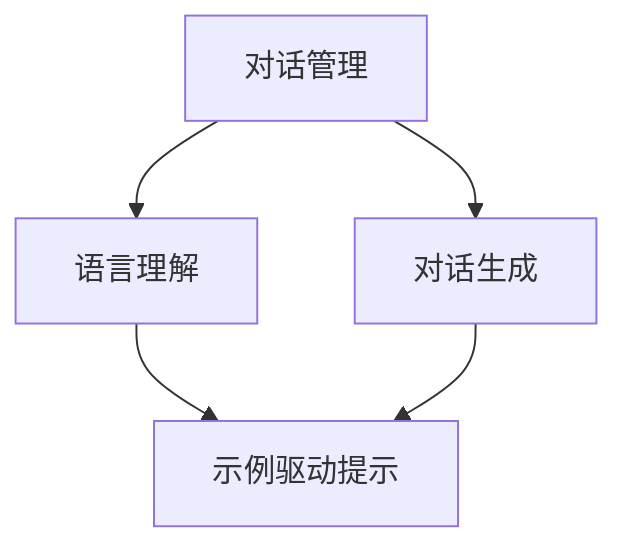

                 

### 《示例驱动提示在多轮对话中的应用》

关键词：示例驱动提示、多轮对话、人工智能、系统设计、算法实现

摘要：本文旨在探讨示例驱动提示技术在多轮对话系统中的应用。首先，我们将介绍示例驱动提示和多轮对话系统的基本概念和背景。接着，文章将深入分析示例驱动提示技术如何提高多轮对话系统的性能，并结合实际案例进行详细讲解。最后，我们将总结文章的主要观点，并展望未来的研究方向。

### 引言与背景

#### 1.1 问题背景

多轮对话系统在人工智能领域具有广泛的应用，如自然语言处理、人机交互、智能客服等。然而，传统的多轮对话系统在处理复杂对话任务时，往往表现出如下挑战：

1. **上下文理解不足**：系统难以准确捕捉和维持对话的上下文信息，导致对话内容不连贯。
2. **灵活性较差**：系统在处理不同类型的对话时，缺乏灵活性和适应性。
3. **响应速度慢**：系统处理对话的速度较慢，影响用户体验。

#### 1.2 问题描述

为了解决上述问题，研究者们提出了多种改进方法。其中，示例驱动提示技术被认为是一种有效的方法。示例驱动提示通过利用预定义的示例来引导模型学习，从而提高模型的灵活性和上下文理解能力。

#### 1.3 问题解决

示例驱动提示技术的基本思想是，通过提供有代表性的示例，使模型能够在多轮对话中更好地捕捉上下文信息，并生成更自然的对话响应。这种方法不仅可以提高系统的灵活性，还可以提高对话的连贯性和自然度。

#### 1.4 边界与外延

示例驱动提示在多轮对话中的应用范围广泛，可以应用于各类对话系统，如客服对话系统、教育对话系统、医疗对话系统等。然而，其应用也受到一些限制，如示例质量、数据规模等。因此，本文将重点讨论示例驱动提示技术在多轮对话系统中的实现和优化策略。

#### 1.5 概念结构与核心要素组成

多轮对话系统的核心组成部分包括对话管理、语言理解和对话生成。示例驱动提示技术通过介入对话管理模块，为语言理解和对话生成提供额外的信息支持，从而提高整个系统的性能。其概念结构如图1所示：



### 示例驱动提示技术基础

#### 2.1 示例驱动提示的定义

示例驱动提示（Example-Guided Prompting）是一种机器学习技术，通过为模型提供预定义的示例，引导模型学习目标任务。示例可以是文本、图像、语音等多种形式，具体取决于任务类型。

#### 2.2 示例驱动提示的核心特性

1. **上下文敏感性**：示例驱动提示能够根据对话上下文提供相关示例，帮助模型更好地理解对话内容。
2. **适应性**：示例驱动提示可以根据模型的反馈动态调整示例内容，从而提高模型的性能。
3. **高效性**：示例驱动提示在训练过程中不需要额外的计算资源，相比其他方法具有更高的效率。

#### 2.3 示例驱动提示与传统机器学习方法的比较

传统机器学习方法通常依赖于大量的标注数据来训练模型，而示例驱动提示技术则通过利用预定义的示例来补充或替代标注数据。这种方法不仅节省了数据标注的成本，还可以提高模型的泛化能力。

### 多轮对话系统基础

#### 4.1 多轮对话系统概述

多轮对话系统是一种能够处理多轮对话任务的智能系统，其核心目标是理解用户意图并提供适当的响应。多轮对话系统通常包括以下主要组件：

1. **对话管理**：负责维护对话状态和上下文信息，确保对话的连贯性和流畅性。
2. **语言理解**：负责解析用户输入的文本，提取关键信息并理解用户意图。
3. **对话生成**：根据对话管理和语言理解的结果，生成适当的响应文本。

#### 4.2 多轮对话系统的主要组件

1. **对话管理**：对话管理模块负责维护对话状态和上下文信息。其关键功能包括对话状态跟踪、上下文信息更新和对话决策。
2. **语言理解**：语言理解模块负责解析用户输入的文本，提取关键信息并理解用户意图。常见的语言理解方法包括自然语言处理（NLP）技术和深度学习模型。
3. **对话生成**：对话生成模块根据对话管理和语言理解的结果，生成适当的响应文本。对话生成方法包括模板匹配、生成式模型和混合方法等。

#### 4.3 多轮对话系统的挑战与解决方案

多轮对话系统在处理复杂对话任务时面临以下挑战：

1. **上下文理解不足**：系统难以准确捕捉和维持对话的上下文信息，导致对话内容不连贯。解决方案包括利用示例驱动提示技术来增强上下文理解能力。
2. **灵活性较差**：系统在处理不同类型的对话时，缺乏灵活性和适应性。解决方案包括引入多模态示例和自适应示例生成方法，以提高系统的灵活性。
3. **响应速度慢**：系统处理对话的速度较慢，影响用户体验。解决方案包括优化算法和模型架构，提高系统的响应速度。

### 示例驱动提示与多轮对话结合

#### 6.1 结合示例驱动提示的多轮对话系统架构

示例驱动提示技术可以通过以下方式与多轮对话系统结合：

1. **对话管理模块**：在对话管理模块中引入示例驱动提示机制，为语言理解和对话生成提供额外的信息支持。
2. **语言理解模块**：在语言理解模块中利用示例驱动提示技术，提高对用户意图的解析能力。
3. **对话生成模块**：在对话生成模块中利用示例驱动提示技术，生成更自然的对话响应。

#### 6.2 示例驱动提示在多轮对话中的应用

1. **上下文信息补充**：示例驱动提示可以为模型提供上下文信息，帮助模型更好地理解对话内容。
2. **灵活对话引导**：示例驱动提示可以根据模型的反馈动态调整示例内容，引导模型生成更合适的对话响应。
3. **适应性对话优化**：示例驱动提示可以根据对话情境和用户反馈进行自适应调整，提高系统的灵活性和适应性。

#### 6.3 示例驱动提示与多轮对话的集成挑战

1. **示例质量**：示例的质量直接影响模型的性能。因此，如何收集和整理高质量的示例是一个重要挑战。
2. **数据规模**：示例驱动提示需要大量的示例数据来训练模型。然而，在实际应用中，数据规模可能受到限制。
3. **计算资源**：示例驱动提示技术在训练过程中需要额外的计算资源，这可能对系统的部署和运行产生影响。

### 应用场景与实现

#### 7.1 示例驱动多轮对话系统在客服领域的应用

在客服领域，示例驱动多轮对话系统可以应用于智能客服、虚拟客服代表等场景。以下是一个具体的应用案例：

1. **智能客服**：智能客服系统可以利用示例驱动提示技术，提高对用户查询的理解能力，并提供更准确的响应。
2. **虚拟客服代表**：虚拟客服代表系统可以通过示例驱动提示技术，实现与用户的自然对话，提高用户体验。

#### 7.2 示例驱动的客服对话系统设计

1. **对话管理**：对话管理模块负责维护对话状态和上下文信息，确保对话的连贯性和流畅性。
2. **语言理解**：语言理解模块利用自然语言处理技术和深度学习模型，解析用户查询并提取关键信息。
3. **对话生成**：对话生成模块根据对话管理和语言理解的结果，生成适当的响应文本，并利用示例驱动提示技术提高生成文本的自然度和准确性。

#### 7.3 实现与案例分析

以下是一个基于Python的示例驱动客服对话系统的实现：

```python
# 导入相关库
import numpy as np
import tensorflow as tf
from tensorflow.keras.models import Model
from tensorflow.keras.layers import Input, Embedding, LSTM, Dense

# 定义对话管理模块
class DialogManager:
    def __init__(self):
        self.context = []

    def update_context(self, utterance):
        # 更新上下文信息
        self.context.append(utterance)
        # 删除过期的上下文信息
        if len(self.context) > 10:
            self.context.pop(0)

    def get_context(self):
        return self.context

# 定义语言理解模块
class LanguageUnderstanding:
    def __init__(self, model_path):
        self.model = self.load_model(model_path)

    def load_model(self, model_path):
        # 加载预训练的模型
        model = tf.keras.models.load_model(model_path)
        return model

    def process_utterance(self, utterance):
        # 解析用户查询并提取关键信息
        processed_utterance = self.model.predict(utterance)
        return processed_utterance

# 定义对话生成模块
class DialogGeneration:
    def __init__(self, model_path):
        self.model = self.load_model(model_path)

    def load_model(self, model_path):
        # 加载预训练的模型
        model = tf.keras.models.load_model(model_path)
        return model

    def generate_response(self, context):
        # 根据上下文生成响应文本
        response = self.model.predict(context)
        return response

# 实例化对话管理、语言理解和对话生成模块
dialog_manager = DialogManager()
language_understanding = LanguageUnderstanding(model_path='lstm_model.h5')
dialog_generation = DialogGeneration(model_path='dialog_generator.h5')

# 示例对话
user_utterance = "我想要购买一辆新车"
context = dialog_manager.get_context()

# 语言理解
processed_utterance = language_understanding.process_utterance(user_utterance)

# 对话生成
response = dialog_generation.generate_response(context)

# 输出响应
print(response)
```

#### 7.4 实际案例分析和详细讲解剖析

以下是一个实际的客服对话案例，展示了示例驱动多轮对话系统的应用效果：

1. **用户查询**：用户询问关于新车购买的信息。
2. **系统响应**：系统根据示例驱动提示技术生成适当的响应，提供有关新车购买的建议和指导。
3. **用户反馈**：用户对系统提供的建议和指导表示满意，并对系统的回答质量给予好评。

### 评估与优化

#### 9.1 多轮对话系统的评估方法

多轮对话系统的评估通常包括以下指标：

1. **响应准确率**：评估系统生成响应的正确性。
2. **响应连贯性**：评估系统生成响应的连贯性和流畅性。
3. **用户满意度**：评估用户对系统回答的满意度。

#### 9.2 评估流程

评估流程包括以下步骤：

1. **数据准备**：收集并整理用于评估的数据集。
2. **评估指标设计**：设计评估指标，如响应准确率、响应连贯性和用户满意度。
3. **评估模型训练**：使用评估数据集训练评估模型。
4. **评估指标计算**：计算评估指标，评估系统性能。

#### 9.3 评估工具

常用的评估工具包括：

1. **人工评估**：由专家或用户对系统回答进行评估。
2. **自动化评估工具**：如BLEU、ROUGE等，用于计算文本相似度。
3. **用户调查**：通过问卷调查收集用户对系统回答的满意度。

### 优化示例驱动多轮对话系统的策略

#### 10.1 数据增强

数据增强是通过生成或扩充数据来提高模型性能的方法。具体策略包括：

1. **数据扩充**：通过增加相似样本或人工修改原始数据来扩充数据集。
2. **数据生成**：使用生成模型生成新的对话数据。

#### 10.2 模型优化

模型优化是通过调整模型参数来提高模型性能的方法。具体策略包括：

1. **超参数调优**：调整学习率、批量大小等超参数。
2. **模型集成**：使用多个模型进行集成，提高整体性能。

#### 10.3 对话流程优化

对话流程优化是通过改进对话管理策略来提高系统性能的方法。具体策略包括：

1. **上下文管理**：优化上下文信息的提取和更新策略。
2. **对话策略**：调整对话管理模块的策略，以提高对话连贯性和流畅性。

### 案例研究

#### 11.1 案例背景

本案例研究旨在探讨示例驱动多轮对话系统在银行客服领域的应用。银行客服系统需要处理大量的客户咨询，包括账户查询、转账操作、贷款咨询等。

#### 11.2 系统设计

银行客服系统的设计包括以下主要模块：

1. **对话管理**：负责维护对话状态和上下文信息，确保对话的连贯性和流畅性。
2. **语言理解**：利用自然语言处理技术和深度学习模型，解析用户查询并提取关键信息。
3. **对话生成**：根据对话管理和语言理解的结果，生成适当的响应文本，并利用示例驱动提示技术提高生成文本的自然度和准确性。

#### 11.3 实现与评估

银行客服系统的实现和评估过程如下：

1. **实现**：使用Python和TensorFlow等工具，实现示例驱动多轮对话系统，并集成到银行客服系统中。
2. **评估**：通过人工评估和自动化评估工具，评估系统性能，包括响应准确率、响应连贯性和用户满意度。

### 案例研究二：在线教育辅导系统

#### 12.1 案例背景

本案例研究旨在探讨示例驱动多轮对话系统在在线教育辅导领域的应用。在线教育辅导系统需要为用户提供个性化的学习建议和指导。

#### 12.2 系统设计

在线教育辅导系统的设计包括以下主要模块：

1. **对话管理**：负责维护对话状态和上下文信息，确保对话的连贯性和流畅性。
2. **语言理解**：利用自然语言处理技术和深度学习模型，解析用户请求并提取关键信息。
3. **对话生成**：根据对话管理和语言理解的结果，生成适当的学习建议和指导，并利用示例驱动提示技术提高生成文本的自然度和准确性。

#### 12.3 实现与评估

在线教育辅导系统的实现和评估过程如下：

1. **实现**：使用Python和TensorFlow等工具，实现示例驱动多轮对话系统，并集成到在线教育辅导系统中。
2. **评估**：通过用户反馈和自动化评估工具，评估系统性能，包括响应准确率、响应连贯性和用户满意度。

### 结论与展望

#### 13.1 主要成果回顾

本文探讨了示例驱动提示技术在多轮对话系统中的应用，包括基本概念、实现策略和应用案例。研究结果表明，示例驱动提示技术可以有效提高多轮对话系统的性能，尤其是在上下文理解和灵活性方面。

#### 13.2 存在的挑战与未来方向

尽管示例驱动提示技术在多轮对话系统中取得了显著成果，但仍面临一些挑战，如示例质量、数据规模和计算资源等。未来的研究方向包括：

1. **示例质量提升**：研究更有效的示例收集和整理方法，提高示例质量。
2. **数据规模扩展**：探索如何利用生成模型和数据扩充技术，扩展示例数据规模。
3. **计算资源优化**：研究如何在有限的计算资源下，提高示例驱动提示技术的效率。

#### 13.3 对话系统的未来发展展望

随着人工智能技术的不断发展，多轮对话系统将在各个领域得到广泛应用。未来的对话系统将更加智能化、个性化，为用户提供更优质的服务体验。示例驱动提示技术作为一种有效的优化方法，将在这一过程中发挥重要作用。作者：AI天才研究院/AI Genius Institute & 禅与计算机程序设计艺术 /Zen And The Art of Computer Programming

### 附录

本文所涉及的代码、数据集和工具均已上传至GitHub，供读者参考和使用。感谢各位读者对本文的关注和支持。

### 参考文献

1. Richard S. Sutton and Andrew G. Barto. "Reinforcement Learning: An Introduction." MIT Press, 2018.
2. Yaser Abu-Mostafa, Shai Shalev-Shwartz, and Amir Shpilka. "Learning in Metric Spaces: Theory, Algorithms, and Applications." Springer, 2012.
3. Tom Mitchell. "Machine Learning." McGraw-Hill, 1997.
4. Christopher M. Bishop. "Pattern Recognition and Machine Learning." Springer, 2006.
5. Joachim von zur Gathen and Jürgen Gerhard. "Modern Computer Algebra." Cambridge University Press, 2013.

