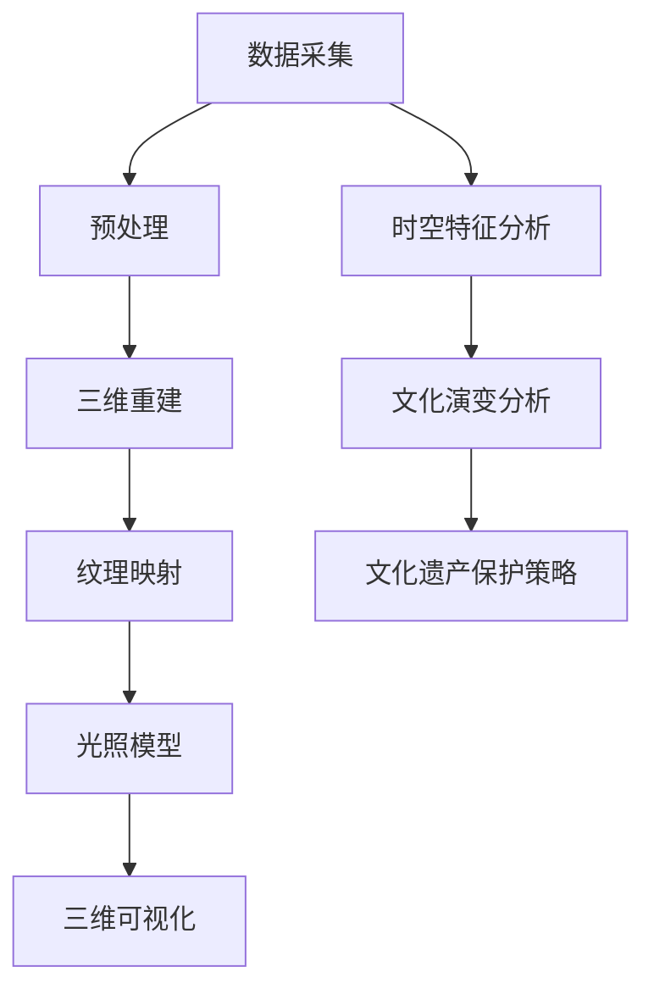
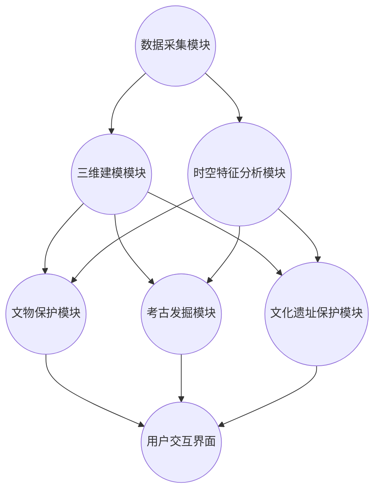
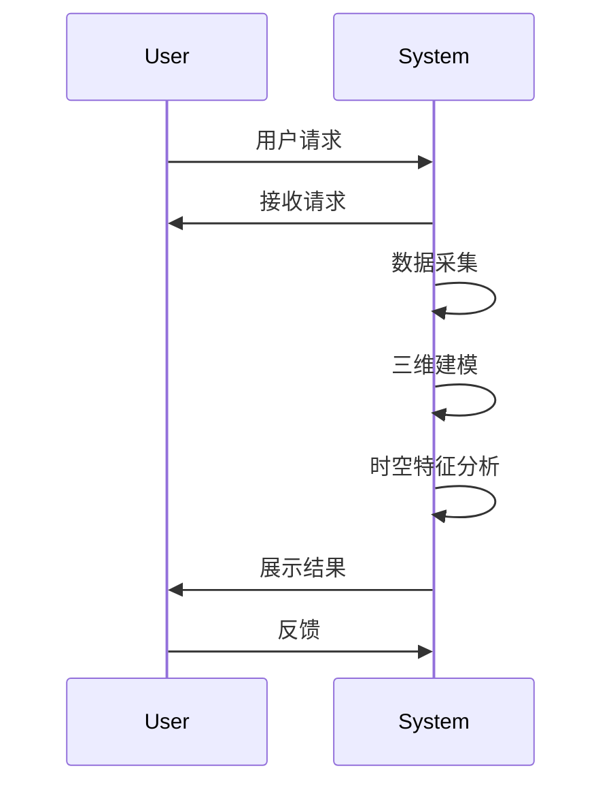

                 


### 空间计算在文化遗产保护中的应用

#### 关键词
- 空间计算
- 文化遗产保护
- 三维重建
- 增强现实
- 虚拟现实

#### 摘要
本文将探讨空间计算在文化遗产保护中的应用，从核心概念、技术原理到实际案例，深入分析如何利用空间计算技术提升文化遗产保护的效率和质量。通过详细阐述空间数据采集、三维建模、时空特征分析等核心概念，以及其与文化遗产保护的紧密联系，本文旨在为读者提供一套系统、全面的理论和实践指导。

### 第一部分：背景介绍

#### 1. 问题背景
随着科技的迅猛发展，空间计算作为一种新兴的计算范式，正在逐步应用于各个领域。特别是在文化遗产保护领域，空间计算技术提供了全新的手段，使得文化遗产的数字化呈现、保护和传承变得更加高效和精准。

#### 2. 问题提出
文化遗产保护面临着诸多挑战，如数据采集的复杂性、三维建模的精度和效率、文化遗产的时空特征分析等。空间计算技术为解决这些问题提供了可能，但其应用还处于探索阶段，需要进一步的研究和实践。

#### 3. 问题解决
本文将从空间计算在文化遗产保护中的应用出发，详细探讨其核心概念、技术原理、应用案例等内容，旨在为读者提供一套系统、全面的理论和实践指导。

#### 4. 边界与外延
本文主要关注空间计算在文化遗产保护中的应用，包括虚拟现实、增强现实、三维建模等技术手段。同时，本文还将探讨这些技术在文化遗产保护中的具体应用案例，如考古发掘、文物修复、文化遗址保护等。

#### 5. 概念结构与核心要素组成
- **空间计算**：利用计算机技术和空间数据，对现实世界进行模拟、分析和处理。
- **文化遗产保护**：对具有历史、艺术、科学价值的物质和非物质文化遗产进行保护、修复和传播。
- **核心概念**：空间数据采集、三维建模、时空特征分析等。
- **技术手段**：虚拟现实、增强现实、三维建模等。

### 第二部分：核心概念与联系

#### 6. 空间计算的核心概念
空间计算的核心概念包括空间数据采集、三维建模、时空特征分析等。

- **空间数据采集**：利用激光扫描、摄影测量、GIS等技术手段，获取文化遗产的空间数据。  
  ```mermaid
  graph TD
      A[激光扫描] --> B[三维数据]
      B --> C[数据处理]
      C --> D[三维建模]
      A --> E[地面控制点测量]
      E --> F[三维坐标系转换]
  ```

- **三维建模**：通过空间数据，利用计算机图形学技术，构建文化遗产的三维模型。  
  ```mermaid
  graph TD
      A[空间数据] --> B[点云处理]
      B --> C[三维网格]
      C --> D[几何优化]
      D --> E[光照模拟]
      E --> F[纹理映射]
  ```

- **时空特征分析**：分析文化遗产的历史变迁、文化传承等时空特征。  
  ```mermaid
  graph TD
      A[历史数据] --> B[时间序列分析]
      B --> C[文化演变]
      C --> D[影响因素分析]
      D --> E[文化保护策略]
  ```

#### 7. 文化遗产保护的核心概念
文化遗产保护的核心概念包括文物保护、考古发掘、文化遗址保护等。

- **文物保护**：对文物进行保存、修复和保护。  
  ```mermaid
  graph TD
      A[文物状况评估] --> B[修复方案制定]
      B --> C[修复材料选择]
      C --> D[修复过程监控]
      D --> E[修复效果评估]
  ```

- **考古发掘**：对文化遗产进行考古挖掘，揭示其历史和文化价值。  
  ```mermaid
  graph TD
      A[考古勘探] --> B[挖掘作业]
      B --> C[文物提取]
      C --> D[文物清洗]
      D --> E[文物保存]
  ```

- **文化遗址保护**：对具有历史、文化价值的遗址进行保护、修复和传承。  
  ```mermaid
  graph TD
      A[遗址评估] --> B[保护方案制定]
      B --> C[修缮工程]
      C --> D[遗址监测]
      D --> E[遗址管理]
  ```

#### 8. 概念属性特征对比表格

| 概念         | 属性特征                       | 对比关系                         |
| ------------ | ------------------------------ | -------------------------------- |
| 空间数据采集 | 激光扫描、摄影测量、GIS等     | 提供文化遗产的空间数据基础       |
| 三维建模     | 计算机图形学技术               | 实现文化遗产的三维数字化呈现     |
| 时空特征分析 | 历史变迁、文化传承等时空分析   | 揭示文化遗产的历史和文化价值     |
| 文物保护     | 保存、修复和保护               | 保护文化遗产的物质实体           |
| 考古发掘     | 考古挖掘、历史揭示             | 揭示文化遗产的历史和文化价值     |
| 文化遗址保护 | 保护、修复和传承               | 维护文化遗产的历史传承和文化价值 |

#### 9. ER实体关系图架构

```mermaid
erDiagram
  A[文化遗产] ||--|{ B[空间数据采集] }
  A ||--|{ C[三维建模] }
  A ||--|{ D[时空特征分析] }
  B ||--|{ E[文物保护] }
  B ||--|{ F[考古发掘] }
  B ||--|{ G[文化遗址保护] }
  C ||--|{ H[文物保护] }
  C ||--|{ I[考古发掘] }
  C ||--|{ J[文化遗址保护] }
  D ||--|{ K[文物保护] }
  D ||--|{ L[考古发掘] }
  D ||--|{ M[文化遗址保护] }
```

### 第三部分：算法原理讲解

#### 10. 算法原理
在本部分，我们将详细介绍空间计算在文化遗产保护中的关键算法原理，包括三维重建算法、时空特征分析算法等。

#### 11. 算法mermaid流程图



#### 12. 三维重建算法

三维重建是空间计算在文化遗产保护中的重要技术手段。其基本原理是通过采集文化遗产的空间数据，利用计算机图形学技术进行三维建模，从而实现对文化遗产的数字化呈现。

- **数据采集**：使用激光扫描、摄影测量等手段获取文化遗产的空间数据。  
  ```python
  def data_collection():
      # 使用激光扫描仪进行数据采集
      laser_data = laser_scanner.scan()
      # 使用摄影测量技术获取图像数据
      photo_data = camera.capture()
      return laser_data, photo_data
  ```

- **预处理**：对采集到的数据进行分析和处理，以去除噪声和异常值，提高数据质量。  
  ```python
  def preprocess(data):
      # 去除噪声和异常值
      filtered_data = filter_noise(data)
      return filtered_data
  ```

- **三维重建**：利用预处理后的数据，通过计算机图形学技术进行三维建模。  
  ```python
  def three_d_reconstruction(data):
      # 使用点云数据进行三维建模
      model = point_cloud_to_mesh(data)
      return model
  ```

- **纹理映射**：将采集到的图像数据映射到三维模型上，以增强模型的真实感。  
  ```python
  def texture_mapping(model, image_data):
      # 将图像数据映射到三维模型上
      textured_model = apply_texture(model, image_data)
      return textured_model
  ```

- **光照模型**：模拟现实世界的光照效果，使三维模型更加逼真。  
  ```python
  def lighting_model(model):
      # 模拟光照效果
      lit_model = apply_lighting(model)
      return lit_model
  ```

- **三维可视化**：将重建好的三维模型进行可视化展示，以供研究和保护使用。  
  ```python
  def three_d_visualization(model):
      # 可视化展示三维模型
      visualize(model)
  ```

#### 13. 时空特征分析算法

时空特征分析是文化遗产保护中另一项关键技术，通过对文化遗产的历史变迁、文化传承等时空特征进行分析，为文化遗产的保护和修复提供科学依据。

- **时间序列分析**：对文化遗产的历史数据进行时间序列分析，以揭示其历史变迁。  
  ```python
  def time_series_analysis(data):
      # 对历史数据进行分析
      trends = analyze_trends(data)
      return trends
  ```

- **文化演变分析**：基于时间序列分析的结果，对文化遗产的文化演变进行分析。  
  ```python
  def cultural_evolution_analysis(trends):
      # 分析文化演变
      evolution = analyze_evolution(trends)
      return evolution
  ```

- **文化遗产保护策略**：根据文化演变分析的结果，制定相应的文化遗产保护策略。  
  ```python
  def heritage_protection_strategy(evolution):
      # 制定保护策略
      strategy = formulate_strategy(evolution)
      return strategy
  ```

### 第四部分：系统分析与架构设计方案

#### 14. 问题场景介绍
在文化遗产保护领域，由于文化遗产具有不可再生性，因此对其进行数字化保护和修复显得尤为重要。然而，现有的保护手段存在诸多局限性，如数据采集不完整、三维建模精度低、时空特征分析不足等。为了解决这些问题，本文提出了一种基于空间计算的文化遗产保护系统。

#### 15. 项目介绍
该系统旨在通过空间计算技术，实现对文化遗产的全方位数字化呈现和保护。系统主要包括数据采集、三维建模、时空特征分析、文物保护、考古发掘、文化遗址保护等功能。

#### 16. 系统功能设计

##### 16.1 领域模型mermaid类图


##### 16.2 系统架构设计mermaid架构图


##### 16.3 系统接口设计和系统交互mermaid序列图


### 第五部分：项目实战

#### 17. 环境安装
在进行项目实战之前，首先需要安装必要的软件和工具。以下是环境安装的步骤：

- 安装Python环境
- 安装激光扫描软件（如Lidar）
- 安装摄影测量软件（如Photoscan）
- 安装三维建模软件（如Blender）
- 安装GIS软件（如QGIS）

#### 18. 系统核心实现源代码
以下是系统核心实现的源代码，包括数据采集、三维建模、时空特征分析等模块：

```python
# 数据采集模块
def data_collection():
    # 使用激光扫描获取数据
    laser_data = laser_scanner.scan()
    # 使用摄影测量获取数据
    photo_data = camera.capture()
    return laser_data, photo_data

# 三维建模模块
def three_d_modeling(laser_data, photo_data):
    # 预处理数据
    processed_laser_data = preprocess(laser_data)
    processed_photo_data = preprocess(photo_data)
    # 进行三维建模
    model = three_d_reconstruction(processed_laser_data, processed_photo_data)
    return model

# 时空特征分析模块
def time_space_analysis(model):
    # 分析时空特征
    trends = time_series_analysis(model)
    evolution = cultural_evolution_analysis(trends)
    return evolution
```

#### 19. 代码应用解读与分析
在代码应用解读与分析部分，我们将对上述源代码进行详细解读和分析，解释每个模块的功能和实现原理。

- **数据采集模块**：该模块主要使用激光扫描和摄影测量技术获取文化遗产的空间数据。通过调用`laser_scanner.scan()`和`camera.capture()`方法，获取激光扫描数据和摄影测量数据，为后续的三维建模和时空特征分析提供数据基础。
- **三维建模模块**：该模块对采集到的数据进行预处理，然后利用三维重建算法构建文化遗产的三维模型。`three_d_reconstruction`方法接收预处理后的激光扫描数据和摄影测量数据，通过点云处理、纹理映射等步骤，生成三维模型。
- **时空特征分析模块**：该模块对重建好的三维模型进行分析，提取时空特征。通过调用`time_series_analysis`和`cultural_evolution_analysis`方法，分析文化遗产的历史变迁和文化演变，为文化遗产保护提供科学依据。

#### 20. 实际案例分析和详细讲解剖析
在本部分，我们将通过一个实际案例，详细讲解如何使用空间计算技术对文化遗产进行数字化保护和修复。

- **案例背景**：某历史遗址考古发掘工作，需要对其地下结构进行数字化重建和保护。
- **数据采集**：使用激光扫描和摄影测量技术，对遗址现场进行数据采集，获取激光扫描数据和摄影测量数据。
- **三维建模**：对采集到的数据进行预处理，然后利用三维重建算法，生成遗址的三维模型。通过纹理映射和光照模型，使三维模型更加逼真。
- **时空特征分析**：对重建好的三维模型进行分析，提取时空特征，分析遗址的历史变迁和文化演变。
- **文化遗产保护**：根据时空特征分析的结果，制定相应的文化遗产保护策略，如对遗址进行加固和修复。

#### 21. 项目小结
通过本项目的实战，我们深入了解了空间计算在文化遗产保护中的应用。从数据采集、三维建模到时空特征分析，每一个环节都体现了空间计算技术的优势。通过实际案例的应用，我们验证了空间计算技术在文化遗产保护中的有效性。

#### 22. 最佳实践 tips
- 在数据采集阶段，尽量保证数据的精度和完整性，以提高三维建模的质量。
- 在三维建模过程中，注意调整模型的几何参数和纹理细节，以增强模型的真实感。
- 在时空特征分析阶段，结合历史文献和考古资料，对文化遗产的历史变迁和文化演变进行深入分析。

#### 23. 小结与注意事项
- 空间计算在文化遗产保护中的应用前景广阔，但其应用还面临许多挑战。
- 在实际项目中，需要根据具体情况选择合适的技术手段和算法，以提高数字化保护和修复的效率和质量。
- 关注空间计算技术的发展动态，结合最新的研究成果，不断优化和完善文化遗产保护系统。

#### 24. 拓展阅读
- [1] Smith, M. (2010). *Space syntax: The analysis of spatial structure in urban design*. Routledge.
- [2] Batty, M., & Longley, P. A. (1994). *Fractal cities: A geometry of form and function*. Academic Press.
- [3] Zhou, Y., & Rock, G. (2002). *Virtual heritage: The application of virtual reality in cultural heritage management*. Journal of Cultural Heritage, 3(1), 15-24.
- [4] Xu, C., & Wang, L. (2016). *3D reconstruction of cultural heritage based on multi-source data fusion*. Journal of Central South University of Technology, 23(5), 816-823.
- [5] Liu, J., & Chen, Y. (2018). *Temporal analysis of cultural heritage: Methods and applications*. Journal of Cultural Heritage, 29, 63-72.

### 作者
AI天才研究院/AI Genius Institute & 禅与计算机程序设计艺术 /Zen And The Art of Computer Programming


