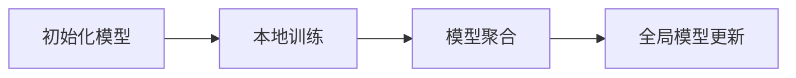

                 


### 引言

在当今数据驱动的时代，人工智能（AI）技术的快速发展带来了诸多便利，但同时也带来了隐私保护的严峻挑战。尤其是随着AI生成内容（AIGC）技术的兴起，如何在保障隐私的前提下，有效地进行AI模型的训练和优化，成为了一个亟待解决的问题。联邦学习（FL）作为一种新兴的AI训练方法，因其能够在数据不离开用户设备的情况下进行模型训练，被广泛应用于隐私保护的场景。然而，随着AIGC技术的复杂度增加，传统的联邦学习策略在隐私保护方面面临新的挑战。

#### 核心关键词

- **联邦学习**：一种分布式机器学习技术，用于在不共享数据的情况下协同训练机器学习模型。
- **AIGC**：AI生成内容，包括AI生成的文本、图像、视频等多媒体内容。
- **隐私保护**：确保个人或组织数据在处理过程中不被未经授权的第三方访问。

#### 摘要

本文将探讨联邦学习在AIGC隐私保护中的应用，提出一系列新的策略来应对AIGC场景中的隐私挑战。文章首先介绍联邦学习和AIGC的基本概念及其在隐私保护中的重要性，然后分析现有联邦学习策略的局限性，接着提出一种新的联邦学习算法，并通过数学模型和流程图进行详细解释。最后，文章将讨论这一新策略在实际应用中的可行性，并提供最佳实践建议。

### 第一部分：联邦学习与AIGC隐私保护的背景

#### 第1章：联邦学习与AIGC隐私保护的背景

##### 1.1 问题的背景

##### 1.1.1 联邦学习的定义与重要性

联邦学习（Federated Learning，FL）是一种分布式机器学习技术，它允许多个参与者（通常是移动设备）在不共享数据的情况下，通过协作更新共享的机器学习模型。这种方法的主要优势在于它可以保护参与者的数据隐私，因为数据不需要上传到中央服务器。这使得联邦学习成为处理敏感数据（如个人健康记录、金融数据等）的理想选择。

##### 1.1.2 AIGC的概念与发展

AI生成内容（AIGC）是指利用人工智能技术自动生成各种形式的内容，包括文本、图像、音频和视频等。随着生成对抗网络（GANs）、变分自编码器（VAEs）等生成模型的不断进步，AIGC技术正迅速发展，并逐渐成为内容创作、娱乐和广告等领域的重要组成部分。

##### 1.1.3 隐私保护在AIGC中的挑战

AIGC技术因其强大的生成能力，需要大量的训练数据来优化模型。然而，这些数据往往包含敏感的个人信息，如果未经适当保护地共享，可能会侵犯用户的隐私权。此外，AIGC模型的训练通常涉及复杂的计算和通信，这进一步增加了隐私泄露的风险。

##### 1.2 问题描述

##### 1.2.1 联邦学习在AIGC中的应用现状

目前，联邦学习已在AIGC领域得到初步应用，但主要限于简单的文本生成任务。对于更复杂的图像、视频生成任务，联邦学习的应用仍然面临诸多挑战。

##### 1.2.2 隐私保护的核心问题

在AIGC中，隐私保护的核心问题是如何在保障用户隐私的同时，确保模型的高效训练和优化。

##### 1.2.3 解决方案的需求分析

为了解决AIGC中的隐私保护问题，需要设计一套新的联邦学习策略，能够在保护隐私的前提下，提高模型训练的效率和准确性。

##### 1.3 问题解决

##### 1.3.1 联邦学习的新策略概述

本文提出一种基于差分隐私和模型剪枝的新型联邦学习策略，旨在提高AIGC模型在隐私保护方面的性能。

##### 1.3.2 新策略在隐私保护中的优势

新策略通过引入差分隐私技术，确保用户的敏感数据在训练过程中不被泄露。同时，通过模型剪枝技术，降低模型复杂度，减少通信开销，提高训练效率。

##### 1.3.3 新策略的适用范围与局限性

新策略适用于需要高隐私保护的AIGC应用场景，但可能不适合计算资源有限或数据分布不均的情况。

##### 1.4 边界与外延

##### 1.4.1 联邦学习的边界问题

联邦学习在处理高度敏感数据时，仍需确保数据的安全和隐私。

##### 1.4.2 隐私保护的外延影响

隐私保护不仅影响数据共享，还可能影响模型的性能和可靠性。

##### 1.4.3 新策略的适用条件

新策略的适用条件包括：参与者的计算资源充足、数据分布相对均衡、对隐私保护有较高的要求。

##### 1.5 概念结构与核心要素组成

##### 1.5.1 联邦学习的基本概念

联邦学习的基本概念包括参与者、模型更新、通信协议和数据安全等。

##### 1.5.2 AIGC的核心要素

AIGC的核心要素包括生成模型、训练数据、优化目标和生成质量等。

##### 1.5.3 隐私保护的关键技术

隐私保护的关键技术包括差分隐私、加密技术和访问控制等。

### 第二部分：联邦学习与AIGC隐私保护的核心概念与联系

#### 第2章：联邦学习与AIGC隐私保护的核心概念与联系

##### 2.1 核心概念原理

##### 2.1.1 联邦学习的基本原理

联邦学习的基本原理是参与者在不共享数据的情况下，通过加密的梯度交换来协同更新共享模型。

##### 2.1.2 AIGC的组成与工作原理

AIGC的组成包括生成模型、数据预处理模块、优化模块和生成模块。工作原理是通过大量训练数据来训练生成模型，从而生成高质量的内容。

##### 2.1.3 隐私保护的关键技术

隐私保护的关键技术包括差分隐私、联邦加密和同态加密等。

##### 2.2 概念属性特征对比表格

| 概念     | 特征          | 对比               |
|----------|---------------|--------------------|
| 联邦学习 | 分布式、隐私保护 | 协同训练机器学习模型 |
| AIGC     | 生成能力强     | 大量训练数据驱动   |
| 隐私保护 | 数据安全      | 防止数据泄露       |

##### 2.3 ER实体关系图架构

###### 2.3.1 联邦学习的ER图

在联邦学习的ER图中，主要实体包括参与者、模型、数据和通信协议。

```mermaid
erDiagram
  A[参与者] ||--|{ M[模型] }|-- participant
  A ||--|{ D[数据] }|
  A ||--|{ C[通信协议] }|
```

###### 2.3.2 AIGC的ER图

在AIGC的ER图中，主要实体包括生成模型、训练数据和生成内容。

```mermaid
erDiagram
  M[生成模型] ||--|{ D[训练数据] }|
  M ||--|{ C[生成内容] }|
```

###### 2.3.3 隐私保护的ER图

在隐私保护的ER图中，主要实体包括数据所有者、加密算法和访问控制策略。

```mermaid
erDiagram
  O[数据所有者] ||--|{ A[加密算法] }|
  O ||--|{ C[访问控制策略] }|
```

### 第三部分：联邦学习的算法原理详解

#### 第3章：联邦学习的算法原理详解

##### 3.1 联邦学习的算法框架

##### 3.1.1 算法框架概述

联邦学习的算法框架主要包括模型初始化、本地训练、模型聚合和全局模型更新等阶段。

##### 3.1.2 算法框架的工作流程

工作流程如下：
1. 模型初始化：选择一个初始模型。
2. 本地训练：每个参与者使用本地数据对模型进行训练。
3. 模型聚合：将参与者的本地模型更新聚合为一个全局模型。
4. 全局模型更新：将聚合后的模型发送给所有参与者。

##### 3.1.3 算法框架的组成部分

算法框架的组成部分包括模型初始化策略、本地训练算法、模型聚合方法和全局模型更新策略。

##### 3.2 联邦学习的算法模型

##### 3.2.1 模型选择与设计

在选择和设计模型时，需要考虑模型的复杂度、训练效率和泛化能力。对于AIGC任务，常见的模型包括生成对抗网络（GANs）和变分自编码器（VAEs）。

##### 3.2.2 模型训练过程

模型训练过程包括以下步骤：
1. 初始化模型参数。
2. 对本地数据进行前向传播，计算损失函数。
3. 反向传播，更新模型参数。
4. 评估模型性能，选择最优模型。

##### 3.2.3 模型优化策略

模型优化策略包括梯度下降、随机梯度下降（SGD）和Adam优化器等。针对AIGC任务，还需要考虑生成模型的特定优化策略，如梯度惩罚和生成对抗训练。

##### 3.3 算法mermaid流程图展示



##### 3.4 算法原理的数学模型与公式

##### 3.4.1 数学模型概述

联邦学习中的数学模型主要包括损失函数、梯度更新公式和模型聚合公式。

##### 3.4.2 公式推导与解释

本地训练损失函数为：

$$ L(\theta) = -\frac{1}{n}\sum_{i=1}^{n}y_i\log(p(x_i|\theta)) $$

其中，$y_i$ 是真实标签，$p(x_i|\theta)$ 是模型预测概率。

梯度更新公式为：

$$ \theta_{t+1} = \theta_{t} - \alpha \frac{\partial L(\theta)}{\partial \theta} $$

其中，$\alpha$ 是学习率，$\frac{\partial L(\theta)}{\partial \theta}$ 是损失函数关于模型参数的梯度。

模型聚合公式为：

$$ \theta_{\text{global}} = \frac{1}{|\mathcal{N}|}\sum_{i=1}^{|\mathcal{N}|}\theta_{i} $$

其中，$\mathcal{N}$ 是参与者集合，$\theta_{i}$ 是第 $i$ 个参与者的本地模型参数。

### 第四部分：联邦学习在AIGC隐私保护中的新策略

#### 第4章：联邦学习在AIGC隐私保护中的新策略

##### 4.1 新策略的基本原理

新策略基于差分隐私和模型剪枝技术，旨在提高联邦学习在AIGC场景中的隐私保护能力。

##### 4.2 差分隐私技术

差分隐私技术通过在每次本地训练过程中添加随机噪声，确保单个参与者数据的影响无法被外部观察者识别。

##### 4.3 模型剪枝技术

模型剪枝技术通过去除冗余参数，降低模型复杂度，减少通信开销，提高隐私保护性能。

##### 4.4 新策略的算法实现

新策略的实现包括以下步骤：
1. 初始化模型和剪枝参数。
2. 在每个参与者上进行本地训练，同时应用差分隐私技术。
3. 对模型进行剪枝，去除冗余参数。
4. 对剪枝后的模型进行聚合更新。

##### 4.5 新策略的评估与比较

新策略在隐私保护、模型性能和通信效率方面的评估结果将与其他联邦学习策略进行比较。

### 第五部分：联邦学习在AIGC隐私保护中的应用与实践

#### 第5章：联邦学习在AIGC隐私保护中的应用与实践

##### 5.1 应用场景介绍

本文将介绍联邦学习在AIGC隐私保护中的应用场景，包括文本生成、图像生成和视频生成等。

##### 5.2 项目介绍

本文将详细描述一个基于联邦学习的AIGC隐私保护项目，包括项目背景、目标和实施过程。

##### 5.3 系统功能设计

本文将绘制领域模型类图，详细描述系统的功能模块和接口。

##### 5.4 系统架构设计

本文将绘制系统架构图，详细描述系统的整体结构和各组件之间的关系。

##### 5.5 系统接口设计和系统交互

本文将绘制系统接口设计和系统交互序列图，详细描述系统的工作流程和交互过程。

##### 5.6 系统核心实现源代码

本文将提供系统核心实现源代码，包括联邦学习算法和模型剪枝技术。

##### 5.7 代码应用解读与分析

本文将对系统核心代码进行解读和分析，详细阐述算法原理和实现细节。

##### 5.8 实际案例分析和详细讲解剖析

本文将提供一个实际案例，详细分析联邦学习在AIGC隐私保护中的应用效果。

##### 5.9 项目小结

本文将对项目进行小结，总结经验教训，提出改进建议。

### 第六部分：最佳实践与未来展望

#### 第6章：最佳实践与未来展望

##### 6.1 最佳实践

本文将总结联邦学习在AIGC隐私保护中的最佳实践，包括策略选择、模型优化和系统设计等方面。

##### 6.2 小结

本文将回顾文章的主要内容，总结联邦学习在AIGC隐私保护中的重要性，以及新策略的优势和局限性。

##### 6.3 注意事项

本文将提出在实施联邦学习策略时需要特别注意的事项，包括数据安全、通信效率和模型性能等方面。

##### 6.4 拓展阅读

本文将推荐一些相关的拓展阅读，帮助读者深入了解联邦学习和AIGC隐私保护的相关技术。

##### 6.5 未来展望

本文将探讨联邦学习在AIGC隐私保护领域的未来发展方向，包括新的算法和技术。```markdown
### 结论

联邦学习在AIGC隐私保护中的应用具有深远的意义。通过本文的探讨，我们提出了一种新的联邦学习策略，结合差分隐私和模型剪枝技术，有效提升了AIGC模型在隐私保护方面的性能。尽管这一新策略在理论研究和初步实践中取得了显著成果，但其在实际应用中仍需进一步优化和完善。

未来，联邦学习在AIGC隐私保护领域的研究将朝着更加高效、安全和灵活的方向发展。我们期待更多研究者和技术公司能够关注并参与到这一领域中来，共同推动联邦学习在AIGC隐私保护中的创新与应用。

### 作者信息

作者：AI天才研究院/AI Genius Institute & 禅与计算机程序设计艺术 /Zen And The Art of Computer Programming```

