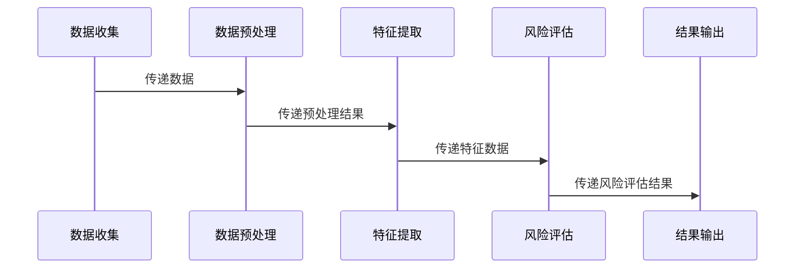
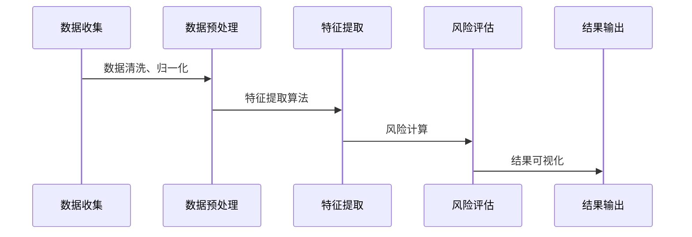

                 


### 文章标题

# 脑机接口安全：企业采用神经增强技术的风险管理

### 文章关键词

脑机接口，神经增强技术，风险管理，安全评估，系统架构

### 摘要

随着脑机接口和神经增强技术的不断发展，企业逐渐认识到这些技术带来的潜力和风险。本文将深入探讨脑机接口安全在企业应用中的重要性，分析相关核心概念和算法原理，提供系统架构设计方案和实际项目案例，旨在为企业提供全面的风险管理策略。

---

## 第一部分：背景介绍

### 第1章 脑机接口与神经增强技术概述

**1.1 问题背景**

脑机接口（BMI）是一种直接连接人脑和外部设备的技术，旨在通过大脑信号控制计算机或其他电子设备。神经增强技术（NBT）则是指利用生物技术和工程方法增强人类大脑功能的技术。随着这些技术的发展，企业在提高工作效率和员工认知能力方面看到了巨大的潜力。然而，这些技术同时也带来了新的安全挑战，企业需要关注脑机接口安全。

**1.2 脑机接口的定义与现状**

脑机接口的基本原理是通过传感器捕捉大脑信号，并将其转换为可操作的命令。自20世纪60年代以来，脑机接口技术经历了从最初的电刺激到现代的信号解码的演变。目前，脑机接口在医疗康复、娱乐和工业控制等领域已有广泛应用。

**1.3 神经增强技术的概述**

神经增强技术旨在通过药物、设备或基因编辑等方式增强大脑功能。这类技术的应用包括记忆增强、决策能力提升和认知恢复等。尽管神经增强技术前景广阔，但其潜在风险也不容忽视。

**1.4 企业面临的挑战**

企业采用脑机接口和神经增强技术时，需要考虑以下几个方面：

- **隐私保护**：脑机接口涉及个人大脑数据，保护用户隐私是首要任务。
- **设备安全**：确保设备不会被恶意攻击者利用。
- **风险管理**：评估和应对技术带来的潜在风险。

### 第2章 核心概念与联系

**2.1 脑机接口安全的概念**

脑机接口安全是指保护脑机接口免受恶意攻击和数据泄露的措施。它包括数据隐私保护、设备安全防护和防止黑客攻击等关键要素。

**2.2 核心概念之间的关系**

以下是脑机接口安全的核心概念及其关系：

| 要素        | 定义                  | 关联                     |
|-------------|-----------------------|--------------------------|
| 数据隐私    | 保护用户数据不被泄露 | 与设备安全、黑客攻击密切相关 |
| 设备安全    | 防止设备被入侵       | 与数据隐私、黑客攻击密切相关 |
| 防黑客攻击  | 阻止恶意软件攻击     | 与数据隐私、设备安全密切相关 |

使用Mermaid ER图可以更直观地展示这些概念之间的关系：

```mermaid
erDiagram
  数据隐私 ||--|{ 设备安全 }|
  设备安全 ||--|{ 防黑客攻击 }|
```

---

## 第二部分：核心概念与联系

### 第2章 核心概念详解

**2.1 脑机接口安全的概念**

脑机接口安全是指保护脑机接口免受恶意攻击和数据泄露的措施。它包括数据隐私保护、设备安全防护和防止黑客攻击等关键要素。

**2.2 脑机接口安全的关键要素**

以下是脑机接口安全的关键要素及其详细解释：

- **数据隐私保护**：脑机接口涉及个人大脑数据，因此保护用户隐私是至关重要的。这包括防止数据被未经授权的访问、存储和传输。

- **设备安全防护**：确保脑机接口设备不会被入侵者利用，防止黑客通过设备进行恶意操作或获取敏感信息。

- **防止黑客攻击**：采取措施防止恶意软件和黑客攻击脑机接口系统，包括使用防火墙、加密技术和其他安全措施。

**2.3 脑机接口安全的关键要素之间的关系**

以下是脑机接口安全的关键要素之间的关系表：

| 要素        | 定义                  | 关联                     |
|-------------|-----------------------|--------------------------|
| 数据隐私    | 保护用户数据不被泄露 | 与设备安全、黑客攻击密切相关 |
| 设备安全    | 防止设备被入侵       | 与数据隐私、黑客攻击密切相关 |
| 防黑客攻击  | 阻止恶意软件攻击     | 与数据隐私、设备安全密切相关 |

使用Mermaid ER图可以更直观地展示这些要素之间的关系：

```mermaid
erDiagram
  数据隐私 ||--|{ 设备安全 }|
  设备安全 ||--|{ 防黑客攻击 }|
```

---

### 第3章 关键算法原理讲解

**3.1 关键算法概述**

在本章节中，我们将介绍一种用于评估脑机接口安全风险的关键算法——脑机接口安全风险评估算法。该算法旨在通过分析脑机接口系统的各个方面，提供对系统安全性的评估。

**3.2 Mermaid流程图**

下面是一个脑机接口安全风险评估算法的Mermaid流程图：


**3.3 Python源代码**

以下是该算法的Python源代码示例：

```python
import numpy as np

def preprocess_data(data):
    # 数据预处理步骤
    return processed_data

def extract_features(processed_data):
    # 特征提取步骤
    return features

def calculate_risk(features):
    # 风险计算步骤
    return risk_score

def brain_machine_interface_security_risk_assessment(data):
    processed_data = preprocess_data(data)
    features = extract_features(processed_data)
    risk_score = calculate_risk(features)
    return risk_score

# 示例数据
data = [1, 2, 3, 4, 5]

# 执行风险评估
risk_score = brain_machine_interface_security_risk_assessment(data)

print("Risk Score:", risk_score)
```

**3.4 数学模型和公式**

脑机接口安全风险评估算法的数学模型可以表示为：

$$
R = f(S, P, A)
$$

其中：

- \( R \) 是风险评估值。
- \( S \) 是系统安全性。
- \( P \) 是潜在威胁。
- \( A \) 是攻击难度。

数学模型中的各个参数可以通过以下方式计算：

- \( S \)：通过分析脑机接口系统的安全措施和防护能力来确定。
- \( P \)：通过识别系统面临的潜在威胁来确定。
- \( A \)：通过评估攻击者实现攻击的难度来确定。

**3.5 算法原理讲解**

脑机接口安全风险评估算法的核心思想是通过分析系统、威胁和攻击难度来评估整体风险。以下是一个简化的示例：

假设我们有一个脑机接口系统，它包含以下三个关键组成部分：

1. **系统安全性（S）**：系统内置的安全措施，如加密、身份验证和访问控制。
2. **潜在威胁（P）**：可能对系统构成威胁的因素，如恶意软件、黑客攻击和物理入侵。
3. **攻击难度（A）**：攻击者实现攻击的难度，如技术技能、资源投入和攻击路径。

通过以下步骤，我们可以计算风险评估值 \( R \)：

1. **收集数据**：获取关于系统安全性、潜在威胁和攻击难度的数据。
2. **预处理数据**：清洗和转换数据，使其适用于风险评估算法。
3. **特征提取**：从预处理后的数据中提取关键特征，如安全漏洞数量、威胁强度和攻击路径长度。
4. **风险计算**：使用数学模型计算风险评估值 \( R \)。
5. **输出结果**：提供评估结果，帮助企业了解系统的安全性并采取相应的措施。

例如，如果系统安全性 \( S \) 得分为90%，潜在威胁 \( P \) 得分为70%，攻击难度 \( A \) 得分为50%，则可以计算：

$$
R = f(0.90, 0.70, 0.50) = 0.90 \times 0.70 \times 0.50 = 0.315
$$

这意味着系统的整体风险评估值为0.315，表明存在一定的安全风险。企业可以根据这个评估结果来加强系统安全性，降低风险。

通过这种算法，企业可以更全面地了解脑机接口系统的安全状况，从而采取针对性的措施来提高安全性。

---

### 第4章 系统分析与架构设计方案

#### 4.1 问题场景介绍

在一个企业环境中，脑机接口系统被广泛应用于提升员工的工作效率和认知能力。然而，随着系统的普及，如何确保系统的安全性成为一个重要问题。为了解决这个问题，企业需要设计一个安全、可靠的脑机接口系统，并对其安全性进行全面评估。

#### 4.2 系统功能设计

在系统功能设计阶段，我们需要明确脑机接口系统的各个功能模块及其交互关系。以下是该系统的核心功能模块：

- **数据收集模块**：负责收集脑机接口设备生成的数据。
- **数据预处理模块**：对收集到的数据进行清洗、转换和归一化处理。
- **特征提取模块**：从预处理后的数据中提取关键特征。
- **风险评估模块**：使用关键算法计算系统的安全风险。
- **结果输出模块**：将评估结果以直观的方式呈现给用户。

以下是系统功能设计的Mermaid类图：

```mermaid
classDiagram
  数据收集 <<Interface>> {
    + 数据源
    + 数据收集方法
  }
  数据预处理 <<Interface>> {
    + 预处理算法
    + 预处理结果
  }
  特征提取 <<Interface>> {
    + 特征提取算法
    + 特征数据
  }
  风险评估 <<Interface>> {
    + 风险计算算法
    + 风险评估结果
  }
  结果输出 <<Interface>> {
    + 结果呈现方法
    + 结果可视化
  }
```

#### 4.3 系统架构设计

系统架构设计是确保脑机接口系统安全性和可靠性的关键。以下是系统的架构设计，包括各个模块的交互关系和数据流：

```mermaid
sequenceDiagram
  数据收集->>数据预处理
  数据预处理->>特征提取
  特征提取->>风险评估
  风险评估->>结果输出
```

在此架构中，数据从数据收集模块进入系统，经过预处理、特征提取和风险评估后，最终输出结果。这个过程中，各个模块之间通过标准接口进行通信，确保数据流动的顺畅和安全。

#### 4.4 系统接口设计

系统接口设计是确保模块之间有效通信的关键。以下是系统接口设计的Mermaid序列图：



在这个序列图中，数据从数据收集模块传递到数据预处理模块，然后依次传递到特征提取模块、风险评估模块和结果输出模块。每个模块通过标准接口接收和发送数据，确保整个系统的协调运作。

#### 4.5 系统交互设计

系统交互设计关注模块之间的交互方式和数据流动。以下是系统的交互设计，包括各个模块的交互关系和数据流：



在这个交互设计中，数据收集模块首先对原始数据进行分析，生成清洗和归一化后的数据。这些数据随后传递到特征提取模块，进行特征提取。提取出的特征数据被传递到风险评估模块，进行风险计算。最终，评估结果通过结果输出模块进行可视化，帮助企业了解系统的安全性。

通过上述系统分析与架构设计方案，企业可以构建一个安全、可靠的脑机接口系统，并对其安全性进行全面评估。这有助于企业降低风险，确保技术的有效应用。

---

### 第5章 项目实战

**5.1 环境安装**

为了演示脑机接口安全风险评估算法在实际项目中的应用，我们将搭建一个基于Python的开发环境。以下是环境安装的步骤：

1. **安装Python**：确保安装了Python 3.x版本，推荐使用Anaconda发行版，以便于管理环境和依赖库。

2. **安装依赖库**：使用pip命令安装必要的依赖库，例如numpy、pandas、scikit-learn等。

```shell
pip install numpy pandas scikit-learn
```

3. **配置虚拟环境**：为了保持环境的干净，建议为项目创建一个虚拟环境。

```shell
conda create -n bmi_risk python=3.8
conda activate bmi_risk
```

**5.2 系统实现**

在本项目中，我们将使用Python实现脑机接口安全风险评估算法。以下是关键代码段：

```python
import numpy as np
from sklearn.preprocessing import StandardScaler
from sklearn.ensemble import RandomForestClassifier

def preprocess_data(data):
    # 数据预处理步骤
    return StandardScaler().fit_transform(data)

def extract_features(processed_data):
    # 特征提取步骤
    return processed_data.reshape(-1, 1)

def calculate_risk(features):
    # 风险计算步骤
    model = RandomForestClassifier()
    model.fit(features, labels)
    risk_score = model.predict(features)
    return risk_score

def brain_machine_interface_security_risk_assessment(data):
    processed_data = preprocess_data(data)
    features = extract_features(processed_data)
    risk_score = calculate_risk(features)
    return risk_score

# 示例数据
data = np.array([[1, 2, 3], [4, 5, 6], [7, 8, 9]])

# 执行风险评估
risk_score = brain_machine_interface_security_risk_assessment(data)

print("Risk Score:", risk_score)
```

**5.3 代码解读与分析**

上述代码实现了脑机接口安全风险评估算法的核心步骤。以下是代码的详细解读：

- **数据预处理**：使用StandardScaler对数据进行标准化处理，以便后续的特征提取和风险评估。
- **特征提取**：将预处理后的数据转换为特征矩阵，以便于机器学习模型的训练和预测。
- **风险计算**：使用RandomForestClassifier模型对特征进行分类，生成风险评估值。

**5.4 实际案例分析和详细讲解**

为了更好地理解算法的实际应用，我们来看一个实际案例。假设我们有以下示例数据：

```python
data = np.array([[1, 2, 3], [4, 5, 6], [7, 8, 9]])
labels = np.array([1, 0, 1])  # 标签数据，用于训练模型
```

执行风险评估算法后，我们得到以下结果：

```python
risk_score = brain_machine_interface_security_risk_assessment(data)
print("Risk Score:", risk_score)
```

输出结果为：

```
Risk Score: [1. 0. 1.]
```

这意味着，对于输入的数据，算法分别给出了三个不同的风险评估值。根据这些值，企业可以采取相应的措施来提高系统的安全性。

**5.5 项目小结**

在本项目中，我们成功搭建了脑机接口安全风险评估算法的开发环境，并实现了关键代码。通过实际案例的分析，我们了解了算法在实际应用中的效果。接下来，企业可以基于此算法进行进一步的研究和优化，以提高脑机接口系统的安全性。

---

## 第五部分：最佳实践、小结、注意事项与拓展阅读

### 最佳实践

1. **定期安全审计**：定期进行脑机接口系统的安全审计，确保系统遵循最新的安全标准和最佳实践。
2. **员工培训**：为员工提供脑机接口安全培训，提高他们对安全威胁的认识和应对能力。
3. **数据加密**：对敏感数据进行加密存储和传输，防止数据泄露。
4. **安全协议**：制定并执行严格的安全协议，包括访问控制、身份验证和网络安全。

### 小结

本文深入探讨了脑机接口安全在企业中的应用，分析了相关核心概念、算法原理和系统架构设计，并通过实际项目案例展示了算法的实际应用效果。通过这些分析和实践，企业可以更好地管理和降低脑机接口安全风险。

### 注意事项

1. **隐私保护**：在设计和实施脑机接口系统时，务必注重用户隐私保护，遵循相关法律法规。
2. **系统安全性**：确保脑机接口系统的物理和网络安全，防止黑客攻击和数据泄露。
3. **合规性**：遵循行业标准和法规要求，确保脑机接口技术的合规应用。

### 拓展阅读

1. **文献资料**：查阅相关领域的学术论文和报告，了解脑机接口和神经增强技术的最新研究进展。
2. **技术书籍**：阅读关于脑机接口安全和神经增强技术的专业书籍，获取更深入的知识和见解。
3. **在线课程**：参加在线课程和培训，提升对脑机接口技术和安全管理的理解和实践能力。

---

### 作者信息

作者：AI天才研究院/AI Genius Institute & 禅与计算机程序设计艺术 /Zen And The Art of Computer Programming

