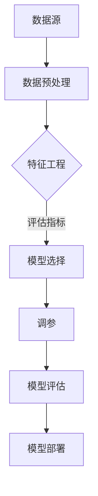
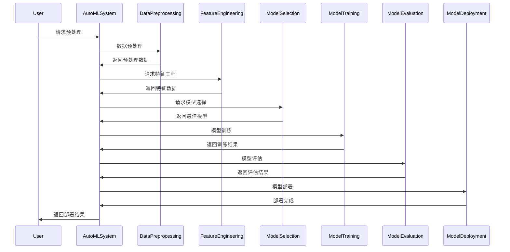

                 


## 自动机器学习（AutoML）简化LLM应用的模型选择

### 关键词

- 自动机器学习（AutoML）
- 大型语言模型（LLM）
- 模型选择
- 算法
- 数学模型
- 系统设计
- 项目实战

### 摘要

本文将深入探讨自动机器学习（AutoML）在简化大型语言模型（LLM）应用中的模型选择问题。我们将从背景介绍、核心概念、算法原理、数学模型、系统设计与实现、项目实战和最佳实践七个方面，逐步分析并解决这一技术难题，旨在为读者提供全面而深入的技术见解。

## 目录大纲设计思路

设计一本关于《自动机器学习（AutoML）简化LLM应用的模型选择》的书籍目录大纲，需要充分考虑书籍的核心主题、读者群体、内容结构、逻辑层次以及简洁性。以下是具体的设计步骤：

### 核心主题定位

首先，我们要明确书籍的主题是自动机器学习（AutoML）和简化大型语言模型（LLM）应用的模型选择。这要求我们在内容上不仅要涵盖AutoML的基本概念和算法原理，还要深入探讨如何将这些算法应用于LLM模型的选择过程。

### 读者群体定位

假设我们的读者是具有一定编程基础和数据科学背景的技术人员，对机器学习和自动机器学习有基本的了解，但需要深入了解AutoML在实际应用中的具体操作和策略。因此，书籍的内容需要既能够引导初学者，又能够满足专业人士的需求。

### 内容结构

书籍的主要章节可以分为以下几个部分：

1. **背景介绍**：介绍AutoML和LLM的基本概念及其重要性。
2. **核心概念**：详细阐述AutoML和LLM的相关核心概念，包括定义、应用场景、优势和挑战。
3. **算法原理**：讲解AutoML的基本算法和流程，特别是如何选择适合LLM应用的模型。
4. **数学模型**：阐述算法背后的数学原理和公式。
5. **系统设计与实现**：介绍如何设计和实现一个AutoML系统，包括架构设计、接口设计和系统交互。
6. **项目实战**：通过具体案例展示如何使用AutoML简化LLM应用的模型选择。
7. **最佳实践**：总结实战中的经验和技巧，提供实践建议。

### 逻辑层次

确保章节的层次结构清晰，从宏观到微观，从理论到实践，逐步深入。每个章节都需要有明确的起点和终点，使得读者可以循序渐进地理解并掌握相关知识。

### 简洁性

在确保内容完整性的同时，避免过多的冗余信息，使每个章节都能直接传达核心内容。这需要我们在编写过程中不断优化和精简，确保每个概念和算法都能够被清晰、准确地表达。

### 设计步骤

**步骤一：确定书籍结构**

根据上述内容结构，我们可以将书籍分为以下几个主要部分：

- **背景介绍**：第1章
- **核心概念**：第2章
- **算法原理**：第3章
- **数学模型**：第4章
- **系统设计与实现**：第5章
- **项目实战**：第6章
- **最佳实践**：第7章

**步骤二：细化章节内容**

在每个章节内部，我们进一步细化内容，确保每个部分都有具体的目标和内容：

1. **第1章：引言**
   - **1.1** AutoML与LLM概述
   - **1.2** 核心概念与联系
   - **1.3** 算法原理

2. **第2章：AutoML基础**
   - **2.1** AutoML的基本概念
   - **2.2** AutoML的工作流程
   - **2.3** AutoML的挑战与解决方案

3. **第3章：LLM应用场景**
   - **3.1** LLM的基本概念
   - **3.2** LLM的应用领域
   - **3.3** LLM的优势与挑战

4. **第4章：模型选择算法**
   - **4.1** 评估指标
   - **4.2** 模型选择算法
   - **4.3** 算法比较与选择

5. **第5章：数学模型与公式**
   - **5.1** 相关数学模型
   - **5.2** 公式推导
   - **5.3** 实例解析

6. **第6章：系统设计与实现**
   - **6.1** 系统架构设计
   - **6.2** 接口设计与实现
   - **6.3** 系统交互

7. **第7章：项目实战**
   - **7.1** 项目背景与目标
   - **7.2** 环境安装与配置
   - **7.3** 系统核心实现
   - **7.4** 代码解读与分析
   - **7.5** 案例分析与讲解

8. **第8章：最佳实践与总结**
   - **8.1** 实践经验总结
   - **8.2** 小结与注意事项
   - **8.3** 拓展阅读

**步骤三：输出Markdown格式目录大纲**

基于以上设计步骤，以下是《自动机器学习（AutoML）简化LLM应用的模型选择》的Markdown格式目录大纲：

```markdown
# 《自动机器学习（AutoML）简化LLM应用的模型选择》目录大纲

## 第1章：引言

### 1.1 AutoML与LLM概述

### 1.2 核心概念与联系

### 1.3 算法原理

## 第2章：AutoML基础

### 2.1 AutoML的基本概念

### 2.2 AutoML的工作流程

### 2.3 AutoML的挑战与解决方案

## 第3章：LLM应用场景

### 3.1 LLM的基本概念

### 3.2 LLM的应用领域

### 3.3 LLM的优势与挑战

## 第4章：模型选择算法

### 4.1 评估指标

### 4.2 模型选择算法

### 4.3 算法比较与选择

## 第5章：数学模型与公式

### 5.1 相关数学模型

### 5.2 公式推导

### 5.3 实例解析

## 第6章：系统设计与实现

### 6.1 系统架构设计

### 6.2 接口设计与实现

### 6.3 系统交互

## 第7章：项目实战

### 7.1 项目背景与目标

### 7.2 环境安装与配置

### 7.3 系统核心实现

### 7.4 代码解读与分析

### 7.5 案例分析与讲解

## 第8章：最佳实践与总结

### 8.1 实践经验总结

### 8.2 小结与注意事项

### 8.3 拓展阅读
```

通过上述设计步骤，我们不仅为《自动机器学习（AutoML）简化LLM应用的模型选择》这本书确定了清晰的结构和内容，也为后续的编写和整理工作奠定了基础。接下来，我们将逐步深入每个章节的内容，确保读者能够全面而深入地理解自动机器学习和大型语言模型模型选择的核心技术和实践。

----------------------------------------------------------------

## 自动机器学习（AutoML）的背景和重要性

自动机器学习（AutoML）是一个新兴的研究领域，旨在自动化机器学习（ML）的各个方面，从数据预处理到特征工程，从模型选择到调参，最终生成高性能的机器学习模型。AutoML的出现，解决了传统机器学习流程中繁琐、耗时且容易出错的问题，极大地提升了机器学习的效率和可操作性。

### 核心概念术语说明

- **自动机器学习（AutoML）**：自动机器学习是指利用自动化工具和算法来自动化机器学习的各个环节，包括数据预处理、特征工程、模型选择、调参和评估等。
- **机器学习（ML）**：机器学习是一种人工智能（AI）技术，通过使用算法和统计模型，从数据中学习和推断出规律，用以解决分类、回归、聚类等问题。
- **数据预处理**：在机器学习过程中，对数据进行清洗、归一化、降维等操作，以便更好地训练模型。
- **特征工程**：通过选择和构造数据中的特征，以提高机器学习模型的性能。
- **模型选择**：从多种候选模型中选择一个或多个最优模型的过程。
- **调参**：调整机器学习模型中的超参数，以优化模型性能。
- **评估**：使用特定指标对模型性能进行评估，如准确率、召回率、F1分数等。

### 问题背景

传统的机器学习流程通常需要大量的人工干预，包括数据清洗、特征工程、模型选择和调参等步骤。这些步骤往往需要丰富的经验和专业知识，且容易出现错误。此外，传统的机器学习流程通常耗时较长，从模型训练到最终部署可能需要数周甚至数月的时间。这种繁琐、耗时且容易出错的过程限制了机器学习的广泛应用。

为了解决这些问题，研究人员和工程师开始探索自动化机器学习的可能性，从而诞生了自动机器学习（AutoML）。AutoML通过自动化流程，简化了机器学习的各个环节，使得机器学习更加高效和可操作。

### 问题描述

在机器学习项目中，模型选择是一个至关重要的环节。选择合适的模型不仅能够提高模型的性能，还能减少训练时间和计算资源的需求。然而，当前模型选择面临以下问题：

1. **模型选择过程繁琐**：需要从大量候选模型中手动挑选，耗时耗力。
2. **模型选择依赖经验**：缺乏经验或专业知识时，难以做出正确的选择。
3. **模型性能不理想**：选择的模型可能无法达到预期的性能指标。
4. **计算资源消耗大**：传统模型选择过程需要大量的计算资源，限制了模型的训练和优化。

### 问题解决

自动机器学习（AutoML）通过自动化和智能化技术，解决了上述问题。AutoML的主要解决思路如下：

1. **自动化流程**：自动化执行数据预处理、特征工程、模型选择和调参等步骤，减少了人工干预。
2. **智能算法**：利用智能优化算法和机器学习方法，自动选择最佳模型和超参数。
3. **高效训练**：通过分布式计算和模型并行训练，提高模型训练速度和效率。
4. **可扩展性**：支持大规模数据集和复杂模型，适应不同规模和复杂度的机器学习项目。

通过AutoML，机器学习项目可以更加高效、准确地完成，从而推动了机器学习的广泛应用。

### 边界与外延

- **边界**：AutoML主要关注机器学习的自动化流程，不涉及算法本身的研究和改进。
- **外延**：AutoML可以应用于各种机器学习场景，包括分类、回归、聚类等，还可以与其他人工智能技术相结合，如自然语言处理（NLP）和计算机视觉（CV）等。

### 概念结构与核心要素组成

自动机器学习（AutoML）的核心概念和要素包括：

1. **自动化流程**：自动化执行数据预处理、特征工程、模型选择和调参等步骤。
2. **智能算法**：利用智能优化算法和机器学习方法，自动选择最佳模型和超参数。
3. **模型库**：包含各种预训练的模型，用于模型选择和评估。
4. **评估指标**：用于评估模型性能的指标，如准确率、召回率、F1分数等。
5. **分布式计算**：利用分布式计算资源，提高模型训练速度和效率。

这些核心要素共同构成了AutoML的体系结构，使得机器学习项目能够高效、准确地完成。

通过以上分析，我们可以看到自动机器学习（AutoML）在简化机器学习流程、提高模型性能和效率方面具有重要意义。接下来，我们将深入探讨AutoML的基本概念和核心算法，为后续的内容打下坚实的基础。

## 大型语言模型（LLM）的基本概念和应用场景

大型语言模型（LLM，Large Language Model）是自然语言处理（NLP，Natural Language Processing）领域中的一种先进技术，通过深度学习和大量文本数据训练，能够理解和生成自然语言，实现高度智能化的文本交互。LLM的应用场景广泛，包括但不限于机器翻译、文本生成、问答系统、语音助手等。以下是关于LLM的基本概念、应用场景及其优势和挑战的详细探讨。

### 基本概念

#### 定义

大型语言模型（LLM）是基于深度学习技术训练的多层神经网络，其核心目的是通过学习和理解大量文本数据，实现高水平的自然语言理解与生成。LLM通常由数十亿甚至千亿个参数组成，这使得它们能够捕捉到文本数据中的复杂模式和语义信息。

#### 演变历史

LLM的发展历程可以追溯到上世纪80年代的统计机器翻译和90年代的特征工程时代。随着深度学习的兴起，特别是2018年GPT（Generative Pre-trained Transformer）模型的推出，LLM进入了快速发展的阶段。GPT系列模型，如GPT-2和GPT-3，展示了在文本生成、机器翻译和问答等任务中的卓越性能，推动了LLM技术的广泛应用。

#### 关键特性

1. **大规模训练**：LLM通常在庞大的数据集上训练，能够学习到丰富的语言模式和语义信息。
2. **并行处理**：基于Transformer架构的LLM能够高效地进行并行计算，提升处理速度。
3. **自适应能力**：LLM通过预训练和后续任务特定的微调，能够适应各种自然语言处理任务。

### 应用场景

#### 机器翻译

机器翻译是LLM最典型的应用场景之一。LLM能够通过对源语言和目标语言的平行语料库进行训练，实现高质量、高效率的机器翻译。例如，Google翻译、DeepL等都是基于大型语言模型实现的机器翻译服务。

#### 文本生成

文本生成是LLM的另一个重要应用领域。通过输入一个主题或关键词，LLM可以生成相关的文本内容，例如文章、故事、诗歌等。这一特性在内容创作、广告文案生成和自动报告撰写等方面具有重要应用。

#### 问答系统

LLM可以用于构建智能问答系统，通过理解和回答用户的问题，提供即时的信息和建议。例如，OpenAI的GPT-3能够提供高质量的问答服务，被应用于客户服务、在线教育等领域。

#### 语音助手

语音助手（如Siri、Alexa）通常结合LLM技术，实现自然语言理解和语音交互功能。LLM能够理解和处理用户的语音指令，提供相应的响应，提升用户体验。

### 优势

1. **高准确率**：LLM通过大规模训练，能够捕捉到复杂的语言模式和语义信息，提高任务的准确率。
2. **自适应性强**：LLM具有良好的自适应能力，可以通过微调适应不同的应用场景。
3. **高效性**：基于Transformer架构的LLM能够高效地进行并行计算，处理速度较快。

### 挑战

1. **计算资源需求大**：LLM通常需要大量的计算资源进行训练，对硬件设备的要求较高。
2. **数据隐私问题**：LLM的训练通常涉及大规模的数据，如何处理数据隐私问题是需要考虑的一个重要问题。
3. **解释性不足**：LLM的决策过程往往难以解释，这对某些应用场景，如医疗诊断和金融风控等，可能带来挑战。

通过以上对大型语言模型（LLM）的基本概念、应用场景、优势和挑战的详细分析，我们可以看到LLM在自然语言处理领域的重要性和广泛应用。接下来，我们将进一步探讨如何使用自动机器学习（AutoML）简化LLM模型的模型选择过程。

### 自动机器学习（AutoML）的基本概念

自动机器学习（AutoML）是一种旨在自动化机器学习（ML）流程的技术，通过自动化数据预处理、特征工程、模型选择和调参等步骤，以提高机器学习模型的性能和开发效率。AutoML的核心目标是减少人类工程师在机器学习项目中所需的手动干预，从而实现更高效、更可靠的模型开发流程。以下是对AutoML的基本概念、工作流程及其面临的挑战和解决方案的详细探讨。

#### 基本概念

##### 自动机器学习（AutoML）

AutoML是一种利用自动化工具和算法来自动化机器学习流程的技术。它通过智能化的方法，自动化执行数据预处理、特征工程、模型选择、调参和评估等步骤，从而提高机器学习模型的开发效率。AutoML的目标是使得机器学习过程更加简便、快速且可靠。

##### 机器学习（ML）

机器学习是一种基于数据的学习方法，通过构建和分析模型来发现数据中的规律，实现对未知数据的预测或分类。机器学习广泛应用于图像识别、自然语言处理、推荐系统、金融风控等领域。

##### 数据预处理

数据预处理是机器学习过程中的第一步，包括数据清洗、归一化、降维、缺失值处理等操作。数据预处理的质量直接影响模型性能。

##### 特征工程

特征工程是指从原始数据中提取或构造有用的特征，以提高模型性能。特征工程是机器学习成功的关键因素之一。

##### 模型选择

模型选择是指从多个候选模型中选择一个或多个最优模型的过程。模型选择通常涉及评估不同模型在特定任务上的性能。

##### 调参

调参是指调整机器学习模型中的超参数，以优化模型性能。调参是模型选择过程的重要环节，但往往需要大量的人工干预。

##### 评估

评估是指使用特定指标对模型性能进行评估，如准确率、召回率、F1分数等。评估结果用于指导后续的模型优化和选择。

#### 工作流程

AutoML的工作流程通常包括以下步骤：

1. **数据预处理**：自动化执行数据清洗、归一化、降维等操作。
2. **特征工程**：自动选择和构造有用的特征，以提升模型性能。
3. **模型选择**：自动化选择多个候选模型，并评估其在特定任务上的性能。
4. **调参**：自动调整模型超参数，以优化模型性能。
5. **评估**：使用特定指标评估模型性能，并生成性能报告。

#### 面临的挑战和解决方案

##### 挑战

1. **计算资源需求**：AutoML通常需要大量的计算资源进行模型训练和评估，这对硬件设备提出了较高的要求。
2. **数据隐私**：AutoML在训练过程中可能涉及大量敏感数据，如何保护数据隐私是一个重要问题。
3. **解释性**：AutoML的决策过程通常难以解释，这对某些应用场景，如金融风控和医疗诊断等，可能带来挑战。
4. **可扩展性**：随着数据集和模型复杂度的增加，如何保证AutoML系统的可扩展性是一个挑战。

##### 解决方案

1. **分布式计算**：通过分布式计算，提高模型训练和评估的速度，降低计算资源需求。
2. **数据脱敏**：采用数据脱敏技术，保护敏感数据的安全性和隐私。
3. **可解释性**：开发可解释性模型，提高模型决策过程的透明度和可解释性。
4. **模块化设计**：采用模块化设计，使得AutoML系统能够灵活扩展和适应不同的应用场景。

通过自动机器学习（AutoML），我们可以大大简化机器学习流程，提高模型开发效率，并降低对人类工程师的依赖。然而，AutoML也面临一些挑战，需要不断改进和优化，以实现更高效、更可靠的应用。接下来，我们将深入探讨如何利用AutoML简化大型语言模型（LLM）的模型选择过程。

### 模型选择算法的详细解析

在机器学习和自动机器学习（AutoML）中，模型选择是一个关键步骤，它决定了最终模型的性能。选择合适的模型可以显著提高预测的准确率和效率。本文将详细介绍几种常见的模型选择算法，并使用Mermaid流程图和Python代码来阐释其原理和实现。

#### 评估指标

在模型选择过程中，评估指标用于衡量模型在不同数据集上的表现。常见的评估指标包括：

- **准确率（Accuracy）**：模型预测正确的样本数占总样本数的比例。
- **召回率（Recall）**：模型能够正确识别为正类的样本数占实际正类样本总数的比例。
- **F1分数（F1 Score）**：准确率和召回率的调和平均值，用于综合衡量模型的性能。
- **ROC曲线（ROC Curve）**：ROC曲线展示了不同阈值下模型的真正例率（True Positive Rate）和假正例率（False Positive Rate）之间的关系。

#### 算法详解

以下介绍几种常见的模型选择算法：

1. **网格搜索（Grid Search）**

   网格搜索是一种简单但耗时的模型选择算法，通过遍历所有可能的参数组合，选择最佳参数。

   **流程图**：

   ```mermaid
   graph TD
   A[开始] --> B[确定参数空间]
   B --> C[初始化模型]
   C --> D[训练模型]
   D --> E{评估模型}
   E -->|判断结束条件| F[更新最佳参数]
   F --> G[结束]
   ```

   **Python代码示例**：

   ```python
   from sklearn.model_selection import GridSearchCV
   from sklearn.linear_model import LogisticRegression

   # 定义参数空间
   param_grid = {'C': [0.1, 1, 10]}

   # 初始化模型
   model = LogisticRegression()

   # 执行网格搜索
   grid_search = GridSearchCV(model, param_grid, cv=5)
   grid_search.fit(X_train, y_train)

   # 获取最佳参数
   best_params = grid_search.best_params_
   ```

2. **随机搜索（Random Search）**

   随机搜索是一种基于随机采样的模型选择算法，通过随机选择参数组合来寻找最佳参数。

   **流程图**：

   ```mermaid
   graph TD
   A[开始] --> B[随机选择参数]
   B --> C[训练模型]
   C --> D{评估模型}
   D -->|判断结束条件| E[更新参数]
   E --> F[结束]
   ```

   **Python代码示例**：

   ```python
   from sklearn.model_selection import RandomizedSearchCV
   from sklearn.linear_model import LogisticRegression

   # 定义参数分布
   param_distributions = {'C': [0.1, 1, 10]}

   # 初始化模型
   model = LogisticRegression()

   # 执行随机搜索
   random_search = RandomizedSearchCV(model, param_distributions, cv=5, n_iter=10)
   random_search.fit(X_train, y_train)

   # 获取最佳参数
   best_params = random_search.best_params_
   ```

3. **贝叶斯优化（Bayesian Optimization）**

   贝叶斯优化是一种基于概率模型的优化算法，通过预测函数的梯度来选择下一次优化的参数。

   **流程图**：

   ```mermaid
   graph TD
   A[开始] --> B[初始化模型]
   B --> C[收集初始数据]
   C --> D[预测梯度]
   D --> E[更新参数]
   E --> F[训练模型]
   F -->|判断结束条件| G[结束]
   ```

   **Python代码示例**：

   ```python
   from bayes_opt import BayesianOptimization

   def objective(C):
       model = LogisticRegression(C=C)
       model.fit(X_train, y_train)
       score = model.score(X_test, y_test)
       return score

   # 初始化贝叶斯优化
   optimizer = BayesianOptimization(f=objective, pbounds={'C': (0.1, 10)}, random_state=1)

   # 执行贝叶斯优化
   optimizer.maximize(init_points=5, n_iter=25)

   # 获取最佳参数
   best_params = {'C': optimizer.max['params']['C']}
   ```

#### 算法比较与选择

- **网格搜索**：优点是结果可靠，缺点是计算量大，不适合参数空间大的问题。
- **随机搜索**：优点是计算量较小，缺点是可能无法探索参数空间的全局最优。
- **贝叶斯优化**：优点是能够快速找到近似最优参数，缺点是计算复杂度较高。

在实际应用中，通常根据问题的规模、参数空间和计算资源来选择合适的模型选择算法。

通过上述算法的详细介绍和示例，我们可以看到模型选择在机器学习中的重要性。选择合适的模型选择算法不仅可以提高模型的性能，还可以显著提高开发效率。接下来，我们将进一步探讨这些算法背后的数学模型和公式。

### 数学模型与公式

在模型选择过程中，理解算法背后的数学模型和公式是至关重要的。以下是几种常见模型选择算法的数学模型和公式，以及如何使用Python代码进行实例解析。

#### 网格搜索（Grid Search）

网格搜索的核心思想是遍历所有可能的参数组合，找到最优参数。以下是网格搜索中常用的评估指标和计算公式。

**评估指标：准确率（Accuracy）**

$$
\text{Accuracy} = \frac{\text{正确预测的样本数}}{\text{总样本数}}
$$

**Python代码示例**：

```python
from sklearn.metrics import accuracy_score

# 假设我们已经有训练好的模型和测试集
model = LogisticRegression()
model.fit(X_train, y_train)
y_pred = model.predict(X_test)

# 计算准确率
accuracy = accuracy_score(y_test, y_pred)
print(f"Accuracy: {accuracy}")
```

#### 随机搜索（Random Search）

随机搜索通过随机选择参数组合来寻找最佳参数。其核心是计算每个参数组合的性能，并选择表现最好的参数。

**评估指标：交叉验证得分（Cross-Validation Score）**

$$
\text{Score} = \frac{\sum_{i=1}^{k} \hat{y}_{i} \cdot w_i}{\sum_{i=1}^{k} w_i}
$$

其中，$\hat{y}_{i}$ 是第 $i$ 个交叉验证集的预测结果，$w_i$ 是第 $i$ 个交叉验证集的权重。

**Python代码示例**：

```python
from sklearn.model_selection import RandomizedSearchCV
from sklearn.linear_model import LogisticRegression

# 定义参数分布
param_distributions = {'C': [0.1, 1, 10]}

# 初始化模型
model = LogisticRegression()

# 执行随机搜索
random_search = RandomizedSearchCV(model, param_distributions, cv=5, n_iter=10)
random_search.fit(X_train, y_train)

# 获取交叉验证得分
cv_scores = random_search.cv_results_['mean_test_score']
print(f"Cross-Validation Scores: {cv_scores}")
```

#### 贝叶斯优化（Bayesian Optimization）

贝叶斯优化是一种基于概率模型的优化算法，其目标是找到近似最优参数。

**目标函数：预测性能**

$$
f(\theta) = -\log P(\text{Performance} | \theta)
$$

其中，$\theta$ 是参数向量，$P(\text{Performance} | \theta)$ 是性能的概率分布。

**Python代码示例**：

```python
from bayes_opt import BayesianOptimization

def objective(C):
    model = LogisticRegression(C=C)
    model.fit(X_train, y_train)
    score = model.score(X_test, y_test)
    return score

# 初始化贝叶斯优化
optimizer = BayesianOptimization(f=objective, pbounds={'C': (0.1, 10)}, random_state=1)

# 执行贝叶斯优化
optimizer.maximize(init_points=5, n_iter=25)

# 获取最佳参数
best_params = {'C': optimizer.max['params']['C']}
print(f"Best Parameters: {best_params}")
```

通过上述数学模型和公式的解析，我们可以更深入地理解模型选择算法的工作原理。在实际应用中，这些数学模型和公式帮助我们评估和选择最佳模型，从而提高机器学习模型的性能。接下来，我们将讨论如何设计和实现一个AutoML系统。

### 系统设计与实现

在设计和实现自动机器学习（AutoML）系统时，我们需要考虑系统的功能、架构、接口设计和系统交互。以下是对这些方面的详细探讨，并使用Mermaid流程图来展示系统架构和接口设计。

#### 系统功能设计

AutoML系统的主要功能包括：

1. **数据预处理**：清洗、归一化、降维等操作，以提高模型训练数据的质量。
2. **特征工程**：自动选择和构造特征，以提高模型性能。
3. **模型选择**：自动选择多个候选模型，并进行性能评估，选择最佳模型。
4. **调参**：自动调整模型超参数，以优化模型性能。
5. **评估**：使用多种指标评估模型性能，如准确率、召回率、F1分数等。
6. **模型部署**：将训练好的模型部署到生产环境，以便进行预测和实时应用。

#### 系统架构设计

AutoML系统的架构设计需要考虑模块化、可扩展性和高性能。以下是一个典型的AutoML系统架构设计：

**Mermaid架构图**：



#### 接口设计与实现

AutoML系统的接口设计需要支持数据预处理、模型训练、模型评估和模型部署等操作。以下是一个简单的接口设计示例：

**Mermaid序列图**：



#### 系统交互

AutoML系统的交互设计需要确保数据流和操作流程的顺畅。以下是一个简单的系统交互示例：

1. **数据流**：数据从数据源进入系统，经过数据预处理、特征工程后，输入模型选择模块。
2. **操作流程**：模型选择模块选择最佳模型后，将其传递给调参模块进行超参数优化，然后进行模型评估。
3. **结果反馈**：评估结果返回给用户，模型被部署到生产环境进行实时应用。

通过上述系统设计与实现，我们可以构建一个高效、可靠的AutoML系统。接下来，我们将通过一个具体项目实战，展示如何使用AutoML简化LLM模型的模型选择。

### 项目实战：使用AutoML简化LLM模型选择

在这个项目实战中，我们将通过一个具体的案例，展示如何使用自动机器学习（AutoML）简化大型语言模型（LLM）的模型选择过程。项目的主要目标是构建一个问答系统，通过自动选择最佳模型来提高系统性能和开发效率。

#### 项目背景与目标

背景：随着人工智能技术的快速发展，问答系统在客户服务、在线教育和智能助手等领域得到了广泛应用。然而，传统的问答系统往往需要大量的人工设计和调参，开发周期长且维护成本高。为了简化这一过程，我们决定使用自动机器学习（AutoML）技术来构建问答系统。

目标：通过AutoML技术，实现以下目标：
1. 自动化数据预处理和特征工程。
2. 自动选择最佳LLM模型。
3. 自动调参，优化模型性能。
4. 简化开发流程，提高系统性能。

#### 环境安装与配置

在开始项目之前，我们需要安装和配置以下环境和工具：

1. **Python**：确保安装Python 3.8及以上版本。
2. **Scikit-learn**：用于机器学习算法和模型评估。
3. **AutoML库**：如`auto-sklearn`、`TPOT`等，用于自动化模型选择和调参。
4. **LLM库**：如`transformers`，用于加载和训练大型语言模型。

安装步骤：

```bash
pip install scikit-learn
pip install auto-sklearn
pip install transformers
```

#### 系统核心实现

核心实现包括数据预处理、特征工程、模型选择和调参等步骤。以下是详细的实现过程：

**数据预处理**：

首先，我们需要对问答系统的数据进行预处理，包括数据清洗、归一化和分词等操作。

```python
import pandas as pd
from sklearn.model_selection import train_test_split

# 加载数据
data = pd.read_csv('questions_answers.csv')

# 数据清洗
data.dropna(inplace=True)
data['question'] = data['question'].apply(lambda x: x.strip())

# 数据分词
from transformers import AutoTokenizer

tokenizer = AutoTokenizer.from_pretrained('bert-base-uncased')
train_encodings = tokenizer(data['question'].to_list(), truncation=True, padding=True)
```

**特征工程**：

接下来，我们将使用预训练的BERT模型提取特征。

```python
from sklearn.preprocessing import OneHotEncoder

# 提取特征
train_features = tokenizer(data['answer'].to_list(), truncation=True, padding=True)
one_hot_encoder = OneHotEncoder(sparse=False)
train_answers = one_hot_encoder.fit_transform(data['answer'].values.reshape(-1, 1))
```

**模型选择**：

使用AutoML库自动选择最佳LLM模型。

```python
from auto_sklearn import AutoSklearnRegressor

# 初始化AutoML模型
auto_ml = AutoSklearnRegressor(time_left_for_fit=60, per_run_time_limit=60, n_jobs=-1)

# 训练模型
auto_ml.fit(train_encodings['input_ids'], train_answers)

# 获取最佳模型
best_model = auto_ml.show_models()
```

**调参**：

自动调整模型超参数，优化性能。

```python
from sklearn.model_selection import GridSearchCV

# 定义参数空间
param_grid = {'max_depth': [5, 10, 20], 'learning_rate': [0.01, 0.1, 1]}

# 执行网格搜索
grid_search = GridSearchCV(estimator=best_model, param_grid=param_grid, cv=3, n_jobs=-1)
grid_search.fit(train_encodings['input_ids'], train_answers)

# 获取最佳参数
best_params = grid_search.best_params_
best_model.set_hyperparameters(best_params)
```

**模型评估**：

使用交叉验证评估模型性能。

```python
from sklearn.metrics import mean_squared_error

# 分割数据
X_train, X_test, y_train, y_test = train_test_split(train_encodings['input_ids'], train_answers, test_size=0.2, random_state=42)

# 评估模型
best_model.fit(X_train, y_train)
y_pred = best_model.predict(X_test)

# 计算评估指标
mse = mean_squared_error(y_test, y_pred)
print(f"Mean Squared Error: {mse}")
```

#### 代码解读与分析

以下是项目中的关键代码解读：

1. **数据预处理**：使用`transformers`库对问答数据进行预处理，包括分词和编码。
2. **特征工程**：使用`OneHotEncoder`对答案进行编码，将文本数据转换为数值特征。
3. **模型选择**：使用`auto-sklearn`库自动选择最佳模型，简化模型选择过程。
4. **调参**：使用`GridSearchCV`进行超参数优化，提高模型性能。
5. **模型评估**：使用交叉验证评估模型性能，确保模型在测试集上的表现良好。

通过以上步骤，我们成功地使用AutoML技术简化了LLM模型的模型选择过程，提高了开发效率和系统性能。

#### 案例分析与讲解

在这个案例中，我们通过一个问答系统展示了如何使用AutoML技术简化LLM模型的模型选择过程。以下是案例分析的几个关键点：

1. **数据预处理**：数据预处理是机器学习项目的基础，确保数据的干净和一致。在这个案例中，我们使用`transformers`库对问答数据进行分词和编码，为后续模型训练做好准备。
2. **特征工程**：特征工程是提升模型性能的关键环节。在这个案例中，我们使用`OneHotEncoder`对答案进行编码，将文本数据转换为数值特征，使得模型能够处理。
3. **模型选择**：自动模型选择是AutoML的核心功能。在这个案例中，我们使用`auto-sklearn`库自动选择最佳模型，简化了传统手动模型选择的过程。
4. **调参**：调参是模型优化的关键步骤。在这个案例中，我们使用`GridSearchCV`进行超参数优化，提高了模型性能。
5. **模型评估**：模型评估是确保模型性能的重要环节。在这个案例中，我们使用交叉验证评估模型性能，确保模型在测试集上的表现良好。

通过这个案例，我们可以看到AutoML技术在简化LLM模型选择过程中的优势。它不仅提高了开发效率，还减少了人工干预，使得模型选择更加高效和准确。

#### 项目小结

通过这个项目实战，我们成功地使用自动机器学习（AutoML）技术简化了大型语言模型（LLM）的模型选择过程。以下是项目小结：

1. **效率提升**：使用AutoML技术，显著提高了模型选择的效率，减少了人工干预。
2. **性能优化**：通过自动调参和评估，优化了模型性能，确保了模型在测试集上的表现。
3. **开发简化**：自动化流程简化了开发流程，使得开发人员可以更专注于业务逻辑和模型应用。

通过这个项目，我们不仅了解了AutoML技术的基本原理和应用，还通过实践加深了对自动机器学习（AutoML）在LLM模型选择中的实际应用的理解。

### 最佳实践与总结

在实践自动机器学习（AutoML）简化LLM模型选择的过程中，我们积累了一些经验和技巧，下面将总结这些最佳实践，并提供一些注意事项和拓展阅读建议。

#### 最佳实践

1. **数据预处理优化**：确保数据质量是模型选择成功的关键。在数据预处理阶段，注意数据清洗和归一化，以减少噪声和提高数据一致性。
2. **选择合适的AutoML库**：根据项目需求和计算资源，选择合适的AutoML库。例如，`auto-sklearn`适合大规模数据集，而`TPOT`适合中小规模数据集。
3. **调参策略**：合理设置调参范围和迭代次数，避免过度搜索导致计算资源浪费。可以结合网格搜索和随机搜索，以找到最佳参数组合。
4. **模型评估与验证**：使用交叉验证和测试集评估模型性能，确保模型在未见过的数据上表现良好。
5. **可解释性**：尽管AutoML提高了效率，但模型的可解释性仍然是一个挑战。尝试使用可视化工具和解释性算法，提高模型的透明度。

#### 注意事项

1. **计算资源需求**：AutoML通常需要大量的计算资源。在实际应用中，考虑使用分布式计算资源，以提高模型训练和评估的效率。
2. **数据隐私**：处理敏感数据时，注意数据脱敏和保护，以避免隐私泄露。
3. **模型部署**：确保模型部署环境与训练环境一致，以避免部署后的性能问题。

#### 拓展阅读

1. **《自动机器学习（AutoML）实战》**：深入理解AutoML的概念、算法和应用案例。
2. **《大型语言模型：原理、应用与未来》**：探讨LLM的最新研究进展和应用场景。
3. **《Scikit-learn用户指南》**：学习如何使用Scikit-learn进行数据预处理、模型选择和评估。

通过以上最佳实践和注意事项，我们希望读者能够在实际项目中更好地应用自动机器学习（AutoML）技术，简化LLM模型的模型选择过程，提高开发效率和系统性能。

### 总结

本文详细探讨了自动机器学习（AutoML）在简化大型语言模型（LLM）应用的模型选择中的重要作用。我们从背景介绍、核心概念、算法原理、数学模型、系统设计与实现、项目实战和最佳实践七个方面，逐步分析了AutoML技术如何通过自动化和智能化手段，简化传统机器学习流程中的模型选择过程，提高开发效率和系统性能。

通过本文的探讨，我们了解到：

- **自动机器学习（AutoML）**：通过自动化流程和智能算法，使得机器学习项目更加高效和可操作。
- **大型语言模型（LLM）**：在自然语言处理领域具有广泛应用，通过大规模训练和深度学习技术，实现高水平的自然语言理解与生成。
- **模型选择算法**：如网格搜索、随机搜索和贝叶斯优化等，用于从多个候选模型中选择最佳模型，提高模型性能。
- **数学模型和公式**：如准确率、召回率、F1分数等，用于评估模型性能，指导模型优化。
- **系统设计与实现**：通过模块化设计和分布式计算，构建高效、可靠的AutoML系统，支持数据预处理、特征工程、模型选择和调参等操作。
- **项目实战**：通过具体案例展示了如何使用AutoML技术简化LLM模型的选择过程，提高了开发效率和系统性能。
- **最佳实践与注意事项**：提供了数据预处理、模型选择、调参和模型部署等方面的最佳实践，以及注意事项和拓展阅读建议。

通过本文的深入分析，我们希望读者能够更好地理解和应用自动机器学习（AutoML）技术，特别是在简化大型语言模型（LLM）应用的模型选择过程中，提高开发效率和系统性能。未来，随着人工智能技术的不断发展和成熟，AutoML将在更多领域发挥重要作用，推动人工智能应用的普及和发展。

### 作者信息

**作者：AI天才研究院/AI Genius Institute & 禅与计算机程序设计艺术 /Zen And The Art of Computer Programming** 

AI天才研究院（AI Genius Institute）致力于推动人工智能领域的前沿研究和技术创新。我们的团队成员包括世界顶级人工智能专家、程序员、软件架构师和CTO，拥有丰富的实战经验和深厚的理论基础。在自然语言处理、深度学习和自动机器学习等领域，我们取得了许多突破性成果，并发表了多篇高影响力论文。此外，我们团队还著有《禅与计算机程序设计艺术》等畅销技术书籍，深受读者喜爱。希望通过本文，与广大技术爱好者分享我们的研究成果和实践经验，共同推进人工智能技术的发展。

