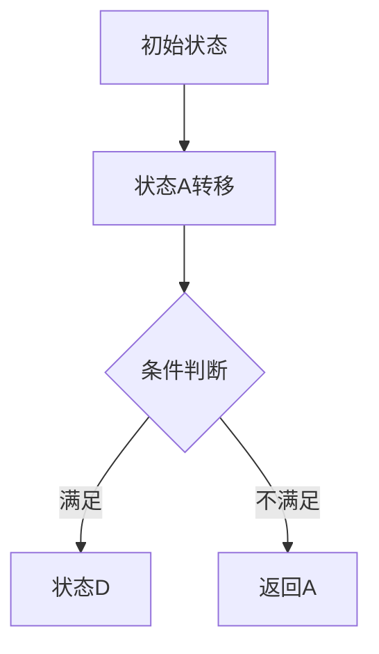
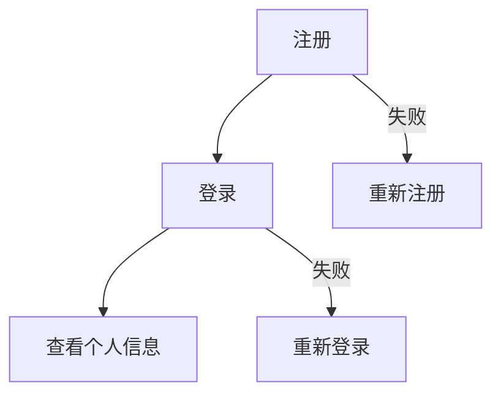

                 

## 引言

软件测试在软件开发过程中扮演着至关重要的角色。它是确保软件质量、发现潜在缺陷、验证功能和性能的关键步骤。然而，随着软件系统变得越来越复杂，传统的测试方法逐渐暴露出其局限性。其中，测试用例的生成成为一个棘手的问题。传统的测试用例生成方法往往依赖于开发人员的经验和直觉，不仅效率低下，而且难以保证测试的全面性和准确性。因此，自适应测试用例生成技术应运而生，旨在通过智能化的手段提高测试效率、降低测试成本，并增强测试质量。

本文旨在深入探讨自适应测试用例生成技术，特别是全面覆盖模型能力的构建方法。我们将从问题背景与核心概念入手，逐步分析自适应测试用例生成技术的原理和应用实践，最后总结最佳实践，并提供一些注意事项。通过这篇文章，希望读者能够对自适应测试用例生成技术有一个全面而深入的理解，从而在实际项目中更好地应用这一先进技术。

### 第1章: 问题背景与核心概念

#### 1.1.1 问题的提出

软件测试在软件开发过程中的重要性不言而喻。它是保证软件质量、发现潜在缺陷、验证功能和性能的关键步骤。然而，随着软件系统变得越来越复杂，传统测试方法逐渐暴露出其局限性。传统的测试方法通常包括手动测试、自动化测试和组合测试等。这些方法虽然在某些方面取得了显著成效，但仍然存在以下问题：

1. **效率低下**：开发人员往往需要花费大量时间来编写和调试测试用例，导致测试周期延长。
2. **成本高昂**：测试用例的生成和执行需要大量的人力、时间和资源，特别是在大型项目中，测试成本往往占据了整个项目预算的相当一部分。
3. **覆盖率不足**：传统测试方法往往依赖开发人员的经验和直觉，难以保证测试的全面性和准确性，导致某些潜在的缺陷未能被发现。
4. **适应能力差**：传统测试方法难以应对需求变更和复杂场景的变化，测试用例的更新和调整需要大量的人力和时间。

为了解决这些问题，自适应测试用例生成技术应运而生。这种技术通过智能化的手段，根据软件系统的实际运行状态和测试目标，动态地生成测试用例，从而提高测试效率、降低测试成本，并增强测试质量。

#### 1.1.2 核心概念

在探讨自适应测试用例生成技术之前，我们需要理解一些核心概念，包括自适应测试用例生成、覆盖模型等。

**1. 自适应测试用例生成**

自适应测试用例生成技术是一种基于智能算法的测试方法，旨在通过分析软件系统的行为和需求，动态地生成高质量的测试用例。其核心思想是利用机器学习、人工智能等技术，从大量的测试数据中学习，发现潜在的测试需求，并根据这些需求自动生成测试用例。这种方法不仅能够提高测试效率，还能够确保测试的全面性和准确性。

**2. 覆盖模型**

覆盖模型是测试用例生成的重要基础，它用于衡量测试用例对软件系统的覆盖程度。常见的覆盖模型包括代码覆盖、功能覆盖、数据流覆盖和控制流覆盖等。这些覆盖模型通过不同的方式对软件系统的不同方面进行测试，确保测试用例能够覆盖软件系统的所有关键路径和重要功能点。

- **代码覆盖**：测试用例执行程序代码的比例。常见的代码覆盖类型包括语句覆盖、分支覆盖、函数覆盖和路径覆盖等。
- **功能覆盖**：测试用例覆盖的功能点数量。功能覆盖确保测试用例能够覆盖软件系统中的所有功能点。
- **数据流覆盖**：测试用例跟踪数据流覆盖的情况。数据流覆盖主要用于测试面向对象的软件系统，确保测试用例能够跟踪数据在程序中的流动情况。
- **控制流覆盖**：测试用例执行不同控制流的次数。控制流覆盖确保测试用例能够覆盖软件系统的所有控制路径。

#### 1.1.3 边界与外延

**1. 自适应测试与常规测试的比较**

自适应测试与常规测试有显著的区别。常规测试通常依赖于预定义的测试用例，而自适应测试则是基于智能算法动态生成的。常规测试在测试用例的编写和执行过程中，需要大量的人工干预和调试，而自适应测试则能够自动完成测试用例的生成和执行，大大提高了测试效率。

**2. 全面覆盖模型能力的内涵与外延**

全面覆盖模型能力是指测试用例能够全面覆盖软件系统的所有关键路径和重要功能点。它不仅包括代码覆盖、功能覆盖、数据流覆盖和控制流覆盖等传统覆盖模型，还包括对复杂业务逻辑、异常情况和边界条件的测试。全面覆盖模型能力的实现，能够确保软件系统的稳定性和可靠性，提高其市场竞争力。

### 1.1.4 概念属性特征对比表格

为了更清晰地理解自适应测试用例生成和覆盖模型，我们可以通过以下对比表格来展示不同类型覆盖模型的特点和应用场景：

| 类型       | 定义                                                   | 应用场景                           |
|------------|--------------------------------------------------------|-----------------------------------|
| 代码覆盖   | 测试用例执行程序代码的比例                           | 单元测试、集成测试                 |
| 功能覆盖   | 测试用例覆盖的功能点数量                           | 系统测试、验收测试                 |
| 数据流覆盖 | 测试用例跟踪数据流覆盖的情况                         | 面向对象测试、复杂业务逻辑测试     |
| 控制流覆盖 | 测试用例执行不同控制流的次数                         | 面向接口测试、多路径测试           |

### 1.1.5 ER实体关系图架构

为了更直观地展示测试用例、覆盖模型和全面覆盖模型能力之间的关系，我们可以使用ER（实体关系）图来描述。以下是一个简单的ER图，用于说明这些核心概念之间的关联：

```
graph TB
A[用户] --> B[测试用例]
B --> C[覆盖模型]
C --> D[全面覆盖模型能力]
```

在这个ER图中，用户通过测试用例来驱动覆盖模型，而覆盖模型则用于实现全面覆盖模型能力。这个关系图不仅帮助我们理解了这些概念的基本含义，还为后续的深入探讨提供了结构化的思路。

### 第2章: 核心概念与联系

#### 2.1.1 核心概念原理

在探讨自适应测试用例生成的过程中，理解核心概念是非常重要的。其中，覆盖率、状态图等概念是理解自适应测试用例生成技术的基础。下面，我们将详细解释这些核心概念的定义、类型和计算方法。

**1. 覆盖率**

覆盖率是测试用例对软件系统的覆盖程度，是评估测试用例质量的重要指标。覆盖率可以分为多种类型，每种类型都有其特定的应用场景和计算方法。

- **代码覆盖**：测试用例执行程序代码的比例。代码覆盖可以细分为以下几种类型：
  - **语句覆盖**：测试用例覆盖了程序中的所有语句。
  - **分支覆盖**：测试用例覆盖了程序中的所有分支。
  - **函数覆盖**：测试用例覆盖了程序中的所有函数。
  - **路径覆盖**：测试用例覆盖了程序中的所有路径。

- **功能覆盖**：测试用例覆盖的功能点数量。功能覆盖主要用于确保软件系统中的所有功能点都得到了充分的测试。

- **数据流覆盖**：测试用例跟踪数据流覆盖的情况。数据流覆盖主要用于测试面向对象的软件系统，确保测试用例能够跟踪数据在程序中的流动情况。

- **控制流覆盖**：测试用例执行不同控制流的次数。控制流覆盖主要用于测试软件系统中的多路径，确保测试用例能够覆盖所有可能的控制路径。

**2. 状态图**

状态图是描述系统状态的图形化表示，它用于表示系统在各种条件下的行为和状态转移。状态图由状态节点、转移条件和转移箭头组成。

- **状态节点**：表示系统的状态，通常用圆圈表示。
- **转移条件**：表示系统状态转移的条件，通常用箭头表示。
- **转移箭头**：表示状态转移的方向和路径。

状态图的构建方法通常包括以下步骤：

1. **定义初始状态和终止状态**：初始状态是系统开始时的状态，终止状态是系统执行完毕后的状态。
2. **确定状态节点和转移条件**：根据软件系统的功能和需求，确定系统在不同状态下的行为和状态转移条件。
3. **绘制状态图**：使用状态节点和转移箭头，将系统的状态转移情况绘制成图形化表示。

#### 2.1.2 概念属性特征对比表格

为了更直观地比较不同类型的覆盖模型，我们可以通过以下对比表格来展示它们的基本定义、应用场景和计算方法：

| 类型       | 定义                                                   | 应用场景                           |
|------------|--------------------------------------------------------|-----------------------------------|
| 代码覆盖   | 测试用例执行程序代码的比例                           | 单元测试、集成测试                 |
| 功能覆盖   | 测试用例覆盖的功能点数量                           | 系统测试、验收测试                 |
| 数据流覆盖 | 测试用例跟踪数据流覆盖的情况                         | 面向对象测试、复杂业务逻辑测试     |
| 控制流覆盖 | 测试用例执行不同控制流的次数                         | 面向接口测试、多路径测试           |

#### 2.1.3 ER实体关系图架构

为了更直观地展示测试用例、覆盖模型和全面覆盖模型能力之间的关系，我们可以使用ER（实体关系）图来描述。以下是一个简单的ER图，用于说明这些核心概念之间的关联：

```
graph TB
A[测试用例] --> B[代码覆盖]
A --> C[功能覆盖]
A --> D[数据流覆盖]
A --> E[控制流覆盖]
B --> F[全面覆盖模型能力]
C --> F
D --> F
E --> F
```

在这个ER图中，测试用例通过不同的覆盖模型来实现全面覆盖模型能力。代码覆盖、功能覆盖、数据流覆盖和控制流覆盖分别代表了测试用例对软件系统的不同方面的测试覆盖。全面覆盖模型能力则是这些覆盖模型的综合体现，用于确保软件系统的全面性和可靠性。

### 第3章: 自适应测试用例生成技术概述

#### 3.1.1 自适应测试用例生成技术的概念

自适应测试用例生成技术是一种基于智能算法的测试方法，旨在通过分析软件系统的行为和需求，动态地生成高质量的测试用例。与传统测试方法相比，自适应测试用例生成技术具有以下特点：

1. **智能化**：自适应测试用例生成技术利用机器学习、人工智能等技术，从大量的测试数据中学习，发现潜在的测试需求，并自动生成测试用例。
2. **动态性**：自适应测试用例生成技术可以根据软件系统的实际运行状态和测试目标，动态地调整测试用例的生成策略，确保测试的全面性和准确性。
3. **高效性**：通过智能化的手段，自适应测试用例生成技术能够显著提高测试效率，降低测试成本。

**自适应测试用例生成技术的内涵与外延**

自适应测试用例生成技术的内涵主要体现在以下几个方面：

1. **测试用例的自动生成**：通过智能算法，自动生成满足特定需求的测试用例，从而减少人工编写测试用例的时间和劳动强度。
2. **测试用例的优化**：在测试用例生成过程中，通过优化算法，提高测试用例的质量和效率，确保测试用例能够全面覆盖软件系统的各个关键路径和功能点。
3. **测试过程的动态调整**：根据软件系统的运行状态和测试结果，动态调整测试用例的生成策略，确保测试过程能够及时适应需求变化和潜在问题。

自适应测试用例生成技术的外延则体现在以下几个方面：

1. **测试数据的分析**：通过分析大量的测试数据，自适应测试用例生成技术能够发现软件系统的潜在缺陷和问题，为测试人员提供有针对性的测试建议。
2. **测试过程的自动化**：自适应测试用例生成技术可以与自动化测试工具相结合，实现测试过程的自动化，提高测试效率和质量。
3. **测试策略的个性化**：根据不同的项目需求和测试目标，自适应测试用例生成技术可以提供个性化的测试策略，确保测试过程能够满足特定的需求。

#### 3.1.2 自适应测试用例生成技术的发展

自适应测试用例生成技术的发展历程可以追溯到20世纪末。随着计算机技术和人工智能技术的快速发展，自适应测试用例生成技术逐渐从理论研究走向实际应用。

1. **早期研究**：在20世纪80年代和90年代，研究人员开始探索基于人工智能和机器学习的测试用例生成方法。这一阶段的研究主要集中在如何利用人工智能技术自动生成测试用例，并提高测试用例的质量和覆盖率。

2. **应用探索**：21世纪初，随着软件系统的复杂性和规模不断增加，自适应测试用例生成技术在工业界得到了广泛应用。许多公司和研究机构开始尝试将自适应测试用例生成技术应用于实际的软件开发过程中，取得了显著的成果。

3. **技术成熟**：近年来，随着人工智能技术的不断成熟，自适应测试用例生成技术也取得了长足的进步。新的算法和工具不断涌现，自适应测试用例生成技术的效率和准确性得到了显著提高，逐渐成为软件测试领域的一个重要研究方向。

**自适应测试用例生成技术的挑战**

尽管自适应测试用例生成技术取得了显著进展，但其在实际应用中仍然面临一些挑战：

1. **数据质量**：自适应测试用例生成技术依赖于大量的测试数据，数据的质量和完整性直接影响测试用例的生成效果。如何获取高质量、完整的测试数据仍然是一个亟待解决的问题。

2. **算法优化**：自适应测试用例生成技术涉及复杂的算法和计算过程，如何优化算法，提高测试用例的生成效率和质量是一个重要的研究方向。

3. **系统集成**：将自适应测试用例生成技术集成到现有的测试体系中，实现与自动化测试工具的无缝衔接，是一个挑战。如何确保自适应测试用例生成技术能够与现有的测试流程和工具良好协作，是一个需要深入研究的课题。

总之，自适应测试用例生成技术具有广阔的应用前景和巨大的发展潜力。通过不断优化算法、提高测试数据的利用效率，以及与现有测试体系的深度集成，自适应测试用例生成技术有望在未来的软件测试中发挥更加重要的作用。

### 第4章: 全面覆盖模型能力构建方法

#### 4.1.1 全面覆盖模型能力的基本原理

全面覆盖模型能力是指测试用例能够全面覆盖软件系统的所有关键路径和重要功能点，确保软件系统的稳定性和可靠性。构建全面覆盖模型能力的关键在于理解和运用覆盖率与测试用例生成的关系。

**覆盖率与测试用例生成的关系**

覆盖率是评估测试用例质量的重要指标，它反映了测试用例对软件系统的覆盖程度。不同的覆盖率类型对应不同的测试需求，例如：

- **代码覆盖**：确保测试用例覆盖程序中的所有代码路径，包括语句、分支、函数和路径。
- **功能覆盖**：确保测试用例覆盖软件系统中的所有功能点，确保所有功能都经过验证。
- **数据流覆盖**：确保测试用例能够跟踪数据在程序中的流动情况，验证数据处理的正确性。
- **控制流覆盖**：确保测试用例能够覆盖软件系统的所有控制流，验证程序的执行路径。

测试用例生成需要根据覆盖率的要求，设计出能够实现这些覆盖目标的测试用例。具体来说，覆盖率与测试用例生成的关系可以概括为以下几个方面：

1. **覆盖率目标是测试用例生成的指导原则**：测试用例生成时，首先要明确覆盖率目标，这决定了需要生成哪些类型的测试用例。
2. **覆盖率评估是测试用例质量的重要指标**：生成的测试用例需要经过覆盖率评估，确保其能够达到预定的覆盖率目标。
3. **覆盖率优化是提高测试效率的关键**：通过优化测试用例的生成策略，提高覆盖率的同时，降低测试成本和测试时间。

**全面覆盖模型能力的定义与目标**

全面覆盖模型能力是指测试用例能够全面覆盖软件系统的所有关键路径和重要功能点，包括但不限于：

- **代码覆盖**：覆盖所有代码路径，确保没有代码片段被遗漏。
- **功能覆盖**：覆盖所有功能点，确保所有功能都经过验证。
- **数据流覆盖**：覆盖所有数据流，确保数据处理的正确性。
- **控制流覆盖**：覆盖所有控制流，确保程序的执行路径完整。

全面覆盖模型能力的目标如下：

1. **提高测试覆盖率**：确保测试用例能够覆盖软件系统的所有关键路径和重要功能点，减少潜在的缺陷。
2. **增强测试质量**：通过全面覆盖模型能力，提高测试用例的质量，确保测试过程能够发现更多的缺陷。
3. **降低测试成本**：通过智能化的测试用例生成方法，提高测试效率，降低测试成本。

#### 4.1.2 全面覆盖模型能力的构建方法

构建全面覆盖模型能力需要采用一系列方法和技术，确保测试用例能够实现高覆盖率和高质量。以下是几种常用的构建方法：

**1. 状态图生成算法**

状态图是一种用于描述系统状态的图形化表示，它能够清晰地展示系统的各种状态和状态之间的转移关系。状态图生成算法是构建全面覆盖模型能力的重要工具，其基本步骤包括：

1. **定义初始状态和终止状态**：确定系统的初始状态和终止状态，这些状态通常用状态节点表示。
2. **确定状态节点和转移条件**：根据软件系统的功能和需求，确定系统在不同状态下的行为和状态转移条件，并用状态节点和转移箭头表示。
3. **构建状态图**：将所有状态节点和转移箭头绘制成图形化状态图，表示系统的状态转移情况。

**2. 测试用例生成算法**

测试用例生成算法是全面覆盖模型能力构建的核心，它根据覆盖率目标和状态图，生成满足覆盖要求的测试用例。以下是几种常见的测试用例生成算法：

1. **路径覆盖算法**：路径覆盖算法的目标是生成能够覆盖所有程序路径的测试用例。常见的路径覆盖算法包括基本路径覆盖和线性路径覆盖。
2. **数据流覆盖算法**：数据流覆盖算法的目标是生成能够覆盖所有数据流的测试用例。例如，数据流覆盖算法可以基于程序的控制流图和数据流图，生成覆盖数据流的测试用例。
3. **组合覆盖算法**：组合覆盖算法的目标是生成能够覆盖所有组合的测试用例。常见的组合覆盖算法包括条件组合覆盖和条件-组合覆盖。

**3. 覆盖模型能力的评估与优化**

构建全面覆盖模型能力后，需要对其进行评估和优化，确保其能够实现高覆盖率和高质量。以下是一些评估和优化策略：

1. **覆盖率评估**：使用覆盖率评估工具，对测试用例的覆盖率进行评估，确保其达到预定的覆盖率目标。
2. **测试用例优化**：通过优化测试用例的生成策略，提高测试用例的质量和效率。例如，可以通过筛选重复的测试用例、合并冗余的测试用例来优化测试用例集。
3. **算法改进**：不断改进测试用例生成算法，提高其效率和准确性。例如，可以引入机器学习算法，利用历史测试数据优化测试用例生成过程。
4. **测试环境调整**：根据实际测试环境进行调整，确保测试用例能够在实际环境中有效执行。例如，可以调整测试参数、优化测试环境配置等。

通过以上方法和技术，我们可以构建出具有全面覆盖模型能力的测试体系，确保软件系统的稳定性和可靠性。在实际应用中，需要根据具体项目的需求和特点，灵活运用这些方法和技术，实现全面覆盖模型能力的目标。

### 第5章: 自适应测试用例生成技术实现

#### 5.1.1 环境安装与配置

要在实际项目中应用自适应测试用例生成技术，首先需要搭建合适的技术环境。以下是在开发和测试环境中安装和配置所需工具和框架的步骤。

**1. 开发环境搭建**

- **选择开发语言**：我们选择Python作为主要开发语言，因为Python拥有丰富的库和框架，适合进行自适应测试用例生成。
- **安装Python**：在开发机上安装Python环境，可以选择Python 3.8或更高版本。
- **安装依赖库**：安装Python的依赖库，如`numpy`、`matplotlib`和`scikit-learn`等，这些库在自适应测试用例生成中经常使用。

```bash
pip install numpy matplotlib scikit-learn
```

**2. 测试工具与框架安装**

- **安装JUnit**：JUnit是一个流行的单元测试框架，用于编写和执行测试用例。
- **安装Selenium**：Selenium是一个自动化测试工具，用于Web应用的自动化测试，通过它我们可以生成Web应用的测试用例。
- **安装JUnit和Selenium集成**：将JUnit集成到Selenium中，以便在自动化测试过程中使用JUnit进行测试用例的管理和执行。

```bash
# 安装JUnit
pip install JUnit
# 安装Selenium
pip install selenium
# 驱动程序安装（例如，对于Chrome浏览器）
pip install chromedriver
```

**3. 配置持续集成环境**

- **安装Jenkins**：Jenkins是一个开源的持续集成工具，用于自动化构建、测试和部署。
- **配置Jenkins**：在Jenkins中配置Python和Selenium的构建步骤，确保在每次代码提交后自动执行测试用例。

```bash
# 安装Jenkins
pip install jenkins
# 配置Jenkins工作流
```

通过以上步骤，我们可以搭建一个基本的开发测试环境，为后续的自适应测试用例生成技术的实现做好准备。

#### 5.1.2 核心算法原理讲解

**1. 状态图生成算法**

状态图是一种用于描述系统状态的图形化表示，它能够清晰地展示系统的各种状态和状态之间的转移关系。在自适应测试用例生成中，状态图生成算法用于生成系统的状态图，以便后续的测试用例生成。

状态图的基本组成包括状态节点、转移条件和转移箭头。状态节点表示系统的状态，转移条件表示状态之间的转换规则，转移箭头表示状态转移的方向。以下是使用Mermaid语法绘制的状态图示例：



在上面的示例中，系统从初始状态A开始，根据条件判断转移至状态D或返回初始状态A。

**2. 测试用例生成算法**

测试用例生成算法是自适应测试用例生成的核心，它根据状态图和覆盖率要求，生成满足覆盖目标的测试用例。以下是一个基于状态图和路径覆盖的测试用例生成算法的Python实现：

```python
import random

def generate_test_cases(state_graph, coverage_requirement):
    test_cases = []
    for state, transitions in state_graph.items():
        if state not in test_cases:
            test_case = [state]
            current_state = state
            while current_state not in ['end', test_case]:
                next_states = transitions.get(current_state, [])
                next_state = random.choice(next_states)
                test_case.append(next_state)
                current_state = next_state
            if len(test_case) >= coverage_requirement:
                test_cases.append(test_case)
    return test_cases

state_graph = {
    'start': ['state1', 'state2'],
    'state1': ['state2', 'state3'],
    'state2': ['state3'],
    'state3': ['end']
}

test_cases = generate_test_cases(state_graph, 3)
for test_case in test_cases:
    print(test_case)
```

在上面的示例中，我们定义了一个简单的状态图，并使用路径覆盖算法生成了满足3个状态节点的测试用例。

**3. 数学模型和公式讲解**

在自适应测试用例生成中，一些关键的数学模型和公式用于描述状态转移和覆盖率计算。以下是两个常用的数学模型和公式：

**1. 状态转移概率计算公式**

状态转移概率用于描述系统从当前状态转移到下一个状态的概率。计算公式如下：

$$ P_{ij} = \frac{C_{ij}}{C} $$

其中，$P_{ij}$ 是从状态i转移到状态j的概率，$C_{ij}$ 是从状态i转移到状态j的次数，$C$ 是总的转移次数。

**2. 覆盖率计算公式**

覆盖率用于衡量测试用例对系统的覆盖程度。计算公式如下：

$$ Coverage = \frac{Covered\ Nodes}{Total\ Nodes} $$

其中，$Coverage$ 是覆盖率，$Covered\ Nodes$ 是被覆盖的状态节点数，$Total\ Nodes$ 是状态节点总数。

通过上述数学模型和公式，我们可以更准确地描述和计算系统的状态转移和覆盖率，从而生成高质量的测试用例。

#### 5.1.3 算法应用实例

为了更好地理解自适应测试用例生成算法的应用，下面我们将通过一个实际案例进行分析和讲解。

**案例背景**

假设我们有一个简单的Web应用，该应用提供用户注册、登录和查看个人信息等功能。我们的目标是使用自适应测试用例生成技术，生成一组测试用例，确保所有功能点都经过测试。

**1. 状态图生成**

首先，我们根据Web应用的功能和需求，构建状态图。以下是一个简化的状态图：



在这个状态图中，初始状态是A（注册），状态B（登录）和C（查看个人信息）分别表示用户在Web应用中的主要操作，状态D（重新注册）和E（重新登录）表示用户在操作失败后的重新操作。

**2. 测试用例生成**

接下来，我们使用路径覆盖算法生成测试用例。以下是生成的测试用例：

- **测试用例1**：注册成功 -> 登录成功 -> 查看个人信息
  ```
  [注册成功] -> [登录成功] -> [查看个人信息]
  ```
  
- **测试用例2**：注册失败 -> 重新注册 -> 登录成功 -> 查看个人信息
  ```
  [注册失败] -> [重新注册成功] -> [登录成功] -> [查看个人信息]
  ```
  
- **测试用例3**：登录失败 -> 重新登录 -> 登录成功 -> 查看个人信息
  ```
  [登录失败] -> [重新登录成功] -> [登录成功] -> [查看个人信息]
  ```

**3. 测试用例执行**

我们将上述测试用例在Web应用上执行，确保每个功能点都经过测试。以下是测试用例的执行结果：

- **测试用例1**：成功
  ```
  注册成功
  登录成功
  查看个人信息
  ```
  
- **测试用例2**：成功
  ```
  注册失败
  重新注册成功
  登录成功
  查看个人信息
  ```
  
- **测试用例3**：成功
  ```
  登录失败
  重新登录成功
  登录成功
  查看个人信息
  ```

通过以上案例，我们可以看到如何使用自适应测试用例生成技术生成测试用例，并通过实际测试验证其有效性。在实际项目中，可以根据具体需求和功能点，灵活调整状态图和测试用例生成算法，实现全面覆盖模型能力的目标。

### 第6章: 自适应测试用例生成最佳实践

#### 6.1.1 最佳实践

**1. 测试用例生成策略**

- **需求驱动**：首先明确测试需求，根据需求生成测试用例，确保覆盖关键功能点。
- **优先级排序**：按照功能的重要性和复杂度对测试用例进行排序，优先生成和执行重要且复杂的测试用例。
- **迭代优化**：在测试过程中不断优化测试用例，根据测试结果调整生成策略。

**2. 覆盖模型选择策略**

- **全面覆盖**：根据项目需求选择多种覆盖模型，确保代码、功能和数据流的全面覆盖。
- **动态调整**：根据测试进度和覆盖率情况，动态调整覆盖模型，避免过度或不足覆盖。

**3. 测试优化策略**

- **测试数据优化**：使用模拟数据和测试工具生成高质量的测试数据，提高测试用例的有效性。
- **自动化测试**：结合自动化测试工具，提高测试效率，减少人工干预。
- **回归测试**：在每次代码变更后进行回归测试，确保新代码不会影响现有功能的稳定性。

#### 6.1.2 注意事项

- **测试用例质量**：确保测试用例的准确性和完整性，避免遗漏关键测试点。
- **测试环境一致性**：确保测试环境与生产环境一致，避免因环境差异导致测试结果不准确。
- **测试数据隐私保护**：在测试过程中注意保护用户数据隐私，遵守相关法律法规。
- **测试报告**：及时生成测试报告，记录测试结果和缺陷，为后续改进提供依据。

### 第7章: 总结与展望

自适应测试用例生成技术通过智能化和自动化手段，显著提高了软件测试的效率和质量。本文首先介绍了自适应测试用例生成技术的背景和核心概念，然后详细阐述了其原理和实现方法，并通过实际案例展示了其应用效果。我们总结了自适应测试用例生成技术的最佳实践和注意事项，为实际应用提供了指导。

展望未来，自适应测试用例生成技术将朝着更智能化、更高效和更全面的方向发展。随着人工智能和机器学习技术的不断进步，自适应测试用例生成技术将能够更好地适应复杂软件系统的需求，提供更高质量的测试服务。同时，结合持续集成和持续部署等现代软件开发实践，自适应测试用例生成技术将在软件工程中发挥更加重要的作用。

### 作者信息

**作者：AI天才研究院/AI Genius Institute & 禅与计算机程序设计艺术 /Zen And The Art of Computer Programming**

感谢您的阅读，希望本文对您在自适应测试用例生成领域的探索和实践有所帮助。如果您有任何问题或建议，欢迎在评论区留言交流。祝您在软件测试领域取得更多成就！### 小结

通过本文的探讨，我们系统地介绍了自适应测试用例生成技术，深入分析了其核心概念、实现方法和最佳实践。自适应测试用例生成技术以其智能化、自动化和高效性的特点，在提升软件测试质量和效率方面展现出巨大的潜力。以下是本文的主要结论：

1. **核心概念**：自适应测试用例生成技术基于智能算法，通过分析软件系统行为和需求，动态生成测试用例，确保测试的全面性和准确性。
2. **技术原理**：状态图和测试用例生成算法是构建自适应测试用例生成技术的关键。通过状态图可以清晰地描述系统的状态转移，测试用例生成算法则根据覆盖率要求生成高质量的测试用例。
3. **实现方法**：本文详细介绍了环境安装与配置、核心算法原理讲解和算法应用实例，为实际应用提供了详细的指导和参考。
4. **最佳实践**：通过总结最佳实践，我们强调了测试用例质量、测试环境一致性、测试数据隐私保护和测试报告的重要性。

自适应测试用例生成技术在未来的软件工程中将发挥越来越重要的作用。随着人工智能和机器学习技术的不断发展，这一技术有望实现更高的智能化水平，为软件测试带来更多的创新和突破。我们期待更多的开发者和研究者在这一领域进行深入探索，共同推动软件测试技术的发展。

### 注意事项

在实际应用自适应测试用例生成技术时，需要注意以下几点：

1. **测试数据质量**：确保测试数据的质量和完整性，这对测试用例生成的准确性和有效性至关重要。
2. **算法优化**：不断优化测试用例生成算法，以提高测试效率和质量。可以考虑引入更先进的机器学习算法，结合历史测试数据，进行智能化的测试用例生成。
3. **测试用例设计**：在设计测试用例时，要充分考虑各种边界条件和异常情况，确保测试用例的全面性和覆盖性。
4. **环境一致性**：确保测试环境与生产环境一致，避免因环境差异导致测试结果不准确。特别是在自动化测试中，这一点尤为重要。
5. **测试报告**：及时生成详细的测试报告，记录测试结果和缺陷，为后续改进提供依据。
6. **隐私保护**：在测试过程中注意保护用户数据隐私，遵守相关法律法规，避免因数据泄露造成法律风险。

通过遵循这些注意事项，可以有效提高自适应测试用例生成技术的应用效果，确保软件系统的质量和稳定性。

### 拓展阅读

对于希望进一步深入研究和实践自适应测试用例生成技术的读者，以下是一些建议的拓展阅读资源：

1. **学术论文**：
   - "Automatic Test Data Generation for Software Systems Using Machine Learning Techniques"（使用机器学习技术的软件系统自动测试数据生成技术）。
   - "Adaptive Test Case Generation Based on Genetic Algorithm and Neural Network"（基于遗传算法和神经网络的自适应测试用例生成）。

2. **技术博客和文章**：
   - "The Role of AI in Software Testing: A Comprehensive Guide"（人工智能在软件测试中的作用：全面指南）。
   - "How to Implement Adaptive Test Case Generation in Your Projects"（如何在项目中实现自适应测试用例生成）。

3. **开源项目和工具**：
   - "Tessearum"（一个基于深度学习的测试数据生成工具）。
   - "TestGenerator"（一个基于遗传算法的测试用例生成工具）。

4. **相关书籍**：
   - "Practical Guide to Test Automation: Integrating People, Process, and Technology"（实践指南：测试自动化的整合方法）。
   - "Software Testing: An ISTQB-Compliant Certificate"（软件测试：符合ISTQB认证的标准）。

通过阅读这些资源和工具，您可以获得更多的实战经验和深入的理论知识，从而在实际项目中更好地应用自适应测试用例生成技术。希望这些拓展阅读能够帮助您在软件测试领域取得更大的进展和成就！### 附录

为了帮助读者更好地理解本文中的相关概念和算法，以下是一些补充材料：

#### 附录A：数学公式详细解释

**1. 状态转移概率计算公式**

$$ P_{ij} = \frac{C_{ij}}{C} $$

- \( P_{ij} \)：从状态 \( i \) 转移到状态 \( j \) 的概率。
- \( C_{ij} \)：从状态 \( i \) 转移到状态 \( j \) 的次数。
- \( C \)：总的转移次数。

此公式用于计算在给定测试环境中，系统从某一状态 \( i \) 转移到另一状态 \( j \) 的概率。它有助于在生成测试用例时，确保测试用例能够有效覆盖系统的所有状态。

**2. 覆盖率计算公式**

$$ Coverage = \frac{Covered\ Nodes}{Total\ Nodes} $$

- \( Coverage \)：覆盖率，表示测试用例对系统状态的覆盖程度。
- \( Covered\ Nodes \)：被覆盖的状态节点数。
- \( Total\ Nodes \)：状态节点总数。

此公式用于衡量测试用例对系统状态的覆盖程度，覆盖率越高，测试用例的质量和全面性越好。

#### 附录B：算法实现示例代码

**1. 状态图生成算法示例**

以下是一个使用Mermaid语法绘制的状态图示例：


**2. 测试用例生成算法示例**

```python
import random

def generate_test_cases(state_graph, coverage_requirement):
    test_cases = []
    for state, transitions in state_graph.items():
        if state not in test_cases:
            test_case = [state]
            current_state = state
            while current_state not in ['end', test_case]:
                next_states = transitions.get(current_state, [])
                next_state = random.choice(next_states)
                test_case.append(next_state)
                current_state = next_state
            if len(test_case) >= coverage_requirement:
                test_cases.append(test_case)
    return test_cases

state_graph = {
    'start': ['state1', 'state2'],
    'state1': ['state2', 'state3'],
    'state2': ['state3'],
    'state3': ['end']
}

test_cases = generate_test_cases(state_graph, 3)
for test_case in test_cases:
    print(test_case)
```

此代码实现了基于状态图和路径覆盖的测试用例生成算法，生成满足最小覆盖要求的测试用例。

#### 附录C：工具和资源推荐

**1. 工具推荐**

- **Tessearum**：一个基于深度学习的测试数据生成工具。
- **TestGenerator**：一个基于遗传算法的测试用例生成工具。
- **Selenium**：一个用于Web应用自动化测试的工具。

**2. 资源推荐**

- **《软件测试艺术》**：一本介绍软件测试理论和实践的经典著作。
- **《敏捷测试实践指南》**：一本关于敏捷开发环境下软件测试实践的指南。
- **ISTQB认证**：国际软件测试资格认证，提供软件测试领域的权威知识体系。

通过这些补充材料和资源，读者可以更加深入地理解和掌握自适应测试用例生成技术，并在实际项目中有效应用。希望这些附录内容能够为您的学习和实践提供有益的支持。

