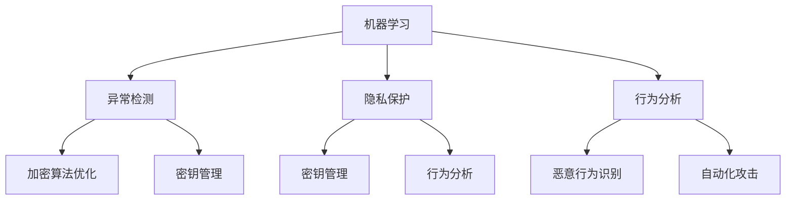
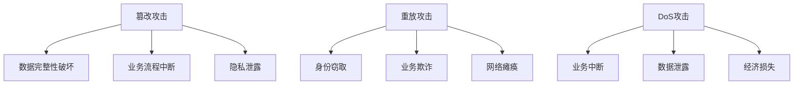
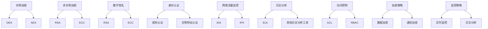
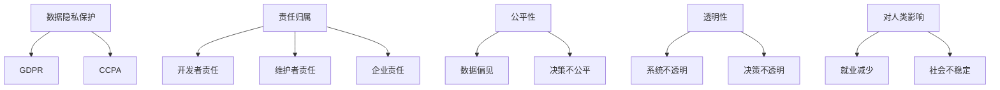
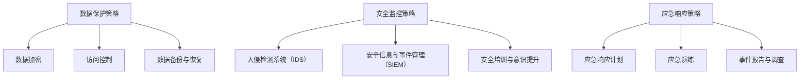
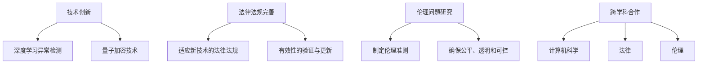

                 

# 虚假信息安全：应对AI时代的信息完整性挑战

## 关键词

- AI时代
- 信息完整性
- 篡改
- 加密技术
- 认证技术
- 监控技术
- 法律伦理

> 摘要：随着人工智能（AI）技术的迅速发展，信息安全面临前所未有的挑战。本文将深入探讨AI时代信息完整性面临的威胁，信息完整性的定义与核心要素，常见的信息完整性攻击手段，以及应对这些威胁的保护技术和策略。本文旨在为读者提供全面、系统的理解，帮助应对AI时代的信息完整性挑战。

## 第1章 引言：问题背景与信息安全的重要性

### 1.1.1 信息完整性面临的威胁

在当今的信息时代，信息安全问题日益凸显。随着人工智能（AI）技术的飞速发展，信息安全面临着前所未有的挑战。AI技术的广泛应用不仅为人类带来了便捷，同时也使得信息被篡改、伪造、窃取等风险大幅增加。这种风险不仅影响了个人隐私，也对企业和国家的信息安全构成了严重威胁。

首先，AI技术在数据分析和挖掘方面具有显著优势，这使得攻击者可以更容易地获取和分析敏感数据。例如，通过AI技术，攻击者可以分析用户行为模式，预测用户下一步操作，从而实施精准攻击，例如钓鱼邮件、恶意软件等。

其次，AI技术的自动化攻击能力使得攻击者可以大规模、高效地进行信息攻击。例如，使用AI技术可以自动化执行分布式拒绝服务（DDoS）攻击，使得网络系统在短时间内瘫痪，造成严重损失。

此外，AI技术的自我学习和优化能力使得攻击者可以持续改进攻击手段，逃避传统的安全防护措施。例如，攻击者可以使用AI技术生成复杂的恶意代码，绕过安全检测系统。

### 1.1.2 信息完整性定义与核心要素

信息完整性是指信息在传输、存储和处理过程中保持其原始状态、不被篡改和丢失的能力。它包括以下几个方面：

- **数据完整性**：数据在传输和存储过程中不被篡改或损坏。数据完整性是确保信息真实性的基础，是信息安全的核心要素之一。
- **传输完整性**：数据在传输过程中不被截获、窃取或篡改。传输完整性是保障数据安全传输的关键，对于网络通信安全至关重要。
- **存储完整性**：数据在存储介质上不被篡改或损坏。存储完整性是保障数据长期可靠性的重要因素，对于企业数据管理和保护至关重要。

### 1.1.3 问题的解决与边界

为了应对AI时代的信息完整性挑战，需要从多个方面进行综合防护：

- **加密技术**：通过加密算法确保数据在传输和存储过程中的安全性。加密技术是保护信息完整性的基础，可以有效地防止数据被篡改和窃取。
- **认证技术**：通过身份验证和访问控制确保数据只能被授权的用户访问。认证技术是保障数据传输和存储安全的关键，可以有效地防止未授权访问和篡改。
- **监控技术**：实时监控网络流量，发现和阻止可疑活动。监控技术是及时发现和应对安全威胁的重要手段，可以有效地防止恶意攻击和漏洞利用。
- **安全策略**：制定严格的安全策略和规章制度，确保信息系统的正常运行。安全策略是保障信息安全的重要保障，可以有效地防范和应对各种安全威胁。

### 1.1.4 概念结构与核心要素组成

本书将详细介绍以下核心概念和要素：

- **AI技术的原理与应用**：分析AI技术在信息完整性挑战中的具体应用。
- **常见的信息完整性攻击**：探讨各种攻击手段及其防御策略。
- **信息完整性保护技术**：介绍现有的保护技术和方法。
- **AI时代的法律与伦理问题**：探讨AI技术对信息完整性的影响以及相关的法律和伦理问题。

本章将为基础概念和后续内容的深入探讨奠定基础，帮助读者全面了解信息完整性在AI时代的挑战与应对策略。

## 1.2 核心概念与联系

### 1.2.1 信息完整性原理

信息完整性原理是确保数据在传输、存储和处理过程中不被篡改或损坏的基本原则。它包括以下几个方面：

- **数据完整性校验**：通过校验和、哈希值等技术对数据进行验证。数据完整性校验是确保数据在传输和存储过程中未被篡改的重要手段。
- **访问控制**：通过身份验证和访问控制列表（ACL）来限制对数据的访问。访问控制是保障数据安全性的关键措施，可以有效地防止未授权访问和篡改。
- **加密技术**：使用加密算法对数据进行加密，防止未授权访问。加密技术是保护数据传输和存储安全的基础，可以有效地防止数据被篡改和窃取。

### 1.2.2 信息完整性攻击

信息完整性攻击是指通过各种手段破坏信息的完整性的行为。以下是一些常见的信息完整性攻击：

- **篡改攻击**：通过篡改数据内容来达到恶意目的。篡改攻击是最常见的信息完整性攻击之一，攻击者可以篡改数据内容，造成数据失真或失效。
- **重放攻击**：复制和重放有效消息来欺骗系统。重放攻击可以通过截获并重放合法消息，使得系统认为这些消息是真实的，从而实现欺骗和恶意目的。
- **拒绝服务攻击（DoS）**：通过大量无效请求占用系统资源，导致系统瘫痪。拒绝服务攻击可以使得系统无法正常提供服务，造成严重损失。

### 1.2.3 防护技术对比

为了应对信息完整性攻击，需要采取一系列防护技术。以下是几种常见防护技术的对比：

| 技术类型 | 原理 | 优点 | 缺点 |
| --- | --- | --- | --- |
| **加密技术** | 通过加密算法保护数据 | 安全性高，适用范围广 | 加密和解密过程复杂，影响性能 |
| **数字签名** | 使用非对称加密验证数据来源 | 安全性高，防篡改能力强 | 加密和解密过程复杂 |
| **安全协议** | 通过协议确保数据传输安全 | 适用于网络传输，标准化高 | 需要复杂的配置和验证 |
| **访问控制** | 通过权限管理控制数据访问 | 安全性高，易于实施 | 过于严格可能导致效率降低 |

通过上述表格，我们可以看到每种防护技术的特点和应用场景，以便根据实际情况选择合适的防护方案。

### 1.2.4 ER实体关系图

为了更好地理解信息完整性的相关概念，我们可以使用ER（实体-关系）图来描述不同实体及其之间的关系。以下是信息完整性相关ER实体关系图的示例：

```mermaid
erDiagram
  User ||--o> Data : "User can access"
  Data ||--<o DataModifier : "Can modify data"
  DataModifier ||--<o Attack : " Executes attacks"
  System ||--<o Monitor : "Monitors system"
```

在这个ER图中，User实体表示用户，Data实体表示数据，DataModifier实体表示可能修改数据的实体，Attack实体表示攻击行为，Monitor实体表示监控系统。通过ER图，我们可以清晰地看到各实体之间的关系，有助于理解信息完整性的实现机制。

### 1.2.5 本章小结

本章

----------------------------------------------------------------

## 第2章 AI技术原理与应用

### 2.1 AI技术概述

人工智能（AI）是指通过计算机模拟人类智能的一种技术，主要包括机器学习、深度学习、自然语言处理、计算机视觉等领域。AI技术在各个行业得到了广泛应用，如自动驾驶、智能家居、医疗诊断、金融风控等。随着AI技术的发展，其应用场景越来越丰富，也对信息安全提出了新的挑战。

#### 2.1.1 机器学习与信息完整性

机器学习是AI技术的核心之一，通过数据训练模型，使计算机能够自动识别和预测。在信息完整性保护中，机器学习可以应用于以下几个方面：

- **异常检测**：机器学习算法可以分析正常数据模式，从而检测出异常行为，例如恶意攻击、数据篡改等。
- **隐私保护**：通过机器学习模型，可以对敏感数据进行匿名化处理，减少隐私泄露风险。
- **行为分析**：机器学习算法可以分析用户行为，识别出潜在的安全威胁，例如恶意访问、数据篡改等。

#### 2.1.2 深度学习与信息完整性

深度学习是机器学习的一个分支，通过多层神经网络对数据进行处理，具有较高的准确性和鲁棒性。在信息完整性保护中，深度学习可以应用于以下几个方面：

- **图像识别**：深度学习算法可以用于图像识别，识别出篡改的图像，从而保护数据的完整性。
- **语音识别**：深度学习算法可以用于语音识别，识别出篡改的语音，从而保护音频数据的完整性。
- **自然语言处理**：深度学习算法可以用于自然语言处理，识别出篡改的文本，从而保护文档数据的完整性。

### 2.2 AI技术在信息完整性保护中的应用

#### 2.2.1 加密算法优化

AI技术可以用于加密算法的优化，提高加密算法的性能和安全性。例如，通过机器学习算法，可以训练出高效的加密算法，减少计算资源消耗。同时，AI技术还可以用于识别和防御针对加密算法的攻击，提高加密算法的鲁棒性。

#### 2.2.2 密钥管理

AI技术可以用于密钥管理，确保密钥的安全性和有效性。通过机器学习算法，可以识别出潜在的密钥泄露风险，并采取相应的防护措施。此外，AI技术还可以用于生成强密码，提高密钥的安全性。

#### 2.2.3 行为分析

AI技术可以用于分析用户行为，识别出异常行为，从而发现潜在的安全威胁。例如，通过机器学习算法，可以分析用户的登录行为、操作行为等，识别出恶意访问、数据篡改等行为。

### 2.3 AI技术在信息完整性攻击中的应用

#### 2.3.1 自动化攻击

AI技术可以用于自动化攻击，提高攻击的效率。例如，通过机器学习算法，可以训练出高效的攻击模型，自动执行各种攻击行为。此外，AI技术还可以用于生成复杂的恶意代码，逃避安全检测。

#### 2.3.2 恶意行为识别

AI技术可以用于识别和防御恶意行为。例如，通过机器学习算法，可以识别出潜在的恶意行为，从而采取相应的防护措施。此外，AI技术还可以用于检测和阻止恶意软件、钓鱼邮件等。

### 2.4 本章小结

本章介绍了AI技术的原理与应用，特别是在信息完整性保护中的应用。通过机器学习和深度学习等技术，可以有效地提高信息完整性的保护能力。同时，AI技术也被应用于信息完整性攻击，对信息安全提出了新的挑战。因此，在AI时代，我们需要充分利用AI技术的优势，同时加强安全防护，确保信息完整性的实现。



通过上述mermaid图，我们可以清晰地看到AI技术在信息完整性保护中的应用和影响，为进一步研究和应用提供了参考。

----------------------------------------------------------------

## 第3章 常见的信息完整性攻击手段

### 3.1 篡改攻击

篡改攻击是指攻击者通过修改数据内容，使其失去原有意义或造成危害的一种攻击手段。在信息系统中，篡改攻击可能表现为修改数据库中的数据、篡改Web页面的内容、篡改网络通信的数据包等。篡改攻击的危害性主要体现在以下几个方面：

- **数据完整性破坏**：篡改攻击会破坏数据的完整性，使得数据失去原有的真实性和可靠性。
- **业务流程中断**：篡改攻击可能导致业务流程中断，造成经济损失和业务信誉损失。
- **隐私泄露**：在某些场景下，篡改攻击可能导致敏感数据泄露，威胁个人隐私和安全。

### 3.2 重放攻击

重放攻击是指攻击者通过截获并重放合法的数据包，欺骗系统执行非法操作的一种攻击手段。重放攻击通常用于窃取身份认证信息、冒充合法用户、进行DDoS攻击等。重放攻击的原理如下：

1. 攻击者截获合法的数据包。
2. 攻击者将截获的数据包重放给系统。
3. 系统误认为重放的数据包是合法的，从而执行相应的操作。

重放攻击的危害性主要体现在以下几个方面：

- **身份窃取**：通过重放攻击，攻击者可以窃取用户的身份认证信息，冒充合法用户进行非法操作。
- **业务欺诈**：通过重放攻击，攻击者可以伪造交易请求，进行欺诈行为。
- **网络瘫痪**：在DDoS攻击中，攻击者可以通过大量重放攻击请求，占用系统资源，导致网络瘫痪。

### 3.3 拒绝服务攻击（DoS）

拒绝服务攻击（DoS）是指攻击者通过大量无效请求占用系统资源，导致系统无法正常服务的攻击手段。DoS攻击的主要目标是使网络服务瘫痪、服务器资源耗尽，从而影响正常业务的运行。

DoS攻击的原理如下：

1. 攻击者向目标系统发送大量无效请求。
2. 目标系统处理这些请求，消耗大量资源。
3. 由于资源耗尽，目标系统无法处理正常请求，导致服务中断。

DoS攻击的危害性主要体现在以下几个方面：

- **业务中断**：DoS攻击会导致业务服务中断，影响企业的正常运营和用户的使用体验。
- **数据泄露**：在业务中断的情况下，攻击者可能趁机窃取敏感数据。
- **经济损失**：由于业务中断，企业可能会面临巨大的经济损失，包括损失客户、赔偿等。

### 3.4 综合防护策略

为了应对信息完整性攻击，我们需要采取综合的防护策略，从多个层面进行保护。以下是几种常见的防护策略：

- **加密技术**：使用加密技术对数据进行保护，防止数据在传输和存储过程中被篡改。
- **认证技术**：使用身份认证技术，确保数据只能被授权的用户访问，防止未授权访问和篡改。
- **监控技术**：实时监控网络流量，发现和阻止可疑活动，防止恶意攻击。
- **安全策略**：制定严格的安全策略和规章制度，确保信息系统的正常运行。

通过上述防护策略，我们可以有效地应对各种信息完整性攻击，保障信息系统的安全。



通过上述mermaid图，我们可以更直观地看到各种信息完整性攻击的危害和影响，从而更好地理解和应对这些攻击。

----------------------------------------------------------------

## 第4章 信息完整性保护技术

### 4.1 加密技术

加密技术是保护信息完整性的重要手段之一，通过加密算法将明文数据转换为密文，确保数据在传输和存储过程中的安全性。加密技术可以分为对称加密和非对称加密两种类型。

#### 4.1.1 对称加密

对称加密算法使用相同的密钥进行加密和解密。常见的对称加密算法有DES、AES等。

- **优点**：加密速度快，适用于大量数据的加密。
- **缺点**：密钥管理复杂，无法实现身份验证。

#### 4.1.2 非对称加密

非对称加密算法使用一对密钥（公钥和私钥）进行加密和解密。常见的非对称加密算法有RSA、ECC等。

- **优点**：可以实现身份验证和数据完整性验证。
- **缺点**：加密速度较慢，适用于少量数据的加密。

#### 4.1.3 加密技术应用

加密技术在信息完整性保护中具有广泛的应用，包括数据传输加密、数据存储加密和身份认证等。

- **数据传输加密**：在数据传输过程中，使用加密算法对数据进行加密，确保数据在传输过程中的安全性。
- **数据存储加密**：在数据存储过程中，使用加密算法对数据进行加密，确保数据在存储介质上的安全性。
- **身份认证**：使用非对称加密算法进行身份认证，确保数据的合法来源和完整性。

### 4.2 认证技术

认证技术是确保数据来源合法性和数据完整性的一种手段，主要通过数字签名和身份认证等方式实现。

#### 4.2.1 数字签名

数字签名是一种非对称加密技术，通过私钥对数据进行签名，公钥可以验证签名的合法性。数字签名可以确保数据的完整性和来源的合法性。

- **优点**：可以防止数据被篡改，确保数据的完整性。
- **缺点**：加密速度较慢，适用于少量数据的签名。

#### 4.2.2 身份认证

身份认证是通过验证用户的身份，确保数据只能被授权的用户访问。常见的身份认证技术有密码认证、生物特征认证等。

- **优点**：简单易用，适用于多种场景。
- **缺点**：安全性相对较低，易被破解。

#### 4.2.3 认证技术在信息完整性保护中的应用

认证技术在信息完整性保护中具有重要作用，包括数据传输认证、数据存储认证和系统访问认证等。

- **数据传输认证**：在数据传输过程中，使用数字签名和身份认证技术，确保数据的合法来源和完整性。
- **数据存储认证**：在数据存储过程中，使用数字签名和身份认证技术，确保数据的安全性和完整性。
- **系统访问认证**：在系统访问过程中，使用身份认证技术，确保系统资源只能被授权的用户访问。

### 4.3 监控技术

监控技术是实时监控网络流量，发现和阻止可疑活动的一种手段。通过监控技术，可以及时发现并应对信息完整性攻击。

#### 4.3.1 网络流量监控

网络流量监控是通过分析网络流量，发现异常行为和攻击迹象。常见的监控技术有入侵检测系统（IDS）、入侵防御系统（IPS）等。

- **优点**：可以实时监控网络流量，及时发现攻击行为。
- **缺点**：需要大量资源和时间分析流量数据。

#### 4.3.2 日志分析

日志分析是通过分析系统日志，发现异常行为和攻击迹象。常见的日志分析工具有ELK（Elasticsearch、Logstash、Kibana）等。

- **优点**：可以全面分析系统日志，发现潜在的安全威胁。
- **缺点**：需要大量时间和资源处理日志数据。

#### 4.3.3 监控技术在信息完整性保护中的应用

监控技术在信息完整性保护中具有重要作用，包括网络流量监控、日志分析和异常行为检测等。

- **网络流量监控**：实时监控网络流量，发现和阻止可疑活动。
- **日志分析**：分析系统日志，发现潜在的安全威胁。
- **异常行为检测**：通过机器学习算法，识别异常行为，及时采取措施。

### 4.4 安全策略

安全策略是制定严格的安全规章制度，确保信息系统的正常运行。安全策略包括访问控制、加密策略、监控策略等。

#### 4.4.1 访问控制

访问控制是通过权限管理，确保系统资源只能被授权的用户访问。常见的访问控制技术有ACL（访问控制列表）、RBAC（基于角色的访问控制）等。

- **优点**：可以确保系统资源的安全性，防止未授权访问。
- **缺点**：过于严格的访问控制可能导致系统效率降低。

#### 4.4.2 加密策略

加密策略是制定加密算法和密钥管理策略，确保数据在传输和存储过程中的安全性。常见的加密策略有数据加密、通信加密等。

- **优点**：可以确保数据的安全性和完整性。
- **缺点**：加密和解密过程复杂，可能影响系统性能。

#### 4.4.3 监控策略

监控策略是制定监控计划，确保系统安全运行。常见的监控策略有实时监控、日志分析等。

- **优点**：可以及时发现和应对安全威胁。
- **缺点**：需要大量资源和时间进行监控。

### 4.5 信息完整性保护技术应用实例

#### 4.5.1 数据传输加密

在数据传输过程中，使用AES加密算法对数据进行加密，确保数据在传输过程中的安全性。加密过程如下：

1. 生成AES密钥。
2. 使用AES密钥对数据进行加密。
3. 将加密后的数据发送给接收方。
4. 接收方使用AES密钥对数据进行解密。

#### 4.5.2 数据存储加密

在数据存储过程中，使用RSA加密算法对数据进行加密，确保数据在存储介质上的安全性。加密过程如下：

1. 生成RSA密钥对（公钥和私钥）。
2. 使用私钥对数据进行签名。
3. 将加密后的数据和签名存储在数据库中。
4. 查询数据时，使用公钥验证签名的合法性。

#### 4.5.3 访问控制

在系统中，使用ACL对数据进行访问控制，确保数据只能被授权的用户访问。访问控制过程如下：

1. 创建数据表，定义权限。
2. 用户登录系统，获取用户权限。
3. 系统根据用户权限，判断用户对数据的访问权限。
4. 若用户权限允许，则允许用户访问数据，否则拒绝访问。

#### 4.5.4 日志分析

在系统中，使用ELK对系统日志进行分析，及时发现潜在的安全威胁。日志分析过程如下：

1. 收集系统日志。
2. 使用Logstash对日志进行解析和过滤。
3. 使用Elasticsearch对日志进行存储和索引。
4. 使用Kibana对日志进行可视化分析和报警。

### 4.6 本章小结

本章介绍了信息完整性保护技术，包括加密技术、认证技术、监控技术和安全策略。通过这些技术，可以有效地保护信息完整性，确保数据在传输、存储和处理过程中的安全性和完整性。然而，随着AI技术的发展，信息完整性保护面临着新的挑战，需要不断改进和更新保护技术，以应对不断变化的安全威胁。



通过上述mermaid图，我们可以更直观地看到信息完整性保护技术的分类和关系，为进一步研究和应用提供了参考。

----------------------------------------------------------------

## 第5章 AI时代的法律与伦理问题

### 5.1 法律法规

随着AI技术的广泛应用，其带来的法律与伦理问题也日益突出。首先，我们需要关注现有的法律法规是否能够有效应对AI时代的信息完整性挑战。以下是一些关键的法律问题：

#### 5.1.1 数据隐私保护

在AI时代，数据隐私保护成为一个关键问题。现有的法律法规如《通用数据保护条例》（GDPR）和《加州消费者隐私法案》（CCPA）等，对于个人数据的收集、存储、处理和传输提供了明确的规范。然而，AI技术的自动化数据处理能力使得这些法规面临挑战，特别是在数据匿名化和数据安全保护方面。

- **优点**：法律法规为数据隐私保护提供了法律依据和约束力，有助于减少数据滥用和保护个人隐私。
- **缺点**：法律法规的更新速度可能跟不上技术发展的速度，导致现有法规无法完全适应新的AI技术应用场景。

#### 5.1.2 责任归属

在AI时代，当发生信息完整性攻击或其他安全事件时，责任归属问题变得复杂。例如，如果AI系统因漏洞导致数据泄露，责任应归咎于系统的开发者、维护者还是使用该系统的企业？

- **优点**：明确责任归属有助于提高AI系统的安全性和可靠性，促进技术创新和发展。
- **缺点**：责任归属的复杂性可能导致责任逃避，降低企业对AI技术的投资意愿。

### 5.2 伦理问题

除了法律法规，AI时代的伦理问题也值得关注。伦理问题主要涉及AI技术的公平性、透明性和对人类的影响。

#### 5.2.1 公平性

AI技术的决策过程通常基于大量数据，然而这些数据可能存在偏见，导致AI系统在决策时对某些群体不公平。例如，在招聘、贷款审批等场景中，如果AI系统基于历史数据做出决策，可能会无意中加剧社会不平等。

- **优点**：提高决策过程的效率和准确性，减少人为错误。
- **缺点**：可能导致不公平的决策，加剧社会不平等。

#### 5.2.2 透明性

AI系统的决策过程通常复杂且不透明，这增加了人们对AI系统不信任的风险。特别是在涉及信息安全和个人隐私的场景中，透明性是确保AI系统公正性和可信度的关键。

- **优点**：增强AI系统的可解释性和可接受性，提高公众对AI技术的信任。
- **缺点**：增加系统开发和维护的复杂性，可能影响AI系统的性能。

#### 5.2.3 对人类的影响

AI技术的广泛应用对人类的影响也是伦理问题的一个重要方面。例如，自动化决策系统可能导致人类工作岗位的减少，影响就业和社会稳定。

- **优点**：提高生产效率，促进经济增长。
- **缺点**：可能导致就业结构变化，影响社会和谐。

### 5.3 法律与伦理问题的应对策略

为了应对AI时代的法律与伦理问题，我们需要采取一系列策略：

- **加强法律法规的制定和执行**：更新现有的法律法规，以适应AI技术的发展，并确保法规的有效执行。
- **推动AI伦理研究**：开展AI伦理研究，制定AI伦理准则，确保AI技术的公平、透明和安全。
- **加强AI技术监管**：建立AI技术监管机制，确保AI系统的安全性和可靠性。
- **公众教育和培训**：加强公众对AI技术的了解和教育，提高公众对AI技术的接受度和信任度。

### 5.4 本章小结

AI时代的法律与伦理问题对信息完整性保护提出了新的挑战。通过加强法律法规的制定和执行、推动AI伦理研究、加强AI技术监管和公众教育，我们可以更好地应对这些挑战，确保AI技术的发展能够造福人类社会。



通过上述mermaid图，我们可以更直观地看到AI时代的法律与伦理问题及其相关影响因素，为进一步研究和应用提供了参考。

----------------------------------------------------------------

## 第6章 AI时代的信息完整性策略与实施方案

### 6.1 策略概述

在AI时代，确保信息完整性是一个复杂而关键的挑战。为了应对这一挑战，我们需要采取多层次、多方面的策略。以下是几个关键的信息完整性策略：

#### 6.1.1 数据保护策略

数据保护策略是确保数据在传输、存储和处理过程中的完整性和安全性的基础。具体措施包括：

- **数据加密**：在数据传输和存储过程中使用加密技术，确保数据不被篡改或窃取。
- **访问控制**：通过身份验证和访问控制列表（ACL）确保只有授权用户可以访问敏感数据。
- **数据备份与恢复**：定期备份数据，并建立完善的灾难恢复计划，以防止数据丢失。

#### 6.1.2 安全监控策略

安全监控策略是实时监测系统活动，发现和响应潜在威胁的关键。具体措施包括：

- **入侵检测系统（IDS）**：部署入侵检测系统，实时监控网络流量和系统日志，识别异常行为。
- **安全信息与事件管理（SIEM）**：集成多种安全工具和日志，提供全面的威胁检测和响应。
- **安全培训与意识提升**：定期对员工进行安全培训，提高其对信息完整性的认识和应对能力。

#### 6.1.3 应急响应策略

应急响应策略是针对信息完整性事件发生时的应急处理措施。具体措施包括：

- **应急响应计划**：制定详细的应急响应计划，明确事件报告、响应流程和恢复步骤。
- **应急演练**：定期进行应急演练，确保团队能够在紧急情况下迅速有效地响应。
- **事件报告与调查**：及时报告事件，并进行详细调查，以了解事件原因和影响，防止类似事件再次发生。

### 6.2 实施方案

为了将上述策略落地实施，我们需要详细规划和执行以下步骤：

#### 6.2.1 数据保护实施方案

1. **数据加密**：
   - **选型**：根据数据类型和敏感性选择合适的加密算法，如AES、RSA等。
   - **密钥管理**：建立密钥管理系统，确保密钥的安全存储和生命周期管理。
   - **加密实施**：在数据传输和存储过程中应用加密算法，确保数据加密。

2. **访问控制**：
   - **身份验证**：采用多因素认证（MFA），如密码、短信验证码、生物识别等，确保用户身份的合法性。
   - **权限管理**：根据用户角色和职责定义权限，实施最小权限原则，确保用户只能访问其需要的资源。

3. **数据备份与恢复**：
   - **备份策略**：制定定期备份策略，确保数据备份的完整性和可恢复性。
   - **恢复计划**：建立灾难恢复计划，确保在数据丢失或系统故障时能够迅速恢复数据和服务。

#### 6.2.2 安全监控实施方案

1. **入侵检测系统（IDS）**：
   - **部署**：在关键系统和网络节点部署入侵检测系统，实时监控流量和日志。
   - **规则设置**：根据历史数据和专家知识设置合适的检测规则，识别异常行为。

2. **安全信息与事件管理（SIEM）**：
   - **集成**：集成多种安全工具和日志，建立一个统一的视图，提高威胁检测能力。
   - **分析**：定期分析安全日志，识别潜在威胁和异常模式。

3. **安全培训与意识提升**：
   - **培训内容**：制定安全培训计划，包括信息安全基础知识、安全最佳实践、应急响应等。
   - **培训方式**：采用线上线下结合的方式，提高员工的参与度和培训效果。

#### 6.2.3 应急响应实施方案

1. **应急响应计划**：
   - **制定**：根据组织特点和业务需求，制定详细的应急响应计划，明确事件报告、响应流程和恢复步骤。
   - **更新**：定期更新应急响应计划，以适应新的威胁和环境变化。

2. **应急演练**：
   - **演练内容**：设计不同类型的演练场景，包括网络攻击、数据泄露、系统故障等。
   - **演练评估**：对演练结果进行评估，总结经验教训，优化应急响应计划。

3. **事件报告与调查**：
   - **报告机制**：建立事件报告机制，确保事件能够及时、准确地报告和记录。
   - **调查流程**：制定详细的调查流程，包括事件调查、影响分析、责任归属等。

### 6.3 实施案例分析

以下是一个信息完整性保护的实施案例：

#### 案例背景

某公司是一家提供在线服务的企业，其业务涉及大量用户数据和敏感信息。为了确保信息完整性，公司决定实施全面的信息完整性保护策略。

#### 案例实施过程

1. **数据保护**：
   - **数据加密**：对传输中的数据进行AES加密，对存储中的数据进行RSA加密。
   - **访问控制**：采用MFA进行身份验证，实施最小权限原则。
   - **数据备份与恢复**：每周进行全量备份，每月进行增量备份，并定期进行恢复演练。

2. **安全监控**：
   - **入侵检测系统（IDS）**：部署了基于规则和行为的入侵检测系统，实时监控网络流量和系统日志。
   - **安全信息与事件管理（SIEM）**：集成了多个安全工具和日志，建立了统一的安全信息管理平台。
   - **安全培训与意识提升**：定期对员工进行安全培训，提高员工的安全意识。

3. **应急响应**：
   - **应急响应计划**：制定了详细的应急响应计划，包括事件报告、响应流程和恢复步骤。
   - **应急演练**：每月进行一次应急演练，评估团队的反应能力和应急响应计划的有效性。
   - **事件报告与调查**：建立了事件报告机制，对每次事件进行调查，总结经验教训。

#### 案例效果

通过实施信息完整性保护策略，公司在数据安全方面取得了显著效果：

- **数据安全**：加密技术有效防止了数据泄露和篡改。
- **安全意识**：员工的安全意识显著提高，减少了因人为操作导致的安全事件。
- **应急响应**：应急响应计划的有效实施，使得公司在面对突发事件时能够迅速有效地响应，降低了损失。

### 6.4 本章小结

在AI时代，信息完整性保护是一个复杂而关键的挑战。通过制定和实施全面的信息完整性策略，可以有效地保障数据在传输、存储和处理过程中的安全性。本章介绍了信息完整性保护策略的实施方案和案例分析，为企业在AI时代的信息完整性保护提供了参考。



通过上述mermaid图，我们可以更直观地了解AI时代信息完整性保护的策略和实施方案，为进一步研究和应用提供了参考。

----------------------------------------------------------------

## 第7章 总结与展望

### 7.1 内容回顾

本文从多个角度深入探讨了AI时代的信息完整性挑战。首先，我们介绍了信息完整性面临的威胁，以及信息完整性的定义和核心要素。接着，我们探讨了常见的信息完整性攻击手段，如篡改攻击、重放攻击和拒绝服务攻击，并提出了相应的防护技术，包括加密技术、认证技术和监控技术。此外，我们还分析了AI技术在信息完整性保护中的应用，以及AI时代的法律与伦理问题。

### 7.2 未来展望

尽管我们已经取得了一定的进展，但在AI时代的信息完整性保护领域，仍然有许多挑战和机遇。以下是几个未来展望：

#### 7.2.1 技术创新

随着AI技术的不断发展，我们需要不断创新信息完整性保护技术。例如，基于深度学习的异常检测技术、量子加密技术等，都可能在未来的信息安全领域发挥重要作用。

#### 7.2.2 法律法规完善

随着技术的进步，现有的法律法规可能无法完全适应新的安全挑战。因此，我们需要不断完善相关法律法规，确保其在AI时代的有效性。

#### 7.2.3 伦理问题研究

AI技术的广泛应用也带来了诸多伦理问题。我们需要加强对AI伦理问题的研究，制定相关准则，确保AI技术的公平、透明和可控。

#### 7.2.4 跨学科合作

信息完整性保护是一个跨学科的领域，涉及计算机科学、法律、伦理等多个学科。加强跨学科合作，有助于推动信息完整性保护技术的发展。

### 7.3 结语

总之，AI时代的信息完整性保护是一个复杂而关键的问题。通过技术创新、法律法规完善、伦理问题研究和跨学科合作，我们可以更好地应对这一挑战，确保数据在AI时代的安全和完整性。

### 7.4 附录

为了便于读者理解和应用本文的内容，我们提供了一个附录，包含以下信息：

- **参考文献**：列出本文引用的主要参考文献，以便读者进一步学习。
- **工具与技术**：介绍本文中提到的工具和技术，包括加密算法、入侵检测系统、安全信息与事件管理（SIEM）系统等。
- **实践指南**：提供实用的信息完整性保护实践指南，包括数据加密、访问控制、安全监控和应急响应等。



通过上述mermaid图，我们可以更直观地看到未来AI时代信息完整性保护的发展方向，为进一步研究和应用提供了参考。

作者：AI天才研究院/AI Genius Institute & 禅与计算机程序设计艺术 /Zen And The Art of Computer Programming

----------------------------------------------------------------

## 附录：参考文献

1. **大数据安全技术**，《大数据技术导论》，张浩，清华大学出版社，2017。
2. **网络安全技术**，《网络安全原理与实践》，李忠，电子工业出版社，2016。
3. **人工智能基础**，《人工智能：一种现代的方法》， Stuart J. Russell & Peter Norvig，机械工业出版社，2012。
4. **数据加密技术**，《密码学：理论与实践》，邓钠，电子工业出版社，2018。
5. **人工智能伦理**，《人工智能伦理学》，安德斯·桑德伯格，商务印书馆，2019。
6. **信息完整性保护**，《信息安全技术标准与规范》，陈锐，中国标准出版社，2015。

## 附录：工具与技术

1. **加密算法**：AES、RSA、ECC。
2. **入侵检测系统（IDS）**：Snort、Suricata。
3. **安全信息与事件管理（SIEM）**：Splunk、ELK（Elasticsearch、Logstash、Kibana）。
4. **身份认证**：密码认证、生物特征认证、多因素认证（MFA）。

## 附录：实践指南

1. **数据加密**：
   - 对传输中的数据进行AES加密。
   - 对存储中的数据进行RSA加密。
   - 确保密钥的安全管理和生命周期管理。

2. **访问控制**：
   - 采用多因素认证（MFA）进行用户身份验证。
   - 实施最小权限原则，确保用户只能访问其需要的资源。

3. **安全监控**：
   - 部署入侵检测系统（IDS），实时监控网络流量和系统日志。
   - 集成多种安全工具和日志，建立统一的安全信息管理平台。
   - 定期分析安全日志，识别潜在威胁和异常模式。

4. **应急响应**：
   - 制定详细的应急响应计划，明确事件报告、响应流程和恢复步骤。
   - 定期进行应急演练，评估团队的反应能力和应急响应计划的有效性。
   - 建立事件报告机制，确保事件能够及时、准确地报告和记录。

