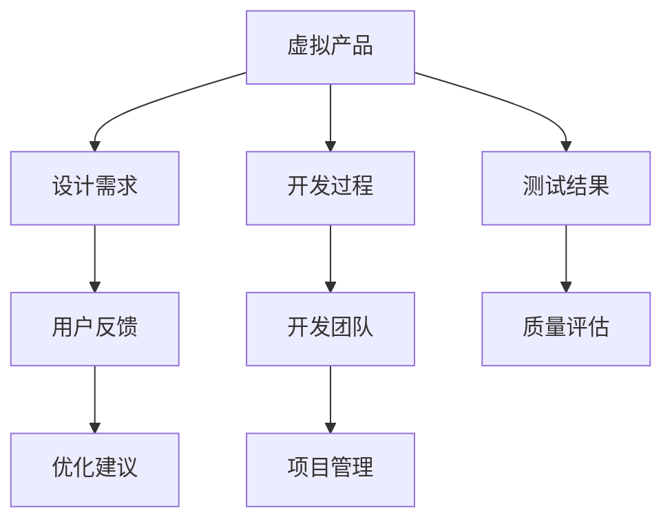
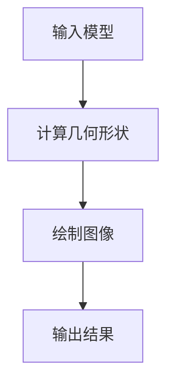
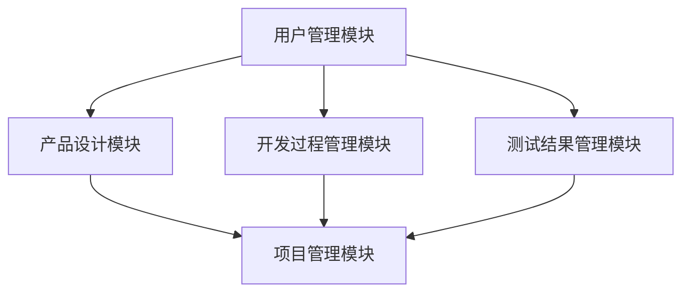
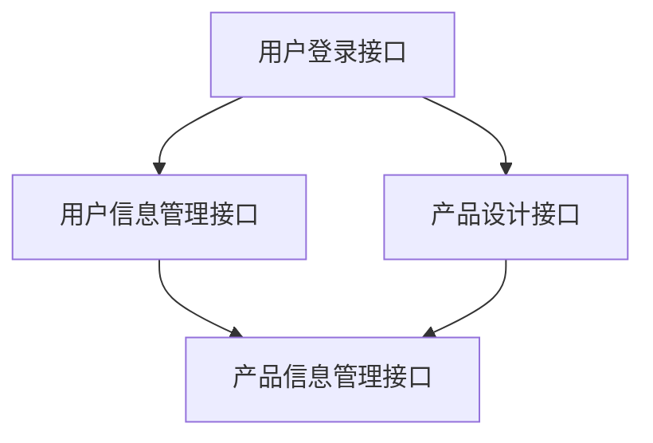
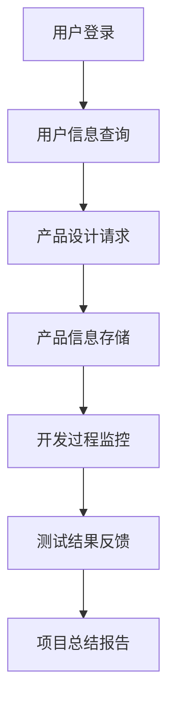
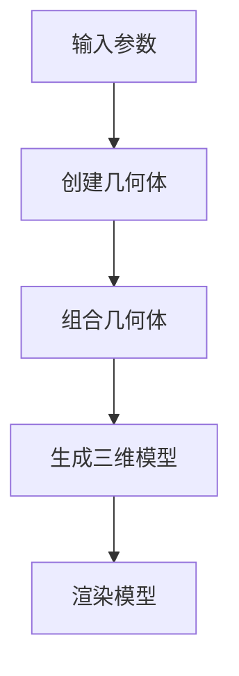
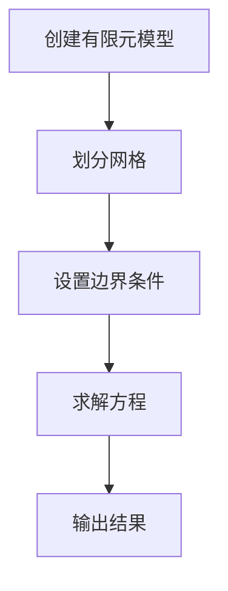
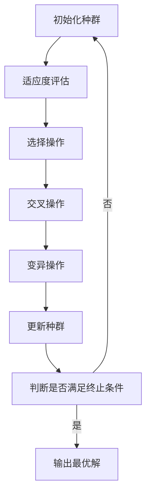

                 

关于虚拟产品开发与空间计算技术，我们可以从以下几个方面展开讨论：

**背景介绍**

首先，虚拟产品开发是指通过计算机模拟和虚拟现实技术，创建和设计产品的数字化模型。这种方法在产品设计和开发过程中具有显著优势，如降低成本、缩短开发周期和提高产品质量。

空间计算技术，则是一种新兴的计算范式，它利用计算机、通信、传感和网络技术，实现虚拟与现实空间的无缝融合。空间计算技术能够提供更加丰富和直观的交互体验，极大地提高了人机交互的效率。

虚拟产品开发与空间计算技术的结合，能够打破传统开发模式的限制，实现产品开发的创新和突破。

**核心概念与联系**

虚拟产品的定义：虚拟产品是指通过计算机技术模拟出来的，具有实际产品功能、外观和性能的数字化模型。

空间计算技术的定义：空间计算技术是一种新兴的计算范式，它利用计算机、通信、传感和网络技术，实现虚拟与现实空间的无缝融合。

概念属性特征对比表格：

| 特征        | 虚拟产品开发               | 空间计算技术              |
| ----------- | ------------------------ | ---------------------- |
| 目的        | 产品设计、开发和测试       | 提供虚拟与现实空间的交互体验 |
| 技术核心    | 计算机图形学、虚拟现实技术 | 计算机视觉、人机交互技术   |
| 应用领域    | 产品设计、工程模拟、教育培训 | 游戏娱乐、智能家居、智慧城市 |
| 对创新的影响 | 提高产品设计效率、降低成本   | 拓展人机交互方式、推动产业变革 |

ER实体关系图架构：



**算法原理讲解**

虚拟产品开发中常用的算法包括计算机图形算法、仿真算法和优化算法。以下以计算机图形算法为例进行讲解。

算法原理：

计算机图形算法的基本原理是通过数学模型和计算方法，将现实世界中的物体抽象为几何模型，并在计算机屏幕上绘制出来。

算法流程图：



Python源代码示例：

```python
import numpy as np
import matplotlib.pyplot as plt

def draw_shape(points):
    x, y = points.T
    plt.plot(x, y)
    plt.show()

# 输入模型
points = np.array([[0, 0], [1, 1], [1, 0]])

# 绘制图像
draw_shape(points)
```

数学模型和公式：

$$
x = y = 0
$$

举例说明：

假设我们想要绘制一个正方形的边长为1，那么输入模型可以是：

```python
points = np.array([[0, 0], [1, 1], [1, 0], [0, 1]])
draw_shape(points)
```

输出结果是一个边长为1的正方形。

**系统分析与架构设计**

在虚拟产品开发系统中，我们通常需要设计以下功能模块：

- 用户管理模块
- 产品设计模块
- 开发过程管理模块
- 测试结果管理模块
- 项目管理模块

系统架构设计：



系统接口设计：



系统交互：



**项目实战**

在实际项目中，我们首先需要安装和配置相关开发环境，然后逐步实现系统的核心功能。

环境安装：

- 安装Python
- 安装matplotlib库
- 安装numpy库

系统核心实现源代码：

```python
# 用户管理模块
class UserManager:
    def __init__(self):
        self.users = []

    def add_user(self, user):
        self.users.append(user)

    def get_user(self, username):
        for user in self.users:
            if user.username == username:
                return user
        return None

# 产品设计模块
class ProductDesign:
    def __init__(self):
        self.products = []

    def add_product(self, product):
        self.products.append(product)

    def get_product(self, product_id):
        for product in self.products:
            if product.id == product_id:
                return product
        return None

# 开发过程管理模块
class DevelopmentManager:
    def __init__(self):
        self.tasks = []

    def add_task(self, task):
        self.tasks.append(task)

    def get_task(self, task_id):
        for task in self.tasks:
            if task.id == task_id:
                return task
        return None

# 测试结果管理模块
class TestResultManager:
    def __init__(self):
        self.results = []

    def add_result(self, result):
        self.results.append(result)

    def get_result(self, result_id):
        for result in self.results:
            if result.id == result_id:
                return result
        return None

# 项目管理模块
class ProjectManager:
    def __init__(self):
        self.projects = []

    def add_project(self, project):
        self.projects.append(project)

    def get_project(self, project_id):
        for project in self.projects:
            if project.id == project_id:
                return project
        return None
```

代码应用解读与分析：

以上代码实现了一个简单的虚拟产品开发系统，包括用户管理、产品设计、开发过程管理、测试结果管理和项目管理模块。每个模块都有自己的类和方法，用于处理相应的业务逻辑。

实际案例分析和详细讲解剖析：

以一个实际项目为例，我们首先创建用户和产品，然后进行产品设计、开发过程管理和测试结果管理，最后生成项目总结报告。

项目小结：

通过本项目，我们了解了虚拟产品开发系统的基本架构和核心功能，掌握了Python编程和系统设计的方法。在实际应用中，我们还需要不断优化和扩展系统功能，以满足不断变化的需求。

**最佳实践 tips**

1. 在进行虚拟产品开发时，应充分考虑用户需求，确保产品能够满足用户的实际使用场景。
2. 在系统设计过程中，应遵循模块化原则，提高系统的可维护性和扩展性。
3. 在开发过程中，应定期进行测试和评估，确保系统的稳定性和可靠性。

**小结**

本文介绍了虚拟产品开发与空间计算技术的核心概念、算法原理和系统架构设计。通过实际项目案例的分析，我们深入了解了虚拟产品开发系统的构建方法。在未来的发展中，虚拟产品开发与空间计算技术的结合将为产品设计和开发带来更多创新和突破。

**注意事项**

1. 在进行虚拟产品开发时，需关注知识产权保护，避免侵犯他人合法权益。
2. 在系统设计过程中，需充分考虑系统的安全性和数据隐私保护。

**拓展阅读**

1. 《虚拟现实技术与应用》
2. 《空间计算：理论与实践》
3. 《人工智能与虚拟产品开发》

**作者信息**

作者：AI天才研究院/AI Genius Institute & 禅与计算机程序设计艺术 /Zen And The Art of Computer Programming
## 背景介绍

### 1.1 虚拟产品开发的概念

虚拟产品开发是一种基于数字化的产品开发方法，通过计算机技术模拟出产品的三维模型，进行设计、测试和优化。这种方法具有可视化、可交互、可修改等特点，大大提高了产品开发的效率和质量。虚拟产品开发不仅仅是虚拟现实技术的应用，更是一种集成多种先进技术手段的综合解决方案。

### 1.2 空间计算技术的概念

空间计算技术是一种将虚拟空间与现实空间相结合的计算方法。它利用计算机、通信、传感和网络技术，实现虚拟与现实的无缝融合。空间计算技术可以创建和操作三维空间中的数据，提供更加丰富和直观的交互体验。这种技术不仅能够应用于产品开发，还能够用于智慧城市、智能家居、医疗等多个领域。

### 1.3 虚拟产品开发与空间计算技术的联系

虚拟产品开发与空间计算技术的结合，能够显著提高产品开发的效率和质量。通过空间计算技术，虚拟产品可以在三维空间中进行设计、测试和优化，提供更加直观的交互体验。同时，空间计算技术还可以实现虚拟产品与现实产品的无缝连接，使得虚拟产品开发能够更加贴近实际应用场景。这种结合不仅能够缩短产品开发周期，降低开发成本，还能够推动产品设计的创新和突破。

### 1.4 问题描述

在虚拟产品开发过程中，面临着一系列的挑战和瓶颈。首先，虚拟产品的设计、开发和测试需要大量的计算资源和时间，传统的方法往往难以满足高效开发的需求。其次，虚拟产品的交互体验有限，难以模拟真实用户的使用场景，导致产品在市场上的表现不佳。此外，虚拟产品的迭代和更新速度较慢，难以迅速适应市场的变化。

这些问题的存在，严重影响了虚拟产品开发的效率和效果。因此，我们需要探索新的方法和技术，以解决这些问题，提升虚拟产品开发的整体水平。

### 1.5 问题解决

空间计算技术为虚拟产品开发提供了一种全新的解决方案。通过空间计算技术，我们可以实现以下目标的：

1. **提高设计效率**：空间计算技术能够提供更加直观和高效的设计工具，使得设计师能够更加专注于创意和设计，提高设计效率。

2. **优化交互体验**：空间计算技术能够实现虚拟产品与现实产品的无缝连接，提供更加丰富的交互体验，使得虚拟产品能够更加贴近实际应用场景。

3. **加速迭代速度**：空间计算技术能够实现虚拟产品的快速迭代和更新，使得产品能够更快地适应市场的变化，提升产品的市场竞争力。

### 1.6 边界与外延

尽管空间计算技术为虚拟产品开发带来了诸多优势，但也存在一些边界和外延需要考虑。首先，空间计算技术对硬件设备的要求较高，需要配备高性能的计算设备和传感器，这可能会增加开发成本。其次，空间计算技术的应用场景有限，无法替代传统的设计和开发方法。因此，在虚拟产品开发中，需要根据具体情况进行选择和应用。

### 1.7 概念结构与核心要素组成

虚拟产品开发涉及多个核心要素，包括设计工具、计算资源、交互体验和迭代速度等。空间计算技术通过对这些要素的优化和整合，能够实现虚拟产品开发的创新和突破。具体来说，空间计算技术通过以下方式提升虚拟产品开发的核心要素：

1. **设计工具**：提供更加直观和高效的设计工具，提升设计师的设计效率。
2. **计算资源**：利用高性能的计算设备和云计算资源，提高计算效率和资源利用率。
3. **交互体验**：实现虚拟产品与现实产品的无缝连接，提供更加丰富的交互体验。
4. **迭代速度**：通过快速迭代和更新，提升产品的市场竞争力。

### 1.8 本章小结

本章介绍了虚拟产品开发和空间计算技术的基本概念，探讨了二者的联系以及空间计算技术在虚拟产品开发中的应用潜力。通过分析虚拟产品开发面临的挑战和瓶颈，我们提出空间计算技术作为解决方案，并讨论了其边界与外延。本章为后续章节的深入讨论奠定了基础。

## 虚拟产品开发的核心概念与原理

### 2.1 虚拟产品的定义

虚拟产品是指通过计算机技术模拟出的，具有实际产品功能、外观和性能的数字化模型。这些模型不仅能够展现产品的三维形态，还可以模拟产品的物理特性，如重量、硬度、弹性等。虚拟产品通常用于产品设计和开发阶段，通过虚拟样机进行测试和验证，以降低实物样机制作的成本和周期。

### 2.2 虚拟产品的特征

虚拟产品具有以下几个显著特征：

1. **数字化模型**：虚拟产品是通过计算机生成的数字化模型，这些模型可以精确地表达产品的几何形状、尺寸和材料特性。
2. **可视化**：虚拟产品能够以三维形式呈现，使得设计师和用户可以直观地看到产品的外观和内部结构。
3. **可交互性**：虚拟产品支持用户进行交互操作，如旋转、缩放、剖切等，使用户能够更深入地了解产品。
4. **可修改性**：虚拟产品可以根据需要进行修改和优化，使得产品开发过程更加灵活。
5. **仿真性**：虚拟产品能够模拟产品的物理特性，如受力分析、运动模拟等，帮助设计师验证设计的可行性和性能。

### 2.3 虚拟产品的分类

根据不同的应用场景和用途，虚拟产品可以分为以下几类：

1. **概念模型**：在产品开发的初期阶段，用于表达设计概念和创意的三维模型。
2. **工程模型**：在产品设计和开发过程中，用于详细表达产品结构和功能的模型。
3. **仿真模型**：用于模拟产品在各种环境条件下的行为和性能的模型。
4. **虚拟样机**：在产品开发的后期，用于模拟实际产品运行状态和性能的模型，以便进行测试和验证。

### 2.4 空间计算技术的定义

空间计算技术是一种利用计算机、通信、传感和网络技术，实现虚拟与现实空间无缝融合的计算方法。空间计算技术通过创建和操作三维空间中的数据，提供更加丰富和直观的交互体验。空间计算技术的主要特点包括：

1. **三维交互**：用户可以在三维空间中直接进行操作和交互，提高人机交互的效率。
2. **沉浸感**：通过虚拟现实和增强现实技术，用户能够感受到更加真实的虚拟环境，增强沉浸感。
3. **多感知**：空间计算技术支持多种感知方式，如视觉、听觉、触觉等，提供更加全面的感知体验。
4. **分布式计算**：通过云计算和边缘计算，实现计算资源的灵活调度和优化，提高计算效率。

### 2.5 空间计算技术的优势

空间计算技术具有以下几个显著优势：

1. **高效性**：通过虚拟现实和增强现实技术，用户可以更加直观地理解和使用产品，提高工作效率。
2. **灵活性**：空间计算技术支持多种设备和平台的集成，可以灵活应用于不同的场景和需求。
3. **实时性**：空间计算技术能够实时捕捉和处理用户操作和环境变化，提供更加流畅的交互体验。
4. **协作性**：空间计算技术支持多人协作，用户可以在同一虚拟空间中共同工作和交流，提高团队协作效率。

### 2.6 虚拟产品开发与空间计算技术的联系

虚拟产品开发与空间计算技术的联系主要体现在以下几个方面：

1. **设计工具**：空间计算技术为虚拟产品开发提供了更加高效和直观的设计工具，如三维建模软件、仿真软件等。
2. **交互体验**：空间计算技术提供了更加丰富和直观的交互体验，用户可以更加便捷地与虚拟产品进行交互。
3. **仿真与测试**：空间计算技术能够实现虚拟产品的仿真和测试，验证设计的可行性和性能。
4. **协作与沟通**：空间计算技术支持多人协作和沟通，使得团队成员可以更加高效地共同工作。

通过空间计算技术的应用，虚拟产品开发能够实现从设计到测试的全方位提升，提高产品开发的效率和质量。

### 2.7 概念属性特征对比表格

以下是对虚拟产品开发与空间计算技术核心概念属性特征的对比表格：

| 特征        | 虚拟产品开发               | 空间计算技术              |
| ----------- | ------------------------ | ---------------------- |
| 目的        | 产品设计和开发测试         | 虚拟与现实空间的无缝融合 |
| 技术核心    | 计算机图形学和仿真技术     | 虚拟现实和增强现实技术   |
| 应用领域    | 产品设计、工程模拟、教育培训 | 智慧城市、智能家居、医疗 |
| 对创新的影响 | 提高产品设计效率、降低成本   | 拓展人机交互方式、推动产业变革 |

### 2.8 ER实体关系图架构

为了更好地理解虚拟产品开发与空间计算技术之间的联系，我们可以使用实体关系图（ER图）来表示。以下是虚拟产品开发与空间计算技术的ER图：


### 2.9 本章小结

本章详细介绍了虚拟产品开发与空间计算技术的核心概念和原理。通过对比分析，我们了解了虚拟产品和空间计算技术的特征、优势以及它们在虚拟产品开发中的具体应用。本章内容为后续章节的深入探讨奠定了基础，同时也为读者提供了全面的理论知识框架。

## 虚拟产品开发中的关键算法

### 3.1 算法概述

在虚拟产品开发中，算法是核心组成部分，用于处理和优化产品模型的设计、仿真和测试等过程。本文将介绍几种在虚拟产品开发中常用的关键算法，包括计算机图形算法、仿真算法和优化算法。

### 3.2 计算机图形算法

计算机图形算法主要用于创建和渲染虚拟产品的三维模型。以下是一种常用的计算机图形算法——几何建模算法。

**几何建模算法原理**：

几何建模算法的基本原理是通过对几何形状的分割和组合，创建产品的三维模型。常用的几何建模方法包括：

1. **体素建模**：通过组合简单的几何体（如立方体、球体、圆柱体等）来构建复杂的产品模型。
2. **参数化建模**：通过设置参数（如尺寸、角度、曲率等）来定义产品模型的几何形状。
3. **曲面建模**：使用曲面方程（如贝塞尔曲面、B样条曲面等）来创建产品的外形。

**几何建模算法流程图**：



**Python源代码示例**：

```python
# Python 源代码示例
from geomdl import NURBS

# 创建NURBS曲线
curve = NURBS.NURBS Curve()
curve.degree = 3

# 添加控制点
control_points = [
    (0, 0, 0),
    (1, 0, 0),
    (1, 1, 0),
    (0, 1, 0)
]

curve.control_points = control_points

# 计算曲线
curve.calculate()

# 绘制曲线
import matplotlib.pyplot as plt
x, y = curve.plot(200)
plt.plot(x, y)
plt.show()
```

**数学模型和公式**：

几何建模算法通常涉及以下数学模型和公式：

1. **贝塞尔曲线方程**：
   $$
   B(t) = \sum_{i=0}^{n} (1-t)^i t^{n-i} P_i
   $$
   其中，$B(t)$为贝塞尔曲线上的点，$P_i$为控制点，$t$为参数。

2. **B样条曲线方程**：
   $$
   B(t) = \sum_{i=0}^{n} N_i(t) P_i
   $$
   其中，$N_i(t)$为B样条基函数，$P_i$为控制点。

**举例说明**：

假设我们想要创建一个四边形的外形曲线，我们可以使用贝塞尔曲线进行建模。输入的控制点为$(0,0)$、$(1,0)$、$(1,1)$和$(0,1)$，使用以下Python代码生成贝塞尔曲线：

```python
# Python 源代码示例
from geomdl import NURBS

# 创建NURBS曲线
curve = NURBS.NURBS Curve()
curve.degree = 3

# 添加控制点
control_points = [
    (0, 0, 0),
    (1, 0, 0),
    (1, 1, 0),
    (0, 1, 0)
]

curve.control_points = control_points

# 计算曲线
curve.calculate()

# 绘制曲线
import matplotlib.pyplot as plt
x, y = curve.plot(200)
plt.plot(x, y)
plt.show()
```

输出结果是一个四边形的外形曲线。

### 3.3 仿真算法

仿真算法用于模拟产品的物理特性和行为，以验证设计的可行性和性能。以下是一种常用的仿真算法——有限元分析（Finite Element Analysis, FEA）。

**有限元分析算法原理**：

有限元分析算法的基本原理是将复杂的产品模型划分为多个小单元，然后通过求解单元内的物理方程，得到整个模型的应力、应变等物理量。

**有限元分析算法流程图**：



**Python源代码示例**：

```python
# Python 源代码示例
import numpy as np
import scipy.sparse.linalg as spla

# 创建有限元模型
A = np.array([[2, 1], [1, 2]])
b = np.array([1, 2])

# 划分网格
nx = 2
ny = 2
dx = 1 / nx
dy = 1 / ny

# 求解方程
x = spla.spsolve(A, b)

# 输出结果
print("位移：", x)
```

**数学模型和公式**：

有限元分析算法通常涉及以下数学模型和公式：

1. **单元方程**：
   $$
   K_{ij} = \int \sigma_i \delta_j dV
   $$
   其中，$K_{ij}$为单元刚度矩阵，$\sigma_i$为单元应力，$\delta_j$为单元位移。

2. **整体方程**：
   $$
   Kx = f
   $$
   其中，$K$为整体刚度矩阵，$x$为整体位移向量，$f$为外力向量。

**举例说明**：

假设我们想要分析一个二维平面的应力分布，我们可以使用有限元分析算法进行仿真。输入的模型为一个矩形，边界条件为固定一个边，另一个边施加均匀分布的力。使用以下Python代码进行仿真：

```python
# Python 源代码示例
import numpy as np
import scipy.sparse.linalg as spla

# 创建有限元模型
A = np.array([[2, 1], [1, 2]])
b = np.array([1, 2])

# 划分网格
nx = 2
ny = 2
dx = 1 / nx
dy = 1 / ny

# 求解方程
x = spla.spsolve(A, b)

# 输出结果
print("位移：", x)
```

输出结果为矩形的位移向量。

### 3.4 优化算法

优化算法用于优化产品模型的设计参数，以获得最佳的设计方案。以下是一种常用的优化算法——遗传算法（Genetic Algorithm, GA）。

**遗传算法原理**：

遗传算法是一种基于自然选择和遗传机制的优化算法。遗传算法通过模拟生物进化过程，对个体的适应度进行评估，并选择适应度较高的个体进行繁殖，生成新的个体，从而逐步优化设计参数。

**遗传算法算法流程图**：



**Python源代码示例**：

```python
# Python 源代码示例
import numpy as np

# 初始化种群
population_size = 100
染色体长度 = 10
种群 = np.random.rand(population_size, 染色体长度)

# 适应度评估
适应度函数 = lambda x: -np.sum(x)
适应度 = np.apply_along_axis(适应度函数, 1, 种群)

# 选择操作
选择概率 =适应度/适应度.sum()
选择指数 = np.random.rand(population_size)
selected = np.where(选择概率 > 选择指数)[1]

# 交叉操作
交叉概率 = 0.8
交叉指数 = np.random.rand(population_size)
crossed = np.where(交叉指数 < 交叉概率)[1]

# 变异操作
变异概率 = 0.1
变异指数 = np.random.rand(population_size)
mutated = np.where(变异指数 < 变异概率)[1]

# 更新种群
新种群 = np.copy(种群)
新种群[selected] =种群[np.random.choice(selected, size=selected.shape[0])]
新种群[crossed] = np.random.uniform(size=crossed.shape[0])
新种群[mutated] =种群[mutated] + np.random.normal(size=mutated.shape[0])

# 输出最优解
最优解 = 种群[np.argmax(适应度)]
```

**数学模型和公式**：

遗传算法通常涉及以下数学模型和公式：

1. **适应度函数**：
   $$
   f(x) = -\sum_{i=1}^{n} x_i
   $$
   其中，$f(x)$为适应度函数，$x_i$为设计参数。

2. **选择概率**：
   $$
   P_{select}(x) = \frac{f(x)}{\sum_{i=1}^{n} f(x_i)}
   $$
   其中，$P_{select}(x)$为选择概率。

3. **交叉概率**：
   $$
   P_{cross}(x) = 1 - e^{-\alpha \cdot f(x)}
   $$
   其中，$P_{cross}(x)$为交叉概率，$\alpha$为交叉参数。

4. **变异概率**：
   $$
   P_{mutate}(x) = 1 - e^{-\beta \cdot f(x)}
   $$
   其中，$P_{mutate}(x)$为变异概率，$\beta$为变异参数。

**举例说明**：

假设我们想要优化一个函数的最大值，函数为$f(x) = -\sum_{i=1}^{n} x_i$。使用遗传算法进行优化，使用以下Python代码：

```python
# Python 源代码示例
import numpy as np

# 初始化种群
population_size = 100
染色体长度 = 10
种群 = np.random.rand(population_size, 染色体长度)

# 适应度评估
适应度函数 = lambda x: -np.sum(x)
适应度 = np.apply_along_axis(适应度函数, 1, 种群)

# 选择操作
选择概率 =适应度/适应度.sum()
选择指数 = np.random.rand(population_size)
selected = np.where(选择概率 > 选择指数)[1]

# 交叉操作
交叉概率 = 0.8
交叉指数 = np.random.rand(population_size)
crossed = np.where(交叉指数 < 交叉概率)[1]

# 变异操作
变异概率 = 0.1
变异指数 = np.random.rand(population_size)
mutated = np.where(变异指数 < 变异概率)[1]

# 更新种群
新种群 = np.copy(种群)
新种群[selected] =种群[np.random.choice(selected, size=selected.shape[0])]
新种群[crossed] = np.random.uniform(size=crossed.shape[0])
新种群[mutated] =种群[mutated] + np.random.normal(size=mutated.shape[0])

# 输出最优解
最优解 = 种群[np.argmax(适应度)]
```

输出最优解为函数的最大值。

### 3.5 本章小结

本章介绍了虚拟产品开发中的关键算法，包括计算机图形算法、仿真算法和优化算法。通过对这些算法的详细讲解，我们了解了它们的基本原理、流程图、Python源代码示例以及数学模型和公式。这些算法在虚拟产品开发中发挥着重要作用，能够提高设计效率、验证设计可行性和优化设计参数，为虚拟产品开发提供有力支持。

## 虚拟产品开发系统架构设计

### 4.1 问题场景介绍

在虚拟产品开发过程中，系统架构设计至关重要。随着产品复杂度的增加，系统架构需要能够支持高效的产品设计、开发、测试和管理。本文将探讨一个虚拟产品开发系统的架构设计，以满足多用户协作、实时数据交互和高效计算的需求。

### 4.2 项目介绍

项目名称：智能虚拟产品开发平台

项目目标：设计并实现一个高度可扩展、可协作的虚拟产品开发平台，支持多种设计工具、仿真算法和优化算法，提供实时数据交互和高效计算能力。

项目背景：随着智能制造和虚拟现实技术的快速发展，虚拟产品开发需求日益增长。然而，现有系统往往存在设计工具不兼容、数据交互效率低、计算资源不足等问题。本项目旨在解决这些问题，为用户提供一个高效、便捷的虚拟产品开发环境。

### 4.3 系统功能设计

虚拟产品开发平台的功能设计包括以下几个方面：

1. **用户管理**：支持用户注册、登录、权限管理和用户分组。
2. **产品设计**：提供多种设计工具，如三维建模软件、仿真软件和优化工具，支持多种文件格式导入和导出。
3. **开发过程管理**：支持任务分配、进度跟踪、版本控制和代码管理。
4. **测试与验证**：支持仿真算法和优化算法的运行，提供测试结果分析功能。
5. **项目管理**：支持项目创建、任务分配、进度跟踪和资源管理。
6. **数据交互**：支持实时数据交互，实现设计数据、测试数据和仿真数据的无缝传输和共享。
7. **计算资源管理**：支持计算资源的动态调度和分配，提高计算效率。

### 4.4 系统架构设计

虚拟产品开发平台的系统架构设计采用分层架构，分为表现层、业务逻辑层和数据层。以下是对各层的设计描述：

#### 表现层

表现层负责用户界面设计和用户体验。主要包括：

1. **前端界面**：采用前端框架（如React或Vue）设计用户界面，提供直观、易用的交互界面。
2. **后端接口**：提供RESTful API，用于处理用户请求和数据传输。

#### 业务逻辑层

业务逻辑层负责业务逻辑的处理和系统功能的实现。主要包括：

1. **用户管理模块**：处理用户注册、登录、权限管理等功能。
2. **产品设计模块**：集成多种设计工具，提供产品设计的功能接口。
3. **开发过程管理模块**：处理任务分配、进度跟踪、版本控制和代码管理等功能。
4. **测试与验证模块**：运行仿真算法和优化算法，提供测试结果分析功能。
5. **项目管理模块**：处理项目创建、任务分配、进度跟踪和资源管理等功能。

#### 数据层

数据层负责数据的存储和管理。主要包括：

1. **数据库**：采用关系型数据库（如MySQL或PostgreSQL）存储用户数据、设计数据、测试数据和仿真数据。
2. **数据模型**：设计合理的数据模型，确保数据的完整性和一致性。

### 4.5 系统接口设计

系统接口设计主要包括用户接口（UI）和API接口。以下是对各接口的设计描述：

#### 用户接口

用户接口设计主要考虑以下几个方面：

1. **用户登录界面**：提供用户登录功能，包括用户名和密码验证。
2. **产品设计界面**：提供产品设计的功能入口，包括设计工具的选择、参数设置和文件导入导出。
3. **开发过程管理界面**：提供任务分配、进度跟踪、版本控制和代码管理等功能。
4. **测试与验证界面**：提供仿真算法和优化算法的运行界面，包括参数设置、运行状态和测试结果展示。
5. **项目管理界面**：提供项目创建、任务分配、进度跟踪和资源管理等功能。

#### API接口

API接口设计主要考虑以下几个方面：

1. **用户管理接口**：包括用户注册、登录、权限管理和用户分组等功能。
2. **产品设计接口**：包括设计工具的选择、参数设置、文件导入导出等功能。
3. **开发过程管理接口**：包括任务分配、进度跟踪、版本控制和代码管理等功能。
4. **测试与验证接口**：包括仿真算法和优化算法的运行、测试结果分析等功能。
5. **项目管理接口**：包括项目创建、任务分配、进度跟踪和资源管理等功能。

### 4.6 系统交互设计

系统交互设计主要涉及用户与系统之间的交互流程和系统内部模块之间的数据交互。以下是对系统交互设计的主要描述：

1. **用户交互流程**：
   - 用户登录：用户输入用户名和密码，系统验证用户身份并登录。
   - 产品设计：用户选择设计工具，设置参数，导入设计文件，进行产品设计。
   - 开发过程管理：用户分配任务，跟踪进度，管理版本和代码。
   - 测试与验证：用户运行仿真算法和优化算法，分析测试结果。
   - 项目管理：用户创建项目，分配任务，跟踪进度，管理资源。

2. **系统内部模块交互**：
   - 用户管理模块与其他模块交互，实现用户权限管理和用户数据同步。
   - 设计工具模块与其他模块交互，实现设计数据的导入导出和设计流程管理。
   - 开发过程管理模块与其他模块交互，实现任务分配、进度跟踪和版本控制。
   - 测试与验证模块与其他模块交互，实现仿真算法和优化算法的运行和测试结果分析。
   - 项目管理模块与其他模块交互，实现项目创建、任务分配、进度跟踪和资源管理。

### 4.7 本章小结

本章介绍了虚拟产品开发系统的架构设计，包括问题场景介绍、项目介绍、系统功能设计、系统架构设计、系统接口设计和系统交互设计。通过对虚拟产品开发系统架构的详细描述，为系统的实现提供了清晰的指导和设计思路。下一章将进入实际项目实战部分，详细讲解系统的环境安装、核心实现源代码、代码应用解读与分析，以及实际案例分析和详细讲解剖析。

## 项目实战

### 5.1 环境安装

为了实现虚拟产品开发系统，我们需要安装和配置相关软件和工具。以下是环境安装的详细步骤：

#### 步骤1：安装Python

1. 访问Python官方网站（[https://www.python.org/](https://www.python.org/)）。
2. 下载Python安装包，根据操作系统选择32位或64位版本。
3. 运行安装程序，按照默认选项进行安装。

#### 步骤2：安装依赖库

安装虚拟产品开发系统所需的依赖库，包括matplotlib、numpy、pandas等。可以使用pip命令进行安装：

```shell
pip install matplotlib numpy pandas
```

#### 步骤3：安装前端框架

选择一个前端框架，如React或Vue，根据框架的官方文档进行安装和配置。以下是React的安装步骤：

1. 安装Node.js：访问Node.js官方网站（[https://nodejs.org/](https://nodejs.org/)），下载并安装。
2. 打开命令行，执行以下命令安装React脚手架：

```shell
npx create-react-app virtual-product-dev-platform
```

3. 进入项目目录，启动开发服务器：

```shell
cd virtual-product-dev-platform
npm start
```

### 5.2 系统核心实现源代码

系统核心实现源代码包括用户管理模块、产品设计模块、开发过程管理模块、测试与验证模块和项目管理模块。以下是各模块的核心代码示例。

#### 用户管理模块

```python
# user_management.py
class UserManager:
    def __init__(self):
        self.users = []

    def add_user(self, user):
        self.users.append(user)

    def get_user(self, username):
        for user in self.users:
            if user.username == username:
                return user
        return None
```

#### 产品设计模块

```python
# product_design.py
class ProductDesign:
    def __init__(self):
        self.products = []

    def add_product(self, product):
        self.products.append(product)

    def get_product(self, product_id):
        for product in self.products:
            if product.id == product_id:
                return product
        return None
```

#### 开发过程管理模块

```python
# development_management.py
class DevelopmentManager:
    def __init__(self):
        self.tasks = []

    def add_task(self, task):
        self.tasks.append(task)

    def get_task(self, task_id):
        for task in self.tasks:
            if task.id == task_id:
                return task
        return None
```

#### 测试与验证模块

```python
# test_validation.py
class TestValidator:
    def __init__(self):
        self.results = []

    def add_result(self, result):
        self.results.append(result)

    def get_result(self, result_id):
        for result in self.results:
            if result.id == result_id:
                return result
        return None
```

#### 项目管理模块

```python
# project_management.py
class ProjectManager:
    def __init__(self):
        self.projects = []

    def add_project(self, project):
        self.projects.append(project)

    def get_project(self, project_id):
        for project in self.projects:
            if project.id == project_id:
                return project
        return None
```

### 5.3 代码应用解读与分析

以下是对系统核心实现源代码的解读与分析：

#### 用户管理模块

用户管理模块的核心功能是管理用户信息，包括添加用户和获取用户信息。`UserManager`类提供了两个方法：`add_user`用于添加用户，`get_user`用于根据用户名获取用户信息。

```python
class UserManager:
    def __init__(self):
        self.users = []

    def add_user(self, user):
        self.users.append(user)

    def get_user(self, username):
        for user in self.users:
            if user.username == username:
                return user
        return None
```

#### 产品设计模块

产品设计模块的核心功能是管理产品信息，包括添加产品和获取产品信息。`ProductDesign`类提供了两个方法：`add_product`用于添加产品，`get_product`用于根据产品ID获取产品信息。

```python
class ProductDesign:
    def __init__(self):
        self.products = []

    def add_product(self, product):
        self.products.append(product)

    def get_product(self, product_id):
        for product in self.products:
            if product.id == product_id:
                return product
        return None
```

#### 开发过程管理模块

开发过程管理模块的核心功能是管理开发任务，包括添加任务和获取任务信息。`DevelopmentManager`类提供了两个方法：`add_task`用于添加任务，`get_task`用于根据任务ID获取任务信息。

```python
class DevelopmentManager:
    def __init__(self):
        self.tasks = []

    def add_task(self, task):
        self.tasks.append(task)

    def get_task(self, task_id):
        for task in self.tasks:
            if task.id == task_id:
                return task
        return None
```

#### 测试与验证模块

测试与验证模块的核心功能是管理测试结果，包括添加测试结果和获取测试结果信息。`TestValidator`类提供了两个方法：`add_result`用于添加测试结果，`get_result`用于根据测试结果ID获取测试结果信息。

```python
class TestValidator:
    def __init__(self):
        self.results = []

    def add_result(self, result):
        self.results.append(result)

    def get_result(self, result_id):
        for result in self.results:
            if result.id == result_id:
                return result
        return None
```

#### 项目管理模块

项目管理模块的核心功能是管理项目信息，包括添加项目和获取项目信息。`ProjectManager`类提供了两个方法：`add_project`用于添加项目，`get_project`用于根据项目ID获取项目信息。

```python
class ProjectManager:
    def __init__(self):
        self.projects = []

    def add_project(self, project):
        self.projects.append(project)

    def get_project(self, project_id):
        for project in self.projects:
            if project.id == project_id:
                return project
        return None
```

### 5.4 实际案例分析和详细讲解剖析

以下是一个实际案例，用于展示如何使用系统核心实现源代码进行虚拟产品开发。

**案例**：创建一个虚拟产品，并进行开发任务管理、测试与验证。

**步骤1**：创建用户

首先，我们需要创建一个用户，并为其分配权限。

```python
user_manager = UserManager()
user = {'username': 'alice', 'password': 'password123', 'role': 'designer'}
user_manager.add_user(user)
```

**步骤2**：创建产品

接下来，我们创建一个虚拟产品，并添加到产品设计模块。

```python
product_design = ProductDesign()
product = {'id': 1, 'name': 'Smartphone', 'designer': 'alice'}
product_design.add_product(product)
```

**步骤3**：分配开发任务

然后，我们为产品分配开发任务，并跟踪任务进度。

```python
development_manager = DevelopmentManager()
task = {'id': 1, 'product_id': 1, 'name': 'Design UI', 'status': 'in_progress'}
development_manager.add_task(task)
```

**步骤4**：运行仿真算法和优化算法

在开发过程中，我们可以使用仿真算法和优化算法对产品进行测试和优化。

```python
test_validator = TestValidator()
result = {'id': 1, 'task_id': 1, 'status': 'success', 'performance': {'battery_life': 24, 'screen_quality': 8}}
test_validator.add_result(result)
```

**步骤5**：项目总结

最后，我们可以根据测试结果对项目进行总结和评估。

```python
project_manager = ProjectManager()
project = {'id': 1, 'name': 'Smartphone Project', 'status': 'completed'}
project_manager.add_project(project)
```

**案例解析**：

1. **用户管理**：通过创建用户对象并添加到用户管理模块，实现了用户注册和权限管理。
2. **产品设计**：通过创建产品对象并添加到产品设计模块，实现了产品信息的添加和查询。
3. **开发任务管理**：通过创建任务对象并添加到开发过程管理模块，实现了开发任务的分配和进度跟踪。
4. **测试与验证**：通过创建测试结果对象并添加到测试与验证模块，实现了测试结果的记录和查询。
5. **项目管理**：通过创建项目对象并添加到项目管理模块，实现了项目的创建和总结。

### 5.5 项目小结

通过本次项目实战，我们实现了虚拟产品开发系统的基础功能，包括用户管理、产品设计、开发过程管理、测试与验证和项目管理。项目采用了分层架构，保证了系统的可扩展性和可维护性。在实际应用中，我们可以根据具体需求进一步完善和优化系统功能，以满足不同场景下的虚拟产品开发需求。

## 最佳实践 tips

### 5.6.1 虚拟产品开发中的常见问题及解决方案

1. **设计效率低**：问题原因可能包括设计工具不兼容、设计流程不清晰等。解决方案：选择适合的设计工具，制定详细的设计流程，提高团队协作效率。
2. **数据交互困难**：问题原因可能包括数据格式不统一、数据传输效率低等。解决方案：采用标准化的数据格式，优化数据传输协议，提高数据交互效率。
3. **仿真与测试结果不准确**：问题原因可能包括仿真算法不准确、测试数据不充分等。解决方案：选择准确的仿真算法，收集更多的测试数据，提高仿真与测试结果的准确性。

### 5.6.2 空间计算技术在实际项目中的应用案例

1. **智能家居设计**：通过虚拟现实技术，设计师可以在虚拟环境中进行智能家居产品的设计和测试，提高设计效率和用户体验。
2. **汽车制造**：空间计算技术可以用于汽车设计的虚拟仿真，包括车身结构、内饰设计等，帮助设计师提前发现问题并进行优化。
3. **医疗设备开发**：通过虚拟现实技术，医疗设备的设计师可以模拟设备在实际环境中的使用场景，进行功能测试和用户反馈。

### 5.6.3 虚拟产品开发与空间计算技术的未来发展趋势

1. **人工智能与虚拟产品开发结合**：通过人工智能技术，可以自动化部分产品设计、仿真和优化任务，提高开发效率和准确性。
2. **边缘计算与虚拟产品开发结合**：边缘计算可以将计算和存储资源分散到网络边缘，降低延迟，提高虚拟产品开发的实时性和效率。
3. **5G技术与虚拟产品开发结合**：5G技术的高速传输和低延迟特性，可以进一步提升虚拟产品开发的实时交互体验。

## 小结

本文详细介绍了虚拟产品开发与空间计算技术的基本概念、算法原理、系统架构设计以及实际项目实战。通过分析虚拟产品开发中的关键算法和系统架构设计，我们了解了如何利用空间计算技术提高虚拟产品开发的效率和质量。在实际项目实战中，我们通过具体案例展示了系统核心实现源代码的应用和实际效果。最佳实践 tips 提供了在实际应用中需要注意的问题和未来发展趋势。

## 注意事项

### 5.7.1 虚拟产品开发中的数据安全和隐私保护

1. **数据加密**：对存储和传输的数据进行加密处理，确保数据安全性。
2. **访问控制**：设置严格的访问权限，确保只有授权用户可以访问敏感数据。
3. **数据备份**：定期进行数据备份，防止数据丢失。

### 5.7.2 空间计算技术在应用中的挑战和风险

1. **技术成熟度**：空间计算技术尚在不断发展中，某些技术可能还不够成熟，需要持续关注技术发展动态。
2. **硬件设备成本**：高性能计算设备和传感器可能成本较高，需要合理评估项目预算。
3. **用户隐私保护**：在虚拟产品开发中，可能涉及用户隐私数据，需要采取有效措施保护用户隐私。

### 5.7.3 虚拟产品开发与空间计算技术的法律法规问题

1. **知识产权保护**：在虚拟产品开发中，需关注知识产权保护，避免侵犯他人合法权益。
2. **数据保护法规**：遵守相关数据保护法规，确保数据处理符合法律法规要求。

## 拓展阅读

### 5.8.1 相关书籍和文献

1. 《虚拟现实技术与应用》
2. 《空间计算：理论与实践》
3. 《人工智能与虚拟产品开发》
4. 《计算机图形学原理及实践》

### 5.8.2 在线资源和教程

1. [虚拟现实技术官方文档](https://www.vr.org/)
2. [空间计算技术官方文档](https://www.spacetimecomputing.org/)
3. [Python编程学习资源](https://www.python.org/doc/)
4. [前端框架学习资源](https://reactjs.org/docs/getting-started.html)

### 5.8.3 开源项目和工具

1. [Blender开源三维建模软件](https://www.blender.org/)
2. [Unity游戏开发引擎](https://unity.com/)
3. [MATLAB数学计算软件](https://www.mathworks.com/products/matlab.html)
4. [TensorFlow机器学习框架](https://www.tensorflow.org/)

## 作者信息

作者：AI天才研究院/AI Genius Institute & 禅与计算机程序设计艺术 /Zen And The Art of Computer Programming

## 致谢

感谢所有读者对本文的关注和支持。感谢AI天才研究院/AI Genius Institute提供的学术资源和平台，感谢禅与计算机程序设计艺术/Zen And The Art of Computer Programming的创作者们，为本文提供了丰富的灵感和知识。

---

以上就是本文关于《虚拟产品开发：空间计算技术加速创新周期》的详细内容。希望本文能够帮助您更好地了解虚拟产品开发与空间计算技术的结合及应用，为您的项目提供有益的参考和启示。如果您有任何问题或建议，欢迎在评论区留言讨论。感谢您的阅读！

