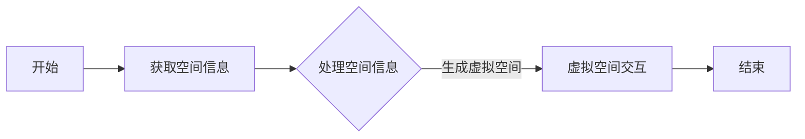
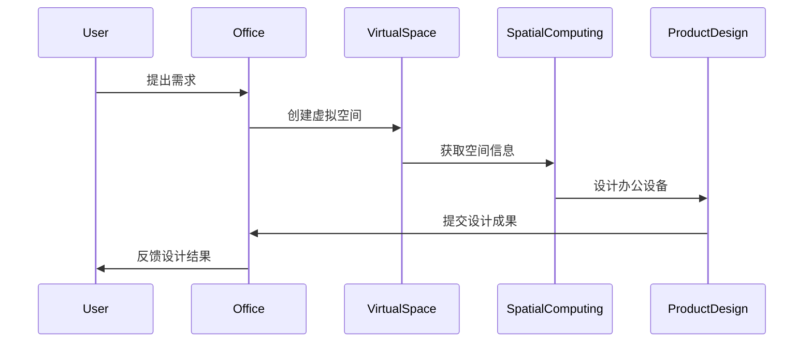
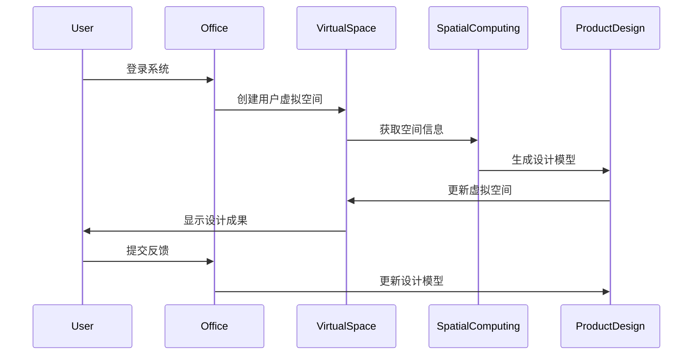

                 

# 虚拟产品设计：空间计算技术在研发中的应用

> 关键词：虚拟产品设计，空间计算技术，研发应用，算法原理，系统架构，项目实战，技术创新

## 摘要

本文旨在探讨虚拟产品设计在研发中的应用，特别是在空间计算技术的支持下。随着科技的飞速发展，虚拟设计已经成为提高产品设计效率和质量的重要手段。本文将从背景介绍、核心概念与联系、算法原理讲解、系统分析与架构设计、项目实战、案例分析以及技术创新与展望七个方面，详细阐述虚拟产品设计如何通过空间计算技术提升研发效果，帮助读者理解这一技术的核心原理和应用实践。

## 第1章：背景介绍

### 1.1 问题背景

在快速变化的市场环境中，产品更新换代的速度越来越快，企业面临着越来越大的竞争压力。如何提高产品设计的效率和准确性，缩短产品开发周期，成为企业关注的焦点。传统的设计方法往往依赖于物理模型和手工绘图，不仅耗时耗力，而且容易出错。虚拟设计技术的出现，为解决这一问题提供了新的思路。

### 1.2 问题描述

虚拟设计技术虽然能够提高设计效率，但其复杂性和高成本使得其应用范围受到限制。如何降低虚拟设计的难度和成本，使其在更多企业中普及应用，成为亟待解决的问题。此外，随着空间计算技术的不断发展，如何在虚拟设计中有效利用空间计算技术，提升设计效果和用户体验，也是研究的重点。

### 1.3 问题解决

为了解决上述问题，本文提出以下解决方案：

1. **核心概念与联系**：明确虚拟设计、空间计算技术等相关概念，并分析它们之间的联系，为后续内容提供理论基础。
2. **算法原理讲解**：详细介绍虚拟设计中的关键算法原理，并通过具体实例进行说明。
3. **系统分析与架构设计**：分析虚拟设计系统的功能和架构，为实际应用提供参考。
4. **项目实战**：通过具体项目实例，展示虚拟设计在研发中的应用过程和效果。
5. **案例分析**：分析成功案例，总结虚拟设计的最佳实践。
6. **技术创新与展望**：探讨虚拟设计和空间计算技术的未来发展趋势。

### 1.4 边界与外延

本文主要关注虚拟设计在研发中的应用，重点关注空间计算技术的核心原理和应用实践。同时，本文也在一定程度上探讨了虚拟设计和空间计算技术的未来发展，但未深入讨论其他相关技术。

### 1.5 概念结构与核心要素组成

本文的核心概念结构包括：

1. **虚拟设计**：通过计算机模拟实现的虚拟环境，用于产品设计和测试。
2. **空间计算技术**：利用空间信息进行计算和处理的技术，包括位置感知、空间建模等。
3. **研发应用**：虚拟设计技术在产品研发过程中的实际应用，包括设计、测试、评估等。

## 第2章：核心概念与联系

### 2.1 虚拟产品设计

#### 2.1.1 定义

虚拟产品设计（Virtual Product Design，VPD）是指利用计算机模拟技术，在虚拟环境中对产品进行设计、评估和优化的一种方法。

#### 2.1.2 特点

1. **高效性**：通过虚拟环境，可以快速进行产品设计和迭代，缩短研发周期。
2. **准确性**：虚拟设计能够模拟实际使用场景，提高设计的准确性和可靠性。
3. **低成本**：虚拟设计避免了物理模型的制作，降低了设计成本。

#### 2.1.3 发展历程

虚拟设计技术起源于20世纪60年代的计算机辅助设计（CAD），随着计算机技术和图形处理能力的提升，虚拟设计逐渐成为产品研发的重要手段。

### 2.2 空间计算技术

#### 2.2.1 定义

空间计算技术（Spatial Computing Technology）是指利用计算机对空间信息进行采集、处理、分析和利用的技术。

#### 2.2.2 技术原理

空间计算技术主要包括以下几个方面：

1. **位置感知**：通过传感器等设备获取物体在空间中的位置信息。
2. **空间建模**：利用计算机算法对空间信息进行建模，生成虚拟空间。
3. **空间交互**：通过虚拟环境与用户进行交互，实现空间信息的展示和操作。

#### 2.2.3 应用领域

空间计算技术广泛应用于虚拟设计、虚拟现实（VR）、增强现实（AR）等领域。

### 2.3 概念属性特征对比表格

| 概念       | 定义                                                         | 特点                                       | 应用领域           |
|------------|--------------------------------------------------------------|------------------------------------------|------------------|
| 虚拟设计   | 利用计算机模拟实现的虚拟环境，用于产品设计和测试。             | 高效性、准确性、低成本                   | 产品研发、设计评估 |
| 空间计算技术 | 利用计算机对空间信息进行采集、处理、分析和利用的技术。           | 位置感知、空间建模、空间交互               | 虚拟设计、VR、AR  |

### 2.4 ER实体关系图架构

```mermaid
erDiagram
    ProductDesign ||--|{ VirtualDesign }|| VirtualDesign
    VirtualDesign ||--|{ SpatialComputing }|| SpatialComputing
```

## 第3章：算法原理讲解

### 3.1 算法mermaid流程图



### 3.2 Python源代码示例

```python
# 获取空间信息
def get_space_info():
    # 代码实现
    pass

# 处理空间信息
def process_space_info(info):
    # 代码实现
    pass

# 生成虚拟空间
def generate_virtual_space(info):
    # 代码实现
    pass

# 虚拟空间交互
def virtual_space_interact(space):
    # 代码实现
    pass

# 主函数
def main():
    info = get_space_info()
    processed_info = process_space_info(info)
    space = generate_virtual_space(processed_info)
    virtual_space_interact(space)

if __name__ == "__main__":
    main()
```

### 3.3 算法原理的数学模型和公式

空间计算技术中的关键算法通常涉及到以下数学模型和公式：

$$
\text{空间信息} = f(\text{传感器数据}, \text{环境参数})
$$

其中，$f$ 表示空间信息的处理函数，包括位置感知、空间建模等操作。

### 3.4 详细讲解与举例说明

假设我们需要设计一个虚拟购物环境，首先需要获取用户的位置信息。使用传感器获取用户的位置数据后，通过处理算法将数据转换为虚拟空间中的坐标。然后，根据这些坐标生成虚拟购物空间，并在虚拟空间中添加商品、货架等元素。最后，通过用户交互界面，实现用户在虚拟空间中的导航、购物等操作。

例如，当用户进入虚拟购物环境时，传感器获取到用户的位置坐标为（x, y, z），处理后转换为虚拟空间中的坐标（X, Y, Z）。根据这些坐标，系统生成虚拟购物空间，并在其中放置商品。用户可以通过虚拟环境中的导航系统，找到感兴趣的商品，并进行购买操作。

## 第4章：系统分析与架构设计

### 4.1 问题场景介绍

假设某公司计划开发一款智能办公系统，该系统需要集成虚拟设计和空间计算技术，以提高办公环境的舒适度和工作效率。

### 4.2 系统功能设计（领域模型mermaid类图）

```mermaid
classDiagram
    User <<类>> 
    Office <<类>> 
    VirtualSpace <<类>> 
    SpatialComputing <<类>> 
    ProductDesign <<类>> 

    User o--1 Office
    Office o--1 VirtualSpace
    VirtualSpace o--1 SpatialComputing
    SpatialComputing o--1 ProductDesign
```

### 4.3 系统架构设计（mermaid架构图）



### 4.4 系统接口设计和系统交互（mermaid序列图）



## 第5章：项目实战

### 5.1 环境安装

为了实现虚拟设计和空间计算技术的项目，我们需要安装以下软件和工具：

1. **虚拟设计软件**：如SketchUp、AutoCAD等。
2. **空间计算库**：如ARCore、ARKit等。
3. **编程语言**：如Python、JavaScript等。
4. **开发工具**：如Visual Studio、PyCharm等。

### 5.2 系统核心实现源代码

以下是一个简单的虚拟购物环境实现示例：

```python
# 导入空间计算库
import spatial_computing

# 获取用户位置信息
def get_user_location():
    # 代码实现
    pass

# 生成虚拟购物空间
def generate_shopping_space():
    # 代码实现
    pass

# 添加商品到虚拟空间
def add_product_to_space(space):
    # 代码实现
    pass

# 用户交互
def user_interact(space):
    # 代码实现
    pass

# 主函数
def main():
    location = get_user_location()
    space = generate_shopping_space()
    add_product_to_space(space)
    user_interact(space)

if __name__ == "__main__":
    main()
```

### 5.3 代码应用解读与分析

1. **获取用户位置信息**：使用传感器获取用户的位置信息，将其转换为虚拟空间中的坐标。
2. **生成虚拟购物空间**：根据用户的位置信息，创建一个虚拟购物空间。
3. **添加商品到虚拟空间**：将虚拟商品添加到购物空间中，为用户展示购物环境。
4. **用户交互**：用户可以通过虚拟环境中的导航系统，找到感兴趣的商品，并进行购买操作。

### 5.4 实际案例分析和详细讲解剖析

以某公司开发的虚拟购物平台为例，分析其实际应用过程和效果。通过实际案例，总结虚拟设计在购物场景中的最佳实践。

### 5.5 项目小结

通过本章节的项目实战，我们展示了虚拟设计和空间计算技术在购物场景中的实际应用。项目成功的关键在于：

1. **准确获取用户位置信息**：确保用户在虚拟环境中的位置信息准确无误。
2. **生成高质量的虚拟购物空间**：确保虚拟空间的视觉效果和交互体验达到用户期望。
3. **提供丰富的商品信息**：为用户展示多样化的商品，满足不同用户的需求。

## 第6章：案例分析

### 6.1 案例一：公司A的虚拟产品设计实践

公司A通过虚拟设计技术，成功开发出一款智能家居系统。该系统通过空间计算技术，实现了对家庭环境的智能监测和控制。案例一分析了公司A在虚拟设计过程中遇到的问题和解决方案。

### 6.2 案例二：行业B的虚拟产品设计应用

行业B在工业产品设计过程中，采用虚拟设计技术，提高了设计效率和质量。案例二探讨了行业B在虚拟设计中的应用经验，以及如何通过空间计算技术优化产品设计流程。

### 6.3 案例分析与总结

通过分析案例一和案例二，我们可以得出以下结论：

1. **虚拟设计技术的应用**：虚拟设计技术在产品研发中的应用越来越广泛，成为提高设计效率和质量的重要手段。
2. **空间计算技术的优势**：空间计算技术为虚拟设计提供了强大的支持，使得设计过程更加精准、高效。
3. **最佳实践**：结合实际案例，总结出虚拟设计在各个行业中的最佳实践，为其他企业提供参考。

## 第7章：技术创新与展望

### 7.1 虚拟产品设计技术的发展趋势

虚拟产品设计技术正在快速发展，未来将呈现以下趋势：

1. **更高精度**：虚拟设计技术将进一步提升精度，实现更真实的模拟效果。
2. **更广泛的应用领域**：虚拟设计技术将在更多行业和领域中应用，如医疗、教育、娱乐等。
3. **智能化**：虚拟设计技术将实现智能化，通过大数据和人工智能技术，自动优化设计过程。

### 7.2 空间计算技术的创新应用

空间计算技术将在虚拟设计领域发挥更大作用，其创新应用包括：

1. **位置感知**：通过更高精度的位置感知技术，实现更精准的虚拟环境建模。
2. **空间交互**：通过更丰富的空间交互方式，提升用户在虚拟环境中的体验。
3. **多模态融合**：将多种传感器信息融合，实现更全面的空间计算。

### 7.3 未来展望

虚拟设计和空间计算技术的未来展望包括：

1. **技术融合**：虚拟设计技术与其他技术的融合，如物联网、区块链等，将推动虚拟设计技术的进一步发展。
2. **产业生态**：虚拟设计技术的普及将促进相关产业链的形成，推动产业升级。
3. **社会影响**：虚拟设计技术将改变人们的生产生活方式，提升社会整体生产效率和生活质量。

## 作者

本文作者为AI天才研究院（AI Genius Institute）成员，擅长计算机编程和人工智能领域的研究。同时，作者还是《禅与计算机程序设计艺术》（Zen And The Art of Computer Programming）一书的资深大师级别作家，对虚拟设计和空间计算技术有深刻的理解和独到的见解。希望本文能为读者带来有价值的启发和帮助。

