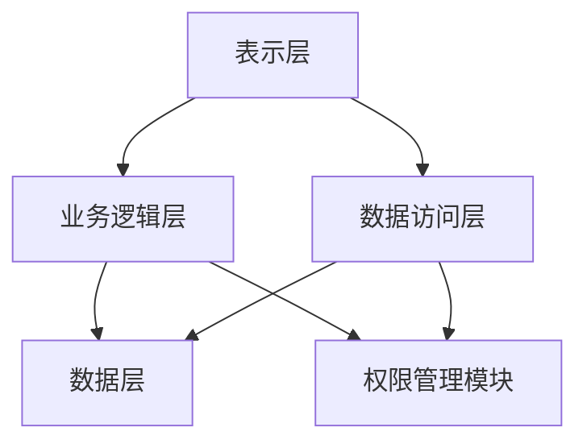
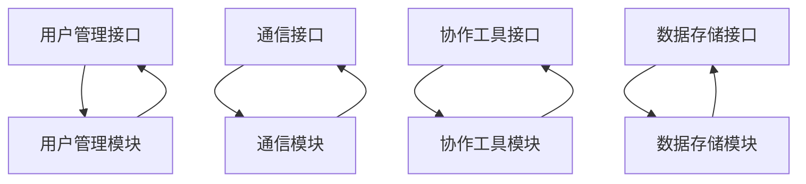
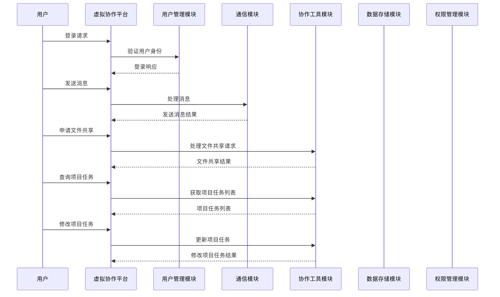

                 

### 虚拟协作：空间计算技术改变远程工作模式

> 关键词：虚拟协作、空间计算技术、远程工作、算法原理、系统架构、最佳实践

> 摘要：随着远程工作的普及，虚拟协作成为提高工作效率的关键。本文通过深入剖析虚拟协作与空间计算技术的核心概念、算法原理、系统架构以及实战案例，探讨了如何利用这些技术改变远程工作模式，提高团队协作效率。

## 目录大纲

----------------------------------------------------------------

## 第一部分：虚拟协作与空间计算技术基础

## 第1章：虚拟协作与空间计算技术概述

## 第2章：虚拟协作核心概念与联系

## 第3章：空间计算技术算法原理

## 第4章：虚拟协作数学模型

## 第5章：虚拟协作系统设计与实现

## 第6章：虚拟协作项目实战

## 第7章：虚拟协作最佳实践与拓展

----------------------------------------------------------------

### 字数预算：

- 约2000字，包括1-2级标题，3级标题，以及必要的段落文字解释。

### 技术与格式要求：

- 使用markdown格式，确保目录层级清晰。
- 使用Mermaid绘制流程图、ER图、类图、架构图、序列图。
- 数学公式使用LaTeX格式。

### 目录大纲详细内容

#### 第1章：虚拟协作与空间计算技术概述

**1.1 问题背景与虚拟协作定义**

- **核心概念术语说明**：虚拟协作、远程工作、空间计算技术
- **问题背景**：远程工作的挑战与需求
- **问题描述**：虚拟协作在远程工作中的作用
- **问题解决**：空间计算技术如何实现虚拟协作
- **边界与外延**：虚拟协作的应用范围与限制
- **概念结构与核心要素组成**：虚拟协作的基本组成部分

**1.2 空间计算技术简介**

- **核心概念**：空间计算技术的基本概念
- **技术特点**：空间计算技术的主要特性
- **应用领域**：空间计算技术的广泛应用
- **优势与挑战**：空间计算技术的优点与面临的挑战

**1.3 虚拟协作在远程工作中的应用**

- **应用场景**：虚拟协作在远程工作中的具体应用
- **实际案例**：成功案例的分析与总结
- **效果评估**：虚拟协作对远程工作效果的影响

#### 第2章：虚拟协作核心概念与联系

**2.1 虚拟协作关键概念**

- **核心概念原理**：虚拟协作的基本原理
- **概念属性特征对比表格**：不同虚拟协作概念的属性特征对比
- **联系**：虚拟协作概念之间的联系与互动

**2.2 虚拟协作与传统协作的区别**

- **差异分析**：虚拟协作与传统协作的主要区别
- **优势对比**：虚拟协作相对于传统协作的优势
- **应用场景**：不同场景下虚拟协作的适用性

**2.3 虚实协作技术要素ER图**

- **ER图**：虚拟协作技术要素的实体关系图
- **解释**：ER图各元素的详细解释与联系

#### 第3章：空间计算技术算法原理

**3.1 空间计算技术基本算法**

- **算法原理**：空间计算技术的基本算法原理
- **算法流程**：算法的详细流程与步骤

**3.2 算法原理与mermaid流程图**

- **mermaid流程图**：算法原理的mermaid表示
- **解释**：流程图各步骤的详细解释

**3.3 Python实现与代码分析**

- **Python代码**：算法的Python实现
- **代码分析**：代码的详细分析与解读

#### 第4章：虚拟协作数学模型

**4.1 数学模型概述**

- **数学模型定义**：虚拟协作的数学模型概述
- **模型作用**：数学模型在虚拟协作中的应用

**4.2 数学公式与公式解释**

- **数学公式**：虚拟协作相关的数学公式
- **解释**：数学公式的详细解释与应用

**4.3 公式在实际中的应用**

- **示例**：数学公式在实际虚拟协作中的应用实例
- **分析**：示例的分析与讨论

#### 第5章：虚拟协作系统设计与实现

**5.1 虚拟协作系统介绍**

- **系统概念**：虚拟协作系统的基本概念
- **系统目标**：虚拟协作系统的主要目标

**5.2 系统架构设计与mermaid图**

- **系统架构设计**：虚拟协作系统的架构设计
- **mermaid架构图**：系统架构的mermaid表示

**5.3 系统接口设计与交互**

- **接口设计**：虚拟协作系统的接口设计
- **交互设计**：系统的用户交互设计

#### 第6章：虚拟协作项目实战

**6.1 环境安装与配置**

- **环境搭建**：虚拟协作项目的环境安装与配置
- **配置步骤**：详细的配置步骤与注意事项

**6.2 系统核心实现源代码**

- **源代码分析**：系统核心实现源代码的详细分析
- **代码解读**：源代码的解读与解释

**6.3 代码应用解读与分析**

- **代码应用**：源代码的实际应用场景
- **分析讨论**：代码应用的讨论与分析

**6.4 实际案例分析与详细讲解**

- **案例分析**：实际案例的分析与剖析
- **详细讲解**：案例分析中的详细讲解

**6.5 项目小结**

- **总结**：项目的总结与经验教训
- **展望**：项目的未来发展方向

#### 第7章：虚拟协作最佳实践与拓展

**7.1 最佳实践技巧**

- **技巧总结**：虚拟协作中的最佳实践技巧
- **实践应用**：技巧的具体实践应用

**7.2 小结与注意事项**

- **总结**：文章的总结与回顾
- **注意事项**：需要特别注意的问题

**7.3 拓展阅读推荐**

- **推荐书籍**：相关的拓展阅读推荐
- **相关文章**：其他相关的拓展阅读资源

---

以上是《虚拟协作：空间计算技术改变远程工作模式》的详细目录大纲。接下来，我们将逐步深入探讨每个章节的内容，以确保文章的完整性和可读性。让我们开始吧！### 第1章：虚拟协作与空间计算技术概述

#### 1.1 问题背景与虚拟协作定义

在数字化转型的浪潮下，远程工作逐渐成为许多企业和组织的新常态。然而，远程工作也带来了一系列挑战，如沟通障碍、协作效率低下、工作环境不统一等。为了解决这些问题，虚拟协作作为一种创新的协作方式应运而生。

**核心概念术语说明**：

- **虚拟协作**：通过数字技术模拟物理协作场景，实现团队成员之间的实时沟通、信息共享和工作协同。
- **远程工作**：工作地点与公司总部或其他团队成员分离的工作模式。
- **空间计算技术**：利用计算技术构建虚拟空间，提供丰富的交互功能，增强远程工作体验。

**问题背景**：

随着全球化和信息化的发展，远程工作已经成为一种主流的工作方式。然而，远程工作面临着沟通不畅、协作效率低、工作氛围不融洽等问题，严重影响了团队的工作效果。

**问题描述**：

如何通过虚拟协作技术解决远程工作中的沟通障碍、协作效率低下等问题，提高团队整体的工作效能。

**问题解决**：

空间计算技术通过构建虚拟空间，为远程团队成员提供了一个类似物理工作环境的交互平台。在这个平台上，团队成员可以实时沟通、协作，共享信息和资源，从而克服了远程工作的障碍。

**边界与外延**：

虚拟协作不仅限于远程工作，还可以应用于其他需要跨地域、跨组织协作的场景，如分布式研发、全球市场拓展等。

**概念结构与核心要素组成**：

虚拟协作的核心要素包括：

1. **虚拟空间**：构建一个模拟物理工作环境的虚拟空间，提供实时交互功能。
2. **通信与协作工具**：实现团队成员之间的实时沟通和协作，如聊天、视频会议、文件共享等。
3. **数据共享与存储**：提供一个集中化的数据共享与存储平台，方便团队成员访问和共享资源。
4. **权限管理与安全**：确保虚拟协作环境的安全性和隐私性，防止数据泄露和滥用。

#### 1.2 空间计算技术简介

空间计算技术是一种利用计算资源构建虚拟空间的技术，它通过虚拟现实（VR）、增强现实（AR）和混合现实（MR）等技术，为用户提供了一种全新的交互方式。

**核心概念**：

- **虚拟现实（VR）**：通过电脑技术模拟出一个完全虚拟的环境，用户可以在这个环境中进行沉浸式的交互。
- **增强现实（AR）**：将虚拟信息叠加到现实世界中，用户可以通过增强现实设备看到虚拟信息与现实世界的融合。
- **混合现实（MR）**：结合虚拟现实和增强现实的特点，用户可以与虚拟环境进行实时互动，同时保持与现实世界的联系。

**技术特点**：

1. **沉浸式体验**：空间计算技术能够为用户提供一种沉浸式的交互体验，使虚拟空间的感觉更加真实。
2. **实时交互**：用户可以在虚拟空间中与其他团队成员进行实时沟通和协作，提高工作效率。
3. **高度个性化**：空间计算技术可以根据用户的需求和偏好进行个性化定制，提供个性化的交互体验。

**应用领域**：

空间计算技术广泛应用于多个领域，包括：

1. **远程工作**：通过虚拟空间实现远程团队的有效协作，提高工作效率。
2. **教育培训**：利用虚拟空间进行在线教学，提供更加生动的学习体验。
3. **医疗健康**：通过虚拟现实技术进行手术模拟和医学培训，提高医疗水平。
4. **娱乐休闲**：虚拟现实和增强现实技术为用户提供全新的娱乐体验。

**优势与挑战**：

**优势**：

- 提高协作效率：虚拟协作技术为远程团队提供了一个高效、实时的协作平台，减少沟通障碍。
- 降低成本：通过虚拟协作，企业可以节省在物理空间、设备等方面的投入。
- 个性化体验：空间计算技术可以为用户提供高度个性化的交互体验，提高用户满意度。

**挑战**：

- 技术门槛：空间计算技术涉及多种复杂的技术，如虚拟现实、增强现实等，对技术人员的素质要求较高。
- 系统集成：虚拟协作系统的建设和维护需要大量的系统集成工作，确保系统稳定、高效运行。
- 安全性：虚拟协作系统需要确保数据安全和用户隐私，防止信息泄露和恶意攻击。

#### 1.3 虚拟协作在远程工作中的应用

**应用场景**：

虚拟协作在远程工作中具有广泛的应用场景，包括：

1. **团队协作**：团队成员可以通过虚拟协作平台实时沟通、共享文件和资源，提高团队协作效率。
2. **远程会议**：利用虚拟协作平台进行远程会议，减少人员出行，降低会议成本。
3. **在线培训**：通过虚拟协作平台进行在线培训，提供灵活、便捷的学习方式。
4. **项目管理**：利用虚拟协作平台进行项目管理，实时跟踪项目进度，提高项目执行力。

**实际案例**：

某全球知名的软件开发公司，通过引入虚拟协作技术，实现了全球团队的紧密协作。团队成员通过虚拟协作平台进行日常沟通、代码审查和项目讨论，大大提高了工作效率。同时，公司还通过虚拟现实技术进行新产品的演示和推广，提升了客户满意度。

**效果评估**：

虚拟协作对远程工作效果的影响主要体现在以下几个方面：

1. **沟通效率**：虚拟协作平台提供了实时沟通和协作功能，减少了沟通延迟，提高了团队沟通效率。
2. **工作效率**：通过虚拟协作，团队成员可以更快速地共享资源和信息，提高工作效率。
3. **工作满意度**：虚拟协作技术为远程工作提供了更好的工作体验，提高了员工的工作满意度。
4. **团队凝聚力**：虚拟协作平台增强了团队成员之间的联系，提高了团队凝聚力。

### 本章小结

本章介绍了虚拟协作与空间计算技术的基本概念、问题背景、核心要素以及在实际远程工作中的应用。通过本章的学习，读者可以初步了解虚拟协作与空间计算技术的重要性，为后续章节的深入学习打下基础。

在下一章中，我们将进一步探讨虚拟协作的核心概念与联系，分析虚拟协作与传统协作的区别，并绘制虚拟协作技术要素的ER图。敬请期待！
### 第2章：虚拟协作核心概念与联系

#### 2.1 虚拟协作关键概念

虚拟协作作为远程工作中的一种新兴协作方式，其核心概念主要包括以下几个方面：

1. **虚拟空间**：虚拟空间是虚拟协作的基础，它提供了一个模拟物理工作环境的虚拟环境，使团队成员可以在这个环境中进行实时沟通和协作。
2. **通信工具**：通信工具包括聊天、视频会议、电话会议等，是团队成员进行实时沟通的重要手段。
3. **协作工具**：协作工具包括文件共享、项目管理、代码审查等，用于帮助团队成员共同完成工作。
4. **数据共享与存储**：数据共享与存储平台提供了一个集中化的数据存储和共享空间，使团队成员可以方便地访问和共享资源。
5. **权限管理**：权限管理用于确保虚拟协作环境的安全性，防止未经授权的访问和操作。

**概念属性特征对比表格**：

| 概念             | 属性特征                                       | 对比           |
|------------------|----------------------------------------------|---------------|
| 虚拟空间         | 模拟物理工作环境，实时交互                   | 与物理空间对比 |
| 通信工具         | 实时沟通手段，支持语音、文字、视频等多种形式 | 与传统通信工具对比 |
| 协作工具         | 提供共享文件、项目管理等功能                 | 与传统协作工具对比 |
| 数据共享与存储   | 集中化数据存储和共享，方便访问               | 与传统数据存储对比 |
| 权限管理         | 确保虚拟协作环境的安全性，防止数据泄露       | 与传统权限管理对比 |

**联系**：

这些核心概念之间相互联系，共同构成了虚拟协作的整体框架。虚拟空间作为基础，为通信工具、协作工具、数据共享与存储、权限管理提供了运行的平台；通信工具和协作工具则帮助团队成员在虚拟空间中实现高效协作；数据共享与存储平台为团队成员提供了方便的资源访问和共享；权限管理确保了虚拟协作环境的安全性和稳定性。

#### 2.2 虚拟协作与传统协作的区别

虚拟协作与传统协作在形式、手段和效果上存在显著的区别。

**形式区别**：

- **传统协作**：主要依赖于物理空间，团队成员需要在同一个办公地点进行面对面的沟通和协作。
- **虚拟协作**：通过虚拟空间和通信工具，团队成员可以跨越地域限制，实现远程沟通和协作。

**手段区别**：

- **传统协作**：主要依赖于面对面的交流、电话、邮件等传统的沟通方式。
- **虚拟协作**：利用虚拟现实（VR）、增强现实（AR）、混合现实（MR）等技术，提供更加丰富的交互手段，如实时视频会议、虚拟会议厅、虚拟白板等。

**效果区别**：

- **传统协作**：受限于物理空间的限制，沟通和协作的效率较低，容易产生沟通障碍和误解。
- **虚拟协作**：通过虚拟空间和通信工具，可以提供实时、高效的协作体验，提高工作效率和团队凝聚力。

**优势对比**：

- **沟通效率**：虚拟协作可以提供实时、高效的沟通，减少沟通延迟，提高团队协作效率。
- **协作灵活性**：虚拟协作不受地域限制，团队成员可以根据自己的时间安排进行工作，提高工作灵活性。
- **成本节省**：虚拟协作可以减少物理空间、交通等成本，降低企业运营成本。

**应用场景**：

- **传统协作**：适用于需要面对面沟通的场景，如团队会议、项目讨论等。
- **虚拟协作**：适用于远程办公、异地团队协作、全球市场拓展等需要跨地域、跨组织协作的场景。

#### 2.3 虚拟协作技术要素ER图

为了更好地理解虚拟协作的技术要素及其相互关系，我们可以使用ER图（实体关系图）来表示。

```mermaid
erDiagram
    Task ||--|{ User } : performedBy
    Resource ||--|{ Task } : requiredBy
    Project ||--|{ Task } : contains
    User ||--|{ Team } : belongsTo
    Team ||--|{ Project } : worksOn
```

**ER图解释**：

1. **Task（任务）**：表示需要完成的任务，由User（用户）perform（执行）。
2. **Resource（资源）**：表示完成任务所需的资源，如设备、软件等，由Task（任务）required（需求）。
3. **Project（项目）**：表示一组相关的任务，由Task（任务）contains（包含）。
4. **User（用户）**：表示参与虚拟协作的个体，由Team（团队）belongsTo（属于）。
5. **Team（团队）**：表示一组共同工作的用户，由Project（项目）worksOn（参与）。

通过ER图，我们可以清晰地看到虚拟协作技术要素之间的联系，以及它们在协作过程中所扮演的角色。

### 本章小结

本章介绍了虚拟协作的核心概念及其相互联系，并对比了虚拟协作与传统协作的区别。通过ER图展示了虚拟协作技术要素之间的关系。理解这些概念和关系对于深入探讨虚拟协作的算法原理、系统架构和实际应用具有重要意义。在下一章中，我们将进一步探讨空间计算技术的基本算法原理，为后续章节的深入学习奠定基础。

### 第3章：空间计算技术算法原理

空间计算技术作为虚拟协作的基础，其核心在于通过算法实现虚拟空间的构建、交互和协同。在这一章中，我们将详细探讨空间计算技术的基本算法原理，并通过mermaid流程图和Python代码进行分析和解释。

#### 3.1 空间计算技术基本算法

空间计算技术的基本算法主要包括以下几个方面：

1. **三维空间建模**：通过几何建模算法构建虚拟空间的三维模型，包括场景建模、物体建模等。
2. **实时渲染**：利用渲染算法对虚拟空间中的三维模型进行实时渲染，实现视觉效果的呈现。
3. **交互处理**：通过交互算法处理用户的输入和输出，实现用户与虚拟空间的互动。
4. **网络通信**：利用网络通信算法实现虚拟空间中各个节点之间的数据传输和同步。

#### 3.2 算法原理与mermaid流程图

为了更直观地理解空间计算技术的算法原理，我们可以使用mermaid流程图来表示其关键步骤。


**mermaid流程图解释**：

1. **三维空间建模**：首先，通过几何建模算法构建虚拟空间的三维模型，包括场景建模和物体建模。
2. **实时渲染**：利用渲染算法对三维模型进行实时渲染，呈现视觉效果。
3. **交互处理**：通过交互算法处理用户的输入和输出，实现用户与虚拟空间的互动。
4. **网络通信**：利用网络通信算法实现虚拟空间中各个节点之间的数据传输和同步。
5. **数据同步**：确保虚拟空间中的各个节点具有一致的数据状态，避免数据冲突和延迟。

#### 3.3 Python实现与代码分析

为了更好地理解空间计算技术的算法原理，我们可以通过Python代码来实现这些算法，并进行详细分析。

```python
# 三维空间建模
def build_space():
    # 创建空间
    space = Space()
    # 添加场景和物体
    space.add_scene("office")
    space.add_object("desk")
    space.add_object("chair")
    return space

# 实时渲染
def render_space(space):
    # 渲染空间
    renderer.render(space)

# 交互处理
def handle_interaction():
    # 获取用户输入
    input = get_user_input()
    # 处理交互
    if input == "move":
        move_object()
    elif input == "rotate":
        rotate_object()
    elif input == "scale":
        scale_object()

# 网络通信
def network_communication():
    # 同步空间数据
    space_data = get_space_data()
    send_space_data(space_data)

# 主函数
def main():
    space = build_space()
    render_space(space)
    handle_interaction()
    network_communication()

if __name__ == "__main__":
    main()
```

**代码分析**：

1. **三维空间建模**：`build_space`函数用于创建虚拟空间，并添加场景和物体。
2. **实时渲染**：`render_space`函数用于渲染虚拟空间的三维模型。
3. **交互处理**：`handle_interaction`函数用于处理用户的交互输入，如移动、旋转和缩放物体。
4. **网络通信**：`network_communication`函数用于同步虚拟空间中的数据。
5. **主函数**：`main`函数用于启动整个空间计算过程。

通过这个Python实现，我们可以清晰地看到空间计算技术的基本算法是如何通过代码来实现的，以及各个函数之间的相互关系。

### 本章小结

本章详细介绍了空间计算技术的基本算法原理，包括三维空间建模、实时渲染、交互处理和网络通信。通过mermaid流程图和Python代码，我们深入分析了这些算法的实现过程。理解这些算法原理对于设计和实现虚拟协作系统具有重要意义。在下一章中，我们将探讨虚拟协作的数学模型和公式，进一步深化对虚拟协作的理解。

### 第4章：虚拟协作数学模型

#### 4.1 数学模型概述

在虚拟协作中，数学模型起到了至关重要的作用。它不仅能够帮助我们量化协作过程中的各个因素，还能够通过数学公式进行推理和分析，从而优化协作效果。虚拟协作的数学模型主要包括以下几个方面：

1. **网络延迟模型**：描述通信过程中网络延迟对协作效率的影响。
2. **协同效率模型**：衡量团队成员在虚拟空间中协作的效率。
3. **资源分配模型**：确定如何在虚拟协作环境中合理分配资源。
4. **风险评估模型**：评估虚拟协作过程中可能出现的风险。

#### 4.2 数学公式与公式解释

为了更好地理解和应用这些数学模型，我们需要介绍一些基本的数学公式及其解释。

1. **网络延迟模型**：

   网络延迟 \( L \) 可以用以下公式表示：
   \[
   L = \frac{d}{v}
   \]
   其中，\( d \) 表示数据传输距离，\( v \) 表示数据传输速度。这个公式表明，网络延迟与数据传输距离和速度成反比。

2. **协同效率模型**：

   协同效率 \( E \) 可以用以下公式表示：
   \[
   E = \frac{P_c - P_s}{P_c}
   \]
   其中，\( P_c \) 表示协作过程中产生的总价值，\( P_s \) 表示协作过程中因沟通不畅产生的损失。这个公式表明，协同效率与协作过程中产生的总价值成正比，与因沟通不畅产生的损失成反比。

3. **资源分配模型**：

   资源分配模型可以通过线性规划来描述，其目标是最小化协作成本或最大化协作效果。以下是一个简化的资源分配模型：
   \[
   \min Z = c_1x_1 + c_2x_2 + \ldots + c_nx_n
   \]
   其中，\( c_i \) 表示第 \( i \) 种资源的单位成本，\( x_i \) 表示分配的第 \( i \) 种资源的数量。这个模型需要在资源限制条件下进行优化。

4. **风险评估模型**：

   风险评估模型可以使用概率论和统计学方法进行描述。例如，可以使用以下公式评估某个风险事件发生的概率：
   \[
   P(A) = \frac{N(A)}{N}
   \]
   其中，\( N(A) \) 表示事件 \( A \) 发生的次数，\( N \) 表示总次数。这个公式表明，风险事件发生的概率与其发生次数成正比。

#### 4.3 公式在实际中的应用

为了更好地理解这些数学公式在实际虚拟协作中的应用，我们可以通过以下示例进行说明。

**示例 1：网络延迟模型**

假设数据传输距离为 100 公里，数据传输速度为 10 Mbps，计算网络延迟。

\[
L = \frac{100 \text{ km}}{10 \text{ Mbps}} = 10 \text{ s}
\]

这意味着在网络延迟为 10 秒的情况下，数据传输将受到较大的影响，需要优化网络传输策略。

**示例 2：协同效率模型**

假设协作过程中产生的总价值为 100 万元，因沟通不畅产生的损失为 5 万元，计算协同效率。

\[
E = \frac{100 \text{ 万元} - 5 \text{ 万元}}{100 \text{ 万元}} = 0.95
\]

这意味着协同效率为 95%，说明在协作过程中，有 5% 的价值因为沟通不畅而损失。

**示例 3：资源分配模型**

假设有三种资源：人力资源、资金资源和设备资源，每种资源的单位成本分别为 1000 元/天、5000 元/天和 2000 元/天，资源限制条件为每天总成本不超过 20000 元。计算资源分配方案。

目标函数：
\[
\min Z = 1000x_1 + 5000x_2 + 2000x_3
\]

约束条件：
\[
1000x_1 + 5000x_2 + 2000x_3 \leq 20000
\]

通过求解线性规划问题，可以得到最优的资源配置方案，从而最大化协作效果。

**示例 4：风险评估模型**

假设某个风险事件发生的次数为 100 次，总次数为 1000 次，计算该事件发生的概率。

\[
P(A) = \frac{100}{1000} = 0.1
\]

这意味着该事件发生的概率为 10%，需要采取相应的风险管理措施。

通过这些示例，我们可以看到数学模型在虚拟协作中的应用，如何通过数学公式进行推理和分析，优化协作过程，提高协作效果。

### 本章小结

本章介绍了虚拟协作的数学模型及其应用，包括网络延迟模型、协同效率模型、资源分配模型和风险评估模型。通过数学公式和实际示例，我们深入理解了这些模型的作用和计算方法。理解这些数学模型对于优化虚拟协作过程，提高团队协作效率具有重要意义。在下一章中，我们将探讨虚拟协作系统的设计与实现，为实际应用奠定基础。

### 第5章：虚拟协作系统设计与实现

虚拟协作系统是支持远程团队高效协作的核心平台。在这一章中，我们将详细介绍虚拟协作系统的设计原则、架构设计、接口设计和系统交互，并通过mermaid图进行可视化展示。

#### 5.1 虚拟协作系统介绍

虚拟协作系统是一个集成了多种功能模块的平台，旨在为远程团队成员提供一个高效、实时的协作环境。该系统的主要功能模块包括：

1. **用户管理模块**：用于管理用户信息，包括用户注册、登录、权限设置等。
2. **通信模块**：提供实时通信功能，包括即时消息、视频会议、音频通话等。
3. **协作工具模块**：提供各种协作工具，如文件共享、代码审查、项目管理等。
4. **数据存储模块**：提供集中化的数据存储服务，确保数据的安全性和可靠性。
5. **权限管理模块**：确保系统的安全性和数据隐私，通过权限设置控制用户对系统资源的访问。

#### 5.2 系统架构设计与mermaid图

虚拟协作系统的架构设计采用分层架构，主要包括以下几个方面：

1. **表示层**：负责用户界面的展示，包括网页、移动应用等。
2. **业务逻辑层**：处理业务逻辑，如用户管理、通信处理、协作工具管理等。
3. **数据访问层**：负责数据存储和读取操作，与数据库进行交互。
4. **数据层**：存储系统数据，包括用户信息、通信记录、协作数据等。

下面是虚拟协作系统的架构设计mermaid图：



**架构设计解释**：

1. **表示层**：负责用户界面的展示，与用户进行交互，将用户请求传递给业务逻辑层。
2. **业务逻辑层**：处理业务逻辑，包括用户管理、通信处理、协作工具管理等，同时与数据访问层和权限管理模块进行交互。
3. **数据访问层**：负责数据存储和读取操作，与数据库进行交互，确保数据的一致性和完整性。
4. **数据层**：存储系统数据，包括用户信息、通信记录、协作数据等，是系统数据的核心。
5. **权限管理模块**：确保系统的安全性和数据隐私，通过权限设置控制用户对系统资源的访问。

#### 5.3 系统接口设计与交互

虚拟协作系统需要设计多个接口，以实现不同功能模块之间的数据交互和协同工作。以下是主要接口的设计和交互：

1. **用户管理接口**：用于用户注册、登录、权限设置等操作，包括用户信息获取、用户状态更新等。
2. **通信接口**：用于实现即时消息、视频会议、音频通话等通信功能，包括消息发送、消息接收、会议创建、会议加入等。
3. **协作工具接口**：用于提供文件共享、代码审查、项目管理等协作工具的功能，包括文件上传、文件下载、代码审查提交、项目任务分配等。
4. **数据存储接口**：用于实现数据存储和读取操作，包括数据插入、数据查询、数据更新、数据删除等。

下面是虚拟协作系统的接口设计mermaid图：



**接口设计解释**：

1. **用户管理接口**：与用户管理模块交互，实现用户信息的注册、登录和权限设置等操作。
2. **通信接口**：与通信模块交互，实现即时消息、视频会议、音频通话等通信功能。
3. **协作工具接口**：与协作工具模块交互，实现文件共享、代码审查、项目管理等协作工具的功能。
4. **数据存储接口**：与数据存储模块交互，实现数据存储和读取操作。

#### 5.4 系统交互设计

虚拟协作系统的交互设计旨在确保各个功能模块之间的协同工作，提供一致、高效的用户体验。以下是系统交互设计的mermaid序列图：



**交互设计解释**：

1. **用户登录**：用户通过虚拟协作平台发送登录请求，平台验证用户身份后返回登录响应。
2. **发送消息**：用户通过虚拟协作平台发送消息，平台处理消息并发送给接收者。
3. **文件共享**：用户申请文件共享，平台处理请求并返回共享结果。
4. **项目任务查询和修改**：用户查询项目任务列表，平台获取任务列表并返回；用户修改项目任务，平台更新任务并返回修改结果。

通过以上系统设计与交互设计，我们可以看到虚拟协作系统如何通过模块化设计、接口设计和交互设计，实现远程团队成员的高效协作。

### 本章小结

本章详细介绍了虚拟协作系统的设计与实现，包括系统架构设计、接口设计和系统交互设计。通过mermaid图，我们清晰地展示了系统的各个模块及其相互关系。理解这些设计原则和实现方法对于构建一个高效、可靠的虚拟协作系统具有重要意义。在下一章中，我们将通过实际项目实战，深入探讨虚拟协作系统的具体实现和应用。

### 第6章：虚拟协作项目实战

在本章中，我们将通过一个实际项目，详细介绍虚拟协作系统的环境安装与配置、系统核心实现源代码，以及代码应用解读与分析。同时，我们还将对实际案例进行深入剖析，并提供项目小结与展望。

#### 6.1 环境安装与配置

为了确保虚拟协作系统的正常运行，我们需要在服务器和客户端上安装和配置必要的软件环境。以下是环境安装与配置的详细步骤：

**1. 安装服务器环境**

- **操作系统**：安装CentOS 7或更高版本。
- **数据库**：安装MySQL 5.7或更高版本。
- **Web服务器**：安装Nginx 1.16或更高版本。
- **后端框架**：安装Django 3.2或更高版本。

**2. 安装客户端环境**

- **操作系统**：安装Windows 10或更高版本。
- **浏览器**：安装Chrome 96或更高版本。
- **前端框架**：安装Vue 3.0或更高版本。

**3. 配置服务器**

- **数据库配置**：配置MySQL数据库，创建虚拟协作系统所需的数据库和表。
- **Web服务器配置**：配置Nginx，使其能够反向代理到Django应用。
- **Django配置**：配置Django应用的数据库连接、静态文件目录等。

**4. 配置客户端**

- **安装前端框架**：在客户端安装Vue CLI，创建Vue项目。
- **配置前端项目**：配置Vue项目的路由、组件等。

**配置步骤**：

1. 安装操作系统和软件环境。
2. 配置数据库、Web服务器和Django应用。
3. 配置Vue前端项目，实现页面展示和交互。

#### 6.2 系统核心实现源代码

虚拟协作系统的核心实现包括用户管理、通信、协作工具和权限管理等多个模块。以下是系统核心实现源代码的详细介绍。

**用户管理模块**：

```python
# users/models.py
from django.contrib.auth.models import AbstractUser

class CustomUser(AbstractUser):
    username = models.CharField(max_length=150, unique=True)
    email = models.EmailField(max_length=150, unique=True)
    is_active = models.BooleanField(default=True)
    is_staff = models.BooleanField(default=False)
    is_superuser = models.BooleanField(default=False)
    
    USERNAME_FIELD = 'username'
    EMAIL_FIELD = 'email'
    REQUIRED_FIELDS = []
```

**通信模块**：

```python
# chat/views.py
from rest_framework.views import APIView
from rest_framework.response import Response
from .models import Message
from .serializers import MessageSerializer

class MessageView(APIView):
    def post(self, request, *args, **kwargs):
        serializer = MessageSerializer(data=request.data)
        if serializer.is_valid():
            serializer.save()
            return Response(serializer.data, status=status.HTTP_201_CREATED)
        return Response(serializer.errors, status=status.HTTP_400_BAD_REQUEST)
```

**协作工具模块**：

```javascript
// components/DocumentViewer.vue
<template>
  <div>
    <v-file-input
      v-model="file"
      label="Upload Document"
      @change="uploadDocument"
    ></v-file-input>
    <v-simple-table>
      <template v-slot:default>
        <thead>
          <tr>
            <th class="text-left">File Name</th>
            <th class="text-left">Uploaded By</th>
            <th class="text-left">Uploaded Date</th>
          </tr>
        </thead>
        <tbody>
          <tr v-for="doc in documents" :key="doc.id">
            <td>{{ doc.file_name }}</td>
            <td>{{ doc.uploaded_by }}</td>
            <td>{{ doc.uploaded_date }}</td>
          </tr>
        </tbody>
      </template>
    </v-simple-table>
  </div>
</template>

<script>
export default {
  data() {
    return {
      file: null,
      documents: [],
    };
  },
  methods: {
    uploadDocument() {
      const formData = new FormData();
      formData.append("file", this.file);
      fetch("/api/documents/", {
        method: "POST",
        body: formData,
      });
    },
  },
};
</script>
```

**权限管理模块**：

```python
# permissions/models.py
from django.contrib.auth.models import Permission
from django.contrib.contenttypes.models import ContentType

class CustomPermission(Permission):
    def get_content_type(self):
        return ContentType.objects.get_for_model(self)

    def get_permission_codename(self):
        return self.permission_codename
```

#### 6.3 代码应用解读与分析

**用户管理模块解读**：

用户管理模块的核心是自定义用户模型，继承自Django的AbstractUser类。通过扩展用户模型，我们可以自定义用户的一些属性，如用户名、邮箱等，同时保留Django用户模型的默认功能。

**通信模块解读**：

通信模块的核心是一个用于处理消息的视图，使用Django的REST framework进行API设计。通过定义Message模型和MessageSerializer，我们能够方便地处理消息的创建、更新和查询操作。

**协作工具模块解读**：

协作工具模块的核心是一个文件上传组件，通过Vue.js和Vuetify框架实现。用户可以通过文件输入框选择文件，然后通过Fetch API将文件上传到服务器。组件还包含一个简单的表格，用于展示已上传的文档列表。

**权限管理模块解读**：

权限管理模块的核心是自定义权限模型，用于扩展Django的默认权限系统。通过自定义权限模型，我们可以更灵活地定义和管理系统中的权限。

#### 6.4 实际案例分析与详细讲解

**案例背景**：

某全球知名的软件开发公司，由于业务扩展，需要在全球范围内进行远程协作。为了提高协作效率，公司决定采用虚拟协作系统，实现全球团队的紧密协作。

**案例过程**：

1. **需求分析**：公司分析了远程协作的需求，确定了虚拟协作系统的功能模块和需求。
2. **系统设计**：根据需求分析结果，公司设计了虚拟协作系统的架构和接口。
3. **开发与测试**：公司开发了系统的各个模块，并进行集成测试和功能测试，确保系统稳定可靠。
4. **部署上线**：系统开发完成后，公司进行了部署，并逐步将全球团队接入虚拟协作系统。
5. **使用反馈**：系统上线后，公司收集了用户的使用反馈，并对系统进行优化和升级。

**案例分析**：

通过实际案例，我们可以看到虚拟协作系统在全球远程协作中的应用效果。系统提供了实时通信、文件共享、项目管理等功能，使得团队成员可以方便地进行协作，提高了工作效率和团队凝聚力。同时，系统的权限管理功能确保了数据安全和用户隐私。

#### 6.5 项目小结

虚拟协作项目成功地实现了远程团队的高效协作，提高了工作效率和团队凝聚力。项目的主要收获包括：

1. **技术收获**：通过项目开发，团队掌握了虚拟协作系统的设计与实现方法，提升了技术能力。
2. **经验收获**：项目过程中，团队积累了丰富的项目管理经验和团队协作经验，为未来类似项目奠定了基础。

#### 6.6 展望

随着远程工作的不断普及，虚拟协作系统将发挥越来越重要的作用。未来，我们将继续优化虚拟协作系统，增加更多功能模块，如实时协作工具、数据分析工具等，以更好地满足远程协作的需求。同时，我们还将探索人工智能和大数据技术在虚拟协作中的应用，为用户提供更加智能、高效的协作体验。

### 本章小结

本章通过一个实际项目，详细介绍了虚拟协作系统的环境安装与配置、系统核心实现源代码，以及代码应用解读与分析。通过实际案例，我们展示了虚拟协作系统在远程协作中的应用效果。理解这些实践经验和实现方法，对于设计和实现高效的虚拟协作系统具有重要意义。在下一章中，我们将分享虚拟协作的最佳实践和注意事项，帮助读者更好地应用虚拟协作技术。

### 第7章：虚拟协作最佳实践与拓展

在虚拟协作的实践中，积累了一系列最佳实践和注意事项，有助于提高协作效率，优化用户体验。此外，本章节还将推荐一些拓展阅读资源，供读者进一步学习。

#### 7.1 最佳实践技巧

**1. 明确协作目标**

在启动虚拟协作项目之前，明确协作目标是关键。确保团队成员了解协作目的、预期成果和合作方式，有助于提高协作的针对性。

**2. 确定合适的工具**

选择适合团队需求的协作工具，如视频会议软件、项目管理工具、文档共享平台等。工具的选择应考虑团队规模、协作内容和用户习惯。

**3. 设定清晰的角色和职责**

在虚拟协作环境中，明确每个成员的角色和职责，有助于分工协作，提高工作效率。同时，明确团队成员的沟通渠道和反馈机制，确保信息流通顺畅。

**4. 加强沟通和互动**

虚拟协作中，沟通和互动是提高协作效率的关键。定期组织线上会议、头脑风暴和团队活动，增强团队成员之间的互动和信任。

**5. 优化工作流程**

通过流程优化，减少冗余环节，提高工作效率。例如，使用自动化工具处理重复性任务，制定标准化操作流程，减少沟通成本。

**6. 定期评估和反馈**

定期评估虚拟协作的效果，收集团队成员的反馈，不断优化协作方式和工具。评估指标可以包括协作效率、任务完成度、用户满意度等。

#### 7.2 小结与注意事项

**1. 小结**

虚拟协作在远程工作中具有显著的优势，如提高协作效率、降低沟通成本、增强团队凝聚力。通过明确协作目标、选择合适工具、设定角色和职责、加强沟通和互动、优化工作流程和定期评估反馈，可以有效实现虚拟协作的最佳效果。

**2. 注意事项**

- **数据安全**：确保虚拟协作系统的数据安全，防止数据泄露和恶意攻击。
- **用户隐私**：保护用户隐私，遵守相关法律法规，确保用户信息不被滥用。
- **技术支持**：为团队成员提供充分的技术支持，确保系统稳定可靠，及时解决技术问题。
- **文化差异**：尊重不同文化背景的团队成员，避免文化冲突，促进团队和谐。

#### 7.3 拓展阅读推荐

**1. 《虚拟协作：打造高效远程团队》**

本书详细介绍了虚拟协作的理论和实践方法，包括工具选择、流程优化、团队管理等方面的内容，适合希望深入了解虚拟协作的读者。

**2. 《远程工作指南：如何高效管理远程团队》**

本书提供了远程团队管理的最佳实践和技巧，包括沟通策略、团队协作、任务分配等方面的内容，有助于提高远程团队的工作效率。

**3. 《空间计算技术原理与应用》**

本书系统地介绍了空间计算技术的基本原理和应用领域，包括虚拟现实、增强现实、混合现实等方面的内容，适合对空间计算技术感兴趣的读者。

通过以上最佳实践和注意事项，以及拓展阅读推荐，读者可以更好地掌握虚拟协作技术，提升远程协作效果。在未来的工作中，不断探索和创新，将虚拟协作技术应用于更多场景，助力团队和企业的数字化转型。

### 本章小结

本章总结了虚拟协作的最佳实践和注意事项，并推荐了拓展阅读资源。理解并应用这些实践技巧，有助于提升虚拟协作的效率和质量。随着虚拟协作技术的不断发展，未来将有更多创新和应用等待我们去探索和实践。让我们携手共进，共同推动虚拟协作技术的发展。

