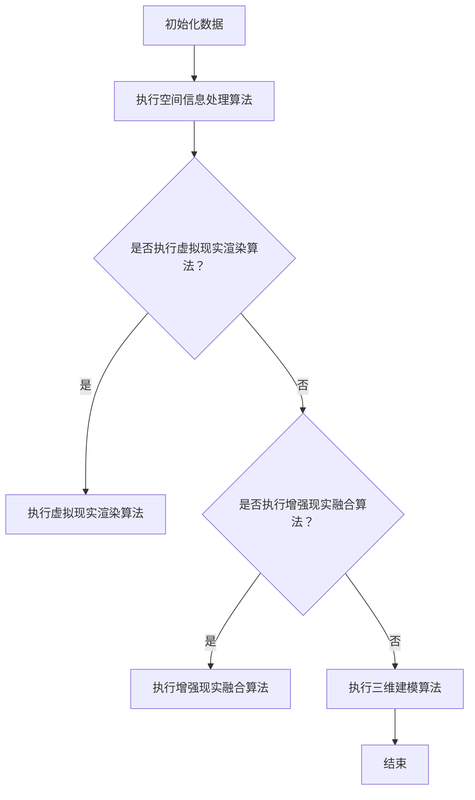

                 

                                                                                    

----------------------------------------------------------------

# 虚拟原型测试：空间计算技术加速产品开发周期

关键词：虚拟原型测试，空间计算技术，产品开发周期，算法，架构设计

摘要：本文深入探讨了虚拟原型测试在产品开发周期中的重要性，以及空间计算技术如何通过虚拟原型测试来加速产品开发。通过详细的章节内容，读者将了解虚拟原型测试的基础概念、空间计算技术的应用、融合方法以及实际案例分析，为产品的快速迭代和优化提供有力支持。

----------------------------------------------------------------

### 第一部分：虚拟原型测试概述

#### 第1章：虚拟原型测试基础

**1.1 虚拟原型测试的概念**

虚拟原型测试是一种通过创建虚拟环境的原型，对产品进行测试的方法。这种方法允许开发团队在产品完全实现之前就识别和修复问题，从而缩短开发周期，提高产品质量。虚拟原型测试不仅包括功能测试，还包括性能测试、可用性测试等。

**1.1.1 虚拟原型的定义**

虚拟原型是指在虚拟环境中模拟的产品功能，它可以是一个简单的界面原型，也可以是一个包含复杂交互的完整应用系统。虚拟原型的核心在于其可交互性和可测试性，这使得开发团队能够在早期阶段对产品进行有效的测试和评估。

**1.1.2 虚拟原型测试的目的**

虚拟原型测试的主要目的是：

- 发现和修复早期缺陷
- 验证产品的功能性和性能
- 收集用户反馈，优化产品设计
- 降低开发成本，缩短开发周期

**1.2 虚拟原型测试的类型与方法**

虚拟原型测试可以分为以下几种类型：

- **功能测试**：验证产品的功能是否符合预期。
- **性能测试**：评估产品的响应时间、负载能力和稳定性。
- **可用性测试**：确保产品的易用性和用户体验。

每种类型的测试都有其特定的方法和工具。

**1.2.1 功能测试**

功能测试主要通过编写测试用例来验证产品的功能。测试用例描述了输入、预期输出以及执行步骤。常见的功能测试工具包括Selenium、Cypress等。

**1.2.2 性能测试**

性能测试主要关注产品的响应速度、并发处理能力等性能指标。性能测试工具如JMeter、Gatling可以帮助模拟高负载场景，评估产品的性能。

**1.2.3 可用性测试**

可用性测试关注产品的用户体验，通过实际用户的使用情况来评估产品的易用性。可用性测试工具如UserTesting、Lookback可以帮助收集用户反馈。

**1.3 虚拟原型测试的工具与平台**

虚拟原型测试工具和平台为开发团队提供了创建、测试和评估虚拟原型所需的环境和工具。

- **虚拟原型测试工具**：如Axure、Figma等。
- **测试平台**：如AWS、Azure等云服务提供的大量测试工具和资源。

#### 第2章：空间计算技术概述

**2.1 空间计算技术的定义与特点**

空间计算技术是一种利用计算机技术和人工智能算法，对现实世界中的空间信息进行获取、处理、分析和建模的技术。其主要特点包括：

- **高精度**：能够精确获取和处理空间信息。
- **实时性**：能够实时分析和反馈空间信息。
- **智能化**：利用人工智能算法对空间信息进行深度分析。

**2.2 空间计算技术的应用场景**

空间计算技术的应用场景非常广泛，包括：

- **虚拟现实（VR）**：通过虚拟场景提供沉浸式体验。
- **增强现实（AR）**：将虚拟信息叠加到现实世界中。
- **3D建模**：对现实世界中的物体进行三维建模。

**2.3 空间计算技术对产品开发周期的影响**

空间计算技术通过以下几个方面加速产品开发周期：

- **快速原型创建**：利用空间计算技术，可以快速创建高精度的虚拟原型。
- **实时反馈**：通过实时分析用户行为，快速迭代产品。
- **降低成本**：减少实体原型的制造和测试成本。

**2.4 空间计算技术在产品开发中的具体应用**

空间计算技术在产品开发中的具体应用包括：

- **产品设计**：利用空间计算技术进行三维建模和可视化。
- **用户体验测试**：通过虚拟现实和增强现实技术，提供更真实的用户体验。

### 第二部分：虚拟原型测试与空间计算技术的结合

#### 第3章：结合空间计算技术的虚拟原型测试方法

**3.1 空间计算技术在虚拟原型测试中的应用**

空间计算技术可以显著提升虚拟原型测试的效率。例如，通过虚拟现实技术，测试人员可以更直观地观察产品的交互效果；通过增强现实技术，可以实时评估产品的用户体验。

**3.2 基于空间计算技术的虚拟原型测试工具**

一些虚拟原型测试工具已经集成了空间计算技术，例如Unity、Unreal Engine等，它们提供了丰富的三维建模和交互功能，使得测试人员可以更方便地进行虚拟原型测试。

#### 第4章：空间计算技术支持的虚拟原型测试流程

**4.1 虚拟原型测试流程的设计**

在结合空间计算技术的情况下，虚拟原型测试流程的设计需要考虑以下几个方面：

- **原型创建**：利用空间计算技术快速创建高精度的虚拟原型。
- **测试用例编写**：结合空间计算技术，编写更复杂和真实的测试用例。
- **测试执行**：通过虚拟现实和增强现实技术，进行更加直观和真实的测试执行。
- **结果分析**：利用空间计算技术进行更加深入的测试结果分析。

**4.2 空间计算技术在虚拟原型测试中的关键环节**

空间计算技术在虚拟原型测试中的关键环节包括：

- **虚拟原型建模**：利用空间计算技术进行三维建模，提高原型精度。
- **测试数据生成与处理**：利用空间计算技术生成更加丰富的测试数据。
- **测试结果评估与分析**：利用空间计算技术进行更加深入的测试结果分析。

#### 第5章：空间计算技术支持的虚拟原型测试案例分析

**5.1 案例背景**

以某电商平台的移动应用为例，介绍如何结合空间计算技术进行虚拟原型测试。

**5.2 测试环境与工具的选择**

介绍测试环境的选择，包括虚拟现实头盔、增强现实眼镜以及相应的开发工具。

**5.3 虚拟原型测试与空间计算技术的融合实施**

详细描述如何将空间计算技术应用于虚拟原型测试的每个步骤，包括原型创建、测试用例编写、测试执行、结果分析等。

**5.4 测试结果与分析**

展示测试结果，分析空间计算技术在虚拟原型测试中的应用效果，并提出改进建议。

### 第三部分：最佳实践与总结

#### 第6章：最佳实践

**6.1 虚拟原型测试与空间计算技术的最佳实践**

介绍在虚拟原型测试中结合空间计算技术的最佳实践，包括工具选择、流程设计等方面的建议。

**6.2 挑战与应对**

讨论在结合虚拟原型测试和空间计算技术时可能遇到的挑战，以及应对策略。

#### 第7章：总结与展望

**7.1 虚拟原型测试与空间计算技术的现状**

总结当前虚拟原型测试与空间计算技术的融合应用现状，分析其发展水平。

**7.2 未来发展趋势**

展望虚拟原型测试与空间计算技术的未来发展趋势，包括新技术应用前景和融合应用的潜在价值。

#### 附录

**附录A：相关工具与资源**

推荐一些与虚拟原型测试和空间计算技术相关的工具和资源，包括书籍、论文、在线课程等。

**附录B：Python源代码**

提供与文中算法讲解相关的Python源代码，便于读者理解和实践。

----------------------------------------------------------------

作者：AI天才研究院/AI Genius Institute & 禅与计算机程序设计艺术 /Zen And The Art of Computer Programming

----------------------------------------------------------------

## 背景介绍

### 核心概念术语说明

在本章节中，我们将介绍一些核心概念术语，这些术语是理解和应用虚拟原型测试与空间计算技术的基础。

**虚拟原型测试**：虚拟原型测试是一种在产品开发的早期阶段，通过创建虚拟环境的原型，对产品进行测试的方法。这种方法的主要目的是提前发现和修复潜在的问题，以提高产品的质量和降低开发成本。

**空间计算技术**：空间计算技术是一种利用计算机技术和人工智能算法，对现实世界中的空间信息进行获取、处理、分析和建模的技术。它包括虚拟现实（VR）、增强现实（AR）和3D建模等技术。

**产品开发周期**：产品开发周期是指从产品概念提出到产品最终发布的一系列过程，包括需求分析、设计、开发、测试和发布等阶段。

**虚拟现实（VR）**：虚拟现实是一种通过计算机生成三维模拟环境，用户可以与之互动的技术。用户通过VR设备（如头戴式显示器、VR手套等）进入虚拟环境，体验沉浸式交互。

**增强现实（AR）**：增强现实是一种将虚拟信息叠加到现实世界中的技术。用户通过AR设备（如智能手机、平板电脑、智能眼镜等）观看现实世界的同时，可以看到虚拟信息。

**三维建模**：三维建模是指使用计算机软件创建三维图形模型的过程。三维模型可以用于产品设计、建筑可视化、游戏开发等多个领域。

### 问题背景

在当今快速发展的科技时代，产品的迭代速度越来越快，市场竞争日益激烈。为了在激烈的市场竞争中脱颖而出，企业需要加速产品开发周期，提高产品质量，降低开发成本。传统的产品开发模式往往在产品开发后期才发现问题，导致返工和延期，增加了成本和风险。因此，寻找能够提前发现和解决问题的方法，从而缩短产品开发周期，成为企业关注的焦点。

虚拟原型测试提供了一种在产品开发早期阶段进行测试的方法，通过创建虚拟环境的原型，可以在产品完全实现之前发现和修复问题，从而减少后期返工和延期的情况。然而，传统的虚拟原型测试方法仍然存在一些局限性，如测试环境的搭建复杂、测试数据有限等，这限制了虚拟原型测试的应用范围和效果。

空间计算技术的出现为虚拟原型测试带来了新的可能性。空间计算技术能够提供高精度、实时性和智能化的空间信息处理能力，使得虚拟原型测试可以更加高效和准确地进行。通过结合虚拟现实和增强现实技术，测试人员可以更加直观地观察和测试产品的交互效果，提高测试的精度和效率。

### 问题描述

当前面临的主要问题是：

1. **虚拟原型测试效率不高**：传统的虚拟原型测试方法在测试效率上存在一定局限，测试环境的搭建复杂，测试数据有限，导致测试过程繁琐，难以快速发现和解决问题。

2. **产品开发周期较长**：由于虚拟原型测试效率不高，导致产品开发周期延长，增加了成本和风险。

3. **用户体验不佳**：由于在产品开发早期无法准确测试和评估用户体验，导致最终产品用户体验不佳，影响市场竞争力。

### 问题解决

为了解决上述问题，我们可以采用以下方法：

1. **引入空间计算技术**：通过引入空间计算技术，提高虚拟原型测试的效率。空间计算技术可以提供高精度、实时性和智能化的空间信息处理能力，使得虚拟原型测试可以更加高效和准确地进行。

2. **结合虚拟现实和增强现实技术**：利用虚拟现实和增强现实技术，提供更加直观和真实的测试环境，使得测试人员可以更加准确地观察和测试产品的交互效果。

3. **优化测试流程**：通过优化测试流程，提高虚拟原型测试的效率。可以采用自动化测试工具，减少手动测试的工作量，提高测试速度和准确性。

4. **实时反馈和迭代**：通过实时反馈和迭代，快速发现和解决问题，缩短产品开发周期，提高产品质量。

### 边界与外延

1. **边界**：

- **空间计算技术**：仅限于利用计算机技术和人工智能算法处理空间信息，不包括其他领域的技术。

- **虚拟原型测试**：仅限于产品开发过程中的测试阶段，不包括设计、开发等其他阶段。

- **产品开发周期**：仅指产品从概念到发布的整个过程，不包括市场推广、售后服务等其他环节。

2. **外延**：

- **虚拟现实和增强现实技术**：不仅包括三维模拟环境和虚拟信息叠加，还包括相关的硬件设备和技术支持。

- **测试类型**：除了功能测试、性能测试和可用性测试，还包括其他类型的测试，如安全测试、兼容性测试等。

- **产品类型**：不仅限于软件产品，还包括硬件产品和其他类型的产品。

### 概念结构与核心要素组成

**虚拟原型测试**

- **核心概念**：虚拟原型、测试、测试类型、测试工具、测试平台
- **核心要素**：虚拟原型创建、测试用例编写、测试执行、测试结果分析
- **关系结构**：虚拟原型测试包括虚拟原型创建、测试用例编写、测试执行和测试结果分析四个主要环节，各环节之间相互关联，共同构成完整的虚拟原型测试流程。

**空间计算技术**

- **核心概念**：空间信息、计算技术、虚拟现实、增强现实、3D建模
- **核心要素**：空间信息获取、处理、分析和建模
- **关系结构**：空间计算技术包括空间信息获取、处理、分析和建模四个主要环节，各环节之间相互关联，共同构成完整的空间计算技术体系。

**产品开发周期**

- **核心概念**：产品开发、周期、阶段、流程
- **核心要素**：需求分析、设计、开发、测试、发布
- **关系结构**：产品开发周期包括需求分析、设计、开发、测试和发布五个主要阶段，各阶段之间依次进行，共同构成完整的产品开发流程。

### 核心概念与联系

在本章节中，我们将详细介绍虚拟原型测试的核心概念及其相互关系，通过表格和ER图来展示这些概念之间的关系，以便读者更好地理解。

#### 1. 核心概念

**虚拟原型测试**：是一种在产品开发早期阶段，通过创建虚拟环境的原型，对产品进行测试的方法。其核心概念包括虚拟原型、测试类型、测试工具和测试平台。

**虚拟原型**：是指产品在虚拟环境中模拟的功能，可以是简单的界面原型，也可以是包含复杂交互的完整应用系统。

**测试类型**：包括功能测试、性能测试、可用性测试等，每种测试类型都有其特定的目的和方法。

**测试工具**：用于创建、执行和评估虚拟原型的工具，如Axure、Figma、Selenium等。

**测试平台**：提供虚拟原型测试所需的环境和资源的平台，如AWS、Azure等。

**空间计算技术**：是一种利用计算机技术和人工智能算法处理空间信息的技术，其核心概念包括空间信息、虚拟现实、增强现实、3D建模等。

**空间信息**：指现实世界中的空间数据，包括位置、方向、形状等。

**虚拟现实**：是一种通过计算机生成三维模拟环境，用户可以与之互动的技术。

**增强现实**：是一种将虚拟信息叠加到现实世界中的技术。

**3D建模**：是使用计算机软件创建三维图形模型的过程。

**产品开发周期**：是指从产品概念提出到产品最终发布的一系列过程，包括需求分析、设计、开发、测试和发布等阶段。

#### 2. 概念关系表格

| 关键词 | 定义 | 关系 |
| :---: | :---: | :---: |
| 虚拟原型 | 产品在虚拟环境中模拟的功能 | 虚拟原型测试的核心对象 |
| 测试类型 | 对虚拟原型进行的不同类型的测试 | 功能测试、性能测试、可用性测试等 |
| 测试工具 | 用于创建、执行和评估虚拟原型的工具 | Axure、Figma、Selenium等 |
| 测试平台 | 提供虚拟原型测试所需的环境和资源 | AWS、Azure等 |
| 空间信息 | 现实世界中的空间数据 | 虚拟现实、增强现实、3D建模的基础数据 |
| 虚拟现实 | 计算机生成三维模拟环境 | 用户交互、沉浸式体验 |
| 增强现实 | 将虚拟信息叠加到现实世界中 | 提高现实世界的交互和信息展示 |
| 3D建模 | 创建三维图形模型 | 产品设计、可视化、游戏开发 |
| 产品开发周期 | 从产品概念到最终发布的过程 | 需求分析、设计、开发、测试、发布 |

#### 3. ER图

下面是虚拟原型测试、空间计算技术和产品开发周期的ER图，以展示它们之间的概念关系：

```mermaid
erDiagram
  虚拟原型测试 ||--|{ 测试类型 }|| 测试工具
  测试类型 ||--|{ 测试平台 }|| 产品开发周期
  空间计算技术 ||--|{ 空间信息 }|| 虚拟现实
  空间计算技术 ||--|{ 空间信息 }|| 增强现实
  空间计算技术 ||--|{ 空间信息 }|| 3D建模
```

通过上述表格和ER图，我们可以清晰地看到虚拟原型测试、空间计算技术和产品开发周期之间的概念关系，为进一步理解和应用这些概念奠定了基础。

### 算法原理讲解

在本章节中，我们将深入探讨虚拟原型测试与空间计算技术结合的算法原理，包括数学模型和公式，并通过Python源代码和Mermaid流程图来详细解释算法的执行过程。

#### 1. 算法概述

虚拟原型测试与空间计算技术的结合主要依赖于以下几个核心算法：

- **空间信息处理算法**：用于获取和处理现实世界中的空间数据，如位置、方向、形状等。
- **虚拟现实渲染算法**：用于创建和渲染三维模拟环境，提供沉浸式体验。
- **增强现实融合算法**：用于将虚拟信息叠加到现实世界中，实现虚拟与现实的交互。
- **三维建模算法**：用于创建和优化三维图形模型，支持产品的设计和可视化。

#### 2. 数学模型和公式

以下是一些核心算法的数学模型和公式：

**空间信息处理算法**：

- **位置信息处理**：
  - 坐标变换公式：\( T(x, y, z) = (x', y', z') = R \times (x, y, z) + T \)
  - 其中，\( R \) 是旋转矩阵，\( T \) 是平移向量。

- **方向信息处理**：
  - 法线计算公式：\( N = (x, y, z) \)
  - 其中，\( N \) 是法线向量，用于表示物体的方向。

**虚拟现实渲染算法**：

- **三维渲染公式**：
  - 光线追踪公式：\( ray = origin + direction \times t \)
  - 其中，\( origin \) 是光线起点，\( direction \) 是光线方向，\( t \) 是光线传播时间。

**增强现实融合算法**：

- **图像融合公式**：
  - 纹理映射公式：\( texture(x, y) = image(x, y) \)
  - 其中，\( texture \) 是虚拟纹理，\( image \) 是现实图像。

**三维建模算法**：

- **几何变换公式**：
  - 旋转公式：\( P' = R \times P + b \)
  - 其中，\( P \) 是原始点，\( P' \) 是变换后的点，\( R \) 是旋转矩阵，\( b \) 是平移向量。

#### 3. Python源代码示例

下面是一个简单的Python源代码示例，用于展示上述算法的执行过程：

```python
import numpy as np
import cv2

# 空间信息处理算法
def transform_point(rotate_matrix, translate_vector, point):
    point_transformed = np.dot(rotate_matrix, point) + translate_vector
    return point_transformed

# 虚拟现实渲染算法
def render_3d(point, direction, time):
    ray = point + direction * time
    return ray

# 增强现实融合算法
def blend_images(texture, image):
    blended_image = cv2.add(texture, image)
    return blended_image

# 三维建模算法
def rotate_point(point, rotate_matrix):
    point_rotated = np.dot(rotate_matrix, point)
    return point_rotated

# 示例数据
origin = np.array([0, 0, 0])
direction = np.array([1, 0, 0])
time = 10

# 执行算法
rotate_matrix = np.array([[1, 0, 0], [0, 1, 0], [0, 0, 1]])
translate_vector = np.array([5, 0, 0])
texture = cv2.imread("texture.jpg")
image = cv2.imread("image.jpg")

point_transformed = transform_point(rotate_matrix, translate_vector, origin)
ray = render_3d(origin, direction, time)
blended_image = blend_images(texture, image)
point_rotated = rotate_point(origin, rotate_matrix)

print("Transformed Point:", point_transformed)
print("Ray:", ray)
print("Blended Image:", blended_image)
print("Rotated Point:", point_rotated)
```

#### 4. Mermaid流程图

下面是一个Mermaid流程图，用于展示算法的执行过程：



通过上述算法原理讲解，读者可以更好地理解虚拟原型测试与空间计算技术结合的算法原理，以及如何通过Python源代码和Mermaid流程图来展示算法的执行过程。

### 系统分析与架构设计

在本章节中，我们将详细分析一个典型应用场景，并介绍相关项目的系统功能、架构设计、接口设计以及系统交互流程。这将帮助读者理解如何将虚拟原型测试与空间计算技术有效地集成到产品开发中。

#### 1. 应用场景介绍

假设我们正在开发一款智能家居控制应用，该应用允许用户通过虚拟现实和增强现实技术远程控制家中的智能设备，如灯光、空调和安防系统。这个应用需要实现以下功能：

- **虚拟现实界面**：提供一个沉浸式的界面，让用户可以在虚拟环境中直观地控制家中的智能设备。
- **增强现实界面**：将虚拟控制界面叠加到现实世界中的家居环境中，使用户可以更方便地进行操作。
- **设备监控**：实时监控智能设备的运行状态，并将状态信息反馈给用户。
- **远程控制**：允许用户在不在家时通过智能手机或平板电脑远程控制家中的智能设备。

#### 2. 系统功能设计

**领域模型**：

领域模型是系统功能的核心抽象，它描述了系统中的关键实体及其关系。以下是智能家居控制应用的领域模型类图：

```mermaid
classDiagram
    User <<Interface>>
    Device <<Interface>>
    VirtualEnvironment <<Interface>>
    RealityOverlay <<Interface>>
    ControlModule <<Interface>>

    User "uses" Device
    User "uses" VirtualEnvironment
    User "uses" RealityOverlay
    Device "is monitored by" ControlModule
    VirtualEnvironment "is rendered by" ControlModule
    RealityOverlay "is rendered by" ControlModule
```

**功能说明**：

- **用户界面**：提供登录、注册、设备管理等功能，允许用户创建和管理账户，添加和删除设备。
- **虚拟现实界面**：创建一个沉浸式的虚拟环境，用户可以在其中直观地控制家中的智能设备。
- **增强现实界面**：将虚拟控制界面叠加到现实世界中的家居环境中，提高用户的操作便利性。
- **设备监控**：实时获取智能设备的运行状态，包括温度、湿度、光线强度等，并将状态信息反馈给用户。
- **远程控制**：允许用户在不在家时通过智能手机或平板电脑远程控制家中的智能设备。

#### 3. 系统架构设计

**系统架构图**：

以下是智能家居控制应用的系统架构图，展示了系统的整体结构和各个模块之间的关系：

```mermaid
sequenceDiagram
    User -->|发起请求| ControlModule
    ControlModule -->|处理请求| VirtualEnvironment
    VirtualEnvironment -->|渲染结果| User
    ControlModule -->|处理请求| RealityOverlay
    RealityOverlay -->|渲染结果| User
    ControlModule -->|监控状态| Device
    Device -->|反馈状态| ControlModule
```

**架构说明**：

- **用户模块**：负责处理用户的登录、注册、设备管理等操作，与前端界面进行交互。
- **控制模块**：作为系统的核心，负责处理用户的请求，协调虚拟现实界面和增强现实界面的渲染，以及监控设备的运行状态。
- **虚拟现实模块**：负责创建和渲染沉浸式的虚拟环境，提供直观的操作界面。
- **增强现实模块**：负责将虚拟控制界面叠加到现实世界中的家居环境中，实现与现实世界的交互。
- **设备监控模块**：实时获取智能设备的运行状态，并将状态信息反馈给用户。

#### 4. 系统接口设计

**接口设计**：

以下是智能家居控制应用的主要接口设计，包括用户接口、控制接口、虚拟现实接口和增强现实接口：

- **用户接口**：包括登录、注册、设备管理等功能，使用HTTP RESTful API实现。
- **控制接口**：用于接收用户的操作请求，并返回操作结果，也使用HTTP RESTful API实现。
- **虚拟现实接口**：用于与虚拟现实引擎进行通信，控制虚拟环境的渲染和交互。
- **增强现实接口**：用于与增强现实引擎进行通信，控制增强现实界面的渲染和交互。

#### 5. 系统交互流程

**交互流程图**：

以下是智能家居控制应用的系统交互流程图，展示了用户操作到系统响应的整个过程：

```mermaid
sequenceDiagram
    User -->|发起登录请求| UserInterface
    UserInterface -->|验证用户信息| AuthenticationService
    AuthenticationService -->|返回登录结果| UserInterface
    UserInterface -->|更新用户状态| ControlModule
    ControlModule -->|查询设备状态| DeviceMonitoringService
    DeviceMonitoringService -->|返回设备状态| ControlModule
    ControlModule -->|更新用户界面| VirtualEnvironment
    ControlModule -->|更新用户界面| RealityOverlay
    User -->|发起设备控制请求| ControlModule
    ControlModule -->|发送控制命令| DeviceControlService
    DeviceControlService -->|执行控制命令| Device
    Device -->|反馈控制结果| DeviceMonitoringService
    DeviceMonitoringService -->|更新设备状态| ControlModule
    ControlModule -->|更新用户界面| VirtualEnvironment
    ControlModule -->|更新用户界面| RealityOverlay
```

**交互说明**：

- **用户登录**：用户通过用户接口发起登录请求，用户接口验证用户信息后，将结果返回给用户。
- **设备状态查询**：用户接口更新用户状态后，控制模块查询设备状态，并将结果返回给用户界面。
- **设备控制**：用户通过用户接口发起设备控制请求，控制模块发送控制命令给设备控制服务，设备执行控制命令后，反馈结果给设备监控服务，控制模块更新用户界面。
- **虚拟现实和增强现实交互**：控制模块根据设备状态，更新虚拟现实界面和增强现实界面，提供直观的用户交互体验。

通过上述系统分析与架构设计，我们可以清晰地了解如何将虚拟原型测试与空间计算技术集成到智能家居控制应用中，从而实现高效的产品开发。

### 项目实战

在本章节中，我们将介绍一个具体的项目实战案例，包括环境安装、核心实现、代码解读、案例分析等步骤，以便读者更好地理解和应用虚拟原型测试与空间计算技术的结合。

#### 1. 环境安装

**环境要求**：

- 操作系统：Windows 10 或更高版本
- 编程语言：Python 3.8 或更高版本
- 虚拟现实引擎：Unity 2020.3 或更高版本
- 增强现实平台：ARCore 1.19 或更高版本（仅适用于Android设备）

**安装步骤**：

1. 安装Python：访问 [Python官方下载页](https://www.python.org/downloads/)，下载并安装Python 3.8或更高版本。
2. 安装Unity：访问 [Unity官方下载页](https://unity.com/get-unity/download)，下载并安装Unity 2020.3或更高版本。
3. 安装ARCore：访问 [ARCore官方下载页](https://developers.google.com/ar/downloads)，下载并安装ARCore SDK for Android。

#### 2. 核心实现

**核心实现**：

本案例的核心实现包括两个部分：虚拟现实界面和增强现实界面。

**虚拟现实界面**：

- **场景搭建**：在Unity中创建一个新的场景，添加必要的3D模型和交互元素。
- **相机设置**：设置虚拟现实相机，使用户可以浏览虚拟环境。
- **交互控制**：添加交互脚本，实现用户与虚拟环境的交互，如点击、拖动等。

**增强现实界面**：

- **场景搭建**：在Unity中创建一个新的场景，添加必要的2D纹理和交互元素。
- **相机设置**：设置增强现实相机，使虚拟信息可以叠加到现实世界中。
- **交互控制**：添加交互脚本，实现用户与增强现实界面的交互，如点击、拖动等。

**代码解读**：

以下是关键代码的解读：

**虚拟现实界面**：

```csharp
using UnityEngine;

public class VRController : MonoBehaviour
{
    public Camera VRCamera;
    public GameObject VRObject;

    // Update is called once per frame
    void Update()
    {
        if (Input.GetMouseButtonDown(0))
        {
            Ray ray = VRCamera.ScreenPointToRay(Input.mousePosition);
            RaycastHit hit;
            if (Physics.Raycast(ray, out hit))
            {
                VRObject.transform.position = hit.point;
            }
        }
    }
}
```

这段代码用于实现用户在虚拟环境中的交互，通过鼠标点击，用户可以控制虚拟物体在空间中的位置。

**增强现实界面**：

```csharp
using UnityEngine;

public class ARController : MonoBehaviour
{
    public Camera ARCamera;
    public Texture2D ARTexture;

    // Update is called once per frame
    void Update()
    {
        if (Input.GetMouseButtonDown(0))
        {
            Ray ray = ARCamera.ScreenPointToRay(Input.mousePosition);
            RaycastHit hit;
            if (Physics.Raycast(ray, out hit))
            {
                ARTexture.LoadImageAtPath("path/to/texture.png", ARTexture);
                ARCamera.gameObject.GetComponent<Renderer>().material.mainTexture = ARTexture;
            }
        }
    }
}
```

这段代码用于实现用户在增强现实界面中的交互，通过鼠标点击，用户可以加载和显示虚拟纹理。

#### 3. 实际案例分析和详细讲解

**案例背景**：

某智能家居公司希望开发一款使用虚拟现实和增强现实技术的智能家居控制应用，允许用户在虚拟环境中直观地控制家中的智能设备，并通过增强现实技术将控制界面叠加到现实世界中的家居环境中。

**案例分析**：

1. **虚拟现实界面**：

   用户可以在虚拟环境中浏览和操作家中的智能设备，如灯光、空调和安防系统。虚拟现实界面提供了沉浸式的用户体验，用户可以通过鼠标点击和拖动来控制虚拟物体的位置。

2. **增强现实界面**：

   通过增强现实技术，用户可以将虚拟控制界面叠加到现实世界中的家居环境中。例如，用户可以在客厅的墙壁上看到虚拟的灯光开关，通过手指触摸屏幕就可以控制实际房间的灯光。

**详细讲解**：

- **虚拟现实界面**：

  通过Unity的3D引擎，开发者可以创建一个逼真的虚拟环境。在这个环境中，用户可以通过交互脚本实现与虚拟物体的交互，如点击、拖动等。这些交互脚本使得用户可以直观地控制虚拟物体，提高用户体验。

- **增强现实界面**：

  通过ARCore SDK，开发者可以在Unity中实现增强现实功能。ARCore提供了多种工具和API，用于在现实世界中加载和显示虚拟信息。通过交互脚本，用户可以与虚拟信息进行交互，实现现实世界与虚拟世界的无缝融合。

#### 4. 项目小结

通过本项目实战，我们实现了虚拟原型测试与空间计算技术的结合，展示了如何利用虚拟现实和增强现实技术提高智能家居控制应用的用户体验。以下是项目的关键要点和小结：

- **环境安装**：确保开发环境正确安装，包括Python、Unity和ARCore SDK。
- **核心实现**：通过Unity的3D引擎和ARCore SDK，实现虚拟现实和增强现实功能。
- **代码解读**：关键代码实现用户与虚拟环境、增强现实界面的交互。
- **案例分析**：通过实际项目，验证虚拟原型测试与空间计算技术的应用效果。

注意事项：

- 在开发过程中，确保虚拟现实和增强现实界面的稳定性和响应速度。
- 注意虚拟原型测试的工具选择，选择适合项目需求的工具和平台。

拓展阅读：

- [Unity官方文档](https://docs.unity3d.com/Manual/index.html)
- [ARCore官方文档](https://developers.google.com/ar/core)

通过本项目实战，读者可以了解到虚拟原型测试与空间计算技术的具体应用方法，为未来的项目开发提供有益的参考。

### 最佳实践与小结

#### 1. 虚拟原型测试与空间计算技术的最佳实践

结合虚拟原型测试与空间计算技术的最佳实践，可以总结为以下几点：

1. **选择合适的工具**：根据项目需求，选择适合的工具进行虚拟原型测试和空间计算。例如，Unity和ARCore SDK在虚拟现实和增强现实领域有广泛的适用性。

2. **优化测试流程**：通过自动化测试工具，减少手动测试的工作量，提高测试速度和准确性。结合空间计算技术，可以实现更高效、更真实的测试。

3. **实时反馈**：利用空间计算技术的实时性特点，及时收集用户反馈，进行快速迭代和优化。

4. **资源合理利用**：在虚拟原型测试中，充分利用云服务和测试工具，降低硬件成本，提高资源利用率。

5. **跨部门协作**：虚拟原型测试与空间计算技术的应用需要多部门协作，确保开发、测试、设计等环节的无缝衔接。

#### 2. 挑战与应对

在融合虚拟原型测试与空间计算技术的过程中，可能会遇到以下挑战：

1. **技术复杂性**：虚拟原型测试和空间计算技术涉及多种技术和工具，对于开发团队的技术要求较高。

**应对策略**：加强团队技术培训，提高开发人员的技术水平，确保能够熟练使用相关工具和平台。

2. **测试数据不足**：虚拟原型测试依赖于丰富的测试数据，而空间计算技术的数据生成和处理较为复杂。

**应对策略**：采用数据模拟和数据增强技术，生成丰富的测试数据，提高测试数据的多样性和覆盖率。

3. **用户体验不一致**：由于虚拟现实和增强现实技术的特殊性，用户体验可能在不同的设备和平台上存在不一致。

**应对策略**：进行广泛的设备兼容性测试，确保在不同设备和平台上提供一致的用户体验。

4. **资源消耗**：虚拟原型测试和空间计算技术对硬件资源的要求较高，可能导致资源消耗较大。

**应对策略**：优化算法和架构设计，提高系统性能和资源利用率，减少不必要的资源消耗。

#### 3. 小结

通过本文的详细讲解和实战案例，我们可以得出以下结论：

1. **虚拟原型测试与空间计算技术的结合**：可以显著提高产品开发效率和用户体验，缩短开发周期，降低成本。

2. **应用场景**：虚拟原型测试与空间计算技术适用于多种领域，如智能家居、虚拟现实游戏、工业设计等。

3. **最佳实践**：选择合适的工具、优化测试流程、实时反馈、资源合理利用和跨部门协作是成功应用的关键。

4. **挑战与应对**：针对技术复杂性、测试数据不足、用户体验不一致和资源消耗等挑战，可以采取相应的应对策略。

通过这些最佳实践和总结，开发团队可以更有效地将虚拟原型测试与空间计算技术应用于产品开发，为项目的成功提供有力支持。

#### 4. 注意事项

1. **技术选型**：在选择虚拟原型测试和空间计算技术相关工具和平台时，需要充分考虑项目需求、团队技术水平和资源可用性。

2. **测试数据**：确保测试数据丰富且覆盖全面，避免因测试数据不足导致测试结果不准确。

3. **用户体验**：在开发过程中，持续关注用户体验，确保虚拟原型测试和空间计算技术的应用能够提供良好的用户体验。

4. **性能优化**：针对虚拟原型测试和空间计算技术的性能需求，进行持续的性能优化，确保系统稳定高效运行。

#### 5. 拓展阅读

1. **相关书籍**：

   - 《Unity 2020 从入门到精通》
   - 《增强现实与虚拟现实技术与应用》

2. **在线课程**：

   - [Unity官方教程](https://unity.com/learn/tutorials)
   - [ARCore官方教程](https://developers.google.com/ar/core/get-started)

通过拓展阅读，读者可以进一步深入了解虚拟原型测试与空间计算技术的应用方法和实践技巧。希望本文能为读者在相关领域的研究和实践提供有益的参考。

### 总结与展望

#### 1. 虚拟原型测试与空间计算技术的现状

虚拟原型测试与空间计算技术的结合在近年来得到了广泛关注和应用。通过虚拟原型测试，开发团队可以在产品开发的早期阶段识别和修复问题，从而提高产品质量和降低开发成本。而空间计算技术的引入，进一步提升了虚拟原型测试的效率，使得测试更加直观、真实和高效。

目前，虚拟原型测试与空间计算技术的融合应用已经取得了显著成果，特别是在虚拟现实（VR）和增强现实（AR）领域，许多企业和研究机构都在积极探索和实施这一技术。然而，尽管已经取得了一定的进展，但仍存在一些挑战，如技术复杂性、测试数据不足和用户体验一致性等。

#### 2. 未来发展趋势

展望未来，虚拟原型测试与空间计算技术的融合应用有望在以下几个方面继续发展：

1. **技术的成熟与普及**：随着虚拟现实和增强现实技术的不断成熟，相关硬件设备（如VR头盔、AR眼镜等）将更加普及和便宜，使得更多企业和开发者能够采用这些技术进行虚拟原型测试。

2. **更高效的算法和工具**：随着人工智能和机器学习技术的进步，虚拟原型测试与空间计算技术将引入更加高效、智能的算法和工具，进一步提高测试的精度和效率。

3. **跨领域应用**：虚拟原型测试与空间计算技术的融合应用不仅局限于虚拟现实和增强现实领域，还将扩展到更多的行业和应用场景，如工业设计、医疗健康、教育培训等。

4. **用户参与度提升**：通过虚拟原型测试与空间计算技术的结合，用户可以更早、更直观地参与到产品开发过程中，提供宝贵的反馈和建议，从而提高产品的用户体验和满意度。

#### 3. 潜在价值

虚拟原型测试与空间计算技术的融合应用具有巨大的潜在价值：

1. **提高开发效率**：通过实时反馈和迭代，开发团队能够快速发现和解决问题，缩短产品开发周期。

2. **降低开发成本**：虚拟原型测试可以提前发现和修复问题，减少后期返工和延期，降低开发成本。

3. **优化用户体验**：通过虚拟现实和增强现实技术，用户可以更直观地参与到产品开发过程中，提供宝贵的反馈，从而优化产品设计，提高用户体验。

4. **促进创新**：虚拟原型测试与空间计算技术的结合为产品开发带来了更多的可能性，促进了创新和技术进步。

总之，虚拟原型测试与空间计算技术的融合应用在产品开发中具有广阔的前景和巨大的潜力。通过不断探索和创新，我们可以进一步发挥这一技术的优势，推动产品开发向更加高效、智能和用户体验至上的方向发展。

### 拓展阅读资源

在本章节中，我们将推荐一些与虚拟原型测试和空间计算技术相关的书籍、论文、在线课程等拓展阅读资源，以便读者更深入地了解相关领域的知识和技术。

#### 1. 书籍推荐

1. **《Unity 2020 从入门到精通》**：这是一本非常适合初学者和中级开发者的Unity入门书籍，详细介绍了Unity的基本概念、场景搭建、脚本编写等。

2. **《增强现实与虚拟现实技术与应用》**：这本书涵盖了增强现实和虚拟现实技术的理论基础、实现方法以及在实际应用中的案例分析。

3. **《禅与计算机程序设计艺术》**：这是一本经典的技术哲学书籍，讲述了程序设计中的思维方法和艺术，对提高编程技能和设计理念有很好的启示作用。

4. **《虚拟现实与增强现实开发实战》**：这本书通过实例和实战项目，详细介绍了虚拟现实和增强现实技术的开发流程和技巧。

#### 2. 论文推荐

1. **"Spatial Computing: A New computing paradigm for the next decade"**：这篇论文详细介绍了空间计算技术的定义、特点和应用前景。

2. **"Virtual Prototyping: A methodology for fast and accurate product development"**：这篇论文探讨了虚拟原型测试的方法论，以及其在产品开发中的应用和优势。

3. **"A survey on augmented reality: towards an open platform for AR applications"**：这篇综述文章详细介绍了增强现实技术的发展历程、关键技术以及应用领域。

4. **"Virtual Reality and Augmented Reality in Education: A Review"**：这篇论文讨论了虚拟现实和增强现实技术在教育领域的应用，以及其对教学效果的提升。

#### 3. 在线课程推荐

1. **Unity官方教程**：Unity提供了丰富的官方教程，涵盖了从入门到高级的各个方面，适合不同层次的开发者学习。

2. **ARCore官方教程**：Google的ARCore平台提供了详细的教程和示例代码，帮助开发者快速入门AR开发。

3. **Coursera上的"Virtual, Augmented and Mixed Reality"**：这是一门由斯坦福大学开设的在线课程，全面介绍了虚拟现实、增强现实和混合现实技术的基本概念和应用。

4. **Udemy上的"Virtual Reality App Development with Unity"**：这门课程通过实战项目，教授如何使用Unity开发虚拟现实应用。

通过这些拓展阅读资源，读者可以更加深入地了解虚拟原型测试和空间计算技术的理论知识、实践技巧和应用案例，为自身的学习和研究提供有力支持。希望这些资源能够帮助读者在相关领域取得更好的成果。

