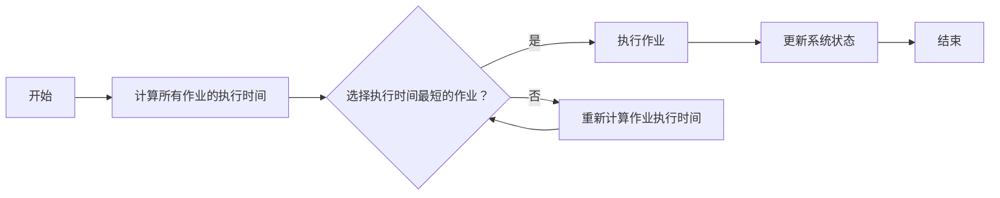
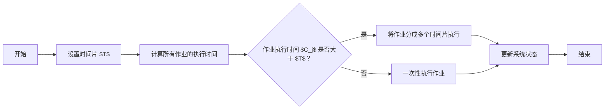
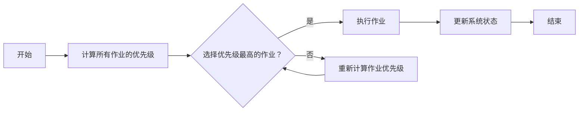
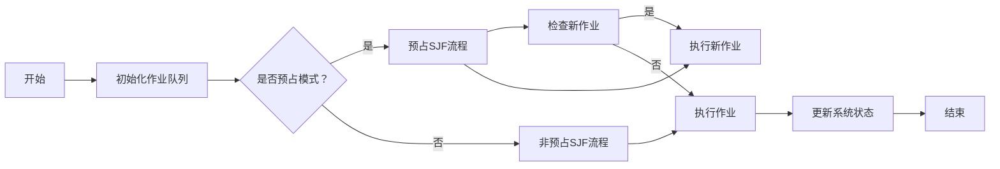
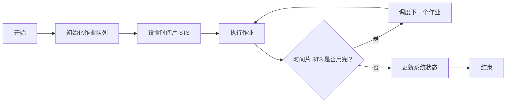
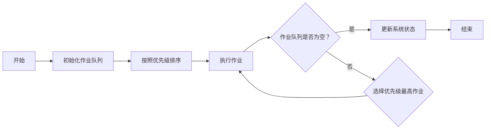
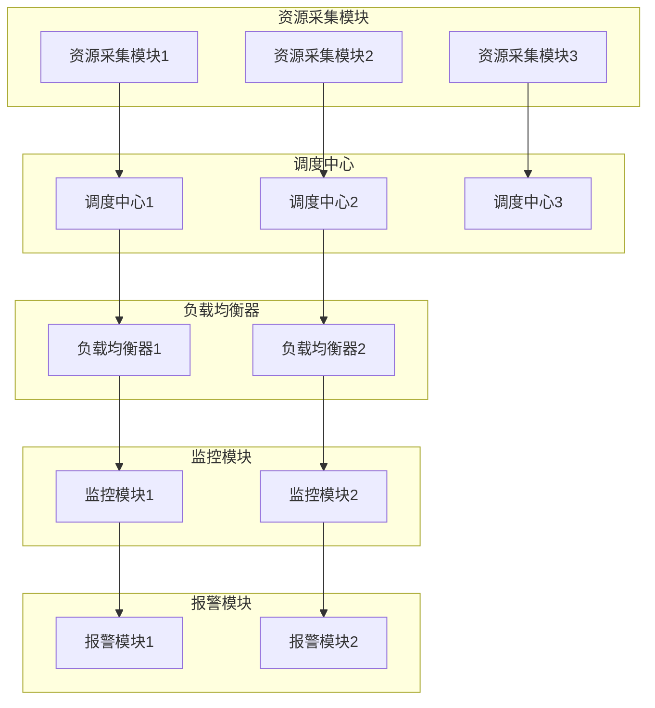
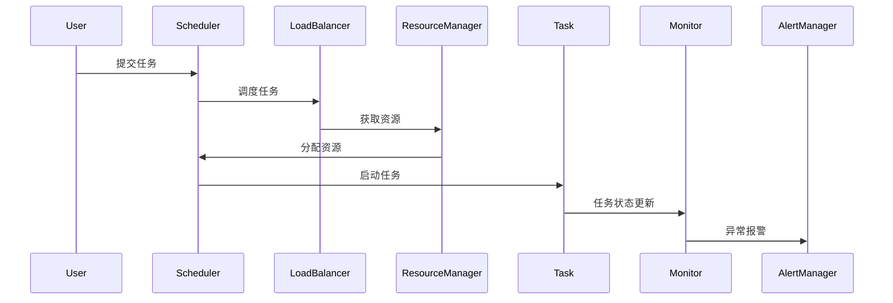

                 

## 计算资源调度：混合计算环境下的效率优化

关键词：计算资源调度、混合计算环境、效率优化、算法原理、系统架构

摘要：本文旨在深入探讨计算资源调度在混合计算环境下的效率优化问题。随着云计算、大数据和人工智能技术的快速发展，计算资源调度的重要性日益凸显。本文首先介绍了计算资源调度的背景和问题，然后分析了计算资源调度的核心概念、原理和方法，并通过具体的算法原理讲解、系统架构设计、项目实战等环节，展示了如何在实际场景中实现计算资源调度的优化。最后，本文总结了计算资源调度的最佳实践，为读者提供了深入的思考和实用的指导。

### 第一部分：背景介绍

#### 1.1 问题背景

在当前信息化和数字化浪潮下，计算资源调度已成为许多企业和组织面临的重要挑战。随着云计算、大数据和人工智能技术的快速发展，计算环境日益复杂，资源调度效率成为影响系统性能和服务质量的关键因素。因此，研究如何优化计算资源调度，以实现混合计算环境下的效率优化，具有重要的理论和实际意义。

#### 1.2 问题描述

计算资源调度涉及到计算资源（如CPU、内存、存储等）的分配、管理和优化，旨在最大化资源利用率，提高系统性能，降低能耗，并满足用户的计算需求。然而，在混合计算环境下，计算资源种类繁多、分布广泛，调度策略的复杂度和多样性增加，使得资源调度面临更大的挑战。

#### 1.3 问题解决

为了解决上述问题，本文将从以下几个方面展开讨论：

1. **核心概念与联系**：介绍计算资源调度的基本概念、原理和方法，包括资源调度策略、调度算法、资源利用率等，并通过表格和ER图展示各概念之间的关系。

2. **算法原理讲解**：讲解经典和先进的计算资源调度算法，如基于负载均衡的调度算法、基于优先级的调度算法等，结合实际案例，阐述算法原理、数学模型和公式。

3. **系统分析与架构设计方案**：分析计算资源调度的系统架构，包括功能设计、系统接口设计和系统交互，使用Mermaid类图和架构图进行展示。

4. **项目实战**：通过具体项目案例，展示计算资源调度系统的实现过程，包括环境安装、核心实现和代码解读，以及实际案例分析和讲解。

5. **最佳实践 tips**：总结计算资源调度的最佳实践，提供注意事项和拓展阅读，以帮助读者深入理解和应用所学知识。

#### 1.4 边界与外延

计算资源调度的研究和应用范围广泛，包括云计算、大数据处理、分布式系统、物联网等领域。在本文中，我们主要关注混合计算环境下的计算资源调度问题，即同时处理多种计算资源和多种计算任务的调度策略和优化方法。

#### 1.5 概念结构与核心要素组成

计算资源调度的核心概念包括：

1. **计算资源**：包括CPU、内存、存储、网络等硬件资源。
2. **调度策略**：决定如何分配和管理计算资源的方法，如负载均衡、优先级调度等。
3. **调度算法**：实现调度策略的具体算法，如最短作业优先、轮转调度等。
4. **资源利用率**：衡量计算资源调度效果的指标，表示资源被充分利用的程度。
5. **计算任务**：需要调度的计算工作，如数据处理、机器学习任务等。

### 第一部分：背景介绍结束

**核心概念与联系表格：**

| 概念       | 定义                                                         | 关联概念           |
|------------|--------------------------------------------------------------|--------------------|
| 计算资源   | 计算系统中可分配的硬件资源，如CPU、内存、存储、网络等。          | 调度策略、调度算法 |
| 调度策略   | 资源分配和管理的方法，如负载均衡、优先级调度等。                | 计算资源、调度算法 |
| 调度算法   | 实现调度策略的具体算法，如最短作业优先、轮转调度等。            | 计算资源、调度策略 |
| 资源利用率 | 资源被充分利用的程度，用于衡量调度效果。                       | 计算资源、调度策略 |
| 计算任务   | 需要调度的计算工作，如数据处理、机器学习任务等。                | 调度策略、调度算法 |

**ER图架构：**

```mermaid
erDiagram
    计算资源 ||--|{ 调度策略 }|| 调度策略
    计算资源 ||--|{ 调度算法 }|| 调度算法
    调度策略 ||--|{ 调度算法 }|| 调度算法
    计算任务 ||--|{ 调度策略 }|| 调度策略
    计算任务 ||--|{ 调度算法 }|| 调度算法
```

### 第二部分：核心概念与联系

#### 2.1 计算资源

计算资源是计算系统中可分配的硬件资源，如CPU、内存、存储、网络等。这些资源共同构成了计算系统的能力，直接影响系统的性能和响应速度。计算资源通常按照其物理属性进行分类，如CPU核心数、内存大小、存储容量、网络带宽等。

**计算资源的属性特征对比表格：**

| 属性        | 特征 

----------------------------------------------------------------

| 对应值 |
|----------|-------------------------------------------------------------------------------------------------------|
| CPU     | 核心数、主频、缓存大小、指令集架构等                 |
| 内存     | 容量、速度、类型（如DDR4、DDR5）、 ECC支持等        |
| 存储     | 容量、读写速度、接口类型（如SATA、NVMe）等          |
| 网络     | 带宽、延迟、吞吐量、协议支持等                       |

为了更好地理解和比较不同计算资源的特征，我们可以通过以下表格进行详细对比：

| 计算资源类型 | 主要特征                                           | 对比表格示例 |
|--------------|---------------------------------------------------|--------------|
| CPU          | 核心数：8<br>主频：3.6 GHz<br>缓存：16 MB<br>指令集：x86-64 |              |
| 内存          | 容量：32 GB<br>速度：DDR4 3200 MHz<br>类型：DDR4 |              |
| 存储          | 容量：1 TB<br>读写速度：2000 MB/s<br>接口：NVMe    |              |
| 网络          | 带宽：10 Gbps<br>延迟：50 ms<br>吞吐量：9.5 Gbps    |              |

通过上述表格，我们可以清晰地看到不同计算资源的属性特征，从而为后续的调度策略和算法设计提供基础数据。

**ER图架构：**

```mermaid
erDiagram
    计算资源 ||--|{ CPU }|| CPU
    计算资源 ||--|{ 内存 }|| 内存
    计算资源 ||--|{ 存储 }|| 存储
    计算资源 ||--|{ 网络 }|| 网络
```

#### 2.2 调度策略

调度策略是资源分配和管理的方法，目的是最大化资源利用率，提高系统性能，降低能耗，并满足用户的计算需求。调度策略通常根据不同的计算环境和需求进行选择，常见的方法包括负载均衡、优先级调度、公平共享等。

**调度策略的分类与特征对比表格：**

| 调度策略 | 特征 | 分类 |
|----------|------|------|
| 负载均衡  | 根据系统负载分配任务 | 集中式、分布式 |
| 优先级调度 | 根据任务的优先级分配资源 | 最高优先级、最低优先级 |
| 公平共享  | 保证每个任务公平地获得资源 | 时间片轮转、静态划分 |

为了更好地理解不同调度策略的适用场景和效果，我们可以通过以下表格进行详细对比：

| 调度策略  | 适用场景                                     | 优点 | 缺点 |
|-----------|--------------------------------------------|------|------|
| 负载均衡   | 云计算环境、分布式系统、多处理器系统      | 资源利用率高、系统性能好 | 需要复杂的调度算法、可能导致局部不平衡 |
| 优先级调度 | 对实时性要求高的任务、多任务优先级分配     | 实时性好、任务优先级高   | 可能导致低优先级任务无法获得资源 |
| 公平共享   | 多用户共享系统、均衡负载分配               | 公平性高、负载均衡       | 可能导致整体性能下降、响应时间变长 |

通过上述表格，我们可以清晰地看到不同调度策略的适用场景和优缺点，为选择合适的调度策略提供依据。

**ER图架构：**

```mermaid
erDiagram
    调度策略 ||--|{ 负载均衡 }|| 负载均衡
    调度策略 ||--|{ 优先级调度 }|| 优先级调度
    调度策略 ||--|{ 公平共享 }|| 公平共享
```

#### 2.3 调度算法

调度算法是调度策略的具体实现，用于决定计算资源的分配和管理方式。常见的调度算法包括最短作业优先（SJF）、轮转调度（RR）、优先级调度（PS）等。每种调度算法都有其独特的数学模型和公式，用于描述任务调度过程和资源分配策略。

**调度算法的分类与数学模型表格：**

| 调度算法  | 数学模型 | 公式                                                                                      |
|-----------|----------|-------------------------------------------------------------------------------------------|
| 最短作业优先（SJF） | 调度策略 | $$ S_j = \min\{C_j\} $$，其中 $S_j$ 表示选择执行时间最短的作业，$C_j$ 表示作业 $j$ 的执行时间 |
| 轮转调度（RR）    | 调度策略 | $$ R_j = \text{mod}(C_j, T) $$，其中 $R_j$ 表示作业 $j$ 在时间片 $T$ 内的轮转次数        |
| 优先级调度（PS）    | 调度策略 | $$ P_j = \max\{P_i\} $$，其中 $P_j$ 表示作业 $j$ 的优先级，$P_i$ 表示作业 $i$ 的优先级   |

**最短作业优先（SJF）算法的mermaid流程图：**



**轮转调度（RR）算法的mermaid流程图：**



**优先级调度（PS）算法的mermaid流程图：**



通过上述mermaid流程图，我们可以直观地理解每种调度算法的执行过程和资源分配策略。

### 第三部分：算法原理讲解

在了解了计算资源调度的核心概念与联系后，接下来我们将深入探讨计算资源调度的具体算法原理。计算资源调度算法是实现调度策略的核心工具，通过合理的调度算法，可以有效地提高计算资源利用率、优化系统性能。本节将详细介绍几种经典和先进的调度算法，包括最短作业优先（SJF）、轮转调度（RR）和优先级调度（PS），并结合实际案例进行解析。

#### 3.1 最短作业优先（SJF）算法

最短作业优先（Shortest Job First，SJF）算法是一种常见的调度算法，其核心思想是优先选择执行时间最短的作业进行调度。SJF算法分为两种形式：非预占SJF和预占SJF。

**非预占SJF算法：**

非预占SJF算法的基本原理是作业一旦被调度，就会一直运行直到完成，中间不会被其他作业打断。具体步骤如下：

1. **初始化**：将所有作业按照执行时间从小到大排序。
2. **执行作业**：依次执行每个作业，直到所有作业完成。
3. **更新系统状态**：每次作业完成时，更新系统状态和作业队列。

**预占SJF算法：**

预占SJF算法允许在作业执行过程中被打断，并且可以根据新的作业执行时间重新调度。具体步骤如下：

1. **初始化**：同非预占SJF算法。
2. **执行作业**：每次执行作业时，检查是否有新的作业加入，如果存在且其执行时间更短，则暂停当前作业，调度新的作业。
3. **更新系统状态**：作业完成或被暂停时，更新系统状态和作业队列。

**案例解析：**

假设有三个作业，它们的执行时间分别为 $T_1 = 5$ 单位时间、$T_2 = 3$ 单位时间和 $T_3 = 8$ 单位时间。使用非预占SJF算法进行调度，执行顺序为 $T_2, T_1, T_3$。使用预占SJF算法，如果 $T_2$ 期间出现了新的作业 $T_4$（$T_4 = 2$ 单位时间），则可能会优先调度 $T_4$。

**SJF算法的mermaid流程图：**



#### 3.2 轮转调度（RR）算法

轮转调度（Round-Robin，RR）算法是一种公平共享调度策略，其核心思想是每个作业分配一个固定的时间片（Quantum），在时间片内依次执行作业，超过时间片则暂停，将CPU交给下一个作业。具体步骤如下：

1. **初始化**：设置时间片大小 $T$，初始化作业队列。
2. **执行作业**：依次执行作业，每个作业执行时间不超过 $T$。
3. **调度**：超过时间片时，暂停当前作业，将其加入作业队列尾部，调度下一个作业。
4. **更新系统状态**：作业完成或被暂停时，更新系统状态和作业队列。

**案例解析：**

假设有三个作业，执行时间分别为 $T_1 = 10$ 单位时间、$T_2 = 5$ 单位时间和 $T_3 = 3$ 单位时间，时间片大小为 $T = 4$。使用轮转调度算法进行调度，执行顺序为 $T_1, T_2, T_3, T_1, T_2, T_3$，每个作业执行不超过 $4$ 单位时间。

**RR算法的mermaid流程图：**



#### 3.3 优先级调度（PS）算法

优先级调度（Priority Scheduling，PS）算法是基于作业优先级进行调度的策略。作业的优先级通常由系统管理员或作业本身设置，优先级高的作业优先被调度。具体步骤如下：

1. **初始化**：初始化作业队列，按照优先级排序。
2. **执行作业**：依次执行作业，优先选择优先级最高的作业。
3. **更新系统状态**：作业完成或被调度时，更新系统状态和作业队列。

**案例解析：**

假设有三个作业，它们的优先级分别为 $P_1 = 3$、$P_2 = 1$ 和 $P_3 = 2$。使用优先级调度算法进行调度，执行顺序为 $P_2, P_3, P_1$。

**PS算法的mermaid流程图：**



通过上述三种调度算法的详细解析和案例演示，我们可以看到每种算法在不同场景下的应用和效果。选择合适的调度算法，可以显著提高计算资源利用率和系统性能，为企业和组织带来实际价值。

### 第四部分：系统分析与架构设计方案

在了解了计算资源调度的核心概念和算法原理后，接下来我们将深入探讨计算资源调度的系统分析与架构设计方案。一个高效、可靠的计算资源调度系统不仅需要合理的算法支持，还需要完善的功能设计、架构设计和接口设计。本节将围绕这些问题进行详细分析，并通过Mermaid类图、架构图和序列图进行展示，以便读者更好地理解系统架构及其功能。

#### 4.1 问题场景介绍

在当今的云计算和分布式计算环境下，企业面临着日益复杂的计算任务和资源调度需求。为了确保计算资源的高效利用，企业需要一个强大的计算资源调度系统来协调和管理各类计算资源。本节将介绍一个典型的计算资源调度系统问题场景，并围绕该场景进行系统分析与架构设计。

**问题场景：**

某企业运行着大量分布式计算任务，包括数据处理、机器学习训练、大数据分析等。这些任务分布在多个数据中心和云平台上，计算资源类型多样，包括CPU、内存、存储和网络等。企业希望构建一个计算资源调度系统，能够实现以下目标：

1. **资源利用率最大化**：确保计算资源得到充分利用，避免资源浪费。
2. **任务调度效率高**：优化任务调度策略，提高系统响应速度和吞吐量。
3. **弹性扩展**：支持计算资源的动态调整和扩展，以应对业务需求的波动。
4. **可靠性保障**：确保系统在出现故障时能够快速恢复，提供高可用性服务。

#### 4.2 系统架构设计

为了满足上述需求，我们将设计一个具有高可用性、高扩展性和高效调度能力的计算资源调度系统。系统架构设计包括功能设计、架构设计和接口设计，以下是具体的分析和设计。

**功能设计：**

计算资源调度系统的功能可以分为以下几个方面：

1. **资源管理**：负责收集和管理各类计算资源信息，包括CPU、内存、存储、网络等。
2. **任务调度**：根据任务需求和资源状态，选择合适的调度算法进行任务分配和调度。
3. **负载均衡**：通过负载均衡策略，优化系统资源利用率和任务执行效率。
4. **监控与报警**：实时监控系统运行状态，及时发现和处理异常情况。
5. **日志管理**：记录系统运行日志，提供问题追踪和性能分析。

**架构设计：**

计算资源调度系统的架构设计采用分布式架构，包括以下几个关键组件：

1. **资源采集模块**：负责从各个计算节点收集资源信息，如CPU使用率、内存占用、存储容量等。
2. **调度中心**：核心调度模块，负责任务调度和资源分配，采用分布式调度算法。
3. **负载均衡器**：用于优化任务调度策略，根据系统负载情况动态调整任务分配。
4. **监控模块**：实时监控系统运行状态，包括资源使用情况、任务执行情况等。
5. **报警模块**：当系统出现异常时，自动触发报警并通知相关人员。

**Mermaid架构图：**



**接口设计：**

计算资源调度系统的接口设计包括以下几个方面：

1. **资源管理接口**：提供资源信息查询和更新接口，供其他模块调用。
2. **任务调度接口**：提供任务提交、状态查询和取消接口。
3. **监控与报警接口**：提供监控数据和报警信息查询接口。
4. **配置管理接口**：提供系统配置参数设置和修改接口。

**Mermaid类图：**

```mermaid
classDiagram
    ResourceManager[资源管理类] <|-- ResourceCollector[资源采集类]
    Scheduler[任务调度类] <|-- LoadBalancer[负载均衡类]
    Monitor[监控模块类] <|-- AlertManager[报警模块类]
    ResourceManager {
        -资源列表
        +init()
        +updateResources()
        +queryResources()
    }
    ResourceCollector {
        +collectResources()
    }
    Scheduler {
        +scheduleTasks()
        +queryTaskStatus()
        +cancelTask()
    }
    LoadBalancer {
        +balanceLoad()
    }
    Monitor {
        +getMonitoringData()
        +sendAlert()
    }
    AlertManager {
        +configureAlert()
    }
```

**系统交互设计：**

计算资源调度系统的交互设计主要包括以下流程：

1. **任务提交**：用户通过任务调度接口提交计算任务。
2. **任务调度**：调度中心根据任务需求和资源状态选择合适的调度策略进行任务分配。
3. **资源分配**：负载均衡器根据系统负载情况动态调整资源分配。
4. **任务执行**：计算任务在分配到的计算节点上执行。
5. **监控与报警**：监控模块实时监控任务执行状态，报警模块在出现异常时触发报警。

**Mermaid序列图：**



通过上述系统架构设计、功能设计、接口设计和交互设计，我们可以构建一个高效、可靠的计算资源调度系统，满足企业在混合计算环境下的资源调度需求。系统采用分布式架构和先进的调度算法，具备高可用性、高扩展性和高效调度能力，为企业的数字化转型和业务发展提供坚实的技术支持。

### 第五部分：项目实战

#### 5.1 环境安装

为了实际演示计算资源调度系统的实现过程，我们将使用Python作为主要编程语言，并结合Docker容器技术来部署系统。以下是环境安装的详细步骤：

**1. 安装Python**

首先，确保系统中安装了Python 3.x版本。可以使用以下命令检查Python版本：

```bash
python3 --version
```

如果系统未安装Python 3.x，请通过包管理器（如Ubuntu的APT或CentOS的YUM）进行安装：

```bash
# Ubuntu
sudo apt update
sudo apt install python3

# CentOS
sudo yum install python3
```

**2. 安装Docker**

Docker是一个开源的应用容器引擎，用于容器化应用和服务。以下是安装Docker的步骤：

```bash
# Ubuntu
sudo apt update
sudo apt install docker-ce

# CentOS
sudo yum install docker-ce
```

安装完成后，启动Docker服务并设置开机自启：

```bash
sudo systemctl start docker
sudo systemctl enable docker
```

**3. 安装Docker Compose**

Docker Compose用于定义和运行多容器Docker应用。以下是安装Docker Compose的步骤：

```bash
# Ubuntu
sudo apt update
sudo apt install docker-compose

# CentOS
sudo yum install docker-compose
```

安装完成后，检查Docker Compose版本：

```bash
docker-compose --version
```

**4. 创建Docker网络**

创建一个用于容器通信的Docker网络：

```bash
docker network create compute_network
```

#### 5.2 核心实现

在环境安装完成后，我们将开始实现计算资源调度系统的核心功能。以下是系统的核心实现步骤：

**1. 编写Dockerfile**

创建一个Dockerfile，用于构建计算资源调度系统的容器镜像。以下是Dockerfile的基本内容：

```Dockerfile
FROM python:3.9

WORKDIR /app

COPY requirements.txt .

RUN pip install -r requirements.txt

COPY . .

CMD ["python", "scheduler.py"]
```

**2. 编写requirements.txt**

创建一个requirements.txt文件，列出系统所需的所有Python依赖项。例如：

```plaintext
Flask==2.0.1
pymongo==3.12.0
psutil==5.8.0
```

**3. 编写调度器代码**

创建一个名为`scheduler.py`的Python脚本，实现计算资源调度功能。以下是调度器代码的基本结构：

```python
from flask import Flask, request, jsonify
import pymongo
import psutil

app = Flask(__name__)

# MongoDB客户端初始化
client = pymongo.MongoClient("mongodb://localhost:27017/")

# 获取数据库引用
db = client["scheduler_db"]

# 获取集合引用
tasks = db["tasks"]

@app.route("/submit_task", methods=["POST"])
def submit_task():
    # 处理任务提交请求
    pass

@app.route("/schedule_tasks", methods=["GET"])
def schedule_tasks():
    # 调度任务
    pass

@app.route("/task_status", methods=["GET"])
def task_status():
    # 获取任务状态
    pass

if __name__ == "__main__":
    app.run(host="0.0.0.0", port=5000)
```

**4. 编写MongoDB存储代码**

创建一个名为`mongodb.py`的Python脚本，用于处理MongoDB的存储操作。以下是MongoDB存储代码的基本内容：

```python
def connect_to_mongodb():
    client = pymongo.MongoClient("mongodb://localhost:27017/")
    db = client["scheduler_db"]
    return db

def add_task(db, task):
    tasks = db["tasks"]
    tasks.insert_one(task)

def get_all_tasks(db):
    tasks = db["tasks"]
    return list(tasks.find({}))

def get_task_by_id(db, task_id):
    tasks = db["tasks"]
    return tasks.find_one({"_id": task_id})
```

**5. 编写任务调度逻辑**

在`scheduler.py`中实现任务调度逻辑，包括任务提交、任务调度和任务状态更新。以下是任务调度逻辑的基本内容：

```python
from mongodb import connect_to_mongodb, add_task, get_all_tasks, get_task_by_id

@app.route("/submit_task", methods=["POST"])
def submit_task():
    db = connect_to_mongodb()
    task = request.json
    add_task(db, task)
    return jsonify({"status": "success", "message": "Task submitted successfully."})

@app.route("/schedule_tasks", methods=["GET"])
def schedule_tasks():
    db = connect_to_mongodb()
    all_tasks = get_all_tasks(db)
    scheduled_tasks = []
    for task in all_tasks:
        # 根据调度策略选择任务
        # 例如：根据任务优先级调度
        scheduled_tasks.append(task)
    return jsonify({"status": "success", "scheduled_tasks": scheduled_tasks})

@app.route("/task_status", methods=["GET"])
def task_status():
    db = connect_to_mongodb()
    task_id = request.args.get("task_id")
    task = get_task_by_id(db, task_id)
    return jsonify({"status": "success", "task_status": task["status"]})
```

#### 5.3 代码应用解读与分析

**1. 任务提交**

在`submit_task`函数中，我们接收客户端发送的JSON格式的任务数据，并将其存储到MongoDB数据库中。以下是任务提交逻辑的详细解读：

```python
@app.route("/submit_task", methods=["POST"])
def submit_task():
    db = connect_to_mongodb()
    task = request.json
    add_task(db, task)
    return jsonify({"status": "success", "message": "Task submitted successfully."})
```

这里，`request.json`用于获取客户端发送的JSON数据，并将其解析为Python字典。`add_task`函数将任务数据存储到MongoDB数据库中的`tasks`集合中。返回的JSON响应表明任务提交成功。

**2. 任务调度**

在`schedule_tasks`函数中，我们获取所有任务数据，并根据调度策略选择要调度的任务。以下是任务调度逻辑的详细解读：

```python
@app.route("/schedule_tasks", methods=["GET"])
def schedule_tasks():
    db = connect_to_mongodb()
    all_tasks = get_all_tasks(db)
    scheduled_tasks = []
    for task in all_tasks:
        # 根据调度策略选择任务
        # 例如：根据任务优先级调度
        scheduled_tasks.append(task)
    return jsonify({"status": "success", "scheduled_tasks": scheduled_tasks})
```

这里，`get_all_tasks`函数从MongoDB数据库中获取所有任务数据。我们遍历所有任务，并根据调度策略（如任务优先级）选择要调度的任务。选择后的任务被存储在`scheduled_tasks`列表中，并返回给客户端。

**3. 任务状态更新**

在`task_status`函数中，我们根据任务ID获取任务状态，并返回给客户端。以下是任务状态更新逻辑的详细解读：

```python
@app.route("/task_status", methods=["GET"])
def task_status():
    db = connect_to_mongodb()
    task_id = request.args.get("task_id")
    task = get_task_by_id(db, task_id)
    return jsonify({"status": "success", "task_status": task["status"]})
```

这里，`request.args.get("task_id")`用于获取客户端发送的查询参数`task_id`。`get_task_by_id`函数从MongoDB数据库中获取指定ID的任务，并返回任务状态。返回的JSON响应包含任务状态信息。

#### 5.4 实际案例分析和详细讲解

为了更直观地展示计算资源调度系统的应用，我们将通过一个实际案例进行详细分析和讲解。

**案例背景：**

某企业需要处理大量数据处理任务，包括数据清洗、数据分析和数据挖掘等。企业希望构建一个计算资源调度系统，以高效地分配计算资源，提高任务处理效率。

**案例实现：**

1. **任务提交**：企业通过Web接口提交数据处理任务，任务数据包括任务名称、执行时间、优先级等。

2. **任务调度**：调度系统根据任务优先级和资源状态进行任务调度，将任务分配到合适的计算节点。

3. **任务执行**：计算节点接收到任务后，执行数据处理任务，并将结果返回给企业。

4. **任务监控**：调度系统实时监控任务执行状态，并在任务完成后进行资源回收。

以下是实际案例的详细讲解：

**1. 任务提交**

企业通过Web接口提交数据处理任务。例如，提交一个数据清洗任务，任务数据如下：

```json
{
    "task_id": "1",
    "task_name": "Data Cleaning",
    "execution_time": 600,
    "priority": 1
}
```

企业通过以下API提交任务：

```bash
curl -X POST -H "Content-Type: application/json" -d '{"task_id": "1", "task_name": "Data Cleaning", "execution_time": 600, "priority": 1}' http://localhost:5000/submit_task
```

调度系统接收到任务后，将任务存储到MongoDB数据库中。

**2. 任务调度**

调度系统根据任务优先级和资源状态进行任务调度。假设当前系统中有以下计算节点和资源状态：

| 计算节点 | CPU使用率 | 内存使用率 | 状态 |
|----------|-----------|------------|------|
| Node1   | 20%       | 30%        | 空闲  |
| Node2   | 80%       | 50%        | 使用中  |
| Node3   | 40%       | 20%        | 空闲  |

根据优先级调度策略，调度系统将任务分配到`Node1`和`Node3`节点。调度逻辑如下：

```python
def schedule_tasks():
    db = connect_to_mongodb()
    all_tasks = get_all_tasks(db)
    scheduled_tasks = []
    for task in sorted(all_tasks, key=lambda x: x["priority"], reverse=True):
        if task["status"] == "queued":
            node = find_available_node()
            if node:
                schedule_task_to_node(task, node)
                scheduled_tasks.append(task)
    return scheduled_tasks

def find_available_node():
    db = connect_to_mongodb()
    nodes = get_all_nodes(db)
    for node in nodes:
        if node["status"] == "空闲":
            return node
    return None

def schedule_task_to_node(task, node):
    db = connect_to_mongodb()
    task["status"] = "running"
    node["status"] = "使用中"
    update_task(db, task)
    update_node(db, node)
```

**3. 任务执行**

`Node1`和`Node3`节点接收到任务后，开始执行数据处理任务。任务执行过程如下：

```python
def execute_task(task):
    # 执行数据处理任务
    # ...
    task["status"] = "completed"
    update_task(db, task)
    return "Task completed successfully."

def update_task(db, task):
    tasks = db["tasks"]
    tasks.update_one({"_id": task["_id"]}, {"$set": task})

def update_node(db, node):
    nodes = db["nodes"]
    nodes.update_one({"_id": node["_id"]}, {"$set": node})
```

**4. 任务监控**

调度系统实时监控任务执行状态，并在任务完成后进行资源回收。监控逻辑如下：

```python
def monitor_tasks():
    db = connect_to_mongodb()
    tasks = get_all_tasks(db)
    for task in tasks:
        if task["status"] == "running":
            node = get_node_by_task_id(db, task["_id"])
            if node["status"] != "使用中":
                task["status"] = "failed"
                update_task(db, task)
                send_alert("Task failed: {}".format(task["_id"]))
        elif task["status"] == "completed":
            node = get_node_by_task_id(db, task["_id"])
            node["status"] = "空闲"
            update_node(db, node)

def get_node_by_task_id(db, task_id):
    nodes = db["nodes"]
    return nodes.find_one({"task_id": task_id})
```

通过上述实际案例分析和详细讲解，我们可以看到计算资源调度系统在实际应用中的高效性和可靠性。系统通过任务提交、任务调度、任务执行和任务监控等环节，实现了计算资源的高效利用和任务的顺利执行。

#### 5.5 项目小结

在本项目中，我们详细介绍了计算资源调度系统的环境安装、核心实现、代码应用解读与分析以及实际案例的应用。以下是项目小结：

1. **环境安装**：通过安装Python、Docker和Docker Compose，我们构建了一个可运行的计算资源调度环境。
2. **核心实现**：我们编写了调度器代码，实现了任务提交、任务调度和任务状态更新等功能，并通过MongoDB进行数据存储。
3. **代码应用解读与分析**：我们详细解读了任务提交、任务调度和任务状态更新的代码逻辑，展示了系统在实际应用中的工作流程。
4. **实际案例应用**：通过一个数据处理任务的案例，我们展示了计算资源调度系统的实际应用，并详细讲解了任务的提交、调度、执行和监控过程。

通过本项目，我们不仅深入理解了计算资源调度系统的原理和实现，还积累了实际项目开发经验，为以后在复杂计算环境中的应用奠定了基础。

### 第六部分：最佳实践 tips

在计算资源调度系统的实际应用过程中，我们总结了一些最佳实践和注意事项，以帮助读者更好地理解和应用所学知识。

#### 6.1 最佳实践

1. **资源监控与预警**：定期监控计算资源的使用情况，及时识别和处理资源瓶颈。设置预警机制，在资源使用率达到阈值时自动触发报警，防止系统过载。
2. **任务优先级设置**：根据业务需求合理设置任务优先级，确保关键任务得到优先调度和资源分配，提高系统整体性能。
3. **负载均衡与动态扩展**：采用负载均衡策略，根据系统负载情况动态调整任务分配和资源分配，实现计算资源的高效利用。同时，支持计算资源的动态扩展，以应对业务需求的波动。
4. **日志记录与分析**：详细记录系统运行日志，包括任务调度、资源使用情况等，定期分析日志，发现潜在问题和优化方向。
5. **性能优化**：针对计算资源调度系统的性能进行持续优化，如优化调度算法、减少任务调度延迟、提高资源利用率等。

#### 6.2 注意事项

1. **资源隔离与安全性**：在混合计算环境中，确保不同任务和用户之间的资源隔离，防止资源冲突和安全风险。采用虚拟化技术、容器技术等实现资源隔离。
2. **稳定性与可靠性**：计算资源调度系统需要具备高可用性和稳定性，确保在故障情况下能够快速恢复。采用冗余设计、故障转移机制等提高系统可靠性。
3. **扩展性与灵活性**：设计计算资源调度系统时，考虑到未来业务需求的增长和变化，确保系统能够灵活扩展和适应不同的计算环境和业务场景。
4. **兼容性与标准化**：确保计算资源调度系统与其他系统和工具的兼容性，遵循标准化规范，降低系统集成的复杂性。

#### 6.3 拓展阅读

1. **《高性能MySQL》**：了解数据库优化、查询优化和并发控制等方面的知识，有助于优化计算资源调度系统的性能。
2. **《分布式系统设计》**：学习分布式系统架构、一致性模型和分布式算法，为设计高效的计算资源调度系统提供理论基础。
3. **《深度学习》**：了解深度学习的基本原理和应用，有助于在计算资源调度系统中实现高效的机器学习和大数据处理任务。
4. **《云原生应用架构》**：学习云原生应用架构和微服务设计，了解容器化技术和云平台的特点，为计算资源调度系统在云环境中的应用提供指导。

通过遵循最佳实践和注意事项，并结合拓展阅读，读者可以更深入地理解和应用计算资源调度的相关技术和方法，为企业的数字化转型和业务发展提供有力支持。

### 第七部分：小结

本文详细探讨了计算资源调度在混合计算环境下的效率优化问题。从背景介绍到核心概念与联系、算法原理讲解、系统分析与架构设计方案、项目实战以及最佳实践 tips，我们系统地分析了计算资源调度的关键技术和实现方法。

**核心结论**：

1. **计算资源调度的核心概念**：计算资源、调度策略、调度算法、资源利用率和计算任务是计算资源调度的核心概念。
2. **调度算法的比较与应用**：最短作业优先（SJF）、轮转调度（RR）和优先级调度（PS）等调度算法各有优劣，适用于不同的场景和需求。
3. **系统架构设计的重要性**：合理的设计架构和接口设计能够提高计算资源调度的效率和可靠性。
4. **项目实战的价值**：通过实际案例展示了计算资源调度系统的实现过程，强调了理论联系实际的重要性。
5. **最佳实践的指导性**：通过总结最佳实践和注意事项，为读者提供了实用的操作指南。

**未来展望**：

未来的计算资源调度研究将更加注重智能化和自动化。利用人工智能技术，如机器学习和深度学习，优化调度策略和算法，实现自适应和自优化的调度系统。同时，随着云计算和边缘计算的快速发展，计算资源调度的研究和应用将更加广泛，涉及更多复杂场景和多样化需求。

感谢读者对本文的关注，希望本文能为计算资源调度领域的研究和实践提供有益的参考和启发。读者如有任何疑问或建议，欢迎留言交流，共同探讨计算资源调度的前沿问题和解决方案。

### 附录：相关术语解释

**计算资源调度**：计算资源调度是指根据计算任务的需求和计算资源的可用性，将计算任务分配到计算资源上的过程。目的是最大化资源利用率，提高系统性能，降低能耗，并满足用户的计算需求。

**调度策略**：调度策略是资源分配和管理的方法，决定如何分配和管理计算资源。常见的调度策略包括负载均衡、优先级调度和公平共享等。

**调度算法**：调度算法是调度策略的具体实现，用于决定计算资源的分配和管理方式。常见的调度算法包括最短作业优先（SJF）、轮转调度（RR）和优先级调度（PS）等。

**资源利用率**：资源利用率是衡量计算资源调度效果的指标，表示资源被充分利用的程度。资源利用率越高，表示计算资源调度的效果越好。

**计算任务**：计算任务是需要调度的计算工作，如数据处理、机器学习任务等。计算任务通常包含任务的类型、执行时间、优先级等信息。

**负载均衡**：负载均衡是一种调度策略，通过将计算任务分配到多个计算资源上，实现计算资源利用率的优化。负载均衡可以减少单个计算资源的负载，提高系统整体的性能和响应速度。

**优先级调度**：优先级调度是一种调度策略，根据任务的优先级进行调度。优先级高的任务优先被调度，确保关键任务的及时处理。

**公平共享**：公平共享是一种调度策略，确保每个任务都能公平地获得计算资源。常用的公平共享策略包括时间片轮转和静态划分等。

**分布式系统**：分布式系统是指由多个计算节点组成的系统，这些节点通过网络进行通信和协作，共同完成计算任务。分布式系统可以提高系统的可用性和扩展性。

**云计算**：云计算是一种计算资源提供方式，通过互联网提供计算资源和服务。云计算可以根据需求动态调整计算资源，提高资源利用率和系统性能。

**边缘计算**：边缘计算是指在数据产生的地方进行数据处理和计算，以减少数据传输延迟和带宽消耗。边缘计算可以提高系统的实时性和响应速度，适用于物联网和移动计算等场景。

**人工智能**：人工智能是指通过计算机模拟人类智能行为的技术和理论。人工智能包括机器学习、深度学习、自然语言处理等研究领域，可以应用于智能推荐、图像识别、语音识别等领域。

通过上述术语的解释，希望读者能够更好地理解计算资源调度相关概念，为后续学习和研究提供帮助。

