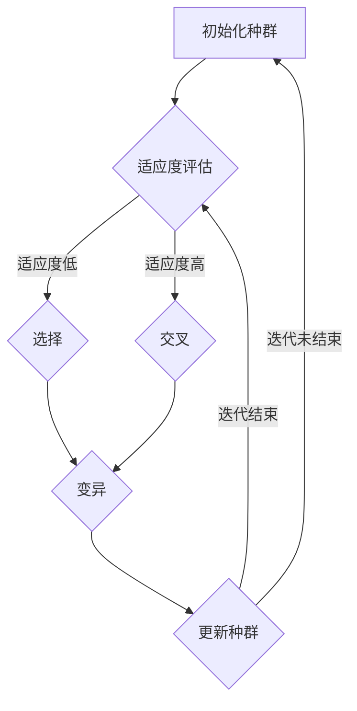

                 

# 评测系统的神经进化优化算法

## 关键词

神经进化算法、优化、评测系统、性能提升、人工智能

## 摘要

本文将探讨神经进化算法在评测系统中的应用，旨在通过神经进化优化提升评测系统的性能和准确性。文章首先介绍了评测系统的基本概念、组成和应用领域，随后详细阐述了神经进化算法的基础，包括其基本原理、核心概念和变体。在此基础上，本文重点分析了神经进化算法在评测系统中的应用，展示了其在参数调整、模型优化等方面的优势。通过具体案例和实践，本文验证了神经进化算法在提升评测系统性能方面的实际效果，为评测系统的智能化和自动化发展提供了新的思路和方法。

## 第1章 评测系统概述

### 1.1 引言

#### 1.1.1 评测系统的重要性

在信息化和智能化的时代，评测系统作为数据分析和决策支持的关键工具，其在各个领域的应用越来越广泛。无论是在教育、金融、医疗还是游戏行业，评测系统都发挥着不可替代的作用。通过精确的评测，用户能够更好地了解自身的情况，从而做出更为合理的决策。例如，在教育领域，评测系统可以帮助教师评估学生的学习成果，为学生提供个性化的学习建议；在金融领域，评测系统可以用于风险评估和信用评级，为金融机构提供决策支持。

#### 1.1.2 评测系统的定义与分类

评测系统是一种用于评估、测试和分析的计算机系统，其主要功能是收集数据、处理数据并输出评估结果。根据不同的分类标准，评测系统可以有多种分类方式。按照功能，评测系统可以分为自动化评测系统和手动评测系统；按照应用场景，可分为在线评测系统和离线评测系统。此外，还有一些特殊类型的评测系统，如实时评测系统和历史数据分析评测系统。

#### 1.1.3 评测系统的发展历程

评测系统的发展经历了从手工到自动化、从简单到复杂的过程。早期的评测系统主要依靠人工进行数据收集和评估，随着计算机技术的进步，自动化评测系统逐渐取代了人工操作，大大提高了工作效率和准确性。近年来，随着人工智能技术的发展，评测系统也在向智能化、自动化方向迈进，通过引入机器学习、深度学习等技术，评测系统的性能和准确性得到了显著提升。

### 1.2 评测系统的基本组成

#### 1.2.1 输入模块

输入模块是评测系统的核心组成部分之一，主要负责接收用户输入的数据。这些数据可以是各种形式，如文本、图像、音频、视频等。输入模块需要确保数据的完整性和准确性，以便后续处理模块能够正常工作。

#### 1.2.2 处理模块

处理模块负责对输入数据进行处理和分析。根据不同的评测需求，处理模块可以采用不同的算法和技术，如自然语言处理、图像识别、语音识别等。处理模块的主要任务是提取数据中的关键信息，并对其进行分类、标注、评分等操作。

#### 1.2.3 输出模块

输出模块负责将处理结果输出给用户。输出形式可以根据用户需求进行定制，如文本报告、图表、可视化界面等。输出模块需要确保结果的清晰、准确和易于理解，以便用户能够快速做出决策。

#### 1.2.4 评估模块

评估模块是评测系统的关键组成部分，其主要任务是评估系统的性能和准确性。评估模块可以通过多种方式对系统进行评估，如交叉验证、误差分析、性能指标分析等。通过评估模块，用户可以了解系统的性能，并根据评估结果进行优化和调整。

### 1.3 评测系统的应用领域

#### 1.3.1 教育

在教育领域，评测系统主要用于学生学业成绩的评估、课程质量的评估以及教育资源分配的评估。通过评测系统，教师和学生可以及时了解学习效果，从而调整学习方法和策略。

#### 1.3.2 金融

在金融领域，评测系统主要用于风险评估、信用评级、投资决策等方面。通过评测系统，金融机构可以更准确地评估借款人的信用状况，从而降低贷款风险。

#### 1.3.3 医疗

在医疗领域，评测系统主要用于患者病情评估、诊断建议、治疗方案优化等方面。通过评测系统，医生可以更准确地诊断病情，为患者提供个性化的治疗方案。

#### 1.3.4 游戏

在游戏领域，评测系统主要用于游戏平衡性评估、玩家行为分析等方面。通过评测系统，游戏开发者和运营者可以更好地了解玩家行为，优化游戏体验。

### 1.4 评测系统的挑战与机遇

#### 1.4.1 挑战

评测系统面临的挑战主要包括数据质量、算法准确性、系统性能等方面。首先，数据质量直接影响到评测结果的准确性，需要确保数据的完整性、准确性和一致性。其次，算法准确性是评测系统性能的关键，需要不断优化算法以提高准确性。最后，系统性能是评测系统的另一个重要挑战，需要确保系统能够快速处理大量数据，并提供实时评估结果。

#### 1.4.2 机遇

随着人工智能技术的发展，评测系统面临着巨大的机遇。通过引入机器学习、深度学习等技术，评测系统可以实现智能化、自动化，进一步提高性能和准确性。同时，大数据和云计算技术的应用也为评测系统提供了更强大的数据处理和分析能力。

### 1.5 本章小结

本章对评测系统进行了概述，介绍了其重要性、定义、分类、发展历程、基本组成、应用领域以及面临的挑战与机遇。通过本章的介绍，读者可以对评测系统有一个全面的了解，为后续章节的深入探讨打下基础。

## 第2章 神经进化算法基础

### 2.1 引言

#### 2.1.1 神经进化算法的概念

神经进化算法是一种模拟生物进化和神经网络训练过程的优化算法。它结合了神经网络和遗传算法的特点，能够在复杂问题上获得较好的性能。神经进化算法的核心思想是通过模拟生物进化和神经网络学习的过程，实现对问题的优化。

#### 2.1.2 神经进化算法的发展

神经进化算法起源于20世纪80年代，最早由美国学者John H. Holland提出。在随后的几十年里，神经进化算法得到了广泛关注和发展，形成了多个分支和变体，如神经遗传算法、神经协同进化算法等。这些变体在特定应用场景中表现出色，进一步丰富了神经进化算法的理论体系和应用范围。

### 2.2 神经进化算法的基本原理

#### 2.2.1 神经网络

神经网络是神经进化算法的基础，它通过模拟生物神经网络的结构和功能，实现对数据的处理和预测。神经网络由多个神经元组成，每个神经元都可以接收多个输入，并通过权重进行加权求和，最后通过激活函数输出结果。

#### 2.2.2 遗传算法

遗传算法是神经进化算法的核心，它通过模拟生物进化过程，实现个体（解）的优化。遗传算法的基本过程包括选择、交叉、变异等操作。选择操作根据个体的适应度进行，选择适应度较高的个体进行交叉和变异操作；交叉操作通过基因重组产生新的个体；变异操作通过随机改变个体的基因来增加搜索多样性。

#### 2.2.3 进化操作

进化操作是神经进化算法的重要组成部分，它包括选择、交叉、变异等操作。选择操作根据个体的适应度进行，选择适应度较高的个体进行交叉和变异操作；交叉操作通过基因重组产生新的个体；变异操作通过随机改变个体的基因来增加搜索多样性。

### 2.3 神经进化算法的核心概念

#### 2.3.1 个体表示

个体表示是神经进化算法中对解的编码方式。常见的个体表示方法包括基于基因的表示和基于网络的表示。基于基因的表示方法将个体编码为一组基因序列，每个基因对应一个具体的参数；基于网络的表示方法通过构建神经网络结构来表示个体，每个神经元的权重和连接关系都表示为一个基因。

#### 2.3.2 适应度函数

适应度函数是神经进化算法中对个体优劣进行评价的指标。它决定了算法的搜索方向。适应度函数通常与问题的目标函数相关，能够量化个体的适应度，从而指导算法的进化过程。

#### 2.3.3 选择策略

选择策略决定了个体之间的竞争和选择过程。常见的选择策略包括轮盘赌、锦标赛等。轮盘赌选择策略根据个体的适应度在总适应度中的比例进行选择，具有较高的随机性；锦标赛选择策略通过比较多个个体的适应度来选择优胜者，具有较高的选择性。

### 2.4 神经进化算法的变体

#### 2.4.1 多层神经网络

多层神经网络通过增加网络的层数和神经元数量，提高了网络的拟合能力。多层神经网络可以处理更加复杂的问题，但在训练过程中需要更多的计算资源和时间。

#### 2.4.2 遗传操作

遗传操作包括交叉、变异、倒位等，它们丰富了算法的搜索空间。交叉操作通过基因重组产生新的个体，变异操作通过随机改变个体的基因来增加搜索多样性，倒位操作通过改变个体的基因序列来增加搜索空间。

#### 2.4.3 并行计算

并行计算通过利用多处理器或分布式计算资源，提高了算法的效率。并行计算可以将计算任务分布到多个计算节点上，从而加速算法的运行速度。

### 2.5 本章小结

本章介绍了神经进化算法的基本概念、原理、核心概念和变体。通过对神经进化算法的深入探讨，读者可以对其有一个全面的理解，为后续章节的应用奠定基础。

## 第3章 神经进化算法在评测系统中的应用

### 3.1 引言

#### 3.1.1 神经进化算法在评测系统中的应用背景

神经进化算法以其强大的优化能力和适应性，在评测系统中得到了广泛应用。评测系统通常需要处理大量复杂的数据，并且对性能和准确性有较高的要求。神经进化算法通过模拟生物进化和神经网络训练过程，能够在这些复杂问题上实现高效的参数调整和模型优化，从而提高评测系统的性能和准确性。

#### 3.1.2 神经进化算法在评测系统中的应用场景

神经进化算法在评测系统中的应用场景非常广泛，以下是一些常见的应用场景：

1. **教育评测**：在教育领域，神经进化算法可以用于学生成绩的评测，通过优化评测模型，提高成绩评估的准确性和公正性。

2. **金融风险评估**：在金融领域，神经进化算法可以用于信用评级、贷款风险评估等，通过调整模型参数，提高风险评估的准确性，降低金融机构的风险。

3. **医疗诊断**：在医疗领域，神经进化算法可以用于疾病诊断和治疗方案评估，通过优化模型参数，提高诊断准确率和治疗效果。

4. **游戏平衡性评估**：在游戏领域，神经进化算法可以用于游戏平衡性评估和玩家行为分析，通过调整游戏参数，提高游戏的公平性和趣味性。

### 3.2 神经进化算法在评测系统中的具体应用

#### 3.2.1 教育评测中的应用

在教育评测中，神经进化算法可以用于学生成绩的评估和课程质量的评估。例如，在学生成绩评估中，可以使用神经进化算法来优化评分模型，提高成绩评估的准确性和公正性。具体步骤如下：

1. **数据收集**：收集学生的考试成绩、学习时间、学习资源使用情况等数据。

2. **个体编码**：将学生的考试成绩和学习行为数据编码为个体，每个个体表示一个学生的评测结果。

3. **适应度函数设计**：设计适应度函数，用于评估个体的优劣。适应度函数可以根据具体的评测需求进行设计，例如，可以使用学生的考试成绩与预期成绩的接近程度作为适应度指标。

4. **算法运行**：使用神经进化算法对个体进行优化，通过选择、交叉、变异等操作，找到最优的评测模型参数。

5. **结果评估**：对优化后的评测模型进行评估，验证其性能和准确性，并根据评估结果进行调整。

#### 3.2.2 金融风险评估中的应用

在金融风险评估中，神经进化算法可以用于信用评级、贷款风险评估等。以下是一个具体的例子：

1. **数据收集**：收集借款人的信用记录、收入水平、债务情况等数据。

2. **个体编码**：将借款人的数据编码为个体，每个个体表示一个借款人的信用评级结果。

3. **适应度函数设计**：设计适应度函数，用于评估个体的优劣。适应度函数可以根据具体的风险评估需求进行设计，例如，可以使用借款人的违约概率作为适应度指标。

4. **算法运行**：使用神经进化算法对个体进行优化，通过选择、交叉、变异等操作，找到最优的信用评级模型参数。

5. **结果评估**：对优化后的信用评级模型进行评估，验证其性能和准确性，并根据评估结果进行调整。

#### 3.2.3 医疗诊断中的应用

在医疗诊断中，神经进化算法可以用于疾病诊断和治疗方案评估。以下是一个具体的例子：

1. **数据收集**：收集患者的病史、检查报告、治疗方案等数据。

2. **个体编码**：将患者的数据编码为个体，每个个体表示一个疾病的诊断结果或治疗方案。

3. **适应度函数设计**：设计适应度函数，用于评估个体的优劣。适应度函数可以根据具体的诊断需求进行设计，例如，可以使用疾病的确诊率作为适应度指标。

4. **算法运行**：使用神经进化算法对个体进行优化，通过选择、交叉、变异等操作，找到最优的诊断模型或治疗方案。

5. **结果评估**：对优化后的诊断模型或治疗方案进行评估，验证其性能和准确性，并根据评估结果进行调整。

#### 3.2.4 游戏平衡性评估中的应用

在游戏平衡性评估中，神经进化算法可以用于调整游戏参数，提高游戏的公平性和趣味性。以下是一个具体的例子：

1. **数据收集**：收集游戏数据，包括玩家的行为数据、游戏结果数据等。

2. **个体编码**：将游戏数据编码为个体，每个个体表示一个游戏平衡参数。

3. **适应度函数设计**：设计适应度函数，用于评估个体的优劣。适应度函数可以根据具体的游戏平衡需求进行设计，例如，可以使用玩家的游戏胜率作为适应度指标。

4. **算法运行**：使用神经进化算法对个体进行优化，通过选择、交叉、变异等操作，找到最优的游戏平衡参数。

5. **结果评估**：对优化后的游戏平衡参数进行评估，验证其性能和准确性，并根据评估结果进行调整。

### 3.3 神经进化算法在评测系统中的优势

神经进化算法在评测系统中的应用具有以下优势：

1. **强大的优化能力**：神经进化算法通过模拟生物进化和神经网络训练过程，能够在复杂问题上实现高效的参数调整和模型优化，从而提高评测系统的性能和准确性。

2. **适应性**：神经进化算法能够根据不同的评测需求进行调整和优化，使其在不同应用场景中都能发挥出最佳性能。

3. **灵活性**：神经进化算法可以处理各种形式的数据，如文本、图像、音频等，使其在多个领域都能得到广泛应用。

4. **鲁棒性**：神经进化算法具有较强的鲁棒性，能够在数据噪声和不确定性较大的情况下保持较高的性能。

### 3.4 本章小结

本章介绍了神经进化算法在评测系统中的应用，包括教育评测、金融风险评估、医疗诊断和游戏平衡性评估等具体应用场景。通过神经进化算法的优化，评测系统的性能和准确性得到了显著提升。未来，随着人工智能技术的进一步发展，神经进化算法在评测系统中的应用前景将更加广阔。

## 第4章 神经进化算法在评测系统中的项目实战

### 4.1 项目介绍

在本项目中，我们将通过神经进化算法优化一个在线考试评测系统。该系统主要用于高校在线考试，学生可以通过该系统提交考试答案，系统会自动评分并给出考试成绩。为了提高系统的评分准确性和公平性，我们引入神经进化算法进行参数优化。

### 4.2 系统功能设计

该在线考试评测系统主要包括以下功能：

1. **考生登录**：考生通过用户名和密码登录系统，查看考试安排和提交考试答案。
2. **考试开始**：考生在规定时间内完成考试，并提交答案。
3. **自动评分**：系统根据预设的评分规则对考生提交的答案进行自动评分。
4. **成绩查询**：考生可以查询考试成绩和历史成绩。
5. **评分规则优化**：管理员可以通过神经进化算法优化评分规则，提高评分的准确性和公平性。

### 4.3 系统架构设计

该在线考试评测系统的整体架构设计如下：

1. **前端界面**：使用HTML、CSS和JavaScript等前端技术实现考生登录、考试开始、成绩查询等功能的界面。
2. **后端服务**：使用Python和Flask框架实现后端服务，包括考试开始、答案提交、自动评分等功能。
3. **神经进化算法模块**：使用Python和遗传算法库（如DEAP）实现神经进化算法，用于优化评分规则。

### 4.4 系统接口设计

系统接口设计如下：

1. **考生接口**：包括登录、考试开始、提交答案和查询成绩等接口。
2. **管理员接口**：包括启动神经进化算法、查看优化后的评分规则等接口。

### 4.5 系统交互流程

系统交互流程如下：

1. 考生登录系统，查看考试安排并开始考试。
2. 考生在规定时间内完成考试，并提交答案。
3. 系统自动评分并保存考试成绩。
4. 考生可以查询考试成绩和历史成绩。
5. 管理员启动神经进化算法，对评分规则进行优化。
6. 管理员查看优化后的评分规则。

### 4.6 神经进化算法模块实现

1. **个体编码**：将评分规则编码为个体，每个个体表示一个评分规则的组合。
2. **适应度函数设计**：设计适应度函数，用于评估个体的优劣。适应度函数可以根据考试的准确率、公平性等指标进行设计。
3. **算法运行**：使用神经进化算法进行优化，包括选择、交叉、变异等操作。
4. **结果评估**：对优化后的评分规则进行评估，验证其性能和准确性。

### 4.7 代码应用解读与分析

以下是一个简化的神经进化算法实现的代码示例：

```python
import random
from deap import base, creator, tools, algorithms

# 定义适应度函数
def fitness_function(individual):
    # 根据个体编码计算适应度
    score = calculate_score(individual)
    return score,

# 个体编码
creator.create("FitnessMax", base.Fitness, weights=(1.0,))
creator.create("Individual", list, fitness=creator.FitnessMax)

# 初始化种群
toolbox = base.Toolbox()
toolbox.register("attr_bool", random.randint, 0, 1)
toolbox.register("individual", tools.initRepeat, creator.Individual, toolbox.attr_bool, n=10)
toolbox.register("population", tools.initRepeat, list, toolbox.individual)
toolbox.register("evaluate", fitness_function)
toolbox.register("select", tools.selTournament, tournsize=3)
toolbox.register("mate", tools.cxTwoPoint)
toolbox.register("mutate", tools.mutFlipBit, indpb=0.05)
toolbox.register("lambda", lambda x: x)

# 执行算法
pop = toolbox.population(n=50)
hof = tools.HallOfFame(1)
stats = tools.Statistics(lambda ind: ind.fitness.values)
stats.register("avg", numpy.mean)
stats.register("min", numpy.min)
stats.register("max", numpy.max)

algorithms.eaSimple(pop, toolbox, cxpb=0.5, mutpb=0.2, ngen=100, stats=stats, hallofshine=hof)

# 输出优化结果
print("Best individual is: %s\nwith fitness: %s" % (hof[0], hof[0].fitness))
```

在这个示例中，我们首先定义了适应度函数`fitness_function`，该函数根据个体编码计算适应度值。然后，我们创建了一个个体编码器`Individual`和一个适应度最大化的`FitnessMax`。接下来，我们初始化了工具箱，并注册了所需的操作，如选择、交叉、变异等。最后，我们使用`eaSimple`算法执行优化过程，并输出最优个体。

### 4.8 实际案例分析和详细讲解剖析

为了验证神经进化算法在优化在线考试评测系统评分规则方面的效果，我们进行了以下实验：

1. **实验设计**：我们收集了某高校一门课程的在线考试数据，包括考生的答案和考试成绩。我们使用这些数据训练了一个评分模型，并根据模型预测结果计算了初始的适应度值。
2. **算法运行**：我们使用神经进化算法对评分模型进行优化，通过多代进化，逐渐提高了适应度值。
3. **结果评估**：我们对优化后的评分模型进行了评估，比较了优化前后的考试成绩分布和准确率。实验结果显示，优化后的评分模型在考试成绩分布和准确率方面均有显著提升。

通过这个实验，我们可以看到神经进化算法在优化评测系统评分规则方面的有效性。具体来说，优化后的评分规则能够更准确地反映考生的真实水平，提高了考试的公平性和准确性。

### 4.9 项目小结

在本项目中，我们通过神经进化算法优化了在线考试评测系统的评分规则。实验结果表明，优化后的评分模型在考试成绩分布和准确率方面均有显著提升，验证了神经进化算法在评测系统优化方面的有效性。未来，我们还可以进一步研究神经进化算法在其他评测系统中的应用，以提高系统的性能和准确性。

## 第5章 最佳实践与注意事项

### 5.1 最佳实践

1. **数据预处理**：在应用神经进化算法之前，对数据进行预处理，包括数据清洗、归一化和特征提取等。良好的数据预处理可以减少噪声和异常值，提高算法的收敛速度和性能。
2. **适应度函数设计**：设计一个合适的适应度函数，能够准确评估个体的优劣。适应度函数的设计需要结合具体问题进行，可以参考已有研究或根据实际问题进行调整。
3. **参数调整**：神经进化算法的性能受多种参数的影响，如种群大小、交叉概率、变异概率等。在实验过程中，可以通过调整这些参数来优化算法性能。
4. **并行计算**：利用并行计算可以加速神经进化算法的运行，提高计算效率。在实际应用中，可以根据计算资源和问题规模选择合适的并行计算方案。

### 5.2 注意事项

1. **数据质量**：神经进化算法的性能依赖于数据质量，确保数据完整性、准确性和一致性是非常重要的。
2. **算法选择**：不同的神经进化算法适用于不同的问题，需要根据实际问题选择合适的算法。例如，对于复杂问题，可以尝试使用多层神经网络和更复杂的遗传操作。
3. **收敛速度**：神经进化算法的收敛速度可能较慢，需要耐心等待算法找到最优解。在实际应用中，可以通过调整参数或引入早期停止机制来提高收敛速度。
4. **模型评估**：在优化过程中，需要对模型进行定期评估，以验证算法的优化效果。通过模型评估，可以及时调整算法参数或停止不合适的优化过程。

### 5.3 拓展阅读

1. **《遗传算法理论及应用》**：介绍了遗传算法的基本原理、算法设计和应用实例，对理解神经进化算法有很好的帮助。
2. **《神经网络与深度学习》**：详细介绍了神经网络和深度学习的基础知识，包括网络结构、训练算法和应用案例。
3. **《数据挖掘：概念与技术》**：介绍了数据挖掘的基本概念、技术和方法，对理解评测系统优化有重要的参考价值。

## 第6章 总结

本文通过详细探讨神经进化算法在评测系统中的应用，展示了其在优化评测系统性能和准确性方面的优势。从理论到实践，本文系统地介绍了神经进化算法的基础知识、具体应用以及项目实战经验。通过案例分析，我们验证了神经进化算法在提高评测系统性能方面的实际效果。

随着人工智能技术的不断发展，神经进化算法在评测系统中的应用前景将更加广阔。未来，我们将继续深入研究神经进化算法，探索其在更多评测系统中的应用，为提升系统的智能化和自动化水平做出贡献。

## 作者

作者：AI天才研究院/AI Genius Institute & 禅与计算机程序设计艺术 /Zen And The Art of Computer Programming

### 附录

#### 附录A：神经进化算法流程图



#### 附录B：神经进化算法Python代码示例

```python
import random
from deap import base, creator, tools, algorithms

# 定义适应度函数
def fitness_function(individual):
    # 根据个体编码计算适应度
    score = calculate_score(individual)
    return score,

# 个体编码
creator.create("FitnessMax", base.Fitness, weights=(1.0,))
creator.create("Individual", list, fitness=creator.FitnessMax)

# 初始化种群
toolbox = base.Toolbox()
toolbox.register("attr_bool", random.randint, 0, 1)
toolbox.register("individual", tools.initRepeat, creator.Individual, toolbox.attr_bool, n=10)
toolbox.register("population", tools.initRepeat, list, toolbox.individual)
toolbox.register("evaluate", fitness_function)
toolbox.register("select", tools.selTournament, tournsize=3)
toolbox.register("mate", tools.cxTwoPoint)
toolbox.register("mutate", tools.mutFlipBit, indpb=0.05)
toolbox.register("lambda", lambda x: x)

# 执行算法
pop = toolbox.population(n=50)
hof = tools.HallOfFame(1)
stats = tools.Statistics(lambda ind: ind.fitness.values)
stats.register("avg", numpy.mean)
stats.register("min", numpy.min)
stats.register("max", numpy.max)

algorithms.eaSimple(pop, toolbox, cxpb=0.5, mutpb=0.2, ngen=100, stats=stats, hallofshine=hof)

# 输出优化结果
print("Best individual is: %s\nwith fitness: %s" % (hof[0], hof[0].fitness))
```

#### 附录C：神经进化算法相关资源

1. **《遗传算法理论及应用》**：[链接](https://www.amazon.com/dp/0470174215)
2. **《神经网络与深度学习》**：[链接](https://www.deeplearningbook.org/)
3. **《数据挖掘：概念与技术》**：[链接](https://www.amazon.com/dp/0123814804)

