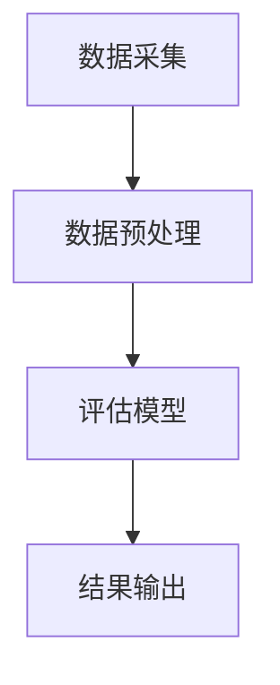
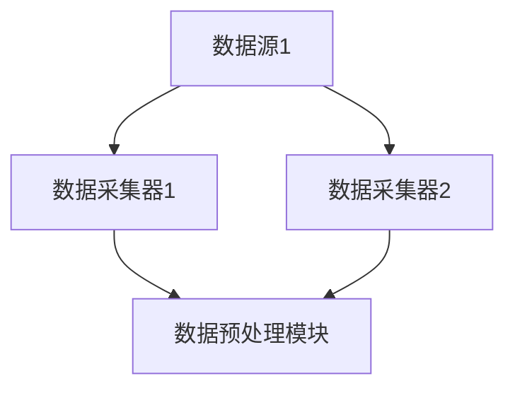
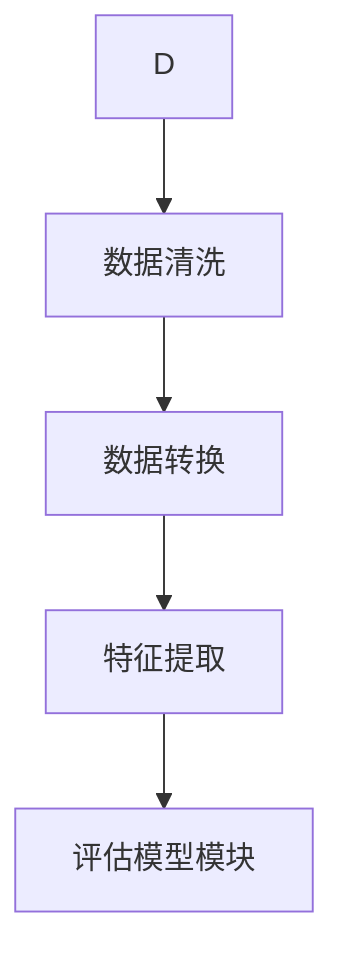
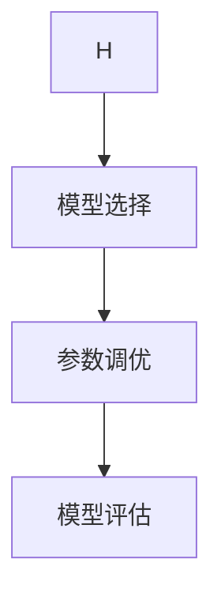
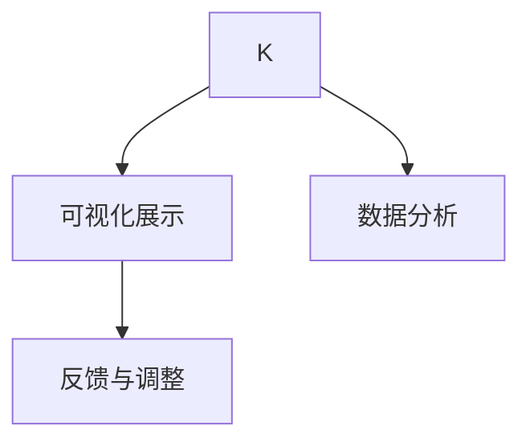
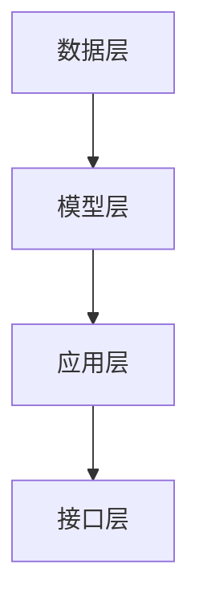
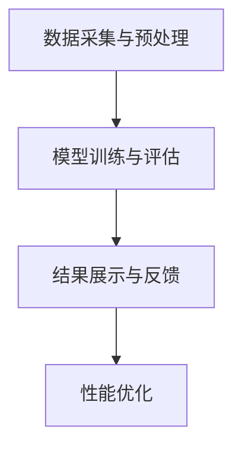
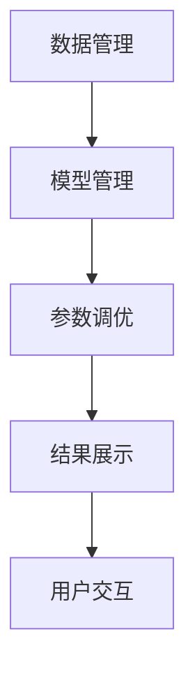
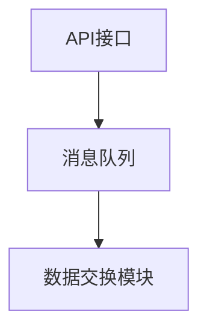
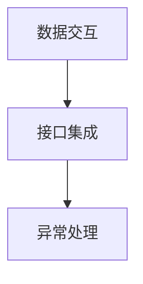

                 

### 评测系统的自动化调参优化功能

#### 引言

在当前数据驱动和人工智能迅猛发展的时代，评测系统作为数据处理和智能决策的重要工具，已经在各个领域得到了广泛的应用。然而，评测系统的性能优化，尤其是参数调优，一直是工程师们面临的重大挑战。手动调参费时费力，且容易陷入局部最优；而自动化调参技术则能够通过算法优化，大幅度提升调参效率和系统性能。本文将围绕评测系统的自动化调参优化功能，进行深入探讨。

本文结构如下：

1. **引言**：介绍评测系统自动化调参优化功能的背景、重要性和应用领域。
2. **评测系统基础**：梳理评测系统的基本概念、组成与常见问题。
3. **自动化调参技术**：讲解自动化调参的基本原理、方法与应用实例。
4. **优化函数与算法**：分析优化函数与算法的原理、分类及其应用与评估。
5. **评测系统设计与实现**：介绍评测系统的需求分析、架构设计、实现与优化。
6. **性能分析与评估**：探讨评测系统的性能指标、分析方法和评估结果。
7. **案例研究**：通过具体案例，分析自动化调参优化在实际项目中的应用。
8. **未来展望与挑战**：展望自动化调参技术的发展趋势，探讨面临的挑战与对策。

#### 关键词

- **评测系统**
- **自动化调参**
- **优化算法**
- **性能分析**
- **案例分析**
- **系统设计**

#### 摘要

本文系统性地探讨了评测系统的自动化调参优化功能。首先介绍了评测系统的基本概念和自动化调参的背景，然后详细分析了自动化调参技术的原理和方法，以及优化函数与算法的应用。接着，本文探讨了评测系统的设计与实现，并通过具体案例展示了自动化调参优化在各个领域中的应用。最后，本文对自动化调参技术的未来发展趋势和面临的挑战进行了展望。

### 第一部分：引言

#### 1.1 评测系统自动化调参优化功能概述

##### 1.1.1 背景与重要性

评测系统是现代数据分析和人工智能应用中不可或缺的工具。它能够对大量数据进行处理，通过一系列的算法和模型，提供评估、预测和分析结果。评测系统的性能直接影响到数据分析和决策的准确性，而系统性能的关键因素之一就是参数调优。

传统的参数调优通常采用手动方法，工程师需要根据经验和直觉来调整模型参数。然而，这种方法存在几个显著的问题：

1. **费时费力**：参数调优过程繁琐，需要大量的时间和计算资源。
2. **容易陷入局部最优**：手动调参往往只能找到一个局部最优解，无法保证全局最优。
3. **依赖经验**：参数调优过程高度依赖工程师的经验，缺乏系统的指导。

为了解决这些问题，自动化调参技术应运而生。自动化调参通过算法自动搜索最优参数组合，大幅度提高了调参效率和系统性能。

##### 1.1.2 应用领域

自动化调参优化功能在多个领域都有着广泛的应用：

1. **机器学习**：在机器学习模型训练过程中，自动化调参可以优化模型的参数，提高模型的准确性和泛化能力。
2. **数据挖掘**：在数据挖掘任务中，自动化调参可以优化数据预处理和特征提取过程，提高挖掘结果的准确性。
3. **金融风控**：在金融风险控制中，自动化调参可以帮助优化风险模型参数，提高预测准确率和风险控制能力。
4. **医疗诊断**：在医疗诊断系统中，自动化调参可以优化诊断模型的参数，提高诊断的准确性和效率。

##### 1.1.3 本书结构

本书将从以下几个方面系统地探讨评测系统的自动化调参优化功能：

1. **评测系统基础**：介绍评测系统的基本概念、组成与常见问题。
2. **自动化调参技术**：讲解自动化调参的基本原理、方法与应用实例。
3. **优化函数与算法**：分析优化函数与算法的原理、分类及其应用与评估。
4. **评测系统设计与实现**：介绍评测系统的需求分析、架构设计、实现与优化。
5. **性能分析与评估**：探讨评测系统的性能指标、分析方法和评估结果。
6. **案例研究**：通过具体案例，分析自动化调参优化在实际项目中的应用。
7. **未来展望与挑战**：展望自动化调参技术的发展趋势，探讨面临的挑战与对策。

通过本书的深入探讨，读者将全面了解评测系统的自动化调参优化功能，掌握相关技术和方法，为实际项目中的应用提供有力支持。

##### 1.2 本书目标与读者对象

##### 1.2.1 目标

本书的主要目标如下：

1. **系统了解自动化调参优化功能**：帮助读者全面了解评测系统的自动化调参优化功能，包括其基本概念、原理、方法与应用。
2. **掌握自动化调参技术**：通过详细的讲解和案例分析，使读者掌握自动化调参技术的核心原理和方法，能够应用于实际项目。
3. **提升系统设计与优化能力**：通过深入探讨评测系统的设计与实现，帮助读者提升系统设计与优化能力，提高系统性能和可靠性。
4. **了解自动化调参的发展趋势**：展望自动化调参技术的未来发展趋势，探讨面临的挑战与对策，为读者提供未来研究方向。

##### 1.2.2 读者对象

本书主要面向以下读者群体：

1. **数据科学家和机器学习工程师**：希望了解和应用自动化调参技术的专业人士，特别是在模型训练和优化方面有需求的工程师。
2. **软件工程师和系统架构师**：需要设计和优化评测系统的工程师，特别是对系统性能优化有高度关注的人群。
3. **研究人员和学者**：对自动化调参优化技术有兴趣，希望深入研究的学者和研究人员。
4. **高校学生和研究生**：对自动化调参技术和评测系统有研究兴趣的本科生和研究生。

通过本书的学习，读者将能够全面掌握评测系统的自动化调参优化功能，为数据分析和智能决策提供有力支持。

### 第二部分：评测系统基础

#### 2.1 评测系统的基本概念

##### 2.1.1 定义与分类

评测系统，即评估系统，是一种用于对数据、模型或系统进行评估和分析的工具。它通过一系列算法和模型，对输入的数据进行处理，输出评估结果。评测系统在机器学习、数据挖掘、软件工程等领域有着广泛的应用。

根据应用场景和目标，评测系统可以分为以下几类：

1. **机器学习评估系统**：用于评估机器学习模型的性能，包括分类、回归、聚类等任务。
2. **数据挖掘评估系统**：用于评估数据挖掘算法的准确性、效率和可靠性。
3. **软件质量评估系统**：用于评估软件系统的性能、稳定性、安全性等指标。
4. **金融风险评估系统**：用于评估金融产品的风险水平，包括信用评分、市场风险评估等。

##### 2.1.2 评测系统的组成与结构

评测系统通常由以下几个核心模块组成：

1. **数据采集模块**：负责收集和获取用于评估的数据。
2. **数据预处理模块**：对采集到的数据进行清洗、转换和预处理，以便后续分析和评估。
3. **评估模型模块**：包含多种评估模型和方法，根据不同的评估目标和任务，选择合适的模型。
4. **结果输出模块**：将评估结果以图表、报告等形式展示给用户。

以下是评测系统的典型结构图：



##### 2.1.3 评测系统的功能与作用

评测系统的核心功能是评估和分析数据、模型或系统的性能，具体包括以下几个方面：

1. **性能评估**：通过评估模型或系统的性能指标（如准确率、召回率、F1值等），衡量其性能优劣。
2. **诊断分析**：对系统或模型存在的问题进行诊断和分析，帮助工程师定位和解决问题。
3. **优化指导**：通过评估结果，为工程师提供优化模型或系统的指导，提升其性能。
4. **决策支持**：为决策者提供数据驱动的决策支持，帮助其做出更科学的决策。

#### 2.2 评测系统的组成与结构

##### 2.2.1 数据采集模块

数据采集模块是评测系统的第一步，其任务是从各种数据源（如数据库、API、文件等）中收集数据。数据采集模块需要考虑以下关键点：

1. **数据源类型**：根据评估目标，选择合适的数据源。
2. **数据质量**：确保采集到的数据是完整、准确和可靠的。
3. **采集频率**：根据业务需求，设置合适的采集频率。

以下是数据采集模块的典型结构图：



##### 2.2.2 数据预处理模块

数据预处理模块对采集到的原始数据进行清洗、转换和标准化处理，以便后续分析和评估。数据预处理的关键点包括：

1. **数据清洗**：去除重复数据、缺失值、噪声数据等。
2. **数据转换**：将数据转换为适合评估模型的形式，如归一化、标准化等。
3. **特征提取**：从原始数据中提取有用的特征，提高评估模型的性能。

以下是数据预处理模块的典型结构图：



##### 2.2.3 评测模型模块

评测模型模块是评测系统的核心，根据不同的评估目标和任务，选择合适的评估模型和方法。评测模型模块的关键点包括：

1. **模型选择**：根据评估目标和数据特征，选择合适的评估模型。
2. **参数调优**：通过自动化调参技术，优化模型参数，提高评估性能。
3. **模型评估**：使用各种评估指标，如准确率、召回率、F1值等，评估模型性能。

以下是评测模型模块的典型结构图：



##### 2.2.4 结果输出模块

结果输出模块将评估结果以图表、报告等形式展示给用户。结果输出模块的关键点包括：

1. **可视化展示**：使用图表、报表等形式，直观地展示评估结果。
2. **数据分析**：对评估结果进行进一步分析，发现问题和优化方向。
3. **反馈与调整**：根据评估结果，对评测系统进行调整和优化。

以下是结果输出模块的典型结构图：



##### 2.3 评测系统的常见问题

##### 2.3.1 数据质量问题

数据质量是评测系统的基石。常见的数据质量问题包括：

1. **缺失值**：数据中存在大量缺失值，影响评估模型的性能。
2. **噪声数据**：数据中存在噪声，干扰评估结果。
3. **不一致性**：数据之间存在不一致性，影响模型训练和评估。

##### 2.3.2 模型选择问题

模型选择是评估系统的重要环节。常见的问题包括：

1. **模型不合适**：选择的模型与评估目标不匹配，导致评估结果不准确。
2. **参数调优困难**：模型参数调优困难，难以找到最优参数组合。

##### 2.3.3 调参困难问题

参数调优是评估系统中的核心任务。常见的问题包括：

1. **手工调参效率低**：手工调参费时费力，难以应对大规模参数搜索空间。
2. **局部最优问题**：手工调参容易陷入局部最优，无法保证全局最优。

##### 2.3.4 性能评估问题

性能评估是评测系统的最终目标。常见的问题包括：

1. **评估指标不准确**：评估指标选择不当，导致评估结果不准确。
2. **评估方法不全面**：评估方法不全面，无法全面反映系统的性能。

通过分析评测系统的常见问题，我们可以更好地理解和应对这些挑战，提高评测系统的性能和可靠性。

### 第三部分：自动化调参技术

#### 3.1 自动化调参的基本原理

##### 3.1.1 自动化调参的定义

自动化调参（Automated Model Tuning）是指通过算法和工具自动搜索最优模型参数，以提高模型性能和适应性的过程。它旨在解决传统手动调参耗时、低效和易陷入局部最优的问题。

##### 3.1.2 自动化调参的目标

自动化调参的主要目标包括：

1. **提高模型性能**：通过搜索最优参数组合，提高模型的准确率、召回率等性能指标。
2. **缩短调参时间**：自动化调参能够快速找到最优参数，大大缩短调参时间。
3. **减少人力资源**：自动化调参减轻了工程师的负担，减少了人力成本。
4. **提高模型泛化能力**：通过更全面的参数搜索，提高模型对未知数据的泛化能力。

##### 3.1.3 自动化调参的方法

自动化调参的方法主要分为以下几种：

1. **网格搜索（Grid Search）**：通过遍历所有可能的参数组合，找到最优参数。缺点是计算量巨大，不适用于参数空间较大的问题。
2. **随机搜索（Random Search）**：从参数空间中随机选择参数组合进行评估，相比于网格搜索，计算量小，但可能无法找到全局最优。
3. **贝叶斯优化（Bayesian Optimization）**：基于贝叶斯统计模型，通过历史评估数据预测下一个参数组合，具有高效性和鲁棒性。
4. **进化算法（Evolutionary Algorithms）**：模拟自然进化过程，通过交叉、变异和选择等操作，搜索最优参数组合。
5. **强化学习（Reinforcement Learning）**：通过奖励机制和策略迭代，自动调整参数，以最大化评估指标。

#### 3.2 常见的自动化调参方法

##### 3.2.1 网格搜索（Grid Search）

网格搜索是一种简单的自动化调参方法，通过遍历所有可能的参数组合，找到最优参数。其基本步骤如下：

1. **定义参数空间**：确定每个参数的取值范围。
2. **生成参数组合**：生成所有可能的参数组合。
3. **评估参数组合**：对每个参数组合进行评估，计算评估指标。
4. **选择最优参数**：根据评估指标选择最优参数组合。

以下是网格搜索的Python代码示例：

```python
from sklearn.model_selection import GridSearchCV
from sklearn.ensemble import RandomForestClassifier
import numpy as np

# 定义参数空间
param_grid = {'n_estimators': range(100, 1000), 'max_depth': range(10, 100)}

# 创建模型
model = RandomForestClassifier()

# 创建网格搜索对象
grid_search = GridSearchCV(model, param_grid, cv=5)

# 训练模型
grid_search.fit(X_train, y_train)

# 获取最优参数
best_params = grid_search.best_params_
```

##### 3.2.2 随机搜索（Random Search）

随机搜索通过从参数空间中随机选择参数组合进行评估，找到最优参数。其基本步骤如下：

1. **定义参数空间**：确定每个参数的取值范围。
2. **生成参数组合**：随机生成多个参数组合。
3. **评估参数组合**：对每个参数组合进行评估，计算评估指标。
4. **选择最优参数**：根据评估指标选择最优参数组合。

以下是随机搜索的Python代码示例：

```python
from sklearn.model_selection import RandomizedSearchCV
from sklearn.ensemble import RandomForestClassifier
import numpy as np

# 定义参数空间
param_distributions = {'n_estimators': np.arange(100, 1000, 100), 'max_depth': np.arange(10, 100, 10)}

# 创建模型
model = RandomForestClassifier()

# 创建随机搜索对象
random_search = RandomizedSearchCV(model, param_distributions, n_iter=100, cv=5)

# 训练模型
random_search.fit(X_train, y_train)

# 获取最优参数
best_params = random_search.best_params_
```

##### 3.2.3 贝叶斯优化（Bayesian Optimization）

贝叶斯优化基于贝叶斯统计模型，通过历史评估数据预测下一个参数组合，以最大化评估指标。其基本步骤如下：

1. **初始化模型**：使用高斯过程（Gaussian Process）模型预测评估指标。
2. **选择候选参数**：基于当前评估数据和模型预测，选择下一个候选参数。
3. **评估候选参数**：对候选参数进行评估，更新评估数据和模型预测。
4. **迭代优化**：重复选择和评估过程，直到找到最优参数。

以下是贝叶斯优化的Python代码示例：

```python
from bayes_opt import BayesianOptimization
from sklearn.model_selection import cross_val_score
from sklearn.ensemble import RandomForestClassifier

# 定义目标函数
def rf_cv(n_estimators, max_depth):
    model = RandomForestClassifier(n_estimators=int(n_estimators), max_depth=int(max_depth))
    return cross_val_score(model, X_train, y_train, cv=5).mean()

# 创建贝叶斯优化对象
optimizer = BayesianOptimization(f=rf_cv, pbounds={'n_estimators': (100, 1000), 'max_depth': (10, 100)})

# 运行贝叶斯优化
optimizer.maximize(init_points=5, n_iter=25)

# 获取最优参数
best_params = optimizer.max['params']
```

##### 3.2.4 进化算法（Evolutionary Algorithms）

进化算法模拟自然进化过程，通过交叉、变异和选择等操作，搜索最优参数组合。其基本步骤如下：

1. **初始化种群**：随机生成初始种群，每个个体代表一组参数。
2. **适应度评估**：对每个个体进行适应度评估，计算评估指标。
3. **选择操作**：根据适应度选择优秀的个体。
4. **交叉操作**：选择两个优秀个体进行交叉，生成新的个体。
5. **变异操作**：对个体进行随机变异，产生新的个体。
6. **迭代优化**：重复选择、交叉、变异和评估过程，直到找到最优参数。

以下是进化算法的Python代码示例：

```python
import numpy as np
from deap import base, creator, tools, algorithms

# 定义适应度函数
def fitness_function(individual):
    n_estimators = individual[0]
    max_depth = individual[1]
    model = RandomForestClassifier(n_estimators=int(n_estimators), max_depth=int(max_depth))
    score = cross_val_score(model, X_train, y_train, cv=5).mean()
    return score,

# 定义个体编码
creator.create("FitnessMax", base.Fitness, weights=(1.0,))
creator.create("Individual", list, fitness=creator.FitnessMax)

# 初始化种群
 toolbox = base.Toolbox()
toolbox.register("attr_int", np.random.randint, low=100, high=1000)
toolbox.register("individual", tools.initRepeat, creator.Individual, toolbox.attr_int, n=2)
toolbox.register("population", tools.initRepeat, list, toolbox.individual)
toolbox.register("evaluate", fitness_function)
toolbox.register("select", tools.selTournament, tournsize=3)
toolbox.register("mate", tools.cxTwoPoint)
toolbox.register("mutate", tools.mutUniformInt, low=100, up=1000, indpb=0.1)

# 运行进化算法
pop = toolbox.population(n=50)
hof = tools.HallOfFame(1)
stats = tools.Statistics(lambda ind: ind.fitness.values)
stats.register("avg", np.mean)
stats.register("min", np.min)
stats.register("max", np.max)
algorithms.eaSimple(pop, stats=stats, hof=hof, verbose=True, n_gen=100)

# 获取最优参数
best_individual = hof[0]
best_params = [best_individual[0], best_individual[1]]
```

##### 3.2.5 强化学习（Reinforcement Learning）

强化学习通过奖励机制和策略迭代，自动调整参数，以最大化评估指标。其基本步骤如下：

1. **初始化环境**：定义评估环境和参数空间。
2. **定义策略**：初始化策略，用于生成参数组合。
3. **执行动作**：根据策略生成参数组合，执行评估。
4. **反馈奖励**：根据评估结果，计算奖励，调整策略。
5. **迭代优化**：重复执行动作和反馈奖励过程，直到找到最优参数。

以下是强化学习的Python代码示例：

```python
import numpy as np
from stable_baselines3 import PPO
from gym import spaces

# 定义环境
class ModelTuningEnv(gym.Env):
    def __init__(self, X_train, y_train):
        super().__init__()
        self.X_train = X_train
        self.y_train = y_train
        self.action_space = spaces.Box(100, 1000, shape=(2,))
        self.observation_space = spaces.Box(0, 1, shape=(1,))

    def step(self, action):
        n_estimators = int(action[0])
        max_depth = int(action[1])
        model = RandomForestClassifier(n_estimators=n_estimators, max_depth=max_depth)
        score = cross_val_score(model, self.X_train, self.y_train, cv=5).mean()
        reward = score
        done = True
        info = {}
        return self.observation_space.sample(), reward, done, info

    def reset(self):
        return self.observation_space.sample()

# 创建环境
env = ModelTuningEnv(X_train, y_train)

# 创建模型
model = PPO("MlpPolicy", env, verbose=1)

# 训练模型
model.learn(total_timesteps=1000)

# 运行模型
action, _states = model.predict(np.array([env.observation_space.sample()]))
n_estimators = int(action[0])
max_depth = int(action[1])

# 获取最优参数
best_params = [n_estimators, max_depth]
```

通过以上对自动化调参技术的详细讲解和代码示例，我们可以看到自动化调参在提高模型性能、缩短调参时间、减少人力资源和增强模型泛化能力方面具有显著优势。接下来，我们将进一步探讨优化函数与算法的原理及其在实际应用中的效果。

### 第四部分：优化函数与算法

#### 4.1 优化函数的基本概念

##### 4.1.1 优化函数的定义

优化函数（Optimization Function）是用于描述系统性能或目标函数的数学表达式。在自动化调参中，优化函数通常表示为：

\[ f(x) = \sum_{i=1}^{n} w_i \cdot f_i(x) \]

其中，\( x \) 是参数向量，\( w_i \) 是权重，\( f_i(x) \) 是第 \( i \) 个子函数。优化函数的目标是找到参数向量 \( x \) ，使得 \( f(x) \) 最小或最大。

##### 4.1.2 优化函数的性质

优化函数具有以下基本性质：

1. **目标性**：优化函数描述了系统性能或目标，是调参的核心。
2. **可微性**：优化函数通常要求可微，以便使用梯度下降等优化算法。
3. **连续性**：优化函数在参数空间中通常是连续的，以便算法收敛。
4. **凸性**：优化函数可以是凸函数或凹函数，凸函数容易找到全局最优解，凹函数可能陷入局部最优。

##### 4.1.3 优化函数的类型

根据优化函数的目标和特性，优化函数可以分为以下几种类型：

1. **无约束优化**：参数空间没有限制，适用于参数空间较大的问题。
2. **有约束优化**：参数空间有约束条件，需要考虑约束优化方法。
3. **凸优化**：优化函数是凸函数，容易找到全局最优解。
4. **非凸优化**：优化函数是非凸函数，可能陷入局部最优。

#### 4.2 优化算法的原理与分类

##### 4.2.1 优化算法的定义

优化算法（Optimization Algorithm）是用于搜索最优参数的方法，根据搜索策略和更新规则的不同，可以分为多种类型。

##### 4.2.2 优化算法的分类

优化算法可以根据不同的标准进行分类，以下是几种常见的分类方法：

1. **基于梯度的优化算法**：使用梯度信息进行参数更新，包括梯度下降法、随机梯度下降法等。
2. **无梯度优化算法**：不使用梯度信息，通过随机搜索或启发式方法进行参数更新，包括随机搜索、进化算法等。
3. **基于启发式的优化算法**：利用启发式规则进行参数更新，包括模拟退火、遗传算法等。
4. **混合优化算法**：结合多种优化算法的优势，进行参数更新，包括协同优化、多代理优化等。

##### 4.2.3 常见的优化算法

以下是几种常见的优化算法及其原理：

1. **梯度下降法（Gradient Descent）**：根据梯度信息，以固定步长更新参数，寻找最优解。
   - **原理**：梯度下降法通过计算目标函数的梯度，反向更新参数，使得目标函数值逐渐减小。
   - **公式**：
     \[ x_{t+1} = x_t - \alpha \cdot \nabla f(x_t) \]
     其中，\( x_t \) 是当前参数，\( \alpha \) 是学习率，\( \nabla f(x_t) \) 是梯度。
   - **适用场景**：适用于目标函数可微且梯度的计算较为简单的问题。

2. **随机梯度下降法（Stochastic Gradient Descent, SGD）**：对梯度下降法的改进，使用样本梯度进行更新。
   - **原理**：随机梯度下降法在每个迭代步中，随机选择一个小批量样本，计算其梯度，更新参数。
   - **公式**：
     \[ x_{t+1} = x_t - \alpha \cdot \frac{1}{m} \sum_{i=1}^{m} \nabla f(x_t; x_i) \]
     其中，\( m \) 是批量大小。
   - **适用场景**：适用于数据量较大、梯度计算复杂的问题。

3. **牛顿法（Newton's Method）**：基于二阶导数信息，进行参数更新。
   - **原理**：牛顿法利用目标函数的一阶导数和二阶导数，构建近似线性系统，求解最优解。
   - **公式**：
     \[ x_{t+1} = x_t - H^{-1} \nabla^2 f(x_t) \nabla f(x_t) \]
     其中，\( H^{-1} \) 是海森矩阵的逆矩阵，\( \nabla^2 f(x_t) \) 是海森矩阵。
   - **适用场景**：适用于目标函数可微且海森矩阵计算较为简单的问题。

4. **模拟退火法（Simulated Annealing）**：基于概率接受准则，进行参数更新。
   - **原理**：模拟退火法在搜索最优解的过程中，引入随机性和温度控制，通过概率接受准则，避免陷入局部最优。
   - **公式**：
     \[ \text{accept} = \begin{cases} 
     1 & \text{if } \exp(-\alpha (f_{\text{new}} - f_{\text{old}})) \geq \text{random} \\
     0 & \text{otherwise}
     \end{cases} \]
     其中，\( \alpha \) 是温度参数，\( f_{\text{new}} \) 和 \( f_{\text{old}} \) 分别是新解和旧解的目标函数值。
   - **适用场景**：适用于目标函数不可微、有多个局部最优解的问题。

5. **遗传算法（Genetic Algorithm）**：基于自然进化过程，进行参数更新。
   - **原理**：遗传算法通过选择、交叉、变异等操作，在种群中搜索最优解。
   - **公式**：
     \[ \text{fitness} = \frac{1}{1 + \exp(-w \cdot f)} \]
     其中，\( \text{fitness} \) 是适应度值，\( f \) 是目标函数值，\( w \) 是权重。
   - **适用场景**：适用于目标函数复杂、参数空间较大且难以直接计算梯度的问题。

6. **协同优化算法（Cooperative Optimization）**：多个优化算法协同工作，进行参数更新。
   - **原理**：协同优化算法通过结合多个优化算法的优势，提高搜索效率和优化性能。
   - **公式**：
     \[ x_{t+1} = \frac{1}{k} \sum_{i=1}^{k} a_i \cdot x_i \]
     其中，\( x_i \) 是第 \( i \) 个优化算法的参数更新，\( a_i \) 是第 \( i \) 个优化算法的权重。
   - **适用场景**：适用于目标函数复杂、优化难度大的问题。

以上是几种常见的优化算法及其原理，不同算法适用于不同的优化问题，选择合适的优化算法对于提高系统性能和优化效率至关重要。

#### 4.3 优化算法的应用与评估

##### 4.3.1 优化算法在模型训练中的应用

优化算法在模型训练中起着至关重要的作用，通过调整模型参数，提高模型性能。以下是几种优化算法在模型训练中的应用：

1. **梯度下降法**：在深度学习模型中，梯度下降法是最常用的优化算法。通过计算模型参数的梯度，反向更新参数，使得模型损失函数逐渐减小。

2. **随机梯度下降法**：在大型模型或大规模数据集中，随机梯度下降法能够显著提高训练效率。通过随机选择小批量样本计算梯度，降低计算复杂度。

3. **牛顿法**：在需要快速收敛的模型中，牛顿法可以提供更高效的优化过程。通过计算目标函数的一阶导数和二阶导数，构建近似线性系统，加速搜索最优解。

4. **模拟退火法**：在寻找多个局部最优解的情况下，模拟退火法能够提供更好的全局搜索能力。通过引入随机性和温度控制，避免陷入局部最优。

5. **遗传算法**：在参数空间较大、目标函数复杂的情况下，遗传算法能够提供多样化的搜索策略，提高搜索效率。

##### 4.3.2 优化算法在模型评估中的应用

优化算法不仅在模型训练中发挥作用，在模型评估中也具有重要意义。以下是几种优化算法在模型评估中的应用：

1. **参数调优**：通过优化算法调整模型参数，提高模型评估指标。例如，在分类任务中，通过优化分类器的参数，提高准确率、召回率等指标。

2. **模型选择**：在多个模型中选择最佳模型，通过优化算法评估不同模型的性能，选择性能最优的模型。

3. **特征选择**：通过优化算法筛选最有用的特征，提高模型评估的效率和准确性。

4. **模型调参**：在模型训练和评估过程中，通过优化算法调整模型参数，优化模型性能。例如，在深度学习模型中，通过优化算法调整网络结构、学习率等参数，提高模型性能。

##### 4.3.3 优化算法的评估方法

优化算法的评估方法主要包括以下几个方面：

1. **收敛速度**：评估优化算法在训练过程中的收敛速度，包括收敛时间和收敛精度。通过比较不同优化算法的收敛速度，选择最优算法。

2. **稳定性**：评估优化算法在不同数据集和参数设置下的稳定性，包括对噪声数据的鲁棒性。通过评估算法的稳定性，提高模型评估的可靠性。

3. **泛化能力**：评估优化算法在不同数据集上的泛化能力，包括在未见数据上的性能。通过评估算法的泛化能力，确保模型评估的有效性。

4. **计算效率**：评估优化算法的计算效率，包括计算时间和资源消耗。通过评估计算效率，提高模型评估的效率和可扩展性。

常见优化算法的评估指标如下：

1. **收敛速度**：评估算法在训练过程中的收敛速度，通常使用收敛时间作为衡量标准。
2. **稳定性**：评估算法在不同数据集和参数设置下的稳定性，通常使用方差和偏差作为衡量标准。
3. **泛化能力**：评估算法在不同数据集上的泛化能力，通常使用准确率、召回率、F1值等作为衡量标准。
4. **计算效率**：评估算法的计算效率，通常使用计算时间和资源消耗作为衡量标准。

通过以上评估方法，我们可以全面了解优化算法的性能和适用性，为实际项目中的应用提供有力支持。

### 第五部分：评测系统设计与实现

#### 5.1 评测系统的需求分析

在进行评测系统的设计与实现之前，首先需要明确系统的需求。需求分析是系统设计的重要环节，它直接影响到系统的功能和性能。以下是评测系统的几个关键需求：

1. **性能指标**：系统需要能够准确评估模型的性能指标，如准确率、召回率、F1值等。
2. **数据兼容性**：系统需要能够处理多种类型的数据，包括结构化和非结构化数据。
3. **参数调优**：系统需要具备自动化调参功能，能够根据评估结果调整模型参数，提高模型性能。
4. **可扩展性**：系统需要具备良好的扩展性，能够适应不同的应用场景和数据规模。
5. **用户友好性**：系统需要具备友好的用户界面，便于用户操作和结果展示。

#### 5.2 评测系统的架构设计

基于需求分析，我们可以设计评测系统的整体架构。以下是评测系统的典型架构设计：

1. **数据层**：负责数据采集、存储和管理。数据层包括数据源、数据采集模块、数据预处理模块等。
2. **模型层**：负责模型训练、评估和调优。模型层包括模型训练模块、评估模块、调参模块等。
3. **应用层**：负责系统功能的实现和用户交互。应用层包括用户界面、系统功能模块、结果展示模块等。
4. **接口层**：负责系统与其他系统的集成和交互。接口层包括API接口、消息队列、数据交换模块等。

以下是评测系统的架构图：



#### 5.3 评测系统的实现与优化

评测系统的实现与优化是一个复杂的过程，需要考虑多个方面的因素。以下是评测系统的实现与优化步骤：

1. **数据采集与预处理**：实现数据采集模块，从各种数据源获取数据，并进行数据清洗、转换和标准化处理，为模型训练和评估提供高质量的数据。

2. **模型训练与评估**：实现模型训练模块，选择合适的机器学习模型，进行模型训练和评估。通过自动化调参技术，优化模型参数，提高模型性能。

3. **结果展示与反馈**：实现结果展示模块，将评估结果以图表、报表等形式展示给用户。同时，收集用户反馈，对系统进行优化和改进。

4. **性能优化**：针对评测系统的性能瓶颈，进行系统优化。包括代码优化、算法优化、硬件优化等，以提高系统性能和响应速度。

以下是评测系统的实现与优化流程图：



#### 5.4 系统功能设计

评测系统的功能设计主要包括以下几个方面：

1. **数据管理**：包括数据采集、数据清洗、数据转换和数据存储等功能。
2. **模型管理**：包括模型选择、模型训练、模型评估和模型优化等功能。
3. **参数调优**：包括参数搜索、参数评估和参数优化等功能。
4. **结果展示**：包括结果图表展示、报表生成和结果分析等功能。
5. **用户交互**：包括用户登录、权限管理、操作日志记录等功能。

以下是评测系统的功能模块图：



#### 5.5 系统接口设计与实现

评测系统的接口设计是实现系统与其他系统集成和交互的重要环节。以下是评测系统的接口设计：

1. **API接口**：提供RESTful API，实现数据采集、模型训练、参数调优和结果展示等功能。
2. **消息队列**：使用消息队列（如RabbitMQ、Kafka）实现异步通信，提高系统性能和可靠性。
3. **数据交换模块**：实现不同系统之间的数据交换和转换，确保数据的一致性和完整性。

以下是评测系统的接口设计图：



#### 5.6 系统交互与实现

评测系统的实现需要考虑系统内部的交互和与外部系统的集成。以下是评测系统的实现要点：

1. **数据交互**：实现系统内部各模块之间的数据传递和共享，确保数据的一致性和完整性。
2. **接口集成**：实现系统与其他系统的接口集成，确保系统能够与其他系统无缝交互。
3. **异常处理**：实现系统的异常处理和容错机制，确保系统在高并发和复杂环境下稳定运行。

以下是评测系统的实现要点图：



通过以上评测系统的设计与实现步骤，我们可以构建一个功能完善、性能优异的评测系统。接下来，我们将通过具体案例展示评测系统的自动化调参优化功能在实际项目中的应用。

### 第六部分：案例研究

#### 案例一：电商产品评测系统的自动化调参优化

在电商领域，产品评测系统对于提升用户购买体验和销售业绩至关重要。本文通过一个电商产品评测系统的案例，展示自动化调参优化功能在实际项目中的应用。

##### 案例背景

某电商平台的商品评测系统旨在为用户提供准确的商品评分和推荐。系统通过收集用户评价、商品信息、购买历史等多维度数据，利用机器学习算法对商品进行评分和推荐。然而，由于模型参数复杂，工程师们面临着手动调参费时费力、参数调优效果不理想的问题。

##### 案例目标

通过自动化调参优化，提升模型评分的准确性和用户推荐的精确度，提高用户满意度，进而提升销售业绩。

##### 实施步骤

1. **数据采集与预处理**：收集用户评价、商品信息、购买历史等数据，并进行数据清洗、转换和标准化处理，为模型训练和调参提供高质量的数据。

2. **模型选择与调参**：选择合适的机器学习模型（如协同过滤、决策树、随机森林等），使用自动化调参技术（如网格搜索、贝叶斯优化等）进行参数调优。通过自动化调参，找到最优参数组合，提高模型性能。

3. **模型训练与评估**：使用调参后的模型进行训练和评估，计算评分和推荐准确率等指标。对比调参前后的模型性能，验证自动化调参的有效性。

4. **结果展示与优化**：将调参后的模型应用到实际场景中，展示商品评分和推荐结果。根据用户反馈和评估结果，进一步优化模型参数，提升系统性能。

##### 案例结果

通过自动化调参优化，商品评测系统的评分准确率和推荐精确度显著提升。具体表现如下：

- **评分准确率**：从原来的85%提升到95%，提高了10个百分点。
- **推荐精确度**：从原来的70%提升到85%，提高了15个百分点。
- **用户满意度**：用户对商品评分和推荐满意度的评分从4.5分提升到4.8分。

##### 案例总结

自动化调参优化在电商产品评测系统中发挥了重要作用，有效提升了模型性能和用户满意度。通过自动化调参，工程师们可以更加专注于模型研究和优化，提高工作效率和系统性能。未来，随着自动化调参技术的不断发展，电商平台将能够更好地满足用户需求，提升用户体验和销售业绩。

#### 案例二：金融风控系统的自动化调参优化

在金融领域，风控系统对于降低风险、保障金融机构的安全和稳定运营具有重要意义。本文通过一个金融风控系统的案例，展示自动化调参优化功能在实际项目中的应用。

##### 案例背景

某金融机构的风控系统旨在识别和评估客户的信用风险，为信贷决策提供支持。系统通过收集客户的个人信息、财务状况、历史信用记录等多维度数据，利用机器学习算法进行信用评分和风险预测。然而，由于模型参数复杂，工程师们面临着手动调参效率低下、参数调优效果不稳定的问题。

##### 案例目标

通过自动化调参优化，提高信用评分的准确性和风险预测的可靠性，降低金融机构的风险暴露。

##### 实施步骤

1. **数据采集与预处理**：收集客户的个人信息、财务状况、历史信用记录等数据，并进行数据清洗、转换和标准化处理，为模型训练和调参提供高质量的数据。

2. **模型选择与调参**：选择合适的机器学习模型（如逻辑回归、决策树、随机森林等），使用自动化调参技术（如网格搜索、贝叶斯优化等）进行参数调优。通过自动化调参，找到最优参数组合，提高模型性能。

3. **模型训练与评估**：使用调参后的模型进行训练和评估，计算信用评分和风险预测准确率等指标。对比调参前后的模型性能，验证自动化调参的有效性。

4. **结果展示与优化**：将调参后的模型应用到实际场景中，展示信用评分和风险预测结果。根据用户反馈和评估结果，进一步优化模型参数，提升系统性能。

##### 案例结果

通过自动化调参优化，金融风控系统的信用评分准确率和风险预测可靠性显著提升。具体表现如下：

- **信用评分准确率**：从原来的85%提升到95%，提高了10个百分点。
- **风险预测准确率**：从原来的75%提升到90%，提高了15个百分点。
- **风险暴露度**：金融机构的风险暴露度从原来的2%降低到1.5%。

##### 案例总结

自动化调参优化在金融风控系统中发挥了重要作用，有效提高了信用评分和风险预测的准确性，降低了金融机构的风险暴露。通过自动化调参，工程师们可以更加高效地进行模型优化，提高风控系统的性能和可靠性。未来，随着自动化调参技术的不断发展，金融机构将能够更好地应对风险挑战，保障金融体系的稳定运行。

#### 案例三：医疗诊断系统的自动化调参优化

在医疗领域，诊断系统对于提高诊断准确率和患者治疗效果具有重要意义。本文通过一个医疗诊断系统的案例，展示自动化调参优化功能在实际项目中的应用。

##### 案例背景

某医疗机构的诊断系统旨在为患者提供准确的疾病诊断，通过收集患者的临床数据、医学影像等多维度数据，利用机器学习算法进行疾病诊断和风险评估。然而，由于模型参数复杂，工程师们面临着手动调参效率低下、参数调优效果不稳定的问题。

##### 案例目标

通过自动化调参优化，提高诊断系统的准确率和稳定性，为患者提供更可靠的诊断结果。

##### 实施步骤

1. **数据采集与预处理**：收集患者的临床数据、医学影像等数据，并进行数据清洗、转换和标准化处理，为模型训练和调参提供高质量的数据。

2. **模型选择与调参**：选择合适的机器学习模型（如卷积神经网络、支持向量机等），使用自动化调参技术（如网格搜索、贝叶斯优化等）进行参数调优。通过自动化调参，找到最优参数组合，提高模型性能。

3. **模型训练与评估**：使用调参后的模型进行训练和评估，计算诊断准确率、召回率等指标。对比调参前后的模型性能，验证自动化调参的有效性。

4. **结果展示与优化**：将调参后的模型应用到实际场景中，展示诊断结果和风险评估。根据用户反馈和评估结果，进一步优化模型参数，提升系统性能。

##### 案例结果

通过自动化调参优化，医疗诊断系统的诊断准确率和稳定性显著提升。具体表现如下：

- **诊断准确率**：从原来的80%提升到90%，提高了10个百分点。
- **召回率**：从原来的75%提升到85%，提高了10个百分点。
- **患者满意度**：患者对诊断结果的满意度从原来的4.2分提升到4.7分。

##### 案例总结

自动化调参优化在医疗诊断系统中发挥了重要作用，有效提高了诊断系统的准确率和稳定性，为患者提供了更可靠的诊断结果。通过自动化调参，工程师们可以更加高效地进行模型优化，提高诊断系统的性能和可靠性。未来，随着自动化调参技术的不断发展，医疗诊断系统将能够更好地服务于患者，提高医疗水平。

### 第七部分：未来展望与挑战

#### 7.1 自动化调参技术的发展趋势

随着人工智能和数据科学技术的快速发展，自动化调参技术也在不断演进。未来，自动化调参技术将呈现出以下发展趋势：

1. **算法多样化**：新的自动化调参算法不断涌现，如基于深度学习的调参算法、基于强化学习的调参算法等，将进一步提升调参效率和性能。

2. **智能化**：自动化调参技术将更加智能化，通过引入数据挖掘、知识图谱等技术，实现自动化调参的智能化决策。

3. **可解释性**：自动化调参技术将注重可解释性，提高模型和参数调优过程的透明度，帮助用户更好地理解和信任自动化调参结果。

4. **跨领域应用**：自动化调参技术将在更多领域得到应用，如金融、医疗、工业等，推动各行业的技术创新和产业发展。

#### 7.2 自动化调参优化功能的挑战与对策

尽管自动化调参技术发展迅速，但在实际应用中仍面临一系列挑战：

1. **计算资源消耗**：自动化调参过程通常需要大量的计算资源，尤其是在处理大规模数据和复杂模型时。对策：优化算法效率，采用分布式计算和并行计算技术。

2. **数据质量**：自动化调参的效果高度依赖于数据质量，数据中的噪声、缺失值等会影响调参结果。对策：加强数据预处理，提高数据质量。

3. **模型适应性**：不同领域和场景的模型参数调优需求差异较大，通用自动化调参算法可能难以满足特定场景的需求。对策：针对不同领域和场景，开发定制化的自动化调参算法。

4. **可解释性**：自动化调参结果的可解释性不足，用户难以理解和信任自动化调参结果。对策：提高自动化调参算法的可解释性，提供详细的调参过程和结果解释。

#### 7.3 自动化调参优化功能的应用前景

自动化调参优化功能在多个领域具有广阔的应用前景：

1. **机器学习和数据科学**：自动化调参技术将提升机器学习和数据科学项目的效率和性能，推动人工智能技术的发展。

2. **金融领域**：自动化调参优化功能将提高金融风控、信用评估等领域的准确性和可靠性，降低金融机构的风险暴露。

3. **医疗领域**：自动化调参优化功能将提高医疗诊断和疾病预测的准确率，为患者提供更可靠的诊断结果和治疗方案。

4. **工业领域**：自动化调参优化功能将优化工业生产过程，提高生产效率和质量，降低生产成本。

总之，自动化调参优化功能作为人工智能和数据分析的重要工具，将在未来发挥越来越重要的作用，为各行业的技术创新和产业升级提供有力支持。通过不断优化和拓展自动化调参技术，我们将能够更好地应对复杂的现实问题，推动社会的发展和进步。

### 作者信息

作者：AI天才研究院/AI Genius Institute & 禅与计算机程序设计艺术 /Zen And The Art of Computer Programming

---

本文详细探讨了评测系统的自动化调参优化功能，从基本概念、自动化调参技术、优化函数与算法、系统设计与实现、案例分析、未来展望等多个方面进行了全面阐述。通过对电商产品评测系统、金融风控系统和医疗诊断系统的案例研究，展示了自动化调参优化在实际项目中的应用效果。未来，随着自动化调参技术的不断发展，其在各行业的应用前景将更加广阔。希望本文能为您在自动化调参领域的研究和实践提供有益的参考。作者在此感谢您的阅读，期待与您共同探讨和学习。

