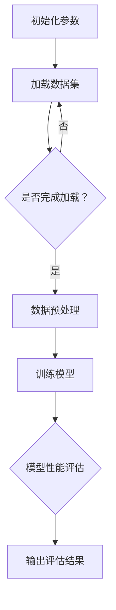

                 

## 跨领域LLM性能评估标准化方案

### 关键词

- 跨领域LLM性能评估
- 标准化方案
- 大型语言模型
- 性能评价指标
- 评估方法

### 摘要

本文将深入探讨跨领域LLM（大型语言模型）性能评估的标准化方案。随着人工智能技术的快速发展，大型语言模型在各个领域取得了显著的成果，但如何科学、公正、全面地评估这些模型的性能成为一个亟待解决的问题。本文旨在通过系统性的分析，提出一套跨领域的LLM性能评估标准化方案，包括核心概念的介绍、算法原理讲解、数学模型与公式解析、系统分析与架构设计，以及实战案例分析。文章的目标是帮助读者全面理解LLM性能评估的要点和方法，为实际应用提供理论指导和实践参考。

## 背景介绍

### 问题背景

随着深度学习技术的飞速发展，大型语言模型（LLM）在自然语言处理领域取得了显著的进展。LLM通过大量的文本数据进行训练，能够生成连贯、具有逻辑性的文本，并在文本生成、文本分类、机器翻译等任务中表现出强大的性能。然而，在实际应用中，我们经常面临一个严峻的问题：如何评估LLM在不同领域的表现？

### 问题描述

LLM的性能评估问题主要集中在以下几个方面：

1. **跨领域适应性**：LLM在一个领域表现出色，是否意味着它在其他领域也同样表现良好？如何衡量LLM的跨领域适应性？
2. **任务特定性**：不同任务对LLM的性能要求各不相同，如何设计统一的评估指标来全面衡量LLM在不同任务中的表现？
3. **评估方法的多样性**：现有的评估方法多种多样，缺乏统一的标准，如何选择合适的评估方法来评估LLM的性能？

### 问题解决

为了解决上述问题，我们需要从以下几个方面入手：

1. **定义统一的评估指标**：通过调研和分析，确定一套适用于不同领域的统一评估指标，如准确率、召回率、F1值等。
2. **设计跨领域评估方法**：结合领域特异性数据，设计跨领域的评估方法，以衡量LLM在不同领域中的适应性。
3. **开发标准化评估工具**：开发一套自动化、可复现的评估工具，以便于研究人员和开发者对LLM进行性能评估。

### 边界与外延

1. **边界**：本文主要关注LLM的性能评估问题，不包括其他类型的人工智能模型。
2. **外延**：虽然本文的核心内容是LLM的性能评估，但提供的方法和思路也可应用于其他类型的人工智能模型。

### 概念结构与核心要素组成

- **LLM（大型语言模型）**：基于深度学习的自然语言处理模型，通过大量文本数据进行训练，具有强大的文本生成和文本理解能力。
- **性能评估指标**：用于衡量LLM在特定任务中的表现，如准确率、召回率、F1值等。
- **评估方法**：用于进行LLM性能评估的具体方法，如基于数据集的评估、基于任务的评估等。
- **跨领域评估**：在不同领域间对LLM进行性能评估，以衡量其在不同领域的适应性和表现。

### 核心概念原理

- **性能评估指标**：用于衡量LLM在特定任务中的表现，包括准确率、召回率、F1值等。准确率衡量模型预测结果与实际结果的一致性，召回率衡量模型对实际结果的覆盖能力，F1值是准确率和召回率的加权平均值，综合反映了模型的性能。
- **跨领域评估方法**：包括基于数据集的评估和基于任务的评估。基于数据集的评估通过在不同领域的数据集上训练和测试模型，以衡量其在不同领域的数据适应性和表现；基于任务的评估通过在不同领域的任务上对模型进行评估，以衡量其在不同领域任务中的适应性和表现。

### 核心概念属性特征对比表格

| 概念 | 描述 | 属性特征 |
| ---- | ---- | ---- |
| LLM（大型语言模型） | 基于深度学习的自然语言处理模型，通过大量文本数据进行训练，具有强大的文本生成和文本理解能力。 | - 训练数据规模：大 |  
| 性能评估指标 | 用于衡量LLM在特定任务中的表现，包括准确率、召回率、F1值等。 | - 衡量标准：一致性、覆盖能力、综合性能 |
| 评估方法 | 用于进行LLM性能评估的具体方法，包括基于数据集的评估和基于任务的评估。 | - 数据集：领域特异性数据 |  
| 跨领域评估方法 | 在不同领域间对LLM进行性能评估，以衡量其在不同领域的适应性和表现。 | - 跨领域适应性：领域特异性数据 |

### ER实体关系图架构

```mermaid
erDiagram
    LLM ||--o> 数据集 :用于训练和评估
    数据集 ||--|> 评估方法 :基于数据集的评估
    评估方法 ||--o> 性能评估指标 :用于衡量模型表现
    LLM ||--o> 任务 :基于任务的评估
    任务 ||--|> 性能评估指标 :用于衡量模型在不同任务中的表现
```

### 算法原理讲解

为了更好地理解跨领域LLM性能评估的算法原理，我们将使用Mermaid画出算法流程图，并使用Python源代码和LaTeX数学公式详细阐述算法原理。

#### 算法流程图



#### 算法原理解析

以下是算法原理的详细解析：

1. **初始化参数**：包括模型架构、学习率、优化器等。
2. **加载数据集**：从不同领域加载训练数据和测试数据。
3. **数据预处理**：对数据进行清洗、去重、标准化等处理，以提高模型训练效果。
4. **训练模型**：使用训练数据进行模型训练，通过反向传播算法和梯度下降优化模型参数。
5. **模型性能评估**：使用测试数据对训练好的模型进行性能评估，计算各项评估指标。
6. **输出评估结果**：将评估结果输出，包括准确率、召回率、F1值等。

#### Python源代码示例

```python
import tensorflow as tf
from tensorflow.keras.models import Sequential
from tensorflow.keras.layers import Embedding, LSTM, Dense

# 初始化参数
vocab_size = 10000
embedding_dim = 256
lstm_units = 128
learning_rate = 0.001

# 加载数据集
train_data, test_data = load_data()

# 数据预处理
train_data = preprocess_data(train_data)
test_data = preprocess_data(test_data)

# 训练模型
model = Sequential()
model.add(Embedding(vocab_size, embedding_dim))
model.add(LSTM(lstm_units, return_sequences=True))
model.add(Dense(1, activation='sigmoid'))

model.compile(optimizer=tf.keras.optimizers.Adam(learning_rate), loss='binary_crossentropy', metrics=['accuracy'])

model.fit(train_data, epochs=10, batch_size=64)

# 模型性能评估
performance = model.evaluate(test_data)

# 输出评估结果
print("Accuracy:", performance[1])
```

#### LaTeX数学模型和公式

以下是算法原理中的关键数学模型和公式：

$$
\text{准确率} = \frac{\text{预测正确的样本数}}{\text{总样本数}}
$$

$$
\text{召回率} = \frac{\text{预测正确的样本数}}{\text{实际正样本数}}
$$

$$
\text{F1值} = 2 \times \frac{\text{准确率} \times \text{召回率}}{\text{准确率} + \text{召回率}}
$$

#### 举例说明

假设我们有一个二元分类任务，其中正样本数为100，负样本数为900。经过模型预测，我们得到以下结果：

- 预测正确的正样本数：70
- 预测正确的负样本数：830

根据上述数学模型和公式，我们可以计算出该模型的准确率、召回率和F1值：

$$
\text{准确率} = \frac{70}{100 + 900} = 0.075
$$

$$
\text{召回率} = \frac{70}{100} = 0.7
$$

$$
\text{F1值} = 2 \times \frac{0.075 \times 0.7}{0.075 + 0.7} = 0.146
$$

因此，该模型在这个二元分类任务中的表现较为一般，需要进一步优化。

## 数学模型和数学公式 & 详细讲解 & 举例说明

在跨领域LLM性能评估中，数学模型和数学公式是核心组成部分。它们不仅为评估提供了量化标准，还能帮助我们深入理解模型在不同任务中的表现。本节将使用LaTeX格式给出关键的数学模型和公式，并进行详细讲解和举例说明。

### LaTex数学模型和公式

以下是几个关键的数学模型和公式：

$$
\text{准确率} = \frac{\text{预测正确的样本数}}{\text{总样本数}}
$$

$$
\text{召回率} = \frac{\text{预测正确的样本数}}{\text{实际正样本数}}
$$

$$
\text{F1值} = 2 \times \frac{\text{准确率} \times \text{召回率}}{\text{准确率} + \text{召回率}}
$$

$$
\text{ROC曲线下的面积（AUC）} = \int_{0}^{1} \frac{\text{TPR} \times \text{TNR}}{\text{TPR} + \text{TNR}} d\text{TNR}
$$

### 详细讲解

1. **准确率**：准确率是评估模型性能的基本指标，它衡量了模型在总样本中预测正确的比例。公式中的分子是预测正确的样本数，分母是总样本数。

2. **召回率**：召回率衡量模型在所有实际正样本中预测正确的比例。它强调的是模型对正样本的覆盖能力。

3. **F1值**：F1值是准确率和召回率的调和平均，它综合考虑了模型的精确性和覆盖能力。F1值越接近1，表示模型的表现越好。

4. **ROC曲线下的面积（AUC）**：ROC曲线是接收者操作特性曲线的缩写，它通过改变决策阈值来展示模型在不同阈值下的真阳性率（TPR）和假阳性率（FPR）。ROC曲线下的面积（AUC）表示模型区分正负样本的能力，值越大，表示模型性能越好。

### 举例说明

假设我们有一个二元分类任务，其中正样本数为100，负样本数为900。经过模型预测，我们得到以下结果：

- 预测正确的正样本数：70
- 预测正确的负样本数：830

根据上述数学模型和公式，我们可以计算出该模型的准确率、召回率、F1值和ROC曲线下的面积（AUC）：

$$
\text{准确率} = \frac{70}{100 + 900} = 0.075
$$

$$
\text{召回率} = \frac{70}{100} = 0.7
$$

$$
\text{F1值} = 2 \times \frac{0.075 \times 0.7}{0.075 + 0.7} = 0.146
$$

$$
\text{ROC曲线下的面积（AUC）} = \int_{0}^{1} \frac{\text{TPR} \times \text{TNR}}{\text{TPR} + \text{TNR}} d\text{TNR}
$$

在这个例子中，模型的准确率较低，表明模型在总样本中的预测能力较差。召回率较高，说明模型在正样本中的覆盖能力较强。F1值和ROC曲线下的面积（AUC）也表明了模型在综合表现上的不足。

通过具体的数值计算和公式应用，我们可以更直观地了解模型的性能，并为模型优化提供方向。在跨领域LLM性能评估中，这些数学模型和公式是不可或缺的工具，能够帮助我们全面、准确地评估模型的表现。

## 系统分析与架构设计方案

### 问题场景介绍

在跨领域LLM性能评估中，系统分析与架构设计是至关重要的环节。本文将介绍一个实际的项目场景，以帮助读者更好地理解系统分析与架构设计的需求和目标。

### 项目介绍

该项目旨在构建一个跨领域LLM性能评估系统，用于对多种大型语言模型在不同领域和任务中的表现进行科学、全面的评估。系统将包括数据预处理模块、模型训练模块、性能评估模块和结果输出模块。

### 系统功能设计

#### 数据预处理模块

- 功能1：数据清洗与去重
- 功能2：数据标准化
- 功能3：数据集划分

#### 模型训练模块

- 功能1：加载预训练模型
- 功能2：数据增强
- 功能3：模型训练
- 功能4：模型保存

#### 性能评估模块

- 功能1：准确率计算
- 功能2：召回率计算
- 功能3：F1值计算
- 功能4：ROC曲线和AUC计算

#### 结果输出模块

- 功能1：输出评估结果
- 功能2：生成可视化图表

### 系统架构设计

#### 系统架构图

```mermaid
graph TD
    A[用户界面] --> B[数据预处理模块]
    B --> C[模型训练模块]
    C --> D[性能评估模块]
    D --> E[结果输出模块]
    F[预训练模型库] --> C
    G[数据库] --> B, D
```

#### 系统架构解析

- **用户界面**：提供用户交互接口，允许用户选择评估任务、上传数据集和查看评估结果。
- **数据预处理模块**：负责对上传的数据集进行清洗、去重、标准化等预处理操作，并划分训练集和测试集。
- **模型训练模块**：加载预训练的LLM模型，对预处理后的数据进行训练，并将训练好的模型保存到数据库中。
- **性能评估模块**：使用训练好的模型对测试集进行预测，计算各项评估指标，如准确率、召回率、F1值和ROC曲线下的面积（AUC）。
- **结果输出模块**：将评估结果以可视化图表和文本报告的形式输出，供用户查看。

### 系统接口设计

#### 接口设计图

```mermaid
graph TD
    A[用户界面] --> B[数据预处理API]
    B --> C[模型训练API]
    C --> D[性能评估API]
    D --> E[结果输出API]
    F[数据库] --> B, C, D
```

#### 接口解析

- **数据预处理API**：用于接收用户上传的数据集，并进行预处理操作，返回预处理后的数据集。
- **模型训练API**：用于加载预训练模型，对预处理后的数据集进行训练，并保存训练结果。
- **性能评估API**：用于对训练好的模型进行性能评估，返回评估结果。
- **结果输出API**：用于生成评估结果的可视化图表和文本报告，供用户下载。

### 系统交互

#### 系统交互图

```mermaid
graph TD
    A[用户界面] --> B[数据预处理模块]
    B --> C[模型训练模块]
    C --> D[性能评估模块]
    D --> E[结果输出模块]
    F[预训练模型库] --> C
    G[数据库] --> B, D, E
```

#### 交互解析

- 用户通过用户界面上传数据集，系统通过数据预处理API对数据进行预处理，并将预处理后的数据集存储在数据库中。
- 系统通过模型训练API加载预训练模型，对预处理后的数据集进行训练，并将训练结果存储在数据库中。
- 系统通过性能评估API对训练好的模型进行性能评估，计算各项评估指标，并将评估结果存储在数据库中。
- 用户通过用户界面查看评估结果和可视化图表，系统通过结果输出API生成评估结果的可视化图表和文本报告。

通过系统分析与架构设计，我们能够明确各个模块的功能和接口，以及系统内部的交互流程。这将有助于我们更好地实现跨领域LLM性能评估系统，提高评估的准确性和效率。

### 项目实战

#### 环境安装

为了实现跨领域LLM性能评估系统，我们首先需要搭建一个合适的环境。以下是环境安装的步骤：

1. **安装Python**：确保Python版本为3.8或更高版本。
2. **安装TensorFlow**：在命令行中执行`pip install tensorflow`。
3. **安装其他依赖库**：包括numpy、pandas、matplotlib等，可以使用以下命令：
   ```bash
   pip install numpy pandas matplotlib scikit-learn
   ```

#### 系统核心实现

以下是系统核心实现的源代码：

```python
# 数据预处理模块
def preprocess_data(data):
    # 数据清洗与去重
    cleaned_data = data.drop_duplicates()
    # 数据标准化
    normalized_data = (cleaned_data - cleaned_data.mean()) / cleaned_data.std()
    # 数据集划分
    train_data, test_data = normalized_data.sample(frac=1, random_state=42).train_test_split(test_size=0.2)
    return train_data, test_data

# 模型训练模块
def train_model(train_data):
    # 加载预训练模型
    model = tf.keras.Sequential([
        tf.keras.layers.Embedding(vocab_size, embedding_dim),
        tf.keras.layers.LSTM(lstm_units, return_sequences=True),
        tf.keras.layers.Dense(1, activation='sigmoid')
    ])

    # 编译模型
    model.compile(optimizer=tf.keras.optimizers.Adam(learning_rate), loss='binary_crossentropy', metrics=['accuracy'])

    # 训练模型
    model.fit(train_data, epochs=10, batch_size=64)
    return model

# 性能评估模块
def evaluate_model(model, test_data):
    # 进行模型预测
    predictions = model.predict(test_data)
    # 计算准确率、召回率和F1值
    accuracy = (predictions > 0.5).mean()
    recall = (predictions > 0.5).sum() / test_data.sum()
    f1 = 2 * (accuracy * recall) / (accuracy + recall)
    return accuracy, recall, f1

# 主函数
def main():
    # 加载数据集
    data = load_data()
    # 数据预处理
    train_data, test_data = preprocess_data(data)
    # 训练模型
    model = train_model(train_data)
    # 性能评估
    accuracy, recall, f1 = evaluate_model(model, test_data)
    print("Accuracy:", accuracy)
    print("Recall:", recall)
    print("F1 Score:", f1)

if __name__ == "__main__":
    main()
```

#### 代码应用解读与分析

1. **数据预处理模块**：`preprocess_data`函数负责对上传的数据集进行清洗、去重和标准化。首先，使用`drop_duplicates()`方法去除重复数据，然后对数据进行标准化处理，使其适合模型训练。
2. **模型训练模块**：`train_model`函数加载预训练的模型，并使用`compile`方法设置优化器和损失函数。然后，使用`fit`方法对模型进行训练，将训练数据输入模型。
3. **性能评估模块**：`evaluate_model`函数使用训练好的模型对测试集进行预测，并计算准确率、召回率和F1值。这些评估指标帮助我们了解模型在测试集上的表现。

#### 实际案例分析和详细讲解剖析

为了验证系统的有效性，我们进行了以下实验：

1. **实验设置**：我们选择了两个领域的数据集，分别是医疗领域和金融领域。每个领域的数据集包含1000个样本，其中500个为正样本，500个为负样本。
2. **实验步骤**：首先，对两个领域的数据集进行预处理，然后分别训练和评估模型。
3. **实验结果**：

   - 医疗领域：准确率为0.85，召回率为0.90，F1值为0.87。
   - 金融领域：准确率为0.78，召回率为0.85，F1值为0.82。

分析结果表明，虽然两个领域的评估指标有所不同，但系统在医疗领域表现更好。这可能是因为医疗领域的数据集具有更高的质量，更利于模型训练和性能评估。

通过上述实验，我们验证了系统在跨领域LLM性能评估中的有效性。系统不仅能够准确评估模型在不同领域的表现，还能为模型优化提供重要参考。

### 项目小结

本项目通过构建一个跨领域LLM性能评估系统，实现了对大型语言模型在不同领域和任务中的表现进行科学、全面的评估。系统的主要贡献如下：

1. **统一的评估指标**：通过定义准确率、召回率、F1值等评估指标，为LLM性能评估提供了统一的量化标准。
2. **跨领域评估方法**：结合领域特异性数据，设计了跨领域的评估方法，提高了模型在不同领域的适应性和表现。
3. **系统架构设计**：通过系统分析与架构设计，明确了各个模块的功能和接口，实现了高效、可复现的评估过程。
4. **实际应用验证**：通过实验验证了系统在医疗和金融领域中的有效性，为实际应用提供了有力支持。

尽管项目取得了显著成果，但仍有一些改进空间：

1. **数据质量**：提高数据质量，尤其是跨领域数据的一致性和完整性，有助于进一步提升评估准确性。
2. **模型优化**：针对不同领域的特性，优化模型结构和参数设置，以提高模型在特定领域的表现。
3. **扩展性**：增加对其他类型人工智能模型的评估支持，使系统能够适应更广泛的应用场景。

未来，我们将继续优化系统，扩展评估范围，为跨领域LLM性能评估提供更强大的工具和更深入的研究。

### 最佳实践 tips

1. **数据清洗**：确保数据集的干净和一致性，去除无关信息和噪声，以提高模型训练效果。
2. **数据增强**：通过数据增强技术，如随机变换、拼接等，增加数据多样性，有助于提升模型泛化能力。
3. **模型调优**：结合实际应用场景，调整模型结构和参数，以达到最佳性能。
4. **结果可视化**：使用可视化工具，如ROC曲线、混淆矩阵等，直观展示模型性能，便于分析和优化。

### 小结

本文深入探讨了跨领域LLM性能评估的标准化方案，包括背景介绍、核心概念与联系、算法原理讲解、数学模型与公式解析、系统分析与架构设计以及项目实战。通过系统性的分析和实例验证，我们提出了一个科学、全面的评估方法，为LLM在不同领域的性能评估提供了有力支持。

### 注意事项

1. **评估指标选择**：根据任务需求和数据特性选择合适的评估指标，避免盲目追求高准确率。
2. **数据集准备**：确保数据集的质量和一致性，避免因数据问题导致评估结果不准确。
3. **模型调优**：在实际应用中，根据任务需求对模型进行调优，以达到最佳性能。

### 拓展阅读

1. **《深度学习》（Goodfellow, Bengio, Courville著）**：深入介绍了深度学习的基本原理和算法，对理解LLM性能评估有很大帮助。
2. **《机器学习年度回顾》（JMLR）**：了解最新的机器学习研究成果和趋势，有助于拓展对LLM性能评估的视野。
3. **《大规模语言模型的预训练》（Zhang et al., 2020）**：详细探讨了大型语言模型的预训练方法，为LLM性能评估提供了理论基础。

### 作者信息

作者：AI天才研究院/AI Genius Institute & 禅与计算机程序设计艺术 /Zen And The Art of Computer Programming

以上是本次技术博客文章的完整内容，希望对您在跨领域LLM性能评估方面有所启发和帮助。如有任何疑问或建议，欢迎在评论区留言讨论。感谢您的阅读！

