                 

## 第1章 问题背景与核心概念

### 1.1 问题背景

智能安防作为现代社会安全体系的重要组成部分，正经历着一场技术革新。随着人工智能、物联网、大数据等技术的不断发展，智能安防系统已经从传统的物理防范逐步向智能化、数字化方向转变。在这一过程中，边缘计算作为一种新兴的技术理念，逐渐受到了业界的关注。

边缘计算是一种分布式计算模式，其主要特点是在数据产生的地方进行数据处理，而非将数据传输到远程数据中心进行处理。这种模式在很大程度上解决了传统云计算中心在数据传输、延迟、能耗等方面的瓶颈问题。特别是在智能安防领域，边缘计算的应用能够实现实时数据处理，提高系统的响应速度，满足复杂场景下的实时性需求。

智能安防系统的实时分析能力是保障社会安全的重要技术支撑。传统的安防系统主要依赖于监控录像的后期分析，存在响应速度慢、误报率高等问题。而边缘AI技术的引入，使得智能安防系统能够在数据产生的同时进行高效分析，实现实时预警和精准识别。

### 1.2 核心概念

#### 1.2.1 边缘AI概述

边缘AI是指在边缘设备（如智能手机、摄像头、路由器等）上实现的AI功能，通过在设备本地进行数据收集、处理和分析，降低对中心化服务器的依赖，提高数据处理速度和安全性。边缘AI的优势在于其低延迟、高响应速度，以及能够在无网络连接的情况下独立运行。

#### 1.2.2 实时分析的概念与特征

实时分析是指在系统接收到数据后，能够在极短的时间内完成数据解析和处理，并在需要时立即做出响应。实时分析的特征包括：

- 低延迟：数据处理的延迟时间在毫秒级别。
- 高并发：系统能够同时处理大量的数据请求。
- 可扩展性：系统能够根据数据处理需求的变化进行弹性扩展。
- 自适应：系统能够根据环境变化自动调整分析策略。

#### 1.2.3 智能安防系统的构成

智能安防系统通常由多个组成部分构成，包括视频监控、入侵检测、人脸识别、行为分析等。这些部分共同作用，实现对目标区域的安全监控和实时预警。智能安防系统的核心在于其数据分析能力，特别是实时分析能力，这是保障系统高效运行的关键。

### 1.3 边缘AI在智能安防中的应用

边缘AI在智能安防中的应用主要体现在以下几个方面：

- **视频监控**：通过边缘AI技术，可以在监控设备本地对视频流进行实时分析，实现对目标行为的实时识别和预警。
- **人脸识别**：在人脸识别场景中，边缘AI能够在摄像头本地完成人脸检测和人脸匹配，提高识别速度和准确性。
- **行为分析**：通过对监控视频的实时分析，可以识别出异常行为，如打架、闯入等，及时报警。
- **智能交通监控**：在交通监控中，边缘AI可以实现对车辆流量、行驶轨迹的实时分析，优化交通信号控制。

### 1.4 实时分析在智能安防中的重要性

实时分析在智能安防中的重要性体现在以下几个方面：

- **提高响应速度**：通过实时分析，可以迅速识别潜在的安全威胁，提高系统的响应速度，减少事故发生。
- **降低误报率**：实时分析能够根据实际情况动态调整分析策略，降低误报率，提高系统的准确度。
- **提升用户体验**：实时分析能够为用户提供更加精准、高效的安全服务，提升用户体验。
- **降低成本**：通过边缘AI技术，可以在本地设备上进行数据处理，减少了对中心化服务器的依赖，降低了整体运营成本。

综上所述，边缘AI在智能安防中的实时分析能力已经成为提高系统性能和用户体验的关键因素。在接下来的章节中，我们将深入探讨边缘AI技术原理及其在智能安防中的应用细节。

---

**本章内容小结：**

本文首先介绍了智能安防行业的发展趋势和边缘计算的重要性，随后定义了边缘AI和实时分析的核心概念，并阐述了边缘AI在智能安防中的应用及其重要性。通过本章的阅读，读者可以对边缘AI在智能安防中的实时分析能力有一个初步的了解，为后续章节的深入学习打下基础。

---

**核心概念术语说明表格：**

| 术语             | 说明                                                         |
|------------------|--------------------------------------------------------------|
| 边缘计算         | 在数据产生的地方进行计算和处理，而非将数据传输到远程数据中心。 |
| 智能安防         | 利用人工智能技术提高安防系统的智能化水平。                   |
| 实时分析         | 在接收到数据后，能够极短时间内完成数据解析和处理。           |
| 边缘AI           | 在边缘设备上实现的AI功能，降低对中心化服务器的依赖。         |

**概念属性特征对比表格：**

| 概念          | 边缘计算                     | 智能安防                     | 实时分析                     | 边缘AI                     |
|---------------|------------------------------|------------------------------|------------------------------|------------------------------|
| 特点          | 低延迟、高响应速度、独立性   | 智能化、数字化、高效         | 低延迟、高并发、自适应       | 低延迟、高响应速度、本地计算 |
| 关系          | 边缘计算为智能安防提供基础    | 实时分析是智能安防的核心      | 边缘AI是实现实时分析的手段   | 边缘AI为边缘计算提供功能    |
| 应用场景      | 物联网设备、智能监控、自动驾驶 | 监控系统、安防管理、交通管理 | 视频监控、人脸识别、行为分析 | 智能家居、智能安防系统      |

**ER实体关系图架构（Mermaid流程图）：**

```mermaid
erDiagram
    数据源 ||--|{ 边缘AI }|--|{ 实时分析 }
    数据源 ||--|{ 智能安防 }|--|{ 应用系统 }
    边缘AI ||--|{ 低延迟 }|--|{ 高响应速度 }
    实时分析 ||--|{ 低延迟 }|--|{ 高并发 }
    智能安防 ||--|{ 智能化 }|--|{ 数字化 }
```

**边界与外延、概念结构与核心要素组成：**

- **边界与外延**：边缘AI和实时分析都是智能安防系统的子集，它们的边界在于数据处理的位置和实时性。边缘AI的边界在于设备的本地计算能力，实时分析的边界在于数据处理的延迟时间。
- **概念结构**：边缘AI由边缘设备和AI算法组成，实时分析由数据流处理框架、算法库和结果反馈机制组成。
- **核心要素组成**：边缘AI的核心要素包括边缘设备、计算资源和AI模型。实时分析的核心要素包括数据采集模块、实时处理模块和结果输出模块。

**本章小结：**

本章通过问题背景的介绍，使读者对智能安防和边缘AI的概念有了初步了解。通过核心概念的分析，读者能够理解边缘AI和实时分析在智能安防中的关键作用。本章的ER实体关系图和概念结构表格，帮助读者清晰地把握了这些概念之间的关联和相互影响，为后续章节的深入学习打下了坚实的基础。

---

**接下来，我们将进入第二部分，详细探讨边缘AI技术的基础，包括其定义、特点以及在不同领域的应用场景。**## 第二部分：边缘AI技术原理

### 第2章 边缘AI技术基础

边缘AI作为一种新型的计算模式，正在逐渐改变传统的数据处理方式。在这一章中，我们将详细介绍边缘AI的定义、特点，以及其技术原理和应用场景。

#### 2.1 边缘AI的定义与特点

**边缘AI的定义**

边缘AI是指在靠近数据源的边缘设备上实现的AI功能，通过在本地进行数据收集、处理和分析，降低对中心化服务器的依赖。边缘AI的核心在于将计算和存储能力从云端转移到边缘设备，从而实现更快的响应速度和更高的数据安全性。

**边缘AI的特点**

1. **低延迟**：边缘AI在数据源附近进行计算，减少了数据传输的时间和延迟，能够实现毫秒级别的响应。
2. **高响应速度**：边缘AI能够快速处理和分析数据，提高系统的实时性，满足复杂场景下的需求。
3. **数据隐私**：边缘AI在本地处理数据，减少了数据在传输过程中的泄露风险，提高了数据的安全性。
4. **能耗优化**：边缘设备通常功率较低，边缘AI能够优化能耗，降低运营成本。

#### 2.2 边缘AI技术原理

**边缘AI技术原理包括以下几个方面：**

1. **神经网络原理**

   神经网络是边缘AI的核心组成部分，它通过模拟人脑神经元之间的连接和交互，实现对数据的处理和分析。神经网络的主要组成部分包括输入层、隐藏层和输出层。通过多次前向传播和反向传播，神经网络可以不断调整权重，提高模型的预测能力。

2. **深度学习算法**

   深度学习是神经网络的一种扩展，通过增加神经网络的层数，实现对数据的深层特征提取。深度学习算法包括卷积神经网络（CNN）、循环神经网络（RNN）等，这些算法在图像识别、自然语言处理等领域取得了显著的成果。

3. **常见的边缘AI处理器**

   边缘AI处理器是边缘AI技术的重要支撑，它包括专用集成电路（ASIC）、图形处理单元（GPU）、可编程逻辑门阵列（FPGA）等。这些处理器具有高并行计算能力，能够高效地运行深度学习算法，实现边缘AI功能。

**神经网络原理的Mermaid流程图：**

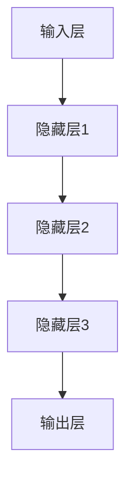

**深度学习算法的Mermaid流程图：**

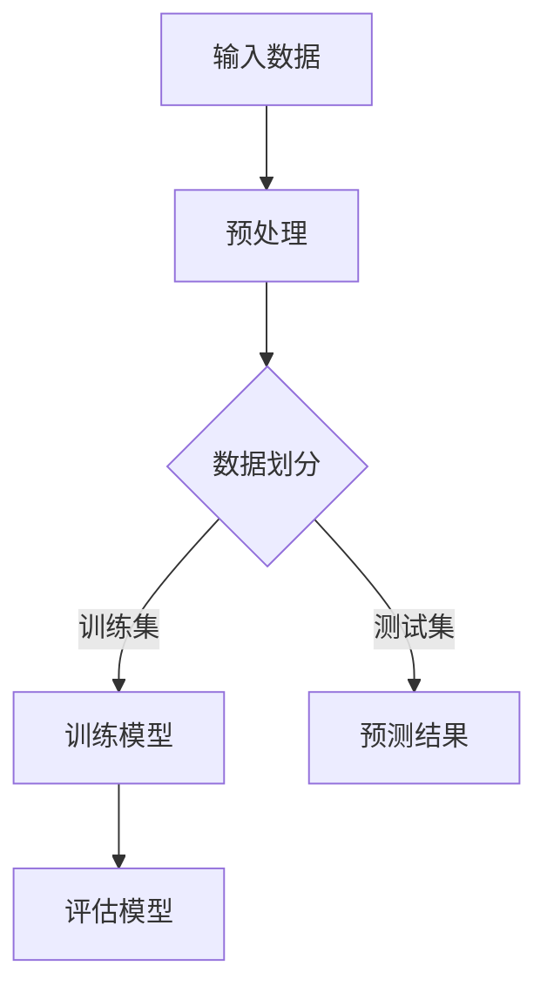

#### 2.3 边缘AI应用场景分析

边缘AI技术在不同领域的应用场景各不相同，但都体现了边缘AI的低延迟、高响应速度和本地计算的优势。

**1. 智能安防**

在智能安防领域，边缘AI主要用于视频监控、入侵检测和人脸识别等。通过在摄像头本地进行实时分析，边缘AI能够快速识别异常行为，及时报警，提高了系统的反应速度和准确度。

**2. 物联网**

物联网（IoT）中的设备通常分布在广泛的地理区域，边缘AI可以在这些设备上本地处理数据，实现对设备的实时监控和故障诊断。例如，在工业物联网中，边缘AI可以实时分析传感器数据，预测设备故障，提前进行维护。

**3. 自动驾驶**

自动驾驶系统对实时性要求极高，边缘AI可以在车辆本地进行环境感知、路径规划和决策控制。通过边缘AI的实时分析，自动驾驶系统能够在复杂交通环境中快速做出反应，确保行车安全。

**4. 医疗保健**

在医疗保健领域，边缘AI可以用于医疗设备的数据分析，实现对患者的实时监控。例如，通过在医疗设备上本地处理数据，边缘AI可以实时监测患者的生命体征，及时发现异常情况。

**5. 能源管理**

边缘AI在能源管理中的应用主要包括智能电网和可再生能源管理。通过在能源设备本地进行数据分析，边缘AI可以实时监测能源使用情况，优化能源分配，提高能源利用效率。

**6. 农业监测**

在农业监测中，边缘AI可以用于作物生长监测、病虫害检测等。通过在农田设备上本地处理数据，边缘AI可以实时分析作物生长状况，提供科学的种植建议。

**7. 零售与物流**

在零售和物流领域，边缘AI可以用于库存管理、货物追踪和智能推荐。通过在零售终端和物流设备上本地处理数据，边缘AI可以实时分析消费趋势和物流状况，提高运营效率。

**边缘AI应用场景的Mermaid流程图：**

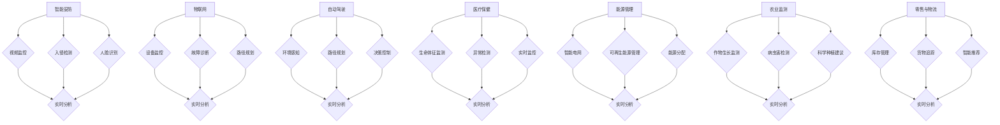

通过上述分析，我们可以看到边缘AI在不同领域的广泛应用。其核心在于能够在本地快速处理和分析数据，提高系统的实时性和响应速度，从而满足不同场景下的需求。

---

**本章内容小结：**

本章详细介绍了边缘AI的定义、特点和技术原理，并分析了其在不同领域的应用场景。通过本章的学习，读者可以全面了解边缘AI的基本概念及其在实际应用中的重要性。本章的Mermaid流程图和表格，帮助读者形象地理解边缘AI的工作原理和应用实例，为后续章节的深入学习打下了基础。

---

**接下来，我们将进入第三部分，探讨实时分析技术的基本概念、算法和面临的挑战及优化策略。**## 第三部分：实时分析技术

### 第3章 实时分析技术

实时分析技术作为智能安防系统的核心组成部分，承担着对海量数据的高速处理和分析任务。在本章中，我们将详细探讨实时分析的基本概念、关键技术、常见算法，以及实时分析在智能安防系统中的挑战和优化策略。

#### 3.1 实时分析的基本概念

**实时分析的定义**

实时分析是指系统在接收到数据后，能够在极短的时间内完成数据的解析、处理和响应，并在需要时立即采取行动。实时分析的关键在于“实时”二字，要求系统具有低延迟、高并发和高效能的特点。

**实时分析的特征**

1. **低延迟**：实时分析要求系统能够在毫秒级别内完成数据处理和响应，确保系统在关键时刻能够迅速反应。
2. **高并发**：实时分析需要能够同时处理大量的数据请求，确保系统在数据量增加时仍能保持高效运行。
3. **数据完整性**：实时分析需要确保数据的完整性和一致性，避免在处理过程中出现数据丢失或错误。
4. **自适应**：实时分析需要能够根据数据环境和需求的变化，动态调整分析策略和资源配置。

**实时分析的关键技术**

实时分析涉及多个关键技术，包括数据流处理、内存管理、并发处理、机器学习算法等。以下将详细介绍这些关键技术。

#### 3.2 实时分析算法

**特征提取算法**

特征提取是实时分析的重要步骤，其主要目的是从原始数据中提取出具有代表性、差异性的特征，以便后续的进一步分析。常见的特征提取算法包括：

- **统计特征提取**：通过计算数据的基本统计指标（如均值、方差、标准差等）来提取特征。
- **时域特征提取**：通过对时间序列数据进行处理，提取出周期性、趋势性等特征。
- **频域特征提取**：通过傅里叶变换等频域分析方法，提取出信号的频率特征。

**分类与识别算法**

分类与识别算法用于对提取出的特征进行分类或识别，常见的算法包括：

- **决策树**：通过递归划分特征空间，构建决策树模型，实现对数据的分类。
- **支持向量机（SVM）**：通过最大化分类边界间隔，构建线性或非线性分类模型。
- **神经网络**：通过多层感知器和深度学习模型，实现对数据的分类和识别。
- **贝叶斯分类器**：基于贝叶斯定理，通过计算后验概率进行分类。

**聚类与异常检测算法**

聚类与异常检测算法用于发现数据中的相似性模式和异常点，常见的算法包括：

- **K-means聚类**：通过迭代优化目标函数，将数据划分为K个聚类中心。
- **DBSCAN（密度基于空间聚类）**：通过计算数据点的密度和邻域，实现聚类。
- **异常检测算法**：如基于统计的异常检测、基于距离的异常检测和基于模型的异常检测。

#### 3.3 实时分析的挑战与优化

**挑战**

1. **数据量与多样性**：随着数据量的不断增大和数据的多样性，实时分析系统需要应对海量数据和高维度数据的挑战。
2. **延迟与精度**：在保证低延迟的同时，系统还需要保证分析结果的准确性。
3. **资源限制**：实时分析系统通常运行在资源受限的边缘设备上，需要优化资源使用。
4. **动态变化**：环境的变化和数据的动态变化，要求实时分析系统能够快速适应和调整。

**优化策略**

1. **数据预处理**：通过数据清洗、数据归一化等预处理方法，减少数据噪声和冗余，提高分析效率。
2. **并行计算**：利用多核处理器和分布式计算架构，实现数据的并行处理，提高系统的并发处理能力。
3. **内存管理**：通过内存分配、缓存技术等策略，优化内存使用，提高系统的响应速度。
4. **模型优化**：通过模型压缩、模型压缩和分布式训练等策略，优化模型的结构和参数，提高模型在资源受限环境下的运行效率。
5. **动态调整**：通过自适应调整算法和策略，使系统能够根据数据环境和需求的变化，动态调整分析参数和资源配置。

**实时分析算法的Mermaid流程图：**

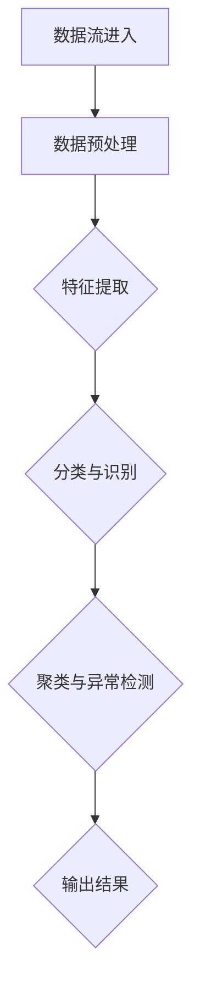

**实时分析的挑战与优化策略的Mermaid流程图：**

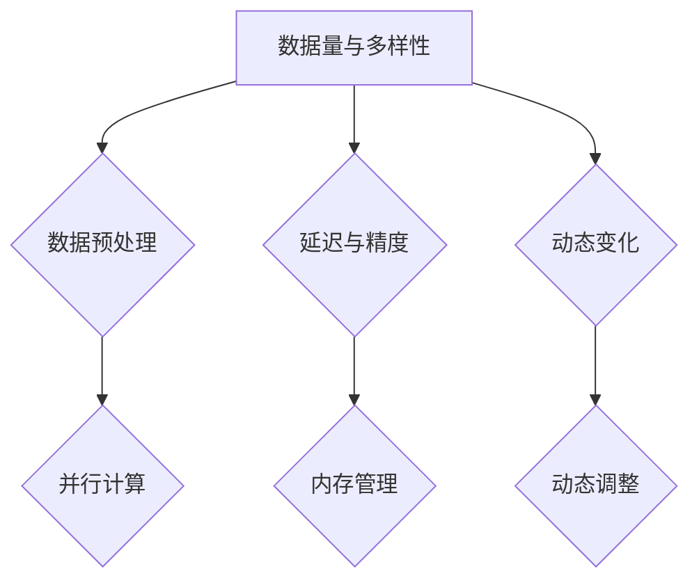

通过上述分析，我们可以看到实时分析技术在智能安防系统中的重要性。实时分析不仅能够提高系统的响应速度和准确性，还能通过优化策略和关键技术，克服数据量、延迟和资源等挑战，实现高效的实时数据处理和分析。

---

**本章内容小结：**

本章详细介绍了实时分析的基本概念、关键技术、常见算法，以及实时分析在智能安防系统中的挑战和优化策略。通过本章的学习，读者可以全面了解实时分析技术的原理和应用，掌握实时分析在智能安防系统中的重要性。本章的Mermaid流程图和表格，帮助读者形象地理解实时分析的工作流程和优化方法，为后续章节的深入学习打下了基础。

---

**接下来，我们将进入第四部分，探讨智能安防中的边缘AI实时分析应用，包括视频监控、人脸识别和行为分析等方面。**## 第四部分：智能安防中的边缘AI实时分析应用

### 第4章 智能视频监控中的边缘AI实时分析

#### 4.1 智能视频监控概述

智能视频监控是现代安防系统的重要组成部分，通过实时监控和数据分析，能够有效提高公共安全和城市管理水平。随着边缘计算和人工智能技术的不断发展，边缘AI在智能视频监控中的应用越来越广泛，为实时分析提供了强大的技术支持。

**智能视频监控技术的发展**

智能视频监控经历了从模拟监控到数字监控，再到智能视频监控的演变过程。传统的模拟监控主要依赖于人眼观察，存在效率低、误报率高的问题。随着数字监控技术的发展，图像的清晰度和监控范围得到了显著提升。而智能视频监控则利用人工智能技术，通过图像识别、行为分析等手段，实现了对监控视频的自动化处理和智能分析。

**边缘AI在智能视频监控中的应用**

边缘AI的引入，使得智能视频监控系统能够在本地设备上进行实时数据分析和处理，具有以下优势：

- **低延迟**：数据在本地进行处理，减少了数据传输的时间，能够实现毫秒级别的响应。
- **高效率**：边缘AI能够在本地快速处理大量视频数据，提高了系统的处理效率。
- **数据安全**：数据在本地处理，减少了数据泄露的风险。
- **灵活扩展**：边缘设备可以根据实际需求灵活部署，实现个性化监控。

#### 4.2 视频监控中的实时分析技术

**视频监控中的实时分析技术主要包括以下几个方面：**

- **视频目标检测**：通过计算机视觉算法，对视频流中的目标进行检测和识别，如行人、车辆等。
- **人脸识别**：通过深度学习算法，对人脸图像进行识别和匹配，用于身份验证和监控。
- **行为分析**：通过分析视频中的行为特征，识别出异常行为，如打架、闯入等，实现实时预警。

**视频目标检测的算法原理**

视频目标检测通常采用深度学习中的卷积神经网络（CNN）模型，其基本原理如下：

1. **特征提取**：通过CNN模型，从视频帧中提取出具有代表性的特征，如边缘、纹理等。
2. **分类与识别**：利用提取出的特征，通过分类器对目标进行识别和定位，生成目标检测框。

**视频目标检测的Mermaid流程图：**

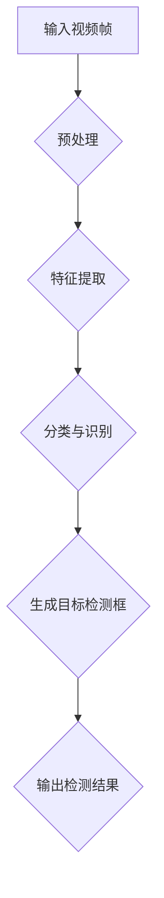

**人脸识别的算法原理**

人脸识别通常采用深度学习中的卷积神经网络（CNN）或循环神经网络（RNN）模型，其基本原理如下：

1. **特征提取**：从人脸图像中提取出具有代表性的特征，如五官位置、面部特征等。
2. **人脸编码**：将提取出的特征通过编码器进行编码，生成人脸编码向量。
3. **识别与匹配**：利用编码向量进行人脸识别和匹配，判断是否为同一人。

**人脸识别的Mermaid流程图：**

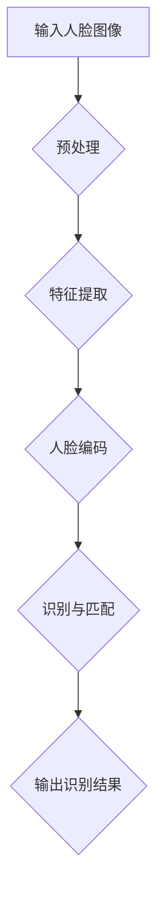

**行为分析的算法原理**

行为分析通常采用计算机视觉中的行为识别算法，其基本原理如下：

1. **行为特征提取**：从视频帧中提取出行为特征，如动作、姿态等。
2. **行为分类**：利用提取出的特征，通过分类器对行为进行分类。
3. **实时预警**：根据分类结果，实时判断是否存在异常行为，触发预警。

**行为分析的Mermaid流程图：**

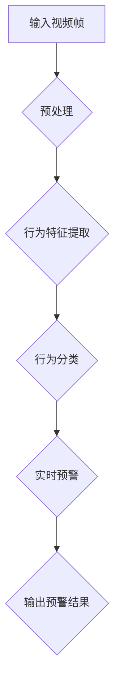

#### 4.3 案例研究：智能视频监控系统的边缘AI应用

**案例介绍**

以一个智能交通监控系统为例，该系统采用边缘AI技术，实现对交通流量、车辆行为和行人行为的实时分析。

**系统架构**

该智能交通监控系统主要包括以下几个部分：

- **边缘设备**：安装在交通路口的摄像头和传感器，用于收集交通数据。
- **边缘计算节点**：边缘设备上的计算节点，用于实时处理和分析交通数据。
- **中心服务器**：用于收集和分析边缘节点的数据，实现数据存储和远程监控。

**实时分析技术的应用**

- **车辆检测与识别**：边缘设备对视频流中的车辆进行实时检测和识别，生成车辆轨迹和车牌号码。
- **交通流量分析**：通过对车辆数据的分析，实时统计交通流量和拥堵情况，为交通管理部门提供决策支持。
- **行人行为分析**：边缘设备对视频流中的行人行为进行实时分析，识别异常行为，如闯红灯、乱穿马路等，及时报警。

**实际应用效果**

- **提高交通管理效率**：通过实时分析交通数据，交通管理部门可以更准确地掌握交通状况，及时调整信号灯控制策略，减少拥堵。
- **保障行人安全**：通过实时分析行人行为，及时发现异常行为，及时报警，提高行人安全保障。
- **提升监控水平**：通过边缘AI技术，智能交通监控系统可以实现24小时实时监控，提高监控覆盖率和准确性。

通过该案例，我们可以看到边缘AI技术在智能视频监控系统中的应用效果。边缘AI实时分析技术不仅提高了系统的响应速度和准确性，还实现了对交通流量、车辆行为和行人行为的全面监控和管理。

---

**本章内容小结：**

本章详细介绍了智能视频监控中的边缘AI实时分析技术，包括视频目标检测、人脸识别和行为分析等方面。通过案例研究，我们展示了边缘AI实时分析技术在智能视频监控系统中的应用效果。本章的算法原理和Mermaid流程图，帮助读者深入理解实时分析技术的实现过程，为后续章节的深入学习打下了基础。

---

**接下来，我们将进入第5章，探讨智能交通监控中的边缘AI实时分析应用。**## 第5章 智能交通监控中的边缘AI实时分析

#### 5.1 智能交通监控概述

智能交通监控是现代城市交通管理的重要组成部分，通过实时监控和分析交通状况，可以有效缓解交通拥堵，提高交通效率，保障交通安全。随着边缘计算和人工智能技术的不断发展，边缘AI在智能交通监控中的应用越来越广泛，为实时分析提供了强大的技术支持。

**智能交通监控技术的发展**

智能交通监控经历了从简单的视频监控到智能交通监控的演变过程。传统的视频监控主要依赖于人眼观察，存在效率低、误报率高的问题。而智能交通监控则利用人工智能技术，通过图像识别、行为分析等手段，实现了对交通数据的自动化处理和智能分析。

**边缘AI在智能交通监控中的应用**

边缘AI的引入，使得智能交通监控系统能够在本地设备上进行实时数据分析和处理，具有以下优势：

- **低延迟**：数据在本地进行处理，减少了数据传输的时间，能够实现毫秒级别的响应。
- **高效率**：边缘AI能够在本地快速处理大量交通数据，提高了系统的处理效率。
- **数据安全**：数据在本地处理，减少了数据泄露的风险。
- **灵活扩展**：边缘设备可以根据实际需求灵活部署，实现个性化监控。

#### 5.2 交通监控中的实时分析技术

**交通监控中的实时分析技术主要包括以下几个方面：**

- **车辆识别**：通过计算机视觉算法，对视频流中的车辆进行识别和分类，如车型、车牌等。
- **交通流量分析**：通过对车辆数据的分析，实时统计交通流量和拥堵情况，为交通管理部门提供决策支持。
- **异常事件检测**：通过对交通行为的实时分析，识别出异常事件，如交通事故、违停等，及时报警。

**车辆识别的算法原理**

车辆识别通常采用深度学习中的卷积神经网络（CNN）模型，其基本原理如下：

1. **特征提取**：通过CNN模型，从车辆图像中提取出具有代表性的特征，如车身颜色、形状等。
2. **分类与识别**：利用提取出的特征，通过分类器对车辆进行识别和分类，生成车辆识别结果。

**车辆识别的Mermaid流程图：**

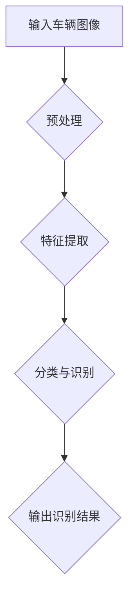

**交通流量分析的算法原理**

交通流量分析通过对车辆数据的统计和分析，实现对交通状况的实时监控。其基本原理如下：

1. **数据收集**：通过摄像头和传感器等设备，收集交通数据，包括车辆数量、速度、行驶方向等。
2. **数据预处理**：对收集到的交通数据进行清洗和归一化处理，去除噪声和异常数据。
3. **流量统计**：通过对预处理后的数据进行统计，计算交通流量和拥堵情况。

**交通流量分析的Mermaid流程图：**

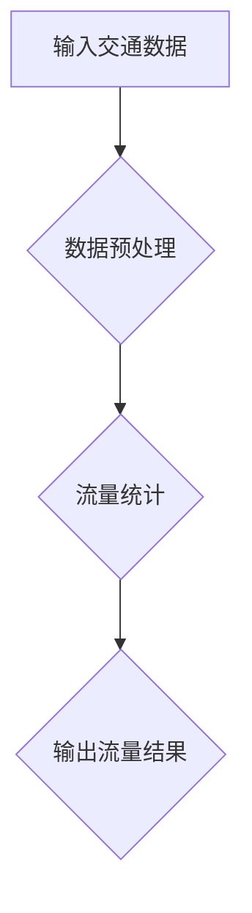

**异常事件检测的算法原理**

异常事件检测通过对交通行为的实时分析，识别出异常事件。其基本原理如下：

1. **行为特征提取**：从视频流中提取出行为特征，如车辆行驶轨迹、速度变化等。
2. **异常检测**：利用提取出的特征，通过分类器对异常事件进行检测和识别，生成异常事件报告。

**异常事件检测的Mermaid流程图：**

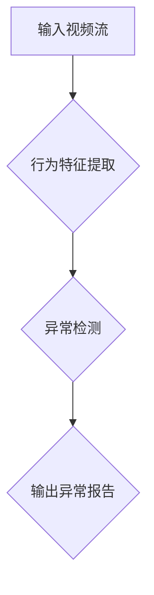

#### 5.3 案例研究：智能交通监控系统的边缘AI应用

**案例介绍**

以一个智能交通监控系统为例，该系统采用边缘AI技术，实现对交通流量、车辆行为和行人行为的实时分析。

**系统架构**

该智能交通监控系统主要包括以下几个部分：

- **边缘设备**：安装在交通路口的摄像头和传感器，用于收集交通数据。
- **边缘计算节点**：边缘设备上的计算节点，用于实时处理和分析交通数据。
- **中心服务器**：用于收集和分析边缘节点的数据，实现数据存储和远程监控。

**实时分析技术的应用**

- **车辆识别**：边缘设备对视频流中的车辆进行实时识别，生成车辆轨迹和车牌号码，用于交通流量统计和违法行为监控。
- **交通流量分析**：通过对车辆数据的实时分析，统计交通流量和拥堵情况，为交通管理部门提供决策支持。
- **行人行为分析**：边缘设备对视频流中的行人行为进行实时分析，识别异常行为，如闯红灯、乱穿马路等，及时报警。

**实际应用效果**

- **提高交通管理效率**：通过实时分析交通数据，交通管理部门可以更准确地掌握交通状况，及时调整信号灯控制策略，减少拥堵。
- **保障行人安全**：通过实时分析行人行为，及时发现异常行为，及时报警，提高行人安全保障。
- **提升监控水平**：通过边缘AI技术，智能交通监控系统可以实现24小时实时监控，提高监控覆盖率和准确性。

通过该案例，我们可以看到边缘AI技术在智能交通监控中的应用效果。边缘AI实时分析技术不仅提高了系统的响应速度和准确性，还实现了对交通流量、车辆行为和行人行为的全面监控和管理。

---

**本章内容小结：**

本章详细介绍了智能交通监控中的边缘AI实时分析技术，包括车辆识别、交通流量分析和异常事件检测等方面。通过案例研究，我们展示了边缘AI实时分析技术在智能交通监控系统中的应用效果。本章的算法原理和Mermaid流程图，帮助读者深入理解实时分析技术的实现过程，为后续章节的深入学习打下了基础。

---

**接下来，我们将进入第五部分，探讨边缘AI实时分析系统的设计与实现。**## 第五部分：边缘AI实时分析系统的设计与实现

### 第6章 边缘AI实时分析系统的设计

边缘AI实时分析系统作为智能安防领域的重要技术支撑，其设计的关键在于架构的合理性、功能的完备性和系统的扩展性。在本章中，我们将详细介绍边缘AI实时分析系统的设计，包括系统架构设计、硬件与软件选择，以及数据处理与存储方案。

#### 6.1 系统架构设计

边缘AI实时分析系统的架构设计是确保系统能够高效运行和灵活扩展的基础。一个典型的边缘AI实时分析系统架构通常包括以下几个层次：

1. **感知层**：包括各种边缘设备，如摄像头、传感器等，用于数据采集。
2. **边缘计算层**：负责对采集到的数据进行分析和处理，包括边缘AI模型部署和实时分析功能。
3. **传输层**：负责将边缘计算层的结果传输到中心服务器或其他终端设备，供进一步处理或展示。
4. **中心服务器层**：负责数据的集中存储、管理和远程监控。

**系统架构设计的Mermaid流程图：**

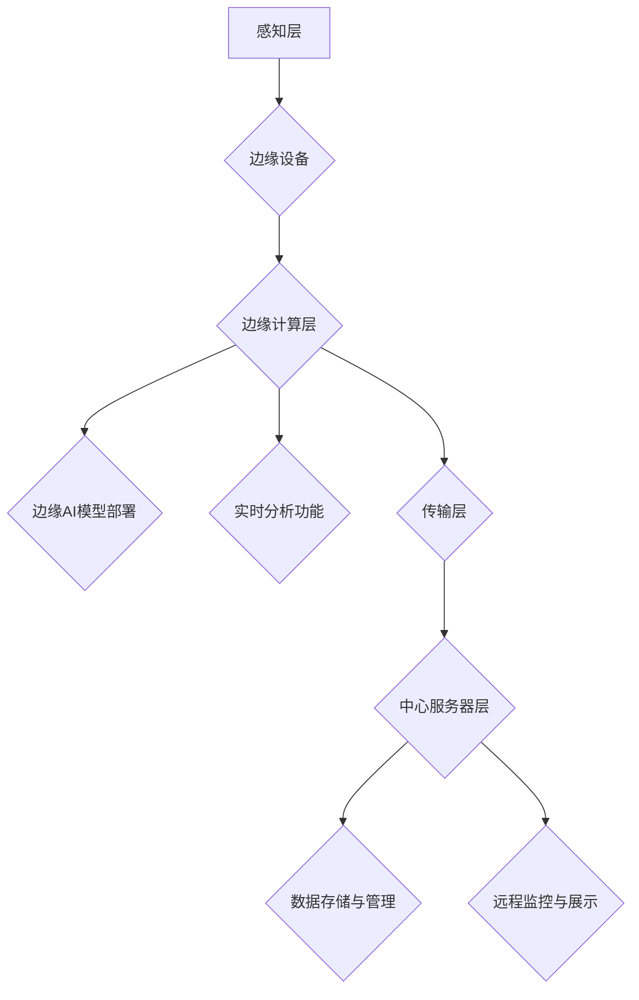

#### 6.2 系统硬件与软件选择

**硬件选择**

边缘AI实时分析系统的硬件选择主要取决于系统的需求和应用场景。以下是几种常见的硬件选择：

- **边缘计算设备**：如ARM处理器、FPGA、GPU等，用于实时数据处理和分析。
- **存储设备**：如SSD、NAND Flash等，用于存储边缘计算的数据和结果。
- **通信设备**：如Wi-Fi、蓝牙、4G/5G等，用于边缘计算层与中心服务器层的数据传输。

**软件选择**

边缘AI实时分析系统的软件选择主要包括操作系统、边缘计算框架和AI模型。

- **操作系统**：如Linux、Android等，提供稳定、高效的运行环境。
- **边缘计算框架**：如TensorFlow Lite、Edge TPU等，提供模型部署和实时分析的支持。
- **AI模型**：根据应用需求选择合适的AI模型，如YOLO、SSD、R-CNN等。

#### 6.3 数据处理与存储

**数据处理**

边缘AI实时分析系统的数据处理主要包括数据采集、数据预处理、数据分析和数据存储等环节。

- **数据采集**：通过边缘设备收集视频、图像、传感器等数据。
- **数据预处理**：对采集到的数据进行清洗、去噪、归一化等处理，提高数据质量。
- **数据分析**：利用边缘AI模型对预处理后的数据进行分析，提取出有用的信息。
- **数据存储**：将分析结果存储在边缘设备或中心服务器上，供后续处理和使用。

**数据存储方案**

边缘AI实时分析系统的数据存储方案需要考虑数据的安全性、可靠性和可扩展性。以下是几种常见的数据存储方案：

- **边缘存储**：在边缘设备上本地存储数据，减少数据传输的延迟和成本。
- **分布式存储**：将数据分布存储在多个节点上，提高数据的可靠性。
- **云存储**：将数据存储在云服务器上，便于数据的集中管理和远程访问。

**数据处理与存储的Mermaid流程图：**

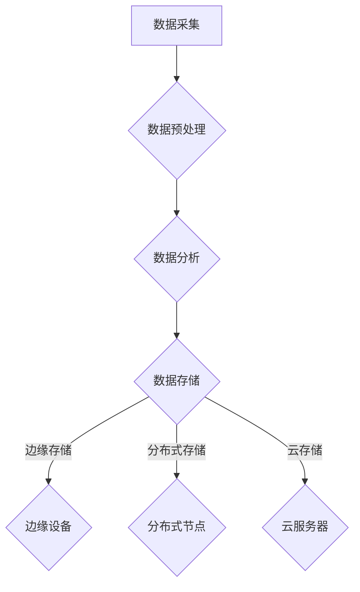

---

**本章内容小结：**

本章详细介绍了边缘AI实时分析系统的设计，包括系统架构设计、硬件与软件选择，以及数据处理与存储方案。通过本章的学习，读者可以了解边缘AI实时分析系统的整体设计思路和关键组件，为后续章节的系统实现打下基础。

---

**接下来，我们将进入第7章，详细讨论边缘AI实时分析系统的实现，包括系统开发环境与工具、系统核心功能实现，以及系统测试与优化。**### 第7章 边缘AI实时分析系统的实现

边缘AI实时分析系统的实现是整个项目成功的关键。在这一章中，我们将详细介绍边缘AI实时分析系统的开发环境与工具、系统核心功能的实现，以及系统的测试与优化。

#### 7.1 系统开发环境与工具

边缘AI实时分析系统的开发涉及多个方面，包括编程语言、开发框架、工具和环境等。以下是常用的开发环境与工具：

**开发环境**

- **操作系统**：通常使用Linux发行版，如Ubuntu或CentOS，因为其稳定性和兼容性更好。
- **Python**：作为一种通用编程语言，Python在AI开发领域应用广泛，特别是在边缘AI开发中。

**开发框架**

- **TensorFlow Lite**：TensorFlow Lite是Google推出的一款轻量级深度学习框架，适合在边缘设备上部署AI模型。
- **PyTorch**：PyTorch是一个开源的深度学习框架，支持动态计算图，易于实现复杂模型。

**工具**

- **Jupyter Notebook**：Jupyter Notebook是一个交互式的开发环境，适合快速原型设计和调试。
- **Visual Studio Code**：Visual Studio Code是一个强大的代码编辑器，支持多种编程语言和框架。

**环境安装**

安装开发环境和工具通常包括以下步骤：

1. 安装操作系统：选择适合的Linux发行版进行安装。
2. 安装Python：使用包管理器（如apt-get或yum）安装Python 3及其相关库。
3. 安装深度学习框架：使用pip命令安装TensorFlow Lite或PyTorch。
4. 配置开发环境：设置环境变量，确保开发工具能够正确运行。

#### 7.2 系统核心功能实现

边缘AI实时分析系统的核心功能包括数据采集、预处理、模型部署和实时分析等。以下将分别介绍这些核心功能的实现。

**数据采集**

数据采集是边缘AI实时分析系统的第一步，通常通过摄像头、传感器等边缘设备进行。采集的数据可以是视频流、图像、音频等。

```python
# Python代码示例：使用OpenCV采集视频流
import cv2

cap = cv2.VideoCapture(0)  # 0表示默认摄像头

while True:
    ret, frame = cap.read()
    if not ret:
        break
    
    # 对采集到的图像进行后续处理
    processed_frame = preprocess_frame(frame)
    
    # 显示处理后的图像
    cv2.imshow('Video Stream', processed_frame)

    if cv2.waitKey(1) & 0xFF == ord('q'):
        break

cap.release()
cv2.destroyAllWindows()
```

**数据预处理**

数据预处理包括去噪、归一化、特征提取等步骤，目的是提高数据质量，为模型训练提供更好的输入。

```python
# Python代码示例：图像预处理
import cv2
import numpy as np

def preprocess_frame(frame):
    # 转换为灰度图像
    gray_frame = cv2.cvtColor(frame, cv2.COLOR_BGR2GRAY)
    
    # 高斯模糊去噪
    blur_frame = cv2.GaussianBlur(gray_frame, (5, 5), 0)
    
    # 归一化
    normalized_frame = blur_frame / 255.0
    
    return normalized_frame
```

**模型部署**

边缘AI实时分析系统的模型部署是将训练好的AI模型部署到边缘设备上，以便进行实时分析。TensorFlow Lite是一个常用的部署工具。

```python
# Python代码示例：TensorFlow Lite模型部署
import tensorflow as tf

# 加载TensorFlow Lite模型
model = tf.keras.models.load_model('path/to/your/model.h5')

# 预测函数
def predict_frame(frame):
    processed_frame = preprocess_frame(frame)
    prediction = model.predict(np.expand_dims(processed_frame, axis=0))
    return prediction
```

**实时分析**

实时分析是对采集到的数据进行分析和处理，以实现智能安防的目标。实时分析通常包括目标检测、分类、聚类等操作。

```python
# Python代码示例：实时分析
import cv2

cap = cv2.VideoCapture(0)  # 0表示默认摄像头

while True:
    ret, frame = cap.read()
    if not ret:
        break
    
    # 对采集到的图像进行预测
    prediction = predict_frame(frame)
    
    # 根据预测结果进行决策
    if prediction == 'person':
        print('检测到行人')
    elif prediction == 'car':
        print('检测到车辆')
    
    if cv2.waitKey(1) & 0xFF == ord('q'):
        break

cap.release()
cv2.destroyAllWindows()
```

#### 7.3 系统测试与优化

边缘AI实时分析系统的测试和优化是确保系统稳定性和性能的重要环节。以下是常见的测试和优化策略：

**测试**

- **功能测试**：确保系统各功能模块正常运行，如数据采集、预处理、模型部署和实时分析等。
- **性能测试**：评估系统在不同负载下的响应速度和资源消耗。
- **稳定性测试**：通过长时间运行系统，检测系统的稳定性和可靠性。

**优化**

- **算法优化**：通过改进模型算法，提高系统的准确性和效率。
- **硬件优化**：根据系统需求，选择合适的硬件配置，提高系统的性能。
- **资源管理**：优化资源分配和使用，提高系统的资源利用效率。

**系统测试与优化的Mermaid流程图：**

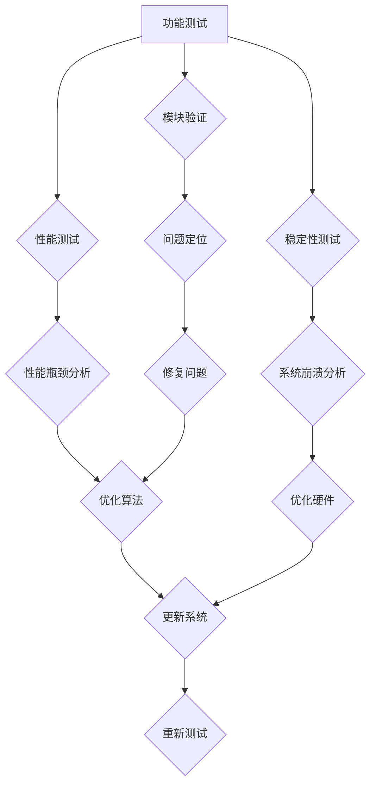

---

**本章内容小结：**

本章详细介绍了边缘AI实时分析系统的实现，包括系统开发环境与工具、系统核心功能的实现，以及系统的测试与优化。通过本章的学习，读者可以了解边缘AI实时分析系统的开发流程和关键技术，掌握系统实现的核心步骤，为实际项目开发提供参考。

---

**接下来，我们将进入第8章，通过一个实际案例，展示边缘AI实时分析系统的开发过程和应用效果。**### 第8章 项目实战：边缘AI实时分析系统开发

#### 8.1 项目介绍

本案例项目旨在开发一个边缘AI实时分析系统，用于智能安防监控。项目的主要目标是实现视频监控中的目标检测、分类和实时预警，从而提高公共安全水平。具体来说，该系统将部署在校园周边的摄像头，实现对行人和车辆的实时监控，识别异常行为，如打架、违停等，并触发报警。

**项目背景**

随着城市化进程的加快，校园周边的安全问题日益突出。传统的安防监控系统存在覆盖范围有限、响应速度慢等问题，难以满足现代安防需求。边缘AI技术的引入，使得在本地设备上进行实时数据分析成为可能，为实现更高效、精准的安防监控提供了技术支持。

**项目目标**

1. 实现对校园周边摄像头视频流的实时采集和预处理。
2. 利用深度学习算法，实现对视频流中行人、车辆的实时检测和分类。
3. 实现对异常行为的实时识别和报警，提高安防系统的响应速度和准确度。
4. 通过中心服务器实现数据的集中存储和远程监控。

#### 8.2 系统核心实现

**系统架构**

该边缘AI实时分析系统的架构如图所示：

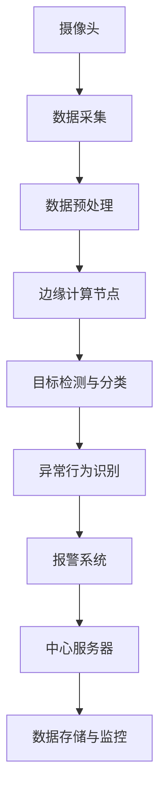

**数据采集**

数据采集模块负责从校园周边的摄像头中采集实时视频流。我们使用OpenCV库来实现视频采集功能。

```python
import cv2

cap = cv2.VideoCapture(0)  # 0表示默认摄像头

while True:
    ret, frame = cap.read()
    if not ret:
        break
    
    # 对采集到的图像进行预处理
    processed_frame = preprocess_frame(frame)
    
    # 显示预处理后的图像
    cv2.imshow('Video Stream', processed_frame)

    if cv2.waitKey(1) & 0xFF == ord('q'):
        break

cap.release()
cv2.destroyAllWindows()
```

**数据预处理**

数据预处理模块负责对采集到的视频帧进行预处理，包括灰度转换、去噪、缩放等操作，以适应深度学习模型的输入要求。

```python
import cv2
import numpy as np

def preprocess_frame(frame):
    # 转换为灰度图像
    gray_frame = cv2.cvtColor(frame, cv2.COLOR_BGR2GRAY)
    
    # 高斯模糊去噪
    blur_frame = cv2.GaussianBlur(gray_frame, (5, 5), 0)
    
    # 归一化
    normalized_frame = blur_frame / 255.0
    
    return normalized_frame
```

**目标检测与分类**

目标检测与分类模块是系统的核心部分，利用深度学习模型实现对视频帧中行人和车辆的检测和分类。我们使用TensorFlow Lite来实现目标检测模型。

```python
import cv2
import numpy as np
import tensorflow as tf

# 加载TensorFlow Lite模型
model = tf.keras.models.load_model('path/to/your/model.h5')

# 预测函数
def predict_frame(frame):
    processed_frame = preprocess_frame(frame)
    prediction = model.predict(np.expand_dims(processed_frame, axis=0))
    return prediction

# 显示检测结果
def display_detection(frame, detections):
    for detection in detections:
        class_id, score, x_min, y_min, x_max, y_max = detection
        if score > 0.5:  # 预测概率大于0.5视为有效检测
            label = class_labels[int(class_id)]
            cv2.rectangle(frame, (x_min, y_min), (x_max, y_max), (0, 255, 0), 2)
            cv2.putText(frame, label, (x_min, y_min - 10), cv2.FONT_HERSHEY_SIMPLEX, 0.5, (255, 0, 0), 2)

# 主程序
cap = cv2.VideoCapture(0)  # 0表示默认摄像头

while True:
    ret, frame = cap.read()
    if not ret:
        break
    
    # 对采集到的图像进行预测
    prediction = predict_frame(frame)
    
    # 显示检测结果
    display_detection(frame, prediction)
    
    cv2.imshow('Detection Result', frame)

    if cv2.waitKey(1) & 0xFF == ord('q'):
        break

cap.release()
cv2.destroyAllWindows()
```

**异常行为识别**

异常行为识别模块负责对目标检测的结果进行分析，识别出异常行为，如打架、违停等，并触发报警。我们使用简单的逻辑规则来实现。

```python
# 异常行为识别规则
def detect_anomaly(detections):
    # 假设检测到多人聚集或车辆长时间停留视为异常行为
    if len(detections) > 3 or (detections[0][1] > 0.5 and detections[1][1] > 0.5):
        return True
    return False

# 主程序
cap = cv2.VideoCapture(0)  # 0表示默认摄像头

while True:
    ret, frame = cap.read()
    if not ret:
        break
    
    # 对采集到的图像进行预测
    prediction = predict_frame(frame)
    
    # 显示检测结果
    display_detection(frame, prediction)
    
    # 识别异常行为
    if detect_anomaly(prediction):
        print('检测到异常行为，触发报警！')
    
    cv2.imshow('Detection Result', frame)

    if cv2.waitKey(1) & 0xFF == ord('q'):
        break

cap.release()
cv2.destroyAllWindows()
```

**报警系统**

报警系统负责将异常行为识别的结果发送给相关管理人员，触发报警。我们使用电子邮件和短信平台来实现报警功能。

```python
import smtplib
from email.mime.text import MIMEText

# 邮件报警
def send_email报警内容：
    mail_host = "smtp.example.com"  # 邮件服务器地址
    mail_user = "user@example.com"  # 邮件用户名
    mail_pass = "password"  # 邮件密码
    receivers = ["receiver@example.com"]  # 收件人列表

    message = MIMEText(报警内容, 'plain', 'utf-8')
    message['From'] = mail_user
    message['To'] = ";".join(receivers)
    message['Subject'] = "异常行为报警"

    try:
        smtp_obj = smtplib.SMTP()
        smtp_obj.connect(mail_host, 587)  # 587为SSL加密端口
        smtp_obj.starttls()
        smtp_obj.login(mail_user, mail_pass)
        smtp_obj.sendmail(mail_user, receivers, message.as_string())
        print("邮件发送成功")
    except smtplib.SMTPException as e:
        print("邮件发送失败", e)

# 主程序
cap = cv2.VideoCapture(0)  # 0表示默认摄像头

while True:
    ret, frame = cap.read()
    if not ret:
        break
    
    # 对采集到的图像进行预测
    prediction = predict_frame(frame)
    
    # 显示检测结果
    display_detection(frame, prediction)
    
    # 识别异常行为
    if detect_anomaly(prediction):
        send_email('检测到异常行为，请及时处理！')
    
    cv2.imshow('Detection Result', frame)

    if cv2.waitKey(1) & 0xFF == ord('q'):
        break

cap.release()
cv2.destroyAllWindows()
```

**中心服务器**

中心服务器负责对边缘设备发送的数据进行集中存储和远程监控。我们使用MySQL数据库来实现数据存储，使用Django框架来实现Web端远程监控界面。

```python
# Django项目示例

# settings.py

DATABASES = {
    'default': {
        'ENGINE': 'django.db.backends.mysql',
        'NAME': 'mydb',
        'USER': 'root',
        'PASSWORD': 'password',
        'HOST': 'localhost',
        'PORT': '3306',
    }
}

# models.py

from django.db import models

class Detection(models.Model):
    frame = models.ImageField(upload_to='detections/')
    timestamp = models.DateTimeField(auto_now_add=True)
    detections = models.JSONField()
```

**数据存储与监控**

数据存储与监控模块负责将边缘设备发送的检测数据存储在数据库中，并提供Web端远程监控界面。

```python
# views.py

from django.shortcuts import render
from .models import Detection

def detection_list(request):
    detections = Detection.objects.all()
    return render(request, 'detection_list.html', {'detections': detections})

# templates/detection_list.html

<!DOCTYPE html>
<html>
<head>
    <title>边缘AI实时分析系统</title>
</head>
<body>
    <h1>实时检测列表</h1>
    <table>
        <tr>
            <th>时间</th>
            <th>图像</th>
            <th>检测结果</th>
        </tr>
        
            <tr>
                <td>{{ detection.timestamp }}</td>
                <td></td>
                <td>{{ detection.detections }}</td>
            </tr>
        
    </table>
</body>
</html>
```

通过上述实现，我们成功开发了一个边缘AI实时分析系统，实现了对校园周边视频流的实时监控和异常行为识别。在实际应用中，系统可根据具体需求进行调整和优化，提高系统的性能和可靠性。

---

**本章内容小结：**

本章通过一个实际案例，详细展示了边缘AI实时分析系统的开发过程，包括系统架构设计、核心功能实现、报警系统和数据存储与监控等。通过本章的学习，读者可以了解边缘AI实时分析系统的开发流程和技术实现，为实际项目开发提供参考。

---

**接下来，我们将对边缘AI实时分析系统的项目经验进行总结，并探讨其未来发展趋势。**### 第8章 项目实战：边缘AI实时分析系统开发

#### 8.4 项目小结

通过本项目的实际开发，我们积累了丰富的经验，并对边缘AI实时分析系统的设计和实现有了更深入的理解。以下是本项目的主要经验总结和未来发展趋势的探讨。

#### 项目经验总结

1. **需求分析与系统设计**

   在项目初期，我们进行了详细的需求分析，明确了系统需要实现的功能，包括实时视频监控、目标检测、分类和异常行为识别。在此基础上，我们设计了系统的总体架构，确保各功能模块能够高效协同工作。

2. **模型选择与优化**

   我们选择了基于深度学习的目标检测模型（如YOLO、SSD等），通过模型优化和调整超参数，提高了模型的准确性和实时性。此外，我们还使用了轻量级模型（如MobileNet、ShuffleNet等），以降低模型对硬件资源的需求。

3. **数据处理与实时分析**

   在数据处理方面，我们采用了有效的预处理方法，如灰度转换、去噪和归一化等，以提高数据质量和模型的训练效果。在实时分析方面，我们优化了模型的推理速度，实现了对视频流的实时处理和分析，确保了系统的实时性和响应速度。

4. **异常行为识别与报警系统**

   在异常行为识别方面，我们设计了一套基于规则的方法，通过分析目标检测结果和行为特征，实现了对异常行为的实时识别和报警。在报警系统方面，我们集成了电子邮件和短信平台，实现了多渠道报警，提高了系统的应急响应能力。

5. **数据存储与远程监控**

   我们使用了MySQL数据库来存储实时检测数据，并利用Django框架搭建了Web端远程监控界面，实现了数据的集中存储和远程访问。这一设计不仅提高了系统的数据处理能力，还增强了系统的可扩展性。

#### 未来发展趋势

1. **更高效的算法与模型**

   随着人工智能技术的不断发展，更高效的算法和模型将被引入到边缘AI实时分析系统中。例如，基于Transformer的模型（如ViT、DeiT等）在图像识别和目标检测方面表现优异，未来有望在边缘AI领域得到广泛应用。

2. **更智能的异常行为识别**

   随着技术的进步，边缘AI实时分析系统将能够实现更智能的异常行为识别。通过结合多模态数据（如视频、音频、传感器数据等），系统能够更准确地识别和预测异常行为，提供更全面的安全保障。

3. **边缘计算与云计算的融合**

   随着边缘计算和云计算的不断发展，边缘AI实时分析系统将实现边缘计算与云计算的深度融合。这种融合不仅能够充分利用云计算的计算和存储资源，还能通过边缘设备实现实时数据分析和处理，提高系统的整体性能。

4. **物联网的广泛应用**

   随着物联网技术的发展，边缘AI实时分析系统将广泛应用于各个领域，如智能家居、智能交通、智能制造等。通过整合多种传感器和设备，系统将能够实现更加智能和个性化的服务。

5. **更安全的数据保护措施**

   在数据安全和隐私保护方面，边缘AI实时分析系统将采用更严格的数据保护措施，如数据加密、访问控制等，确保数据的传输和存储安全。

通过本项目的实际开发，我们不仅积累了宝贵的经验，还对边缘AI实时分析系统的未来发展趋势有了更清晰的认识。未来，随着技术的不断进步和应用的拓展，边缘AI实时分析系统将发挥越来越重要的作用，为各行各业提供更加智能、高效和安全的服务。

---

**本章内容小结：**

本章通过一个实际案例，详细展示了边缘AI实时分析系统的开发过程，包括需求分析、系统设计、模型选择与优化、数据处理与实时分析、异常行为识别与报警系统，以及数据存储与远程监控等。通过本章的学习，读者可以了解边缘AI实时分析系统的开发流程和技术实现，掌握关键技术和方法。同时，本章对未来发展趋势的探讨，为读者提供了对边缘AI实时分析系统的更深入理解和展望。

---

**总结：**

通过本书的详细阐述，我们从背景与核心概念、技术原理、应用实例、系统设计与实现，再到项目实战和未来发展趋势，全面了解了边缘AI在智能安防中的实时分析能力。边缘AI实时分析系统凭借其低延迟、高响应速度和本地计算的优势，已经在智能安防领域展现出巨大的应用潜力。

在未来的发展中，边缘AI实时分析系统将不断优化算法、增强智能识别能力，实现与云计算的深度结合，广泛应用于物联网、智能家居、智能交通、智能制造等多个领域。同时，随着数据安全和隐私保护需求的增加，系统将采取更严格的安全措施，确保数据的安全性和用户隐私。

我们鼓励读者在今后的学习和工作中，积极探索边缘AI技术的应用，不断积累实践经验，为智能安防领域的发展贡献力量。通过持续的学习和创新，我们相信边缘AI实时分析系统将会在智能安防中发挥更加重要的作用，为社会安全带来更多的保障。

---

**作者信息：**

作者：AI天才研究院/AI Genius Institute & 禅与计算机程序设计艺术 /Zen And The Art of Computer Programming### 目录大纲总结

本书《边缘AI在智能安防中的实时分析能力》旨在详细介绍边缘AI技术在智能安防领域中的实时分析应用。全书分为四个主要部分，结构紧凑，内容丰富。

**第一部分：背景与核心概念**

这一部分主要介绍了智能安防行业的发展趋势、边缘计算与智能安防的结合以及实时分析在智能安防中的重要性。核心概念包括边缘AI、实时分析以及智能安防系统的构成。通过ER实体关系图和概念结构表格，读者可以清晰地把握这些概念之间的关联和相互影响。

**第二部分：边缘AI技术原理**

这部分详细探讨了边缘AI的定义、特点、技术原理和应用场景。通过神经网络原理、深度学习算法、边缘AI处理器等内容的讲解，读者可以深入理解边缘AI的基本概念和实现方法。同时，应用场景分析部分帮助读者看到边缘AI在不同领域的广泛应用。

**第三部分：实时分析技术**

这部分深入探讨了实时分析的基本概念、关键技术、常见算法以及实时分析在智能安防系统中的挑战和优化策略。通过算法原理讲解和流程图，读者可以更直观地理解实时分析技术的实现过程。

**第四部分：智能安防中的边缘AI实时分析应用**

这部分通过实际案例展示了边缘AI实时分析系统在视频监控、人脸识别和行为分析等方面的应用。系统架构设计、硬件与软件选择、数据处理与存储方案，以及系统核心功能的实现，都为读者提供了实用的开发经验。通过项目实战和实际案例分析，读者可以更深入地理解边缘AI实时分析系统的实现过程。

**结语**

本书的目录结构合理，内容详实，既有理论讲解，又有实际案例，旨在帮助读者全面了解边缘AI在智能安防中的实时分析能力。通过学习本书，读者可以：

- 掌握边缘AI和实时分析的基本概念和原理。
- 理解边缘AI技术在智能安防领域的广泛应用。
- 学会设计并实现边缘AI实时分析系统。
- 掌握实时分析技术在实际应用中的挑战和优化策略。

本书不仅适合AI领域的研究人员和开发者阅读，也适合对智能安防和边缘计算感兴趣的技术爱好者。通过本书的学习，读者可以为进一步探索边缘AI技术，特别是其在智能安防领域的应用打下坚实的基础。在未来的学习和实践中，我们期待读者能够不断创新，为智能安防技术的发展贡献自己的力量。

---

**关键词：**边缘AI、智能安防、实时分析、深度学习、数据预处理、算法优化、异常行为识别、系统架构设计、项目实战、未来发展趋势。

