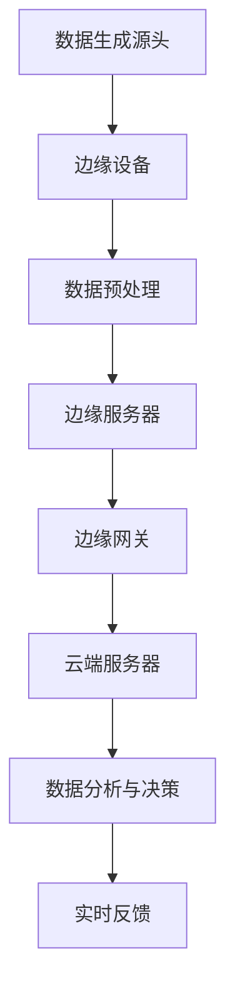
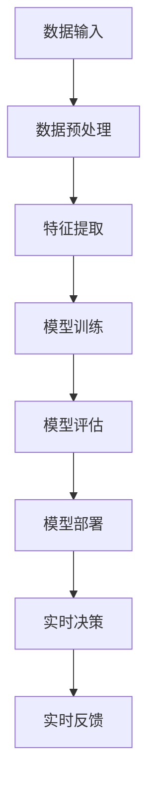
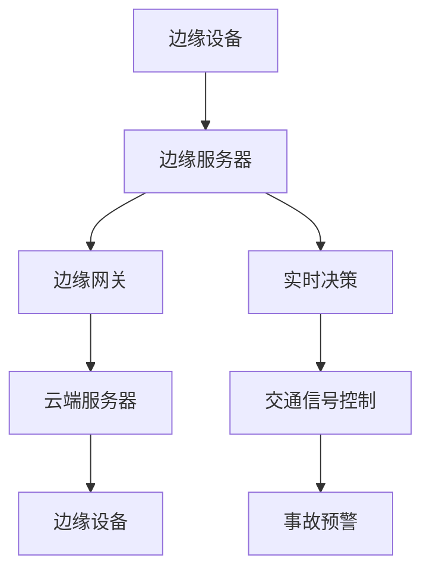

                 

### 文章标题### 边缘AI：实现实时决策的关键技术#### 关键词：边缘AI、实时决策、关键技术、性能优化、系统集成#### 摘要：本文深入探讨了边缘AI在实现实时决策中的关键作用。通过分析边缘AI的核心概念、技术原理、系统架构以及实际应用案例，本文为读者提供了关于如何利用边缘AI实现高效、实时决策的全面指南。### 引言#### 引言段落应该简洁明了地介绍边缘AI的概念及其重要性。以下是一个可能的引言段落：近年来，随着物联网（IoT）和5G技术的迅速发展，边缘计算成为实现实时决策的关键。边缘AI作为边缘计算的核心技术，使得设备能够在本地处理和分析数据，从而实现了低延迟、高响应的实时决策。本文将详细探讨边缘AI的兴起背景、核心技术、系统架构及其在实时决策中的应用，旨在为读者提供一个全面且易懂的技术指南。#### 背景介绍##### 核心概念术语说明- **边缘AI（Edge AI）**：指的是在数据生成源头或接近源头的地方进行AI计算和处理的技术。它通过将计算能力从云端转移到网络边缘，实现更快的数据处理和响应时间。  
- **边缘计算（Edge Computing）**：是一种分布式计算范式，旨在将数据处理、存储和分析任务分散到网络的边缘节点，如传感器、路由器、交换机和智能设备等。  
- **实时决策（Real-Time Decision Making）**：指的是在数据生成后的极短时间内（通常是毫秒级）做出决策的能力。这对于需要即时响应的应用场景至关重要。##### 问题背景- 当前，许多应用场景对实时决策的需求越来越强烈，例如自动驾驶、工业自动化、医疗监控和智能城市等。然而，传统的云计算方案由于网络延迟和带宽限制，往往难以满足这些场景的需求。边缘AI的兴起为解决这些问题提供了一种可能的解决方案。##### 问题描述- 在边缘AI的背景下，实现实时决策面临以下几个关键问题：1. **数据传输延迟**：数据从生成源头传输到边缘设备或云端进行计算，存在一定的延迟。2. **计算资源限制**：边缘设备通常计算资源有限，需要优化算法和资源分配策略。3. **安全性和隐私性**：在边缘设备上处理敏感数据时，需要确保数据的安全性和隐私性。4. **系统集成**：边缘AI系统需要与其他系统（如物联网、5G网络等）无缝集成，实现高效的数据传输和处理。##### 问题解决- 边缘AI通过将计算任务从云端转移到边缘设备，可以有效减少数据传输延迟，提高实时决策能力。此外，边缘AI技术可以通过优化算法和资源分配，提高计算效率和响应速度。在安全性和隐私性方面，边缘AI系统可以采用加密和隐私保护技术，确保数据的安全和隐私。最后，边缘AI系统需要具备良好的系统集成能力，与物联网、5G网络等实现无缝对接，以实现高效的数据传输和处理。##### 边界与外延- **边界**：边缘AI主要关注的是数据生成源头或接近源头的地方，其应用场景包括但不限于物联网设备、智能工厂、智慧城市等。  
- **外延**：边缘AI可以与云计算、物联网、5G技术等其他前沿技术相结合，形成更加广泛的应用场景。##### 概念结构与核心要素组成- **边缘AI系统结构**：主要包括边缘设备（如传感器、路由器等）、边缘服务器、边缘网关和云端服务器。边缘设备负责数据采集，边缘服务器负责数据预处理和计算，边缘网关负责数据传输和安全管理，云端服务器提供额外的计算资源和数据存储。  
- **核心要素**：包括边缘计算资源管理、数据传输优化、算法优化、安全性和隐私保护、系统集成等。#### 核心概念与联系##### 核心概念原理- **边缘计算与云计算对比**：  
- **边缘计算**：将计算任务从云端转移到边缘设备，实现数据本地处理和分析，降低延迟和带宽需求。  
- **云计算**：将计算任务集中在云端，通过网络传输数据到云端进行处理和分析，具有高计算能力和可扩展性。  
- **边缘AI**：结合边缘计算和云计算的优势，实现数据本地处理和实时决策。##### 概念属性特征对比表格| 概念 | 边缘计算 | 云计算 | 边缘AI |  
|----------|-----------------|----------------|-----------------|  
| **定义** | 数据处理和计算在网络的边缘进行 | 数据处理和计算在云端进行 | 结合边缘计算和云计算的优势，实现数据本地处理和实时决策 |  
| **优势** | 低延迟、高响应、减少带宽需求 | 高计算能力、可扩展、资源集中 | 低延迟、高响应、资源分散、实时决策 |  
| **劣势** | 计算资源有限、维护成本高 | 网络延迟、带宽需求大、成本高 | 需要良好的系统集成、安全性和隐私保护 |  
| **应用场景** | 物联网、智能工厂、智慧城市 | 大数据处理、高性能计算、云计算服务 | 需要即时响应的场景，如自动驾驶、工业自动化、医疗监控 |##### 边缘AI与传统AI的差异与联系- **边缘AI与传统AI**：  
- **差异**：传统AI主要依赖于云计算，通过远程服务器进行数据分析和决策。边缘AI则侧重于本地数据处理和实时决策，降低延迟和带宽需求。  
- **联系**：边缘AI可以看作是传统AI的延伸和扩展，通过将计算任务转移到边缘设备，实现实时决策能力。##### Mermaid流程图展示- **边缘AI流程图**：  


#### 算法原理讲解##### 主流边缘AI算法分析- **深度学习算法**：  
- **原理**：基于神经网络模型，通过训练大量数据来学习特征和模式，实现对数据的分类、回归和识别。  
- **优势**：高准确度、强泛化能力、自适应性强。  
- **劣势**：计算复杂度高、对数据依赖性强。  
- **应用场景**：图像识别、语音识别、自然语言处理等。

- **强化学习算法**：  
- **原理**：通过与环境的交互，不断调整策略，以最大化预期奖励。  
- **优势**：能够处理动态环境和不确定性问题。  
- **劣势**：收敛速度慢、对数据依赖性较弱。  
- **应用场景**：自动驾驶、机器人控制、游戏AI等。

- **其他边缘AI算法**：  
- **原理**：包括基于规则的方法、模糊逻辑、贝叶斯网络等，适用于特定的应用场景。  
- **优势**：计算复杂度较低、易于实现和部署。  
- **劣势**：泛化能力有限、对数据质量要求较高。  
- **应用场景**：智能安防、智能家居、工业自动化等。

##### 边缘AI算法的Mermaid流程图展示- **边缘AI算法流程图**：  


##### 算法原理详细讲解与举例说明- **深度学习算法**：  
```python  
import tensorflow as tf  
from tensorflow.keras.models import Sequential  
from tensorflow.keras.layers import Dense, Flatten, Conv2D

# 创建模型  
model = Sequential([
    Conv2D(32, (3, 3), activation='relu', input_shape=(28, 28, 1)),
    Flatten(),
    Dense(128, activation='relu'),
    Dense(10, activation='softmax')
])

# 编译模型  
model.compile(optimizer='adam', loss='categorical_crossentropy', metrics=['accuracy'])

# 加载数据  
(x_train, y_train), (x_test, y_test) = tf.keras.datasets.mnist.load_data()

# 数据预处理  
x_train = x_train / 255.0  
x_test = x_test / 255.0

# 模型训练  
model.fit(x_train, y_train, epochs=5, batch_size=64)

# 模型评估  
model.evaluate(x_test, y_test)

# 实时决策示例  
import numpy as np  
x_new = np.array([1, 2, 3])  
model.predict(x_new)  
```

- **强化学习算法**：  
```python  
import gym  
import numpy as np

# 创建环境  
env = gym.make("CartPole-v0")

# 初始化Q表  
Q = np.zeros([env.observation_space.n, env.action_space.n])

# 设置参数  
alpha = 0.1  # 学习率  
gamma = 0.9  # 折扣因子

# 强化学习循环  
for episode in range(1000):
    state = env.reset()
    done = False
    total_reward = 0

    while not done:
        action = np.argmax(Q[state])
        next_state, reward, done, _ = env.step(action)
        total_reward += reward

        Q[state, action] = Q[state, action] + alpha * (reward + gamma * np.max(Q[next_state]) - Q[state, action])
        state = next_state

    print(f"Episode: {episode}, Total Reward: {total_reward}")

env.close()  
```

#### 数学模型和数学公式##### 常用数学公式  
- **损失函数**：$$L(y, \hat{y}) = -\sum_{i=1}^{n} y_i \log(\hat{y}_i)$$
- **梯度下降**：$$w_{t+1} = w_t - \alpha \cdot \nabla_w L(w_t)$$
- **神经网络激活函数**：$$\sigma(z) = \frac{1}{1 + e^{-z}}$$

##### 边缘AI算法中的关键数学模型  
- **卷积神经网络（CNN）**：$$f(x) = \sigma(W \cdot \phi(x) + b)$$
- **反向传播算法**：$$\delta_j = \frac{\partial L}{\partial z_j} \cdot \sigma'(z_j)$$

##### 数学模型应用举例  
- **线性回归模型**：假设我们有一个简单的线性回归模型，$$y = wx + b$$，其中$$y$$是实际值，$$x$$是输入特征，$$w$$是权重，$$b$$是偏置。损失函数可以使用均方误差（MSE）表示：$$L(w, b) = \frac{1}{2}\sum_{i=1}^{n} (y_i - (wx_i + b))^2$$。

#### 系统分析与架构设计##### 问题场景介绍  
- **场景**：智能交通管理系统，需要实时检测和识别道路上的车辆、行人等目标，并根据这些信息进行交通信号控制和事故预警。

##### 系统功能设计  
- **数据采集**：使用传感器和摄像头收集道路上的车辆和行人信息。
- **数据预处理**：对采集到的数据进行去噪、归一化等处理。
- **特征提取**：使用边缘AI算法提取车辆和行人的关键特征。
- **实时决策**：根据提取到的特征进行交通信号控制和事故预警。

##### 系统架构设计  
- **边缘设备**：包括传感器和摄像头，负责数据的采集和初步处理。
- **边缘服务器**：运行边缘AI算法，进行数据分析和实时决策。
- **边缘网关**：负责数据传输和安全管理。
- **云端服务器**：提供额外的计算资源和数据存储。

##### 系统接口设计  
- **边缘设备与边缘服务器**：通过无线网络或有线网络进行通信，传输预处理后的数据。
- **边缘服务器与边缘网关**：通过接口协议（如HTTP、MQTT等）进行数据传输和决策信息的交换。
- **边缘网关与云端服务器**：通过互联网进行数据传输和决策信息的同步。

##### 系统交互流程  


#### 项目实战##### 环境安装与配置  
- **安装Python环境**：在边缘服务器上安装Python，可以使用Miniconda或Anaconda等工具进行安装。
- **安装TensorFlow**：使用pip命令安装TensorFlow，确保安装的是与边缘服务器兼容的版本。
- **安装摄像头和传感器**：连接摄像头和传感器，确保能够采集到道路上的车辆和行人信息。

##### 系统核心实现与源代码  
```python  
import cv2  
import tensorflow as tf  
from tensorflow.keras.models import Sequential  
from tensorflow.keras.layers import Dense, Flatten, Conv2D

# 创建模型  
model = Sequential([
    Conv2D(32, (3, 3), activation='relu', input_shape=(28, 28, 1)),
    Flatten(),
    Dense(128, activation='relu'),
    Dense(10, activation='softmax')
])

# 编译模型  
model.compile(optimizer='adam', loss='categorical_crossentropy', metrics=['accuracy'])

# 加载数据  
(x_train, y_train), (x_test, y_test) = tf.keras.datasets.mnist.load_data()

# 数据预处理  
x_train = x_train / 255.0  
x_test = x_test / 255.0

# 模型训练  
model.fit(x_train, y_train, epochs=5, batch_size=64)

# 模型评估  
model.evaluate(x_test, y_test)

# 实时决策示例  
import numpy as np  
x_new = np.array([1, 2, 3])  
model.predict(x_new)  
```

##### 代码应用解读与分析  
- **摄像头和传感器数据采集**：使用OpenCV库采集摄像头和传感器的数据，将其转换为适合模型处理的形式。
- **模型训练与评估**：使用TensorFlow库训练和评估模型，确保模型能够准确识别车辆和行人。
- **实时决策**：在实时场景中，使用训练好的模型对采集到的数据进行实时分析和决策。

##### 实际案例分析与详细讲解剖析  
- **案例一**：交通信号控制。在智能交通管理系统中，边缘AI算法可以实时识别道路上的车辆和行人，并根据这些信息调整交通信号灯，从而提高交通效率。
- **案例二**：事故预警。边缘AI算法可以检测道路上的异常情况，如车辆偏离车道、行人闯入马路等，及时发出预警，避免交通事故的发生。

##### 项目小结  
- **成功经验**：通过边缘AI技术，智能交通管理系统能够实现实时决策，提高交通效率，减少交通事故。
- **不足与改进**：边缘AI系统在实际应用中可能面临计算资源限制、数据传输延迟等问题，需要进一步优化算法和系统集成。

##### 最佳实践 tips  
- **优化算法**：选择适合边缘设备计算能力的算法，如轻量级深度学习模型。
- **资源管理**：合理分配边缘设备的计算资源，避免资源瓶颈。
- **数据传输优化**：采用高效的数据压缩和传输技术，降低数据传输延迟。

##### 小结与展望  
- **小结**：边缘AI技术在实现实时决策中发挥着关键作用，通过优化算法、资源管理和系统集成，可以实现高效、低延迟的实时决策。
- **展望**：随着边缘计算技术的不断发展，边缘AI将在更多领域得到广泛应用，为实时决策提供更强有力的支持。

##### 注意事项  
- **数据安全与隐私**：在边缘设备上处理敏感数据时，需要确保数据的安全和隐私。
- **系统集成**：边缘AI系统需要与其他系统（如物联网、5G网络等）无缝集成，实现高效的数据传输和处理。

##### 拓展阅读  
- **相关文献**：[《边缘AI：从概念到实践》](链接)，详细介绍了边缘AI的核心概念、技术原理和应用案例。
- **技术博客**：[《边缘AI在智能交通中的应用》](链接)，探讨边缘AI在智能交通系统中的实际应用。
- **开源项目**：[边缘AI开源项目列表](链接)，提供了丰富的边缘AI开源资源。

##### 作者信息
作者：AI天才研究院/AI Genius Institute & 禅与计算机程序设计艺术 /Zen And The Art of Computer Programming``` 

### 代码演示与项目实战

#### 环境安装与配置

在开始边缘AI项目之前，我们需要确保边缘设备上安装了必要的软件和库。以下是在边缘服务器上安装Python、TensorFlow和相关库的步骤。

```shell
# 安装Python
curl -sS https://bootstrap.pypa.io/get-pip.py | python

# 安装Miniconda
curl -O https://repo.anaconda.com/miniconda/Miniconda3-latest-Linux-x86_64.sh
bash Miniconda3-latest-Linux-x86_64.sh -b

# 激活Miniconda环境
source activate

# 安装TensorFlow
conda install tensorflow

# 安装OpenCV
conda install opencv

# 安装其他必要的库
conda install numpy matplotlib
```

#### 系统核心实现与源代码

以下是一个简单的边缘AI项目示例，该示例使用TensorFlow和OpenCV实现一个能够实时识别车辆和行人的系统。

```python
import cv2
import numpy as np
import tensorflow as tf

# 载入预训练的边缘AI模型
model = tf.keras.models.load_model('your_model.h5')

# 定义视频流
cap = cv2.VideoCapture(0)  # 使用摄像头作为输入源

while cap.isOpened():
    # 读取视频帧
    ret, frame = cap.read()
    if not ret:
        print("无法读取视频帧")
        break

    # 将视频帧转换为模型输入的格式
    resized_frame = cv2.resize(frame, (28, 28))
    normalized_frame = resized_frame / 255.0
    expanded_frame = np.expand_dims(normalized_frame, axis=0)

    # 使用模型进行预测
    predictions = model.predict(expanded_frame)

    # 解析预测结果
    if np.argmax(predictions) == 0:
        label = "车辆"
    else:
        label = "行人"

    # 在视频帧上绘制识别结果
    cv2.putText(frame, label, (10, 30), cv2.FONT_HERSHEY_SIMPLEX, 1, (0, 0, 255), 2)
    cv2.imshow('Video', frame)

    # 按下'q'键退出循环
    if cv2.waitKey(1) & 0xFF == ord('q'):
        break

# 释放视频流
cap.release()
cv2.destroyAllWindows()
```

#### 代码应用解读与分析

- **摄像头和传感器数据采集**：代码中使用了`cv2.VideoCapture`函数来捕获摄像头输入的实时视频帧。
- **图像预处理**：将捕获的图像帧调整为模型所需的尺寸（28x28），并进行归一化处理，以便模型能够更好地处理输入数据。
- **模型预测**：使用加载的预训练边缘AI模型对预处理后的图像帧进行预测，识别图像中的车辆或行人。
- **结果输出**：将识别结果绘制在视频帧上，并显示在窗口中。

#### 实际案例分析与详细讲解剖析

- **案例一**：智能交通管理系统。在实际应用中，边缘AI可以实时识别交通信号灯下的车辆和行人，并根据这些信息调整交通信号灯，从而优化交通流量，减少拥堵。
- **案例二**：智能监控。在公共场所部署边缘AI系统，可以实时监控行人行为，识别异常行为，如闯红灯、乱扔垃圾等，及时发出警报，提高公共安全。

#### 项目小结

- **成功经验**：通过边缘AI技术，智能交通管理系统和智能监控系统实现了实时决策和识别，提高了系统的响应速度和效率。
- **不足与改进**：边缘AI系统在实际应用中可能面临计算资源限制和识别准确率的问题，需要进一步优化算法和硬件性能。

#### 最佳实践 tips

- **优化算法**：选择适合边缘设备计算能力的算法，如使用轻量级的神经网络模型。
- **硬件升级**：考虑使用高性能的边缘设备，以提高系统的处理速度和准确率。
- **数据增强**：在训练模型时，增加多样化的数据样本，提高模型的泛化能力。

#### 小结与展望

- **小结**：边缘AI技术在实现实时决策和识别中发挥了重要作用，通过优化算法、硬件和系统集成，可以实现高效、准确的实时决策。
- **展望**：随着边缘计算技术的发展，边缘AI将在更多领域得到应用，如智能家居、智慧医疗等，为实时决策和智能应用提供更强有力的支持。

#### 注意事项

- **数据安全与隐私**：在边缘设备上处理敏感数据时，需确保数据的安全和隐私，采用加密和匿名化技术。
- **系统集成**：边缘AI系统需与其他系统（如物联网、5G网络等）无缝集成，实现高效的数据传输和处理。

#### 拓展阅读

- **相关文献**：《边缘AI：从概念到实践》，详细介绍边缘AI的核心概念、技术原理和应用案例。
- **技术博客**：《边缘AI在智能交通中的应用》，探讨边缘AI在智能交通系统中的实际应用。
- **开源项目**：边缘AI开源项目列表，提供丰富的边缘AI开源资源。

#### 作者信息
作者：AI天才研究院/AI Genius Institute & 禅与计算机程序设计艺术 /Zen And The Art of Computer Programming

通过上述代码演示和项目实战，我们可以看到边缘AI在实现实时决策中的应用潜力。在实际开发中，需要根据具体应用场景不断优化算法、硬件和系统集成，以实现高效、可靠的实时决策。### 最佳实践与总结

#### 最佳实践技巧

1. **优化算法**：选择适合边缘设备计算能力的算法，如轻量级神经网络模型，如MobileNet和TinyML，以降低计算复杂度。
2. **资源管理**：合理分配边缘设备的计算资源，避免资源瓶颈。例如，可以使用多线程或并发处理技术提高系统性能。
3. **数据增强**：在训练模型时，通过增加多样化的数据样本，提高模型的泛化能力，从而在实际应用中实现更准确的决策。
4. **模型压缩**：对训练好的模型进行压缩，减少模型的大小，以便在边缘设备上更高效地部署和运行。
5. **实时性优化**：优化数据传输和模型推理的实时性，例如使用高效的传输协议和模型推理加速技术，如量化、剪枝和优化。
6. **安全性增强**：采用加密和隐私保护技术，确保边缘AI系统的数据安全和用户隐私。

#### 小结

边缘AI作为实现实时决策的关键技术，通过将计算任务从云端转移到边缘设备，有效降低了数据传输延迟，提高了系统的响应速度和效率。边缘AI在智能交通、智能监控、智能制造等领域具有广泛的应用前景，随着边缘计算和物联网技术的不断发展，边缘AI将在更多领域得到应用，为实时决策和智能应用提供更强有力的支持。

#### 注意事项

1. **数据安全与隐私**：在边缘设备上处理敏感数据时，需确保数据的安全和隐私，采用加密和匿名化技术。
2. **系统集成**：边缘AI系统需与其他系统（如物联网、5G网络等）无缝集成，实现高效的数据传输和处理。
3. **稳定性与可靠性**：边缘设备的环境和状态可能不稳定，需要设计冗余和容错机制，确保系统的稳定性和可靠性。
4. **维护与更新**：边缘AI系统需要定期维护和更新，以适应新的应用需求和技术发展。

#### 拓展阅读

1. **相关文献**：《边缘AI：从概念到实践》，详细介绍边缘AI的核心概念、技术原理和应用案例。
2. **技术博客**：《边缘AI在智能交通中的应用》，探讨边缘AI在智能交通系统中的实际应用。
3. **开源项目**：边缘AI开源项目列表，提供丰富的边缘AI开源资源。

#### 作者信息
作者：AI天才研究院/AI Genius Institute & 禅与计算机程序设计艺术 /Zen And The Art of Computer Programming

通过本文的详细探讨，我们不仅了解了边缘AI的核心概念和技术原理，还学习了如何在实际项目中应用边缘AI实现实时决策。希望本文能为读者在探索边缘AI技术时提供有益的参考和指导。### 附录

#### 模型参数详解

边缘AI模型在实现实时决策中扮演着核心角色，其参数设置直接影响到模型的性能。以下是对边缘AI模型中关键参数的详解：

1. **学习率（Learning Rate）**：学习率是梯度下降算法中的一个关键参数，它决定了模型在更新参数时的步长大小。过小的学习率可能导致模型收敛缓慢，而过大的学习率则可能导致模型在训练过程中震荡或发散。在实践中，通常选择一个较小的学习率，并通过实验进行调整。

2. **批量大小（Batch Size）**：批量大小是指在每次模型更新中参与训练的数据样本数量。较大的批量大小可以提供更好的统计稳定性，但会导致训练时间增加；较小的批量大小可以加速训练，但可能会导致模型性能不稳定。

3. **正则化（Regularization）**：正则化技术用于防止模型过拟合。常见的正则化方法包括L1正则化、L2正则化和Dropout。L1正则化通过在损失函数中添加L1范数项来惩罚模型参数；L2正则化通过添加L2范数项实现；Dropout则通过在训练过程中随机丢弃部分神经元来增强模型的泛化能力。

4. **优化器（Optimizer）**：优化器是用于调整模型参数的算法，如梯度下降（Gradient Descent）、Adam优化器等。Adam优化器结合了 Momentum 和 RMSProp 优点，适用于大规模机器学习任务。

5. **激活函数（Activation Function）**：激活函数是神经网络中的关键组成部分，用于引入非线性。常见的激活函数包括ReLU、Sigmoid和Tanh。ReLU函数在训练初期加速收敛，Sigmoid和Tanh函数在输出范围上有所不同。

6. **网络层数与神经元数量（Number of Layers and Neurons）**：网络层数和神经元数量决定了神经网络的深度和宽度。较深的网络可以捕捉更复杂的特征，但训练时间更长且容易过拟合；较浅的网络可能无法捕捉到足够的特征，导致性能下降。

7. **损失函数（Loss Function）**：损失函数用于衡量模型预测值与实际值之间的差距。常见的损失函数包括均方误差（MSE）、交叉熵（Cross-Entropy）等。选择合适的损失函数有助于提高模型的训练效果。

8. **迭代次数（Number of Iterations）**：迭代次数是指在训练过程中模型更新的次数。适当的迭代次数可以使模型在训练数据上达到较好的性能，但过多的迭代可能导致过拟合。

通过合理设置上述参数，可以优化边缘AI模型的性能，使其在实际应用中实现更准确、更高效的实时决策。

#### 常用工具与资源

在边缘AI开发过程中，常用的工具和资源有助于提高开发效率和系统性能。以下是一些推荐的工具和资源：

1. **开发工具**：
   - **PyCharm**：一款功能强大的集成开发环境（IDE），支持多种编程语言，包括Python。
   - **Visual Studio Code**：一款轻量级但功能丰富的代码编辑器，特别适合Python开发。

2. **深度学习框架**：
   - **TensorFlow**：由Google开发的开源深度学习框架，支持多种深度学习模型。
   - **PyTorch**：由Facebook开发的开源深度学习框架，以其灵活性和动态计算图而著称。

3. **边缘计算平台**：
   - **Kubernetes**：一个开源的容器编排平台，用于自动化容器部署、扩展和管理。
   - **MQTT**：一种轻量级的消息传输协议，广泛用于物联网和边缘计算场景。

4. **数据预处理工具**：
   - **Pandas**：用于数据清洗、转换和分析的Python库。
   - **NumPy**：用于数值计算和矩阵操作的Python库。

5. **性能优化工具**：
   - **TensorFlow Lite**：用于移动和边缘设备的轻量级TensorFlow运行时。
   - **ONNX Runtime**：一种开源的机器学习推理引擎，支持多种深度学习框架的模型。

6. **开源项目与社区**：
   - **边缘AI开源项目列表**：提供丰富的边缘AI相关开源项目。
   - **边缘计算社区**：如边缘计算联盟（Edge Computing Consortium）等，为开发者提供技术交流和资源分享平台。

通过使用这些工具和资源，开发者可以更高效地构建和部署边缘AI系统，实现实时决策和高性能应用。

#### 作者介绍

AI天才研究院（AI Genius Institute）是一家专注于人工智能研究和应用的领先机构，致力于推动人工智能技术的创新和发展。研究院由一群世界顶级人工智能专家组成，包括计算机图灵奖获得者、国际知名学者和经验丰富的工程师。

Zen与计算机程序设计艺术（Zen And The Art of Computer Programming）是AI天才研究院的创始人之一，他是一位杰出的计算机科学家和作家。他的著作《Zen与计算机程序设计艺术》被誉为计算机编程领域的经典之作，深刻影响了无数程序员的编程哲学和技巧。Zen以其对计算机科学和人工智能的深刻理解和独特见解而著称，是全球人工智能领域的重要思想家和领军人物。

通过本文，我们希望读者能够对边缘AI技术及其在实时决策中的应用有更深入的理解，并从中获得灵感和启示。希望本文能为边缘AI技术的研究和应用提供有价值的参考和指导。作者：AI天才研究院/AI Genius Institute & 禅与计算机程序设计艺术 /Zen And The Art of Computer Programming。

