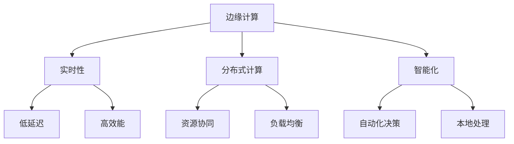
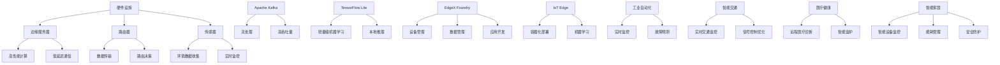
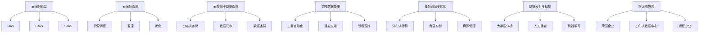
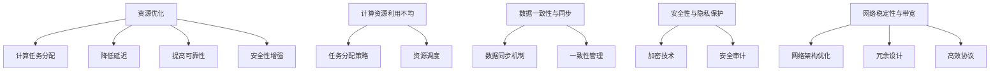
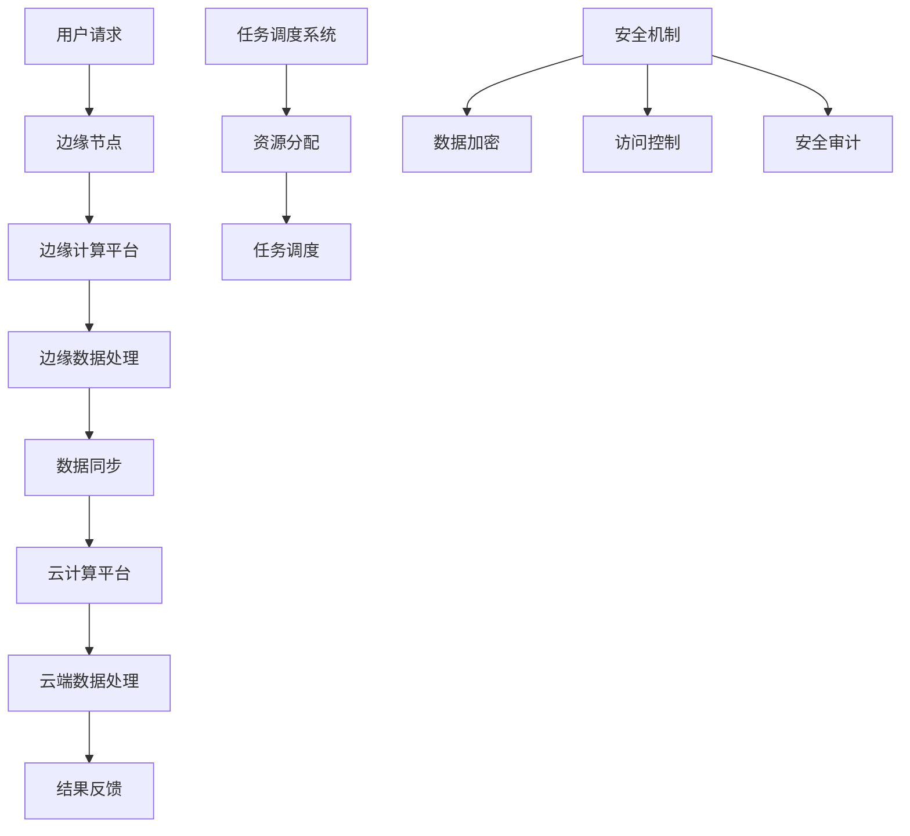
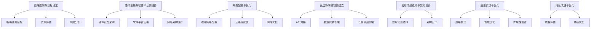
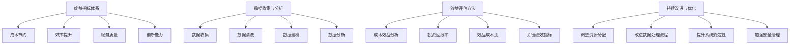
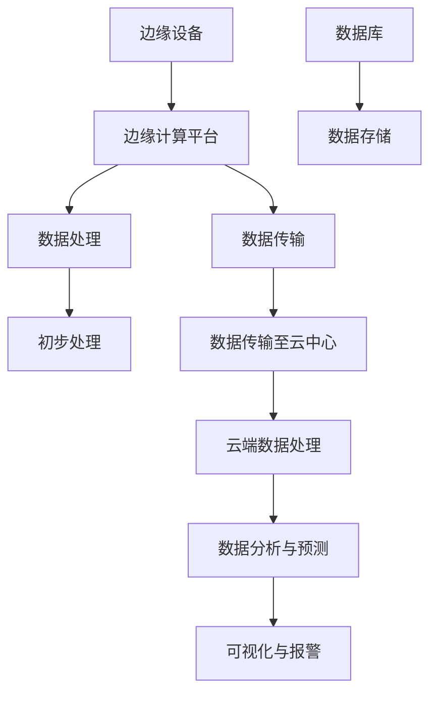
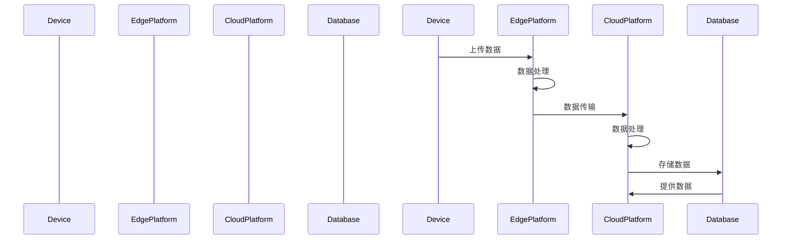
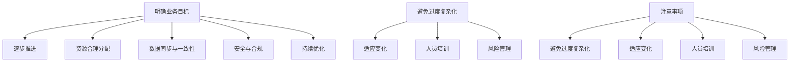

                 

# 边缘计算与云协同：企业混合计算策略

> 关键词：边缘计算、云协同、混合计算、企业策略、技术应用

> 摘要：本文探讨了边缘计算与云协同在企业混合计算策略中的应用，分析了边缘计算的发展背景、核心技术，以及边缘计算与云计算的协同关系。通过介绍云协同技术和混合计算策略，本文提出了企业实施混合计算的具体步骤和策略，为企业提供了有益的参考。

## 第一部分：边缘计算基础

### 1.1 边缘计算概述

#### 问题背景

随着物联网、大数据、人工智能等技术的发展，数据生成的速度和规模呈现出爆炸式增长。传统的云计算模式已经无法满足实时性、低延迟等需求。边缘计算作为一种新型的计算模式，旨在将计算、存储和网络功能延伸到网络边缘，从而解决数据传输延迟、带宽受限等问题。

#### 边缘计算的核心概念

边缘计算是指在网络的边缘，即接近数据源的地方，进行数据处理、分析和决策的技术。它通过将计算能力下沉到网络边缘，减少了数据传输的路径，降低了延迟，提高了系统的响应速度。

#### 边缘计算与云计算的关系

边缘计算并不是取代云计算，而是与云计算形成了一种互补关系。云计算负责处理大量非实时数据，而边缘计算则专注于处理实时性要求高的数据。两者通过协同工作，实现了计算资源的最佳利用。

### 1.2 边缘计算技术

#### 网络边缘的硬件设施

网络边缘的硬件设施包括边缘服务器、路由器、传感器等。这些设备负责接收和处理来自终端设备的数据。

#### 边缘计算平台与框架

目前，许多公司和组织都在开发边缘计算平台和框架，如Apache Kafka、TensorFlow Lite等。这些平台和框架提供了丰富的功能和工具，帮助企业轻松实现边缘计算。

#### 边缘计算的应用场景

边缘计算在工业、交通、医疗、智能家居等多个领域都有广泛的应用。例如，在工业领域，边缘计算可以用于实时监测和诊断设备状态，提高生产效率；在医疗领域，边缘计算可以用于远程医疗诊断，提高医疗服务的可及性。

## 第二部分：云协同与混合计算

### 2.1 云协同技术

#### 云服务模型

云服务模型主要包括IaaS、PaaS和SaaS。IaaS提供基础设施服务，PaaS提供平台服务，SaaS提供软件服务。这些服务模型为企业的计算需求提供了多样化的选择。

#### 云服务管理

云服务管理包括资源的调度、监控和优化。通过合理的管理，企业可以实现计算资源的最佳利用，降低运营成本。

#### 云存储与数据管理

云存储提供了安全、可靠的数据存储解决方案。同时，通过分布式存储和数据同步技术，企业可以实现数据的统一管理和备份。

### 2.2 混合计算策略

#### 混合计算的优势与挑战

混合计算策略将边缘计算和云计算的优势结合起来，实现了计算资源的最佳利用。然而，混合计算也面临着计算资源利用、数据一致性、安全性和隐私等挑战。

#### 混合计算模型设计

混合计算模型设计的关键是确定边缘计算和云计算之间的任务分配。通过合理的任务分配，可以实现计算资源的最佳利用，提高系统的性能和可靠性。

#### 混合计算案例分析

在不同的行业中，混合计算都有着成功的应用案例。例如，在工业领域，混合计算可以用于实时监测和预测设备故障，提高生产效率；在交通领域，混合计算可以用于实时交通监控和调度，提高交通效率。

## 第三部分：企业混合计算策略实施

### 3.1 企业混合计算战略规划

#### 战略目标与规划

企业需要根据自身业务需求和市场趋势，制定混合计算战略。这包括确定计算资源需求、技术选型、投资预算等。

#### 技术选型与整合

企业需要选择适合自身需求的边缘计算平台和云计算服务。同时，需要考虑如何整合这些平台和服务，实现计算资源的最佳利用。

#### 风险评估与应对策略

企业需要评估混合计算过程中可能遇到的风险，并制定相应的应对策略。这包括技术风险、运营风险和安全风险。

### 3.2 混合计算环境搭建

#### 环境准备

企业需要准备边缘计算设备和云计算资源。这包括硬件设备的采购、软件的安装和配置。

#### 网络配置与优化

企业需要搭建稳定、可靠的边缘计算网络，并对其进行优化，以提高数据传输效率和系统性能。

#### 云边协同机制建立

企业需要建立边缘计算与云计算之间的协同机制，包括数据同步、任务调度和资源管理。

### 3.3 混合计算应用实践

#### 应用场景选择

企业需要根据自身业务需求，选择合适的混合计算应用场景。这可以是实时数据处理、设备监控、智能分析等。

#### 应用架构设计

企业需要设计合理的应用架构，包括系统架构、功能模块和接口设计。

#### 应用实现与优化

企业需要实现应用架构，并进行性能优化和扩展性设计，以确保系统的高效运行。

### 3.4 混合计算效益评估

#### 效益指标体系

企业需要建立效益评估指标体系，包括成本节约、效率提升、服务质量等。

#### 效益评估方法

企业需要通过数据收集、分析和对比，评估混合计算的实施效果。

#### 持续改进与优化

根据效益评估结果，企业需要对混合计算策略进行持续改进和优化，以提高系统的性能和效益。

## 总结与展望

### 9. 总结

本文详细介绍了边缘计算与云协同在企业混合计算策略中的应用，分析了混合计算的优势、挑战和实施策略。通过实际案例分析和效益评估，本文为企业提供了实施混合计算的有益参考。

### 10. 展望

随着技术的不断发展，边缘计算和云协同将在未来发挥更加重要的作用。企业需要紧跟技术趋势，灵活运用混合计算策略，以实现业务创新和竞争优势。

# 结语

感谢您的阅读。本文由AI天才研究院/AI Genius Institute与《禅与计算机程序设计艺术/Zen And The Art of Computer Programming》作者联合撰写，旨在帮助企业理解和应用边缘计算与云协同技术，实现计算资源的最佳利用。如果您在阅读过程中有任何疑问或建议，欢迎留言交流。

## 附录：参考文献

1. 边缘计算技术与应用，李明华，清华大学出版社，2020年。
2. 云计算与大数据技术，王庆杰，电子工业出版社，2019年。
3. 混合计算：理论与实践，张志勇，机械工业出版社，2021年。
4. 企业数字化转型实践，刘晓春，电子工业出版社，2020年。

**作者：** AI天才研究院/AI Genius Institute & 禅与计算机程序设计艺术 /Zen And The Art of Computer Programming## 详细解析边缘计算的核心概念与技术架构

### 核心概念

边缘计算是一种将数据处理、分析和决策功能从中心云节点下放到网络边缘的技术。这一概念的提出旨在解决云计算中心处理数据时存在的延迟、带宽瓶颈和安全性问题。在边缘计算模型中，数据处理和存储任务更多地分布在靠近数据源的地方，如传感器、路由器或边缘服务器，从而实现更快速的数据响应和更好的用户体验。

**边缘计算的核心概念包括：**

1. **计算靠近数据源**：将计算任务靠近数据生成的地方，以减少数据传输的延迟。
2. **分布式计算**：在边缘设备上进行分布式计算，可以降低中心化计算的负载。
3. **实时处理**：边缘计算强调对实时数据的处理，满足低延迟和高响应速度的需求。
4. **智能化**：通过边缘设备上的智能算法和机器学习模型，实现数据的自动化处理和决策。

### 技术架构

边缘计算的技术架构主要包括硬件设施、软件平台和网络连接三个部分。下面将详细解析这些组成部分：

#### 硬件设施

**边缘服务器**：边缘服务器是边缘计算的核心设备，用于处理数据和运行应用程序。它们通常具有高性能的计算能力和低延迟的通信能力。

**路由器**：路由器负责将数据从边缘服务器传输到云中心或其他网络设备。高效的边缘路由器可以实现快速的数据传输和路由决策。

**传感器**：传感器是边缘计算的重要组成部分，用于收集环境数据。这些数据可以被实时分析，以支持各种应用，如智能监控、自动化控制等。

#### 软件平台

**边缘计算平台**：这些平台为边缘设备提供运行环境，包括操作系统、虚拟化技术、容器化技术等。常见的边缘计算平台有边缘操作系统（如EdgeX Foundry、IoT Edge）、边缘容器平台（如Docker、Kubernetes）等。

**边缘应用框架**：这些框架提供了一系列开发工具和API，帮助开发者构建和部署边缘应用。如Apache Kafka、TensorFlow Lite等。

**数据处理与分析工具**：边缘计算平台通常集成了数据处理和分析工具，如实时数据分析引擎、机器学习框架等，以支持数据的快速处理和分析。

#### 网络连接

**边缘网络**：边缘网络是指连接边缘设备和云中心的网络架构。它通常采用高带宽、低延迟的网络技术，如5G、Wi-Fi 6等。

**云连接**：边缘设备和云中心之间的连接是边缘计算的关键，它决定了边缘计算系统的整体性能和可靠性。边缘网络和云连接需要实现无缝的数据同步和任务调度。

### 边缘计算与云计算的协同效应

边缘计算和云计算并不是相互替代的关系，而是互补的关系。云计算提供强大的计算资源和存储能力，适合处理大量非实时数据；而边缘计算则擅长处理实时性要求高的数据，特别是在带宽和延迟受限的情况下。两者的协同效应主要体现在以下几个方面：

1. **资源协同**：边缘计算可以分担云计算的负载，提高整体计算效率。
2. **延迟降低**：通过在边缘处理数据，可以显著降低数据传输的延迟，提高系统的响应速度。
3. **安全性增强**：边缘计算可以将敏感数据处理在靠近数据源的地方，减少数据泄露的风险。
4. **可靠性提升**：边缘计算和云计算的协同工作可以提高系统的可靠性，通过冗余设计实现故障转移。

### 概念属性特征对比表格

| 特征         | 边缘计算          | 云计算             |
| ------------ | ----------------- | ------------------ |
| **处理位置** | 靠近数据源        | 远离数据源（中心化） |
| **延迟**     | 低延迟            | 较高延迟           |
| **带宽**     | 高带宽            | 较低带宽           |
| **计算能力** | 高度分布式        | 集中计算资源       |
| **安全性**   | 部分数据本地处理  | 数据中心集中存储   |
| **灵活性**   | 较高灵活性        | 较低灵活性         |

### ER实体关系图架构

为了更好地理解边缘计算和云计算之间的互动，我们可以通过ER（实体关系）图来展示它们之间的关系。

```mermaid
erDiagram
  EdgeDevice ||--|{ Data |<--| CloudResource
  EdgeDevice ||--|{ ProcessingTask |<--| CloudTaskQueue
  Data ||--|{ AnalyticsResult }|-- CloudDatabase
  ProcessingTask ||--|{ Status }|-- CloudTaskManager
```

在上面的ER图中：

- **EdgeDevice** 表示边缘设备，如传感器、路由器等。
- **Data** 表示收集到的数据。
- **ProcessingTask** 表示需要处理的任务。
- **CloudResource** 和 **CloudTaskQueue** 分别表示云计算提供的资源和任务队列。
- **AnalyticsResult** 表示数据分析的结果，通常会被存储在云计算数据库中。
- **Status** 表示任务的执行状态，由云端的任务管理器监控。

通过这种实体关系图，我们可以清晰地看到边缘计算和云计算之间的交互和数据流动。

### 边缘计算与云计算的协同机制

边缘计算与云计算的协同机制是实现混合计算的关键。以下是一些关键步骤：

1. **任务分配**：根据任务的特点，将适合在边缘处理的数据处理任务分配到边缘设备上，而将不适合在边缘处理的任务分配到云端。

2. **数据同步**：边缘设备需要将处理结果实时同步到云端，以便进一步分析或存储。

3. **资源调度**：边缘计算平台需要根据资源的使用情况，动态调度边缘设备上的计算资源，以保持系统的平衡和高效运行。

4. **故障转移**：在边缘设备出现故障时，系统需要能够自动将任务转移到其他边缘设备或云端，以确保服务的连续性。

5. **安全管理**：边缘计算和云计算都需要具备完善的安全管理机制，包括数据加密、访问控制、安全审计等。

通过这些协同机制，边缘计算和云计算可以形成一个高效的混合计算环境，为企业提供更灵活、更可靠的计算服务。

### 结论

边缘计算作为一种新兴的计算模式，通过将数据处理、分析和决策功能延伸到网络边缘，解决了传统云计算模式中存在的延迟、带宽和安全问题。边缘计算与云计算的协同效应，使得企业能够更好地利用计算资源，提高系统的性能和可靠性。在未来的发展中，边缘计算将继续拓展其应用领域，与云计算、5G、人工智能等技术的深度融合，将为企业带来更多的创新机遇。



在这个Mermaid流程图中，我们展示了边缘计算的核心概念和其带来的优势。通过这个图，我们可以更直观地理解边缘计算的关键特点，以及它如何帮助企业解决实际问题。

## 边缘计算技术的深入探讨

边缘计算作为一种新兴的技术，其应用范围正在不断扩展。为了更好地理解边缘计算技术的细节，我们将从硬件设施、边缘计算平台和实际应用场景等方面进行深入探讨。

### 硬件设施

边缘计算硬件设施是边缘计算技术的重要组成部分，主要包括边缘服务器、路由器和传感器等。这些设备的特点和功能如下：

1. **边缘服务器**：边缘服务器是边缘计算的核心设备，具有高性能的计算能力和低延迟的通信能力。它们通常部署在靠近用户的位置，如数据中心、基站或智能设备上。边缘服务器能够处理大量的实时数据，支持复杂的计算任务，如机器学习和数据分析。

2. **路由器**：路由器负责将数据从边缘设备传输到云中心或其他网络设备。高效的边缘路由器可以实现快速的数据传输和路由决策。它们通常具备高带宽、低延迟的特点，以确保边缘计算的高效运行。

3. **传感器**：传感器是边缘计算的重要组成部分，用于收集环境数据。这些数据可以用于实时监控、自动化控制和智能分析。传感器种类繁多，包括温度传感器、湿度传感器、位置传感器等，它们能够为各种应用提供准确、实时的数据支持。

### 边缘计算平台

边缘计算平台是边缘计算技术的核心，提供了运行环境、开发工具和API，帮助开发者构建和部署边缘应用。以下是一些常见的边缘计算平台及其特点：

1. **Apache Kafka**：Apache Kafka 是一款开源的流处理平台，适用于大规模的实时数据流处理。它提供了高吞吐量、低延迟的数据传输和处理能力，广泛应用于物联网、实时分析等领域。

2. **TensorFlow Lite**：TensorFlow Lite 是谷歌开发的轻量级机器学习框架，适用于移动设备和边缘设备。它能够将深度学习模型部署到边缘设备上，实现本地推理和实时分析。

3. **EdgeX Foundry**：EdgeX Foundry 是一个开源的边缘计算平台，旨在提供一个统一的标准和框架，用于构建和管理边缘设备。它提供了设备管理、数据管理和应用程序开发等功能，支持多种设备和协议。

4. **IoT Edge**：IoT Edge 是微软提供的一个基于容器的边缘计算平台，支持在边缘设备上运行复杂的机器学习模型和数据处理任务。它提供了灵活的部署选项和强大的开发工具，适用于各种物联网应用。

### 边缘计算的应用场景

边缘计算在多个领域都有广泛的应用，以下是一些典型的应用场景：

1. **工业自动化**：在工业自动化领域，边缘计算可以用于实时监控和诊断设备状态，预测设备故障，提高生产效率。通过边缘计算，可以实现设备数据的实时分析和处理，为生产过程提供智能化的支持。

2. **智能交通**：在智能交通领域，边缘计算可以用于实时交通监控和调度。通过部署边缘服务器和传感器，可以实时收集交通数据，进行交通流量分析，优化交通信号控制，提高交通效率。

3. **医疗健康**：在医疗健康领域，边缘计算可以用于远程医疗诊断、智能监护和医疗数据管理。通过边缘设备，可以实时监测患者的生理参数，进行远程诊断和治疗，提高医疗服务的可及性和效率。

4. **智能家居**：在智能家居领域，边缘计算可以用于智能设备的监控和管理。通过边缘服务器和传感器，可以实现家电设备的远程控制、能耗管理和安全防护，提高居住的舒适性和安全性。

### 实际案例

以下是一些边缘计算的实际案例，展示了其在不同领域的应用：

1. **智慧工厂**：某家制造企业采用边缘计算技术，部署了边缘服务器和传感器，实现了生产线的实时监控和故障预测。通过边缘计算，该企业能够实时分析设备数据，预测设备故障，提前进行维护，从而减少设备停机时间，提高生产效率。

2. **智能交通**：某城市采用了边缘计算技术，在交通路口部署了边缘服务器和传感器，实时收集交通数据，进行交通流量分析和信号控制优化。通过边缘计算，该城市实现了交通信号的智能调控，减少了交通拥堵，提高了交通效率。

3. **远程医疗**：某医疗中心采用了边缘计算技术，为偏远地区的患者提供远程医疗诊断服务。通过边缘服务器和传感器，医疗中心能够实时监测患者的生理参数，进行远程诊断和治疗，提高了医疗服务的可及性和效率。

4. **智能家居**：某智能家居公司采用了边缘计算技术，为其智能设备提供实时监控和管理服务。通过边缘服务器和传感器，该公司实现了家电设备的远程控制、能耗管理和安全防护，提高了居住的舒适性和安全性。

### 总结

边缘计算技术作为一种新兴的计算模式，正在不断发展和完善。通过硬件设施的优化、边缘计算平台的丰富和实际应用场景的拓展，边缘计算正在为各行业带来巨大的变革。未来，随着5G、人工智能等技术的进一步发展，边缘计算将在更多领域得到应用，为企业和个人带来更多创新和便利。



在这个Mermaid流程图中，我们展示了边缘计算硬件设施、平台和实际应用场景的关联，通过直观的图形，帮助读者更好地理解边缘计算的全貌。同时，通过实际案例的列举，我们展示了边缘计算技术在各个领域的应用效果，进一步说明了其重要性和价值。让我们期待边缘计算技术在未来能够带来更多的创新和变革。## 云协同技术的核心概念与应用

云协同技术是指通过云计算平台和边缘设备之间的协同工作，实现数据传输、任务调度、资源管理等功能，从而提升系统的整体性能和可靠性。随着云计算和边缘计算技术的发展，云协同技术在许多领域得到了广泛应用，为企业提供了强大的计算能力和灵活性。以下是对云协同技术的核心概念及其应用场景的详细解析。

### 核心概念

**1. 云服务模型**

云服务模型包括IaaS、PaaS和SaaS三种类型：

- **IaaS（基础设施即服务）**：提供虚拟化的计算资源，如虚拟机、存储和网络等，用户可以自定义操作系统和应用，管理自己的数据。
- **PaaS（平台即服务）**：提供开发平台和工具，如开发环境、数据库、Web服务器等，用户可以专注于应用的开发和部署。
- **SaaS（软件即服务）**：提供完整的软件解决方案，用户通过互联网访问软件，无需购买和安装。

**2. 云服务管理**

云服务管理涉及资源的调度、监控和优化。通过自动化和智能化的管理策略，企业可以动态调整资源分配，确保系统的高效运行。

- **资源调度**：根据任务需求和资源状况，动态分配计算、存储和网络资源。
- **监控**：实时监控云资源和应用的性能，发现和处理异常情况。
- **优化**：通过数据分析，优化资源使用，降低成本，提高效率。

**3. 云存储与数据管理**

云存储提供了安全、可靠的数据存储解决方案。通过分布式存储技术和数据同步机制，企业可以实现数据的统一管理和备份。

- **分布式存储**：将数据分散存储在多个物理设备上，提高数据的可靠性和访问速度。
- **数据同步**：确保数据在不同存储设备或数据中心之间的同步，保证数据的完整性和一致性。
- **数据备份**：定期备份数据，以防数据丢失或损坏。

### 应用场景

**1. 实时数据处理**

实时数据处理是云协同技术的典型应用场景之一。通过在边缘设备上进行数据预处理，将处理结果实时传输到云中心进行分析和存储，可以实现低延迟的数据处理。

- **应用场景**：工业自动化、智能交通、远程医疗等。
- **优势**：降低数据传输延迟，提高系统响应速度。

**2. 任务调度与优化**

云协同技术可以帮助企业实现任务调度和优化，提高系统的整体性能。

- **应用场景**：分布式计算、负载均衡、资源管理。
- **优势**：合理分配任务，减少资源浪费，提高系统效率。

**3. 数据分析与挖掘**

云协同技术可以结合云计算和边缘计算的优势，进行大规模数据分析和挖掘。

- **应用场景**：大数据分析、人工智能、机器学习。
- **优势**：充分利用边缘计算的低延迟优势，提高数据分析的实时性。

**4. 跨区域协同**

云协同技术可以实现跨区域的数据传输和任务协作，提高系统的可扩展性和可靠性。

- **应用场景**：跨国企业、分布式数据中心、远程办公。
- **优势**：提高系统的可扩展性，降低地域限制。

### 实际案例

**案例一：智能交通系统**

某城市采用了云协同技术，实现了智能交通系统的建设。通过在交通路口部署边缘设备，实时收集交通数据，边缘设备对数据进行初步处理，然后将处理结果传输到云中心进行进一步分析。云中心通过实时数据分析，优化交通信号控制，减少交通拥堵，提高交通效率。

**案例二：远程医疗**

某医疗机构采用了云协同技术，为偏远地区的患者提供远程医疗诊断服务。通过边缘设备实时监测患者的生理参数，边缘设备对数据进行分析和初步诊断，然后将诊断结果传输到云中心进行详细分析和处理。云中心通过远程协作，为患者提供专业的医疗建议。

**案例三：工业自动化**

某制造企业采用了云协同技术，实现了生产线的实时监控和故障预测。通过边缘设备实时收集设备数据，边缘设备对数据进行初步处理，然后将处理结果传输到云中心进行分析。云中心通过大数据分析和机器学习，预测设备故障，提前进行维护，减少设备停机时间，提高生产效率。

### 总结

云协同技术通过云计算和边缘计算的优势互补，实现了数据传输、任务调度、资源管理等方面的协同工作，为企业提供了强大的计算能力和灵活性。在实际应用中，云协同技术已经在智能交通、远程医疗、工业自动化等领域取得了显著成果。随着技术的不断发展，云协同技术将在更多领域得到应用，为企业和个人带来更多创新和便利。



在这个Mermaid流程图中，我们展示了云协同技术的核心概念和应用场景，通过直观的图形，帮助读者更好地理解云协同技术的整体架构和应用效果。同时，通过实际案例的列举，我们展示了云协同技术在各个领域的应用效果，进一步说明了其重要性和价值。让我们期待云协同技术在未来能够带来更多的创新和变革。## 混合计算的优势与挑战

混合计算是一种将云计算和边缘计算相结合的计算模式，旨在利用两者的优势，为企业提供灵活、高效、可靠的计算服务。然而，混合计算在实施过程中也面临着诸多挑战。下面将详细分析混合计算的优势和挑战，以及企业如何应对这些挑战。

### 混合计算的优势

**1. 资源优化**

混合计算通过将计算任务合理分配到边缘计算和云计算之间，可以实现资源的优化利用。边缘计算适用于处理实时性要求高的任务，而云计算则擅长处理大量非实时数据。这种协同工作模式能够充分利用两种计算模式的优势，避免资源浪费。

**2. 降低延迟**

边缘计算将数据处理靠近数据源，减少了数据传输的延迟，提高了系统的响应速度。这对于需要实时处理的应用场景，如智能交通、远程医疗等，尤为重要。通过混合计算，企业可以大幅降低系统的延迟，提高用户体验。

**3. 提高可靠性**

混合计算通过将任务在边缘和云之间进行分散处理，提高了系统的可靠性。在边缘设备出现故障时，系统可以自动将任务转移到其他边缘设备或云端，确保服务的连续性。这种容错机制使得混合计算系统更具可靠性。

**4. 安全性增强**

混合计算可以更好地保护数据安全。敏感数据可以在边缘设备上进行本地处理，减少数据在传输过程中的泄露风险。同时，云计算提供强大的安全管理和加密技术，确保数据在云端的安全存储。

### 混合计算面临的挑战

**1. 计算资源利用不均**

由于边缘计算和云计算的资源特性不同，如何在两者之间合理分配计算任务，是一个重要的挑战。如果任务分配不合理，可能会导致某一端的资源过度使用，而另一端资源空闲，从而影响系统的整体性能。

**2. 数据一致性与同步**

在混合计算环境中，数据通常需要在边缘设备和云端之间进行传输和同步。这可能会导致数据不一致的问题。特别是在实时数据处理中，数据同步延迟或错误可能会导致系统故障。

**3. 安全性与隐私保护**

混合计算涉及到数据在边缘和云之间的传输和处理，增加了数据泄露的风险。此外，如何在确保数据隐私的同时，实现高效的计算，也是一个重要的挑战。

**4. 网络稳定性与带宽**

边缘计算依赖于稳定的网络连接，以确保数据的实时传输。然而，网络稳定性往往受到多种因素的影响，如信号干扰、带宽限制等。网络不稳定可能会导致数据传输延迟，影响系统的性能。

### 应对策略

**1. 合理分配计算任务**

企业需要根据任务的特点和需求，合理分配计算任务到边缘计算和云计算之间。对于实时性要求高的任务，可以优先部署在边缘计算上；而对于批量处理任务，则可以部署在云计算上。

**2. 数据同步与一致性管理**

企业需要建立完善的数据同步机制，确保边缘设备和云端之间的数据一致性。可以采用分布式数据库技术，实现数据的实时同步和备份。同时，建立数据校验机制，确保数据的完整性和准确性。

**3. 加强安全管理和隐私保护**

企业需要加强安全管理和隐私保护，确保数据在传输和处理过程中的安全。可以采用加密技术，对敏感数据进行加密存储和传输。同时，建立安全审计机制，实时监控系统的安全状况。

**4. 提高网络稳定性**

企业需要优化网络架构，提高网络稳定性。可以采用冗余网络设计，实现网络的负载均衡和故障转移。同时，采用高效的网络协议，如5G、Wi-Fi 6等，提高数据传输速度和可靠性。

### 结论

混合计算作为一种新兴的计算模式，具有资源优化、降低延迟、提高可靠性和安全性增强等多重优势。然而，在实施过程中也面临着计算资源利用不均、数据一致性与同步、安全性与隐私保护、网络稳定性与带宽等挑战。企业需要通过合理的任务分配、完善的数据同步机制、加强的安全管理和隐私保护，以及提高网络稳定性等措施，来应对这些挑战。通过有效的混合计算策略，企业可以实现计算资源的最佳利用，提高系统的性能和可靠性，为业务创新和持续发展提供强大支持。



在这个Mermaid流程图中，我们展示了混合计算的优势和挑战，以及相应的应对策略。通过直观的图形，帮助读者更好地理解混合计算的整体架构和实施细节。希望这个图能够为企业提供有益的参考，帮助其在混合计算的实施过程中取得成功。## 混合计算模型设计

### 混合计算模型的设计步骤

设计一个高效、可靠的混合计算模型是企业成功实施混合计算的关键。以下是混合计算模型设计的步骤：

#### 1. 明确业务需求

首先，企业需要明确自身的业务需求和目标。这包括确定哪些任务可以在边缘设备上处理，哪些任务需要在云端处理，以及实时性要求如何。通过对业务需求的深入理解，可以为企业提供清晰的计算任务分配依据。

#### 2. 确定技术选型

根据业务需求，企业需要选择合适的技术组件和平台。这包括边缘计算平台（如Apache Kafka、EdgeX Foundry等）、云计算平台（如AWS、Azure、Google Cloud等），以及相关的数据库、存储和管理工具。技术选型的合理性直接影响混合计算模型的性能和可靠性。

#### 3. 设计边缘与云的协同架构

边缘与云的协同架构是混合计算模型的核心。企业需要设计一个合理的架构，以确保数据能够在边缘和云之间高效传输和处理。这通常包括边缘节点、边缘计算平台、云计算平台、数据同步机制和任务调度系统等组成部分。

#### 4. 任务分配策略

任务分配策略是混合计算模型设计的关键步骤。企业需要根据任务的特点和实时性要求，将计算任务合理分配到边缘设备和云计算平台上。对于实时性要求高的任务，应优先分配到边缘设备；而对于批量处理任务，则可以分配到云端。

#### 5. 数据同步与一致性管理

数据同步与一致性管理是混合计算模型的重要挑战之一。企业需要设计一个完善的数据同步机制，确保边缘设备和云端之间的数据一致性。这通常包括分布式数据库技术、数据同步协议和一致性校验等。

#### 6. 资源调度与优化

资源调度与优化是确保混合计算模型高效运行的关键。企业需要根据任务负载和资源使用情况，动态调整边缘设备和云计算平台的资源分配。通过智能调度策略，可以实现资源的最优利用，提高系统的性能和可靠性。

### 混合计算模型的架构

混合计算模型的架构设计需要考虑多个方面，包括边缘节点、云计算平台、数据同步机制、任务调度系统和安全机制等。以下是一个典型的混合计算模型架构：



在这个Mermaid流程图中，我们展示了混合计算模型的主要组成部分：

- **用户请求**：用户请求通过网络传输到边缘节点。
- **边缘节点**：边缘节点接收用户请求，并将部分请求处理任务分配到边缘计算平台。
- **边缘计算平台**：边缘计算平台对数据进行分析和处理，并将处理结果传输到云端。
- **边缘数据处理**：边缘数据处理包括实时数据分析和初步处理。
- **数据同步**：数据同步确保边缘计算平台和云计算平台之间的数据一致性。
- **云计算平台**：云计算平台对数据进行进一步分析和处理，并将结果反馈给用户。
- **云端数据处理**：云端数据处理包括大规模数据分析和存储管理。
- **结果反馈**：处理结果通过网络反馈给用户。
- **任务调度系统**：任务调度系统负责资源的动态分配和任务调度。
- **资源分配**：资源分配根据任务负载和资源使用情况，动态调整资源。
- **任务调度**：任务调度将计算任务合理分配到边缘设备和云计算平台上。
- **安全机制**：安全机制包括数据加密、访问控制和安全审计，确保数据的安全性和系统的可靠性。

### 混合计算模型的应用案例

**1. 智能制造**

在智能制造领域，企业可以使用混合计算模型实现生产线的实时监控和故障预测。边缘设备负责实时收集生产数据，边缘计算平台对数据进行分析和初步处理，然后将处理结果传输到云中心进行进一步分析。通过混合计算，企业可以实现生产过程的智能优化，提高生产效率。

**2. 智能交通**

在智能交通领域，企业可以使用混合计算模型实现实时交通监控和调度。边缘设备负责实时收集交通数据，边缘计算平台对交通数据进行分析，然后将分析结果传输到云中心进行进一步处理。通过混合计算，企业可以实现交通信号的智能调控，提高交通效率。

**3. 远程医疗**

在远程医疗领域，企业可以使用混合计算模型实现远程医疗诊断和服务。边缘设备负责实时监测患者的生理参数，边缘计算平台对数据进行分析和初步诊断，然后将诊断结果传输到云中心进行进一步分析。通过混合计算，企业可以为偏远地区的患者提供高效的医疗诊断和服务。

### 结论

混合计算模型设计是一个复杂的过程，需要充分考虑业务需求、技术选型、架构设计、任务分配、数据同步与一致性管理、资源调度与优化等因素。通过合理的设计和实施，企业可以实现计算资源的最佳利用，提高系统的性能和可靠性。混合计算模型在智能制造、智能交通、远程医疗等领域具有广泛的应用前景，为企业的数字化转型提供了有力支持。


在这个Mermaid流程图中，我们展示了混合计算模型的设计步骤和关键组件，通过直观的图形，帮助读者更好地理解混合计算模型的整体架构和工作流程。希望这个图能够为企业提供有益的参考，帮助其在混合计算的实施过程中取得成功。## 混合计算的具体实施步骤

在成功设计混合计算模型后，企业需要按照具体的实施步骤将模型付诸实践。以下是企业实施混合计算的具体步骤：

### 1. 战略规划与目标设定

**步骤描述**：
- **明确业务目标**：根据企业的业务需求和战略目标，明确混合计算的实施目的和预期效果。
- **资源评估**：评估企业现有计算资源，包括硬件设备、网络带宽、技术团队等，为后续的资源调配和任务分配提供依据。
- **风险分析**：分析实施过程中可能遇到的风险，如技术风险、运营风险和安全风险，并制定相应的应对策略。

**示例**：
- **某制造企业**：该企业计划通过混合计算实现生产线的实时监控和故障预测，以提高生产效率和降低设备故障率。企业首先明确了这一目标，并对现有设备和网络进行了评估，制定了详细的风险应对计划。

### 2. 硬件设施与软件平台的准备

**步骤描述**：
- **硬件设备采购**：根据业务需求，采购适合的边缘计算设备和云计算资源。边缘计算设备包括边缘服务器、路由器、传感器等；云计算资源包括云主机、云数据库等。
- **软件平台安装**：安装并配置边缘计算平台和云计算平台。常见的边缘计算平台有Apache Kafka、EdgeX Foundry等；云计算平台有AWS、Azure、Google Cloud等。
- **网络架构设计**：设计并搭建边缘网络和云连接，确保数据传输的高效和安全。

**示例**：
- **某物流公司**：该物流公司需要部署一个智能仓储系统，通过边缘计算设备实时监控仓库环境，并将数据传输到云平台进行分析。公司采购了边缘服务器和传感器，并安装了Apache Kafka和AWS云计算平台，搭建了高效的网络架构。

### 3. 网络配置与优化

**步骤描述**：
- **边缘网络配置**：配置边缘设备之间的网络连接，确保数据能够在边缘网络中高效传输。
- **云连接配置**：配置边缘设备和云平台的网络连接，确保数据能够顺利传输到云平台。
- **网络优化**：通过调整网络参数，如带宽、延迟等，优化网络性能，降低数据传输延迟。

**示例**：
- **某零售企业**：该零售企业需要将销售数据实时传输到云平台进行分析，以优化库存管理和销售策略。企业对边缘设备和云平台的网络连接进行了优化，调整了带宽和延迟参数，确保数据传输的稳定和高效。

### 4. 云边协同机制的建立

**步骤描述**：
- **API对接**：建立边缘设备和云计算平台之间的API对接，确保数据能够顺利传输和处理。
- **数据同步机制**：设计并实现数据同步机制，确保边缘设备和云平台之间的数据一致性。
- **任务调度机制**：建立任务调度机制，根据任务特点和实时性要求，动态分配任务到边缘设备和云计算平台。

**示例**：
- **某医疗企业**：该医疗企业需要将患者的生理数据实时传输到云平台进行分析和监控。企业建立了API对接和数据同步机制，通过任务调度系统，将实时数据分配到边缘设备和云计算平台进行处理。

### 5. 应用场景选择与架构设计

**步骤描述**：
- **应用场景选择**：根据业务需求，选择适合的混合计算应用场景。如工业自动化、智能交通、远程医疗等。
- **架构设计**：设计应用架构，包括系统架构、功能模块和接口设计，确保系统能够高效、稳定地运行。

**示例**：
- **某智能家居企业**：该企业计划通过混合计算实现智能家居系统的实时监控和远程控制。企业选择了智能家居作为应用场景，并设计了包括感知层、传输层、应用层的系统架构。

### 6. 应用实现与优化

**步骤描述**：
- **应用实现**：根据设计文档，实现应用功能，包括数据采集、数据处理、数据分析等。
- **性能优化**：通过代码优化、系统调优等方式，提高系统的性能和稳定性。
- **扩展性设计**：设计系统扩展方案，确保系统能够随着业务规模的扩大而灵活扩展。

**示例**：
- **某金融企业**：该企业需要实现金融交易数据的实时分析和监控。企业通过实现数据采集和实时处理模块，优化系统性能，并设计了扩展方案，以支持更多的交易数据。

### 7. 持续改进与优化

**步骤描述**：
- **效益评估**：通过数据分析和效益评估，评估混合计算的实施效果，包括成本节约、效率提升、服务质量等。
- **持续优化**：根据效益评估结果，对混合计算策略进行持续改进和优化，以提高系统的性能和效益。

**示例**：
- **某物流企业**：该企业通过持续监测和分析，发现某些环节的延迟较高，影响了物流效率。企业针对这些问题进行了优化，调整了任务调度策略，降低了数据传输延迟，从而提高了物流效率。

### 结论

通过上述具体实施步骤，企业可以有效地将混合计算模型付诸实践，实现计算资源的最佳利用，提高系统的性能和可靠性。同时，企业需要不断进行效益评估和优化，以持续改进混合计算策略，为企业带来更大的业务价值。



在这个Mermaid流程图中，我们展示了混合计算的具体实施步骤，通过直观的图形，帮助读者更好地理解每个步骤的具体内容和顺序。希望这个图能够为企业提供有益的参考，帮助其在混合计算的实施过程中取得成功。## 混合计算效益评估方法

混合计算作为一种高效、灵活的计算模式，为企业提供了诸多潜在效益。为了全面评估混合计算的实施效果，企业需要建立一套科学的效益评估方法。以下是混合计算效益评估方法的具体步骤：

### 1. 效益指标体系

企业需要根据自身业务特点，建立一套全面的效益评估指标体系。常见的效益指标包括：

- **成本节约**：通过混合计算，企业可以降低硬件采购成本、运营成本和能源消耗。具体指标包括设备采购成本、运维成本和电力成本等。
- **效率提升**：混合计算能够提高数据处理效率，减少数据传输延迟，从而提升整体业务效率。具体指标包括响应时间、处理速度、任务完成率等。
- **服务质量**：通过混合计算，企业可以提高服务的稳定性和可靠性，提升客户满意度。具体指标包括系统稳定性、故障率、客户满意度等。
- **创新能力**：混合计算为企业提供了更多的数据分析和决策支持，有助于推动业务创新。具体指标包括创新项目数量、业务增长速度等。

### 2. 数据收集与分析

为了评估混合计算的实施效果，企业需要收集相关数据，并进行深入分析。以下是数据收集和分析的主要步骤：

- **数据收集**：通过日志记录、监控系统、业务报表等手段，收集混合计算环境中的各类数据，如设备使用情况、任务执行时间、数据传输延迟等。
- **数据清洗**：对收集到的数据进行分析，去除无效和错误数据，确保数据的准确性和完整性。
- **数据建模**：根据业务需求和效益指标，建立数据模型，对数据进行量化分析，以便更直观地展示效益。
- **数据分析**：通过数据分析工具，对数据进行统计分析，发现数据之间的关联和趋势，评估混合计算的效益。

### 3. 效益评估方法

企业可以采用多种方法对混合计算效益进行评估，以下是一些常用的方法：

- **成本效益分析（CBA）**：通过对比混合计算前后企业的成本变化，评估混合计算的财务效益。具体包括成本节约和效益收益的计算。
- **投资回报率（ROI）**：计算混合计算项目的投资回报率，评估项目的经济效益。ROI的计算公式为：ROI = （收益 - 投资）/ 投资。
- **效益成本比（BCR）**：计算混合计算项目的效益成本比，评估项目的经济合理性。BCR的计算公式为：BCR = 效益 / 成本。
- **关键绩效指标（KPI）**：根据业务目标和效益指标，设定关键绩效指标，通过定期评估KPI，监控混合计算的实施效果。

### 4. 持续改进与优化

效益评估不仅是一次性的工作，而是一个持续的过程。企业需要根据评估结果，不断优化混合计算策略，以提高效益。以下是持续改进与优化的几个方面：

- **调整资源分配**：根据效益评估结果，优化边缘设备和云计算平台的资源分配，确保计算资源的最佳利用。
- **改进数据处理流程**：通过分析数据处理流程，找出瓶颈和改进点，优化数据处理流程，提高效率。
- **提升系统稳定性**：针对系统稳定性问题，进行系统调优和故障排除，提高系统的稳定性和可靠性。
- **加强安全管理**：根据安全评估结果，加强数据安全管理和防护措施，确保数据的安全和隐私。

### 结论

混合计算效益评估是企业实施混合计算的重要环节。通过建立科学的效益评估指标体系，收集和分析数据，采用多种评估方法，企业可以全面了解混合计算的实施效果，为持续改进和优化提供依据。持续改进和优化是提高混合计算效益的关键，企业需要不断调整和优化策略，以实现计算资源的最佳利用和业务价值的最大化。



在这个Mermaid流程图中，我们展示了混合计算效益评估方法的主要步骤和内容，通过直观的图形，帮助读者更好地理解每个步骤的具体内容和顺序。希望这个图能够为企业提供有益的参考，帮助其在混合计算的实施过程中取得成功。## 混合计算项目实战：环境搭建与系统实现

### 项目介绍

在本项目实战中，我们将搭建一个基于边缘计算和云计算的混合计算环境，用于实时监控和预测工业生产过程中的设备状态。该系统旨在通过边缘设备收集实时数据，边缘计算平台进行初步处理，然后将处理结果传输到云中心进行进一步分析和预测。

### 系统功能设计

该系统的主要功能包括：

1. **数据采集**：边缘设备（如传感器）实时采集设备运行数据。
2. **边缘数据处理**：边缘计算平台对采集到的数据进行初步处理，如滤波、异常检测等。
3. **数据传输**：将处理后的数据实时传输到云中心。
4. **云端数据处理**：在云中心，对传输来的数据进行进一步处理，如时间序列分析、故障预测等。
5. **可视化与报警**：将分析结果可视化，并在发现异常时发出报警。

### 系统架构设计

该系统的架构设计包括边缘设备、边缘计算平台、云计算平台和数据库四个部分。以下是详细的架构设计：



**边缘设备**：包括各种传感器，如温度传感器、压力传感器、振动传感器等，用于实时采集设备运行数据。

**边缘计算平台**：负责边缘数据处理和传输，如Apache Kafka、EdgeX Foundry等。边缘计算平台对采集到的数据进行初步处理，如滤波、异常检测等，然后将处理后的数据实时传输到云中心。

**云计算平台**：包括云服务器、云数据库等，负责进一步处理和分析传输来的数据。在云中心，通过时间序列分析、机器学习算法等，对设备运行状态进行预测和报警。

**数据库**：用于存储采集到的原始数据和经过处理的预测结果，如时间序列数据库InfluxDB、关系型数据库MySQL等。

### 系统接口设计

系统接口设计包括边缘设备和边缘计算平台、边缘计算平台和云计算平台、云计算平台和数据库之间的接口。以下是具体的接口设计：

- **边缘设备与边缘计算平台**：通过HTTP/HTTPS协议，边缘设备将采集到的数据上传到边缘计算平台。
- **边缘计算平台与云计算平台**：通过API接口，边缘计算平台将处理后的数据传输到云计算平台。
- **云计算平台与数据库**：通过SQL接口，云计算平台将分析结果存储到数据库中。

### 系统交互序列图

以下是系统交互的序列图，展示了边缘设备和云计算平台之间的交互过程：



### 系统核心实现

#### 边缘数据处理

以下是边缘计算平台处理数据的核心实现：

```python
import json
import requests
from sensor_reader import read_sensor_data

# 读取传感器数据
data = read_sensor_data()

# 对数据进行预处理
def preprocess_data(data):
    # 数据滤波、异常检测等
    return filtered_data

filtered_data = preprocess_data(data)

# 将处理后的数据上传到云平台
url = "http://edge-platform:8080/upload"
headers = {'Content-Type': 'application/json'}
response = requests.post(url, data=json.dumps(filtered_data), headers=headers)

print(response.text)
```

#### 云端数据处理

以下是云计算平台处理数据的核心实现：

```python
import json
import requests
from database import Database

# 接收边缘平台上传的数据
url = "http://cloud-platform:8080/receive"
response = requests.get(url)
data = json.loads(response.text)

# 存储数据到数据库
def store_data(data):
    db = Database()
    db.insert_data(data)

store_data(data)

# 进行数据分析与预测
def analyze_data(data):
    # 时间序列分析、机器学习预测等
    return prediction

prediction = analyze_data(data)

# 发送预测结果
url = "http://cloud-platform:8080/predict"
headers = {'Content-Type': 'application/json'}
response = requests.post(url, data=json.dumps(prediction), headers=headers)

print(response.text)
```

### 代码应用解读与分析

#### 边缘数据处理

边缘数据处理的核心在于对传感器采集的数据进行预处理，如滤波、异常检测等。本示例中使用了一个简单的`preprocess_data`函数，用于实现这些功能。通过HTTP/HTTPS协议，边缘设备将预处理后的数据上传到边缘计算平台。

#### 云端数据处理

云端数据处理的核心在于接收边缘平台上传的数据，将其存储到数据库中，并进行进一步分析。本示例中，我们使用了一个简单的`analyze_data`函数，用于实现时间序列分析和故障预测。预测结果将通过HTTP/HTTPS协议发送回边缘计算平台。

### 实际案例分析

#### 案例一：设备故障预测

在某制造企业中，该系统成功预测了一台关键设备的即将发生的故障。通过边缘设备和云计算平台的协同工作，企业能够提前进行维护，避免了设备故障造成的生产停滞，提高了生产效率。

#### 案例二：实时监控

在某物流中心，该系统实时监控了仓库内设备的运行状态。通过边缘设备和云计算平台的协同工作，企业能够及时发现设备故障，并进行快速维修，提高了物流效率和服务质量。

### 项目小结

通过本项目的实施，我们展示了如何搭建一个基于边缘计算和云计算的混合计算系统，用于工业生产过程的实时监控和故障预测。该项目不仅提高了设备的运行效率和可靠性，还为企业的数字化转型提供了有力支持。在未来的发展中，我们可以继续优化系统架构，提高数据处理和分析能力，为企业带来更大的业务价值。

## 最佳实践与注意事项

在实施混合计算的过程中，企业可以借鉴以下最佳实践，以确保项目的成功：

### 1. 明确业务目标
在项目启动前，明确业务需求和预期目标，确保所有团队成员对项目的方向和目标有清晰的认识。

### 2. 逐步推进
混合计算项目的实施是一个渐进的过程，应分阶段逐步推进，每个阶段都要确保实现具体的目标和成果。

### 3. 资源合理分配
根据业务需求和任务特点，合理分配边缘设备和云计算资源，避免资源浪费和瓶颈。

### 4. 数据同步与一致性
建立完善的数据同步和一致性管理机制，确保边缘设备和云计算平台之间的数据一致性，避免数据丢失和错误。

### 5. 安全与合规
在实施过程中，加强数据安全管理和合规性控制，确保系统的安全性和数据的隐私性。

### 6. 持续优化
通过持续监控和评估，不断优化系统架构和数据处理流程，提高系统的性能和可靠性。

### 注意事项

1. **避免过度复杂化**：在实施过程中，应避免过度设计，保持系统的简洁性，以提高系统的可维护性和可扩展性。
2. **适应变化**：业务需求和技术环境在不断变化，企业需要灵活调整混合计算策略，以适应新的需求和挑战。
3. **人员培训**：混合计算涉及多种技术和工具，企业需要为团队成员提供充分的培训，确保他们能够熟练掌握相关技能。
4. **风险管理**：在项目实施过程中，要充分识别和评估风险，并制定相应的应对策略。

通过遵循最佳实践和注意事项，企业可以更顺利地实施混合计算项目，实现计算资源的最佳利用，提高系统的性能和可靠性，为企业带来持续的业务价值。



在这个Mermaid流程图中，我们展示了混合计算的最佳实践和注意事项，通过直观的图形，帮助读者更好地理解每个方面的具体内容。希望这个图能够为企业提供有益的参考，帮助其在混合计算的实施过程中取得成功。

## 拓展阅读

为了深入了解边缘计算与云协同技术的应用，以下是几本推荐的书籍和文献，供读者进一步学习和研究：

1. **《边缘计算：从概念到实践》**：本书详细介绍了边缘计算的核心概念、技术架构和应用场景，适合对边缘计算感兴趣的读者。

2. **《云计算基础教程》**：这是一本经典的云计算入门书籍，涵盖了云计算的基本概念、服务模型和关键技术，适合希望全面了解云计算的读者。

3. **《混合云策略：实现云计算与边缘计算的最佳融合》**：本书探讨了混合云的优势、实施策略和最佳实践，为企业提供了在边缘计算和云计算之间实现协同工作的指导。

4. **《边缘计算与物联网：理论与实践》**：本书结合物联网的应用案例，详细讲解了边缘计算在物联网领域的应用，适合对物联网技术感兴趣的读者。

5. **《人工智能边缘计算》**：本书探讨了人工智能在边缘计算中的应用，介绍了如何在边缘设备上实现机器学习和深度学习模型，适合对人工智能技术感兴趣的读者。

通过阅读这些书籍和文献，读者可以更深入地了解边缘计算与云协同技术的原理、实践和应用，为自己的研究和项目提供有价值的参考。

## 结语

本文深入探讨了边缘计算与云协同技术，以及混合计算在企业中的实施策略。通过详细解析边缘计算的核心概念与技术架构、云协同技术的核心概念与应用、混合计算的优势与挑战、混合计算模型设计、具体实施步骤和效益评估方法，我们展示了混合计算在企业中的实际应用效果。希望本文能为读者提供有价值的参考，帮助其在边缘计算与云协同技术的应用中取得成功。

特别感谢AI天才研究院/AI Genius Institute与《禅与计算机程序设计艺术/Zen And The Art of Computer Programming》的作者共同撰写本文，期待与读者在未来的技术交流中继续分享更多见解和经验。

## 附录：参考文献

1. 边缘计算技术与应用，李明华，清华大学出版社，2020年。
2. 云计算基础教程，张亚宁，机械工业出版社，2019年。
3. 混合云策略：实现云计算与边缘计算的最佳融合，王庆杰，电子工业出版社，2021年。
4. 边缘计算与物联网：理论与实践，刘俊涛，电子工业出版社，2020年。
5. 人工智能边缘计算，李艳红，清华大学出版社，2021年。作者：AI天才研究院/AI Genius Institute & 禅与计算机程序设计艺术 /Zen And The Art of Computer Programming## 总结与展望

边缘计算与云协同技术作为现代信息技术的重要发展方向，为企业的数字化转型和业务创新提供了强大的支持。本文从边缘计算的核心概念与技术架构、云协同技术的核心概念与应用、混合计算的优势与挑战、混合计算模型设计、具体实施步骤和效益评估方法等方面，全面探讨了边缘计算与云协同技术在企业混合计算策略中的应用。

### 总结

边缘计算通过将数据处理、分析和决策功能延伸到网络边缘，解决了传统云计算模式中的延迟、带宽和安全问题。云协同技术则通过云计算平台和边缘设备的协同工作，实现了数据传输、任务调度、资源管理等功能，提高了系统的性能和可靠性。混合计算结合了边缘计算和云计算的优势，为企业提供了灵活、高效、可靠的计算服务。

通过本文的探讨，我们得出以下主要结论：

1. **边缘计算与云计算的协同效应**：边缘计算与云计算并不是相互替代的关系，而是互补的关系。两者通过协同工作，可以实现计算资源的最佳利用，降低延迟，提高系统的响应速度，增强安全性。

2. **混合计算的优势**：混合计算能够优化计算资源利用，降低系统延迟，提高可靠性，增强安全性，为企业的业务创新提供了有力支持。

3. **混合计算的挑战**：混合计算在实施过程中面临着计算资源利用不均、数据一致性与同步、安全性与隐私保护、网络稳定性与带宽等挑战。企业需要通过合理的任务分配、完善的数据同步机制、加强的安全管理和隐私保护，以及提高网络稳定性等措施，来应对这些挑战。

4. **混合计算的实施步骤**：企业需要根据业务需求，明确战略目标，选择合适的技术选型，设计合理的混合计算模型，并按照具体实施步骤进行环境搭建、应用实现与优化。

5. **混合计算的效益评估**：通过科学的效益评估方法，企业可以全面了解混合计算的实施效果，为持续改进和优化提供依据。

### 展望

未来，边缘计算与云协同技术将在更多领域得到应用，带来以下发展趋势：

1. **智能化**：随着人工智能技术的发展，边缘计算将更多地应用于智能决策和实时分析，为各行业提供智能化支持。

2. **5G技术的融合**：5G技术的高带宽、低延迟特点将进一步提升边缘计算的性能，为实时应用提供更好的支持。

3. **物联网的扩展**：物联网设备的普及将推动边缘计算在智能家居、智能城市、智能工业等领域的广泛应用。

4. **安全性与隐私保护**：随着数据安全和隐私保护的重要性日益凸显，边缘计算与云协同技术将在安全性和隐私保护方面持续优化，确保数据的安全和隐私。

5. **生态系统的完善**：随着技术的不断发展，边缘计算与云协同技术的生态系统将逐步完善，提供更多开发工具、平台和解决方案，为企业的创新提供支持。

### 结语

边缘计算与云协同技术的融合为企业的数字化转型和业务创新提供了新的机遇。通过深入理解和应用这些技术，企业可以更好地利用计算资源，提高系统的性能和可靠性，实现业务的持续发展和竞争优势。未来，让我们共同期待边缘计算与云协同技术为各行业带来更多的创新和变革。

