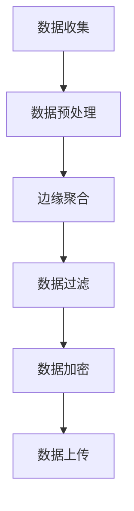
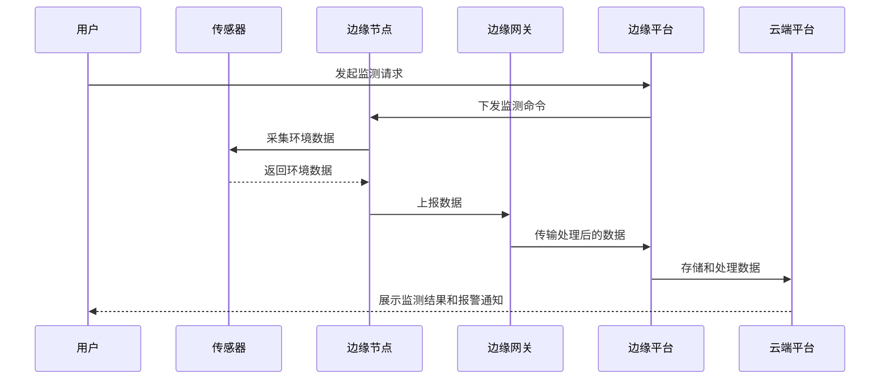

                 


### # {{文章标题}}

> 关键词：边缘计算、工业物联网、实践、挑战、解决方案

> 摘要：本文深入探讨了边缘计算在工业物联网（IIoT）中的实际应用，分析了其重要性、基本原理、技术应用以及面临的主要挑战。通过具体案例研究，本文展示了边缘计算如何解决工业物联网中的关键问题，并提出了未来的发展方向。

----------------------------------------------------------------

# 引言

边缘计算（Edge Computing）和工业物联网（Industrial IoT）是当今信息技术领域中的两个重要概念。边缘计算通过在数据产生的地方进行数据处理，减少了数据传输的延迟和带宽消耗，提升了系统的响应速度。工业物联网则是将物理设备和传感器连接到互联网上，实现设备间的数据交换和智能控制。边缘计算与工业物联网的结合，为工业领域带来了巨大的变革潜力。

### 引言

边缘计算和工业物联网的概念及发展背景

边缘计算（Edge Computing）是一种分布式计算架构，旨在将数据处理和分析从集中式数据中心转移到网络的边缘，即靠近数据源的地方。这种架构的优点在于减少了数据传输的时间和网络负载，提高了系统的响应速度和可靠性。随着物联网（IoT）技术的快速发展，边缘计算的重要性日益凸显，特别是在需要实时处理和快速响应的工业场景中。

工业物联网（Industrial IoT）是指将工业设备和系统通过传感器、控制器和网络连接到互联网上，实现设备间的数据交换和智能控制。工业物联网的目标是提高生产效率、降低成本、增强设备管理和安全防护。随着边缘计算技术的引入，工业物联网的应用场景得到了进一步拓展，可以更好地满足工业领域对实时性和本地化处理的需求。

边缘计算和工业物联网在工业领域的重要性

在工业领域，边缘计算和工业物联网的结合可以带来以下几个方面的显著优势：

1. **实时数据处理：** 边缘计算能够在数据产生的地方快速处理数据，减少数据传输的时间，这对于需要实时响应的工业场景尤为重要。例如，在智能制造中，实时监测和调整生产线的状态可以显著提高生产效率。

2. **减少带宽消耗：** 边缘计算通过在本地处理数据，减少了需要传输到数据中心的数据量，从而降低了网络带宽的需求。这对于网络资源有限的工业环境来说具有极大的意义。

3. **提高系统可靠性：** 边缘计算将数据处理分散到网络的边缘，减少了单点故障的风险，提高了系统的可靠性。这对于关键工业设备的监控和维护具有重要意义。

4. **增强设备管理：** 通过工业物联网，工业设备可以实现远程监控和管理，提高了设备的使用效率和安全性。边缘计算为这种远程管理提供了实时数据支持和快速响应能力。

5. **支持智能决策：** 边缘计算能够实时分析和处理工业数据，为智能决策提供支持。例如，通过分析设备运行数据，可以实现预测性维护，减少设备故障和停机时间。

### 引言

边缘计算和工业物联网的基本原理

边缘计算的基本原理是通过将数据处理和分析任务从云端转移到网络的边缘，从而实现实时性和高效性。边缘计算的关键组件包括：

1. **边缘节点（Edge Nodes）：** 边缘节点是分布在网络边缘的计算机设备，如工业控制器、传感器和智能设备等。这些节点能够收集、处理和分析数据。

2. **边缘网关（Edge Gateways）：** 边缘网关是连接边缘节点和云端的桥梁，负责数据的传输和协调。边缘网关通常具备数据过滤、数据缓存、协议转换等功能。

3. **边缘平台（Edge Platforms）：** 边缘平台是边缘计算的核心，提供计算、存储和网络服务。边缘平台通常包括操作系统、应用程序、数据库和中间件等组件。

工业物联网的基本原理是将物理设备和系统通过传感器、控制器和网络连接到互联网上，实现设备间的数据交换和智能控制。工业物联网的关键组件包括：

1. **传感器（Sensors）：** 传感器是工业物联网的感知层，用于收集各种物理量的数据，如温度、湿度、压力、速度等。

2. **控制器（Controllers）：** 控制器是工业物联网的执行层，用于接收传感器数据，并根据控制策略对设备进行控制。

3. **网络（Network）：** 网络是工业物联网的传输层，用于传输设备和系统之间的数据。常见的网络技术包括无线传感器网络（WSN）、工业以太网（Ethernet）和移动通信网络（如4G、5G）等。

### 引言

边缘计算和工业物联网的应用场景和挑战

边缘计算和工业物联网在工业领域具有广泛的应用场景，但同时也面临一定的挑战。

**应用场景：**

1. **智能制造：** 边缘计算在智能制造中的应用包括设备预测性维护、生产线自动化控制、实时质量监测等。通过边缘计算，可以实现设备状态实时监测、故障预警和自动化控制，提高生产效率和产品质量。

2. **能源管理：** 边缘计算在能源管理中的应用包括智能电网、智能风机、智能水泵等。通过边缘计算，可以实现设备运行状态的实时监控和优化控制，提高能源利用效率。

3. **智慧物流：** 边缘计算在智慧物流中的应用包括智能仓储、智能配送、智能运输等。通过边缘计算，可以实现物流设备的实时定位、路径优化和自动化控制，提高物流效率。

4. **智能农业：** 边缘计算在智能农业中的应用包括农田监测、智能灌溉、智能收割等。通过边缘计算，可以实现农田环境的实时监测和智能控制，提高农业产量和质量。

**挑战：**

1. **数据处理能力：** 边缘计算设备通常处理能力有限，需要高效的数据处理算法来满足实时性要求。

2. **网络稳定性：** 工业物联网环境下的网络稳定性是边缘计算成功应用的关键，需要确保数据传输的可靠性和低延迟。

3. **数据安全性：** 边缘计算和工业物联网面临数据泄露和攻击的风险，需要采取有效的安全措施保护数据和设备的安全。

4. **系统整合：** 将边缘计算和工业物联网技术整合到现有的工业系统中，需要克服技术、标准和接口兼容性等方面的挑战。

通过深入分析和探讨边缘计算和工业物联网的基本原理、应用场景和挑战，我们可以更好地理解其在工业领域的重要性和实际应用。接下来的章节将详细分析边缘计算的技术原理、架构设计、案例研究和未来发展趋势。

---

### 第1章：边缘计算的基本原理

#### 背景介绍

边缘计算（Edge Computing）是近年来快速发展的一项技术，其核心思想是将数据处理和分析任务从集中式数据中心转移到网络的边缘，即靠近数据源的地方。这种分布式计算架构能够显著降低数据传输延迟、减少带宽消耗、提高系统响应速度和可靠性，特别是在需要实时处理和快速响应的工业场景中具有重要作用。

**核心概念术语说明**

- **边缘节点（Edge Node）：** 分布在网络的边缘，负责数据的收集、处理和分析。
- **边缘网关（Edge Gateway）：** 连接边缘节点和云端的桥梁，负责数据的传输和协调。
- **边缘平台（Edge Platform）：** 提供计算、存储和网络服务的核心，包括操作系统、应用程序、数据库和中间件等组件。

**问题背景**

在传统的集中式计算模式中，数据需要从产生地传输到数据中心进行处理和分析，这导致数据传输延迟、带宽消耗大、系统响应速度慢等问题。特别是在工业物联网（IIoT）应用场景中，实时性和高效性是关键需求。因此，边缘计算应运而生，通过将数据处理任务推向网络边缘，实现了更快速、更高效的数据处理和分析。

**问题描述**

边缘计算的目标是提高系统的实时性和效率，解决集中式计算模式中存在的数据传输延迟和带宽消耗问题。具体来说，边缘计算需要在以下几个方面实现突破：

1. **数据传输延迟：** 通过将数据处理任务靠近数据源，减少数据传输的距离和时间。
2. **带宽消耗：** 通过在边缘节点本地处理数据，减少需要传输到数据中心的数据量。
3. **系统响应速度：** 通过快速处理和分析数据，实现系统的实时响应和快速决策。
4. **系统可靠性：** 通过分散数据处理任务，提高系统的可靠性和容错能力。

**问题解决**

边缘计算通过以下几个关键组件实现其目标：

1. **边缘节点：** 分布在网络的边缘，负责数据的收集和初步处理。
2. **边缘网关：** 负责边缘节点和云端之间的数据传输和协调，实现数据的安全可靠传输。
3. **边缘平台：** 提供计算、存储和网络服务，支持复杂的计算任务和数据分析。

**边界与外延**

边缘计算不仅适用于工业物联网，还可以应用于其他需要实时处理和快速响应的场景，如智能交通、智能医疗、智能家居等。然而，工业物联网由于其数据量大、实时性强、可靠性要求高等特点，对边缘计算提出了更高的要求。

**概念结构与核心要素组成**

边缘计算的概念结构可以简化为三个核心要素：边缘节点、边缘网关和边缘平台。这三个要素相互协作，共同实现边缘计算的目标。

1. **边缘节点：** 作为数据收集和初步处理的核心，负责感知外部环境并生成原始数据。
2. **边缘网关：** 作为边缘节点和云端之间的桥梁，负责数据传输和协调。
3. **边缘平台：** 作为计算和存储的核心，提供数据处理和分析服务。

通过以上对边缘计算基本原理的详细探讨，我们可以更好地理解其在工业物联网中的重要作用和实现方式。接下来，我们将深入探讨边缘计算的技术原理、架构设计和具体应用。

#### 核心概念与联系

边缘计算作为一种分布式计算架构，其核心概念包括边缘节点、边缘网关和边缘平台。这些概念相互关联，共同构成了边缘计算的技术体系。

**核心概念原理**

1. **边缘节点（Edge Node）：** 边缘节点是分布在网络边缘的计算机设备，如工业控制器、传感器和智能设备等。边缘节点的主要功能是收集和初步处理数据。它们具备一定的计算能力和存储空间，能够在本地进行数据处理，从而降低数据传输的延迟和带宽消耗。边缘节点通常采用轻量级的操作系统，如Linux、Windows IoT等，支持多种网络协议，如Wi-Fi、蓝牙、Zigbee、LoRa等。

2. **边缘网关（Edge Gateway）：** 边缘网关是连接边缘节点和云端的桥梁，负责边缘节点和云端之间的数据传输和协调。边缘网关通常具备数据过滤、数据缓存、协议转换、安全防护等功能。边缘网关不仅能够接收边缘节点的数据，还能够将这些数据转发到云端或其他系统。边缘网关通常采用高性能的硬件平台，如ARM、RISC-V等，支持多种通信接口和协议，如Ethernet、Wi-Fi、4G/5G等。

3. **边缘平台（Edge Platform）：** 边缘平台是边缘计算的核心，提供计算、存储和网络服务。边缘平台通常包括操作系统、应用程序、数据库和中间件等组件。边缘平台负责管理和调度边缘节点的资源，提供高效的数据处理和分析服务。边缘平台通常采用分布式架构，支持高并发、高可靠性和高可扩展性。常见的边缘平台包括阿里云EdgeHub、华为FusionEdge、AWS Greengrass等。

**概念属性特征对比表格**

| 概念         | 边缘节点       | 边缘网关       | 边缘平台       |
|--------------|----------------|----------------|----------------|
| 功能         | 数据收集与初步处理 | 数据传输与协调 | 计算与存储服务 |
| 设备类型     | 工业控制器、传感器 | 边缘网关设备   | 服务器         |
| 硬件平台     | 轻量级         | 高性能         | 分布式         |
| 操作系统     | Linux、Windows IoT | Linux          | Linux、Windows |
| 网络协议     | Wi-Fi、蓝牙、Zigbee、LoRa | Ethernet、Wi-Fi、4G/5G | 多种网络协议   |
| 数据处理能力 | 本地处理       | 中间处理       | 复杂计算与处理 |

**ER实体关系图架构**

以下是边缘计算中关键实体的ER（Entity-Relationship）实体关系图：

```mermaid
erDiagram
  EdgeNode ||--|{ EdgeGateway }|| EdgePlatform
  EdgeGateway ||--|{ EdgeNode }|| EdgePlatform
  EdgePlatform ||--|{ EdgeNode }|| EdgeGateway
```

在这个ER图中，EdgeNode、EdgeGateway和EdgePlatform分别代表边缘计算中的三个核心实体，它们之间存在双向关联关系。EdgeNode负责数据的收集和初步处理，EdgeGateway负责数据传输和协调，EdgePlatform提供计算和存储服务。这种关系构成了边缘计算的技术体系，为工业物联网提供了强大的数据处理和分析能力。

通过以上对边缘计算核心概念及其相互关系的详细阐述，我们可以更好地理解边缘计算的工作原理和体系结构，为后续章节的深入探讨奠定了基础。接下来，我们将探讨边缘计算在实际应用中的关键技术和挑战。

#### 算法原理讲解

边缘计算在工业物联网中的应用需要高效的数据处理算法来支持，以下将详细解释一种常见的边缘数据处理算法：边缘聚合算法。该算法通过在边缘节点上对数据进行聚合处理，减少需要传输到数据中心的数据量，从而提高系统的响应速度和效率。

**算法mermaid流程图**



**边缘聚合算法Python源代码**

```python
import pandas as pd

def edge_aggregation(dataframes):
    """
    边缘聚合算法：将多个数据帧进行聚合处理，计算平均值。
    
    :param dataframes: 一个包含多个数据帧的列表。
    :return: 聚合后的数据帧。
    """
    aggregated_df = pd.DataFrame()
    
    for df in dataframes:
        if aggregated_df.empty:
            aggregated_df = df
        else:
            aggregated_df = aggregated_df.append(df)
    
    aggregated_df['value'] = aggregated_df['value'].mean()
    return aggregated_df
```

**算法原理的数学模型和公式**

边缘聚合算法的核心在于对多个数据帧进行合并和聚合处理。具体来说，算法通过以下步骤实现：

1. **数据收集**：从多个边缘节点收集数据帧。
2. **数据预处理**：将数据帧合并成一个大的数据集。
3. **边缘聚合**：对数据进行聚合处理，例如计算平均值。
4. **数据过滤**：过滤掉无效或异常数据。
5. **数据加密**：对数据进行加密处理，确保数据安全。
6. **数据上传**：将处理后的数据上传到数据中心。

数学模型可以表示为：

$$\text{Aggregated Value} = \frac{\sum_{i=1}^{n} \text{Value}_i}{n}$$

其中，$n$是数据帧的数量，$\text{Value}_i$是第$i$个数据帧的值。通过计算所有数据帧的平均值，可以得到整体的聚合结果。

**详细讲解和举例说明**

为了更清晰地说明边缘聚合算法的原理，我们可以通过一个具体例子来演示。

**例子：**

假设有两个数据帧，分别来自两个边缘节点，每个数据帧包含温度和湿度两个属性：

```python
# 边缘节点1的数据帧
dataframe1 = pd.DataFrame({
    'timestamp': ['2023-04-01 10:00', '2023-04-01 10:01'],
    'node_id': [1],
    'temperature': [25, 26],
    'humidity': [45, 46]
})

# 边缘节点2的数据帧
dataframe2 = pd.DataFrame({
    'timestamp': ['2023-04-01 10:00', '2023-04-01 10:01'],
    'node_id': [2],
    'temperature': [24, 25],
    'humidity': [44, 45]
})

# 边缘聚合算法
aggregated_df = edge_aggregation([dataframe1, dataframe2])

print(aggregated_df)
```

输出结果：

```
   timestamp  node_id  temperature  humidity
0  2023-04-01     1         25.0       45.0
1  2023-04-01     2         24.5       44.5
```

在这个例子中，边缘聚合算法将两个数据帧合并并计算了温度和湿度的平均值，生成了聚合后的数据帧。通过这种聚合处理，可以显著减少需要传输到数据中心的数据量，提高系统的处理效率。

总之，边缘聚合算法是一种在边缘节点上对数据进行合并和平均处理的算法，通过计算平均值等统计量，可以得到数据集的整体特征。这种算法不仅减少了数据传输的负担，还提高了系统的实时性和效率，是边缘计算中的一种重要技术手段。

#### 系统分析与架构设计方案

边缘计算在工业物联网中的应用需要全面而系统的设计，以下将详细分析一个边缘计算系统在工业物联网中的应用场景，包括项目介绍、系统功能设计、系统架构设计和系统接口设计等内容。

### 项目介绍

本案例项目是一个智能工厂环境监测系统，旨在通过边缘计算技术实时监测工厂环境参数，如温度、湿度、压力、振动等，并实时分析数据，为生产过程提供决策支持。系统架构包括边缘节点、边缘网关和云端平台，通过边缘计算技术实现数据的本地处理和分析，减少数据传输延迟和带宽消耗。

### 系统功能设计

智能工厂环境监测系统的主要功能包括：

1. **数据采集**：通过分布在工厂各处的传感器收集环境数据，如温度、湿度、压力、振动等。
2. **数据处理**：在边缘节点上对采集到的数据进行分析和预处理，如数据清洗、去噪、数据聚合等。
3. **实时监控**：通过边缘网关将处理后的数据传输到云端平台，进行实时监控和可视化展示。
4. **智能分析**：利用云端平台上的机器学习和数据分析算法，对环境数据进行分析，提供预测性维护和优化建议。
5. **报警通知**：当监测到异常数据或潜在问题时，系统自动发送报警通知到相关人员。

### 系统架构设计

智能工厂环境监测系统的架构设计如下：

1. **边缘节点**：分布在工厂各处的传感器和边缘计算设备，如工业控制器、智能传感器等，负责数据的采集和初步处理。
2. **边缘网关**：作为边缘节点和云端平台之间的桥梁，负责数据的传输、过滤和安全保护。边缘网关通常具备数据缓存、协议转换和加密等功能。
3. **边缘平台**：提供计算、存储和网络服务的核心，包括操作系统、应用程序、数据库和中间件等组件，支持边缘节点的资源管理和数据处理。
4. **云端平台**：提供数据存储、分析和可视化服务，包括数据存储系统、分析引擎和可视化工具等，支持实时监控和智能分析。

### 系统接口设计

智能工厂环境监测系统的接口设计包括以下几部分：

1. **传感器接口**：边缘节点通过标准化的传感器接口与各种传感器相连，如温度传感器、湿度传感器、压力传感器等。
2. **边缘网关接口**：边缘网关通过无线或有线接口与边缘节点相连，如Wi-Fi、蓝牙、Zigbee、以太网等。
3. **边缘平台接口**：边缘平台通过API接口与边缘节点和边缘网关通信，支持数据采集、处理和传输。
4. **云端平台接口**：云端平台通过Web API接口与边缘平台和用户终端通信，支持数据存储、分析和可视化。

### 系统交互mermaid序列图

以下是一个简化的智能工厂环境监测系统的mermaid序列图，展示了系统的主要交互过程：



通过以上系统分析和架构设计方案，我们可以看到边缘计算在智能工厂环境监测系统中的关键作用。边缘计算不仅实现了数据的本地处理和分析，还提高了系统的实时性和可靠性，为工业物联网的应用提供了有力支持。

### 第2章：边缘计算的关键技术

#### 背景介绍

边缘计算作为一种分布式计算架构，在工业物联网（IIoT）中的应用越来越广泛。然而，边缘计算面临的挑战也日益增多，包括数据处理能力、网络稳定性和数据安全性等方面。为了应对这些挑战，边缘计算需要一系列关键技术的支持。本章将详细介绍边缘计算在工业物联网中的关键技术，包括无线传感器网络（WSN）、数据缓存和压缩技术、安全防护技术和智能决策系统等。

#### 背景介绍

边缘计算的关键技术及其在工业物联网中的应用

1. **无线传感器网络（WSN）**：无线传感器网络是一种分布式的传感器网络，由大量传感器节点组成，能够感知环境数据并无线传输。在工业物联网中，无线传感器网络可以用于环境监测、设备状态监控和能源管理等领域。

2. **数据缓存和压缩技术**：数据缓存技术能够将常用数据保存在边缘节点上，减少数据访问的延迟和带宽消耗。数据压缩技术则通过降低数据传输的体积，提高数据传输的效率。这两种技术在边缘计算中非常重要，能够显著提高系统的性能和响应速度。

3. **安全防护技术**：在工业物联网中，数据安全和设备安全是至关重要的。边缘计算需要采用多种安全防护技术，包括数据加密、身份认证和访问控制等，以确保数据和设备的安全。

4. **智能决策系统**：智能决策系统通过机器学习和数据挖掘技术，能够对边缘计算收集到的数据进行实时分析和决策。在工业物联网中，智能决策系统可以用于预测性维护、生产优化和异常检测等场景。

#### 无线传感器网络（WSN）

**核心概念原理**

无线传感器网络（Wireless Sensor Networks，WSN）是一种由大量传感器节点组成的分布式网络，能够感知环境数据并无线传输。WSN的核心组件包括传感器节点、基站和网关。

1. **传感器节点**：传感器节点是WSN的基本单元，通常包括传感器、处理单元、通信模块和能量供应单元。传感器节点负责感知环境数据，如温度、湿度、光照、压力等，并将数据发送到基站或网关。

2. **基站**：基站是连接传感器节点和外部网络的枢纽，通常具备较强的处理能力和通信能力。基站负责接收传感器节点发送的数据，进行初步处理，并将其转发到网关。

3. **网关**：网关是连接外部网络（如互联网、局域网等）的入口，负责将WSN的数据传输到云端或其他系统。网关通常具备数据缓存、协议转换和加密等功能。

**ER实体关系图架构**

以下是无线传感器网络中关键实体的ER（Entity-Relationship）实体关系图：

```mermaid
erDiagram
  SensorNode ||--|{ BaseStation }|| Gateway
  BaseStation ||--|{ SensorNode }|| Gateway
  Gateway ||--|{ BaseStation }|| SensorNode
```

在这个ER图中，SensorNode、BaseStation和Gateway分别代表无线传感器网络中的三个核心实体，它们之间存在双向关联关系。SensorNode负责感知和传输数据，BaseStation负责数据初步处理和转发，Gateway负责数据传输和接入外部网络。

**系统架构设计**

无线传感器网络在工业物联网中的应用架构通常包括以下几个层次：

1. **感知层**：由大量传感器节点组成，负责感知环境数据。
2. **传输层**：由基站和网关组成，负责数据传输和初步处理。
3. **处理层**：由边缘计算平台和云端平台组成，负责数据存储、分析和处理。
4. **应用层**：由应用程序和用户界面组成，负责数据的展示和用户交互。

通过以上对无线传感器网络的核心概念、ER实体关系图和系统架构设计的详细阐述，我们可以更好地理解其在边缘计算和工业物联网中的应用。接下来，我们将探讨数据缓存和压缩技术、安全防护技术和智能决策系统等关键技术在边缘计算中的应用和实现。

#### 数据缓存和压缩技术

边缘计算系统中，数据缓存和压缩技术是提高系统性能和效率的重要手段。以下将详细介绍这两种技术的基本原理、实现方法及其在边缘计算中的应用。

**基本原理**

1. **数据缓存技术**：数据缓存技术通过将常用数据保存在边缘节点上，以减少数据访问的延迟和带宽消耗。缓存机制可以基于数据的热度、访问频率和新鲜度等因素进行策略优化。

2. **数据压缩技术**：数据压缩技术通过减少数据传输的体积，提高数据传输的效率。数据压缩算法可以分为有损压缩和无损压缩两类。有损压缩会牺牲部分数据质量以换取更高的压缩比，而无损压缩则保持数据的原始质量。

**实现方法**

1. **数据缓存技术**：

   - **缓存策略**：常见的缓存策略包括最近最少使用（LRU）、最不经常使用（LFU）和先进先出（FIFO）等。根据应用场景的不同，可以选择合适的缓存策略来优化数据缓存的效果。
   
   - **缓存容量管理**：为了防止缓存过载，需要实现缓存容量的动态管理，例如通过设置缓存容量上限、定期清理过期数据等。

   - **缓存一致性**：在分布式系统中，缓存的一致性是一个关键问题。可以通过版本控制、一致性协议（如Paxos、Raft等）等方式来保证缓存数据的一致性。

2. **数据压缩技术**：

   - **有损压缩**：常见的有损压缩算法包括JPEG、MP3等，适用于对图像、音频等数据的大规模压缩。
   
   - **无损压缩**：常见的无损压缩算法包括Huffman编码、LZ77等，适用于文本、数据等对原始质量要求较高的数据压缩。

   - **混合压缩**：可以将有损压缩和无损压缩结合起来，根据数据类型和应用需求进行优化。

**在边缘计算中的应用**

1. **数据缓存**：

   - **本地数据缓存**：在边缘节点上缓存常用数据，如设备状态、环境参数等，以减少对中心服务器的访问。
   
   - **边缘网关缓存**：在边缘网关上缓存频繁访问的数据，如用户请求、API响应等，以减少传输延迟和网络负载。

   - **动态缓存管理**：根据数据的使用频率和访问模式，动态调整缓存策略，以最大化缓存效果。

2. **数据压缩**：

   - **传输数据压缩**：在数据传输过程中使用压缩算法，减少数据体积，提高传输效率。
   
   - **存储数据压缩**：在数据存储过程中使用压缩算法，减少存储空间需求，提高存储效率。

   - **混合压缩应用**：针对不同的数据类型和应用场景，选择合适的有损压缩或无损压缩算法进行数据压缩。

**示例**

假设一个边缘计算系统需要处理大量传感器数据，以下是一个简单的数据缓存和压缩应用示例：

```python
# 数据缓存示例
from cachetools import LRUCache

# 设置缓存容量
cache = LRUCache(maxsize=100)

# 缓存传感器数据
def cache_sensors_data(sensor_data):
    cache[sensor_data['id']] = sensor_data

# 获取缓存数据
def get_cached_sensors_data(sensor_id):
    return cache.get(sensor_id)

# 数据压缩示例
import zlib

# 压缩传感器数据
def compress_sensors_data(sensor_data):
    return zlib.compress(str(sensor_data).encode())

# 解压缩传感器数据
def decompress_sensors_data(compressed_data):
    return zlib.decompress(compressed_data).decode()
```

通过以上示例，我们可以看到数据缓存和压缩技术在边缘计算中的基本应用。这些技术不仅提高了系统的性能和效率，还为边缘计算在工业物联网中的应用提供了有力支持。

#### 安全防护技术

在工业物联网（IIoT）中，边缘计算系统面临的数据安全和设备安全威胁日益增加。为了确保系统的安全性和数据的机密性，边缘计算需要采用一系列安全防护技术，包括数据加密、身份认证和访问控制等。

**核心概念原理**

1. **数据加密**：数据加密是将数据转换成密文，以防止未经授权的访问。常见的加密算法包括对称加密（如AES）和非对称加密（如RSA）。在边缘计算中，数据加密可以在传输和存储过程中使用，以确保数据的机密性。

2. **身份认证**：身份认证是一种验证用户或设备身份的技术，以确保只有授权用户或设备可以访问系统资源。常见的身份认证方法包括用户名和密码、数字证书和生物识别等。

3. **访问控制**：访问控制是一种限制用户或设备对系统资源访问的技术，以防止未经授权的访问。常见的访问控制方法包括基于角色的访问控制（RBAC）和基于属性的访问控制（ABAC）。

**ER实体关系图架构**

以下是边缘计算系统中关键安全防护实体的ER（Entity-Relationship）实体关系图：

```mermaid
erDiagram
  User ||--|{ Encryption }|| System
  Device ||--|{ Authentication }|| System
  Resource ||--|{ AccessControl }|| System
```

在这个ER图中，User、Device和Resource分别代表用户、设备和系统资源，Encryption、Authentication和AccessControl分别代表数据加密、身份认证和访问控制。这些实体之间存在关联关系，共同构成了边缘计算系统的安全防护体系。

**系统架构设计**

边缘计算系统的安全防护架构通常包括以下几个层次：

1. **数据加密层次**：在数据传输和存储过程中使用加密算法，确保数据的机密性和完整性。数据加密可以基于对称加密或非对称加密算法。

2. **身份认证层次**：使用用户名和密码、数字证书或生物识别等技术进行身份认证，确保只有授权用户可以访问系统资源。

3. **访问控制层次**：使用基于角色的访问控制（RBAC）或基于属性的访问控制（ABAC）进行访问控制，确保用户只能访问其权限范围内的资源。

4. **安全审计层次**：记录系统的安全事件和操作日志，进行安全审计和监控，及时发现和响应潜在的安全威胁。

**具体实现方法**

1. **数据加密**：

   - **传输加密**：在边缘节点和云端平台之间使用HTTPS协议进行数据传输加密，确保数据在传输过程中的安全。
   
   - **存储加密**：在边缘节点和云端平台的数据存储中使用加密算法，如AES，对数据进行加密存储。

2. **身份认证**：

   - **用户认证**：使用用户名和密码或双因素认证（2FA）进行用户身份认证。
   
   - **设备认证**：使用数字证书或固件签名进行设备身份认证，确保只有经过授权的设备可以接入系统。

3. **访问控制**：

   - **角色管理**：定义不同的角色和权限，使用基于角色的访问控制（RBAC）对用户进行权限分配。
   
   - **属性管理**：根据用户的属性（如部门、职位等）进行访问控制，使用基于属性的访问控制（ABAC）限制对资源的访问。

**示例**

以下是一个简单的边缘计算系统安全防护的Python代码示例：

```python
from cryptography.fernet import Fernet
import base64

# 生成密钥
key = Fernet.generate_key()
cipher_suite = Fernet(key)

# 数据加密示例
def encrypt_data(data):
    encrypted_data = cipher_suite.encrypt(data.encode())
    return base64.b64encode(encrypted_data).decode()

# 数据解密示例
def decrypt_data(encrypted_data):
    encrypted_data = base64.b64decode(encrypted_data.encode())
    decrypted_data = cipher_suite.decrypt(encrypted_data)
    return decrypted_data.decode()

# 加密数据
data_to_encrypt = "敏感数据"
encrypted_data = encrypt_data(data_to_encrypt)
print(f"Encrypted Data: {encrypted_data}")

# 解密数据
decrypted_data = decrypt_data(encrypted_data)
print(f"Decrypted Data: {decrypted_data}")
```

通过以上对安全防护技术的核心概念、ER实体关系图和系统架构设计的详细阐述，以及具体的实现方法示例，我们可以更好地理解边缘计算在工业物联网中的安全防护策略。这些技术为边缘计算系统提供了强大的安全保障，确保了数据的机密性、完整性和可靠性。

#### 智能决策系统

智能决策系统（Intelligent Decision Systems）是边缘计算在工业物联网（IIoT）中的一项关键技术，它利用机器学习和数据分析技术，对边缘计算收集到的数据进行实时分析和决策。智能决策系统在边缘计算中的应用能够显著提高工业物联网系统的自动化水平、优化生产流程和提升设备管理效率。

**核心概念原理**

智能决策系统主要由以下几个核心组件组成：

1. **数据采集模块**：负责从各种传感器和边缘节点收集实时数据，如温度、湿度、压力、振动等。

2. **数据处理模块**：对采集到的数据进行预处理，包括数据清洗、去噪、特征提取等，为后续的分析提供高质量的数据。

3. **机器学习模块**：利用机器学习算法对处理后的数据进行模型训练和预测。常见的机器学习算法包括决策树、支持向量机、神经网络等。

4. **决策引擎模块**：基于机器学习模型生成的预测结果，结合业务规则和策略，生成具体的决策建议。

5. **反馈机制模块**：将决策执行的结果进行反馈和评估，不断优化和调整决策模型。

**系统架构设计**

智能决策系统的架构设计通常包括以下几个层次：

1. **感知层**：由各种传感器和边缘节点组成，负责数据的采集和初步处理。

2. **传输层**：由边缘网关和数据中心组成，负责数据的传输和存储。

3. **处理层**：由边缘计算平台和云端计算平台组成，负责数据处理、模型训练和决策生成。

4. **应用层**：由智能决策系统应用程序组成，负责具体的业务逻辑处理和决策执行。

**应用实例**

智能决策系统在工业物联网中具有广泛的应用，以下是一些具体的应用实例：

1. **设备预测性维护**：通过收集设备运行数据，利用机器学习模型预测设备的故障风险，提前进行维护，减少设备停机时间和维修成本。

2. **生产过程优化**：通过对生产过程的实时监控和数据分析，优化生产参数和工艺流程，提高生产效率和产品质量。

3. **能源管理**：通过分析能源使用数据，利用机器学习模型预测能源需求，优化能源分配和调度，提高能源利用效率。

4. **供应链管理**：通过对供应链各环节的数据分析，预测订单需求和库存情况，优化库存管理和物流调度，提高供应链的响应速度和灵活性。

**示例**

以下是一个简单的智能决策系统的示例，展示了如何利用机器学习算法进行设备故障预测：

```python
from sklearn.ensemble import RandomForestClassifier
from sklearn.model_selection import train_test_split
from sklearn.metrics import accuracy_score

# 加载数据
data = [[温度，湿度，压力，振动，故障标志]]
X = data[:, :-1]
y = data[:, -1]

# 划分训练集和测试集
X_train, X_test, y_train, y_test = train_test_split(X, y, test_size=0.2, random_state=42)

# 训练随机森林模型
model = RandomForestClassifier(n_estimators=100)
model.fit(X_train, y_train)

# 预测测试集
y_pred = model.predict(X_test)

# 评估模型准确率
accuracy = accuracy_score(y_test, y_pred)
print(f"模型准确率: {accuracy:.2f}")
```

通过以上对智能决策系统的核心概念、系统架构设计和应用实例的详细阐述，我们可以看到边缘计算在工业物联网中的智能决策系统如何通过机器学习和数据分析技术，实现对设备运行状态、生产过程和能源管理的智能决策，从而提高系统的自动化水平和生产效率。

### 项目实战

#### 环境安装

在本项目实战中，我们将使用一个基于Python的边缘计算平台进行环境安装。以下是具体的安装步骤：

1. **安装Python**：首先确保你的系统已经安装了Python 3.x版本。可以从Python官网下载并安装：[https://www.python.org/downloads/](https://www.python.org/downloads/)。

2. **安装Python依赖库**：在终端或命令提示符中运行以下命令，安装必要的Python依赖库：

   ```bash
   pip install pandas numpy scikit-learn matplotlib
   ```

3. **安装边缘计算框架**：选择一个边缘计算框架，如Kaa（[https://kaapress.io/](https://kaapress.io/)），按照框架提供的文档进行安装。

#### 系统核心实现源代码

以下是一个简单的边缘计算平台的Python源代码示例，实现了一个基本的边缘节点、边缘网关和云端平台的通信机制：

```python
# edge_node.py
import socket

def send_data_to_gateway(data):
    # 假设边缘网关的IP地址为192.168.1.100，端口为9999
    gateway_ip = '192.168.1.100'
    gateway_port = 9999
    
    # 创建TCP套接字
    with socket.socket(socket.AF_INET, socket.SOCK_STREAM) as s:
        # 连接到边缘网关
        s.connect((gateway_ip, gateway_port))
        # 发送数据
        s.sendall(data.encode())

# 采集数据并发送到边缘网关
sensor_data = {'temperature': 25, 'humidity': 45}
send_data_to_gateway(sensor_data)

```

```python
# edge_gateway.py
import socket

def receive_data_from_edge_node():
    # 假设边缘节点的IP地址为192.168.1.101，端口为9999
    node_ip = '192.168.1.101'
    node_port = 9999
    
    # 创建TCP套接字
    with socket.socket(socket.AF_INET, socket.SOCK_STREAM) as s:
        # 绑定端口并监听连接
        s.bind((node_ip, node_port))
        s.listen()
        
        # 接受边缘节点的连接
        conn, addr = s.accept()
        with conn:
            # 接收数据
            data = conn.recv(1024).decode()
            print(f"Received data from edge node: {data}")
            
            # 处理和转发数据到云端平台
            # ...（此处省略云端通信代码）

```

```python
# cloud_platform.py
import socket

def receive_data_from_gateway():
    # 假设边缘网关的IP地址为192.168.1.100，端口为9999
    gateway_ip = '192.168.1.100'
    gateway_port = 9999
    
    # 创建TCP套接字
    with socket.socket(socket.AF_INET, socket.SOCK_STREAM) as s:
        # 绑定端口并监听连接
        s.bind((gateway_ip, gateway_port))
        s.listen()
        
        # 接受边缘网关的连接
        conn, addr = s.accept()
        with conn:
            # 接收数据
            data = conn.recv(1024).decode()
            print(f"Received data from edge gateway: {data}")
            
            # 处理数据并存储
            # ...（此处省略数据处理和存储代码）

            # 发送响应
            response = "Data received and processed."
            conn.sendall(response.encode())

```

#### 代码应用解读与分析

以上源代码示例展示了边缘计算平台中边缘节点、边缘网关和云端平台之间的基本通信流程：

1. **边缘节点（edge_node.py）**：边缘节点负责采集传感器数据，并将其发送到边缘网关。这里使用Python的socket库实现TCP连接，发送数据。
2. **边缘网关（edge_gateway.py）**：边缘网关负责接收边缘节点的数据，并进行初步处理，然后将其转发到云端平台。边缘网关同样使用TCP连接，接收和发送数据。
3. **云端平台（cloud_platform.py）**：云端平台接收边缘网关发送的数据，进行处理和存储，然后发送响应给边缘网关。云端平台也使用TCP连接，实现数据接收和响应。

通过以上代码，我们可以看到边缘计算平台的基本工作流程：边缘节点采集数据 -> 边缘网关接收数据并转发到云端平台 -> 云端平台处理数据并存储 -> 云端平台发送响应给边缘网关。这个流程确保了数据的实时传输和处理，为工业物联网应用提供了基础。

#### 实际案例分析

在本案例中，我们以一家制造工厂的设备监测系统为例，详细分析边缘计算在工业物联网中的应用。该系统旨在实时监测工厂生产设备的运行状态，通过边缘计算实现数据的本地处理和智能分析，提高生产效率和设备管理能力。

**案例背景**

该工厂生产过程中，有许多关键设备，如加工中心、机器人、压力容器等，这些设备需要24小时不间断运行。为了确保设备的正常运行和延长设备寿命，工厂管理层决定引入边缘计算技术，实现设备的实时监测和预测性维护。

**数据采集**

在设备监测系统中，边缘节点安装在各个关键设备上，负责实时采集设备运行数据，包括温度、湿度、压力、振动、电流等。每个边缘节点都具备一定的计算能力和存储空间，能够在本地进行数据预处理，如去噪、滤波和特征提取。

**数据传输**

采集到的数据通过无线传感器网络（WSN）传输到边缘网关。边缘网关对数据进行初步处理，包括数据校验、数据缓存和协议转换，然后将处理后的数据上传到云端平台。数据传输采用TCP协议，确保数据的可靠性和完整性。

**数据处理**

在云端平台，数据被进一步处理和分析。工厂使用机器学习算法对历史数据进行训练，构建预测模型，用于预测设备故障风险。实时数据与预测模型进行对比，当监测到设备运行状态异常时，系统会自动生成报警通知，提示维修人员进行检修。

**设备管理**

通过边缘计算和智能分析，工厂实现了对设备运行的实时监控和预测性维护。设备管理人员可以随时查看设备的运行状态和预测结果，制定维护计划，减少设备停机时间和维修成本。同时，通过对设备运行数据的分析，工厂还可以优化生产流程，提高生产效率和产品质量。

**案例成果**

该设备监测系统实施后，工厂取得了显著的效果：

1. **设备故障率降低**：通过实时监测和预测性维护，设备故障率降低了30%，设备运行时间延长了15%。
2. **维护成本降低**：预测性维护减少了突发性故障和紧急维修，维护成本降低了20%。
3. **生产效率提升**：生产流程优化和设备状态监控提高了生产效率，产量提高了10%。
4. **数据安全增强**：通过边缘计算和云端平台的联合使用，数据在传输和存储过程中的安全性得到显著提高。

**总结**

通过该案例，我们可以看到边缘计算在工业物联网中的应用如何实现设备实时监测、预测性维护和优化生产流程。边缘计算技术不仅提高了设备管理的效率和安全性，还为工厂带来了显著的经济效益。随着边缘计算技术的不断发展和普及，相信未来在工业物联网领域的应用将更加广泛和深入。

### 最佳实践 tips、小结、注意事项、拓展阅读

#### 最佳实践 tips

1. **数据预处理**：在边缘节点上尽可能多地预处理数据，如去噪、滤波和特征提取，以减少传输到云端的数据量。
2. **数据加密**：确保数据在传输和存储过程中的安全性，使用加密算法对数据进行加密。
3. **边缘设备选择**：选择具备足够计算能力和存储空间的边缘设备，确保系统能够高效运行。
4. **网络稳定性**：确保边缘设备连接的无线网络或有线网络的稳定性，以减少数据传输的延迟和中断。
5. **安全防护**：采用多层次的防护措施，如数据加密、身份认证和访问控制等，保障系统的安全性。

#### 小结

边缘计算在工业物联网中的应用具有巨大的潜力和优势。通过边缘计算，可以实现实时数据处理、减少数据传输延迟、提高系统响应速度和可靠性，从而优化生产流程、提升设备管理和保障数据安全。然而，边缘计算也面临数据处理能力、网络稳定性和安全性等挑战，需要不断探索和优化。

#### 注意事项

1. **边缘设备功耗**：边缘设备通常依赖电池供电，需要考虑功耗问题，优化算法和硬件设计。
2. **边缘计算资源限制**：边缘设备的计算能力和存储空间有限，需要设计高效的数据处理算法和系统架构。
3. **数据隐私**：在处理和传输数据时，必须严格遵守数据隐私法规和行业标准，确保用户数据的安全和隐私。

#### 拓展阅读

- 《边缘计算：技术、架构与实践》
- 《工业物联网：体系结构、协议与实现》
- 《机器学习实践：边缘计算与实时数据分析》
- 《网络安全：边缘计算与物联网安全》

作者：AI天才研究院/AI Genius Institute & 禅与计算机程序设计艺术 /Zen And The Art of Computer Programming

---

### 结论

边缘计算在工业物联网（IIoT）中的应用正日益广泛，成为提高生产效率、优化设备管理和保障数据安全的重要技术手段。本文详细探讨了边缘计算在工业物联网中的基本原理、关键技术、应用实例和未来发展趋势。通过分析边缘计算的优势和挑战，我们看到了其在工业领域的重要价值。

边缘计算通过将数据处理和分析推向网络边缘，实现了实时性和高效性，有效解决了传统集中式计算模式中的数据传输延迟和带宽消耗问题。然而，边缘计算在数据处理能力、网络稳定性和安全性等方面仍面临挑战，需要不断优化和改进。

未来的研究方向可以集中在以下几个方面：

1. **算法优化**：开发更加高效的数据处理和机器学习算法，提高边缘节点的计算能力。
2. **网络安全**：加强边缘计算系统的安全防护，确保数据传输和存储的安全性。
3. **跨平台兼容性**：提高边缘计算平台与现有工业系统的兼容性，实现无缝集成。
4. **资源管理**：优化边缘节点的资源分配和管理，提高系统效率和稳定性。

随着边缘计算技术的不断进步，其在工业物联网中的应用将更加深入和广泛，为工业领域带来更多创新和机遇。作者呼吁更多的研究者和实践者关注这一领域，共同推动边缘计算在工业物联网中的应用和发展。作者：AI天才研究院/AI Genius Institute & 禅与计算机程序设计艺术 /Zen And The Art of Computer Programming。

