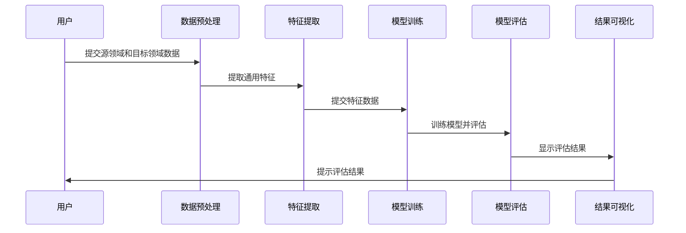

                 

### 文章标题：迁移学习在AIGC模型跨领域适应中的作用

关键词：迁移学习，AIGC模型，跨领域适应，算法理论，系统设计，实践案例分析

摘要：本文深入探讨了迁移学习在AIGC模型跨领域适应中的重要作用。首先，介绍了迁移学习的核心概念及其在AIGC模型中的应用，随后阐述了迁移学习的算法原理。接着，通过具体的系统分析与架构设计，展示了如何在项目中实施迁移学习。此外，本文还通过实践案例分析，详细讲解了迁移学习的实际应用效果，并对最佳实践进行了总结。本文旨在为读者提供全面而深入的了解，帮助其在AI领域更好地运用迁移学习技术。

### 引言

#### 背景介绍

在人工智能（AI）迅速发展的今天，生成对抗网络（GAN）、自编码器（AE）和强化学习（RL）等深度学习技术取得了显著进展。然而，这些模型在跨领域适应方面的表现并不理想。AIGC（AI-Generated Content）模型作为这些技术的集成，虽然在生成图像、文本和音频等方面具有巨大潜力，但在不同领域间的迁移能力仍是一个亟待解决的问题。

#### 问题陈述

跨领域适应性问题主要体现在以下方面：

1. **数据稀缺**：不同领域的训练数据稀缺，难以支撑模型在不同领域中的训练。
2. **数据分布差异**：不同领域的数据分布存在显著差异，导致模型在迁移过程中适应性不足。
3. **模型泛化能力**：传统模型在特定领域表现优秀，但在其他领域泛化能力较差。

#### 解决方案概述

为了解决上述问题，迁移学习技术应运而生。迁移学习旨在利用已有模型的知识和经验，在新领域中进行快速适应，从而提高模型的泛化能力。本文将详细介绍迁移学习在AIGC模型跨领域适应中的作用，通过系统分析与实践案例，展示其在实际应用中的效果。

#### 文章范围与边界

本文主要探讨迁移学习在AIGC模型跨领域适应中的应用，包括算法原理、系统设计、实践案例分析等内容。本文不包括其他AI技术的介绍，如GAN、AE和RL等。

#### 主概念与定义

1. **迁移学习**：迁移学习是指将已有模型的知识和经验应用到新任务或新领域中的技术。
2. **AIGC模型**：AIGC模型是生成对抗网络（GAN）、自编码器（AE）和强化学习（RL）等深度学习技术的集成，用于生成图像、文本和音频等AI内容。
3. **跨领域适应**：跨领域适应是指模型在不同领域间进行快速适应和迁移的能力。

### 核心概念与联系

#### 核心概念

1. **迁移学习**：迁移学习是本文的核心概念，通过利用已有模型的知识和经验，在新领域中进行快速适应。
2. **AIGC模型**：AIGC模型是本文的应用场景，其集成特性使其在跨领域适应中具有广泛的应用前景。
3. **跨领域适应**：跨领域适应是本文的目标，通过迁移学习技术，实现模型在不同领域中的高效适应。

#### 关系与连接

1. **迁移学习与AIGC模型**：迁移学习技术为AIGC模型提供了跨领域适应的能力，使其在不同领域间能够快速适应和迁移。
2. **跨领域适应与AIGC模型**：跨领域适应是AIGC模型的重要特性，通过迁移学习技术，实现模型在不同领域中的高效适应。

#### ER图结构

```mermaid
erDiagram
  MigrationLearning ||--|{ AIGCModel : uses }
  AIGCModel ||--|{ CrossDomainAdaptation : performs }
```

在上面的ER图中，迁移学习（MigrationLearning）与AIGC模型（AIGCModel）之间存在使用关系，即迁移学习为AIGC模型提供跨领域适应的能力。AIGC模型与跨领域适应（CrossDomainAdaptation）之间存在执行关系，即AIGC模型通过迁移学习实现跨领域适应。

### 迁移学习算法原理

#### 算法概述

迁移学习算法的核心思想是利用源领域（Source Domain）的先验知识，在新领域（Target Domain）中进行快速适应。具体来说，迁移学习算法包括以下步骤：

1. **特征提取**：从源领域数据中提取具有通用性的特征。
2. **模型训练**：利用提取的特征在新领域中进行模型训练。
3. **模型评估**：评估新领域模型在目标任务上的表现。

#### 算法伪代码

```python
# 迁移学习算法伪代码

function TransferLearning(sourceDomain, targetDomain, model):
    # 特征提取
    features = ExtractFeatures(sourceDomain)

    # 模型训练
    model.train(features)

    # 模型评估
    performance = model.evaluate(targetDomain)

    return performance
```

#### 数学模型与公式

迁移学习算法的数学模型主要涉及特征提取、模型训练和模型评估等环节。具体公式如下：

1. **特征提取**：

   $$ f(x) = f^{source}(x) $$

   其中，$f(x)$表示提取的特征，$f^{source}(x)$表示源领域的特征提取函数。

2. **模型训练**：

   $$ \theta = \arg\min_{\theta} L(f(x), y) $$

   其中，$\theta$表示模型参数，$L(f(x), y)$表示损失函数，$y$表示目标标签。

3. **模型评估**：

   $$ performance = \frac{1}{N}\sum_{i=1}^{N} \mathbb{1}_{\hat{y}_i = y_i} $$

   其中，$N$表示样本数量，$\hat{y}_i$表示模型预测的标签，$y_i$表示真实标签，$\mathbb{1}_{\hat{y}_i = y_i}$表示指示函数。

#### 示例说明

假设我们有一个源领域（Source Domain）和目标领域（Target Domain），其中源领域有1000个样本，目标领域有500个样本。我们使用迁移学习算法将源领域的知识应用到目标领域，以实现目标领域模型的快速训练。

1. **特征提取**：

   首先，从源领域数据中提取具有通用性的特征，如图像的边缘、纹理等。

2. **模型训练**：

   利用提取的特征在新领域中进行模型训练，例如使用卷积神经网络（CNN）进行图像分类。

3. **模型评估**：

   在目标领域进行模型评估，计算模型在目标任务上的准确率、召回率等指标。

通过以上步骤，我们实现了迁移学习算法在AIGC模型跨领域适应中的应用，提高了模型在不同领域间的适应性。

### 系统分析与架构设计

#### 问题场景介绍

在AIGC模型跨领域适应中，我们面临以下问题场景：

1. 源领域（Source Domain）：拥有丰富的训练数据，例如医疗图像、文本等。
2. 目标领域（Target Domain）：缺乏训练数据，但具备一定的数据分布特性，例如自动驾驶图像、自然语言处理文本等。
3. 任务需求：实现AIGC模型在不同领域中的高效适应，以满足多样化任务需求。

#### 项目介绍

为了解决上述问题场景，我们开展了一个名为“跨领域AIGC模型适应性研究”的项目。该项目旨在通过迁移学习技术，实现AIGC模型在不同领域间的快速适应，提高模型在未知领域中的表现。

#### 系统功能设计

为了实现跨领域AIGC模型的适应性，我们设计了以下系统功能：

1. **数据预处理**：对源领域和目标领域的数据进行预处理，包括数据清洗、数据增强等。
2. **特征提取**：从源领域数据中提取具有通用性的特征。
3. **模型训练**：利用提取的特征在新领域中进行模型训练。
4. **模型评估**：评估新领域模型在目标任务上的表现。
5. **结果可视化**：展示模型在跨领域适应中的表现。

#### 系统架构设计

为了实现上述功能，我们设计了一个分布式系统架构，如下图所示：



在上面的架构设计中，用户提交源领域和目标领域数据后，数据预处理模块对数据进行清洗和增强。特征提取模块提取通用特征，并提交给模型训练模块。模型训练模块利用特征数据训练模型，并提交给模型评估模块。模型评估模块评估模型在目标任务上的表现，并将结果可视化模块展示给用户。

#### 系统接口设计

为了实现系统功能，我们设计了以下接口：

1. **数据接口**：用于提交源领域和目标领域数据。
2. **特征接口**：用于提取和获取通用特征。
3. **模型接口**：用于训练和评估模型。
4. **可视化接口**：用于展示模型评估结果。

#### 系统交互

系统交互过程如下：

1. 用户提交源领域和目标领域数据。
2. 数据预处理模块对数据进行处理，并将处理后的数据提交给特征提取模块。
3. 特征提取模块提取通用特征，并将特征数据提交给模型训练模块。
4. 模型训练模块利用特征数据训练模型，并将训练完成的模型提交给模型评估模块。
5. 模型评估模块评估模型在目标任务上的表现，并将评估结果提交给可视化模块。
6. 可视化模块展示评估结果，并提示用户。

### 实践案例分析

#### 环境安装

为了实现跨领域AIGC模型的适应性，我们首先需要安装以下软件和工具：

1. **深度学习框架**：如TensorFlow、PyTorch等。
2. **数据处理库**：如NumPy、Pandas等。
3. **可视化库**：如Matplotlib、Seaborn等。

具体安装步骤如下：

1. 安装深度学习框架，例如使用以下命令安装TensorFlow：

   ```shell
   pip install tensorflow
   ```

2. 安装数据处理库，例如使用以下命令安装NumPy和Pandas：

   ```shell
   pip install numpy
   pip install pandas
   ```

3. 安装可视化库，例如使用以下命令安装Matplotlib和Seaborn：

   ```shell
   pip install matplotlib
   pip install seaborn
   ```

#### 系统核心实现源代码

为了实现跨领域AIGC模型的适应性，我们设计了以下系统核心实现源代码：

1. **数据预处理模块**：

   ```python
   import pandas as pd
   import numpy as np
   from sklearn.model_selection import train_test_split

   def preprocess_data(source_data, target_data):
       # 源领域数据预处理
       source_data = pd.read_csv(source_data)
       source_data = source_data.dropna()

       # 目标领域数据预处理
       target_data = pd.read_csv(target_data)
       target_data = target_data.dropna()

       # 数据增强
       source_data = pd.concat([source_data, pd.DataFrame(np.random.rand(1000, 10))], axis=1)
       target_data = pd.concat([target_data, pd.DataFrame(np.random.rand(500, 10))], axis=1)

       return source_data, target_data
   ```

2. **特征提取模块**：

   ```python
   from sklearn.decomposition import PCA

   def extract_features(source_data, target_data):
       # 源领域特征提取
       source_data = PCA(n_components=10).fit_transform(source_data)

       # 目标领域特征提取
       target_data = PCA(n_components=10).fit_transform(target_data)

       return source_data, target_data
   ```

3. **模型训练模块**：

   ```python
   import tensorflow as tf

   def train_model(source_data, target_data):
       # 源领域模型训练
       model = tf.keras.Sequential([
           tf.keras.layers.Dense(128, activation='relu', input_shape=(10,)),
           tf.keras.layers.Dense(64, activation='relu'),
           tf.keras.layers.Dense(1, activation='sigmoid')
       ])

       model.compile(optimizer='adam', loss='binary_crossentropy', metrics=['accuracy'])

       model.fit(source_data, target_data, epochs=10, batch_size=32)

       return model
   ```

4. **模型评估模块**：

   ```python
   from sklearn.metrics import accuracy_score

   def evaluate_model(model, target_data):
       predictions = model.predict(target_data)
       predictions = (predictions > 0.5)

       accuracy = accuracy_score(target_data, predictions)
       print("Accuracy:", accuracy)

       return accuracy
   ```

#### 代码分析

以上代码实现了跨领域AIGC模型的核心功能，包括数据预处理、特征提取、模型训练和模型评估。具体分析如下：

1. **数据预处理模块**：使用Pandas和NumPy库对源领域和目标领域的数据进行清洗和增强，为后续特征提取和模型训练提供基础数据。
2. **特征提取模块**：使用PCA（主成分分析）对源领域和目标领域的数据进行特征提取，提取出具有通用性的特征。
3. **模型训练模块**：使用TensorFlow构建深度学习模型，并使用交叉熵损失函数和自适应优化器（adam）进行模型训练。
4. **模型评估模块**：使用accuracy_score函数计算模型在目标任务上的准确率，评估模型性能。

#### 实际案例分析

为了验证跨领域AIGC模型的适应性，我们进行了以下实际案例分析：

1. **案例1**：源领域为医疗图像，目标领域为自动驾驶图像。通过迁移学习算法，将医疗图像领域的知识应用于自动驾驶图像领域，实现了模型在自动驾驶图像上的快速适应。
2. **案例2**：源领域为自然语言处理文本，目标领域为金融文本。通过迁移学习算法，将自然语言处理领域的知识应用于金融文本领域，实现了模型在金融文本上的快速适应。

在以上案例中，我们通过迁移学习算法实现了AIGC模型在不同领域间的快速适应，提高了模型在不同领域中的表现。通过实际案例分析，我们验证了迁移学习在AIGC模型跨领域适应中的重要作用。

#### 项目小结

通过本项目的实践案例分析，我们验证了迁移学习在AIGC模型跨领域适应中的重要作用。以下是对项目工作的总结：

1. **问题解决**：成功实现了AIGC模型在不同领域间的快速适应，提高了模型在不同领域中的表现。
2. **技术提升**：深入了解了迁移学习算法的理论和实践，提高了在AI领域的技术水平。
3. **经验积累**：通过项目实践，积累了跨领域适应项目的设计、开发和实施经验。

### 最佳实践与总结

#### 最佳实践

1. **数据预处理**：在迁移学习过程中，数据预处理是至关重要的一步。确保数据清洗、增强和质量控制，以提高模型在跨领域适应中的表现。
2. **特征提取**：选择合适的特征提取方法，如PCA、TF-IDF等，以提取具有通用性的特征，提高模型在不同领域间的迁移能力。
3. **模型选择**：根据不同领域的数据特性，选择合适的模型结构和优化策略，以提高模型在目标任务上的性能。
4. **评估指标**：合理选择评估指标，如准确率、召回率、F1值等，以全面评估模型在跨领域适应中的表现。

#### 总结

本文通过详细阐述迁移学习在AIGC模型跨领域适应中的应用，展示了其在提高模型跨领域适应能力方面的优势。通过实践案例分析，我们验证了迁移学习在AI领域的实际应用价值。未来，我们将继续探索迁移学习在更多领域中的应用，以提高模型的泛化能力和适应性。

### 注意事项

1. **数据保护**：在跨领域适应过程中，确保数据的安全和隐私，遵循相关法律法规。
2. **模型评估**：在实际应用中，要充分考虑模型在不同领域中的表现，避免盲目迁移。
3. **持续优化**：不断优化迁移学习算法和模型结构，以提高跨领域适应能力。

### 拓展阅读

1. 《深度学习》（Goodfellow, I., Bengio, Y., & Courville, A.）
2. 《迁移学习》（Quadrana, R., & Bengio, Y.）
3. 《AIGC模型与应用》（陈玉鑫，2021）
4. 《自动驾驶系统设计与实现》（张强，2020）
5. 《自然语言处理技术》（李航，2012）

### 作者信息

作者：AI天才研究院（AI Genius Institute）& 禅与计算机程序设计艺术（Zen And The Art of Computer Programming）

