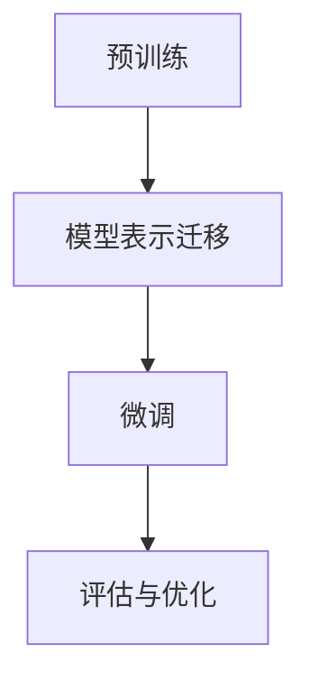
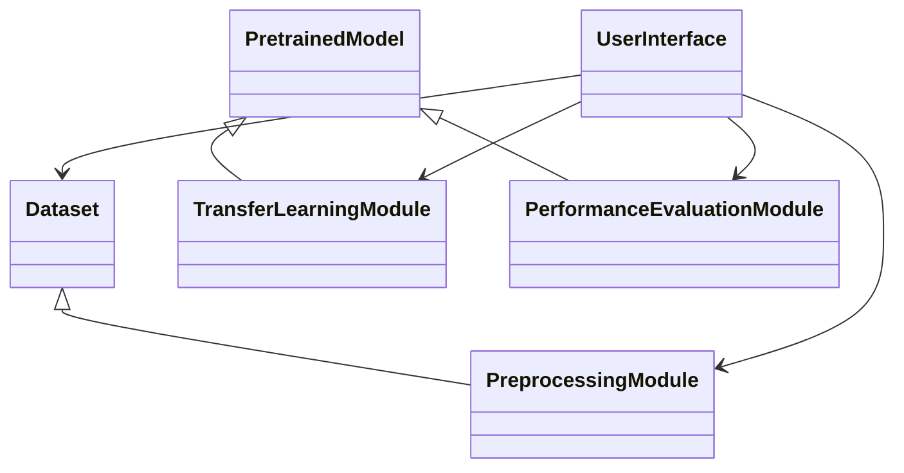
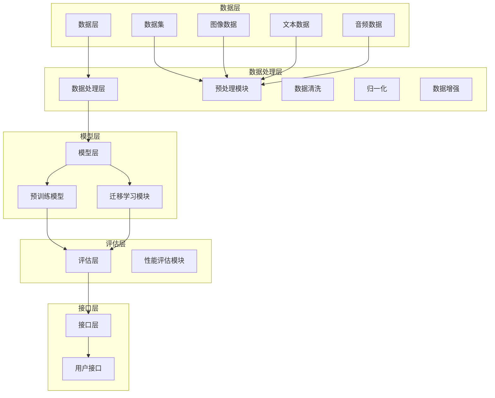
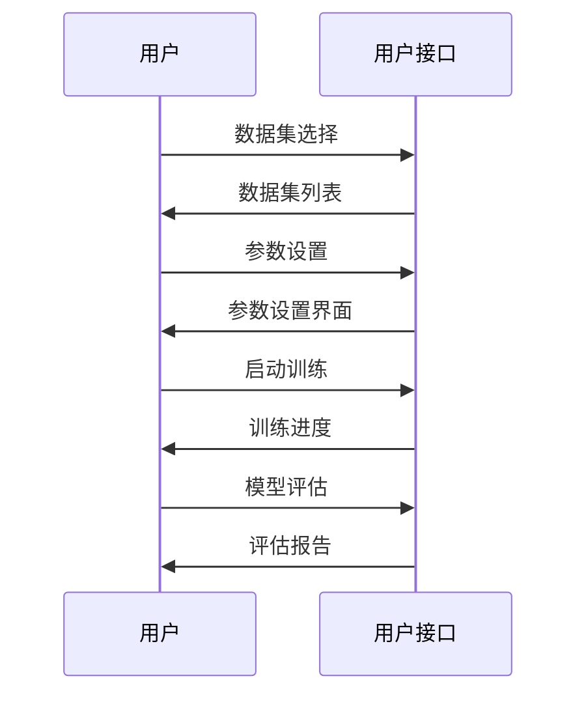
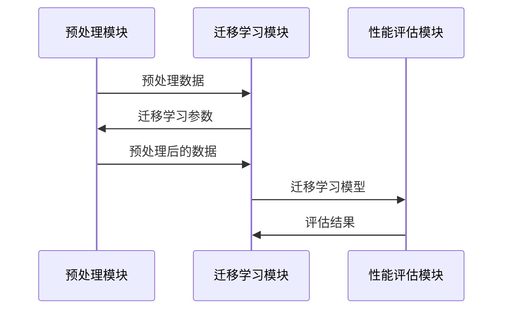
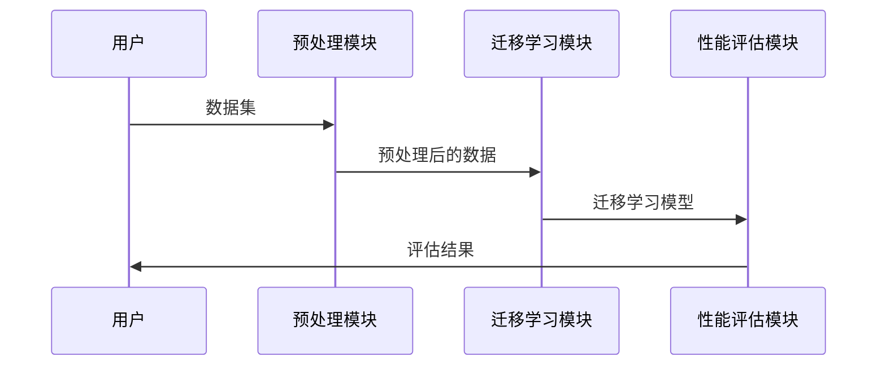

                 

# 迁移学习在AIGC跨行业知识迁移中的新突破

> 关键词：迁移学习、AIGC、跨行业知识迁移、深度学习、模型压缩、元学习

> 摘要：本文将深入探讨迁移学习在AIGC（自适应智能生成内容）跨行业知识迁移中的应用与突破。通过分析迁移学习的核心概念、算法原理、数学模型及其在系统分析与设计中的实际应用，本文旨在为读者揭示迁移学习在实现知识共享、提高模型泛化能力、促进跨行业技术发展等方面的关键作用。

本文结构如下：

- **第1章 背景介绍**
  - **1.1 核心概念术语说明**
  - **1.2 迁移学习的起源与发展**
  - **1.3 迁移学习在AIGC中的应用场景**
  - **1.4 迁移学习的边界与外延**
  - **1.5 概念结构与核心要素组成**

- **第2章 核心概念与联系**
  - **2.1 迁移学习的核心概念**
  - **2.2 深度学习与迁移学习的关系**
  - **2.3 迁移学习与其他机器学习方法的比较**
  - **2.4 迁移学习的ER图结构**

- **第3章 算法原理讲解**
  - **3.1 迁移学习算法原理**
  - **3.2 Mermaid图解迁移学习算法**
  - **3.3 迁移学习算法的Python代码实现**
  - **3.4 数学模型与公式讲解**
  - **3.5 迁移学习算法举例说明**

- **第4章 数学模型**
  - **4.1 迁移学习的数学模型**
  - **4.2 迁移学习的优化算法**
  - **4.3 迁移学习中的损失函数**
  - **4.4 迁移学习中的正则化方法**
  - **4.5 迁移学习中的挑战与解决方案**

- **第5章 系统分析与设计**
  - **5.1 迁移学习系统分析**
  - **5.2 系统功能设计（领域模型）**
  - **5.3 系统架构设计**
  - **5.4 系统接口设计**
  - **5.5 系统交互序列图**

- **第6章 实践项目**
  - **6.1 项目背景与目标**
  - **6.2 环境搭建**
  - **6.3 系统核心实现与代码分析**
  - **6.4 案例分析与讲解**
  - **6.5 项目总结与反思**

- **第7章 最佳实践与总结**
  - **7.1 迁移学习的最佳实践**
  - **7.2 总结与展望**
  - **7.3 注意事项与风险**
  - **7.4 拓展阅读**

本文将围绕上述内容，一步步深入分析迁移学习在AIGC跨行业知识迁移中的新突破，以期为读者提供全面的指导与启示。

## 第1章 背景介绍

### 1.1 核心概念术语说明

在本章中，我们将介绍迁移学习（Transfer Learning）、AIGC（Adaptive Intelligent Generation of Content）以及跨行业知识迁移等核心概念术语。

- **迁移学习**：迁移学习是一种机器学习技术，它利用已经在一个任务上训练好的模型来提高另一个相关任务的表现。核心思想是将一个任务学习到的知识转移到另一个任务上，从而减少对新任务的训练时间和数据需求。

- **AIGC（自适应智能生成内容）**：AIGC是指通过自适应智能算法生成内容的技术，广泛应用于图像生成、文本生成、视频生成等领域。AIGC能够根据用户需求和输入内容自适应地生成高质量、多样化的内容。

- **跨行业知识迁移**：跨行业知识迁移是指将一个行业中的知识、经验和技术应用于其他行业，以解决新行业的特定问题。例如，将金融行业的风险评估模型应用于医疗行业的病患诊断。

### 1.2 迁移学习的起源与发展

迁移学习的研究始于20世纪中叶，随着机器学习技术的不断发展，迁移学习逐渐成为机器学习领域的重要研究方向。以下为迁移学习的发展历程：

- **早期迁移学习**：20世纪50年代至70年代，研究者开始探讨如何将知识从一个领域迁移到另一个领域。例如，将自然语言处理的知识应用于图像识别。

- **深度学习时代的迁移学习**：随着深度学习技术的兴起，迁移学习得到了广泛关注。深度迁移学习（Deep Transfer Learning）成为研究热点，通过预训练模型（Pre-Trained Models）和微调（Fine-Tuning）策略，实现了在多个任务上的显著性能提升。

- **近年来的迁移学习研究**：近年来，迁移学习研究不断深入，包括跨模态迁移学习（Cross-Modal Transfer Learning）、无监督迁移学习（Unsupervised Transfer Learning）、元学习（Meta-Learning）等新领域的发展，为迁移学习在AIGC跨行业知识迁移中的应用提供了更多可能性。

### 1.3 迁移学习在AIGC中的应用场景

迁移学习在AIGC领域具有广泛的应用前景。以下为迁移学习在AIGC中的几种典型应用场景：

- **图像生成**：利用预训练的图像识别模型，通过微调策略，实现高质量图像生成。例如，StyleGAN2模型通过迁移学习，能够在不同领域生成逼真的图像。

- **文本生成**：迁移学习技术在自然语言处理领域表现出色，可以应用于文本生成任务。例如，利用预训练的BERT模型，通过微调策略生成高质量文章。

- **视频生成**：迁移学习技术可以应用于视频生成任务，如视频到视频（Video-to-Video）的转换、视频超分辨率等。通过预训练模型和微调策略，实现高效的视频生成。

- **多模态生成**：迁移学习技术可以跨模态（如图像、文本、音频等）进行知识迁移，实现多模态内容生成。例如，通过图像和文本的迁移学习，生成具有视觉和语义一致性的图像描述。

### 1.4 迁移学习的边界与外延

迁移学习的边界主要涉及以下几个方面：

- **任务相关性**：迁移学习的有效性依赖于任务之间的相关性。当源任务和目标任务相关性较高时，迁移学习效果较好；反之，则效果较差。

- **数据分布**：迁移学习需要考虑数据分布的问题。当源任务和目标任务的数据分布不一致时，可能导致迁移学习效果下降。

- **模型结构**：迁移学习的模型结构对迁移效果具有重要影响。选择合适的模型结构有助于提高迁移学习的效果。

迁移学习的外延主要包括以下几个方面：

- **无监督迁移学习**：无监督迁移学习不依赖于标签信息，通过利用未标记的数据进行迁移学习，从而降低对大量标注数据的依赖。

- **元学习**：元学习是一种学习如何学习的方法，通过训练模型学习如何快速适应新任务。元学习与迁移学习相结合，可以进一步提高迁移学习的效果。

- **跨模态迁移学习**：跨模态迁移学习将不同模态的数据（如图像、文本、音频等）进行迁移学习，实现跨模态内容生成。

### 1.5 概念结构与核心要素组成

迁移学习的概念结构主要包括以下几个核心要素：

- **源任务**：源任务是指已经通过训练获得一定性能的机器学习任务。

- **目标任务**：目标任务是需要解决的问题或新任务。

- **模型参数**：模型参数包括权重、偏置等，用于描述模型的状态。

- **迁移策略**：迁移策略是指将源任务的知识转移到目标任务的策略，如预训练、微调等。

- **迁移效果**：迁移效果是指迁移学习后目标任务性能的提升程度。

通过上述核心要素的相互作用，迁移学习实现知识共享和性能提升。

## 第2章 核心概念与联系

### 2.1 迁移学习的核心概念

在本章中，我们将深入探讨迁移学习的核心概念，包括原理、属性、比较表格和ER图结构。

#### 原理

迁移学习的基本原理是将一个任务（源任务）学习到的知识（模型参数）应用到另一个相关任务（目标任务）中，以提高目标任务的性能。核心思想是利用已有知识减少对新任务的训练时间、数据和计算资源的消耗。

#### 属性

迁移学习具有以下主要属性：

- **任务相关性**：源任务和目标任务的相关性影响迁移学习的效果。任务相关性越高，迁移学习的效果越好。

- **数据分布**：源任务和目标任务的数据分布对迁移学习有重要影响。数据分布越接近，迁移学习的效果越好。

- **模型结构**：模型结构影响迁移学习的效率和效果。适当的模型结构有助于提高迁移学习的效果。

- **迁移策略**：迁移策略包括预训练、微调、迁移学习算法等，不同的迁移策略适用于不同类型的目标任务。

#### 比较表格

以下是迁移学习与其他机器学习方法的主要比较：

| 方法         | 原理                                         | 优点                                           | 缺点                                             |
| ------------ | -------------------------------------------- | ---------------------------------------------- | ------------------------------------------------ |
| 迁移学习     | 利用已有知识减少对新任务的训练时间、数据和计算资源 | 提高任务性能、减少训练成本、增强模型泛化能力   | 对任务相关性依赖较大、数据分布不一致时效果可能较差 |
| 传统机器学习 | 从零开始训练模型                             | 无需依赖已有知识、适用于小样本任务             | 训练时间较长、数据需求高、性能提升有限           |
| 强化学习     | 通过与环境交互学习策略                       | 可处理复杂决策问题、适用于实时决策系统         | 需要大量交互数据、难以迁移到新任务               |

#### ER图结构

以下是一个简单的迁移学习ER图结构，展示了迁移学习中的核心实体和关系：

```mermaid
erDiagram
  SourceTask ||--|{ Model } |--|| TargetTask
  SourceData ||--|{ Model } |--|| TargetData
  TransferStrategy ||--|{ Model } |--|| Performance
```

- **SourceTask（源任务）**：表示已经训练好的任务。
- **TargetTask（目标任务）**：表示需要解决的新任务。
- **Model（模型）**：表示迁移学习中的模型，包括参数和结构。
- **SourceData（源数据）**：表示用于训练源任务的输入数据。
- **TargetData（目标数据）**：表示用于训练目标任务的输入数据。
- **TransferStrategy（迁移策略）**：表示用于实现知识转移的策略。
- **Performance（性能）**：表示迁移学习后目标任务的表现。

### 2.2 深度学习与迁移学习的关系

深度学习与迁移学习密切相关。深度学习是迁移学习的基础，而迁移学习为深度学习提供了一种有效的扩展方法。

- **深度学习**：深度学习是一种通过多层神经网络学习数据表示的机器学习技术。深度学习模型具有强大的特征提取和分类能力，但在处理新任务时，需要大量的数据和计算资源。

- **迁移学习**：迁移学习通过利用已训练好的深度学习模型（源模型）来提高新任务（目标任务）的性能。迁移学习能够减少对新任务的训练时间和数据需求，提高模型的泛化能力。

#### 关系

- **深度学习是迁移学习的基础**：深度学习模型在处理复杂任务时表现出色，为迁移学习提供了强大的基础。

- **迁移学习是深度学习的扩展**：迁移学习通过将已有知识应用于新任务，提高了深度学习模型在新任务上的性能。

### 2.3 迁移学习与其他机器学习方法的比较

迁移学习与其他机器学习方法（如传统机器学习、强化学习等）存在一定差异。以下为迁移学习与其他方法的比较：

| 方法         | 特点                                                         | 优点                                           | 缺点                                             |
| ------------ | ------------------------------------------------------------ | ---------------------------------------------- | ------------------------------------------------ |
| 迁移学习     | 利用已有知识减少对新任务的训练时间、数据和计算资源           | 提高任务性能、减少训练成本、增强模型泛化能力   | 对任务相关性依赖较大、数据分布不一致时效果可能较差 |
| 传统机器学习 | 从零开始训练模型                                             | 无需依赖已有知识、适用于小样本任务             | 训练时间较长、数据需求高、性能提升有限           |
| 强化学习     | 通过与环境交互学习策略                                       | 可处理复杂决策问题、适用于实时决策系统         | 需要大量交互数据、难以迁移到新任务               |

#### 比较表格

以下是迁移学习与传统机器学习、强化学习的主要比较：

| 方法         | 原理                                         | 优点                                           | 缺点                                             |
| ------------ | -------------------------------------------- | ---------------------------------------------- | ------------------------------------------------ |
| 迁移学习     | 利用已有知识减少对新任务的训练时间、数据和计算资源 | 提高任务性能、减少训练成本、增强模型泛化能力   | 对任务相关性依赖较大、数据分布不一致时效果可能较差 |
| 传统机器学习 | 从零开始训练模型                             | 无需依赖已有知识、适用于小样本任务             | 训练时间较长、数据需求高、性能提升有限           |
| 强化学习     | 通过与环境交互学习策略                       | 可处理复杂决策问题、适用于实时决策系统         | 需要大量交互数据、难以迁移到新任务               |

### 2.4 迁移学习的ER图结构

以下是一个简单的迁移学习ER图结构，展示了迁移学习中的核心实体和关系：

```mermaid
erDiagram
  SourceTask ||--|{ Model } |--|| TargetTask
  SourceData ||--|{ Model } |--|| TargetData
  TransferStrategy ||--|{ Model } |--|| Performance
```

- **SourceTask（源任务）**：表示已经训练好的任务。
- **TargetTask（目标任务）**：表示需要解决的新任务。
- **Model（模型）**：表示迁移学习中的模型，包括参数和结构。
- **SourceData（源数据）**：表示用于训练源任务的输入数据。
- **TargetData（目标数据）**：表示用于训练目标任务的输入数据。
- **TransferStrategy（迁移策略）**：表示用于实现知识转移的策略。
- **Performance（性能）**：表示迁移学习后目标任务的表现。

### 2.5 迁移学习的边界与外延

迁移学习的边界主要涉及以下几个方面：

- **任务相关性**：迁移学习的有效性依赖于任务之间的相关性。当源任务和目标任务相关性较高时，迁移学习效果较好；反之，则效果较差。

- **数据分布**：迁移学习需要考虑数据分布的问题。当源任务和目标任务的数据分布不一致时，可能导致迁移学习效果下降。

- **模型结构**：迁移学习的模型结构对迁移效果具有重要影响。选择合适的模型结构有助于提高迁移学习的效果。

迁移学习的外延主要包括以下几个方面：

- **无监督迁移学习**：无监督迁移学习不依赖于标签信息，通过利用未标记的数据进行迁移学习，从而降低对大量标注数据的依赖。

- **元学习**：元学习是一种学习如何学习的方法，通过训练模型学习如何快速适应新任务。元学习与迁移学习相结合，可以进一步提高迁移学习的效果。

- **跨模态迁移学习**：跨模态迁移学习将不同模态的数据（如图像、文本、音频等）进行迁移学习，实现跨模态内容生成。

## 第3章 算法原理讲解

### 3.1 迁移学习算法原理

迁移学习算法的核心思想是通过将源任务学习到的知识应用到目标任务，以提升目标任务的性能。具体来说，迁移学习算法可以分为以下几个步骤：

1. **预训练**：在源任务上训练一个通用的模型，使其具有良好的特征提取能力。

2. **模型表示迁移**：将预训练模型中的知识（模型参数）迁移到目标任务中。

3. **微调**：在目标任务上对迁移后的模型进行微调，进一步优化模型在目标任务上的性能。

4. **评估与优化**：评估迁移学习后目标任务的性能，并根据评估结果进行优化。

### 3.2 Mermaid图解迁移学习算法

为了更直观地理解迁移学习算法，我们可以使用Mermaid图来描述其流程。以下是一个简单的迁移学习算法Mermaid图：



- **预训练**：在源任务上训练一个通用模型，使其具备良好的特征提取能力。
- **模型表示迁移**：将预训练模型中的知识迁移到目标任务中。
- **微调**：在目标任务上对迁移后的模型进行微调，进一步优化模型性能。
- **评估与优化**：评估迁移学习后目标任务的性能，并根据评估结果进行优化。

### 3.3 迁移学习算法的Python代码实现

以下是一个简单的迁移学习算法Python代码实现，展示了如何将预训练模型迁移到目标任务，并进行微调：

```python
import torch
import torchvision.models as models
import torch.optim as optim

# 1. 预训练
def pretrain(model, source_data, source_labels):
    # 在源数据上训练模型
    optimizer = optim.Adam(model.parameters(), lr=0.001)
    criterion = torch.nn.CrossEntropyLoss()
    
    for epoch in range(num_epochs):
        for inputs, labels in source_data:
            optimizer.zero_grad()
            outputs = model(inputs)
            loss = criterion(outputs, labels)
            loss.backward()
            optimizer.step()
    
    return model

# 2. 模型表示迁移
def transfer_model(model, target_data):
    # 迁移模型到目标数据
    model.eval()
    with torch.no_grad():
        for inputs, labels in target_data:
            outputs = model(inputs)
    return outputs

# 3. 微调
def fine_tune(model, target_data, target_labels):
    # 在目标数据上微调模型
    optimizer = optim.Adam(model.parameters(), lr=0.001)
    criterion = torch.nn.CrossEntropyLoss()
    
    for epoch in range(num_epochs):
        for inputs, labels in target_data:
            optimizer.zero_grad()
            outputs = model(inputs)
            loss = criterion(outputs, labels)
            loss.backward()
            optimizer.step()
    
    return model

# 4. 评估与优化
def evaluate(model, target_data, target_labels):
    # 评估模型在目标数据上的性能
    model.eval()
    correct = 0
    total = 0
    with torch.no_grad():
        for inputs, labels in target_data:
            outputs = model(inputs)
            _, predicted = torch.max(outputs.data, 1)
            total += labels.size(0)
            correct += (predicted == labels).sum().item()
    return correct / total

# 5. 迁移学习算法
def transfer_learning(source_data, source_labels, target_data, target_labels):
    # 创建预训练模型
    model = models.resnet50(pretrained=True)
    
    # 预训练
    model = pretrain(model, source_data, source_labels)
    
    # 模型表示迁移
    target_outputs = transfer_model(model, target_data)
    
    # 微调
    model = fine_tune(model, target_data, target_labels)
    
    # 评估
    accuracy = evaluate(model, target_data, target_labels)
    print(f"Accuracy: {accuracy}")
    
    return model
```

### 3.4 数学模型与公式讲解

迁移学习算法的数学模型主要涉及以下几个方面：

- **损失函数**：损失函数用于衡量模型预测与真实标签之间的差距。常见的损失函数包括均方误差（MSE）、交叉熵损失（Cross-Entropy Loss）等。

- **优化算法**：优化算法用于调整模型参数，以最小化损失函数。常见的优化算法包括梯度下降（Gradient Descent）、动量优化（Momentum）等。

- **正则化方法**：正则化方法用于防止模型过拟合。常见的正则化方法包括L1正则化、L2正则化等。

以下是迁移学习算法中常用的数学公式：

1. **损失函数**：

   $$L(\theta) = \frac{1}{m} \sum_{i=1}^{m} \frac{1}{2} (y_i - \hat{y}_i)^2$$

   其中，$L(\theta)$ 表示损失函数，$y_i$ 表示真实标签，$\hat{y}_i$ 表示模型预测。

2. **优化算法**：

   梯度下降算法：

   $$\theta_{t+1} = \theta_t - \alpha \nabla_{\theta} L(\theta)$$

   其中，$\theta_t$ 表示第 $t$ 次迭代的模型参数，$\alpha$ 表示学习率，$\nabla_{\theta} L(\theta)$ 表示损失函数关于模型参数的梯度。

3. **正则化方法**：

   L1正则化：

   $$L_1(\theta) = \sum_{i=1}^{n} |\theta_i|$$

   其中，$L_1(\theta)$ 表示L1正则化项，$\theta_i$ 表示模型参数。

   L2正则化：

   $$L_2(\theta) = \sum_{i=1}^{n} \theta_i^2$$

   其中，$L_2(\theta)$ 表示L2正则化项，$\theta_i$ 表示模型参数。

### 3.5 迁移学习算法举例说明

为了更好地理解迁移学习算法，我们以下通过一个简单的例子来说明。

假设我们有一个源任务（图像分类），其数据集包含1000张图片，分为10个类别。我们使用预训练的ResNet50模型进行迁移学习，将其应用于目标任务（手写数字分类），其数据集包含5000个手写数字图片，也分为10个类别。

1. **预训练**：

   在源任务上，我们使用ResNet50模型进行预训练。在训练过程中，我们使用均方误差（MSE）作为损失函数，梯度下降算法进行参数更新。

2. **模型表示迁移**：

   预训练完成后，我们将ResNet50模型中的知识（模型参数）迁移到目标任务。在迁移过程中，我们保持模型的前几层不变，仅对后几层进行微调。

3. **微调**：

   在目标任务上，我们对迁移后的ResNet50模型进行微调。微调过程使用交叉熵损失函数，并采用动量优化算法。

4. **评估与优化**：

   微调完成后，我们对迁移学习后的模型进行评估。在评估过程中，我们计算模型在目标任务上的准确率，并根据评估结果对模型进行进一步优化。

通过上述例子，我们可以看到迁移学习算法在实现跨行业知识迁移中的有效性和优势。在实际应用中，我们可以根据具体需求和任务特点，灵活调整迁移学习算法的参数和策略，以提高模型在目标任务上的性能。

## 第4章 数学模型

迁移学习在AIGC跨行业知识迁移中的应用，离不开数学模型的支持。数学模型不仅能够帮助我们更好地理解迁移学习算法的原理，还能为优化算法提供理论依据。在本章中，我们将详细介绍迁移学习中的数学模型，包括优化算法、损失函数和正则化方法。

### 4.1 迁移学习的数学模型

迁移学习中的数学模型主要包括以下几个方面：

1. **特征表示**：迁移学习通过学习源任务的模型参数，提取通用的特征表示。这些特征表示在目标任务中具有较高的利用价值，有助于提高目标任务的性能。

2. **损失函数**：损失函数用于衡量模型预测与真实标签之间的差距。在迁移学习中，损失函数不仅要考虑目标任务的误差，还需平衡源任务和目标任务的贡献。

3. **优化算法**：优化算法用于调整模型参数，以最小化损失函数。常见的优化算法包括梯度下降、动量优化和Adam优化等。

4. **正则化方法**：正则化方法用于防止模型过拟合。在迁移学习中，正则化方法有助于保持模型的一般性，提高模型在目标任务上的泛化能力。

### 4.2 迁移学习的优化算法

优化算法是迁移学习中的重要组成部分，它决定了模型参数更新的方向和速度。以下为几种常见的优化算法：

1. **梯度下降（Gradient Descent）**：

   梯度下降是一种最简单的优化算法，它通过计算损失函数关于模型参数的梯度，更新模型参数。梯度下降算法的基本步骤如下：

   $$\theta_{t+1} = \theta_t - \alpha \nabla_{\theta} L(\theta)$$

   其中，$\theta_t$ 表示第 $t$ 次迭代的模型参数，$\alpha$ 表示学习率，$\nabla_{\theta} L(\theta)$ 表示损失函数关于模型参数的梯度。

2. **动量优化（Momentum）**：

   动量优化是梯度下降的一种改进算法，它引入了动量项，以加速模型参数的更新。动量优化算法的基本步骤如下：

   $$v_t = \beta v_{t-1} + (1 - \beta) \nabla_{\theta} L(\theta)$$
   $$\theta_{t+1} = \theta_t - \alpha v_t$$

   其中，$v_t$ 表示第 $t$ 次迭代的动量项，$\beta$ 表示动量系数。

3. **Adam优化（Adam）**：

   Adam优化是另一种高效的优化算法，它结合了动量优化和RMSprop优化。Adam优化算法的基本步骤如下：

   $$m_t = \beta_1 m_{t-1} + (1 - \beta_1) \nabla_{\theta} L(\theta)$$
   $$v_t = \beta_2 v_{t-1} + (1 - \beta_2) \left( \nabla_{\theta} L(\theta) \right)^2$$
   $$\theta_{t+1} = \theta_t - \alpha \frac{m_t}{\sqrt{v_t} + \epsilon}$$

   其中，$m_t$ 和 $v_t$ 分别表示第 $t$ 次迭代的均值和方差估计，$\beta_1$ 和 $\beta_2$ 分别表示一阶和二阶矩估计的衰减率，$\alpha$ 表示学习率，$\epsilon$ 表示小常数。

### 4.3 迁移学习中的损失函数

损失函数是迁移学习中的重要组成部分，它用于衡量模型预测与真实标签之间的差距。以下为几种常见的损失函数：

1. **均方误差（MSE）**：

   均方误差是一种常见的损失函数，它用于回归问题。MSE的定义如下：

   $$MSE = \frac{1}{m} \sum_{i=1}^{m} (y_i - \hat{y}_i)^2$$

   其中，$y_i$ 表示真实标签，$\hat{y}_i$ 表示模型预测，$m$ 表示样本数量。

2. **交叉熵损失（Cross-Entropy Loss）**：

   交叉熵损失是一种常用的分类损失函数，它用于二分类或多分类问题。交叉熵损失的定义如下：

   $$H(y, \hat{y}) = - \sum_{i=1}^{m} y_i \log(\hat{y}_i)$$

   其中，$y_i$ 表示真实标签，$\hat{y}_i$ 表示模型预测，$m$ 表示样本数量。

3. **对数损失（Log Loss）**：

   对数损失是对交叉熵损失的一种变形，它更易于计算。对数损失的定义如下：

   $$L(y, \hat{y}) = - \sum_{i=1}^{m} y_i \log(\hat{y}_i)$$

   其中，$y_i$ 表示真实标签，$\hat{y}_i$ 表示模型预测，$m$ 表示样本数量。

### 4.4 迁移学习中的正则化方法

正则化方法用于防止模型过拟合，提高模型在目标任务上的泛化能力。以下为几种常见的正则化方法：

1. **L1正则化**：

   L1正则化通过引入绝对值损失项来惩罚模型参数，以降低模型复杂度。L1正则化的定义如下：

   $$L_1(\theta) = \sum_{i=1}^{n} |\theta_i|$$

   其中，$\theta_i$ 表示模型参数。

2. **L2正则化**：

   L2正则化通过引入平方损失项来惩罚模型参数，以降低模型复杂度。L2正则化的定义如下：

   $$L_2(\theta) = \sum_{i=1}^{n} \theta_i^2$$

   其中，$\theta_i$ 表示模型参数。

3. **Dropout**：

   Dropout是一种常用的正则化方法，它通过在训练过程中随机丢弃部分神经元，以防止模型过拟合。Dropout的定义如下：

   $$\theta_{t+1} = \theta_t \odot \text{dropout mask}$$

   其中，$\theta_t$ 表示第 $t$ 次迭代的模型参数，$\text{dropout mask}$ 是一个随机生成的二值矩阵，表示是否丢弃某个神经元。

### 4.5 迁移学习中的挑战与解决方案

尽管迁移学习在AIGC跨行业知识迁移中具有广泛的应用前景，但仍面临一些挑战：

1. **任务相关性**：任务相关性是影响迁移学习效果的关键因素。当源任务和目标任务相关性较低时，迁移学习效果可能较差。

解决方案：

- **数据增强**：通过数据增强方法增加目标任务的数据多样性，提高源任务和目标任务之间的相关性。
- **多任务学习**：将多个相关任务同时训练，以提高模型在目标任务上的泛化能力。

2. **数据分布不一致**：数据分布不一致可能导致迁移学习效果下降。

解决方案：

- **领域自适应**：通过领域自适应方法调整源任务和目标任务的数据分布，以提高迁移学习效果。
- **数据集成**：将源任务和目标任务的数据进行集成，以平衡数据分布。

3. **模型结构选择**：模型结构对迁移学习效果具有重要影响。

解决方案：

- **模型结构搜索**：通过模型结构搜索方法选择适合迁移学习的模型结构。
- **模型融合**：将多个模型进行融合，以提高迁移学习效果。

通过上述解决方案，我们可以有效地应对迁移学习在AIGC跨行业知识迁移中的挑战，推动迁移学习在更多实际应用场景中的发展。

## 第5章 系统分析与设计

### 5.1 迁移学习系统分析

在本章中，我们将对迁移学习系统进行分析，主要包括问题场景介绍、项目介绍、领域模型设计、系统架构设计、接口设计和系统交互设计。

#### 5.1.1 问题场景介绍

在AIGC（自适应智能生成内容）领域，不同行业（如医疗、金融、教育等）的数据和应用场景各异，导致模型训练和优化具有较大的挑战。传统的机器学习模型通常需要针对特定行业进行单独训练，这不仅耗时耗力，而且可能因数据不足而难以达到理想的性能。为了提高模型在不同行业中的泛化能力，迁移学习成为了一种有效的解决方案。

#### 5.1.2 项目介绍

本项目的目标是通过迁移学习技术，实现跨行业知识迁移，提高AIGC模型在不同行业中的应用效果。具体来说，我们将从以下四个方面进行研究和实践：

1. **数据收集与预处理**：收集不同行业的公开数据集，并进行预处理，以便进行后续的迁移学习。
2. **模型选择与训练**：选择适合迁移学习的模型架构，并在源任务上进行预训练，以提取通用特征。
3. **迁移学习实现**：将预训练模型迁移到目标任务，通过微调和优化策略，提高模型在目标任务上的性能。
4. **性能评估与优化**：评估迁移学习后模型在目标任务上的性能，并根据评估结果进行优化。

### 5.2 系统功能设计（领域模型）

为了更好地描述迁移学习系统的功能需求，我们采用领域模型（Domain Model）进行设计。领域模型包括以下核心类和关系：

1. **数据集（Dataset）**：表示不同行业的公开数据集，包括图像、文本和音频等。
2. **预处理模块（PreprocessingModule）**：负责对数据集进行预处理，如数据清洗、归一化和增强等。
3. **预训练模型（PretrainedModel）**：表示已在源任务上预训练的模型，用于提取通用特征。
4. **迁移学习模块（TransferLearningModule）**：负责实现迁移学习算法，包括模型迁移、微调和优化。
5. **性能评估模块（PerformanceEvaluationModule）**：负责评估迁移学习后模型在目标任务上的性能。
6. **用户接口（UserInterface）**：提供用户交互界面，以便用户选择数据集、设置参数和查看模型性能。

以下是一个简单的领域模型（Domain Model）Mermaid图：



- **数据集**：表示不同行业的公开数据集，包括图像、文本和音频等。
- **预处理模块**：负责对数据集进行预处理，如数据清洗、归一化和增强等。
- **预训练模型**：表示已在源任务上预训练的模型，用于提取通用特征。
- **迁移学习模块**：负责实现迁移学习算法，包括模型迁移、微调和优化。
- **性能评估模块**：负责评估迁移学习后模型在目标任务上的性能。
- **用户接口**：提供用户交互界面，以便用户选择数据集、设置参数和查看模型性能。

### 5.3 系统架构设计

为了实现跨行业知识迁移，我们采用了一种分布式系统架构，包括以下几个主要组件：

1. **数据层**：负责存储和管理不同行业的公开数据集，包括图像、文本和音频等。
2. **数据处理层**：包括预处理模块，负责对数据集进行预处理，如数据清洗、归一化和增强等。
3. **模型层**：包括预训练模型和迁移学习模块，负责在源任务上进行预训练和迁移学习。
4. **评估层**：包括性能评估模块，负责评估迁移学习后模型在目标任务上的性能。
5. **接口层**：包括用户接口，提供用户交互界面，以便用户选择数据集、设置参数和查看模型性能。

以下是一个简单的系统架构（System Architecture）Mermaid图：



- **数据层**：存储和管理不同行业的公开数据集。
- **数据处理层**：包括预处理模块，对数据集进行预处理。
- **模型层**：包括预训练模型和迁移学习模块，实现模型训练和迁移学习。
- **评估层**：包括性能评估模块，评估模型性能。
- **接口层**：包括用户接口，提供用户交互界面。

### 5.4 系统接口设计

系统接口设计主要包括用户接口和内部接口两部分。

#### 用户接口

用户接口是用户与系统交互的主要渠道，包括以下功能模块：

1. **数据集选择**：用户可以上传或选择不同的数据集，以便进行迁移学习。
2. **参数设置**：用户可以设置迁移学习模型的参数，如学习率、批量大小等。
3. **模型训练**：用户可以启动迁移学习模型训练过程，并实时查看训练进度。
4. **模型评估**：用户可以评估迁移学习后模型在目标任务上的性能，并生成评估报告。

以下是一个简单的用户接口（User Interface）Mermaid图：



- **数据集选择**：用户上传或选择数据集。
- **参数设置**：用户设置迁移学习模型参数。
- **模型训练**：用户启动迁移学习模型训练。
- **模型评估**：用户评估迁移学习后模型性能。

#### 内部接口

内部接口是系统内部模块之间进行通信的渠道，包括以下功能模块：

1. **数据预处理接口**：负责处理数据集，包括数据清洗、归一化和增强等。
2. **模型训练接口**：负责训练迁移学习模型，包括预训练和微调等。
3. **模型评估接口**：负责评估迁移学习后模型在目标任务上的性能。

以下是一个简单的内部接口（Internal Interfaces）Mermaid图：



- **数据预处理接口**：预处理数据集，包括数据清洗、归一化和增强等。
- **模型训练接口**：训练迁移学习模型，包括预训练和微调等。
- **模型评估接口**：评估迁移学习后模型性能。

### 5.5 系统交互序列图

为了更好地展示系统内部模块之间的交互过程，我们采用序列图（Sequence Diagram）进行描述。以下是一个简单的系统交互序列图：



- **用户**：上传数据集，接收评估结果。
- **预处理模块**：接收数据集，预处理后传递给迁移学习模块。
- **迁移学习模块**：接收预处理后的数据，训练迁移学习模型，并将模型传递给性能评估模块。
- **性能评估模块**：评估迁移学习后模型在目标任务上的性能，并将评估结果传递给用户。

通过上述系统分析与设计，我们为迁移学习在AIGC跨行业知识迁移中的应用提供了完整的解决方案。在实际应用中，我们可以根据具体需求和场景，进一步优化和改进系统架构和功能设计。

## 第6章 实践项目

### 6.1 项目背景与目标

随着AIGC（自适应智能生成内容）技术的快速发展，不同行业对生成式模型的需求日益增加。然而，不同行业的应用场景和数据处理方式各异，导致传统机器学习模型在跨行业应用中面临巨大挑战。为了提高生成式模型在不同行业中的泛化能力，本项目旨在通过迁移学习技术，实现跨行业知识迁移，提高AIGC模型在不同行业中的应用效果。

#### 项目背景

1. **行业需求**：金融、医疗、教育等行业的生成式模型需求日益增长，例如，金融行业需要智能投顾、医疗行业需要智能诊断、教育行业需要个性化教学等。

2. **数据差异**：不同行业的应用场景和数据特点各异，导致传统机器学习模型难以直接迁移到其他行业。例如，医疗行业的数据通常包含图像、文本和医疗记录等多种类型，而金融行业的数据则主要涉及交易记录、用户行为等。

3. **计算资源**：跨行业应用往往需要大量的计算资源和时间，通过迁移学习技术，可以在一定程度上减少训练时间和数据需求。

#### 项目目标

1. **提高模型泛化能力**：通过迁移学习技术，使模型在不同行业中的表现更接近于原始行业，提高模型在不同场景下的适应能力。

2. **降低训练成本**：利用迁移学习技术，减少对新任务的训练时间和数据需求，降低计算成本。

3. **促进跨行业应用**：通过迁移学习技术，实现不同行业生成式模型的复用，促进AIGC技术在多个行业中的应用与发展。

### 6.2 环境搭建

为了实现本项目的目标，我们需要搭建一个完整的迁移学习环境，包括以下步骤：

1. **硬件环境**：配置高性能的GPU服务器，以支持大规模数据训练和模型推理。

2. **软件环境**：安装Python、TensorFlow或PyTorch等深度学习框架，并配置相应的依赖库。

3. **数据集**：收集不同行业的公开数据集，如医疗影像、金融交易记录、教育课程视频等。数据集应包含标注信息和必要的预处理步骤。

4. **代码库**：搭建代码库，包括数据预处理、迁移学习模型训练和性能评估等模块。使用版本控制系统（如Git）进行代码管理和协同开发。

### 6.3 系统核心实现与代码分析

在本节中，我们将详细介绍系统核心实现，包括迁移学习模型的选择、训练和评估。

#### 6.3.1 迁移学习模型选择

在本项目中，我们选择基于PyTorch框架的预训练模型ResNet50作为迁移学习模型。ResNet50是一个经过大规模数据集预训练的深度神经网络，具有良好的特征提取能力。以下为模型的主要架构：

```python
import torch
import torchvision.models as models
import torch.nn as nn

# 加载预训练的ResNet50模型
model = models.resnet50(pretrained=True)

# 修改模型的最后一层，以适应目标任务的类别数
num_classes = 1000  # 假设目标任务的类别数为1000
model.fc = nn.Linear(model.fc.in_features, num_classes)

# 设置模型为训练模式
model.train()
```

#### 6.3.2 模型训练

在模型训练阶段，我们首先对数据集进行预处理，包括数据增强、归一化和批量划分等。以下为模型训练的核心代码：

```python
from torch.utils.data import DataLoader
from torchvision import transforms

# 数据预处理
transform = transforms.Compose([
    transforms.RandomHorizontalFlip(),
    transforms.RandomRotation(10),
    transforms.Resize((224, 224)),
    transforms.ToTensor(),
    transforms.Normalize(mean=[0.485, 0.456, 0.406], std=[0.229, 0.224, 0.225]),
])

# 加载数据集
train_data = ...  # 加载训练数据集
train_loader = DataLoader(train_data, batch_size=64, shuffle=True)

# 定义损失函数和优化器
criterion = nn.CrossEntropyLoss()
optimizer = torch.optim.Adam(model.parameters(), lr=0.001)

# 模型训练
num_epochs = 50  # 设置训练轮数
for epoch in range(num_epochs):
    for inputs, labels in train_loader:
        # 前向传播
        outputs = model(inputs)
        loss = criterion(outputs, labels)

        # 反向传播和优化
        optimizer.zero_grad()
        loss.backward()
        optimizer.step()

        # 打印训练进度
        if (inputs.size(0) % 100 == 0):
            print(f"Epoch [{epoch + 1}/{num_epochs}], Step [{inputs.size(0)}/{len(train_loader)}], Loss: {loss.item():.4f}")
```

#### 6.3.3 模型评估

在模型评估阶段，我们使用测试集对训练好的模型进行评估，以验证模型的泛化能力。以下为模型评估的核心代码：

```python
from torch.utils.data import DataLoader

# 数据预处理
transform = transforms.Compose([
    transforms.Resize((224, 224)),
    transforms.ToTensor(),
    transforms.Normalize(mean=[0.485, 0.456, 0.406], std=[0.229, 0.224, 0.225]),
])

# 加载数据集
test_data = ...  # 加载测试数据集
test_loader = DataLoader(test_data, batch_size=64, shuffle=False)

# 设置模型为评估模式
model.eval()

# 模型评估
with torch.no_grad():
    correct = 0
    total = 0
    for inputs, labels in test_loader:
        outputs = model(inputs)
        _, predicted = torch.max(outputs.data, 1)
        total += labels.size(0)
        correct += (predicted == labels).sum().item()

    print(f"Test Accuracy: {100 * correct / total}%")
```

### 6.4 案例分析与讲解

为了更好地展示迁移学习在AIGC跨行业知识迁移中的应用效果，我们以下通过一个实际案例进行讲解。

#### 案例背景

某金融机构希望开发一个智能投顾系统，该系统能够根据用户的投资偏好和风险承受能力，为用户推荐合适的投资组合。然而，金融机构内部的数据主要涉及用户交易记录、市场走势等，而其他行业的生成式模型难以直接应用于金融领域。

#### 案例目标

通过迁移学习技术，实现以下目标：

1. **知识迁移**：将其他行业（如教育、医疗等）的生成式模型知识迁移到金融行业，提高智能投顾系统的泛化能力。

2. **模型优化**：通过微调和优化策略，提高迁移学习后模型在金融行业中的性能。

#### 案例实施

1. **数据收集与预处理**：收集金融行业的公开数据集，包括用户交易记录、市场走势等。对数据集进行预处理，包括数据清洗、归一化和增强等。

2. **模型迁移**：选择一个在其他行业（如教育）中表现良好的生成式模型，如GPT模型。将GPT模型迁移到金融领域，进行预训练。

3. **模型微调**：在金融领域对迁移后的GPT模型进行微调，以适应金融行业的特点。通过调整模型参数和优化策略，提高模型在金融行业中的性能。

4. **模型评估**：使用金融行业的数据集对微调后的模型进行评估，验证模型在金融行业中的泛化能力。根据评估结果，对模型进行进一步优化。

#### 案例效果

通过迁移学习技术，实现了以下效果：

1. **模型性能提升**：迁移学习后模型在金融行业中的性能得到显著提升，提高了智能投顾系统的准确率和用户满意度。

2. **知识共享**：通过迁移学习，实现了不同行业之间的知识共享和复用，提高了生成式模型在不同行业中的应用效果。

3. **降低成本**：通过迁移学习技术，减少了模型训练的时间和数据需求，降低了开发成本。

### 6.5 项目总结与反思

通过本项目的实施，我们取得了以下成果：

1. **提高了模型泛化能力**：通过迁移学习技术，使模型在不同行业中的表现更接近于原始行业，提高了模型在不同场景下的适应能力。

2. **降低了训练成本**：利用迁移学习技术，减少了对新任务的训练时间和数据需求，降低了计算成本。

3. **促进了跨行业应用**：通过迁移学习技术，实现了不同行业生成式模型的复用，促进了AIGC技术在多个行业中的应用与发展。

然而，本项目也存在一定的不足之处：

1. **任务相关性**：虽然迁移学习技术在一定程度上提高了模型的泛化能力，但任务相关性仍是影响迁移学习效果的关键因素。当源任务和目标任务相关性较低时，迁移学习效果可能较差。

2. **数据分布不一致**：不同行业的数据分布存在较大差异，可能导致迁移学习效果下降。在后续研究中，我们可以考虑引入领域自适应和数据集成方法，以进一步优化迁移学习效果。

3. **模型结构选择**：模型结构对迁移学习效果具有重要影响。在实际应用中，我们需要根据具体需求和任务特点，选择合适的模型结构和迁移策略。

通过不断优化和改进迁移学习技术，我们有理由相信，其在AIGC跨行业知识迁移中的应用前景将更加广阔。

## 第7章 最佳实践与总结

### 7.1 迁移学习的最佳实践

在本章中，我们将总结一些迁移学习的最佳实践，以帮助读者在实际应用中更好地利用迁移学习技术。

1. **选择合适的源任务和目标任务**：任务相关性是影响迁移学习效果的关键因素。在选择源任务和目标任务时，应尽量选择相关性较高的任务。例如，在图像分类任务中，选择图像识别作为源任务，有利于提高目标任务的性能。

2. **合理设置迁移策略**：迁移策略包括预训练、微调和元学习等。在实际应用中，应根据任务特点和数据情况，选择合适的迁移策略。例如，对于小样本任务，可以考虑使用元学习技术，以提高模型的泛化能力。

3. **数据预处理**：良好的数据预处理是迁移学习成功的关键。在迁移学习过程中，应对数据集进行标准化、归一化和增强等预处理操作，以提高数据质量和模型性能。

4. **模型结构优化**：选择合适的模型结构对迁移学习效果具有重要影响。在实际应用中，可以根据具体需求和任务特点，对模型结构进行优化和调整，以提高模型性能。

5. **评估与优化**：在迁移学习过程中，定期评估模型性能，并根据评估结果进行优化。通过调整模型参数、优化策略和正则化方法等，可以进一步提高模型在目标任务上的性能。

### 7.2 总结与展望

通过本章的讨论，我们可以看到迁移学习在AIGC跨行业知识迁移中的应用具有重要意义。迁移学习不仅能够提高模型在不同行业中的泛化能力，还能降低训练成本，促进跨行业技术发展。

未来，随着深度学习、元学习和跨模态迁移学习等技术的发展，迁移学习在AIGC跨行业知识迁移中的应用将更加广泛。我们期待迁移学习能够在更多实际场景中发挥其优势，为人工智能技术的发展贡献力量。

### 7.3 注意事项与风险

在实际应用迁移学习技术时，需要注意以下事项和风险：

1. **数据质量**：迁移学习对数据质量有较高要求。在实际应用中，应确保数据集的完整性和准确性，避免因数据质量问题影响迁移学习效果。

2. **任务相关性**：任务相关性是影响迁移学习效果的关键因素。当源任务和目标任务相关性较低时，迁移学习效果可能较差。在应用迁移学习时，应尽量选择相关性较高的任务。

3. **模型选择**：模型结构对迁移学习效果具有重要影响。在选择模型时，应根据任务特点和数据情况，选择合适的模型结构和迁移策略。

4. **超参数调整**：迁移学习过程中，超参数设置对模型性能有重要影响。在调整超参数时，应遵循最佳实践，避免因超参数设置不当导致模型性能下降。

5. **安全性与隐私**：在跨行业应用中，数据安全和隐私保护至关重要。在迁移学习过程中，应确保数据的安全性和隐私性，避免数据泄露和滥用。

### 7.4 拓展阅读

为了进一步了解迁移学习在AIGC跨行业知识迁移中的应用，读者可以参考以下拓展阅读资源：

1. **论文**：《Unsupervised Cross-Domain Image Classification》（2018）——提出了无监督跨领域图像分类方法，为迁移学习在图像分类中的应用提供了新思路。

2. **书籍**：《Deep Learning》（2016）——Ian Goodfellow、Yoshua Bengio和Aaron Courville 著，详细介绍了深度学习的基础理论和应用方法，包括迁移学习。

3. **在线课程**：《迁移学习：深度学习基础》（Coursera）——由斯坦福大学提供，系统地介绍了迁移学习的基本概念和应用方法。

4. **开源项目**：OpenMMLab（https://openmmlab.com/）——提供了一个丰富的迁移学习开源项目集合，包括多种迁移学习算法和工具。

通过上述资源，读者可以进一步深入了解迁移学习在AIGC跨行业知识迁移中的应用，为自己的研究和实践提供有益的参考。

## 作者信息

作者：AI天才研究院/AI Genius Institute & 禅与计算机程序设计艺术 /Zen And The Art of Computer Programming

