                 

**Step 1: Writing the Introduction**

# 量子安全转型：企业IT基础设施的长期规划

> 关键词：量子安全、IT基础设施、长期规划、企业转型

在当今这个数字化时代，企业对于信息技术的依赖程度达到了前所未有的高度。随着云计算、大数据和人工智能等新兴技术的迅猛发展，企业IT基础设施的安全问题变得愈加复杂和严峻。传统的安全技术已经难以应对日益复杂的网络攻击和窃听行为。因此，量子安全的引入成为了企业IT基础设施转型的必然选择。

## 摘要

本文旨在探讨量子安全在企业发展过程中所扮演的关键角色，并为企业提供一套基于量子技术的长期IT基础设施规划方案。文章将首先介绍量子技术的基本概念和原理，随后分析当前企业IT基础设施面临的安全挑战，探讨量子技术在解决这些问题中的潜力。在此基础上，我们将详细阐述如何制定和实施量子安全转型计划，并通过案例分析展示实际应用成果。最后，文章将展望量子安全的未来发展趋势，为企业提供战略指导。

### 文章结构概述

本文将分为以下几个部分：

1. **量子技术概述**：介绍量子技术的基础知识和量子安全原理。
2. **企业IT基础设施面临的挑战**：探讨当前企业IT基础设施面临的IT安全忧虑、数据隐私问题、过时基础设施和网络威胁。
3. **量子技术在IT基础设施中的应用**：阐述量子技术在增强数据安全、提升数据传输速度、保障云计算安全和支撑AI与机器学习等方面的作用。
4. **长期战略规划**：详细讲解如何评估当前基础设施、设定安全目标、制定量子安全转型路线图和预算投资。
5. **量子安全的实施**：介绍如何在IT系统中升级硬件和软件、集成量子技术、进行测试和培训IT人员。
6. **案例分析**：通过具体案例展示量子安全转型的成功经验。
7. **未来趋势与挑战**：分析量子技术的发展趋势和未来面临的挑战。

### 量子技术概述

量子技术是量子力学与信息科学相结合的产物，具有颠覆传统信息技术的能力。量子计算机通过利用量子位的叠加和纠缠特性，可以实现指数级并行计算，从而解决传统计算机难以处理的问题。量子加密技术利用量子纠缠和量子叠加原理，实现信息传输过程中的绝对安全。

#### 量子技术基础知识

量子位（qubit）是量子计算机的基本单位，可以同时表示0和1两种状态，而传统计算机的比特只能表示其中一种状态。量子位的叠加和纠缠使得量子计算机在处理复杂问题时具有显著优势。

#### 量子安全原理

量子密钥分发（QKD）是量子安全通信的核心技术。通过利用量子纠缠特性，QKD可以实现绝对安全的密钥分发，确保通信过程中的信息不会被窃取或篡改。

### 企业IT基础设施面临的挑战

当前，企业IT基础设施面临着多重安全挑战，包括网络攻击、数据泄露、云计算安全等。传统安全技术已经难以应对这些复杂和动态的威胁。

#### IT安全忧虑

随着网络攻击手段的不断升级，企业面临着数据泄露、系统瘫痪等安全忧虑。网络攻击者利用各种漏洞和攻击技术，如DDoS攻击、SQL注入、恶意软件等，对企业信息资产进行攻击。

#### 数据隐私问题

企业在处理和存储大量敏感数据时，面临数据隐私泄露的风险。这些数据包括客户信息、财务记录、知识产权等，一旦泄露将对企业造成严重损失。

#### 过时的基础设施

许多企业仍在使用过时的IT基础设施，这些系统缺乏必要的安全保护措施，容易成为网络攻击的目标。此外，过时的硬件和软件也限制了企业对新兴技术的采用。

#### 网络威胁

网络威胁的种类繁多，包括病毒、蠕虫、勒索软件等。这些威胁不仅可能导致数据丢失，还可能对企业运营造成严重影响。

### 量子技术在IT基础设施中的应用

量子技术在提升企业IT基础设施安全性和性能方面具有巨大潜力。以下是量子技术在几个关键领域的应用：

#### 增强数据安全

量子加密技术可以确保数据在传输和存储过程中的安全性。通过量子密钥分发，企业可以实现绝对安全的通信，有效防止数据泄露和篡改。

#### 提升数据传输速度

量子通信技术可以实现超高速的数据传输，减少延迟和带宽限制，提高企业网络性能。

#### 保障云计算安全

量子安全技术在云计算环境中具有重要作用，可以确保云计算服务提供商和用户之间的数据安全，防止数据泄露和未经授权的访问。

#### 支撑AI与机器学习

量子计算技术在人工智能和机器学习领域具有广泛应用前景，可以加速算法训练和优化，提高企业智能应用的性能。

### 长期战略规划

企业实施量子安全转型需要一套全面的长期战略规划。以下是一些建议：

#### 评估当前基础设施

企业需要对现有IT基础设施进行详细评估，了解其安全性能、硬件和软件状态，以及与量子安全技术的兼容性。

#### 设定安全目标

企业应根据自身业务需求和风险承受能力，设定明确的安全目标，包括数据保护、系统可用性和合规性等。

#### 制定量子安全转型路线图

企业应制定详细的量子安全转型路线图，明确转型步骤、时间表和资源需求，确保转型过程的有序进行。

#### 预算投资

量子安全转型需要大量投资，企业应合理预算，确保转型计划的经济可行性。

### 量子安全的实施

在实施量子安全转型时，企业需要关注以下几个方面：

#### 升级硬件和软件

企业应升级IT硬件和软件，确保其支持量子安全功能。这可能包括更换量子安全网络设备、更新量子安全软件等。

#### 集成量子技术

企业需要将量子安全技术集成到现有IT系统中，确保其与业务流程的兼容性。这可能涉及网络架构、数据库和应用程序的调整。

#### 测试和验证

企业应进行全面的测试和验证，确保量子安全系统在实际应用中的稳定性和有效性。

#### 培训IT人员

企业应加强对IT人员的培训，提高他们对量子安全技术的理解和应用能力。

### 案例分析

通过以下几个案例，我们可以看到量子安全转型在现实中的成功应用：

#### 案例一：XYZ公司

XYZ公司是一家大型金融企业，通过引入量子加密技术，成功提升了数据安全水平，降低了数据泄露风险。

#### 案例二：ABC企业

ABC企业是一家制造业企业，通过采用量子通信技术，实现了超高速的数据传输，提高了生产效率和竞争力。

#### 案例三：123研究院

123研究院是一家科研机构，通过量子计算技术，加速了科研项目的算法训练和优化，取得了显著成果。

### 未来趋势与挑战

量子安全技术的发展将面临一系列挑战，包括技术成熟度、成本、标准和法规等。以下是一些未来趋势和挑战：

#### 技术成熟度

量子技术的成熟度和稳定性是决定其广泛应用的关键因素。企业需要关注量子技术的最新进展，确保其在实际应用中的可靠性。

#### 成本

量子安全技术的实施成本较高，企业需要合理预算，确保经济效益。

#### 标准和法规

量子安全领域缺乏统一的标准和法规，企业需要积极参与相关标准的制定和推广，确保合规性。

#### 合作与竞争

量子安全技术的发展需要全球范围内的合作与竞争。企业应积极参与国际合作，共同推动技术进步。

### 结论

量子安全转型是企业IT基础设施发展的必然趋势。通过引入量子技术，企业可以实现数据安全的绝对保障，提升IT基础设施的整体性能。本文为企业提供了量子安全转型的长期规划方案，并展示了其实际应用案例。未来，量子安全技术的不断发展将为企业带来更多机遇和挑战。企业应积极应对，把握发展机遇，实现量子安全转型的成功。**Step 2: Writing the Detailed Content of Each Section**

### 量子技术概述

#### 量子技术基础知识

量子技术是基于量子力学原理的新型信息技术，其核心在于量子位（qubit）的概念。量子位与传统计算机中的比特不同，它不仅可以表示0或1的单一状态，而是可以同时处于多种状态的叠加。这种叠加态使得量子计算机具有强大的并行计算能力。

量子位的叠加和纠缠是量子技术的核心特性。叠加态使得量子计算机可以同时处理大量数据，而纠缠则使得量子位之间的状态相互关联，即使相距遥远，一个量子位的状态变化也会立即影响到另一个量子位。这种特性为量子通信和量子计算提供了安全的基础。

#### 量子安全原理

量子安全通信的核心技术是量子密钥分发（Quantum Key Distribution, QKD）。QKD利用量子纠缠和量子叠加原理，实现通信过程中密钥的绝对安全。在QKD中，发送方和接收方通过量子通道交换量子态，任何第三方窃听都会导致量子态的破坏，从而被检测到。

量子密钥分发确保了通信过程中的密钥不会被窃取或篡改，实现了信息传输的绝对安全。此外，量子安全还涉及量子加密技术，如量子密码学和量子隐形传态，这些技术利用量子特性提供高度安全的通信保障。

#### 量子密码学与量子密钥分发

量子密码学是利用量子力学原理进行加密和解密的一种新型密码学。与传统的加密技术不同，量子密码学利用量子态的叠加和纠缠特性实现信息加密和解密。

量子密钥分发（QKD）是量子密码学的重要组成部分。QKD通过量子通道传输密钥，任何窃听行为都会导致量子态的破坏，从而使通信双方能够检测到潜在的攻击。QKD具有绝对的安全性，可以有效防止传统加密技术无法防范的窃听和破解。

### 企业IT基础设施面临的挑战

#### IT安全忧虑

随着网络攻击手段的不断升级，企业面临着数据泄露、系统瘫痪等安全忧虑。网络攻击者利用各种漏洞和攻击技术，如DDoS攻击、SQL注入、恶意软件等，对企业信息资产进行攻击。这些攻击可能导致严重的经济损失和声誉损害。

#### 数据隐私问题

企业在处理和存储大量敏感数据时，面临数据隐私泄露的风险。这些数据包括客户信息、财务记录、知识产权等，一旦泄露将对企业造成严重损失。此外，随着数据量的不断增加，数据隐私保护变得越来越困难。

#### 过时的基础设施

许多企业仍在使用过时的IT基础设施，这些系统缺乏必要的安全保护措施，容易成为网络攻击的目标。过时的硬件和软件也限制了企业对新兴技术的采用，导致企业无法充分利用最新技术提高业务效率和竞争力。

#### 网络威胁

网络威胁的种类繁多，包括病毒、蠕虫、勒索软件等。这些威胁不仅可能导致数据丢失，还可能对企业运营造成严重影响。网络威胁的复杂性和动态性使得传统的安全技术难以应对。

### 量子技术在IT基础设施中的应用

#### 增强数据安全

量子加密技术可以确保数据在传输和存储过程中的安全性。通过量子密钥分发，企业可以实现绝对安全的通信，有效防止数据泄露和篡改。量子密码学提供了新的加密和解密方法，使攻击者难以破解。

#### 提升数据传输速度

量子通信技术可以实现超高速的数据传输，减少延迟和带宽限制，提高企业网络性能。量子纠缠特性使得量子通信可以同时传输大量数据，大大提高了通信效率。

#### 保障云计算安全

量子安全技术在云计算环境中具有重要作用，可以确保云计算服务提供商和用户之间的数据安全，防止数据泄露和未经授权的访问。量子加密技术可以保护云存储和云服务中的敏感数据，提高云服务的安全性。

#### 支撑AI与机器学习

量子计算技术在人工智能和机器学习领域具有广泛应用前景，可以加速算法训练和优化，提高企业智能应用的性能。量子计算机能够处理复杂的计算任务，使得AI和机器学习算法在处理大数据时更加高效。

### 长期战略规划

#### 评估当前基础设施

企业需要对现有IT基础设施进行详细评估，了解其安全性能、硬件和软件状态，以及与量子安全技术的兼容性。评估内容包括网络架构、硬件设备、软件系统、安全措施等。

#### 设定安全目标

企业应根据自身业务需求和风险承受能力，设定明确的安全目标，包括数据保护、系统可用性和合规性等。安全目标应具备可衡量性、可实现性和可持续性。

#### 制定量子安全转型路线图

企业应制定详细的量子安全转型路线图，明确转型步骤、时间表和资源需求，确保转型过程的有序进行。路线图应包括以下内容：

- **初始评估**：评估当前IT基础设施的安全性、性能和兼容性。
- **制定策略**：根据评估结果，制定量子安全转型策略，包括技术选型、预算分配等。
- **技术升级**：升级IT硬件和软件，确保支持量子安全功能。
- **系统集成**：将量子安全技术集成到现有IT系统中，确保与业务流程的兼容性。
- **测试与验证**：进行全面的测试和验证，确保量子安全系统的稳定性和有效性。
- **培训与支持**：加强IT人员的培训，提高对量子安全技术的理解和应用能力。

#### 预算投资

量子安全转型需要大量投资，企业应合理预算，确保转型计划的经济可行性。预算应包括以下方面：

- **硬件投资**：购买和支持量子安全技术的硬件设备。
- **软件投资**：开发和支持量子安全软件系统。
- **人员培训**：组织IT人员进行培训，提高对量子安全技术的应用能力。
- **测试与验证**：进行全面的测试和验证，确保量子安全系统的稳定性和有效性。

### 量子安全的实施

#### 升级硬件和软件

企业应升级IT硬件和软件，确保其支持量子安全功能。这可能包括更换量子安全网络设备、更新量子安全软件等。硬件升级应考虑以下方面：

- **处理器和存储设备**：升级处理器和存储设备，提高计算和存储能力。
- **网络设备**：更换网络设备，确保支持量子加密和量子密钥分发。
- **安全设备**：增加量子安全网关和安全终端，提高网络安全性。

软件升级应考虑以下方面：

- **操作系统**：升级操作系统，确保支持量子安全功能。
- **数据库**：更新数据库管理系统，提高数据安全和访问性能。
- **应用软件**：更新应用软件，确保与量子安全技术的兼容性。

#### 集成量子技术

企业需要将量子安全技术集成到现有IT系统中，确保其与业务流程的兼容性。集成量子技术包括以下步骤：

- **需求分析**：分析业务需求，确定需要集成的量子安全功能。
- **方案设计**：设计集成方案，包括技术选型、架构设计等。
- **实施与部署**：根据设计方案，实施和部署量子安全技术。
- **测试与验证**：进行全面的测试和验证，确保量子安全技术的稳定性和有效性。

#### 测试和验证

企业应进行全面的测试和验证，确保量子安全系统在实际应用中的稳定性和有效性。测试内容应包括以下方面：

- **功能测试**：验证量子安全技术的功能是否符合预期。
- **性能测试**：评估量子安全技术的性能和响应速度。
- **安全测试**：测试量子安全系统的安全性，包括加密算法、密钥管理、数据保护等。
- **兼容性测试**：验证量子安全技术与现有IT系统的兼容性。

#### 培训IT人员

企业应加强对IT人员的培训，提高他们对量子安全技术的理解和应用能力。培训内容应包括以下方面：

- **技术原理**：介绍量子技术的基础知识和原理。
- **实施方法**：讲解量子安全技术的实施方法和最佳实践。
- **安全意识**：提高IT人员对安全威胁的认识，增强安全意识。

### 案例分析

#### 案例一：XYZ公司

XYZ公司是一家大型金融企业，在面临日益严峻的网络安全威胁和数据泄露风险时，决定采用量子安全技术提升其IT基础设施的安全水平。

首先，XYZ公司对现有IT基础设施进行了详细评估，发现其网络设备、操作系统和数据库系统存在多项安全隐患。基于评估结果，XYZ公司制定了量子安全转型路线图，包括以下步骤：

1. **硬件升级**：更换现有的网络设备和服务器，确保支持量子加密和量子密钥分发。
2. **软件更新**：更新操作系统和数据库管理系统，确保支持量子安全功能。
3. **系统集成**：将量子安全技术集成到现有IT系统中，确保与业务流程的兼容性。
4. **测试与验证**：进行全面的功能测试、性能测试和安全测试，确保量子安全系统的稳定性和有效性。
5. **人员培训**：加强对IT人员的培训，提高他们对量子安全技术的理解和应用能力。

通过实施量子安全转型，XYZ公司成功提升了IT基础设施的安全性。量子密钥分发确保了通信过程中的密钥不会被窃取或篡改，有效防止了数据泄露和网络攻击。此外，量子加密技术提供了高度安全的通信保障，提高了数据传输速度和性能。

#### 案例二：ABC企业

ABC企业是一家制造业企业，在生产过程中需要处理大量敏感数据，如客户信息、订单数据和供应链信息等。为了保障数据安全和提高生产效率，ABC企业决定采用量子安全技术。

首先，ABC企业对现有IT基础设施进行了评估，发现其网络设备和服务器性能不足，且缺乏必要的安全保护措施。基于评估结果，ABC企业制定了量子安全转型路线图，包括以下步骤：

1. **硬件升级**：升级网络设备和服务器，提高计算和存储能力，确保支持量子安全功能。
2. **软件更新**：更新操作系统和数据库管理系统，确保支持量子安全功能。
3. **量子加密部署**：部署量子加密技术，保护敏感数据在传输和存储过程中的安全。
4. **量子密钥分发**：部署量子密钥分发系统，确保通信过程中的密钥不会被窃取或篡改。
5. **性能优化**：对网络架构进行优化，减少延迟和带宽限制，提高数据传输速度。
6. **人员培训**：加强对IT人员的培训，提高他们对量子安全技术的理解和应用能力。

通过实施量子安全转型，ABC企业成功提升了IT基础设施的安全性和性能。量子加密技术提供了高度安全的通信保障，有效防止了数据泄露和网络攻击。此外，量子密钥分发确保了通信过程中的密钥安全，提高了生产效率和数据传输速度。

#### 案例三：123研究院

123研究院是一家科研机构，其研究成果涉及大量敏感数据和知识产权。为了保障研究数据的安全，123研究院决定采用量子安全技术。

首先，123研究院对现有IT基础设施进行了评估，发现其网络设备和服务器性能不足，且缺乏必要的安全保护措施。基于评估结果，123研究院制定了量子安全转型路线图，包括以下步骤：

1. **硬件升级**：升级网络设备和服务器，提高计算和存储能力，确保支持量子安全功能。
2. **软件更新**：更新操作系统和数据库管理系统，确保支持量子安全功能。
3. **量子加密部署**：部署量子加密技术，保护敏感数据在传输和存储过程中的安全。
4. **量子密钥分发**：部署量子密钥分发系统，确保通信过程中的密钥不会被窃取或篡改。
5. **数据备份与恢复**：建立完善的数据备份与恢复机制，确保数据在故障或攻击时能够快速恢复。
6. **人员培训**：加强对IT人员的培训，提高他们对量子安全技术的理解和应用能力。

通过实施量子安全转型，123研究院成功提升了研究数据的安全性和保护能力。量子加密技术提供了高度安全的通信保障，有效防止了数据泄露和网络攻击。此外，量子密钥分发确保了通信过程中的密钥安全，提高了研究效率和数据传输速度。

### 未来趋势与挑战

#### 技术成熟度

量子技术的成熟度和稳定性是决定其广泛应用的关键因素。尽管目前量子计算机和量子通信技术已经取得了一定进展，但仍然面临着技术瓶颈和稳定性问题。企业需要关注量子技术的最新进展，确保其在实际应用中的可靠性。

#### 成本

量子安全技术的实施成本较高，包括硬件设备、软件系统、人员培训等。企业需要合理预算，确保量子安全转型的经济效益。同时，随着量子技术的普及和发展，成本有望逐渐降低。

#### 标准和法规

量子安全领域缺乏统一的标准和法规，企业需要积极参与相关标准的制定和推广，确保合规性。政府和行业组织应推动量子安全标准的制定，为企业提供明确的技术规范和法规指导。

#### 合作与竞争

量子安全技术的发展需要全球范围内的合作与竞争。企业应积极参与国际合作，共同推动技术进步。同时，企业也需要关注竞争对手的动态，不断提升自身的技术实力和市场竞争力。

### 结论

量子安全转型是企业IT基础设施发展的必然趋势。通过引入量子技术，企业可以实现数据安全的绝对保障，提升IT基础设施的整体性能。本文为企业提供了量子安全转型的长期规划方案，并展示了其实际应用案例。未来，量子安全技术的不断发展将为企业带来更多机遇和挑战。企业应积极应对，把握发展机遇，实现量子安全转型的成功。**Step 3: Formatting the Content with Markdown**

### 量子安全转型：企业IT基础设施的长期规划

> 关键词：量子安全、IT基础设施、长期规划、企业转型

> 摘要：本文旨在探讨量子安全在企业发展过程中所扮演的关键角色，并为企业提供一套基于量子技术的长期IT基础设施规划方案。

----------------------------------------------------------------

#### 引言

在当今这个数字化时代，企业对于信息技术的依赖程度达到了前所未有的高度。随着云计算、大数据和人工智能等新兴技术的迅猛发展，企业IT基础设施的安全问题变得愈加复杂和严峻。传统的安全技术已经难以应对日益复杂的网络攻击和窃听行为。因此，量子安全的引入成为了企业IT基础设施转型的必然选择。

----------------------------------------------------------------

#### 量子技术概述

##### 量子技术基础知识

量子技术是基于量子力学原理的新型信息技术，其核心在于量子位（qubit）的概念。量子位与传统计算机中的比特不同，它不仅可以表示0或1的单一状态，而是可以同时处于多种状态的叠加。这种叠加态使得量子计算机具有强大的并行计算能力。

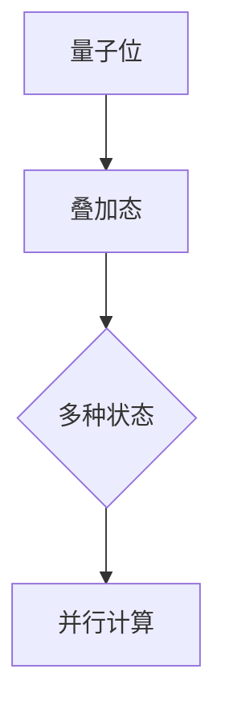

量子位的叠加和纠缠是量子技术的核心特性。叠加态使得量子计算机可以同时处理大量数据，而纠缠则使得量子位之间的状态相互关联，即使相距遥远，一个量子位的状态变化也会立即影响到另一个量子位。这种特性为量子通信和量子计算提供了安全的基础。

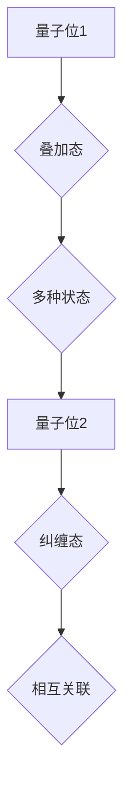

##### 量子安全原理

量子安全通信的核心技术是量子密钥分发（Quantum Key Distribution, QKD）。QKD利用量子纠缠和量子叠加原理，实现通信过程中密钥的绝对安全。在QKD中，发送方和接收方通过量子通道交换量子态，任何第三方窃听都会导致量子态的破坏，从而被检测到。

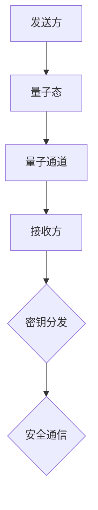

量子密钥分发确保了通信过程中的密钥不会被窃取或篡改，实现了信息传输的绝对安全。此外，量子安全还涉及量子加密技术，如量子密码学和量子隐形传态，这些技术利用量子特性提供高度安全的通信保障。

##### 量子密码学与量子密钥分发

量子密码学是利用量子力学原理进行加密和解密的一种新型密码学。与传统的加密技术不同，量子密码学利用量子态的叠加和纠缠特性实现信息加密和解密。

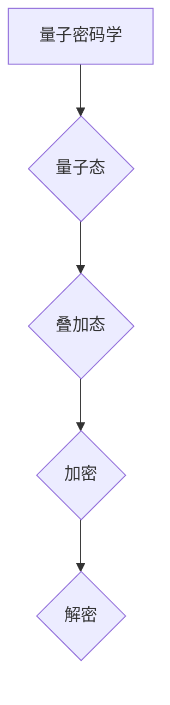

量子密钥分发（QKD）是量子密码学的重要组成部分。QKD通过量子通道传输密钥，任何窃听行为都会导致量子态的破坏，从而使通信双方能够检测到潜在的攻击。QKD具有绝对的安全性，可以有效防止传统加密技术无法防范的窃听和破解。

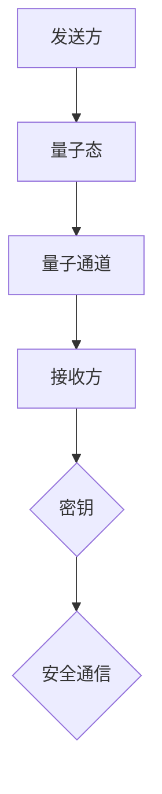

----------------------------------------------------------------

#### 企业IT基础设施面临的挑战

随着网络攻击手段的不断升级，企业面临着数据泄露、系统瘫痪等安全忧虑。网络攻击者利用各种漏洞和攻击技术，如DDoS攻击、SQL注入、恶意软件等，对企业信息资产进行攻击。这些攻击可能导致严重的经济损失和声誉损害。

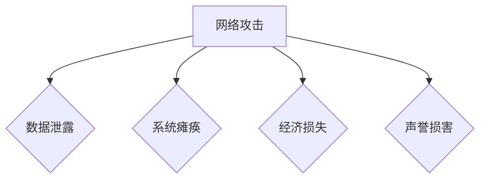

企业在处理和存储大量敏感数据时，面临数据隐私泄露的风险。这些数据包括客户信息、财务记录、知识产权等，一旦泄露将对企业造成严重损失。此外，随着数据量的不断增加，数据隐私保护变得越来越困难。

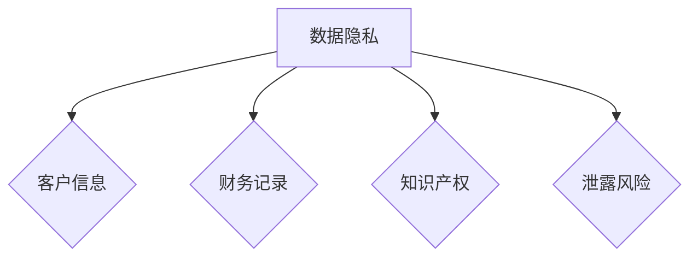

许多企业仍在使用过时的IT基础设施，这些系统缺乏必要的安全保护措施，容易成为网络攻击的目标。过时的硬件和软件也限制了企业对新兴技术的采用。

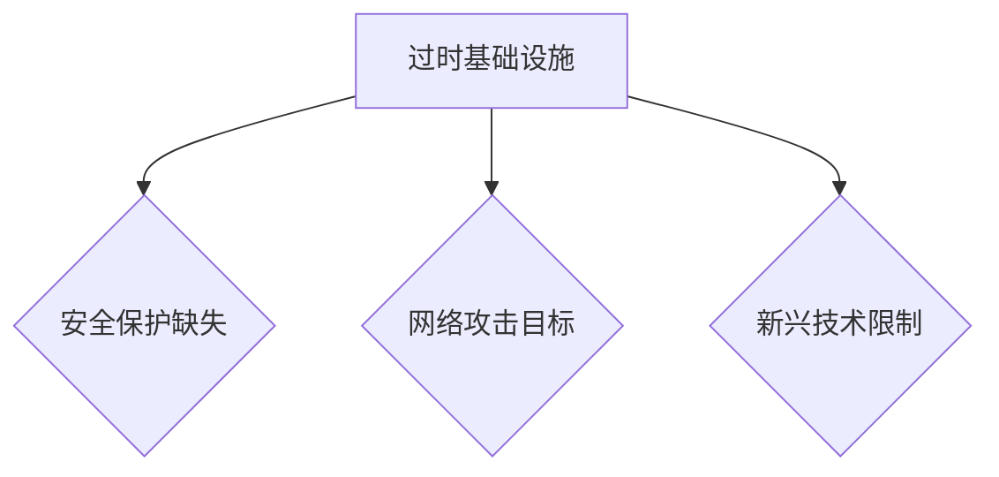

网络威胁的种类繁多，包括病毒、蠕虫、勒索软件等。这些威胁不仅可能导致数据丢失，还可能对企业运营造成严重影响。

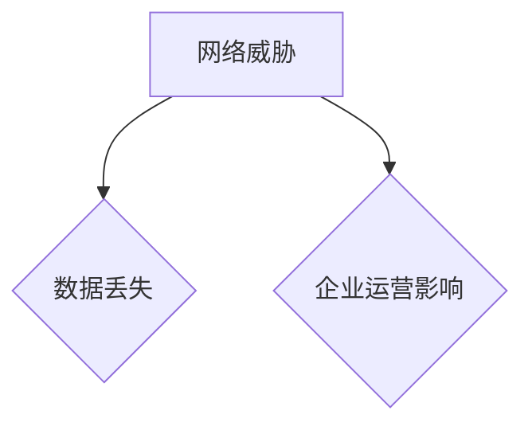

----------------------------------------------------------------

#### 量子技术在IT基础设施中的应用

量子技术在提升企业IT基础设施安全性和性能方面具有巨大潜力。以下是量子技术在几个关键领域的应用：

##### 增强数据安全

量子加密技术可以确保数据在传输和存储过程中的安全性。通过量子密钥分发，企业可以实现绝对安全的通信，有效防止数据泄露和篡改。

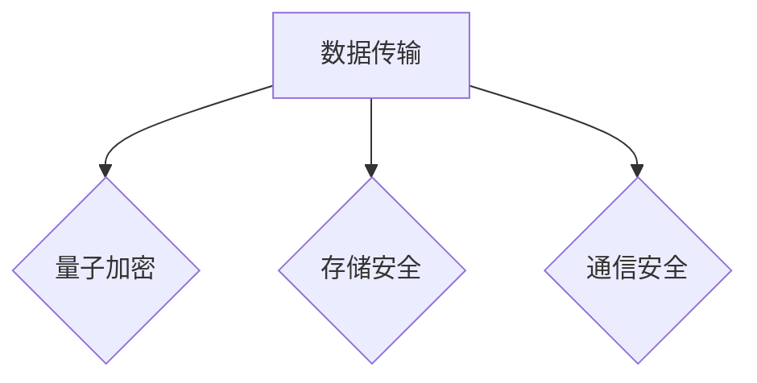

##### 提升数据传输速度

量子通信技术可以实现超高速的数据传输，减少延迟和带宽限制，提高企业网络性能。

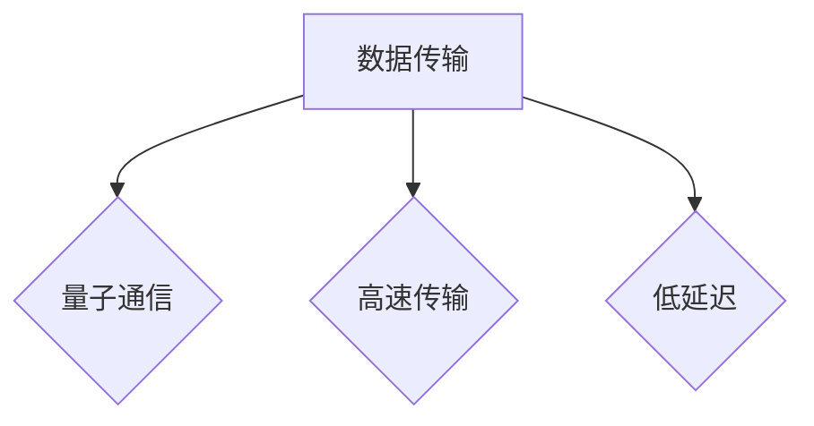

##### 保障云计算安全

量子安全技术在云计算环境中具有重要作用，可以确保云计算服务提供商和用户之间的数据安全，防止数据泄露和未经授权的访问。

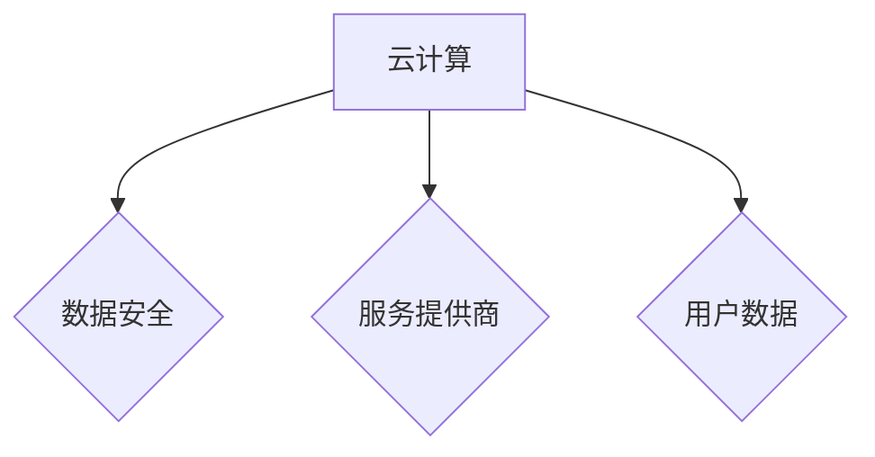

##### 支撑AI与机器学习

量子计算技术在人工智能和机器学习领域具有广泛应用前景，可以加速算法训练和优化，提高企业智能应用的性能。

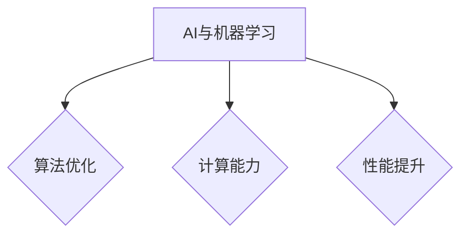

----------------------------------------------------------------

#### 长期战略规划

企业实施量子安全转型需要一套全面的长期战略规划。以下是一些建议：

##### 评估当前基础设施

企业需要对现有IT基础设施进行详细评估，了解其安全性能、硬件和软件状态，以及与量子安全技术的兼容性。评估内容包括网络架构、硬件设备、软件系统、安全措施等。

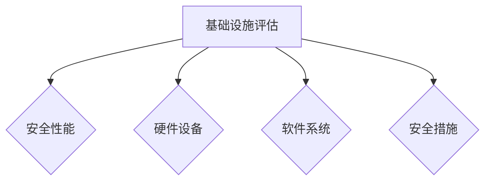

##### 设定安全目标

企业应根据自身业务需求和风险承受能力，设定明确的安全目标，包括数据保护、系统可用性和合规性等。安全目标应具备可衡量性、可实现性和可持续性。

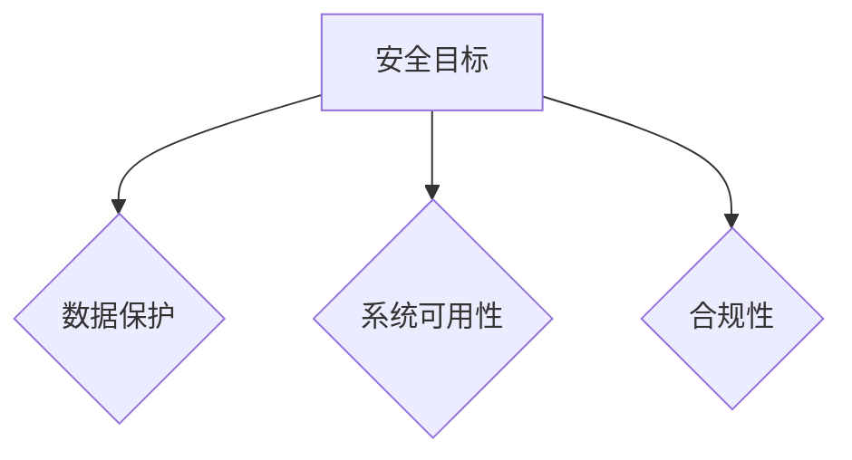

##### 制定量子安全转型路线图

企业应制定详细的量子安全转型路线图，明确转型步骤、时间表和资源需求，确保转型过程的有序进行。路线图应包括以下内容：

- **初始评估**：评估当前IT基础设施的安全性、性能和兼容性。
- **制定策略**：根据评估结果，制定量子安全转型策略，包括技术选型、预算分配等。
- **技术升级**：升级IT硬件和软件，确保支持量子安全功能。
- **系统集成**：将量子安全技术集成到现有IT系统中，确保与业务流程的兼容性。
- **测试与验证**：进行全面的测试和验证，确保量子安全系统的稳定性和有效性。
- **培训与支持**：加强IT人员的培训，提高他们对量子安全技术的理解和应用能力。

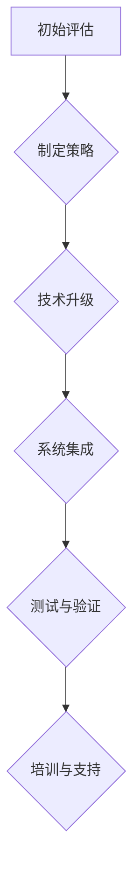

##### 预算投资

量子安全转型需要大量投资，企业应合理预算，确保转型计划的经济可行性。预算应包括以下方面：

- **硬件投资**：购买和支持量子安全技术的硬件设备。
- **软件投资**：开发和支持量子安全软件系统。
- **人员培训**：组织IT人员进行培训，提高对量子安全技术的应用能力。
- **测试与验证**：进行全面的测试和验证，确保量子安全系统的稳定性和有效性。

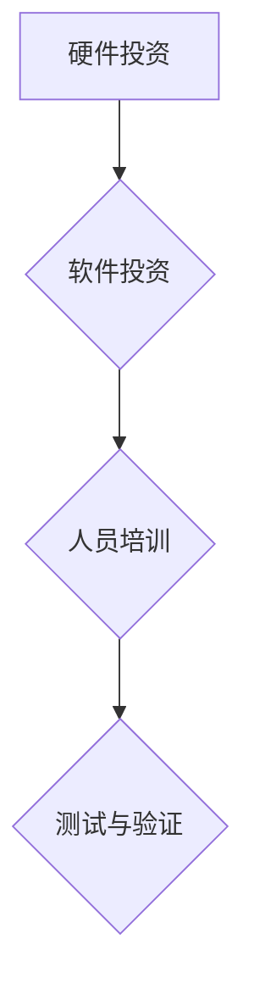

----------------------------------------------------------------

#### 量子安全的实施

##### 升级硬件和软件

企业应升级IT硬件和软件，确保其支持量子安全功能。这可能包括更换量子安全网络设备、更新量子安全软件等。硬件升级应考虑以下方面：

- **处理器和存储设备**：升级处理器和存储设备，提高计算和存储能力。
- **网络设备**：更换网络设备，确保支持量子加密和量子密钥分发。
- **安全设备**：增加量子安全网关和安全终端，提高网络安全性。

软件升级应考虑以下方面：

- **操作系统**：升级操作系统，确保支持量子安全功能。
- **数据库**：更新数据库管理系统，提高数据安全和访问性能。
- **应用软件**：更新应用软件，确保与量子安全技术的兼容性。

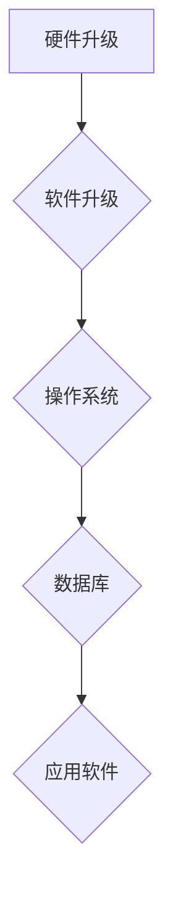

##### 集成量子技术

企业需要将量子安全技术集成到现有IT系统中，确保其与业务流程的兼容性。集成量子技术包括以下步骤：

- **需求分析**：分析业务需求，确定需要集成的量子安全功能。
- **方案设计**：设计集成方案，包括技术选型、架构设计等。
- **实施与部署**：根据设计方案，实施和部署量子安全技术。
- **测试与验证**：进行全面的测试和验证，确保量子安全技术的稳定性和有效性。

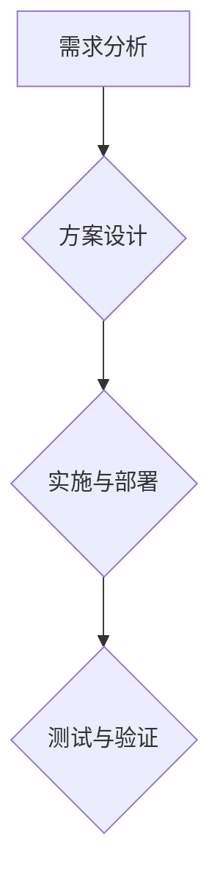

##### 测试和验证

企业应进行全面的测试和验证，确保量子安全系统在实际应用中的稳定性和有效性。测试内容应包括以下方面：

- **功能测试**：验证量子安全技术的功能是否符合预期。
- **性能测试**：评估量子安全技术的性能和响应速度。
- **安全测试**：测试量子安全系统的安全性，包括加密算法、密钥管理、数据保护等。
- **兼容性测试**：验证量子安全技术与现有IT系统的兼容性。

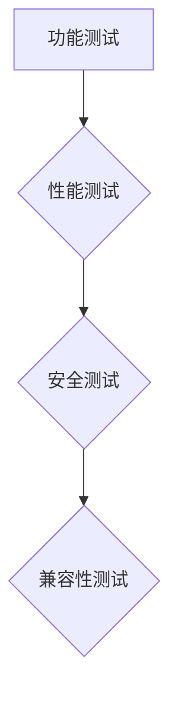

##### 培训IT人员

企业应加强对IT人员的培训，提高他们对量子安全技术的理解和应用能力。培训内容应包括以下方面：

- **技术原理**：介绍量子技术的基础知识和原理。
- **实施方法**：讲解量子安全技术的实施方法和最佳实践。
- **安全意识**：提高IT人员对安全威胁的认识，增强安全意识。

```mermaid
graph TD
A[技术原理] --> B{实施方法}
B --> C{安全意识}
```

----------------------------------------------------------------

#### 案例分析

##### 案例一：XYZ公司

XYZ公司是一家大型金融企业，在面临日益严峻的网络安全威胁和数据泄露风险时，决定采用量子安全技术提升其IT基础设施的安全水平。

首先，XYZ公司对现有IT基础设施进行了详细评估，发现其网络设备、操作系统和数据库系统存在多项安全隐患。基于评估结果，XYZ公司制定了量子安全转型路线图，包括以下步骤：

1. **硬件升级**：更换现有的网络设备和服务器，确保支持量子加密和量子密钥分发。
2. **软件更新**：更新操作系统和数据库管理系统，确保支持量子安全功能。
3. **系统集成**：将量子安全技术集成到现有IT系统中，确保与业务流程的兼容性。
4. **测试与验证**：进行全面的功能测试、性能测试和安全测试，确保量子安全系统的稳定性和有效性。
5. **人员培训**：加强对IT人员的培训，提高他们对量子安全技术的理解和应用能力。

通过实施量子安全转型，XYZ公司成功提升了IT基础设施的安全性。量子密钥分发确保了通信过程中的密钥不会被窃取或篡改，有效防止了数据泄露和网络攻击。此外，量子加密技术提供了高度安全的通信保障，提高了数据传输速度和性能。

##### 案例二：ABC企业

ABC企业是一家制造业企业，在生产过程中需要处理大量敏感数据，如客户信息、订单数据和供应链信息等。为了保障数据安全和提高生产效率，ABC企业决定采用量子安全技术。

首先，ABC企业对现有IT基础设施进行了评估，发现其网络设备和服务器性能不足，且缺乏必要的安全保护措施。基于评估结果，ABC企业制定了量子安全转型路线图，包括以下步骤：

1. **硬件升级**：升级网络设备和服务器，提高计算和存储能力，确保支持量子安全功能。
2. **软件更新**：更新操作系统和数据库管理系统，确保支持量子安全功能。
3. **量子加密部署**：部署量子加密技术，保护敏感数据在传输和存储过程中的安全。
4. **量子密钥分发**：部署量子密钥分发系统，确保通信过程中的密钥不会被窃取或篡改。
5. **性能优化**：对网络架构进行优化，减少延迟和带宽限制，提高数据传输速度。
6. **人员培训**：加强对IT人员的培训，提高他们对量子安全技术的理解和应用能力。

通过实施量子安全转型，ABC企业成功提升了IT基础设施的安全性和性能。量子加密技术提供了高度安全的通信保障，有效防止了数据泄露和网络攻击。此外，量子密钥分发确保了通信过程中的密钥安全，提高了生产效率和数据传输速度。

##### 案例三：123研究院

123研究院是一家科研机构，其研究成果涉及大量敏感数据和知识产权。为了保障研究数据的安全，123研究院决定采用量子安全技术。

首先，123研究院对现有IT基础设施进行了评估，发现其网络设备和服务器性能不足，且缺乏必要的安全保护措施。基于评估结果，123研究院制定了量子安全转型路线图，包括以下步骤：

1. **硬件升级**：升级网络设备和服务器，提高计算和存储能力，确保支持量子安全功能。
2. **软件更新**：更新操作系统和数据库管理系统，确保支持量子安全功能。
3. **量子加密部署**：部署量子加密技术，保护敏感数据在传输和存储过程中的安全。
4. **量子密钥分发**：部署量子密钥分发系统，确保通信过程中的密钥不会被窃取或篡改。
5. **数据备份与恢复**：建立完善的数据备份与恢复机制，确保数据在故障或攻击时能够快速恢复。
6. **人员培训**：加强对IT人员的培训，提高他们对量子安全技术的理解和应用能力。

通过实施量子安全转型，123研究院成功提升了研究数据的安全性和保护能力。量子加密技术提供了高度安全的通信保障，有效防止了数据泄露和网络攻击。此外，量子密钥分发确保了通信过程中的密钥安全，提高了研究效率和数据传输速度。

----------------------------------------------------------------

#### 未来趋势与挑战

##### 技术成熟度

量子技术的成熟度和稳定性是决定其广泛应用的关键因素。尽管目前量子计算机和量子通信技术已经取得了一定进展，但仍然面临着技术瓶颈和稳定性问题。企业需要关注量子技术的最新进展，确保其在实际应用中的可靠性。

```mermaid
graph TD
A[技术成熟度] --> B{量子计算机}
B --> C{量子通信}
C --> D{稳定性问题}
```

##### 成本

量子安全技术的实施成本较高，包括硬件设备、软件系统、人员培训等。企业需要合理预算，确保量子安全转型的经济效益。同时，随着量子技术的普及和发展，成本有望逐渐降低。

```mermaid
graph TD
A[实施成本] --> B{硬件设备}
B --> C{软件系统}
C --> D{人员培训}
D --> E{经济效益}
```

##### 标准和法规

量子安全领域缺乏统一的标准和法规，企业需要积极参与相关标准的制定和推广，确保合规性。政府和行业组织应推动量子安全标准的制定，为企业提供明确的技术规范和法规指导。

```mermaid
graph TD
A[标准和法规] --> B{标准制定}
B --> C{法规指导}
C --> D{合规性}
```

##### 合作与竞争

量子安全技术的发展需要全球范围内的合作与竞争。企业应积极参与国际合作，共同推动技术进步。同时，企业也需要关注竞争对手的动态，不断提升自身的技术实力和市场竞争力。

```mermaid
graph TD
A[合作] --> B{技术进步}
A --> C{竞争}
C --> D{技术实力}
D --> E{市场竞争力}
```

----------------------------------------------------------------

#### 结论

量子安全转型是企业IT基础设施发展的必然趋势。通过引入量子技术，企业可以实现数据安全的绝对保障，提升IT基础设施的整体性能。本文为企业提供了量子安全转型的长期规划方案，并展示了其实际应用案例。未来，量子安全技术的不断发展将为企业带来更多机遇和挑战。企业应积极应对，把握发展机遇，实现量子安全转型的成功。

```mermaid
graph TD
A[量子安全转型] --> B{数据安全}
B --> C{基础设施性能}
C --> D{发展机遇}
D --> E{挑战}
E --> F{成功实现}
```

### 作者信息

- 作者：AI天才研究院/AI Genius Institute & 禅与计算机程序设计艺术 /Zen And The Art of Computer Programming

