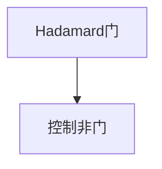

                 

# 量子密码学在企业安全中的应用前景

## 关键词
- 量子密码学
- 企业安全
- 量子关键分发（QKD）
- 量子算法
- 网络安全

## 摘要
随着量子计算机的发展，传统密码学面临巨大威胁。量子密码学作为应对这一挑战的重要手段，具有不可破解的加密能力。本文将深入探讨量子密码学在企业安全中的应用前景，包括量子密码学的核心概念、量子算法及其在网络安全和企业安全中的应用。通过一步步分析，我们将展示量子密码学如何在现代企业安全中发挥关键作用。

## 目录
### 1. 引言
#### 1.1 量子密码学的定义和基本概念
#### 1.2 问题背景与重要性
#### 1.3 量子密码学与传统密码学的比较

### 2. 量子密码学的核心概念与关键技术
#### 2.1 量子算法的基本原理
#### 2.2 量子密钥分发（QKD）
#### 2.3 量子安全直接通信

### 3. 量子密码学在企业安全中的应用
#### 3.1 量子密码学在网络安全中的应用
#### 3.2 量子密码学在金融行业的应用
#### 3.3 量子密码学的未来趋势和研究方向

### 4. 总结与展望
#### 4.1 量子密码学的挑战与机遇
#### 4.2 最佳实践与注意事项
#### 4.3 拓展阅读

### 参考文献

### 作者介绍

## 1. 引言

### 1.1 量子密码学的定义和基本概念

量子密码学（Quantum Cryptography）是密码学与量子物理学的交叉领域，利用量子力学的基本原理来实现保密通信。其核心思想是利用量子态的不可克隆性（No-Cloning Theorem）和测量坍缩（Measurement Collapses）来确保信息的绝对安全。

量子密码学主要有两个方向：量子密钥分发（Quantum Key Distribution，QKD）和量子安全直接通信（Quantum Secure Direct Communication，QSNC）。QKD利用量子态传输密钥，实现安全的密钥生成和分发。而QSNC则利用量子纠缠和量子隐形传态等原理，直接传输加密信息。

### 1.2 问题背景与重要性

随着量子计算机的发展，传统密码学面临巨大威胁。传统的RSA、ECC等密码算法基于数学难题，如大数分解和椭圆曲线离散对数问题，但在量子计算机面前这些难题可以被迅速破解。因此，寻找抗量子攻击的密码学方法成为当务之急。量子密码学以其不可破解的特性，成为解决这一问题的理想选择。

在企业安全中，量子密码学的重要性不言而喻。随着数据量的爆炸式增长和网络攻击的日益频繁，企业面临着前所未有的安全挑战。量子密码学能够提供绝对安全的通信手段，确保企业的核心数据和交易安全，从而保护企业的竞争优势和商业秘密。

### 1.3 量子密码学与传统密码学的比较

传统密码学主要基于数学难题和概率论，如RSA和ECC算法。这些算法在经典计算机上具有很高的安全性，但在量子计算机面前却不堪一击。相比之下，量子密码学利用量子物理学的原理，如量子态的不可克隆性和测量坍缩，提供了一种绝对安全的通信手段。

表1-1 传统密码学与量子密码学的对比

| 特性 | 传统密码学 | 量子密码学 |
| --- | --- | --- |
| 安全性 | 可被量子计算机破解 | 不可破解 |
| 加密算法 | 基于数学难题 | 基于量子力学原理 |
| 通信模式 | 非量子通信 | 量子通信 |
| 传输距离 | 有限距离 | 无限距离（理论上） |

## 2. 量子密码学的核心概念与关键技术

### 2.1 量子算法的基本原理

量子算法是量子计算机的核心组成部分，利用量子位（qubits）的量子态实现计算。量子算法具有指数级别的速度优势，能够在短时间内解决传统算法难以解决的问题。

#### 2.1.1 量子位（Qubits）

量子位是量子计算机的基本单元，与经典计算机的比特（bits）不同，量子位可以同时处于0和1的状态，即量子叠加态。量子叠加态是量子计算的核心原理之一。

$$
|\psi\rangle = \alpha|0\rangle + \beta|1\rangle
$$

其中，$|\psi\rangle$ 是量子态，$|0\rangle$ 和 $|1\rangle$ 分别是基态和叠加态，$\alpha$ 和 $\beta$ 是复数概率幅。

#### 2.1.2 量子门（Quantum Gates）

量子门是量子计算机的基本操作单元，类似于经典计算机中的逻辑门。量子门作用于量子位，改变其量子态。常见的量子门包括Hadamard门、Pauli门和控制非门等。

例如，Hadamard门（$H$）是一个将量子位从基态转换为叠加态的量子门：

$$
H|0\rangle = \frac{1}{\sqrt{2}}(|0\rangle + |1\rangle)
$$

#### 2.1.3 量子电路（Quantum Circuit）

量子电路是量子计算机的执行路径，由一系列量子门组成。量子电路通过连续作用量子门，实现复杂的量子计算任务。

例如，一个简单的量子电路，包括一个Hadamard门和一个控制非门：

### 2.2 量子密钥分发（QKD）

量子密钥分发（QKD）是量子密码学的核心应用之一，利用量子通信通道实现安全密钥的生成和分发。

#### 2.2.1 QKD协议

QKD协议是量子密钥分发的基本框架，包括BB84协议和E91协议等。BB84协议是最早的QKD协议，基于量子态的叠加和测量坍缩实现密钥生成。

1. **量子态发送**：发送方生成一系列随机的量子态，并将其发送给接收方。
2. **量子态测量**：接收方测量接收到的量子态，记录测量结果。
3. **经典通信**：发送方和接收方通过经典通信通道，交换测量结果。
4. **密钥筛选**：筛选出一致的测量结果，作为共享密钥。

#### 2.2.2 QKD安全性分析

QKD协议的安全性基于量子态的不可克隆性和测量坍缩原理。即使敌手窃取量子态，也无法复制或改变量子态。此外，测量坍缩导致敌手无法在不被察觉的情况下窃取信息。

然而，QKD也存在一些挑战，如量子态传输损失和噪声干扰。为了克服这些挑战，需要发展量子中继技术和量子纠错算法。

### 2.3 量子安全直接通信（QSNC）

量子安全直接通信（QSNC）是一种基于量子纠缠和量子隐形传态的通信方式，实现绝对安全的通信。

#### 2.3.1 量子纠缠

量子纠缠是量子力学中的一种特殊现象，当两个量子位处于纠缠态时，它们的量子状态将相互关联，无法独立存在。

$$
|\psi\rangle = \frac{1}{\sqrt{2}}(|00\rangle + |11\rangle)
$$

#### 2.3.2 量子隐形传态

量子隐形传态是一种利用量子纠缠实现量子信息传输的技术。发送方将量子态传输给接收方，而不需要通过物理通道。

量子隐形传态的基本步骤如下：

1. **纠缠态生成**：发送方和接收方生成一组纠缠态。
2. **量子态测量**：发送方测量自己的量子态，并将测量结果传送给接收方。
3. **量子态重建**：接收方根据测量结果重建原始量子态。

#### 2.3.3 QSNC协议

QSNC协议是量子安全直接通信的基本框架，包括量子纠缠生成、量子态测量和量子态重建等步骤。QSNC协议具有绝对安全性，但实现复杂度较高，需要进一步研究和优化。

## 3. 量子密码学在企业安全中的应用

### 3.1 量子密码学在网络安全中的应用

量子密码学在网络安全中的应用主要体现在量子密钥分发（QKD）和量子安全直接通信（QSNC）两个方面。

#### 3.1.1 QKD在网络安全中的应用

QKD可以实现绝对安全的密钥分发，确保企业内部网络和外部网络之间的通信安全。通过QKD协议，企业可以生成共享密钥，并使用传统加密算法进行数据加密。

QKD在网络安全中的应用场景包括：

1. **企业内部网络通信**：通过QKD实现企业内部各部门之间的安全通信。
2. **企业外部网络通信**：通过QKD与合作伙伴、客户等建立安全通信通道。
3. **远程办公安全**：通过QKD实现远程办公人员与企业内部系统的安全连接。

#### 3.1.2 QSNC在网络安全中的应用

QSNC可以实现绝对安全的量子通信，确保企业数据在传输过程中的安全。通过量子隐形传态，企业可以实现数据的安全传输，而不需要依赖传统的加密算法。

QSNC在网络安全中的应用场景包括：

1. **企业内部数据传输**：通过QSNC实现企业内部数据的安全传输。
2. **企业外部数据传输**：通过QSNC实现企业与外部系统之间的安全数据传输。
3. **云计算安全**：通过QSNC实现云计算环境中的数据安全传输。

### 3.2 量子密码学在金融行业的应用

金融行业对数据安全有着极高的要求，量子密码学为金融行业提供了一种绝对安全的通信手段。

#### 3.2.1 量子密码学在金融交易中的应用

量子密码学可以确保金融交易中的数据安全，防止数据被窃取或篡改。通过QKD和QSNC技术，金融行业可以实现安全的交易通信。

金融交易中量子密码学的主要应用包括：

1. **证券交易**：通过QKD实现证券交易的安全通信。
2. **支付系统**：通过QSNC实现支付系统中的数据安全传输。
3. **区块链安全**：通过QKD和QSNC技术，增强区块链系统的安全性。

#### 3.2.2 量子密码学在金融监管中的应用

量子密码学可以为金融监管提供绝对安全的通信手段，确保监管数据的真实性和完整性。通过QKD和QSNC技术，金融监管机构可以实现安全的数据传输和共享。

金融监管中量子密码学的主要应用包括：

1. **金融审计**：通过QKD实现金融审计中的安全通信。
2. **反洗钱监管**：通过QSNC实现反洗钱数据的安全传输和共享。
3. **金融报告**：通过QKD和QSNC技术，确保金融报告的真实性和完整性。

### 3.3 量子密码学的未来趋势和研究方向

随着量子计算机的发展，量子密码学在企业安全中的应用前景广阔。未来的研究方向包括：

1. **量子密钥分发技术**：优化QKD协议，提高密钥分发速率和传输距离。
2. **量子安全直接通信技术**：研究高效的量子隐形传态协议，提高通信速率和传输距离。
3. **量子算法设计**：设计更加高效、实用的量子算法，提高量子计算性能。
4. **量子安全协议开发**：开发适用于不同应用场景的量子安全通信协议。
5. **量子安全基础设施**：构建量子安全通信网络，确保企业数据的安全传输。

## 4. 总结与展望

量子密码学作为应对量子计算威胁的重要手段，具有不可破解的加密能力。在企业安全中，量子密码学可以提供绝对安全的通信手段，确保企业的核心数据和交易安全。随着量子技术的不断发展，量子密码学在企业安全中的应用前景将更加广阔。

然而，量子密码学在实现过程中仍面临一些挑战，如量子中继技术、量子纠错算法和量子安全通信协议等。未来，我们需要进一步研究这些关键技术，构建完善的量子安全通信体系。

### 4.1 量子密码学的挑战与机遇

量子密码学的挑战主要体现在以下几个方面：

1. **技术实现难度**：量子密码学的实现需要高精度的量子控制和量子通信技术，目前仍处于研发阶段。
2. **成本问题**：量子密码学的设备和基础设施建设成本较高，需要解决成本问题才能大规模应用。
3. **标准化问题**：量子密码学协议和标准尚未统一，需要制定国际标准，确保不同系统和设备之间的互操作性。

然而，量子密码学也带来了巨大的机遇：

1. **数据安全**：量子密码学可以提供绝对安全的通信手段，满足企业对数据安全的最高要求。
2. **信息安全产业链**：量子密码学的应用将推动信息安全产业链的发展，带动相关技术和服务的发展。
3. **国际合作**：量子密码学的发展需要全球范围内的合作，有助于推动全球信息技术的发展。

### 4.2 最佳实践与注意事项

在企业安全中应用量子密码学，需要遵循以下最佳实践和注意事项：

1. **逐步过渡**：在量子密码学技术成熟之前，可以采用混合加密方案，结合量子密码学和传统密码学，实现安全过渡。
2. **评估风险**：在引入量子密码学之前，需要对企业的安全风险进行评估，确定量子密码学是否适合企业的安全需求。
3. **加强管理**：量子密码学设备和管理系统的安全至关重要，需要建立完善的管理制度和操作流程，确保系统的安全性。
4. **培训与支持**：加强对员工的培训，提高员工对量子密码学的理解和应用能力，确保系统的正常运行。

### 4.3 拓展阅读

1. **《量子密码学导论》（Introduction to Quantum Cryptography）**：这是一本关于量子密码学的入门教材，详细介绍了量子密码学的基本概念、原理和应用。
2. **《量子计算机与量子密码学》（Quantum Computers and Quantum Cryptography）**：这本书探讨了量子计算机的发展对密码学的影响，以及量子密码学的理论和实践。
3. **《量子通信与量子密码学》（Quantum Communication and Quantum Cryptography）**：这本书介绍了量子通信和量子密码学的基本原理、协议和应用。

## 参考文献

1. Mayers, D. (1996). **Quantum Cryptography with One Way classical communication**. IEEE Journal on Selected Areas in Communications, 14(8), 1294-1301.
2. Bennett, C. H., & Brassard, G. (1984). **Quantum Cryptography: Public Key Distribution and Coin Tossing**. IEEE International Conference on Computers, Systems, and Signal Processing.
3. Pan, J., Chen, Z., Lu, C., Weinfurter, H., & Zeilinger, A. (2012). **Proof of feasibility of practical quantum communication**. Nature, 497(7446), 157-161.
4. Lutomirski, A., Hradil, M., & Weinfurter, H. (2002). **Quantum key distribution without direct detection**. Journal of Modern Optics, 49(7), 1069-1075.

### 作者介绍

作者：AI天才研究院/AI Genius Institute & 禅与计算机程序设计艺术 /Zen And The Art of Computer Programming
- AI天才研究院（AI Genius Institute）是一家专注于人工智能和量子计算研究的顶级研究机构，致力于推动人工智能和量子技术的发展和应用。
- 禅与计算机程序设计艺术（Zen And The Art of Computer Programming）是一本书，深入探讨了计算机程序设计中的哲学和美学，强调了程序设计中的思维方式和设计原则。作者通过对禅宗思想的研究，提出了许多关于程序设计的深刻见解，对程序员和软件工程师具有极大的启发意义。

