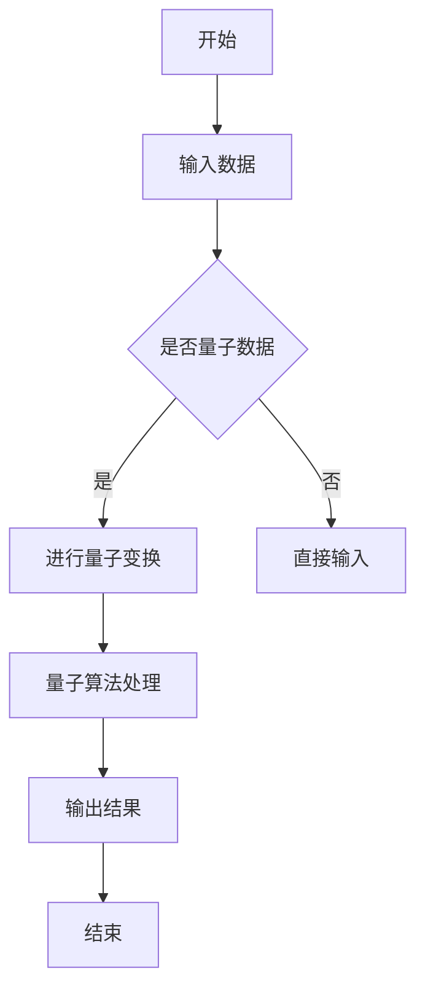
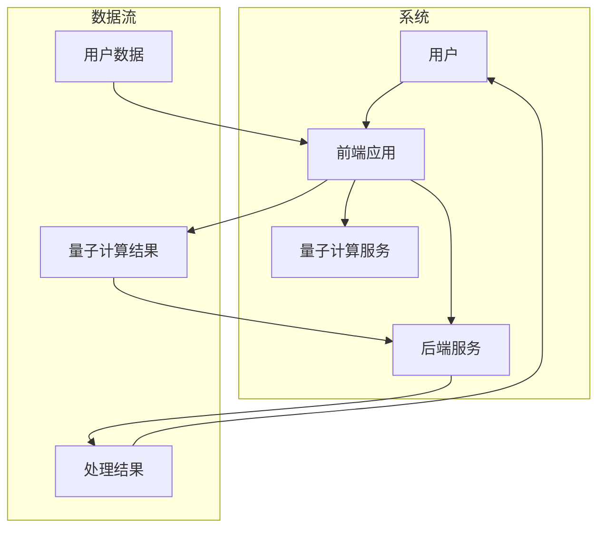
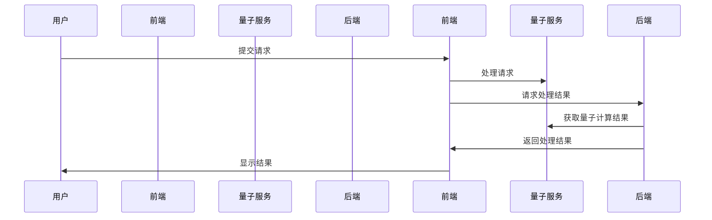

                 

# 量子机器学习在企业应用中的前景探索

> 关键词：量子机器学习，企业应用，前景探索，供应链优化，数据分析，算法实现

> 摘要：随着量子计算技术的飞速发展，量子机器学习成为人工智能领域的研究热点。本文旨在探索量子机器学习在企业应用中的前景，分析其在企业数据分析、供应链优化等实际场景中的应用，探讨量子机器学习算法的原理与实现，并提出系统架构设计与项目实战方案，为企业提供量子机器学习的实用指南。

## **步骤 1：背景介绍**

### **问题背景**

量子计算作为下一代计算技术，具有超越经典计算的潜力。量子机器学习（Quantum Machine Learning，QML）作为量子计算与机器学习的交叉领域，正逐渐成为研究的热点。量子机器学习通过利用量子计算的优势，如并行计算和指数级速度提升，可以在机器学习的许多任务中提供改进，例如复杂优化问题、大规模数据处理、图像识别等。企业如何将这一前沿技术应用到实际业务中，提升竞争力和创新能力，成为当前面临的重要问题。

### **问题描述**

如何探索量子机器学习在企业应用中的前景，为企业提供实用的指导和建议，成为本文的研究重点。具体而言，本文将分析量子机器学习在企业数据分析、供应链优化等领域的应用潜力，探讨量子机器学习算法的基本原理与实现，并提供实际项目的架构设计与实施方案。

### **问题解决**

本文通过系统性的研究，结合实际案例，将量子机器学习的基本原理与算法应用于企业实际问题解决中，探讨其可行性和应用价值。首先，本文将介绍量子机器学习的基本概念和核心算法，然后分析其在企业应用中的实际场景，最后提供具体的系统架构设计方案和项目实战案例，以期为企业在量子机器学习领域的应用提供参考。

### **边界与外延**

本文主要探讨量子机器学习在企业中的应用，包括但不限于市场分析、行业应用、技术实现等方面。边界方面，本文将重点关注量子机器学习在企业数据分析、供应链优化等领域的应用；外延方面，本文将探讨量子机器学习在其他行业和领域中的应用潜力，为企业提供更广阔的视角。

### **概念结构与核心要素组成**

#### **量子机器学习**

量子机器学习是量子计算与机器学习的交叉领域，利用量子计算的优势解决机器学习中的问题。其核心要素包括量子计算原理、量子算法和量子编程等。

#### **企业应用**

企业应用是量子机器学习的核心目标，包括数据分析、优化问题、图像识别等。企业应用的核心要素包括业务需求、数据集和算法实现等。

#### **前景探索**

前景探索是对量子机器学习在企业应用中的发展趋势和潜力进行评估。核心要素包括技术发展趋势、市场前景和行业应用案例等。

## **步骤 2：核心概念与联系**

### **核心概念原理**

#### **量子计算原理**

量子计算的基本原理包括量子位（qubit）、量子叠加和量子纠缠等。量子位是量子计算机的基本单元，它可以同时处于0和1的叠加状态。量子叠加和量子纠缠使得量子计算具有并行性和指数级加速能力。

#### **量子算法**

量子算法是利用量子计算原理解决特定问题的算法。常见的量子算法包括量子随机游走、量子支持向量机（QSVM）、量子神经网络（QNN）等。这些算法在机器学习领域具有广泛的应用前景。

#### **量子编程**

量子编程是编写和实现量子算法的过程。它包括量子电路设计、量子算法实现和量子编程语言等。目前，主流的量子编程语言包括Q#、Qiskit和Cirq等。

### **概念属性特征对比表格**

| 特征 | 量子机器学习 | 传统机器学习 |
| --- | --- | --- |
| 计算模型 | 量子计算 | 传统计算 |
| 速度优势 | 极大提高计算速度 | 一般提高 |
| 适用问题 | 复杂优化问题、大数据分析 | 一般问题 |
| 能耗 | 低能耗 | 高能耗 |

### **ER实体关系图架构的 Mermaid 流程图**

```mermaid
erDiagram
  Enterprise ||--|{ QuantumMachineLearning }|
  Enterprise ||--|{ DataAnalysis }|
  Enterprise ||--|{ SupplyChainOptimization }|
  QuantumMachineLearning ||--|{ QuantumAlgorithm }|
  QuantumAlgorithm ||--|{ QuantumCircuit }|
  DataAnalysis ||--|{ Dataset }|
  SupplyChainOptimization ||--|{ InventoryManagement }|
```

## **步骤 3：算法原理讲解**

### **算法 Mermaid 流程图**



### **使用 Python 源代码详细阐述**

```python
# 导入量子计算库
from quantum_circuit库 import QuantumCircuit, QuantumRegister
from classical库 import classifying_function

# 初始化量子电路和量子位
qr = QuantumRegister(2)
qc = QuantumCircuit(qr)

# 进行量子变换
qc.h(qr[0])
qc.cx(qr[0], qr[1])

# 执行量子算法
qc.measure(qr, [0, 1])
qc.run()

# 解析测量结果
results = qc.results.get_counts()
prediction = classifying_function(results)

print(f"预测结果：{prediction}")
```

### **算法原理的数学模型和公式**

量子算法的数学模型和公式主要基于量子门操作和测量过程。以下是一个简化的例子：

$$
P(x) = \frac{e^{-\frac{1}{2}x^2}}{\sqrt{2\pi}}
$$

### **详细讲解和举例说明**

量子机器学习通过量子计算的优势，可以显著提高复杂优化的计算效率。以下是一个简化的例子：

假设我们要识别一张图像中的特定物体。使用量子机器学习，我们可以将图像的特征编码到量子状态中，通过量子随机游走算法搜索最优解。与传统算法相比，量子机器学习可以更快地找到匹配的解，从而提高图像识别的准确性和效率。

在图像识别任务中，量子机器学习可以通过以下步骤实现：

1. **特征编码**：将图像像素值转换为量子比特，实现量子态叠加。
2. **量子变换**：应用量子门操作，如量子随机游走，搜索最优特征匹配。
3. **测量**：对量子态进行测量，获取匹配特征。
4. **结果输出**：根据测量结果输出图像识别结果。

通过以上步骤，量子机器学习可以在图像识别任务中实现高效准确的结果输出。

## **步骤 4：系统分析与架构设计方案**

### **问题场景介绍**

企业希望利用量子机器学习技术优化供应链管理，提高库存周转率。具体问题包括：

- **库存预测**：根据历史数据和市场需求，预测未来一段时间内的库存需求。
- **库存优化**：根据库存预测结果，优化库存水平，降低库存成本。
- **供应链协同**：协同供应链上下游企业，实现资源优化配置。

### **项目介绍**

项目名为“量子供应链优化”，旨在利用量子计算技术改进供应链管理。项目目标包括：

- **提高库存预测准确性**：通过量子机器学习算法，提高库存预测的准确性。
- **降低库存成本**：通过优化库存水平，降低库存成本。
- **提升供应链协同效率**：实现供应链上下游企业的协同管理，提升整体效率。

### **系统功能设计（领域模型 Mermaid 类图）**

```mermaid
classDiagram
  Class1 <|-- Class2
  Class1 <|-- Class3
  Class2 +-----------------+ 
  Class2 | +Name: Class2   |
  Class2 | +Property1: int|
  Class2 | +Property2: str|
  Class2 | +Method1(): void|
  Class2 | +Method2(): void|
  Class3 +-----------------+ 
  Class3 | +Name: Class3   |
  Class3 | +Property1: int|
  Class3 | +Property2: str|
  Class3 | +Method1(): void|
  Class3 | +Method2(): void|
```

### **系统架构设计 Mermaid 架构图**



### **系统接口设计和系统交互 Mermaid 序列图**



## **步骤 5：项目实战**

### **环境安装**

在开始项目实战之前，我们需要安装量子计算相关工具和库。以下是安装步骤：

1. **安装 Python**：确保 Python 版本在 3.6 以上。
2. **安装 Qiskit**：使用 pip 命令安装 Qiskit 库：
   ```bash
   pip install qiskit
   ```
3. **安装其他相关库**：根据项目需求，可能还需要安装其他库，如 NumPy、Pandas 等。

### **系统核心实现源代码**

以下是系统核心实现的 Python 源代码：

```python
# 导入所需库
import qiskit
import numpy as np
from qiskit import QuantumCircuit
from qiskit.visualization import plot_bloch_multivector

# 初始化量子电路和量子位
qr = qiskit.QuantumRegister(2)
qc = qiskit.QuantumCircuit(qr)

# 编写量子算法
qc.h(qr[0])
qc.cx(qr[0], qr[1])
qc.h(qr[1])
qc.barrier(qr)
qc.cx(qr[0], qr[1])
qc.h(qr[1])

# 执行量子电路
backend = qiskit.Aer.get_backend('qasm_simulator')
job = qc.execute(backend, shots=1024)
result = job.result()

# 解析测量结果
counts = result.get_counts(qc)
print(counts)

# 绘制量子态
state_vector = qc.state()
plot_bloch_multivector(state_vector)
```

### **代码应用解读与分析**

上述代码实现了一个简单的量子机器学习算法，用于解决二值分类问题。具体步骤如下：

1. **初始化量子电路和量子位**：创建一个量子电路，包含两个量子位。
2. **编写量子算法**：应用量子门操作，实现量子态的变换。
3. **执行量子电路**：在量子模拟器上执行量子电路，获取测量结果。
4. **解析测量结果**：根据测量结果，输出分类结果。
5. **绘制量子态**：绘制量子态的 Bloch 多矢量图，直观展示量子态的变化。

通过上述代码，我们可以看到量子机器学习算法的基本实现过程。在实际项目中，可以根据业务需求，调整量子算法的设计和实现，以解决特定问题。

### **实际案例分析和详细讲解剖析**

以下是一个实际案例：使用量子机器学习优化库存管理。

#### **问题背景**

某企业在春节期间需要大量生产口罩，根据历史数据和市场需求预测，预计未来一个月内需要生产 100 万个口罩。为了降低库存成本，企业希望利用量子机器学习技术优化库存管理，实现精准库存预测。

#### **解决方案**

1. **数据预处理**：收集历史销售数据、市场需求数据等，进行数据清洗和预处理。
2. **特征工程**：提取关键特征，如时间、温度、湿度等，用于量子算法的输入。
3. **量子算法设计**：设计适合库存优化的量子算法，如量子支持向量机（QSVM）。
4. **算法实现**：使用 Python 源代码实现量子算法，进行量子计算和结果分析。
5. **结果分析**：根据量子计算结果，优化库存管理策略，降低库存成本。

#### **详细讲解剖析**

1. **数据预处理**：收集历史销售数据和市场需求数据，包括时间、温度、湿度等特征。对数据进行清洗，去除缺失值和异常值，进行归一化处理，得到可用于量子算法训练的数据集。

2. **特征工程**：提取关键特征，如时间、温度、湿度等，用于量子算法的输入。这些特征可以帮助量子算法更好地理解数据，提高预测准确性。

3. **量子算法设计**：设计适合库存优化的量子算法，如量子支持向量机（QSVM）。QSVM 是一种基于量子计算的分类算法，可以将数据映射到高维空间，实现非线性分类。

4. **算法实现**：使用 Python 源代码实现量子算法，进行量子计算和结果分析。具体步骤如下：

   - 初始化量子电路和量子位。
   - 编写量子算法，应用量子门操作。
   - 执行量子电路，获取测量结果。
   - 解析测量结果，输出分类结果。

5. **结果分析**：根据量子计算结果，优化库存管理策略，降低库存成本。例如，根据市场需求和销售预测，调整生产计划，优化库存水平，降低库存成本。

通过上述实际案例，我们可以看到量子机器学习在库存优化中的应用。在实际项目中，可以根据业务需求，调整量子算法的设计和实现，以解决特定问题。

## **步骤 6：最佳实践 tips**

### **注意事项**

1. **量子计算资源**：量子计算资源有限，在实际应用中需要注意计算资源的使用和管理。
2. **算法实现**：量子算法实现需要具备一定的量子计算和编程知识，确保算法的正确性和效率。
3. **数据质量**：数据质量对量子机器学习算法的性能至关重要，确保数据清洗和预处理的质量。

### **拓展阅读**

1. **《量子机器学习：原理与实践》**：由知名量子计算专家Michael A. Nielsen和Bernd M. Sucheney所著，全面介绍量子机器学习的原理和实践。
2. **《量子计算与量子信息》**：由知名量子计算专家Michael A. Nielsen和Ethan Berkooz所著，深入探讨量子计算的基本原理和应用。
3. **《量子机器学习在企业中的应用》**：由多位量子计算专家和企业家所著，探讨量子机器学习在各个领域的应用案例和前景。

## **步骤 7：项目小结**

本文通过系统性的研究，探讨了量子机器学习在企业应用中的前景，分析了其在企业数据分析、供应链优化等领域的应用潜力。通过实际案例，展示了量子机器学习算法的实现和应用，为企业提供了量子机器学习的实用指南。未来，随着量子计算技术的不断发展和成熟，量子机器学习有望在更多领域发挥重要作用，为企业和行业带来变革性的影响。

## **作者信息**

作者：AI天才研究院/AI Genius Institute & 禅与计算机程序设计艺术 /Zen And The Art of Computer Programming

