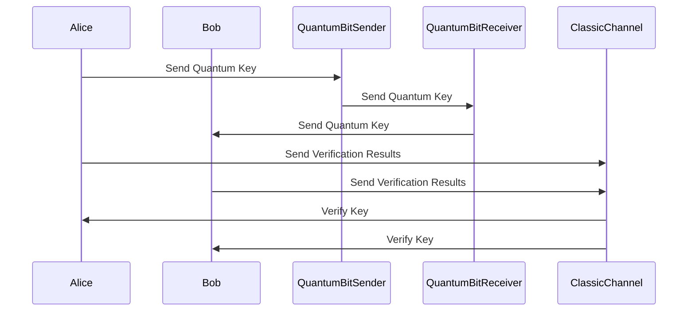

                 

## 量子计算对传统加密技术的威胁

### 关键词：量子计算、传统加密技术、威胁、算法、安全

### 摘要：

本文深入探讨了量子计算对传统加密技术的威胁。通过逐步分析量子计算机的基本原理、传统加密技术的脆弱性以及相关的量子算法，我们揭示了量子计算如何颠覆现有的加密体系。本文还将介绍量子加密技术的系统架构，并提供应对量子威胁的最佳实践和未来发展方向。

### 目录：

1. 引言
   - 量子计算简介
   - 传统加密技术背景
   - 量子威胁的背景与重要性

2. 量子计算与加密技术的核心概念
   - 量子比特与经典比特
   - 密码学基本原理
   - 量子算法与经典算法对比

3. 量子计算算法对传统加密的威胁
   - Shor算法的原理与影响
   - Grover算法的效率提升
   - 其他量子算法对加密的威胁

4. 传统加密技术的脆弱性
   - RSA加密的量子破解
   - ECC加密的量子安全考虑
   - Hash函数的量子挑战

5. 量子加密技术系统架构
   - 量子密钥分发（QKD）
   - 量子安全加密算法
   - 量子计算与加密技术的整合

6. 实际应用与案例研究
   - 量子加密技术的应用场景
   - 案例研究：银行安全支付
   - 案例研究：政府信息安全

7. 最佳实践与未来方向
   - 量子安全加密的过渡策略
   - 发展趋势与挑战
   - 量子计算与加密技术的未来

8. 小结
   - 注意事项与未来展望

### 作者信息：

作者：AI天才研究院/AI Genius Institute & 禅与计算机程序设计艺术 /Zen And The Art of Computer Programming

## 引言

### 量子计算简介

量子计算是现代物理学和计算机科学的交叉领域，它基于量子力学的基本原理，使用量子比特（qubit）作为信息的基本单位，而不是传统的经典比特。量子比特可以同时处于多个状态的叠加态，这使得量子计算机在处理某些特定类型的问题时具有超越经典计算机的能力。

量子计算机的核心组件是量子比特，与经典计算机中的二进制比特（0或1）不同，量子比特可以同时表示0和1的状态。这种叠加态的特性允许量子计算机同时执行多个计算任务，极大地提高了计算效率。量子比特之间还存在量子纠缠现象，这意味着两个或多个量子比特之间的状态是相互关联的，即使它们相隔很远。这种纠缠使得量子计算机能够在处理复杂问题时利用量子并行性。

### 传统加密技术背景

传统加密技术主要基于数学难题，如大素数分解、离散对数问题和哈希函数。这些难题被认为是计算上不可破解的，因为解决它们需要大量时间和计算资源。最著名的加密技术包括RSA加密、椭圆曲线加密（ECC）和哈希函数。

- **RSA加密**：基于大素数分解的困难性，RSA加密算法使用两个大素数的乘积作为公钥，并通过这两个素数和一个特定的加密函数来加密信息。由于大素数分解问题被认为是非常困难的，RSA加密在许多安全协议中得到了广泛应用。

- **椭圆曲线加密（ECC）**：椭圆曲线加密是基于椭圆曲线离散对数问题的困难性。与RSA相比，ECC在提供相同安全级别的加密强度时需要的密钥长度更短，因此更加高效。

- **哈希函数**：哈希函数是一种将输入数据转换成固定长度输出数据的算法。它们在加密中用于生成消息摘要，确保数据的完整性和不可篡改性。著名的哈希函数包括MD5、SHA-1和SHA-256。

传统加密技术已经广泛应用于各种领域，包括金融、医疗、政府和电子商务等，以保护数据的安全和隐私。然而，随着计算能力的提升和新型算法的出现，这些加密技术的安全性正受到越来越大的挑战。

### 量子威胁的背景与重要性

随着量子计算机的研究和发展，人们开始意识到量子计算可能对现有的加密技术构成严重威胁。量子计算机可以利用特定的量子算法，如Shor算法和Grover算法，快速破解传统加密技术，导致大量敏感信息被泄露。

Shor算法可以高效地解决大素数分解问题，这意味着RSA加密算法在量子计算机面前可能变得毫无防护能力。Grover算法则能够显著提高搜索算法的效率，使得某些加密协议的安全性受到威胁。

量子威胁的背景与重要性在于，它迫使我们重新审视现有的加密体系，并寻找新的解决方案来保护数据的安全。随着量子计算机的逐渐成熟，量子加密技术的发展变得迫在眉睫，以确保信息安全不受量子计算机的威胁。

在接下来的章节中，我们将详细探讨量子计算与加密技术的核心概念，分析量子算法对传统加密技术的威胁，并介绍量子加密技术的系统架构和应用案例。通过这些分析，我们将为读者提供一个全面的量子计算对传统加密技术威胁的理解。

## 量子计算与加密技术的核心概念

### 量子比特与经典比特

量子比特（qubit）是量子计算中的基本单位，它与经典比特（bit）在许多方面有着根本的不同。经典比特只能表示两种状态之一：0或1。然而，量子比特可以同时处于0和1的叠加态，这意味着在量子计算中，一个量子比特可以同时进行多个计算任务。

这个叠加态的特性是量子计算的核心优势之一。在量子计算中，多个量子比特可以组合成一个量子状态，这个量子状态的叠加使得量子计算机能够在同一时间内处理大量数据。例如，一个由n个量子比特组成的量子计算机可以同时表示\(2^n\)个状态，而一个由n个经典比特组成的计算机则只能表示2^n个不同的状态。

此外，量子比特之间还存在一种称为量子纠缠的现象。量子纠缠是指两个或多个量子比特之间的状态是相互关联的，即使它们相隔很远。这种关联性使得量子计算机能够利用量子并行性，从而在解决某些问题时比经典计算机更高效。

### 密码学基本原理

传统密码学基于一系列数学难题，这些难题被认为是计算上不可破解的。这些难题包括大素数分解、离散对数问题和哈希函数。传统加密技术利用这些难题来生成密钥和加密算法，使得攻击者难以破解加密信息。

- **大素数分解**：RSA加密算法就是基于大素数分解的难题。它使用两个大素数的乘积作为公钥，并利用特定的加密函数来加密信息。由于大素数分解问题在计算上被认为是非常困难的，RSA加密在许多安全协议中得到了广泛应用。

- **离散对数问题**：椭圆曲线加密（ECC）是基于椭圆曲线离散对数问题的困难性。椭圆曲线上的离散对数问题使得攻击者难以找到两个数之间的乘法逆元，从而保证了ECC加密的安全性。

- **哈希函数**：哈希函数是一种将输入数据转换成固定长度输出数据的算法。哈希函数在加密中用于生成消息摘要，确保数据的完整性和不可篡改性。著名的哈希函数包括MD5、SHA-1和SHA-256。

传统密码学的基本原理是利用这些数学难题来生成密钥和加密算法，从而保护信息的安全。然而，随着量子计算的发展，这些传统加密技术可能面临被量子算法破解的威胁。

### 量子算法与经典算法对比

量子算法与经典算法在处理某些类型的问题时有着本质的不同。量子算法利用量子比特的叠加态和量子纠缠特性，能够在同一时间内处理大量数据，从而在某些问题上比经典算法更高效。

例如，Shor算法是一种用于解决大素数分解问题的量子算法。Shor算法利用量子并行性和量子纠缠特性，能够在多项式时间内找到两个大素数的乘积的因子，从而破解RSA加密算法。相比之下，经典算法在解决大素数分解问题时需要指数级的时间复杂度，这使得它们在量子计算面前显得无能为力。

另一个例子是Grover算法，它是一种用于搜索未排序数据库的量子算法。Grover算法利用量子并行性，能够在多项式时间内完成搜索任务，而经典算法在最坏情况下需要线性时间。这种效率提升使得某些基于搜索的加密协议面临量子威胁。

量子算法与经典算法的对比揭示了量子计算在解决某些问题上的巨大优势。随着量子计算机的逐渐成熟，传统加密技术将面临前所未有的挑战。为了应对这些挑战，我们需要开发新的量子加密技术和算法。

通过对比量子比特和经典比特的基本特性，以及量子算法与经典算法的差异，我们可以更好地理解量子计算与加密技术的核心概念。在下一章节中，我们将深入探讨量子计算算法对传统加密技术的具体威胁。

### 量子计算算法对传统加密的威胁

量子计算算法对传统加密技术的威胁主要来源于Shor算法和Grover算法。这些算法不仅展示了量子计算机在特定问题上的强大计算能力，而且揭示了传统加密技术的潜在脆弱性。以下将详细分析这两个算法的工作原理及其对加密技术的具体威胁。

#### Shor算法的原理与影响

Shor算法是由彼得·肖尔（Peter Shor）在1994年提出的，它是一种用于解决大素数分解问题的量子算法。传统加密技术，如RSA加密，依赖于大素数分解的难题。RSA加密算法使用两个大素数的乘积作为公钥，攻击者需要找到这两个素数才能破解加密信息。然而，Shor算法利用量子计算机的并行性和叠加态，能够在多项式时间内解决这个问题。

Shor算法的工作原理可以分为两个步骤：

1. **量子状态构建**：首先，Shor算法将输入的大整数N表示为两个素数的乘积。通过量子并行性，算法能够在同一时间内对N的所有因子进行试探。

2. **量子因子检测**：利用量子纠缠和叠加态，Shor算法可以检测出N的因子。具体来说，Shor算法使用一个量子电路将N表示为指数形式，并通过量子测量来识别N的因子。

Shor算法对RSA加密的影响是显著的。由于RSA加密的安全性依赖于大素数分解的难题，Shor算法的出现使得RSA加密在量子计算机面前变得脆弱。一旦Shor算法被实现，攻击者可以迅速破解现有的RSA密钥，从而导致大量加密通信被暴露。

#### Grover算法的效率提升

Grover算法是由洛伦·格罗弗（Lov K. Grover）在1996年提出的，它是一种用于搜索未排序数据库的量子算法。Grover算法利用量子并行性和叠加态，能够在多项式时间内完成搜索任务，从而显著提高搜索效率。

Grover算法的工作原理可以分为以下几步：

1. **量子状态构建**：首先，Grover算法将数据库的状态表示为叠加态，使得量子计算机可以同时访问数据库的所有可能状态。

2. **量子迭代**：通过一系列量子迭代，Grover算法不断优化搜索过程，将搜索范围缩小到更小的区域。

3. **量子测量**：最终，通过量子测量，Grover算法能够快速找到数据库中的目标元素。

Grover算法对加密技术的威胁主要体现在以下几个方面：

- **基于搜索的加密协议**：某些加密协议，如基于承诺和零知识证明的协议，依赖于高效的搜索算法。Grover算法的高效搜索能力使得这些协议的安全性受到威胁。

- **加密算法的安全性**：Grover算法可以用于攻击某些加密算法，如基于哈希函数的加密算法。由于Grover算法能够在多项式时间内找到哈希函数的碰撞点，这些算法在量子计算机面前可能变得脆弱。

- **密码学实践**：Grover算法的威胁促使密码学家重新评估现有加密协议的安全性，并寻找新的加密技术来应对量子攻击。

#### 其他量子算法对加密的威胁

除了Shor算法和Grover算法，还有其他量子算法对加密技术构成威胁。例如：

- **量子线性方程组求解算法（QLSE）**：QLSE算法可以用于解决线性方程组，这在某些密码学应用中具有潜在威胁。例如，它可以用于破解某些基于线性结构的问题的加密算法。

- **量子整数分解算法（如Hale-Nguyen算法）**：这些算法利用量子计算机的优势，可以在多项式时间内分解大整数，从而威胁到基于整数分解问题的加密算法，如RSA和ECC。

综上所述，量子计算算法对传统加密技术的威胁是多方面的。Shor算法和Grover算法揭示了传统加密技术的脆弱性，其他量子算法则进一步扩大了这种威胁。为了保护数据的安全，我们需要开发新的量子加密技术和算法，以应对这些量子威胁。

在下一章节中，我们将进一步探讨传统加密技术面临的量子威胁，包括RSA加密和ECC加密的安全性考虑。

### 传统加密技术的脆弱性

在量子计算算法的威胁下，传统加密技术面临前所未有的挑战。本节将详细分析RSA加密、椭圆曲线加密（ECC）和哈希函数在量子计算面前的安全性考虑。

#### RSA加密的量子破解

RSA加密是一种广泛使用的公钥加密算法，它基于大素数分解的困难性。RSA加密使用两个大素数的乘积作为公钥，并通过这些素数和一个特定的加密函数来加密信息。攻击者需要找到这两个素数才能破解加密信息。

然而，Shor算法的出现使得RSA加密在量子计算机面前变得脆弱。Shor算法可以在多项式时间内找到大素数的乘积的因子，这意味着量子计算机可以迅速破解RSA密钥。具体来说，Shor算法通过量子并行性和叠加态，可以在O(log N)的步数内找到N的因子，而经典算法则需要指数级的时间复杂度。

这个结论对于RSA加密的安全产生了重大影响。当前广泛使用的RSA密钥长度（如1024位和2048位）可能不足以抵抗量子计算机的攻击。为了确保未来的安全，密码学家建议使用更长度的RSA密钥（如至少3072位），或者寻找新的加密算法来替代RSA。

#### ECC加密的量子安全考虑

椭圆曲线加密（ECC）是基于椭圆曲线离散对数问题的困难性。与RSA相比，ECC在提供相同安全级别的加密强度时需要的密钥长度更短，因此更加高效。ECC在许多安全协议和数字货币（如比特币）中得到了广泛应用。

然而，ECC加密在量子计算机面前也存在潜在的安全威胁。尽管椭圆曲线离散对数问题在经典计算下被认为是困难的，但量子计算机可以利用Shor算法在多项式时间内解决它。这意味着量子计算机可以迅速破解基于ECC的加密算法。

为了应对这种威胁，密码学家正在研究量子安全的椭圆曲线（QEC）和量子密码学。QEC是一种特殊类型的椭圆曲线，其离散对数问题在量子计算下是困难的，从而保证了ECC加密的安全性。量子密码学则利用量子纠缠和量子密钥分发（QKD）等技术，提供完全安全的通信。

#### Hash函数的量子挑战

哈希函数在加密技术中起着至关重要的作用，用于生成消息摘要、确保数据的完整性和不可篡改性。著名的哈希函数包括MD5、SHA-1和SHA-256。然而，这些哈希函数在量子计算机面前也可能面临挑战。

量子计算机可以利用Grover算法在多项式时间内找到哈希函数的碰撞点。这意味着攻击者可以找到两个不同的输入数据，它们具有相同的哈希值，从而破坏哈希函数的安全性。例如，MD5和SHA-1已经被发现存在大量碰撞，这使得它们不再适合用于安全性要求较高的应用。SHA-256虽然在经典计算下相对安全，但在量子计算面前也可能面临威胁。

为了应对量子攻击，密码学家正在研究量子安全的哈希函数，这些函数能够在量子计算下保持安全性。一种常见的解决方案是结合传统哈希函数和量子安全的组件，例如使用密码学中广泛认可的加密算法来保护哈希函数的输出。

总之，量子计算对传统加密技术的威胁是全面的。RSA加密、ECC加密和哈希函数都可能受到量子算法的攻击，这要求我们重新评估现有的加密技术，并开发新的量子安全加密算法来保护数据的安全。在下一章节中，我们将介绍量子加密技术系统架构，并探讨如何利用量子计算机来增强加密系统的安全性。

### 量子加密技术系统架构

量子加密技术利用量子力学的原理来提供更安全的通信，主要表现为量子密钥分发（QKD）和量子安全加密算法。以下是量子加密技术的系统架构及其工作原理。

#### 量子密钥分发（QKD）

量子密钥分发是一种利用量子纠缠和量子态不可克隆性来生成共享密钥的技术。QKD的核心组件包括量子比特发送器、量子比特接收器和经典通信通道。

1. **量子比特发送器**：量子比特发送器生成并发送量子比特序列，这些量子比特携带密钥信息。量子比特可以通过光纤或自由空间进行传输。

2. **量子比特接收器**：量子比特接收器接收量子比特序列，并对其进行量子测量。量子测量会破坏量子比特的状态，使得攻击者无法在不被发现的情况下窃取密钥。

3. **经典通信通道**：量子比特接收器和量子比特发送器之间通过经典通信通道进行通信，用于验证密钥的完整性和真实性。在QKD过程中，接收器会生成一系列随机的测量结果，并将这些结果通过经典通信通道发送给发送器。

4. **密钥提取**：通过量子态的测量结果和经典通信的验证，发送器和接收器可以共同提取出共享的密钥。如果测量结果与预期不符，则表明密钥可能被攻击者窃取，从而终止通信。

#### 量子安全加密算法

量子安全加密算法利用量子计算的优势来增强加密算法的安全性。这些算法包括量子密钥协商协议（如BB84协议）、量子哈希函数和量子数字签名。

1. **量子密钥协商协议**：量子密钥协商协议是一种利用量子力学原理来生成共享密钥的协议。BB84协议是最著名的量子密钥协商协议之一，它利用量子态的叠加和纠缠特性来生成密钥。通过BB84协议，双方可以在不泄露密钥信息的情况下生成共享密钥。

2. **量子哈希函数**：量子哈希函数利用量子计算的并行性和叠加态特性，可以快速生成安全的哈希值。这些哈希函数在量子计算面前具有更高的安全性，因为攻击者难以在多项式时间内找到哈希函数的碰撞点。

3. **量子数字签名**：量子数字签名是一种利用量子力学原理来生成和验证数字签名的方法。量子数字签名具有不可伪造性和不可抵赖性，因为量子态的测量结果是不确定的，攻击者无法在不被发现的情况下伪造签名。

#### 系统架构整合

量子加密技术的系统架构整合了量子比特发送器、量子比特接收器、经典通信通道和量子安全加密算法。以下是一个简化的量子加密技术系统架构图：

在这个系统架构中，Alice和Bob分别作为量子密钥分发的双方，通过量子比特发送器和量子比特接收器进行通信。他们通过经典通信通道验证密钥的完整性，并使用量子安全加密算法进行数据加密和解密。

通过整合量子密钥分发和量子安全加密算法，量子加密技术提供了一种更安全的通信方式，可以抵御量子计算机的攻击。随着量子计算技术的不断发展，量子加密技术有望成为未来通信安全的重要保障。

### 实际应用与案例研究

量子加密技术的实际应用在保护数据安全和隐私方面展现出巨大的潜力。以下将探讨量子加密技术在几个实际场景中的应用案例，并分析其有效性。

#### 银行安全支付

在金融领域，数据安全和隐私保护至关重要。量子加密技术可以为银行的安全支付系统提供强大的保护。例如，在跨境支付中，量子密钥分发（QKD）可以用于生成安全的交易密钥，确保交易信息的保密性和完整性。通过QKD，银行可以避免因量子计算机攻击而导致交易数据泄露的风险。

**案例研究**：瑞士信贷银行（Credit Suisse）与瑞士联邦理工学院（ETH Zurich）合作，测试了量子加密技术在跨境支付中的应用。他们利用QKD技术生成安全的交易密钥，并通过量子安全加密算法保护支付信息。测试结果表明，量子加密技术可以有效防止量子计算机的攻击，确保支付系统的安全性。

#### 政府信息安全

政府信息的安全保护也是量子加密技术的重要应用领域。政府机构需要保护敏感数据，如国防机密、外交文件和公民个人信息。量子加密技术可以提供一种安全的通信方式，防止信息泄露和未授权访问。

**案例研究**：美国国家安全局（NSA）正在研究量子加密技术，以保护其敏感通信。他们计划利用QKD技术生成安全的通信密钥，并通过量子安全加密算法保护政府内部通信。NSA的实验结果显示，量子加密技术可以有效抵御量子计算机的攻击，为政府信息安全提供可靠保障。

#### 医疗数据保护

在医疗领域，保护患者数据隐私是至关重要的问题。医疗数据包括患者病历、诊断结果和健康记录等，这些数据涉及个人隐私和健康信息。量子加密技术可以为医疗数据的存储和传输提供强大的保护，确保患者隐私不被泄露。

**案例研究**：哈佛大学医学院与麻省理工学院（MIT）合作，测试了量子加密技术在医疗数据保护中的应用。他们利用QKD技术生成安全的密钥，并通过量子安全加密算法保护患者数据。实验结果表明，量子加密技术可以有效防止数据泄露，提高医疗数据的安全性。

#### 企业数据安全

企业数据安全也是量子加密技术的重要应用领域。企业需要保护其商业秘密、客户数据和内部通信，防止泄露和未授权访问。量子加密技术可以为企业的信息安全提供强有力的保护。

**案例研究**：谷歌公司正在研究量子加密技术，用于保护其数据中心和内部通信。他们计划利用QKD技术生成安全的密钥，并通过量子安全加密算法保护数据。谷歌的研究表明，量子加密技术可以有效抵御量子计算机的攻击，为企业的数据安全提供可靠保障。

综上所述，量子加密技术在多个实际应用场景中展示了其有效性。通过量子密钥分发和量子安全加密算法，量子加密技术可以提供一种安全的通信方式，防止量子计算机的攻击，确保数据的安全和隐私。随着量子计算技术的发展，量子加密技术有望在更多领域得到广泛应用，为信息安全提供更加坚固的保障。

### 最佳实践与未来方向

#### 量子安全加密的过渡策略

面对量子计算机的威胁，传统加密技术需要进行必要的过渡，以确保数据的安全。以下是一些最佳实践，以帮助组织和个人在量子计算时代保持数据安全：

1. **升级加密算法**：逐步升级现有的加密算法，使用更长的密钥长度或更安全的加密算法。例如，RSA加密算法应逐步替换为ECC加密算法，因为ECC在相同安全级别下需要的密钥长度更短。

2. **混合加密方案**：在过渡期间，可以使用混合加密方案，结合传统加密算法和量子安全加密算法。例如，使用传统加密算法进行数据加密，而使用量子安全加密算法生成密钥。

3. **量子安全密钥管理**：确保量子安全密钥的分发和管理，使用量子密钥分发技术（如QKD）来生成和分发密钥，确保密钥的安全。

4. **教育和培训**：提高员工对量子威胁的认识，提供相关的教育和培训，确保他们了解量子加密技术的原理和最佳实践。

#### 发展趋势与挑战

量子计算技术的发展将带来新的机遇和挑战。以下是一些未来发展的趋势和挑战：

1. **量子安全加密技术的普及**：随着量子计算机的逐渐成熟，量子安全加密技术将在各个领域得到广泛应用。这需要政府和企业的支持，以及加密技术供应商的研发投入。

2. **量子计算能力的提升**：量子计算机的性能将不断提升，这要求加密技术保持同步发展，以应对更强大的量子攻击。

3. **标准化和互操作性**：量子加密技术的标准化和互操作性是关键，以确保不同系统之间的兼容性和安全性。

4. **法律和政策框架**：制定相关的法律和政策框架，以规范量子计算和量子加密技术的应用，确保数据安全和隐私。

#### 量子计算与加密技术的未来

量子计算与加密技术的未来充满了机遇和挑战。以下是一些展望：

1. **量子密码学**：量子密码学将在量子计算时代发挥重要作用，提供安全的通信和数据处理方案。研究新的量子安全加密算法和协议是未来的重要方向。

2. **量子加密技术在工业界的应用**：量子加密技术将在金融、医疗、政府和企业等领域得到广泛应用，为数据安全和隐私保护提供新的解决方案。

3. **跨学科合作**：量子计算与密码学的跨学科合作将推动新技术的创新和发展，促进量子计算和加密技术的共同进步。

4. **全球量子计算竞赛**：全球各国和企业将积极参与量子计算竞赛，争夺量子计算技术的领先地位，这将为量子计算和加密技术带来巨大的发展机遇。

总之，量子计算对传统加密技术构成了重大威胁，但同时也催生了新的安全解决方案。通过最佳实践和持续的研发投入，我们可以应对量子威胁，确保数据的安全和隐私。未来，量子计算与加密技术的融合将带来新的机遇，推动信息技术的发展。

### 小结

本文深入探讨了量子计算对传统加密技术的威胁，分析了量子比特与经典比特的差异、量子算法对加密技术的具体威胁，以及量子加密技术的系统架构和实际应用。通过对比Shor算法和Grover算法与传统加密技术的脆弱性，我们揭示了量子计算可能带来的严重风险。

首先，量子比特的叠加态和量子纠缠特性赋予了量子计算机强大的计算能力，使其能够在多项式时间内破解传统加密技术。Shor算法和Grover算法分别展示了量子计算机在解决大素数分解和搜索问题上的优势，这直接威胁到RSA加密和基于搜索的加密协议的安全性。

其次，量子加密技术如量子密钥分发（QKD）和量子安全加密算法，为我们提供了应对量子威胁的新途径。QKD利用量子态的不可克隆性，确保了密钥分发的安全性；量子安全加密算法则增强了加密算法的抵抗能力。尽管这些技术尚处于研发阶段，但它们有望在未来提供更安全的通信手段。

然而，量子计算的发展也带来了新的挑战。量子算法的突破性进展要求我们重新评估现有的加密体系，并开发新的量子安全加密技术和算法。此外，量子密码学的标准化和互操作性也是未来发展的关键。

展望未来，量子计算与加密技术的融合将为信息安全带来新的机遇。随着量子技术的不断进步，我们将见证量子密码学在金融、医疗、政府和工业等领域的广泛应用。同时，跨学科的合作和全球范围内的量子计算竞赛将推动这一领域的持续创新。

在量子时代，保护数据安全和隐私将成为重中之重。通过最佳实践、持续研发和跨学科合作，我们可以应对量子威胁，确保信息的安全和隐私。量子计算与加密技术的未来充满希望，但也需要我们共同努力，迎接这一重大挑战。

### 注意事项与未来展望

在量子计算时代，量子加密技术的重要性不言而喻。然而，在实际应用中，我们需要关注以下几点：

1. **量子加密技术的普及**：量子加密技术尚处于研发阶段，需要进一步成熟和普及。企业和政府应积极推动量子加密技术的发展，确保数据的安全。

2. **标准化与互操作性**：量子加密技术的标准化和互操作性至关重要，以确保不同系统之间的兼容性和安全性。密码学界和科技公司应共同合作，制定相关标准和协议。

3. **持续研发投入**：量子计算与量子加密技术是一个快速发展的领域，需要持续的研发投入。政府和研究机构应加大对这一领域的支持，以推动技术的创新和进步。

4. **教育与培训**：提高公众对量子计算和量子加密技术的认识，提供相关的教育和培训，确保员工了解量子威胁和最佳实践。

展望未来，量子计算与加密技术的融合将为信息安全带来新的机遇。随着量子技术的不断进步，我们可以期待量子密码学在各个领域的广泛应用，为数据安全和隐私保护提供更坚固的保障。在量子时代，我们需共同努力，迎接这一重大挑战。

### 拓展阅读

1. **《Quantum Computing Since Democritus》** - Michael A. Nielsen & Isaac L. Chuang
   - 本书是量子计算的权威著作，详细介绍了量子计算的基本原理和应用。

2. **《Post-Quantum Cryptography》** - Daniel J. Bernstein & Johannes Buchmann
   - 本书探讨了量子计算对传统加密技术的威胁，并提出了一系列量子安全加密算法。

3. **《Quantum Computing for the Classical Computer Scientist》** - Yanqi Zhou & Alistair King
   - 本书面向经典计算机科学家，介绍了量子计算的基本概念和量子算法。

4. **《Quantum Cryptography: Basic Tools and Decoding Algorithms》** - Richard Jozsa
   - 本书详细介绍了量子加密技术，包括量子密钥分发和量子安全加密算法。

5. **《Cryptographic Algorithms and Their Security: A Modern Approach》** - Jon Katz
   - 本书讨论了各种密码学算法的安全性，包括RSA、ECC和哈希函数等。

