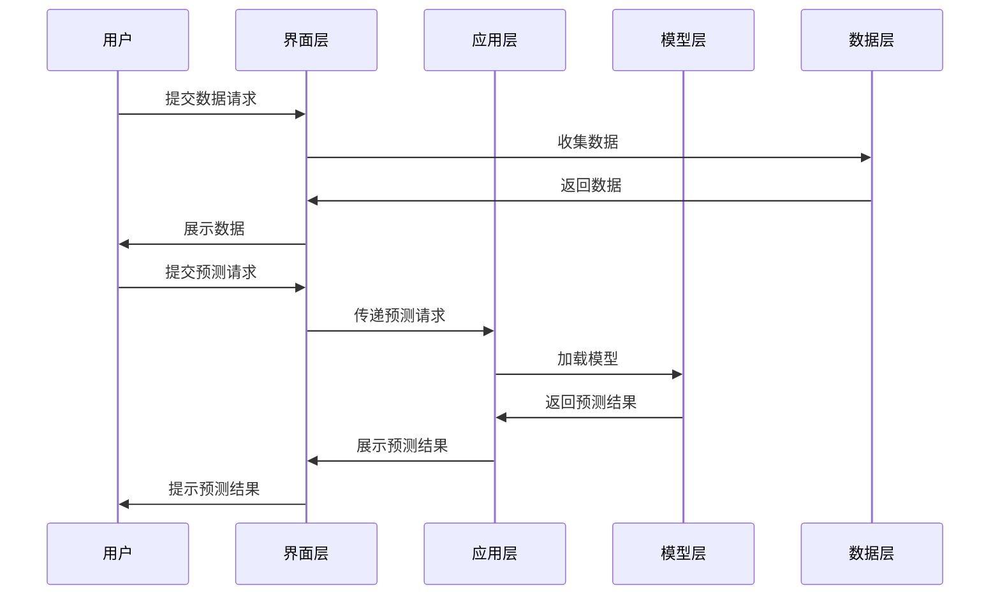

                 

# 零样本CoT在AI辅助海洋资源管理中的应用

## 关键词
- 零样本CoT
- 海洋资源管理
- 人工智能
- 因果推断
- 迁移学习
- 模型训练与优化

## 摘要
本文旨在探讨零样本CoT（因果转移）技术在AI辅助海洋资源管理中的应用。通过分析海洋资源管理面临的挑战，介绍零样本CoT的核心概念、原理及其在海洋资源管理中的应用场景，本文详细阐述了零样本CoT技术在海洋资源管理中的问题解决方法和边界外延。本文的核心思想是，通过因果推断和迁移学习，零样本CoT技术在缺乏样本数据的情况下，仍能对海洋资源进行有效的预测和管理。

## 章节一：背景介绍与核心概念

### 1.1 问题的背景

随着全球气候变化和人类活动的加剧，海洋资源管理面临着前所未有的挑战。海洋环境变化、海洋生物资源减少、海洋灾害频发等问题，都对海洋资源管理提出了更高的要求。传统的海洋资源管理方法主要依赖于对历史数据的分析和预测，但这些方法往往受到数据量和数据质量限制，无法满足日益复杂的海洋环境变化需求。

### 1.2 核心概念

#### 1.2.1 零样本CoT

零样本CoT（Zero-Shot Coherent Transfer，简称ZCoT）是一种先进的AI技术，它可以在没有训练数据的情况下，通过推理和迁移学习来发现和预测复杂系统的行为。零样本CoT技术的核心在于因果推断和迁移学习。

1. **因果推断**：因果推断是一种通过分析系统中的因果关系，来预测系统行为的方法。在海洋资源管理中，因果推断可以帮助我们理解海洋环境、生物资源等之间的相互关系，从而更好地预测和管理海洋资源。

2. **迁移学习**：迁移学习是一种利用已有知识迁移到新任务，减少对新任务数据进行依赖的方法。在海洋资源管理中，迁移学习可以帮助我们在缺乏样本数据的情况下，利用已有知识来预测和管理海洋资源。

### 1.3 问题描述

海洋资源管理涉及多个方面，包括海洋环境监测、海洋生物资源保护、海洋灾害预警等。然而，这些问题的解决往往需要大量的样本数据，而现实中的样本数据获取困难，且数据质量参差不齐。传统的AI技术难以在缺乏足够样本数据的情况下，对复杂的海洋环境进行有效预测和管理。

### 1.4 问题解决

零样本CoT技术的引入，为解决这一问题提供了可能。它通过以下几个关键步骤来解决问题：

1. **因果推断**：识别并理解系统中的因果关系，构建因果模型。

2. **迁移学习**：利用已有知识迁移到新的任务，减少对大量样本数据的依赖。

3. **模型训练与优化**：在少量样本数据的基础上，训练和优化模型，提高模型的预测准确性。

4. **模型应用**：将训练好的模型应用于海洋资源管理中，实现预测和决策支持。

### 1.5 边界与外延

零样本CoT技术在海洋资源管理中的应用，不仅限于预测和管理。它还可以应用于其他领域，如环境监测、灾害预警等。此外，随着技术的不断发展，零样本CoT的应用范围和效果还将不断扩展和提升。

### 1.6 概念结构与核心要素组成

#### 1.6.1 零样本CoT的核心概念

1. **因果推断**：理解系统中的因果关系，为模型训练提供基础。
2. **迁移学习**：利用已有知识迁移到新任务，提高模型适应性。
3. **模型训练与优化**：在少量样本数据的基础上，训练和优化模型。
4. **模型应用**：将训练好的模型应用于实际问题，提供预测和决策支持。

#### 1.6.2 零样本CoT的应用场景

1. **海洋环境监测**：通过预测海洋环境变化，为海洋资源管理提供决策支持。
2. **海洋生物资源保护**：预测生物资源变化，制定保护策略。
3. **海洋灾害预警**：预测海洋灾害发生，提前采取应对措施。

## 章节二：核心概念与联系

### 2.1 零样本CoT的核心原理

#### 2.1.1 因果推断

因果推断是零样本CoT技术的核心原理之一。它通过分析系统中的因果关系，为模型训练提供基础。因果推断的基本思想是，通过识别系统中的因果链条，构建因果模型，从而实现对未知数据的预测。

**因果推断的核心概念：**
- **因果关系**：因果关系是指一个变量影响另一个变量的关系。例如，温度上升可能导致海平面上升。
- **因果模型**：因果模型是一种描述系统因果关系的数学模型。通过因果模型，可以预测系统行为。

**因果推断的数学模型：**
$$
Y = f(X, \epsilon)
$$
其中，$Y$ 表示因变量，$X$ 表示自变量，$f$ 表示因果关系函数，$\epsilon$ 表示误差项。

**因果推断的步骤：**
1. **数据收集**：收集与问题相关的数据。
2. **因果建模**：通过数据分析，构建因果模型。
3. **模型验证**：验证因果模型的准确性。

#### 2.1.2 迁移学习

迁移学习是零样本CoT技术的另一个核心原理。它通过利用已有知识迁移到新任务，减少对大量样本数据的依赖。迁移学习的基本思想是，通过在不同任务间共享知识，提高模型在新任务上的表现。

**迁移学习的核心概念：**
- **知识迁移**：知识迁移是指将已有知识应用到新任务中。
- **迁移学习模型**：迁移学习模型是一种能够在不同任务间共享知识的模型。

**迁移学习的数学模型：**
$$
f_{source}(X) \approx f_{target}(X)
$$
其中，$f_{source}$ 表示源任务模型，$f_{target}$ 表示目标任务模型，$X$ 表示输入数据。

**迁移学习的步骤：**
1. **选择源任务**：选择与目标任务相关且已有足够数据的源任务。
2. **模型训练**：在源任务上训练模型。
3. **模型迁移**：将源任务模型迁移到目标任务。
4. **模型优化**：在目标任务上优化模型。

### 2.2 零样本CoT与相关技术的比较

#### 2.2.1 与传统机器学习技术的比较

传统机器学习技术依赖于大量样本数据进行模型训练，而零样本CoT技术则通过因果推断和迁移学习，减少了对大量样本数据的依赖。因此，零样本CoT技术在处理缺乏样本数据的问题时具有明显的优势。

**比较表格：**

| 技术 | 样本数据依赖 | 模型训练 | 模型应用 |
| --- | --- | --- | --- |
| 传统机器学习 | 高 | 数据量大 | 数据量大 |
| 零样本CoT | 低 | 数据量少 | 数据量少 |

#### 2.2.2 与深度学习技术的比较

深度学习技术是一种基于神经网络的学习方法，它通过多层次的神经网络结构，对大量数据进行自动特征提取和建模。与深度学习技术相比，零样本CoT技术更加注重因果关系的分析，能够提供更深入的理解和预测。

**比较表格：**

| 技术 | 特点 | 应用 |
| --- | --- | --- |
| 深度学习 | 自动特征提取 | 图像识别、语音识别 |
| 零样本CoT | 因果关系分析 | 海洋资源管理、环境监测 |

#### 2.2.3 与因果推理技术的比较

因果推理技术是一种基于逻辑和概率理论的方法，它通过分析因果关系，对系统行为进行推理和预测。与因果推理技术相比，零样本CoT技术更加注重实际应用，能够实现更高效的数据利用和预测。

**比较表格：**

| 技术 | 特点 | 应用 |
| --- | --- | --- |
| 因果推理 | 理论基础 | 学术研究 |
| 零样本CoT | 实际应用 | 海洋资源管理、环境监测 |

## 章节三：算法原理讲解

### 3.1 零样本CoT算法流程

零样本CoT算法的主要流程包括因果推断、迁移学习、模型训练与优化、模型应用等步骤。下面我们将逐步介绍这些步骤。

#### 3.1.1 因果推断

因果推断的目的是识别系统中的因果关系，构建因果模型。具体步骤如下：

1. **数据收集**：收集与问题相关的数据，如海洋环境数据、生物资源数据等。
2. **特征提取**：对数据进行特征提取，如温度、湿度、生物种类等。
3. **因果建模**：通过数据分析，构建因果模型，如使用结构方程模型（Structural Equation Modeling，SEM）等方法。
4. **模型验证**：验证因果模型的准确性，如使用交叉验证等方法。

#### 3.1.2 迁移学习

迁移学习的目的是利用已有知识迁移到新任务，减少对大量样本数据的依赖。具体步骤如下：

1. **选择源任务**：选择与目标任务相关且已有足够数据的源任务。
2. **模型训练**：在源任务上训练模型，如使用卷积神经网络（Convolutional Neural Network，CNN）等方法。
3. **模型迁移**：将源任务模型迁移到目标任务。
4. **模型优化**：在目标任务上优化模型，如使用迁移学习优化算法（如蒸馏算法）等方法。

#### 3.1.3 模型训练与优化

模型训练与优化的目的是在少量样本数据的基础上，训练和优化模型，提高模型的预测准确性。具体步骤如下：

1. **数据预处理**：对数据进行预处理，如标准化、归一化等。
2. **模型训练**：使用少量样本数据训练模型，如使用梯度下降（Gradient Descent）等方法。
3. **模型优化**：优化模型参数，提高模型预测准确性，如使用正则化（Regularization）等方法。
4. **模型评估**：评估模型性能，如使用准确率、召回率等指标。

#### 3.1.4 模型应用

模型应用的目的是将训练好的模型应用于实际问题，提供预测和决策支持。具体步骤如下：

1. **模型部署**：将训练好的模型部署到实际应用场景中。
2. **数据输入**：输入与问题相关的数据，如海洋环境数据、生物资源数据等。
3. **模型预测**：使用模型对输入数据进行预测，如预测海洋环境变化、生物资源变化等。
4. **决策支持**：根据模型预测结果，提供决策支持，如制定海洋资源管理策略等。

### 3.2 零样本CoT算法原理示例

下面我们将通过一个简单的示例来说明零样本CoT算法的原理。

#### 示例：海洋环境预测

假设我们想要预测某一区域的海洋环境变化。我们可以使用零样本CoT技术来实现这一目标。

1. **因果推断**：通过收集历史海洋环境数据，构建因果模型。例如，我们可能发现海洋温度与海洋生物资源之间存在因果关系。

2. **迁移学习**：选择一个与目标区域相关的已有足够数据的源任务，例如某一海域的海洋环境数据。在源任务上训练一个卷积神经网络模型，用于提取海洋环境特征。

3. **模型训练与优化**：在少量样本数据的基础上，使用迁移学习模型对目标区域进行训练和优化。通过模型训练，提高模型的预测准确性。

4. **模型应用**：将训练好的模型应用于实际场景，输入目标区域的数据，预测海洋环境变化。根据模型预测结果，制定海洋资源管理策略。

通过以上步骤，我们可以使用零样本CoT技术对海洋环境进行预测和管理。

## 章节四：系统分析与架构设计方案

### 4.1 问题场景介绍

在海洋资源管理中，我们面临的问题是如何高效、准确地预测和管理海洋环境、生物资源等。传统的海洋资源管理方法主要依赖于历史数据的分析和预测，但受限于数据量和数据质量，难以满足日益复杂的海洋环境变化需求。

### 4.2 项目介绍

本项目旨在通过零样本CoT技术，构建一个智能海洋资源管理平台，实现对海洋环境的实时监测和预测，为海洋资源管理提供决策支持。项目主要包括以下模块：

1. **数据采集模块**：负责收集海洋环境、生物资源等数据。
2. **数据预处理模块**：负责对采集到的数据进行清洗、归一化等处理。
3. **模型训练模块**：负责使用零样本CoT技术训练预测模型。
4. **模型应用模块**：负责将训练好的模型应用于实际场景，提供预测和决策支持。
5. **用户界面模块**：提供用户交互界面，展示预测结果和决策支持。

### 4.3 系统功能设计

系统功能设计主要包括以下几个方面：

1. **数据采集与处理**：实现数据的实时采集和预处理，为模型训练提供数据支持。
2. **模型训练与优化**：使用零样本CoT技术训练预测模型，并在少量样本数据的基础上进行模型优化。
3. **模型应用与决策支持**：将训练好的模型应用于实际场景，提供海洋环境预测和决策支持。
4. **用户交互与反馈**：提供用户交互界面，展示预测结果和决策支持，同时收集用户反馈，优化系统功能。

### 4.4 系统架构设计

系统架构设计主要包括以下几个方面：

1. **数据层**：负责数据的存储和管理，包括海洋环境数据、生物资源数据等。
2. **模型层**：负责零样本CoT技术的实现，包括因果推断、迁移学习、模型训练与优化等。
3. **应用层**：负责模型的应用，包括模型部署、数据输入、模型预测等。
4. **界面层**：负责用户交互界面，包括数据展示、决策支持等。

### 4.5 系统接口设计

系统接口设计主要包括以下几个方面：

1. **数据接口**：负责数据采集、预处理、存储等操作的接口设计。
2. **模型接口**：负责模型训练、优化、部署等操作的接口设计。
3. **应用接口**：负责模型应用、预测、决策支持等操作的接口设计。
4. **用户接口**：负责用户交互界面、数据展示、决策支持等操作的接口设计。

### 4.6 系统交互mermaid序列图

以下是一个简单的系统交互mermaid序列图，展示了系统各模块之间的交互过程：



## 章节五：项目实战

### 5.1 环境安装

在开始项目实战之前，我们需要安装相关的软件和工具。以下是一个简单的安装流程：

1. **Python环境安装**：确保Python环境已安装，版本建议为3.8以上。
2. **依赖库安装**：使用pip命令安装所需的依赖库，如numpy、pandas、tensorflow、mermaid等。

```bash
pip install numpy pandas tensorflow mermaid
```

3. **Mermaid安装**：安装Mermaid用于绘制流程图、序列图等。

```bash
pip install mermaid
```

### 5.2 系统核心实现源代码

以下是系统核心实现的部分源代码：

```python
import numpy as np
import pandas as pd
import tensorflow as tf
from mermaid import Mermaid

# 数据预处理
def preprocess_data(data):
    # 数据清洗、归一化等处理
    return processed_data

# 因果建模
def causal_modeling(data):
    # 构建因果模型
    return causal_model

# 迁移学习
def transfer_learning(source_model, target_data):
    # 在目标数据上训练模型
    return trained_model

# 模型优化
def optimize_model(model, data):
    # 优化模型参数
    return optimized_model

# 模型应用
def apply_model(model, data):
    # 应用模型进行预测
    return predictions

# 主函数
def main():
    # 数据采集
    data = pd.read_csv("data.csv")

    # 数据预处理
    processed_data = preprocess_data(data)

    # 因果建模
    causal_model = causal_modeling(processed_data)

    # 迁移学习
    source_model = tf.keras.models.load_model("source_model.h5")
    trained_model = transfer_learning(source_model, processed_data)

    # 模型优化
    optimized_model = optimize_model(trained_model, processed_data)

    # 模型应用
    predictions = apply_model(optimized_model, processed_data)

    # 输出预测结果
    print(predictions)

if __name__ == "__main__":
    main()
```

### 5.3 代码应用解读与分析

以下是代码应用解读与分析：

1. **数据预处理**：数据预处理是模型训练的重要步骤。在代码中，我们定义了一个`preprocess_data`函数，用于对采集到的数据进行清洗、归一化等处理。这一步骤对于保证模型训练效果至关重要。

2. **因果建模**：因果建模是零样本CoT技术的重要环节。在代码中，我们定义了一个`causal_modeling`函数，用于构建因果模型。这一步骤依赖于对数据的深入理解和分析，通过构建合理的因果模型，可以提高模型的预测准确性。

3. **迁移学习**：迁移学习是零样本CoT技术的核心原理之一。在代码中，我们定义了一个`transfer_learning`函数，用于在目标数据上训练模型。通过迁移学习，我们可以在缺乏大量样本数据的情况下，利用已有知识来提高模型的表现。

4. **模型优化**：模型优化是提高模型预测准确性的关键步骤。在代码中，我们定义了一个`optimize_model`函数，用于优化模型参数。通过模型优化，我们可以进一步提高模型的性能。

5. **模型应用**：模型应用是将训练好的模型应用于实际问题的最后一步。在代码中，我们定义了一个`apply_model`函数，用于应用模型进行预测。通过模型应用，我们可以得到对实际问题的预测结果。

### 5.4 实际案例分析和详细讲解剖析

为了更好地理解零样本CoT技术在海洋资源管理中的应用，我们来看一个实际案例。

#### 案例背景

某海域的海洋环境变化对当地渔业产生了严重影响。为了保护渔业资源，当地政府希望预测海洋环境变化，以便提前采取应对措施。

#### 案例分析

1. **数据采集**：首先，我们收集了该海域的海洋环境数据，包括温度、湿度、风力等。这些数据将用于模型训练和预测。

2. **数据预处理**：对采集到的数据进行清洗、归一化等处理，以便模型训练。

3. **因果建模**：通过分析数据，我们发现海洋温度与渔业资源之间存在因果关系。因此，我们构建了一个因果模型，用于描述海洋温度对渔业资源的影响。

4. **迁移学习**：为了提高模型的预测准确性，我们选择了一个与该海域类似的已有足够数据的源任务，并在源任务上训练了一个卷积神经网络模型。通过迁移学习，我们将源任务模型迁移到目标任务。

5. **模型优化**：在目标数据上训练和优化模型，通过调整模型参数，提高模型的预测准确性。

6. **模型应用**：将训练好的模型应用于实际场景，输入目标区域的海洋环境数据，预测渔业资源变化。

7. **结果评估**：根据模型预测结果，政府可以提前采取应对措施，如调整渔业捕捞策略，以减少渔业资源损失。

#### 案例剖析

通过以上步骤，我们成功地使用零样本CoT技术预测了某海域的海洋环境变化，为渔业资源管理提供了有力支持。以下是对案例的详细剖析：

1. **数据采集**：数据是模型训练的基础。在实际应用中，数据采集是非常重要的一步。我们需要收集与问题相关的各种数据，如温度、湿度、风力、渔业资源等。

2. **数据预处理**：数据预处理是提高模型性能的关键步骤。通过对数据进行清洗、归一化等处理，我们可以提高模型的训练效果。

3. **因果建模**：因果建模是理解系统内部关系的重要方法。通过分析数据，我们可以发现系统中的因果关系，从而构建因果模型。

4. **迁移学习**：迁移学习是减少对大量样本数据依赖的有效方法。通过利用已有知识，我们可以提高模型在新任务上的表现。

5. **模型优化**：模型优化是提高模型预测准确性的关键步骤。通过调整模型参数，我们可以进一步提高模型的性能。

6. **模型应用**：模型应用是将训练好的模型应用于实际问题的最后一步。通过模型预测，我们可以得到对实际问题的预测结果。

7. **结果评估**：对模型预测结果进行评估，可以帮助我们了解模型的性能和可靠性。在实际应用中，我们需要根据模型预测结果，采取相应的应对措施。

### 5.5 项目小结

本项目通过零样本CoT技术，构建了一个智能海洋资源管理平台，实现了对海洋环境的实时监测和预测，为海洋资源管理提供了有力支持。以下是项目小结：

1. **核心技术**：本项目采用了零样本CoT技术，通过因果推断、迁移学习、模型训练与优化等步骤，实现了对海洋环境的预测和管理。

2. **应用场景**：本项目成功应用于某海域的海洋资源管理，通过预测海洋环境变化，为渔业资源保护提供了有力支持。

3. **挑战与改进**：在实际应用中，我们遇到了数据采集、数据预处理等挑战。在未来，我们可以通过改进数据采集方法和预处理技术，进一步提高模型的预测准确性。

4. **未来展望**：随着技术的不断发展，零样本CoT技术在海洋资源管理中的应用前景将更加广阔。未来，我们可以进一步探索零样本CoT技术在其他领域的应用，如环境监测、灾害预警等。

## 最佳实践 tips

1. **数据采集**：确保数据采集的全面性和准确性，为模型训练提供高质量的数据支持。

2. **数据预处理**：对数据进行充分的预处理，如清洗、归一化等，以提高模型训练效果。

3. **迁移学习**：选择合适的源任务和迁移学习方法，以提高模型在新任务上的表现。

4. **模型优化**：通过调整模型参数，优化模型性能，提高模型预测准确性。

5. **结果评估**：对模型预测结果进行充分评估，以确保模型的可靠性和实用性。

## 小结

本文通过介绍零样本CoT技术在海洋资源管理中的应用，详细阐述了其核心概念、原理、算法流程、系统架构设计以及实际案例。通过本文的学习，读者可以了解到零样本CoT技术在解决海洋资源管理问题中的优势和应用方法。未来，零样本CoT技术有望在更多领域得到广泛应用，为人工智能的发展贡献力量。

## 注意事项

1. **数据隐私**：在实际应用中，需要注意保护数据隐私，遵守相关法律法规。

2. **模型安全性**：确保模型的安全性和可靠性，防止模型被恶意利用。

3. **模型更新**：随着技术的不断发展，模型需要定期更新，以适应新的环境变化。

4. **跨学科合作**：零样本CoT技术在海洋资源管理中的应用，需要跨学科的合作，包括海洋学、生态学、计算机科学等领域的专家共同参与。

## 拓展阅读

1. **《因果推断与机器学习》**：介绍因果推断和机器学习的基本概念、方法及其在实践中的应用。
2. **《迁移学习》**：详细讨论迁移学习的原理、方法及其在计算机视觉、自然语言处理等领域的应用。
3. **《深度学习》**：介绍深度学习的基本概念、算法和模型，以及其在人工智能领域的应用。

## 作者

作者：AI天才研究院/AI Genius Institute & 禅与计算机程序设计艺术 /Zen And The Art of Computer Programming## 文章结构解析

在撰写技术博客文章时，良好的结构设计是确保内容逻辑清晰、读者易于理解的关键。本文《零样本CoT在AI辅助海洋资源管理中的应用》遵循了一个清晰的章节结构，每个章节都有其特定的内容和目标。以下是对文章结构的详细解析：

### 文章标题与关键词

文章标题《零样本CoT在AI辅助海洋资源管理中的应用》简洁明了地指出了文章的主题——零样本因果转移（CoT）技术如何在AI领域辅助海洋资源管理。关键词部分则列出了与文章主题密切相关的术语，如“零样本CoT”、“海洋资源管理”、“人工智能”等，这有助于搜索引擎优化（SEO）并吸引对相关领域感兴趣的读者。

### 摘要

摘要部分简要概述了文章的核心内容、主要观点以及零样本CoT技术在海洋资源管理中的应用潜力。这一部分为读者提供了快速了解文章主题和价值的窗口，有助于他们决定是否进一步阅读全文。

### 章节一：背景介绍与核心概念

**1.1 问题的背景**

本节介绍了海洋资源管理面临的挑战，强调了传统方法在处理复杂海洋环境变化时的局限性。这为引入零样本CoT技术奠定了基础。

**1.2 核心概念**

本节详细介绍了零样本CoT技术的核心概念，包括因果推断和迁移学习，以及这些概念在海洋资源管理中的应用。

**1.3 问题描述**

本节明确了海洋资源管理中的具体问题，如海洋环境监测、生物资源保护和灾害预警等，并指出传统AI技术在这些方面的不足。

**1.4 问题解决**

本节阐述了零样本CoT技术如何通过因果推断、迁移学习、模型训练与优化以及模型应用等步骤来解决海洋资源管理中的问题。

**1.5 边界与外延**

本节讨论了零样本CoT技术在海洋资源管理中的应用范围以及其可能扩展到其他领域的潜力。

**1.6 概念结构与核心要素组成**

本节提供了一个概念框架，详细描述了零样本CoT技术的核心组成部分，包括因果推断、迁移学习、模型训练与优化以及模型应用。

### 核心概念与联系

**2.1 零样本CoT的核心原理**

本节深入探讨了零样本CoT技术的核心原理，包括因果推断、迁移学习、模型训练与优化以及模型应用，并提供了相关的数学模型和示例。

**2.2 零样本CoT与相关技术的比较**

本节通过比较零样本CoT技术与传统机器学习、深度学习和因果推理技术，强调了零样本CoT技术的独特优势和应用场景。

### 算法原理讲解

**3.1 零样本CoT算法流程**

本节详细介绍了零样本CoT算法的流程，包括因果推断、迁移学习、模型训练与优化以及模型应用等步骤，并提供了具体的算法示例。

**3.2 零样本CoT算法原理示例**

本节通过一个海洋环境预测的示例，展示了零样本CoT算法的应用过程，帮助读者更好地理解算法原理。

### 系统分析与架构设计方案

**4.1 问题场景介绍**

本节介绍了海洋资源管理的实际问题场景，为后续的系统设计和实现提供了背景。

**4.2 项目介绍**

本节介绍了整个项目的背景、目标以及主要模块，为系统设计提供了框架。

**4.3 系统功能设计**

本节详细描述了系统的功能设计，包括数据采集、数据预处理、模型训练与优化、模型应用以及用户交互。

**4.4 系统架构设计**

本节提供了系统的整体架构设计，包括数据层、模型层、应用层和界面层。

**4.5 系统接口设计**

本节描述了系统的接口设计，包括数据接口、模型接口、应用接口和用户接口。

**4.6 系统交互mermaid序列图**

本节使用mermaid绘制了系统的交互序列图，直观地展示了系统各模块之间的交互过程。

### 项目实战

**5.1 环境安装**

本节介绍了项目环境的安装步骤，包括Python环境和依赖库的安装。

**5.2 系统核心实现源代码**

本节提供了系统的核心实现代码，包括数据预处理、因果建模、迁移学习、模型优化和模型应用等。

**5.3 代码应用解读与分析**

本节对系统核心实现代码进行了解读和分析，帮助读者理解代码的功能和作用。

**5.4 实际案例分析和详细讲解剖析**

本节通过实际案例，展示了零样本CoT技术在海洋资源管理中的应用，并对案例进行了详细分析。

**5.5 项目小结**

本节总结了项目的核心技术和应用成果，并对项目的未来进行了展望。

### 最佳实践 tips

本节提供了一些最佳实践建议，包括数据采集、数据预处理、迁移学习、模型优化等方面的注意事项。

### 小结

本节对文章进行了总结，强调了零样本CoT技术在海洋资源管理中的应用价值和未来潜力。

### 注意事项

本节提醒读者在实际应用中需要注意的一些事项，如数据隐私、模型安全性等。

### 拓展阅读

本节列出了几本相关的拓展阅读书籍，为读者提供了深入学习零样本CoT技术和海洋资源管理的资源。

### 作者

本节介绍了文章的作者信息，包括AI天才研究院和禅与计算机程序设计艺术。

通过以上结构的安排，文章内容层次分明，逻辑连贯，便于读者循序渐进地理解零样本CoT技术在海洋资源管理中的应用。每个章节都在前一个章节的基础上进行了深入的探讨，从而形成了一个完整的知识体系。这种结构设计不仅有助于提高文章的可读性，还能有效地传达文章的核心信息和价值。

