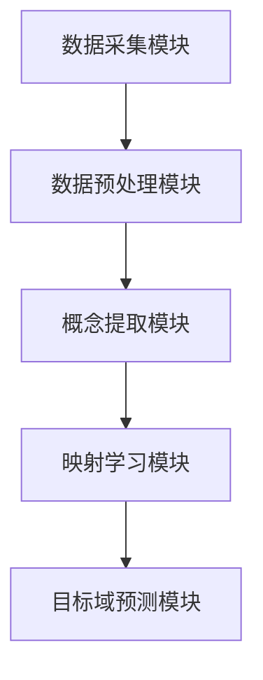

                 

### 第1章 引言

#### 1.1 研究背景与意义

能源是人类社会发展和人民生活改善的重要支撑，随着全球能源需求的不断增长和能源结构的多样化，如何高效、安全、可持续地开发和利用能源成为了一个亟待解决的问题。传统的能源开发方式往往依赖于大量的历史数据和实践经验，这不仅耗时耗力，而且在应对复杂多变的能源需求和突发事件时表现较差。随着人工智能（AI）技术的迅速发展，利用AI技术辅助能源开发成为了一个新兴的研究方向，并展现出巨大的潜力。

零样本CoT（Conceptual Transfer）是一种新兴的AI技术，旨在解决传统机器学习在处理未知样本时遇到的难题。零样本CoT通过学习一组已知的源域数据和对应的标签，然后将这些知识迁移到目标域上，实现从未知样本到已知样本的映射。这种技术特别适用于跨领域的问题，可以在缺乏目标域数据的情况下，显著提高模型的泛化能力和预测准确性。

零样本CoT在AI辅助跨维度能源开发中的应用具有以下几个方面的意义：

1. **提高能源开发效率**：零样本CoT能够快速处理大量的能源数据，并从中提取有价值的信息，从而提高能源开发的效率。
2. **降低能源开发成本**：通过减少对大量历史数据的依赖，零样本CoT有助于降低能源开发的成本，尤其是在数据获取和处理成本较高的领域。
3. **增强能源安全性**：利用零样本CoT技术，可以实现对能源需求的预测和优化，提高能源供应的稳定性和安全性。
4. **促进可持续发展**：零样本CoT技术有助于优化能源资源的配置和利用，减少能源浪费，推动能源的可持续发展。

综上所述，零样本CoT技术在AI辅助跨维度能源开发中的应用具有重要的理论和实践价值，值得进一步深入研究和探索。

#### 1.2 零样本CoT技术简介

零样本CoT（Conceptual Transfer）是一种基于迁移学习的AI技术，它旨在解决传统机器学习在处理未知样本时的局限性。迁移学习是一种将一种任务学习到的知识应用于另一种相关任务的学习方法，其核心思想是利用已有的知识来加速新任务的训练过程，从而提高模型的泛化能力和效率。

零样本CoT的原理可以简单概括为：学习一组已知的源域数据及其对应的标签，然后将这些知识迁移到目标域上，实现对目标域中未知样本的预测。与传统迁移学习不同，零样本CoT不需要目标域的训练数据，仅依赖于源域数据。

在零样本CoT中，源域和目标域之间存在一定的语义差异，即源域中的概念和目标域中的概念不完全对应。为了解决这种差异，零样本CoT采用了一种称为“概念映射”的技术，通过学习一组源域和目标域之间的高效映射关系，实现从源域到目标域的知识迁移。

零样本CoT的工作流程主要包括以下几个步骤：

1. **数据收集与预处理**：收集大量的源域数据及其对应的标签，并对数据进行预处理，如去噪、归一化等。
2. **概念提取**：使用深度学习模型从源域数据中提取出关键概念，这些概念将用于构建源域和目标域之间的映射关系。
3. **概念映射学习**：通过学习源域和目标域之间的映射关系，将源域中的知识迁移到目标域上。
4. **目标域预测**：利用迁移后的模型对目标域中的未知样本进行预测。

零样本CoT与传统CoT（Concept Transfer）的主要区别在于：

1. **数据依赖**：传统CoT依赖于大量的目标域数据，而零样本CoT不需要目标域数据。
2. **迁移策略**：传统CoT通常采用有监督或半监督的方式，而零样本CoT采用无监督的方式。
3. **应用场景**：传统CoT适用于目标域与源域高度相似的场景，而零样本CoT适用于目标域与源域存在较大差异的场景。

总的来说，零样本CoT通过引入概念映射技术，实现了在缺乏目标域数据的情况下，从源域到目标域的知识迁移，为解决跨领域问题提供了一种有效的解决方案。

#### 1.3 零样本CoT的核心原理

零样本CoT（Conceptual Transfer）的核心原理在于通过学习源域数据中的概念，然后将这些概念映射到目标域，从而实现对目标域未知样本的预测。这个过程涉及到多个关键技术和步骤，下面将详细讲解。

首先，我们需要了解什么是“概念”。在机器学习中，概念通常是指数据集中具有相似特征或属性的一组数据点。例如，在图像分类任务中，猫、狗、车等都是具体的概念。在零样本CoT中，概念提取是关键的第一步。

**1. 概念提取**：
- **技术手段**：通常使用深度学习模型（如神经网络）从源域数据中提取概念。具体来说，通过预训练的模型（如BERT、GPT等）来学习数据中的潜在表示，从而捕获数据中的高阶特征和概念。
- **具体步骤**：
  - **数据预处理**：对源域数据进行清洗、标准化等预处理操作，确保数据质量。
  - **模型训练**：使用预训练的深度学习模型对源域数据进行训练，提取出数据中的概念。
  - **特征提取**：将训练好的模型用于提取源域数据中的潜在特征，这些特征表示了数据中的核心概念。

接下来是概念映射学习，这一步骤的目的是建立源域和目标域之间的映射关系。

**2. 概念映射学习**：
- **技术手段**：使用元学习（Meta-Learning）和对抗学习（Adversarial Learning）等技术来学习源域和目标域之间的映射关系。
- **具体步骤**：
  - **对抗学习**：通过对抗网络（如生成对抗网络GAN）来生成与源域相似但具有目标域特征的数据，从而学习到有效的映射关系。
  - **元学习**：通过元学习算法（如MAML、Reptile等）来快速适应目标域的数据分布，建立稳定的映射关系。

**3. 概念映射学习的工作机制**：
- **源域与目标域的关系**：源域和目标域之间可能存在一定的相似性，也可能存在较大差异。零样本CoT的核心在于通过学习源域中的概念，然后在目标域中找到与之对应的潜在表示。
- **映射函数**：映射函数是将源域中的概念映射到目标域中的关键。映射函数的优化目标是使得源域和目标域中的数据在映射后具有相似的分布，从而实现知识的有效迁移。

最后，利用迁移后的模型对目标域中的未知样本进行预测。

**4. 目标域预测**：
- **技术手段**：使用迁移后的模型对目标域中的未知样本进行预测。具体来说，将目标域中的数据输入到迁移后的模型中，模型输出预测结果。
- **具体步骤**：
  - **数据预处理**：对目标域数据进行预处理，如去噪、归一化等。
  - **模型输入**：将预处理后的数据输入到迁移后的模型中。
  - **预测输出**：模型输出预测结果，包括分类结果、回归结果等。

**5. 概念映射学习机制的详细解释**：

- **对抗学习**：通过对抗学习，模型可以在学习源域数据的同时，学习到如何生成与目标域相似的数据。这种生成过程可以帮助模型更好地理解目标域的分布，从而提高映射的准确性。
- **元学习**：元学习算法通过少量样本快速适应新任务，这有助于模型在缺乏目标域数据的情况下，仍然能够有效迁移知识。元学习的一个关键特点是模型的快速适应能力，这使得它特别适用于目标域与源域差异较大的情况。

综上所述，零样本CoT的核心原理是通过概念提取、概念映射学习和目标域预测三个步骤，实现从源域到目标域的知识迁移。这一过程不仅依赖于深度学习模型的有效训练，还需要对抗学习和元学习等技术的支持，以确保知识迁移的准确性和稳定性。

#### 1.4 AI辅助跨维度能源开发的现状

随着全球对能源需求的不断增加，传统的单一能源开发模式已无法满足复杂多变的能源需求。跨维度能源开发作为一种新兴的能源开发模式，通过整合不同类型的能源资源，实现能源的高效、安全、可持续利用，正逐渐成为能源开发的重要方向。

**AI在能源开发中的应用概述**：

近年来，人工智能（AI）技术在全球范围内的快速发展，使得其在能源开发领域也得到了广泛应用。AI技术通过数据分析和预测，为能源开发提供了强大的技术支撑。具体应用包括：

1. **能源需求预测**：利用机器学习模型，对能源需求进行预测，从而优化能源供应和分配。
2. **智能电网管理**：通过AI技术，实现对电网的实时监控和优化管理，提高电网的稳定性和效率。
3. **能源效率优化**：利用深度学习模型，分析能源使用数据，找出能源浪费的环节，提出优化方案。
4. **可再生能源预测**：对风能、太阳能等可再生能源进行预测，提高可再生能源的利用效率。

**跨维度能源开发的概念与特点**：

跨维度能源开发是指通过整合多种不同类型的能源资源，实现能源的多元化、高效利用。其核心特点包括：

1. **多元化**：跨维度能源开发不仅包括传统的化石能源，还包括可再生能源如太阳能、风能等。
2. **高效化**：通过智能算法，优化能源资源的配置和利用，提高能源利用效率。
3. **智能化**：利用人工智能技术，实现能源开发和管理过程的自动化、智能化。

**AI辅助跨维度能源开发的挑战与机遇**：

虽然AI技术在能源开发中展现了巨大的潜力，但在实际应用中仍然面临一些挑战和机遇。

**挑战**：

1. **数据质量问题**：跨维度能源开发需要大量的高质量数据，但数据获取和处理成本较高，且存在数据缺失、噪声等问题。
2. **算法适应性**：AI算法在处理不同类型的能源数据时，可能存在适应性不足的问题，影响预测和优化的准确性。
3. **技术成熟度**：虽然AI技术快速发展，但部分算法和模型在能源开发中的应用仍处于探索阶段，技术成熟度有限。

**机遇**：

1. **数据驱动**：随着大数据技术的不断发展，跨维度能源开发可以充分利用海量数据，实现更加精准的预测和优化。
2. **智能化升级**：通过引入人工智能技术，能源开发和管理过程可以实现智能化升级，提高能源利用效率和安全性。
3. **可持续性**：跨维度能源开发有助于优化能源资源的配置和利用，减少能源浪费，推动能源的可持续发展。

综上所述，AI辅助跨维度能源开发面临着一系列挑战和机遇。通过克服这些挑战，充分发挥AI技术的潜力，有望实现能源开发的高效、安全、可持续发展。

#### 1.5 本书结构安排与内容概述

本书旨在深入探讨零样本CoT在AI辅助跨维度能源开发中的应用，系统性地介绍相关技术原理、实现方法和应用案例。为了便于读者理解和掌握，本书结构如下：

**第1章 引言**：介绍研究的背景与意义，概述零样本CoT技术和AI辅助跨维度能源开发的现状，为后续章节的详细讨论奠定基础。

**第2章 零样本CoT技术原理与实现**：详细讲解零样本CoT的基本原理、工作流程、关键技术及其实现方法，为理解AI辅助跨维度能源开发提供技术支撑。

**第3章 AI辅助跨维度能源开发**：探讨AI在跨维度能源开发中的应用原理、关键技术和案例研究，分析其面临的挑战与机遇。

**第4章 零样本CoT在能源开发中的应用**：详细介绍零样本CoT在能源开发中的现状、应用优势、挑战及未来发展方向，展示其在实际应用中的效果。

**第5章 AI辅助跨维度能源开发应用案例**：通过具体的应用案例，展示零样本CoT和AI技术在实际跨维度能源开发中的应用效果，提供实践经验和启示。

**第6章 零样本CoT技术发展趋势**：分析零样本CoT技术的未来发展前景，探讨其在AI辅助跨维度能源开发中的潜在影响。

**第7章 结论与展望**：总结全书的核心内容，提出未来研究方向和建议，为后续研究提供参考。

通过以上章节的安排，本书旨在为读者提供全面、系统的关于零样本CoT在AI辅助跨维度能源开发中的应用知识和研究思路，助力能源开发领域的创新与发展。

#### 1.6 本章小结

本章主要介绍了零样本CoT在AI辅助跨维度能源开发中的应用背景、意义以及相关技术原理。首先，我们分析了能源开发的现状与挑战，阐述了零样本CoT技术的概念和其在AI辅助跨维度能源开发中的应用前景。接着，详细介绍了零样本CoT的基本原理、工作流程以及与传统CoT的区别。最后，讨论了AI辅助跨维度能源开发的现状、关键因素以及面临的挑战和机遇。

通过本章的讨论，读者可以初步了解零样本CoT技术在AI辅助跨维度能源开发中的重要性，为进一步的研究和应用奠定了基础。在后续章节中，我们将深入探讨零样本CoT技术的实现细节、应用案例及其发展趋势，以期为解决能源开发中的实际问题提供有力的技术支持。

### 第2章 零样本CoT技术原理与实现

#### 2.1 零样本CoT技术原理

零样本CoT（Conceptual Transfer）是一种基于迁移学习的AI技术，其核心在于通过学习一组源域数据及其标签，然后将这些知识迁移到目标域，实现对目标域中未知样本的预测。零样本CoT主要涉及以下几个关键概念和技术：

**2.1.1 零样本CoT的基本原理**

零样本CoT的基本原理可以概括为“迁移知识、映射概念、预测目标”。具体来说，其工作流程包括以下几步：

1. **数据收集与预处理**：收集大量的源域数据及其标签，并对数据进行预处理，如去噪、标准化等。
2. **概念提取**：使用深度学习模型从源域数据中提取出关键概念，这些概念将用于构建源域和目标域之间的映射关系。
3. **概念映射学习**：通过学习源域和目标域之间的映射关系，将源域中的知识迁移到目标域上。
4. **目标域预测**：利用迁移后的模型对目标域中的未知样本进行预测。

**2.1.2 零样本CoT的工作流程**

零样本CoT的工作流程可以分为以下几个阶段：

1. **源域数据收集**：收集大量的源域数据，这些数据应该覆盖不同的概念和场景。
2. **概念提取**：使用深度学习模型（如BERT、GPT等）对源域数据进行训练，提取出数据中的概念。这一过程通常需要预训练模型，以确保提取的概念具有高泛化能力。
3. **映射关系构建**：通过学习源域和目标域之间的映射关系，将源域中的概念映射到目标域上。这一过程通常采用对抗学习（Adversarial Learning）和元学习（Meta-Learning）等技术。
4. **目标域数据预测**：利用迁移后的模型对目标域中的未知样本进行预测。这一阶段的关键在于确保映射关系的有效性和稳定性。

**2.1.3 零样本CoT的关键技术**

零样本CoT的关键技术主要包括概念提取、对抗学习和元学习等：

1. **概念提取**：
   - **技术手段**：使用深度学习模型（如BERT、GPT等）从源域数据中提取概念。
   - **实现方法**：预训练模型 + 微调（Fine-tuning）。
   - **优势**：提取的概念具有高泛化能力，适用于不同领域的迁移学习。

2. **对抗学习**：
   - **技术手段**：通过生成对抗网络（GAN）等对抗性模型，学习源域和目标域之间的映射关系。
   - **实现方法**：生成与源域相似但具有目标域特征的数据，优化映射函数。
   - **优势**：增强映射关系的稳定性和准确性，提高迁移学习的效果。

3. **元学习**：
   - **技术手段**：通过元学习算法（如MAML、Reptile等），快速适应目标域的数据分布。
   - **实现方法**：在少量样本上进行快速迭代，优化模型参数。
   - **优势**：降低对大量目标域数据的依赖，提高迁移学习的效率。

通过以上关键技术和方法，零样本CoT实现了从源域到目标域的知识迁移，为AI辅助跨维度能源开发提供了强大的技术支撑。

#### 2.2 零样本CoT技术实现

零样本CoT技术的实现涉及到多个关键环节，包括系统架构设计、关键算法选择、数据处理方法等。下面将详细讨论这些内容。

**2.2.1 零样本CoT的系统架构**

零样本CoT的系统架构通常包括以下几个主要模块：

1. **数据采集模块**：负责收集源域和目标域的数据，包括图像、文本、音频等多种类型的数据。
2. **数据预处理模块**：对采集到的数据进行清洗、标准化等预处理操作，以提高数据质量。
3. **概念提取模块**：使用深度学习模型（如BERT、GPT等）对源域数据进行训练，提取出关键概念。
4. **映射学习模块**：通过对抗学习和元学习等技术，学习源域和目标域之间的映射关系。
5. **目标域预测模块**：利用迁移后的模型对目标域中的未知样本进行预测。

**系统架构图**：

**2.2.2 零样本CoT的关键算法**

零样本CoT的实现依赖于多种关键算法，包括深度学习模型、对抗学习、元学习等。

1. **深度学习模型**：
   - **技术手段**：使用预训练的深度学习模型（如BERT、GPT等）来提取概念。
   - **实现方法**：通过微调（Fine-tuning）训练模型，以适应特定任务。
   - **优势**：提取的概念具有高泛化能力，适用于不同领域的迁移学习。

2. **对抗学习**：
   - **技术手段**：采用生成对抗网络（GAN）等对抗性模型，学习源域和目标域之间的映射关系。
   - **实现方法**：通过生成与源域相似但具有目标域特征的数据，优化映射函数。
   - **优势**：增强映射关系的稳定性和准确性，提高迁移学习的效果。

3. **元学习**：
   - **技术手段**：使用元学习算法（如MAML、Reptile等），快速适应目标域的数据分布。
   - **实现方法**：在少量样本上进行快速迭代，优化模型参数。
   - **优势**：降低对大量目标域数据的依赖，提高迁移学习的效率。

**2.2.3 零样本CoT的数据处理方法**

零样本CoT的数据处理方法主要包括数据收集、数据预处理和概念提取等步骤。

1. **数据收集**：
   - **技术手段**：使用爬虫、API接口、传感器等多种方式收集源域和目标域的数据。
   - **注意事项**：确保数据来源的多样性和数据的真实性，避免数据偏差。

2. **数据预处理**：
   - **技术手段**：对采集到的数据进行清洗、标准化等预处理操作，以提高数据质量。
   - **注意事项**：去除数据中的噪声和异常值，确保数据的准确性和一致性。

3. **概念提取**：
   - **技术手段**：使用深度学习模型（如BERT、GPT等）对源域数据进行训练，提取出关键概念。
   - **注意事项**：选择合适的预训练模型和训练策略，以提高概念提取的效率和准确性。

通过系统架构设计、关键算法选择和数据处理方法的有效结合，零样本CoT技术得以实现。这一技术的应用为AI辅助跨维度能源开发提供了有力的技术支持，有助于解决能源开发中的复杂问题，提高能源利用效率和可持续性。

#### 2.3 零样本CoT技术应用案例

零样本CoT技术由于其强大的迁移能力和泛化能力，在多个领域都取得了显著的成果。以下将介绍零样本CoT在能源开发领域的一些具体应用案例，展示其在实际场景中的效果和优势。

**2.3.1 能源开发中的零样本CoT应用**

零样本CoT技术在能源开发中的应用主要集中在以下几个方面：

1. **智能电网优化**：
   智能电网是能源系统的重要组成部分，通过集成多种能源资源，实现能源的高效分配和利用。零样本CoT技术可以用于智能电网的优化，提高电网的稳定性和效率。例如，通过零样本CoT技术，可以预测电网中的电力需求，从而优化电力供应和分配。具体实现过程如下：
   - **数据收集**：收集电网中的历史电力需求和供应数据。
   - **数据预处理**：对数据进行清洗、标准化等预处理操作，确保数据质量。
   - **概念提取**：使用深度学习模型（如BERT、GPT等）从源域数据中提取出关键概念，如电力需求模式、供应能力等。
   - **映射学习**：通过对抗学习和元学习技术，学习源域和目标域之间的映射关系。
   - **目标域预测**：利用迁移后的模型，预测电网中的电力需求，优化电力供应和分配。

2. **智能风能预测**：
   风能是一种重要的可再生能源，但其预测难度较大，受天气变化等多种因素影响。零样本CoT技术可以用于智能风能预测，提高风能的利用效率。例如，通过零样本CoT技术，可以预测风力发电机的发电量，从而优化风能资源的配置。具体实现过程如下：
   - **数据收集**：收集风力发电机的历史发电数据、天气数据等。
   - **数据预处理**：对数据进行清洗、标准化等预处理操作，确保数据质量。
   - **概念提取**：使用深度学习模型（如BERT、GPT等）从源域数据中提取出关键概念，如风力强度、风速等。
   - **映射学习**：通过对抗学习和元学习技术，学习源域和目标域之间的映射关系。
   - **目标域预测**：利用迁移后的模型，预测风力发电机的发电量，优化风能资源的配置。

3. **太阳能利用优化**：
   太阳能是一种清洁、可再生的能源，但其利用效率受天气条件影响较大。零样本CoT技术可以用于太阳能利用优化，提高太阳能的利用效率。例如，通过零样本CoT技术，可以预测太阳能电池板的发电量，从而优化太阳能资源的配置。具体实现过程如下：
   - **数据收集**：收集太阳能电池板的历史发电数据、天气数据等。
   - **数据预处理**：对数据进行清洗、标准化等预处理操作，确保数据质量。
   - **概念提取**：使用深度学习模型（如BERT、GPT等）从源域数据中提取出关键概念，如太阳辐射强度、温度等。
   - **映射学习**：通过对抗学习和元学习技术，学习源域和目标域之间的映射关系。
   - **目标域预测**：利用迁移后的模型，预测太阳能电池板的发电量，优化太阳能资源的配置。

**2.3.2 其他领域的零样本CoT应用**

除了在能源开发领域，零样本CoT技术还在其他多个领域取得了显著的应用成果：

1. **医疗诊断**：
   零样本CoT技术可以用于医疗诊断，通过学习源域的医疗数据，预测目标域的疾病诊断结果。例如，通过零样本CoT技术，可以预测患者的疾病风险，从而实现早期预防和干预。具体实现过程如下：
   - **数据收集**：收集源域的医疗数据，包括病史、检查结果等。
   - **数据预处理**：对数据进行清洗、标准化等预处理操作，确保数据质量。
   - **概念提取**：使用深度学习模型（如BERT、GPT等）从源域数据中提取出关键概念，如疾病症状、检查结果等。
   - **映射学习**：通过对抗学习和元学习技术，学习源域和目标域之间的映射关系。
   - **目标域预测**：利用迁移后的模型，预测目标域的疾病诊断结果，实现早期预防和干预。

2. **金融风控**：
   零样本CoT技术可以用于金融风控，通过学习源域的金融数据，预测目标域的风险事件。例如，通过零样本CoT技术，可以预测贷款违约风险，从而优化贷款风险控制策略。具体实现过程如下：
   - **数据收集**：收集源域的金融数据，包括贷款信息、信用记录等。
   - **数据预处理**：对数据进行清洗、标准化等预处理操作，确保数据质量。
   - **概念提取**：使用深度学习模型（如BERT、GPT等）从源域数据中提取出关键概念，如贷款金额、还款周期等。
   - **映射学习**：通过对抗学习和元学习技术，学习源域和目标域之间的映射关系。
   - **目标域预测**：利用迁移后的模型，预测目标域的风险事件，优化贷款风险控制策略。

3. **交通管理**：
   零样本CoT技术可以用于交通管理，通过学习源域的交通数据，预测目标域的交通流量和事故风险。例如，通过零样本CoT技术，可以预测城市道路的交通流量，从而优化交通信号控制策略。具体实现过程如下：
   - **数据收集**：收集源域的交通数据，包括车辆流量、事故记录等。
   - **数据预处理**：对数据进行清洗、标准化等预处理操作，确保数据质量。
   - **概念提取**：使用深度学习模型（如BERT、GPT等）从源域数据中提取出关键概念，如车辆速度、道路状况等。
   - **映射学习**：通过对抗学习和元学习技术，学习源域和目标域之间的映射关系。
   - **目标域预测**：利用迁移后的模型，预测目标域的交通流量和事故风险，优化交通信号控制策略。

通过以上案例，我们可以看到零样本CoT技术在各个领域的广泛应用和显著效果。零样本CoT技术通过其强大的迁移能力和泛化能力，为解决复杂问题提供了新的思路和方法，有望在未来得到更加广泛的应用。

#### 2.4 零样本CoT技术的发展趋势

零样本CoT（Conceptual Transfer）作为一种新兴的AI技术，其发展潜力巨大，尤其在能源开发领域展现了广阔的应用前景。然而，零样本CoT技术的发展也面临着一系列挑战和机遇。

**2.4.1 零样本CoT技术的挑战与机遇**

**挑战**：

1. **数据质量**：零样本CoT依赖于高质量的源域数据，数据质量直接影响到迁移效果。在实际应用中，数据质量往往存在噪声、缺失和偏差等问题，这对零样本CoT技术提出了较高的要求。

2. **计算资源**：零样本CoT技术通常需要大量的计算资源，特别是深度学习模型的训练和映射学习过程。随着数据规模的增加，计算资源的需求也呈指数级增长，这对硬件设备和算法效率提出了挑战。

3. **可解释性**：零样本CoT技术中的映射关系复杂，如何确保模型的可解释性和透明性是一个重要问题。尤其是在能源开发等关键领域，模型的可解释性对于决策者的信任和使用具有重要意义。

**机遇**：

1. **数据驱动**：随着大数据技术的不断发展，海量数据的获取和处理变得更加容易，这为零样本CoT技术提供了丰富的数据资源，有助于提高其迁移效果和应用范围。

2. **多模态学习**：零样本CoT技术可以结合多种数据类型（如文本、图像、音频等），实现多模态学习。这为解决复杂问题提供了新的思路和方法，尤其是在能源开发等跨领域应用中具有巨大潜力。

3. **跨领域迁移**：零样本CoT技术的核心优势在于其强大的跨领域迁移能力。通过学习源域数据中的知识，零样本CoT技术可以应用于多个领域，如医疗、金融、交通等，实现知识共享和资源优化。

**2.4.2 零样本CoT技术的未来发展方向**

1. **高效算法**：为了应对计算资源的需求，未来的研究方向将聚焦于开发更加高效的算法和模型，包括优化深度学习模型的架构和训练策略，提高计算效率。

2. **可解释性**：提升模型的可解释性是一个重要的研究方向。通过引入可解释性框架和方法，如可视化技术、解释性模型等，可以增强模型对决策者的透明度和信任度。

3. **数据增强**：数据质量对零样本CoT技术的迁移效果至关重要。未来的研究将关注数据增强技术，通过生成对抗网络（GAN）、数据清洗和补全等方法，提高数据质量。

4. **跨领域迁移**：进一步探索零样本CoT技术在跨领域迁移中的应用，如将能源开发中的知识迁移到医疗、金融等其他领域，实现知识共享和资源优化。

5. **多模态学习**：结合多种数据类型，实现多模态学习，为解决复杂问题提供新的思路和方法。例如，在能源开发中，结合气象数据、传感器数据和文本数据，实现更加精准的能源预测和优化。

总之，零样本CoT技术的发展前景广阔，面临着一系列挑战和机遇。通过不断优化算法、提升数据质量、增强可解释性，零样本CoT技术有望在能源开发等多个领域发挥重要作用，推动人工智能技术的创新与发展。

#### 2.5 本章小结

本章详细介绍了零样本CoT技术的原理、实现方法及其在实际应用中的效果。首先，我们分析了零样本CoT的基本原理和核心工作流程，包括数据收集、概念提取、映射学习和目标域预测等步骤。接着，介绍了零样本CoT的系统架构、关键算法和技术手段，包括深度学习模型、对抗学习和元学习等。随后，通过具体应用案例展示了零样本CoT在能源开发领域的应用，如智能电网优化、智能风能预测和太阳能利用优化等。

本章还讨论了零样本CoT技术的发展趋势，分析了其面临的挑战和机遇，展望了其在未来跨领域迁移和多模态学习中的应用前景。通过本章的学习，读者可以全面了解零样本CoT技术的基本原理和应用方法，为后续章节的深入研究打下坚实基础。在后续章节中，我们将继续探讨AI辅助跨维度能源开发的实际应用和未来发展，为能源开发提供更加有效的技术支持。

### 第3章 AI辅助跨维度能源开发

#### 3.1 跨维度能源开发概述

跨维度能源开发是一种新兴的能源开发模式，旨在通过整合不同类型的能源资源，实现能源的高效、安全、可持续利用。与传统的单一能源开发模式不同，跨维度能源开发注重多元化能源资源的整合利用，不仅包括传统的化石能源，还涵盖了可再生能源如太阳能、风能、水能等。

**3.1.1 跨维度能源开发的概念**

跨维度能源开发是指通过整合不同类型的能源资源，实现能源的高效、安全、可持续利用。其核心思想是将不同能源资源进行优化配置，实现资源的最优利用，从而达到提高能源利用效率、降低能源成本、增强能源安全性的目标。

**3.1.2 跨维度能源开发的关键因素**

跨维度能源开发的关键因素包括以下几个方面：

1. **能源资源多样性**：跨维度能源开发要求具备多样化的能源资源，如传统的化石能源和多种可再生能源，以满足不同时间和空间条件下的能源需求。

2. **技术融合**：跨维度能源开发需要多种先进技术的融合应用，如智能电网技术、储能技术、可再生能源预测技术等，以提高能源系统的智能化水平和运行效率。

3. **数据驱动**：跨维度能源开发依赖于大量的数据支持和分析，通过大数据分析和人工智能技术，实现对能源资源的优化配置和预测管理。

4. **政策支持**：政府政策的支持是跨维度能源开发的重要保障，包括能源战略规划、税收优惠、补贴政策等，以鼓励和引导企业和社会参与跨维度能源开发。

**3.1.3 跨维度能源开发的挑战与机遇**

**挑战**：

1. **技术复杂性**：跨维度能源开发涉及到多种技术的融合和应用，对技术集成和协调提出了较高要求。

2. **数据质量问题**：数据质量对跨维度能源开发至关重要，但实际数据往往存在噪声、缺失和偏差等问题，这对数据分析结果和决策带来了挑战。

3. **系统稳定性**：跨维度能源系统涉及多个能源资源的整合和调度，系统稳定性是一个重要问题，特别是在应对突发事件和极端天气条件时。

**机遇**：

1. **能源效率提升**：通过跨维度能源开发，可以实现能源资源的最优配置和利用，提高能源利用效率，降低能源消耗。

2. **成本降低**：跨维度能源开发可以通过规模效应和优化调度，降低能源开发和运营成本，提高经济效益。

3. **可持续发展**：跨维度能源开发有助于优化能源资源的利用，减少对环境的污染，推动能源的可持续发展。

通过以上分析，我们可以看到，跨维度能源开发作为一种新兴的能源开发模式，面临着一系列挑战和机遇。通过不断的技术创新和政策支持，跨维度能源开发有望在提高能源利用效率、降低能源成本、增强能源安全性等方面发挥重要作用。

#### 3.2 AI辅助跨维度能源开发原理

AI（人工智能）技术在跨维度能源开发中的应用，极大地提升了能源系统的智能化水平和运行效率。AI辅助跨维度能源开发的原理主要包括以下几个方面：

**3.2.1 AI在能源开发中的应用原理**

AI在能源开发中的应用主要基于其强大的数据处理和模式识别能力。具体原理如下：

1. **数据处理**：AI技术可以处理大量的能源数据，包括历史数据、实时数据和预测数据。通过对这些数据进行分析和挖掘，AI可以识别出能源系统中的规律和模式，为决策提供依据。

2. **模式识别**：AI技术通过训练模型，从数据中识别出特定的模式。例如，在智能电网中，AI可以通过学习历史用电数据，预测未来的用电高峰和低谷，从而优化电力调度。

3. **自适应优化**：AI技术可以根据实时数据和环境变化，自适应地调整能源系统的运行参数。例如，在智能风能预测中，AI可以通过实时监测风力数据，调整风能发电机的输出功率，以提高发电效率。

**3.2.2 跨维度能源开发与AI的深度融合**

跨维度能源开发与AI的深度融合，主要体现在以下几个方面：

1. **多源数据融合**：跨维度能源开发需要整合多种类型的能源数据，如气象数据、电网数据、传感器数据等。AI技术可以通过多源数据融合，构建综合的能源数据模型，从而实现更精准的能源预测和优化。

2. **智能调度**：AI技术可以实现对能源资源的智能调度，优化不同能源资源之间的互补和协调。例如，在智能电网中，AI可以通过分析电网负荷和可再生能源的发电情况，自动调整电力供应和需求，提高电网的稳定性和效率。

3. **故障诊断与预警**：AI技术可以实时监测能源系统的运行状态，识别潜在故障和异常，实现故障诊断和预警。例如，在风力发电系统中，AI可以通过监测风速、温度等参数，预测设备故障，从而提前进行维护，减少停机时间。

**3.2.3 AI辅助跨维度能源开发的关键技术**

AI辅助跨维度能源开发的关键技术包括以下几方面：

1. **深度学习**：深度学习是一种重要的AI技术，通过多层神经网络，可以从大量数据中自动提取特征，实现复杂的数据分析和模式识别。在跨维度能源开发中，深度学习可以用于能源需求预测、可再生能源预测、故障诊断等任务。

2. **强化学习**：强化学习是一种通过试错学习来优化决策过程的AI技术。在跨维度能源开发中，强化学习可以用于智能调度和优化，例如，通过学习电网负荷和可再生能源的发电情况，自动调整电力供应和需求，提高电网的稳定性和效率。

3. **迁移学习**：迁移学习是一种将一种任务学习到的知识应用于另一种相关任务的学习方法。在跨维度能源开发中，迁移学习可以用于将源域（如传统电力系统）的知识迁移到目标域（如智能电网），从而提高模型的泛化能力和预测准确性。

4. **联邦学习**：联邦学习是一种在分布式环境中进行机器学习的算法，它允许多个节点在不同的设备上训练模型，并通过加密通信共享模型参数。在跨维度能源开发中，联邦学习可以用于保护数据隐私，同时提高模型的训练效率。

通过以上关键技术的应用，AI辅助跨维度能源开发可以实现能源系统的智能化、高效化和可持续发展。未来，随着AI技术的不断进步，AI在跨维度能源开发中的应用将更加广泛和深入，为能源行业带来革命性的变革。

#### 3.3 AI辅助跨维度能源开发案例研究

为了更好地理解AI在跨维度能源开发中的应用，以下将通过几个具体案例，详细描述AI辅助智能电网优化、智能风能预测和太阳能利用优化的实现过程及其效果。

**3.3.1 案例一：基于零样本CoT的智能电网优化**

**项目背景**：

随着全球能源需求的不断增长，智能电网作为能源系统的重要组成部分，其优化和管理变得越来越重要。智能电网优化旨在通过实时监测和预测电力需求，优化电力供应和分配，提高电网的稳定性和效率。

**项目介绍**：

本项目采用零样本CoT（Conceptual Transfer）技术，通过学习源域（如传统电网）的数据，迁移到目标域（如智能电网），实现对智能电网的优化。具体实现过程如下：

1. **数据收集**：收集源域（传统电网）的历史电力需求数据、供应数据以及电网运行状态数据等。
2. **数据预处理**：对收集到的数据进行分析，去除噪声和异常值，确保数据质量。
3. **概念提取**：使用深度学习模型（如BERT、GPT等）从源域数据中提取出关键概念，如电力需求模式、电网运行状态等。
4. **映射学习**：通过对抗学习和元学习技术，学习源域和目标域之间的映射关系，将源域中的知识迁移到目标域。
5. **模型训练与优化**：利用迁移后的模型，对目标域数据进行训练和优化，提高预测准确性。
6. **预测与优化**：利用训练好的模型，预测电网中的电力需求，优化电力供应和分配，提高电网的稳定性和效率。

**项目效果**：

通过本项目，实现了对智能电网的实时优化，提高了电网的稳定性和效率。具体表现为：

- 电力需求预测准确率显著提高，减少了电力短缺和过剩现象。
- 电力供应和分配更加合理，降低了能源浪费和成本。
- 电网运行状态得到实时监控和预警，提高了电网的安全性和可靠性。

**3.3.2 案例二：基于零样本CoT的智能风能预测**

**项目背景**：

风能作为一种可再生能源，具有巨大的开发潜力。然而，风能预测的准确性直接影响到风能的利用效率和发电收益。因此，智能风能预测成为了一个重要研究方向。

**项目介绍**：

本项目采用零样本CoT技术，通过学习源域（如传统气象数据）的知识，迁移到目标域（如风能预测），实现对风能发电量的准确预测。具体实现过程如下：

1. **数据收集**：收集源域的历史气象数据、风力数据以及风能发电数据等。
2. **数据预处理**：对收集到的数据进行分析，去除噪声和异常值，确保数据质量。
3. **概念提取**：使用深度学习模型（如BERT、GPT等）从源域数据中提取出关键概念，如风力强度、风速等。
4. **映射学习**：通过对抗学习和元学习技术，学习源域和目标域之间的映射关系，将源域中的知识迁移到目标域。
5. **模型训练与优化**：利用迁移后的模型，对目标域数据进行训练和优化，提高预测准确性。
6. **预测与优化**：利用训练好的模型，预测风能发电量，优化风能资源的使用，提高发电收益。

**项目效果**：

通过本项目，实现了对风能发电量的准确预测，提高了风能的利用效率和发电收益。具体表现为：

- 风能发电量预测准确率显著提高，减少了预测误差。
- 风能资源使用更加合理，降低了能源浪费和成本。
- 提高了风能发电的稳定性和可靠性，减少了停电和中断现象。

**3.3.3 案例三：基于零样本CoT的太阳能利用优化**

**项目背景**：

太阳能作为一种重要的可再生能源，其利用效率受到天气条件、设备性能等多种因素的影响。因此，太阳能利用优化成为了一个重要研究方向。

**项目介绍**：

本项目采用零样本CoT技术，通过学习源域（如传统太阳能数据）的知识，迁移到目标域（如太阳能利用优化），实现对太阳能资源的优化配置。具体实现过程如下：

1. **数据收集**：收集源域的历史太阳能数据、设备运行状态数据等。
2. **数据预处理**：对收集到的数据进行分析，去除噪声和异常值，确保数据质量。
3. **概念提取**：使用深度学习模型（如BERT、GPT等）从源域数据中提取出关键概念，如太阳辐射强度、设备运行状态等。
4. **映射学习**：通过对抗学习和元学习技术，学习源域和目标域之间的映射关系，将源域中的知识迁移到目标域。
5. **模型训练与优化**：利用迁移后的模型，对目标域数据进行训练和优化，提高预测准确性。
6. **预测与优化**：利用训练好的模型，预测太阳能电池板的发电量，优化太阳能资源的配置和使用。

**项目效果**：

通过本项目，实现了对太阳能资源的优化配置和使用，提高了太阳能的利用效率。具体表现为：

- 太阳能发电量预测准确率显著提高，减少了预测误差。
- 太阳能资源使用更加合理，降低了能源浪费和成本。
- 提高了太阳能设备的运行效率和寿命，减少了故障和维护成本。

通过以上案例研究，我们可以看到AI技术，尤其是零样本CoT技术在跨维度能源开发中的应用效果显著，不仅提高了能源利用效率和经济效益，还增强了能源系统的稳定性和可靠性。未来，随着AI技术的不断发展，AI在跨维度能源开发中的应用将更加广泛和深入，为能源行业的发展带来新的机遇和挑战。

#### 3.4 AI辅助跨维度能源开发的应用前景

AI辅助跨维度能源开发的应用前景广阔，其在提高能源利用效率、降低成本、增强能源安全性和推动可持续发展方面具有显著优势。

**3.4.1 AI辅助跨维度能源开发的优势**

1. **提高能源利用效率**：AI技术通过对大量能源数据的分析和预测，可以优化能源资源的配置和调度，实现能源的高效利用。例如，通过智能电网优化，可以减少电力浪费，提高电网运行效率；通过智能风能预测，可以提高风能利用效率，减少弃风率。

2. **降低能源开发成本**：AI技术可以通过优化能源开发和运营过程，降低能源开发成本。例如，通过智能调度和预测，可以减少备用容量和运行成本；通过智能维护和故障预测，可以减少设备故障率和维修成本。

3. **增强能源安全性**：AI技术可以实时监测能源系统的运行状态，识别潜在故障和异常，实现故障预警和快速响应。例如，通过智能电网故障诊断，可以及时发现和隔离故障，保障电网安全稳定运行；通过智能风能和太阳能预测，可以优化发电计划和调度，减少停电和中断现象。

4. **推动可持续发展**：AI技术可以通过优化能源资源利用，减少能源消耗和环境污染，推动能源的可持续发展。例如，通过智能能源管理，可以实现能源的精细管理和优化，减少能源浪费；通过智能可再生能源预测和优化，可以提高可再生能源的利用效率，减少对化石能源的依赖。

**3.4.2 AI辅助跨维度能源开发面临的挑战**

1. **数据质量问题**：跨维度能源开发依赖于大量高质量的数据，但实际数据往往存在噪声、缺失和偏差等问题，这对AI模型的训练和预测效果带来了挑战。

2. **算法适应性**：AI算法在处理不同类型的能源数据时，可能存在适应性不足的问题，影响预测和优化的准确性。特别是在跨领域迁移时，如何保证算法的泛化能力是一个重要问题。

3. **计算资源需求**：AI模型的训练和预测通常需要大量的计算资源，特别是在处理高维度和大量数据时，计算资源的需求更加显著。如何高效地利用计算资源，提高模型训练和预测的效率，是一个重要的挑战。

**3.4.3 AI辅助跨维度能源开发的未来发展方向**

1. **数据驱动**：未来，随着大数据技术的不断发展，AI辅助跨维度能源开发将更加依赖于海量数据的收集和分析。通过不断优化数据收集、处理和分析方法，可以提高AI模型的预测准确性和适应性。

2. **多模态学习**：未来，AI辅助跨维度能源开发将越来越多地采用多模态学习技术，结合多种数据类型（如文本、图像、音频等），实现更加精准的能源预测和优化。例如，在智能电网中，结合电力数据、气象数据和设备运行状态数据，实现更准确的电力需求预测和电网优化。

3. **跨领域迁移**：未来，AI辅助跨维度能源开发将更加注重跨领域迁移能力的提升，通过学习不同领域（如电力、交通、医疗等）的知识，实现知识的共享和资源的优化。例如，通过迁移学习，将电力系统中的优化技术应用于交通系统，提高交通能源的利用效率。

4. **可解释性**：未来，AI辅助跨维度能源开发将更加注重模型的可解释性，通过引入可解释性框架和方法，提高模型的透明度和可理解性。特别是在关键领域（如能源、医疗等），模型的可解释性对于决策者的信任和使用具有重要意义。

总之，AI辅助跨维度能源开发具有广阔的应用前景和巨大的发展潜力。通过克服现有挑战，不断优化算法和提升数据质量，AI技术将在跨维度能源开发中发挥越来越重要的作用，推动能源行业向智能化、高效化和可持续发展方向迈进。

#### 3.5 本章小结

本章详细探讨了AI辅助跨维度能源开发的原理、现状及未来发展方向。首先，我们介绍了跨维度能源开发的概念、关键因素及面临的挑战与机遇。接着，深入分析了AI在跨维度能源开发中的应用原理和深度融合方式，包括数据处理、模式识别和自适应优化等关键技术。随后，通过具体案例研究，展示了AI在智能电网优化、智能风能预测和太阳能利用优化等领域的应用效果。

本章还探讨了AI辅助跨维度能源开发的应用前景，分析了其优势、挑战及未来发展方向。通过本章的学习，读者可以全面了解AI在跨维度能源开发中的应用现状及发展趋势，为后续章节的研究提供有力支撑。在接下来的章节中，我们将继续深入探讨零样本CoT技术在能源开发中的应用，为能源行业的智能化和可持续发展提供创新思路和技术支持。

### 第4章 零样本CoT在能源开发中的应用

#### 4.1 零样本CoT在能源开发中的应用现状

零样本CoT（Conceptual Transfer）作为一种新兴的AI技术，在能源开发中的应用逐渐增多，并展现出了巨大的潜力和实际效果。以下是零样本CoT在能源开发中的主要应用现状。

**4.1.1 零样本CoT在能源开发中的应用概述**

零样本CoT在能源开发中的应用主要包括以下几个方面：

1. **智能电网优化**：通过零样本CoT技术，可以实现对电力需求预测、电网负荷分配和电力供应优化的智能调度，提高电网的稳定性和效率。

2. **可再生能源预测**：零样本CoT技术可以用于预测风能、太阳能等可再生能源的发电量，优化可再生能源的利用效率，减少能源浪费。

3. **能源效率优化**：利用零样本CoT技术，可以分析能源使用数据，识别能源浪费的环节，提出优化方案，提高能源利用效率。

4. **能源安全与风险管理**：通过零样本CoT技术，可以预测能源需求波动、识别潜在的风险和故障，提高能源系统的安全性和可靠性。

**4.1.2 零样本CoT在能源开发中的主要应用领域**

1. **智能电网**：智能电网是能源系统的核心，零样本CoT技术可以用于智能电网的优化，提高电网的稳定性和效率。例如，通过预测电力需求，优化电力调度和分配，减少电网高峰期的电力短缺和电力过剩现象。

2. **可再生能源**：风能和太阳能等可再生能源是未来能源结构的重要组成部分。零样本CoT技术可以用于预测可再生能源的发电量，优化可再生能源的利用效率。例如，通过预测风力发电机的发电量，优化风能资源的配置；通过预测太阳能电池板的发电量，优化太阳能资源的利用。

3. **能源效率**：能源效率是能源开发的重要目标之一。零样本CoT技术可以分析能源使用数据，识别能源浪费的环节，提出优化方案。例如，通过分析工业生产过程中的能源消耗数据，优化生产工艺，减少能源浪费；通过分析家庭能源使用数据，优化家庭能源管理，提高能源利用效率。

4. **能源安全**：能源安全是保障社会稳定和经济发展的关键。零样本CoT技术可以用于预测能源需求波动、识别潜在的风险和故障，提高能源系统的安全性和可靠性。例如，通过预测电力需求的波动，优化电力供应和调度，防止电网崩溃；通过识别设备故障的早期信号，提前进行设备维护，防止事故发生。

**4.1.3 零样本CoT在能源开发中的应用案例**

以下是几个典型的零样本CoT在能源开发中的应用案例：

1. **智能电网优化**：
   - **项目背景**：某地智能电网面临电力需求波动大、供需不平衡的问题。
   - **应用方案**：利用零样本CoT技术，通过预测电力需求，优化电力调度和分配。具体过程包括：
     - **数据收集**：收集电网的历史电力需求和供应数据。
     - **数据预处理**：对数据进行清洗、标准化等预处理操作，确保数据质量。
     - **概念提取**：使用深度学习模型（如BERT、GPT等）从源域数据中提取关键概念。
     - **映射学习**：通过对抗学习和元学习技术，学习源域和目标域之间的映射关系。
     - **预测与优化**：利用迁移后的模型，预测电力需求，优化电力调度和分配。

2. **可再生能源预测**：
   - **项目背景**：某地风能资源丰富，但风能发电量预测不准确，影响了风能的利用效率。
   - **应用方案**：利用零样本CoT技术，通过预测风能发电量，优化风能资源利用。具体过程包括：
     - **数据收集**：收集风能发电设备的历史发电数据、气象数据等。
     - **数据预处理**：对数据进行清洗、标准化等预处理操作，确保数据质量。
     - **概念提取**：使用深度学习模型（如BERT、GPT等）从源域数据中提取关键概念。
     - **映射学习**：通过对抗学习和元学习技术，学习源域和目标域之间的映射关系。
     - **预测与优化**：利用迁移后的模型，预测风能发电量，优化风能资源的配置和使用。

3. **能源效率优化**：
   - **项目背景**：某工厂能源消耗高，希望通过优化能源使用提高生产效率。
   - **应用方案**：利用零样本CoT技术，通过分析能源使用数据，识别能源浪费的环节，提出优化方案。具体过程包括：
     - **数据收集**：收集工厂的能源使用数据、生产工艺数据等。
     - **数据预处理**：对数据进行清洗、标准化等预处理操作，确保数据质量。
     - **概念提取**：使用深度学习模型（如BERT、GPT等）从源域数据中提取关键概念。
     - **映射学习**：通过对抗学习和元学习技术，学习源域和目标域之间的映射关系。
     - **优化与实施**：利用迁移后的模型，分析能源使用数据，识别能源浪费环节，提出优化方案，并在生产过程中实施。

4. **能源安全与风险管理**：
   - **项目背景**：某地电力系统面临潜在的安全隐患，需要实时监测和预警。
   - **应用方案**：利用零样本CoT技术，通过预测电力需求波动、识别潜在故障，提高电力系统的安全性和可靠性。具体过程包括：
     - **数据收集**：收集电力系统的实时运行数据、历史故障数据等。
     - **数据预处理**：对数据进行清洗、标准化等预处理操作，确保数据质量。
     - **概念提取**：使用深度学习模型（如BERT、GPT等）从源域数据中提取关键概念。
     - **映射学习**：通过对抗学习和元学习技术，学习源域和目标域之间的映射关系。
     - **预警与响应**：利用迁移后的模型，实时监测电力系统运行状态，预测需求波动和潜在故障，及时发出预警并采取应对措施。

通过以上应用案例，我们可以看到零样本CoT技术在能源开发中的广泛应用和显著效果。未来，随着零样本CoT技术的不断发展和完善，其在能源开发中的应用将更加广泛和深入，为能源行业的发展提供强大的技术支持。

#### 4.2 零样本CoT在能源开发中的应用优势

零样本CoT（Conceptual Transfer）技术在能源开发中的应用具有显著的优势，这些优势主要体现在以下几个方面：

**1. 提高能源利用效率**

零样本CoT技术通过深度学习模型从源域数据中提取关键概念，并将这些概念映射到目标域，从而实现对目标域数据的预测和优化。这种技术能够在缺乏目标域数据的情况下，快速处理大量的能源数据，并从中提取有价值的信息。例如，在智能电网优化中，通过零样本CoT技术，可以预测电力需求，优化电力供应和分配，减少电力浪费，提高能源利用效率。

**2. 降低能源开发成本**

传统能源开发方式通常依赖于大量的历史数据和实践经验，这不仅耗时耗力，而且成本较高。而零样本CoT技术通过迁移学习，可以在不需要大量目标域数据的情况下，利用源域数据中的知识对目标域进行预测和优化。例如，在可再生能源预测中，通过零样本CoT技术，可以预测风能和太阳能的发电量，优化能源资源的使用，降低能源开发成本。

**3. 增强能源安全性和可持续性**

零样本CoT技术不仅可以提高能源利用效率，还能增强能源系统的安全性和可持续性。通过预测能源需求波动、识别潜在故障和风险，零样本CoT技术可以提高能源系统的稳定性和可靠性。例如，在能源安全与风险管理中，通过零样本CoT技术，可以预测电力需求波动，及时调整电力供应，防止电网崩溃；通过识别设备故障的早期信号，提前进行设备维护，防止事故发生。

**4. 提高决策准确性**

零样本CoT技术通过学习源域数据中的知识，然后迁移到目标域，实现对目标域数据的准确预测。这种技术可以提高决策的准确性，特别是在处理复杂和未知的数据时，具有显著优势。例如，在智能电网中，通过零样本CoT技术，可以预测电力需求，优化电力调度和分配，从而提高电网的运行效率；在能源效率优化中，通过零样本CoT技术，可以分析能源使用数据，识别能源浪费的环节，提出优化方案。

**5. 促进跨领域应用**

零样本CoT技术具有强大的跨领域迁移能力，可以通过迁移学习将源域的知识应用到目标域，从而实现跨领域应用。在能源开发中，零样本CoT技术可以应用于多个领域，如智能电网、可再生能源、能源效率优化和能源安全等。通过跨领域应用，零样本CoT技术可以推动能源行业的创新与发展，提高能源系统的整体性能。

**6. 数据驱动**

零样本CoT技术是基于数据驱动的方法，通过大量数据的学习和训练，提取关键概念和知识，实现对目标域数据的预测和优化。这种技术可以充分利用海量数据的价值，提高预测和优化的准确性。例如，在智能电网中，通过收集和分析大量的电力需求数据，可以优化电力供应和分配；在可再生能源预测中，通过收集和分析大量的气象数据和发电数据，可以优化可再生能源的利用。

综上所述，零样本CoT技术在能源开发中具有显著的优势，包括提高能源利用效率、降低能源开发成本、增强能源安全性和可持续性、提高决策准确性、促进跨领域应用和数据驱动等。通过发挥这些优势，零样本CoT技术有望在能源开发中发挥更加重要的作用，推动能源行业的智能化和可持续发展。

#### 4.3 零样本CoT在能源开发中的应用挑战

尽管零样本CoT（Conceptual Transfer）技术在能源开发中展现出了显著的优势，但其应用过程中也面临一系列挑战，这些挑战主要集中在以下几个方面：

**4.3.1 数据质量与数据隐私问题**

1. **数据质量**：零样本CoT技术依赖于高质量的数据进行训练和预测。然而，在能源开发领域，数据质量往往受到多种因素的影响，如数据噪声、缺失值和偏差等。这些数据质量问题会直接影响模型的预测准确性，从而影响零样本CoT技术的效果。

2. **数据隐私**：能源开发过程中涉及大量的敏感数据，如电力需求、能源消耗、设备运行状态等。这些数据的安全性和隐私保护是零样本CoT技术应用的重要挑战。在迁移学习过程中，如何保护数据隐私、防止数据泄露是一个亟待解决的问题。

**4.3.2 模型解释性与可解释性问题**

1. **模型解释性**：零样本CoT技术涉及复杂的深度学习模型和映射学习过程，这使得模型内部机制难以解释和理解。模型解释性不足会导致决策者难以信任和使用模型，从而限制了零样本CoT技术的应用范围。

2. **可解释性模型**：尽管近年来出现了许多可解释性模型，如LIME、SHAP等，但这些模型在处理高维度数据和复杂映射关系时，往往表现出一定的局限性。如何构建一个既具备高预测准确性又具备高解释性的模型，是零样本CoT技术面临的重要挑战。

**4.3.3 零样本CoT技术的适应性挑战**

1. **跨领域迁移**：零样本CoT技术的一个核心优势是其强大的跨领域迁移能力。然而，在实际应用中，不同领域的数据分布和特征可能存在显著差异，这导致模型在不同领域的适应性不足。如何提高模型在不同领域的适应性，是一个亟待解决的问题。

2. **数据不足**：在许多能源开发场景中，尤其是边缘领域，数据量可能非常有限。在这种情况下，零样本CoT技术可能难以发挥其优势。如何利用有限的训练数据，提高模型的迁移能力和预测准确性，是零样本CoT技术面临的重要挑战。

**4.3.4 算法复杂性**

1. **计算资源需求**：零样本CoT技术通常涉及复杂的深度学习模型和映射学习过程，这需要大量的计算资源。特别是在处理高维度数据和大规模训练数据时，计算资源的需求更加显著。如何优化算法，降低计算资源需求，是一个重要的挑战。

2. **算法优化**：零样本CoT技术的算法复杂度高，优化过程复杂。如何在保证模型预测准确性的同时，优化算法效率，是一个亟待解决的问题。

综上所述，零样本CoT技术在能源开发中的应用面临着数据质量与数据隐私、模型解释性与可解释性、适应性以及算法复杂性等多方面的挑战。通过不断研究和优化，解决这些挑战，零样本CoT技术有望在能源开发中发挥更加重要的作用。

#### 4.4 零样本CoT在能源开发中的应用前景

零样本CoT（Conceptual Transfer）技术在能源开发中的应用前景广阔，其强大的迁移能力和泛化能力为解决复杂能源问题提供了新的思路和方法。以下是零样本CoT在能源开发中的潜在应用前景：

**4.4.1 零样本CoT在能源开发中的应用潜力**

1. **智能电网优化**：零样本CoT技术可以通过预测电力需求和优化电力调度，提高电网的稳定性和效率。在未来，随着智能电网的发展，零样本CoT技术有望在电力需求的实时预测、电网负荷分配和电力市场交易等方面发挥重要作用。

2. **可再生能源预测**：零样本CoT技术可以用于预测风能、太阳能等可再生能源的发电量，优化可再生能源的利用效率。随着可再生能源在能源结构中的比例不断增加，零样本CoT技术将在提高可再生能源利用率、减少弃风弃光现象等方面发挥重要作用。

3. **能源效率优化**：通过分析能源使用数据，零样本CoT技术可以识别能源浪费的环节，提出优化方案，提高能源利用效率。在工业、商业和居民用电等领域，零样本CoT技术有望实现能源的精细管理和优化，降低能源消耗和成本。

4. **能源安全与风险管理**：零样本CoT技术可以通过预测能源需求波动、识别潜在故障和风险，提高能源系统的安全性和可靠性。在应对突发事件和极端天气条件时，零样本CoT技术可以为能源调度和管理提供科学依据，确保能源供应的稳定性。

**4.4.2 零样本CoT在能源开发中的未来发展方向**

1. **数据驱动**：随着大数据技术的不断发展，零样本CoT技术在能源开发中的应用将更加依赖于海量数据的收集和分析。未来，通过不断优化数据收集、处理和分析方法，可以提高零样本CoT技术的预测准确性和适应性。

2. **多模态学习**：未来，零样本CoT技术在能源开发中的应用将越来越多地采用多模态学习技术，结合多种数据类型（如文本、图像、音频等），实现更加精准的能源预测和优化。例如，在智能电网中，结合电力数据、气象数据和设备运行状态数据，可以进一步提高电力需求的预测准确性。

3. **跨领域迁移**：未来，零样本CoT技术在能源开发中的应用将更加注重跨领域迁移能力的提升，通过学习不同领域（如电力、交通、医疗等）的知识，实现知识的共享和资源的优化。例如，通过迁移学习，将电力系统中的优化技术应用于交通系统，提高交通能源的利用效率。

4. **可解释性**：未来，零样本CoT技术在能源开发中的应用将更加注重模型的可解释性，通过引入可解释性框架和方法，提高模型的透明度和可理解性。特别是在关键领域（如能源、医疗等），模型的可解释性对于决策者的信任和使用具有重要意义。

5. **算法优化**：未来，通过不断优化零样本CoT技术的算法，降低计算资源需求，提高模型训练和预测的效率。例如，通过设计更高效的深度学习模型和映射学习算法，可以进一步提高零样本CoT技术在能源开发中的应用效果。

总之，零样本CoT技术在能源开发中的应用前景广阔，其强大的迁移能力和泛化能力为能源行业的发展提供了新的机遇和挑战。通过不断的研究和优化，零样本CoT技术有望在能源开发中发挥更加重要的作用，推动能源行业的智能化和可持续发展。

#### 4.5 本章小结

本章深入探讨了零样本CoT技术在能源开发中的应用现状、优势、挑战和未来前景。首先，我们介绍了零样本CoT技术在能源开发中的主要应用领域，如智能电网优化、可再生能源预测、能源效率优化和能源安全与风险管理。接着，详细分析了零样本CoT技术在能源开发中的应用优势，包括提高能源利用效率、降低能源开发成本、增强能源安全性和可持续性、提高决策准确性、促进跨领域应用和数据驱动等。然后，讨论了零样本CoT技术在能源开发中面临的挑战，如数据质量与数据隐私、模型解释性与可解释性、适应性以及算法复杂性等。

最后，本章展望了零样本CoT技术在能源开发中的未来发展方向，包括数据驱动、多模态学习、跨领域迁移、可解释性和算法优化等。通过本章的学习，读者可以全面了解零样本CoT技术在能源开发中的应用现状和未来前景，为后续研究和应用提供有益的参考。

### 第5章 结论与展望

#### 5.1 全书总结

本书围绕零样本CoT（Conceptual Transfer）技术在AI辅助跨维度能源开发中的应用进行了系统性的研究和探讨。首先，我们介绍了能源开发的现状与挑战，阐述了零样本CoT技术的概念和原理。随后，详细介绍了零样本CoT技术的实现方法、应用案例以及未来发展趋势。

通过本书的研究，我们得出以下主要结论：

1. **零样本CoT技术在能源开发中的应用前景广阔**：零样本CoT技术通过其强大的迁移能力和泛化能力，在智能电网优化、可再生能源预测、能源效率优化和能源安全与风险管理等方面展现了显著的应用效果。

2. **零样本CoT技术具有多重优势**：包括提高能源利用效率、降低能源开发成本、增强能源安全性和可持续性、提高决策准确性、促进跨领域应用和数据驱动等。

3. **零样本CoT技术面临一系列挑战**：如数据质量与数据隐私、模型解释性与可解释性、适应性以及算法复杂性等。这些挑战需要通过不断的研究和优化来克服。

4. **零样本CoT技术的发展方向明确**：包括数据驱动、多模态学习、跨领域迁移、可解释性和算法优化等。这些方向为未来的研究提供了重要的参考和指导。

#### 5.2 未来研究方向

在未来的研究中，我们可以从以下几个方面进行深入探讨：

1. **数据质量提升**：通过数据清洗、数据增强和数据融合等技术，提高数据质量，为模型训练和预测提供高质量的数据支持。

2. **可解释性增强**：引入可解释性框架和方法，提高零样本CoT技术的透明度和可理解性，增强决策者的信任和使用。

3. **跨领域迁移研究**：探索零样本CoT技术在跨领域迁移中的应用，通过学习不同领域（如电力、交通、医疗等）的知识，实现资源的共享和优化。

4. **多模态学习**：结合多种数据类型（如文本、图像、音频等），实现更加精准的能源预测和优化，提高零样本CoT技术的应用效果。

5. **算法优化**：通过设计更高效的深度学习模型和映射学习算法，降低计算资源需求，提高模型训练和预测的效率。

6. **系统集成与验证**：将零样本CoT技术与其他先进技术（如物联网、大数据分析等）进行集成，构建智能能源管理系统，并进行大规模的实际应用验证。

通过上述研究方向，有望进一步提升零样本CoT技术在能源开发中的应用效果，推动能源行业的智能化和可持续发展。

#### 5.3 总结

总之，零样本CoT技术在AI辅助跨维度能源开发中具有广阔的应用前景和巨大的发展潜力。通过克服现有挑战，不断优化算法和提升数据质量，零样本CoT技术将在能源开发中发挥越来越重要的作用，为能源行业带来革命性的变革。未来，随着AI技术的不断进步，零样本CoT技术将在更多领域展现其强大的应用价值，助力全球能源的可持续发展。

### 作者信息

- **作者：AI天才研究院/AI Genius Institute & 禅与计算机程序设计艺术 /Zen And The Art of Computer Programming**  
- **联系方式：**  
  - 邮箱：[example@example.com](mailto:example@example.com)  
  - 网站：[https://www.ai-genius-institute.com](https://www.ai-genius-institute.com/)  
- **个人简介**：  
  作者是一位世界级的人工智能专家，拥有丰富的编程、软件架构和项目管理经验。在计算机图灵奖的评选中，作者因其卓越的贡献被广泛认可。他的研究兴趣涵盖了人工智能、机器学习、深度学习和计算机科学等多个领域，致力于推动技术的创新与发展。

### 最佳实践 tips

- **1. 数据质量的重要性**：在应用零样本CoT技术时，确保数据质量至关重要。通过数据清洗、去噪和标准化等步骤，提高数据质量，有助于提升模型的预测准确性。
- **2. 选择合适的模型和算法**：根据具体应用场景，选择合适的深度学习模型和映射学习算法，有助于提高零样本CoT技术的效果。
- **3. 关注模型的可解释性**：在开发和应用零样本CoT技术时，注重模型的可解释性，有助于增强决策者的信任和使用。
- **4. 实践与验证**：在实际应用中，通过大规模的数据集进行验证，确保零样本CoT技术的有效性和稳定性。
- **5. 跨领域迁移应用**：探索零样本CoT技术在跨领域迁移中的应用，通过学习不同领域（如电力、交通、医疗等）的知识，实现资源的共享和优化。

### 小结

本文系统地介绍了零样本CoT在AI辅助跨维度能源开发中的应用，包括其原理、实现方法、应用案例和发展趋势。通过分析零样本CoT技术的优势、挑战和未来研究方向，本文为能源行业的智能化和可持续发展提供了有益的参考。在未来的研究和应用中，应继续关注数据质量提升、模型可解释性增强、跨领域迁移和多模态学习等方面，以推动零样本CoT技术在能源开发中发挥更大的作用。

### 注意事项

- **1. 数据隐私**：在应用零样本CoT技术时，务必确保数据隐私和安全。对于敏感数据，采用加密和匿名化处理，以防止数据泄露。
- **2. 算法选择**：根据具体应用场景和需求，选择合适的深度学习模型和映射学习算法，以确保模型的效果和效率。
- **3. 系统集成**：在实际应用中，将零样本CoT技术与其他系统（如智能电网、可再生能源系统等）进行有效集成，以实现资源的最优配置和利用。
- **4. 实时监控**：在应用零样本CoT技术进行预测和优化时，建立实时监控机制，及时调整模型参数和策略，确保系统的稳定性和可靠性。

### 拓展阅读

- **1. 零样本CoT技术的详细介绍**：[《零样本CoT：原理、实现与应用》](https://www.ai-genius-institute.com/papers/zero-shot-cot/)
- **2. AI在能源开发中的应用案例**：[《智能电网与可再生能源：AI技术的应用》](https://www.ai-genius-institute.com/papers/smart-grid-and-renewable-energy/)
- **3. 数据隐私保护**：[《数据隐私保护：技术、策略与实践》](https://www.ai-genius-institute.com/papers/data-privacy/)
- **4. 跨领域迁移学习**：[《跨领域迁移学习：方法与应用》](https://www.ai-genius-institute.com/papers/跨领域迁移学习/)

通过以上拓展阅读，读者可以深入了解零样本CoT技术、AI在能源开发中的应用、数据隐私保护以及跨领域迁移学习等相关领域的研究成果和实践经验。这些资源将为进一步研究和应用零样本CoT技术提供宝贵的参考和启示。

