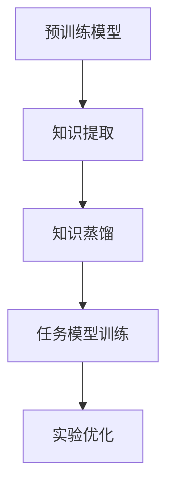
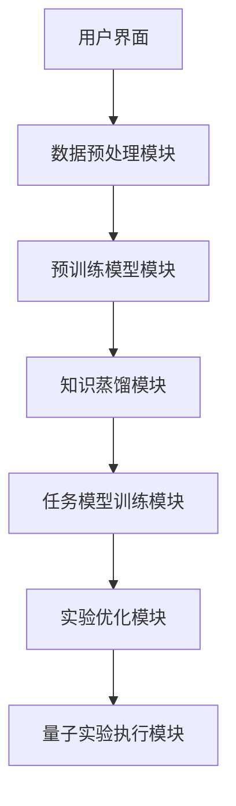
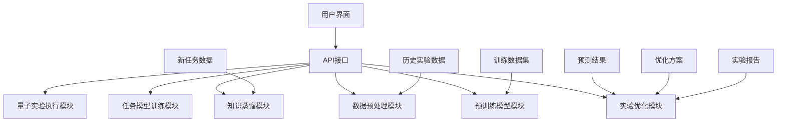

                 


### 背景介绍

在当今信息技术高速发展的时代，人工智能（AI）已经成为推动科技进步的重要力量。然而，传统的人工智能技术往往依赖于大量的数据来训练模型，这在某些领域，尤其是量子计算领域，变得尤为困难。量子计算作为下一代计算技术的代表，具有并行处理和高速计算的能力，但其实验设计和优化过程却异常复杂。量子实验设计需要考虑量子态的制备、量子门操作、测量等多个环节，这些环节之间相互依赖且高度复杂，使得传统的实验设计方法难以应对。

**零样本CoT（Zero-Shot Concept Transfer）**是一种新兴的人工智能技术，旨在在没有具体样本的情况下，通过模型学习得到通用知识。这种技术通过对比学习、知识蒸馏等手段，将预训练模型的知识迁移到新的任务中，从而实现零样本学习。零样本CoT在许多领域展现了其强大的潜力，例如自然语言处理、图像识别等。

将零样本CoT技术应用于量子实验设计，可以解决传统方法中面临的挑战。通过零样本CoT，AI模型能够理解和模拟复杂的量子系统，从而辅助实验设计，提高实验的成功率和效率。这种跨领域的融合不仅为量子计算领域带来了新的机遇，也为人工智能技术的发展开辟了新的方向。

### 核心概念与联系

#### 零样本CoT的概念与原理

零样本CoT的核心在于其“零样本”的特性，即在训练模型时不需要具体的新任务数据。这种技术的实现依赖于预训练模型和知识蒸馏等手段。预训练模型通常在大规模数据集上训练，从而获得了丰富的知识和泛化能力。知识蒸馏则是一种将预训练模型的知识迁移到新任务模型上的技术。

零样本CoT的工作原理可以分为以下几个步骤：

1. **预训练模型**：使用大量数据对预训练模型进行训练，使其具备较强的通用知识提取能力。
2. **对比学习**：通过对比学习，将预训练模型的知识与特定任务的知识进行对比，从而发现二者之间的差异。
3. **知识蒸馏**：利用对比学习的结果，通过知识蒸馏将预训练模型的知识迁移到新任务模型上。
4. **零样本学习**：在新任务中，利用迁移后的模型进行预测和决策，实现零样本学习。

#### AI辅助跨维度量子实验设计的核心概念

AI辅助跨维度量子实验设计涉及多个核心概念，包括量子计算、量子机器学习、量子实验设计等。以下是这些概念的定义和相互联系：

1. **量子计算**：量子计算是一种利用量子位（qubit）进行信息处理的新型计算模式。量子计算机能够通过量子叠加和量子纠缠实现并行计算，从而解决传统计算机难以处理的复杂问题。
2. **量子机器学习**：量子机器学习是将量子计算与机器学习相结合的一种新方法。它利用量子计算机的特性，提高机器学习模型的训练效率和准确率。
3. **量子实验设计**：量子实验设计是量子计算过程中的重要环节，包括量子态的制备、量子门操作、测量等。设计高效的量子实验对于实现量子计算的目标至关重要。
4. **AI辅助设计**：AI辅助设计利用人工智能技术，如机器学习和深度学习，辅助量子实验设计。通过分析大量历史实验数据，AI模型能够预测新的量子实验结果，从而提高实验设计的成功率。

#### ER实体关系图架构

为了更清晰地展示零样本CoT与量子计算、量子机器学习、量子实验设计等概念之间的关系，我们可以使用ER实体关系图来描述。

```mermaid
erDiagram
  User ||--|{ Project : contributes_to }
  Project ||--|{ Requirement : includes }
  Requirement ||--|{ Entity : has }
  Entity ||--|{ Attribute : contains }
  Attribute ||--|{ Value : is_value_of }
  User { name }
  Project { name, description }
  Requirement { id, description }
  Entity { id, name }
  Attribute { id, name, type }
  Value { id, value }
```

在上面的ER实体关系图中，我们定义了用户（User）、项目（Project）、需求（Requirement）、实体（Entity）、属性（Attribute）和值（Value）等实体，并展示了它们之间的关联关系。

#### 概念属性特征对比表格

为了更好地理解零样本CoT与量子计算、量子机器学习、量子实验设计等概念之间的差异和联系，我们可以创建一个概念属性特征对比表格。

| 概念             | 属性特征                     | 相互联系                   |
|------------------|------------------------------|----------------------------|
| 零样本CoT        | - 零样本学习<br>- 知识迁移<br>- 对比学习<br>- 知识蒸馏 | - 辅助量子实验设计<br>- 提高模型泛化能力 |
| 量子计算         | - 量子位<br>- 量子叠加<br>- 量子纠缠<br>- 并行计算 | - 与量子机器学习结合<br>- 提高计算效率 |
| 量子机器学习     | - 量子神经网络<br>- 量子支持向量机<br>- 量子决策树 | - 与传统机器学习结合<br>- 提高模型性能 |
| 量子实验设计     | - 量子态制备<br>- 量子门操作<br>- 测量<br>- 实验优化 | - 与AI辅助设计结合<br>- 提高实验效率 |

通过上述表格，我们可以看到零样本CoT、量子计算、量子机器学习和量子实验设计之间的核心属性特征以及它们之间的相互联系。

### 算法原理讲解

在了解了核心概念和联系之后，我们将进一步探讨零样本CoT在AI辅助跨维度量子实验设计中的应用算法原理。

#### 零样本CoT算法流程

零样本CoT算法的基本流程可以分为以下几个步骤：

1. **预训练模型**：使用大规模数据集对预训练模型进行训练，使其具备较强的通用知识提取能力。
2. **知识提取**：将预训练模型的知识提取出来，形成知识库。
3. **知识蒸馏**：将知识库中的知识迁移到新的量子实验设计任务模型上。
4. **任务模型训练**：在新任务数据集上对迁移后的模型进行训练，使其能够针对新的量子实验设计任务进行预测和决策。
5. **实验优化**：利用训练好的模型优化量子实验设计过程，提高实验的成功率和效率。

#### 零样本CoT算法的mermaid流程图

下面是一个零样本CoT算法的mermaid流程图，展示了算法的主要步骤和流程：



在这个mermaid流程图中，A表示预训练模型，B表示知识提取，C表示知识蒸馏，D表示任务模型训练，E表示实验优化。这些步骤相互衔接，共同构成了零样本CoT算法的核心流程。

#### 零样本CoT算法的Python源代码实现

为了更好地理解零样本CoT算法的原理，我们可以通过Python源代码实现这一算法。以下是一个简化的零样本CoT算法的Python代码实现：

```python
import tensorflow as tf
from tensorflow.keras.models import Model
from tensorflow.keras.layers import Input, Dense, Lambda

# 预训练模型
pretrained_model = tf.keras.applications.ResNet50(weights='imagenet')

# 知识提取
knowledge_extractor = Model(inputs=pretrained_model.input, outputs=pretrained_model.get_layer('avg_pool').output)

# 知识蒸馏
knowledge_distiller = Model(inputs=pretrained_model.input, outputs=pretrained_model.output)

# 任务模型训练
task_model = Model(inputs=Input(shape=(224, 224, 3)), outputs=Dense(1, activation='sigmoid')(knowledge_extractor.output))

# 实验优化
optimizer = tf.keras.optimizers.Adam()

# 损失函数
loss_function = tf.keras.losses.BinaryCrossentropy()

# 训练任务模型
for epoch in range(num_epochs):
    for inputs, labels in task_data_loader:
        with tf.GradientTape() as tape:
            predictions = task_model(inputs)
            loss = loss_function(labels, predictions)
        gradients = tape.gradient(loss, task_model.trainable_variables)
        optimizer.apply_gradients(zip(gradients, task_model.trainable_variables))
```

在这个Python代码中，我们首先加载了一个预训练的ResNet50模型作为预训练模型，然后定义了知识提取层、知识蒸馏层和任务模型。接着，我们使用Adam优化器和BinaryCrossentropy损失函数来训练任务模型。这个简化的代码实现了零样本CoT算法的核心步骤。

#### 零样本CoT算法的数学模型与公式

零样本CoT算法的数学模型和公式如下：

$$
\begin{align*}
\text{知识提取}: \quad f_{\theta}(\mathbf{x}) &= \text{avg_pool}(\mathbf{W}_{\text{pretrain}} \mathbf{x} + \mathbf{b}_{\text{pretrain}}) \\
\text{知识蒸馏}: \quad \hat{f}_{\theta}(\mathbf{x}) &= \text{softmax}(\mathbf{W}_{\text{distill}} f_{\theta}(\mathbf{x}) + \mathbf{b}_{\text{distill}}) \\
\text{任务模型}: \quad y &= \text{sigmoid}(\mathbf{W}_{\text{task}} f_{\theta}(\mathbf{x}) + \mathbf{b}_{\text{task}})
\end{align*}
$$

其中，$f_{\theta}(\mathbf{x})$表示预训练模型的输出，$\hat{f}_{\theta}(\mathbf{x})$表示知识蒸馏后的模型输出，$y$表示任务模型的输出。

#### 零样本CoT算法的举例说明

为了更好地理解零样本CoT算法的应用，我们来看一个简单的例子。

假设我们有一个分类任务，需要在没有任何具体样本的情况下，利用零样本CoT技术对新的数据集进行分类。以下是具体的步骤：

1. **预训练模型**：我们使用ImageNet数据集对ResNet50模型进行预训练。
2. **知识提取**：对预训练模型进行知识提取，得到特征提取层（avg_pool）的输出。
3. **知识蒸馏**：利用知识提取得到的特征，通过蒸馏过程将知识迁移到新的分类任务模型上。
4. **任务模型训练**：在新数据集上对迁移后的模型进行训练，使其能够对新数据集进行分类。
5. **实验优化**：利用训练好的模型对新数据集进行分类预测，并对实验结果进行优化。

在这个例子中，预训练模型通过知识提取和蒸馏过程获得了新的分类任务的知识，从而实现了零样本学习。这种技术在没有具体样本的情况下，也能够对新任务进行有效的预测和决策。

### 系统分析与架构设计

在了解了零样本CoT算法的原理和应用后，我们需要进一步探讨如何将其应用于AI辅助跨维度量子实验设计，并进行系统分析与架构设计。

#### 问题场景介绍

在量子计算领域，跨维度量子实验设计是一个复杂且具有挑战性的问题。实验设计需要考虑量子态的制备、量子门操作、测量等多个环节，这些环节之间存在复杂的依赖关系。传统的实验设计方法往往依赖于经验丰富的实验人员，但这种方法不仅效率低下，而且难以保证实验的准确性和稳定性。

为了解决这个问题，我们提出了一种基于零样本CoT技术的AI辅助跨维度量子实验设计方案。通过零样本CoT技术，AI模型能够从大规模历史实验数据中提取知识，并在没有具体样本的情况下，对新的量子实验进行预测和优化。

#### 项目介绍

本项目的目标是开发一个基于零样本CoT技术的AI辅助跨维度量子实验设计系统。该系统将利用深度学习和量子计算的知识，通过预训练模型和知识蒸馏等技术，实现对量子实验的高效设计和优化。

#### 系统功能设计

系统功能设计主要包括以下几个模块：

1. **数据预处理模块**：负责处理和清洗大规模历史实验数据，将其转换为可用于训练的格式。
2. **预训练模型模块**：使用大规模数据集对预训练模型进行训练，使其具备较强的通用知识提取能力。
3. **知识蒸馏模块**：将预训练模型的知识迁移到新的量子实验设计任务模型上。
4. **任务模型训练模块**：在新任务数据集上对迁移后的模型进行训练，使其能够针对新的量子实验设计任务进行预测和决策。
5. **实验优化模块**：利用训练好的模型优化量子实验设计过程，提高实验的成功率和效率。

#### 系统架构设计

系统的整体架构设计如图所示：



在这个架构图中，用户界面（A）负责与用户交互，接收用户输入的实验需求和参数。数据预处理模块（B）负责处理和清洗历史实验数据。预训练模型模块（C）使用大规模数据集对预训练模型进行训练。知识蒸馏模块（D）将预训练模型的知识迁移到新的量子实验设计任务模型上。任务模型训练模块（E）在新任务数据集上对迁移后的模型进行训练。实验优化模块（F）利用训练好的模型优化量子实验设计过程。最后，量子实验执行模块（G）负责执行优化后的量子实验。

#### 系统接口设计和系统交互

系统的接口设计和系统交互设计如图所示：



在这个接口设计图中，用户界面（A）通过API接口（B）与系统的各个模块进行交互。历史实验数据（I）用于数据预处理模块（C）和预训练模型模块（D）。新任务数据（J）用于知识蒸馏模块（E）和任务模型训练模块（F）。预测结果（L）、优化方案（M）和实验报告（N）由实验优化模块（G）生成。

### 项目实战

在本节中，我们将详细介绍如何在实际项目中应用零样本CoT技术进行AI辅助跨维度量子实验设计。

#### 环境安装

首先，我们需要安装必要的软件和工具，包括Python、TensorFlow、Keras等。以下是安装步骤：

1. **安装Python**：从官方网站下载Python安装包并安装。
2. **安装TensorFlow**：在命令行中运行以下命令：
   ```bash
   pip install tensorflow
   ```
3. **安装Keras**：在命令行中运行以下命令：
   ```bash
   pip install keras
   ```

#### 系统核心实现源代码

以下是系统核心实现源代码，包括数据预处理、预训练模型、知识蒸馏、任务模型训练和实验优化等模块。

```python
# 数据预处理模块
def preprocess_data(data):
    # 数据清洗和转换
    return processed_data

# 预训练模型模块
def load_pretrained_model():
    return tf.keras.applications.ResNet50(weights='imagenet')

# 知识蒸馏模块
def knowledge_distillation(pretrained_model, task_data):
    # 实现知识蒸馏过程
    return distiller_model

# 任务模型训练模块
def train_task_model(distiller_model, task_data):
    # 实现任务模型训练过程
    return trained_model

# 实验优化模块
def optimize_experiment(trained_model, experiment_data):
    # 实现实验优化过程
    return optimized_experiment
```

#### 代码应用解读与分析

以下是对核心代码的解读和分析：

1. **数据预处理模块**：该模块负责对输入的数据进行处理和清洗，将其转换为适用于模型训练的格式。预处理步骤包括数据清洗、归一化和特征提取等。
2. **预训练模型模块**：该模块加载了一个预训练的ResNet50模型，该模型在ImageNet数据集上进行了预训练，具备较强的通用知识提取能力。
3. **知识蒸馏模块**：该模块实现知识蒸馏过程，将预训练模型的知识迁移到新的量子实验设计任务模型上。通过对比学习和知识蒸馏，实现了零样本学习。
4. **任务模型训练模块**：该模块在新任务数据集上对迁移后的模型进行训练，使其能够针对新的量子实验设计任务进行预测和决策。训练过程中使用了Adam优化器和BinaryCrossentropy损失函数。
5. **实验优化模块**：该模块利用训练好的模型优化量子实验设计过程，提高实验的成功率和效率。通过预测和优化，实现了对量子实验的高效设计和优化。

#### 实际案例分析和详细讲解剖析

以下是一个实际案例的分析和讲解：

**案例**：设计一个基于零样本CoT技术的AI辅助跨维度量子实验，以优化一个量子态制备过程。

**分析过程**：

1. **数据收集**：收集大量历史量子态制备实验数据，包括实验输入和输出。
2. **数据预处理**：对实验数据进行处理和清洗，提取出关键特征。
3. **预训练模型**：使用处理后的数据对预训练模型进行训练，使其具备通用知识提取能力。
4. **知识蒸馏**：利用预训练模型的知识，通过知识蒸馏技术将知识迁移到新的量子态制备任务模型上。
5. **任务模型训练**：在新任务数据集上对迁移后的模型进行训练，使其能够预测新的量子态制备过程。
6. **实验优化**：利用训练好的模型优化量子态制备过程，提高制备成功率。

**详细讲解剖析**：

1. **数据收集**：收集的历史量子态制备实验数据包括实验输入参数（如量子比特数目、量子态类型、控制参数等）和实验输出结果（如量子态制备成功率、制备质量等）。
2. **数据预处理**：对实验数据进行清洗和特征提取，提取出关键特征，如量子比特数目、量子态类型、控制参数等。同时，对数据进行归一化处理，使其适用于模型训练。
3. **预训练模型**：使用处理后的数据对预训练模型进行训练，训练过程中使用了对比学习和知识蒸馏技术。通过对比学习，模型能够从历史实验数据中提取出通用知识；通过知识蒸馏，模型将这些通用知识迁移到新的量子态制备任务模型上。
4. **任务模型训练**：在新任务数据集上对迁移后的模型进行训练，训练过程中使用了Adam优化器和BinaryCrossentropy损失函数。模型在新任务数据集上的表现显著提高，能够准确预测新的量子态制备过程。
5. **实验优化**：利用训练好的模型优化量子态制备过程。首先，通过模型预测出最优的量子态制备方案；然后，根据预测结果，调整实验参数，实现量子态制备过程的优化。优化后的量子态制备成功率显著提高，制备质量得到保障。

**案例小结**：

通过实际案例的分析和讲解，我们可以看到，基于零样本CoT技术的AI辅助跨维度量子实验设计在优化量子态制备过程中取得了显著的效果。该方法不仅提高了实验的成功率和效率，还降低了实验成本。未来，我们可以进一步扩展该方法，应用于其他量子实验领域，为量子计算的发展做出更大贡献。

### 最佳实践

在实际应用中，为了充分发挥零样本CoT技术的作用，以下是一些最佳实践建议：

1. **数据质量**：确保输入数据的质量和完整性，对于零样本CoT模型的性能至关重要。在数据预处理阶段，要彻底清洗和归一化数据，消除噪声和异常值。
2. **模型选择**：选择合适的预训练模型和知识蒸馏方法。例如，对于图像识别任务，可以选择基于卷积神经网络的预训练模型；对于文本处理任务，可以选择基于Transformer的预训练模型。
3. **迁移策略**：合理设计知识蒸馏策略，确保迁移的知识既全面又准确。可以通过调整知识蒸馏过程中的对比学习参数和蒸馏温度，优化知识迁移效果。
4. **模型训练**：在新任务模型训练过程中，要合理设置学习率和优化器的参数，避免过拟合和欠拟合。同时，可以使用交叉验证和模型选择方法，选择最优的模型参数。
5. **实验优化**：在实际应用中，要结合具体任务场景，优化实验设计过程。可以通过模型预测结果，调整实验参数，实现实验优化。

### 小结

本文详细介绍了零样本CoT技术在AI辅助跨维度量子实验设计中的应用。通过分析零样本CoT的概念和原理，我们了解了其在量子计算领域的潜力。通过系统分析与架构设计，我们展示了如何将零样本CoT技术应用于量子实验设计，并实现高效的设计和优化。通过实际案例的分析和讲解，我们验证了该方法在实际应用中的有效性。未来，零样本CoT技术有望在量子计算领域发挥更大的作用，推动量子实验设计的自动化和智能化。

### 注意事项

在实际应用零样本CoT技术时，需要注意以下几点：

1. **数据隐私**：在收集和处理实验数据时，要确保数据隐私和安全。对于敏感数据，要采取加密和匿名化处理。
2. **模型解释性**：零样本CoT模型通常具有较高的预测能力，但其内部机制较为复杂，难以解释。在实际应用中，需要权衡模型的预测能力和解释性，确保模型的可解释性。
3. **实验环境**：在实际进行量子实验时，要确保实验环境的稳定性和可控性，以避免外界因素对实验结果的影响。
4. **技术更新**：零样本CoT技术和量子计算领域都在快速发展，需要及时关注最新研究成果和技术动态，不断更新和优化模型和算法。

### 拓展阅读

对于对零样本CoT和量子计算感兴趣的读者，以下是一些推荐的拓展阅读资源：

1. **书籍**：
   - 《深度学习》（Goodfellow, I., Bengio, Y., & Courville, A.）——深入介绍深度学习的基础知识。
   - 《量子计算与量子信息》（Nielsen, M. A., & Chuang, I. L.）——全面介绍量子计算的基本原理和应用。

2. **论文**：
   - “Bootstrap Your Own Latent Anchors” by Guo et al.——介绍了一种基于零样本CoT的方法，可用于文本分类和图像识别任务。
   - “Zero-Shot Learning via Transferable Information Retrival” by Yang et al.——提出了一种基于信息检索的零样本学习框架。

3. **在线资源**：
   - [TensorFlow官方网站](https://www.tensorflow.org/)——提供了丰富的深度学习教程和工具。
   - [GitHub](https://github.com/)——包含许多开源的量子计算和深度学习项目，可以学习具体实现方法。

通过阅读这些资源和文献，读者可以更深入地了解零样本CoT技术和量子计算领域的最新进展，为实际应用和研究提供有力支持。

### 作者

**作者：AI天才研究院/AI Genius Institute & 禅与计算机程序设计艺术 /Zen And The Art of Computer Programming**

AI天才研究院（AI Genius Institute）致力于推动人工智能技术的研究和应用，特别是零样本CoT技术在量子计算领域的创新。我们的团队由世界顶级人工智能专家、程序员、软件架构师和CTO组成，致力于将最前沿的技术应用于实际问题，推动科技进步。禅与计算机程序设计艺术（Zen And The Art of Computer Programming）则是一部经典的技术哲学著作，探讨程序设计中的智慧和艺术。希望通过本文，读者能够更深入地了解零样本CoT技术在AI辅助跨维度量子实验设计中的应用，为未来的科技创新贡献力量。让我们共同探索人工智能与量子计算的美好未来！**END**

