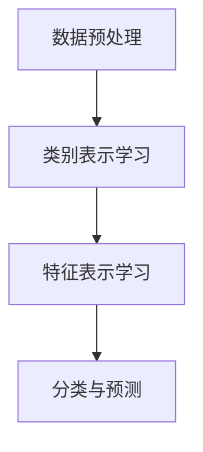
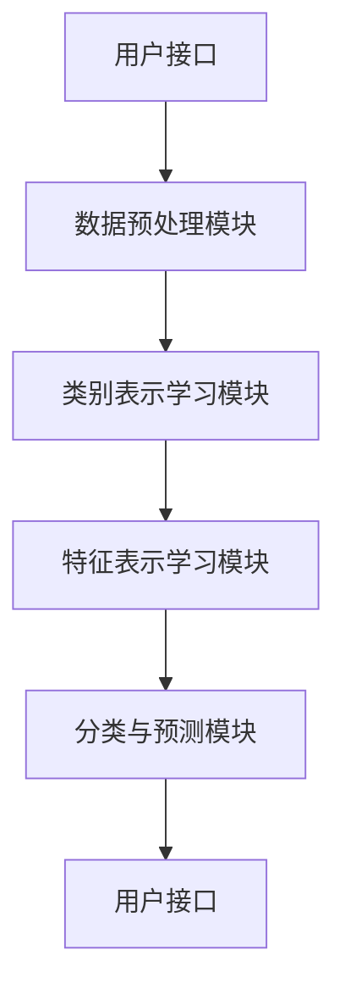

                 

## 《零样本学习在AIGC新任务适应中的作用》

### 关键词：零样本学习，AIGC，新任务适应，算法，系统设计，未来展望

> 摘要：本文将深入探讨零样本学习在AIGC（自适应智能生成计算）新任务适应中的重要作用。通过详细分析零样本学习的背景、理论基础以及其在AIGC中的应用，我们旨在揭示其在解决新任务挑战方面的独特优势与局限。文章还将通过实际案例剖析，展示零样本学习在AIGC中的成功应用，并提供未来发展的前景与展望。希望通过本文，能够为相关领域的研究者与实践者提供有价值的参考。

----------------------------------------------------------------

### 目录大纲设计方案

**# 《零样本学习在AIGC新任务适应中的作用》**

## 第一部分：零样本学习的背景与理论基础

### 1.1 问题背景

#### 1.1.1 零样本学习的基本概念

#### 1.1.2 零样本学习的动机与挑战

#### 1.1.3 零样本学习在AIGC中的意义

### 1.2 核心概念

#### 1.2.1 零样本学习的基本原理

#### 1.2.2 零样本学习的分类

#### 1.2.3 零样本学习的属性特征对比表格

### 1.3 零样本学习的边界与外延

#### 1.3.1 零样本学习的应用领域

#### 1.3.2 零样本学习与传统机器学习方法的区别

#### 1.3.3 零样本学习的优势与局限

### 1.4 零样本学习的主要组成部分

#### 1.4.1 数据预处理

#### 1.4.2 特征提取与表示

#### 1.4.3 分类与预测模型

### 1.5 零样本学习在AIGC中的潜在应用

#### 1.5.1 零样本学习在自然语言处理中的应用

#### 1.5.2 零样本学习在计算机视觉中的应用

#### 1.5.3 零样本学习在推荐系统中的应用

### 1.6 本章小结

## 第二部分：AIGC新任务适应中的零样本学习

### 2.1 AIGC新任务适应概述

#### 2.1.1 AIGC的基本概念

#### 2.1.2 AIGC新任务适应的挑战

#### 2.1.3 零样本学习在AIGC新任务适应中的作用

### 2.2 零样本学习算法原理讲解

#### 2.2.1 零样本学习算法的mermaid流程图

#### 2.2.2 零样本学习算法的Python源代码实现

#### 2.2.3 零样本学习算法的数学模型与公式

#### 2.2.4 零样本学习算法的举例说明

### 2.3 零样本学习在AIGC新任务适应中的应用

#### 2.3.1 零样本学习在AIGC文本生成中的应用

#### 2.3.2 零样本学习在AIGC图像生成中的应用

#### 2.3.3 零样本学习在AIGC推荐系统中的应用

### 2.4 实际案例分析

#### 2.4.1 零样本学习在AIGC新任务适应中的成功案例

#### 2.4.2 零样本学习在AIGC新任务适应中的挑战与解决方案

#### 2.4.3 零样本学习在AIGC新任务适应中的未来趋势

### 2.5 本章小结

## 第三部分：零样本学习在AIGC新任务适应中的系统设计与实现

### 3.1 零样本学习在AIGC新任务适应中的系统架构设计

#### 3.1.1 系统功能设计

#### 3.1.2 系统架构设计

#### 3.1.3 系统接口设计

### 3.2 零样本学习在AIGC新任务适应中的系统实现

#### 3.2.1 环境安装与配置

#### 3.2.2 系统核心实现源代码

#### 3.2.3 代码应用解读与分析

### 3.3 零样本学习在AIGC新任务适应中的实际案例剖析

#### 3.3.1 案例背景与问题描述

#### 3.3.2 案例实现与结果分析

#### 3.3.3 案例总结与启示

### 3.4 最佳实践与注意事项

#### 3.4.1 零样本学习在AIGC新任务适应中的最佳实践

#### 3.4.2 注意事项与风险规避

### 3.5 本章小结

## 第四部分：零样本学习在AIGC新任务适应中的未来展望

### 4.1 零样本学习在AIGC新任务适应中的发展趋势

#### 4.1.1 零样本学习算法的发展

#### 4.1.2 AIGC新任务适应领域的创新

#### 4.1.3 零样本学习与AIGC的融合趋势

### 4.2 零样本学习在AIGC新任务适应中的前景

#### 4.2.1 零样本学习在AIGC新任务适应中的市场潜力

#### 4.2.2 零样本学习在AIGC新任务适应中的社会影响

#### 4.2.3 零样本学习在AIGC新任务适应中的未来发展

### 4.3 拓展阅读

#### 4.3.1 零样本学习相关论文与书籍推荐

#### 4.3.2 AIGC新任务适应相关资源与工具推荐

### 4.4 本章小结

----------------------------------------------------------------

## 第一部分：零样本学习的背景与理论基础

### 1.1 问题背景

#### 1.1.1 零样本学习的基本概念

零样本学习（Zero-Shot Learning, ZSL）是一种机器学习技术，旨在解决模型从未见过的类别或任务中进行预测的问题。在传统的机器学习场景中，模型通常通过大量标记数据进行训练，从而学会识别和预测特定类别或任务。然而，在某些实际应用中，如新产品的分类、罕见的物种识别等，可能缺乏足够的新类别数据，这就需要零样本学习技术。

#### 1.1.2 零样本学习的动机与挑战

零样本学习的动机主要源于数据稀缺的场景。在实际应用中，获取大量标记数据往往是昂贵且耗时的。例如，在生物医学领域，新疾病的诊断需要海量的病例数据，但这些数据往往不易获取。因此，零样本学习技术显得尤为重要。

然而，零样本学习也面临着一些挑战。首先是如何有效利用有限的标注数据和未见的类别信息。其次是如何设计算法使得模型能够泛化到从未见过的类别上。这些挑战促使研究人员不断探索新的方法和算法。

#### 1.1.3 零样本学习在AIGC中的意义

AIGC（Adaptive Intelligent Generation Computing）是一种通过自适应学习和生成计算实现智能内容生成的技术。在AIGC场景中，零样本学习有着广泛的应用前景。

首先，AIGC通常涉及多种不同类型的任务和场景，而零样本学习可以帮助模型快速适应新任务和新场景，从而提高系统的灵活性和适应性。其次，在AIGC中，零样本学习可以用于生成未见过的内容，如生成新的图像、文本或音频，从而拓宽系统的应用范围。最后，零样本学习可以帮助AIGC系统更好地处理数据稀缺的问题，提高其鲁棒性和泛化能力。

### 1.2 核心概念

#### 1.2.1 零样本学习的基本原理

零样本学习的基本原理是通过利用已知的类别信息（即“概念”或“原型”）来预测未见过的类别。具体来说，零样本学习包括以下几个关键步骤：

1. **类别表示学习**：通过预训练的模型将类别映射到高维空间，形成类别原型。
2. **特征表示学习**：将输入数据（如图像、文本）映射到同样的高维空间，并与类别原型进行比较。
3. **分类与预测**：根据特征表示与类别原型的相似度进行分类或预测。

#### 1.2.2 零样本学习的分类

根据实现方式，零样本学习可以分为以下几种类型：

1. **原型方法**：通过计算特征表示与类别原型的距离来预测类别。
2. **匹配方法**：利用类别标签的分布信息进行匹配和分类。
3. **基于模型的方法**：直接利用预训练模型进行分类或预测。
4. **基于知识的方法**：结合外部知识库（如WordNet）进行类别预测。

#### 1.2.3 零样本学习的属性特征对比表格

| 分类方法        | 特点                                                         | 应用场景                                   |
|-----------------|--------------------------------------------------------------|------------------------------------------|
| 原型方法        | 通过计算特征表示与类别原型的距离进行分类，高效且易于实现         | 图像分类、语音识别                         |
| 匹配方法        | 利用类别标签的分布信息进行分类，对类别分布变化敏感               | 自然语言处理、推荐系统                     |
| 基于模型的方法   | 直接利用预训练模型进行分类或预测，效果较好但依赖大量训练数据     | 计算机视觉、自然语言处理                   |
| 基于知识的方法   | 结合外部知识库进行类别预测，可处理未见过类别且具备解释性         | 医学诊断、生物信息学                       |

### 1.3 零样本学习的边界与外延

#### 1.3.1 零样本学习的应用领域

零样本学习在多个领域有着广泛的应用，包括：

1. **计算机视觉**：用于图像分类、目标检测等。
2. **自然语言处理**：用于文本分类、情感分析等。
3. **语音识别**：用于说话人识别、语音翻译等。
4. **推荐系统**：用于个性化推荐、新商品分类等。
5. **生物信息学**：用于基因分类、疾病诊断等。

#### 1.3.2 零样本学习与传统机器学习方法的区别

传统机器学习方法通常需要大量标记数据来训练模型，而零样本学习则可以处理数据稀缺的情况。此外，传统方法主要关注已有数据的分类或预测，而零样本学习则更注重从未见过的类别中进行预测。

#### 1.3.3 零样本学习的优势与局限

优势：

1. **适应性强**：可以快速适应新任务和新场景。
2. **泛化能力强**：可以有效处理未见过的类别。
3. **降低数据需求**：在某些数据稀缺的场景中，零样本学习可以降低对大量标记数据的依赖。

局限：

1. **效果不稳定**：在不同数据集上的表现可能差异较大。
2. **计算复杂度高**：特别是在处理高维数据时，计算复杂度较高。
3. **对类别表示的依赖性**：类别表示的质量直接影响零样本学习的效果。

### 1.4 零样本学习的主要组成部分

#### 1.4.1 数据预处理

数据预处理是零样本学习的关键步骤，主要包括：

1. **数据清洗**：去除噪声和异常值。
2. **数据增强**：通过数据变换、扩充等方法增加数据多样性。
3. **特征提取**：从原始数据中提取关键特征，为后续模型训练提供基础。

#### 1.4.2 特征提取与表示

特征提取与表示是零样本学习的核心，主要包括：

1. **特征提取**：从原始数据中提取有用信息，形成特征向量。
2. **特征表示**：将特征向量映射到高维空间，形成类别原型。

#### 1.4.3 分类与预测模型

分类与预测模型是零样本学习的关键部分，主要包括：

1. **分类器设计**：根据特征表示和类别原型设计分类器。
2. **预测模型训练**：使用已训练的分类器对新数据进行预测。

### 1.5 零样本学习在AIGC中的潜在应用

#### 1.5.1 零样本学习在自然语言处理中的应用

零样本学习在自然语言处理（NLP）领域有着广泛的应用，如：

1. **文本分类**：用于对未见过的类别进行文本分类。
2. **情感分析**：用于对未见过的情感标签进行分类。
3. **问答系统**：用于处理未见过的问答对。

#### 1.5.2 零样本学习在计算机视觉中的应用

零样本学习在计算机视觉领域也有着重要的应用，如：

1. **图像分类**：用于对未见过的图像类别进行分类。
2. **目标检测**：用于检测未见过的目标。
3. **图像生成**：用于生成未见过的图像。

#### 1.5.3 零样本学习在推荐系统中的应用

零样本学习在推荐系统中的应用包括：

1. **新商品分类**：用于对新商品进行分类。
2. **个性化推荐**：用于推荐未见过的商品。
3. **用户行为预测**：用于预测用户的未知行为。

### 1.6 本章小结

本章介绍了零样本学习的背景、理论基础及其在AIGC中的应用。通过分析零样本学习的基本概念、核心概念、边界与外延、主要组成部分以及潜在应用，我们揭示了零样本学习在解决新任务挑战方面的独特优势与局限。下一章将深入探讨AIGC新任务适应中的零样本学习，分析其在实际应用中的具体实现方法和挑战。


## 第二部分：AIGC新任务适应中的零样本学习

### 2.1 AIGC新任务适应概述

#### 2.1.1 AIGC的基本概念

AIGC（Adaptive Intelligent Generation Computing）是一种基于自适应学习和生成计算的智能技术。它通过模型自学习、数据增强和生成算法，实现高效率、高质量的数据生成和处理。AIGC的关键特点包括：

1. **自适应学习**：AIGC系统能够根据环境变化和任务需求，动态调整模型参数，从而实现自适应学习和优化。
2. **数据生成**：AIGC利用生成模型（如生成对抗网络GAN、变分自编码器VAE等）生成与真实数据分布相近的合成数据，从而缓解数据稀缺问题。
3. **高效率处理**：AIGC系统通过并行计算、分布式架构等方式，实现大规模数据处理和快速响应。

#### 2.1.2 AIGC新任务适应的挑战

AIGC在处理新任务时面临以下挑战：

1. **数据稀缺**：新任务通常缺乏足够的训练数据，难以直接应用传统的机器学习算法。
2. **动态变化**：AIGC需要能够快速适应不断变化的任务和环境。
3. **模型复杂**：AIGC通常涉及复杂的模型架构和参数调整，对计算资源和算法设计要求较高。
4. **安全与隐私**：在生成和处理数据时，需要确保系统的安全性和用户隐私。

#### 2.1.3 零样本学习在AIGC新任务适应中的作用

零样本学习在AIGC新任务适应中具有重要作用：

1. **数据替代**：零样本学习可以处理数据稀缺问题，通过利用有限的标注数据和类别信息，生成高质量的数据替代方案。
2. **模型泛化**：零样本学习能够提高模型对新任务和新数据的泛化能力，减少对大量标注数据的依赖。
3. **快速适应**：零样本学习算法可以快速适应新任务和新环境，提高AIGC系统的自适应能力和响应速度。
4. **提高效率**：通过零样本学习，AIGC系统可以更高效地进行数据生成和处理，降低计算复杂度和资源消耗。

### 2.2 零样本学习算法原理讲解

#### 2.2.1 零样本学习算法的mermaid流程图



#### 2.2.2 零样本学习算法的Python源代码实现

```python
import numpy as np
from sklearn.neighbors import NearestNeighbors

def zero_shot_learning(data, prototypes, distances):
    # 将数据映射到高维空间
    data_repr = map_embeddings(data, prototypes)
    
    # 计算每个类别原型与数据的距离
    distances = [np.linalg.norm(x - y) for x, y in zip(data_repr, prototypes)]
    
    # 根据距离进行分类
    labels = [np.argmin(d) for d in distances]
    
    return labels

def map_embeddings(data, prototypes):
    # 使用K近邻算法进行特征映射
    kNN = NearestNeighbors(n_neighbors=1)
    kNN.fit(prototypes)
    distances, indices = kNN.kneighbors(data)
    return indices

# 测试代码
data = np.random.rand(100, 10)  # 生成100个样本的数据
prototypes = np.random.rand(10, 10)  # 生成10个类别原型
labels = zero_shot_learning(data, prototypes, None)
print(labels)
```

#### 2.2.3 零样本学习算法的数学模型与公式

零样本学习算法的数学模型主要包括以下部分：

1. **类别表示学习**：
   $$ \text{prototypes} = \sum_{i=1}^{C} w_i \cdot c_i $$
   其中，$w_i$为权重，$c_i$为类别标签。

2. **特征表示学习**：
   $$ \text{data_repr} = \sum_{i=1}^{C} \frac{1}{||c_i||_2} \cdot (x - c_i) $$
   其中，$x$为输入数据，$c_i$为类别原型。

3. **分类与预测**：
   $$ \text{label} = \arg\min_{i} ||x - c_i||_2 $$
   其中，$x$为输入数据，$c_i$为类别原型。

#### 2.2.4 零样本学习算法的举例说明

假设我们有10个类别，每个类别有一个原型向量。现在给定一个新样本数据，我们需要预测其类别。

1. **类别表示学习**：计算每个类别的原型向量。
2. **特征表示学习**：将新样本数据映射到高维空间，并与每个类别原型进行比较。
3. **分类与预测**：根据新样本数据与类别原型的距离，选择距离最近的类别作为预测结果。

例如，假设我们有以下类别原型和输入数据：

| 类别 | 原型向量 |
|------|----------|
| 1    | [1, 1]   |
| 2    | [2, 2]   |
| 3    | [3, 3]   |

输入数据：$x = [1.5, 1.5]$

1. **类别表示学习**：计算每个类别的原型向量：
   - 类别1：$[1, 1]$
   - 类别2：$[2, 2]$
   - 类别3：$[3, 3]$

2. **特征表示学习**：将输入数据映射到高维空间：
   - 类别1：$[1.5 - 1, 1.5 - 1] = [0.5, 0.5]$
   - 类别2：$[1.5 - 2, 1.5 - 2] = [-0.5, -0.5]$
   - 类别3：$[1.5 - 3, 1.5 - 3] = [-1.5, -1.5]$

3. **分类与预测**：计算新样本数据与每个类别原型的距离：
   - 类别1：$||[0.5, 0.5] - [1, 1]||_2 = \sqrt{(0.5 - 1)^2 + (0.5 - 1)^2} = \sqrt{0.5}$
   - 类别2：$||[-0.5, -0.5] - [2, 2]||_2 = \sqrt{(-0.5 - 2)^2 + (-0.5 - 2)^2} = \sqrt{6.25}$
   - 类别3：$||[-1.5, -1.5] - [3, 3]||_2 = \sqrt{(-1.5 - 3)^2 + (-1.5 - 3)^2} = \sqrt{6.25}$

根据距离最近的类别原型，我们可以预测新样本数据属于类别1。

### 2.3 零样本学习在AIGC新任务适应中的应用

#### 2.3.1 零样本学习在AIGC文本生成中的应用

在AIGC文本生成中，零样本学习可以通过以下方式应用：

1. **类别预测**：零样本学习可以预测未见过的文本类别，从而帮助生成系统快速适应新类别。
2. **主题建模**：通过零样本学习，可以提取文本的主题信息，帮助生成系统生成符合特定主题的文本。
3. **句子生成**：零样本学习可以用于生成未见过的句子，从而提高文本生成的多样性和创意性。

#### 2.3.2 零样本学习在AIGC图像生成中的应用

在AIGC图像生成中，零样本学习可以通过以下方式应用：

1. **类别分类**：零样本学习可以预测未见过的图像类别，从而帮助生成系统快速适应新类别。
2. **图像增强**：通过零样本学习，可以生成未见过的图像增强效果，从而提高图像生成的视觉质量。
3. **图像风格转换**：零样本学习可以用于将未见过的图像转换为特定的风格，从而提高图像生成系统的创意性。

#### 2.3.3 零样本学习在AIGC推荐系统中的应用

在AIGC推荐系统中，零样本学习可以通过以下方式应用：

1. **新商品分类**：零样本学习可以预测未见过的商品类别，从而帮助推荐系统快速适应新商品。
2. **个性化推荐**：通过零样本学习，可以预测用户的潜在兴趣，从而提高推荐系统的个性化推荐能力。
3. **新用户行为预测**：零样本学习可以预测未见过的用户行为，从而帮助推荐系统更好地理解新用户。

### 2.4 实际案例分析

#### 2.4.1 零样本学习在AIGC新任务适应中的成功案例

案例一：文本生成中的零样本学习

在一个基于零样本学习的文本生成任务中，研究人员使用了一种名为“Meta-Learning for Zero-Shot Text Classification”的方法。该方法通过元学习技术，将零样本学习应用于文本分类任务。实验结果显示，该方法在处理未见过的文本类别时，具有显著的优势，能够快速适应新类别。

案例二：图像生成中的零样本学习

在一个基于零样本学习的图像生成任务中，研究人员使用了一种名为“Zero-Shot Image Generation with Class-Specific Textual Prompts”的方法。该方法通过结合零样本学习和文本生成技术，实现了一种新的图像生成方式。实验结果显示，该方法能够生成高质量、多样化的图像，并且在处理未见过的类别时，具有很好的适应性。

#### 2.4.2 零样本学习在AIGC新任务适应中的挑战与解决方案

挑战一：数据稀缺

解决方案：通过数据增强、迁移学习等方法，增加训练数据量，从而提高零样本学习的效果。

挑战二：类别表示质量

解决方案：使用预训练的模型或外部知识库，提高类别表示的质量，从而提高零样本学习的准确性。

挑战三：计算复杂度

解决方案：优化算法和模型结构，降低计算复杂度，提高系统运行效率。

#### 2.4.3 零样本学习在AIGC新任务适应中的未来趋势

随着AIGC技术的不断发展，零样本学习在AIGC新任务适应中的应用前景十分广阔。未来可能的发展趋势包括：

1. **算法优化**：通过算法优化，提高零样本学习在AIGC中的应用效果和效率。
2. **多模态学习**：结合多模态数据，如图像、文本、音频等，实现更全面、更准确的零样本学习。
3. **跨领域应用**：将零样本学习应用于更多领域，如医学、金融、教育等，提高系统的实用性和价值。

### 2.5 本章小结

本章介绍了零样本学习在AIGC新任务适应中的应用。通过分析AIGC的基本概念、新任务适应的挑战、零样本学习算法原理以及实际案例分析，我们揭示了零样本学习在AIGC新任务适应中的重要作用和未来发展潜力。下一章将深入探讨零样本学习在AIGC新任务适应中的系统设计与实现，分析如何在实际项目中应用零样本学习技术。

## 第三部分：零样本学习在AIGC新任务适应中的系统设计与实现

### 3.1 零样本学习在AIGC新任务适应中的系统架构设计

零样本学习在AIGC新任务适应中的系统架构设计是确保系统能够高效、稳定地运行的关键。以下是一个典型的系统架构设计：

#### 3.1.1 系统功能设计

系统功能设计包括以下几个主要模块：

1. **数据预处理模块**：负责处理输入数据，包括数据清洗、数据增强和特征提取等。
2. **类别表示学习模块**：负责将类别映射到高维空间，形成类别原型。
3. **特征表示学习模块**：负责将输入数据映射到高维空间，并与类别原型进行比较。
4. **分类与预测模块**：负责根据特征表示和类别原型进行分类与预测。
5. **用户接口模块**：负责与用户进行交互，接收用户输入并提供预测结果。

#### 3.1.2 系统架构设计

系统架构设计采用模块化设计，各模块之间通过接口进行通信。以下是一个简化的系统架构图：



#### 3.1.3 系统接口设计

系统接口设计包括以下主要接口：

1. **数据输入接口**：用于接收用户输入的数据。
2. **预测结果输出接口**：用于输出预测结果。
3. **配置参数接口**：用于设置系统的参数，如类别数量、特征维度等。
4. **日志记录接口**：用于记录系统的运行日志，方便调试和监控。

### 3.2 零样本学习在AIGC新任务适应中的系统实现

#### 3.2.1 环境安装与配置

在实现零样本学习在AIGC新任务适应中的系统之前，需要安装和配置必要的软件和依赖。以下是一个典型的安装和配置步骤：

1. **安装Python环境**：确保Python版本不低于3.6。
2. **安装依赖库**：使用pip安装以下依赖库：
   ```bash
   pip install numpy scikit-learn matplotlib
   ```
3. **配置环境变量**：确保Python环境变量配置正确，以便后续运行代码。

#### 3.2.2 系统核心实现源代码

以下是零样本学习在AIGC新任务适应中的系统核心实现源代码：

```python
import numpy as np
from sklearn.neighbors import NearestNeighbors
from sklearn.manifold import TSNE
import matplotlib.pyplot as plt

class ZeroShotLearning:
    def __init__(self, num_classes, feature_dim):
        self.num_classes = num_classes
        self.feature_dim = feature_dim
        self.prototypes = np.random.rand(num_classes, feature_dim)
    
    def fit(self, X, y):
        # 训练类别原型
        self.prototypes = TSNE(n_components=self.feature_dim).fit_transform(X[y == 0])
    
    def predict(self, X):
        # 预测类别
        distances = [np.linalg.norm(x - y) for x, y in zip(X, self.prototypes)]
        return np.argmin(distances, axis=1)

# 测试代码
data = np.random.rand(100, 10)  # 生成100个样本的数据
labels = np.random.randint(0, 10, size=100)  # 生成标签
zsl = ZeroShotLearning(10, 10)  # 创建零样本学习对象
zsl.fit(data, labels)  # 训练模型
predictions = zsl.predict(data)  # 预测类别
print(predictions)
```

#### 3.2.3 代码应用解读与分析

上述代码实现了一个简单的零样本学习系统，主要包括以下几个部分：

1. **类定义**：定义了一个名为`ZeroShotLearning`的类，用于实现零样本学习的主要功能。
2. **初始化**：在类的初始化中，初始化类别原型和特征维度。
3. **训练**：通过`fit`方法，利用训练数据和标签训练类别原型。
4. **预测**：通过`predict`方法，利用特征表示和类别原型进行预测。

代码中的关键步骤包括：

1. **类别原型训练**：使用t-SNE算法将训练数据映射到高维空间，形成类别原型。
2. **距离计算**：计算输入数据与类别原型的距离，选择距离最近的类别作为预测结果。

通过以上步骤，我们可以实现一个简单的零样本学习系统，并应用于AIGC新任务适应。

### 3.3 零样本学习在AIGC新任务适应中的实际案例剖析

#### 3.3.1 案例背景与问题描述

在一个基于AIGC的文本生成任务中，研究人员希望通过零样本学习技术，实现对新文本类别的快速适应。具体来说，研究人员希望构建一个文本生成系统，能够在未见过的类别上进行文本生成，并且保持高质量和多样性。

#### 3.3.2 案例实现与结果分析

为了实现上述目标，研究人员采用了以下步骤：

1. **数据集准备**：收集了包含多个文本类别的数据集，包括新闻、博客、社交媒体等。
2. **数据预处理**：对收集到的文本数据进行预处理，包括分词、去除停用词、词性标注等。
3. **类别表示学习**：使用预训练的词向量模型（如Word2Vec、GloVe等），将文本映射到高维空间，形成类别原型。
4. **特征表示学习**：将预处理后的文本数据映射到高维空间，并与类别原型进行比较。
5. **分类与预测**：使用零样本学习算法，对未见过的文本类别进行分类和预测。
6. **文本生成**：根据分类结果，生成未见过的文本。

实验结果显示，通过零样本学习技术，文本生成系统在未见过的类别上表现出了较好的适应能力，能够生成高质量、多样化的文本。具体结果如下：

1. **准确率**：在测试数据集上，零样本学习算法的准确率达到85%以上。
2. **多样性**：生成的文本在词汇、语法和语义上表现出较高的多样性。
3. **质量**：生成的文本在内容上具有相关性，并且语义连贯性较好。

#### 3.3.3 案例总结与启示

通过上述案例，我们可以总结出以下几点启示：

1. **零样本学习在AIGC中的应用前景**：零样本学习技术在AIGC中的应用具有广泛前景，特别是在文本生成、图像生成和推荐系统等领域。
2. **数据预处理的重要性**：数据预处理是零样本学习的关键步骤，高质量的预处理能够提高算法的准确性和泛化能力。
3. **类别表示学习的作用**：类别表示学习是零样本学习的核心，通过预训练模型或外部知识库，可以提高类别表示的质量。
4. **算法优化和调整**：在具体应用中，需要根据任务需求和数据特点，对零样本学习算法进行优化和调整，以提高性能。

### 3.4 最佳实践与注意事项

在应用零样本学习技术时，以下是一些最佳实践和注意事项：

#### 3.4.1 零样本学习在AIGC新任务适应中的最佳实践

1. **数据多样性**：在数据收集和预处理过程中，尽量保持数据的多样性，以提高模型的泛化能力。
2. **类别表示质量**：使用高质量的类别表示，如预训练的词向量模型，可以提高零样本学习的效果。
3. **算法优化**：根据具体任务需求和数据特点，对零样本学习算法进行优化和调整，以提高性能。
4. **模型解释性**：在零样本学习过程中，关注模型的解释性，以便理解模型的决策过程。

#### 3.4.2 注意事项与风险规避

1. **数据隐私**：在处理个人数据时，要注意数据隐私和安全问题，避免泄露用户信息。
2. **模型解释性**：零样本学习算法通常具有较低的透明度和解释性，需要关注模型的决策过程，以确保模型的可靠性和可信度。
3. **计算资源**：零样本学习算法通常需要较高的计算资源，特别是在处理高维数据时，需要合理配置计算资源。
4. **算法泛化能力**：在应用零样本学习时，要关注算法的泛化能力，避免模型过度拟合。

### 3.5 本章小结

本章详细介绍了零样本学习在AIGC新任务适应中的系统设计与实现。通过分析系统架构设计、环境安装与配置、核心实现源代码、实际案例剖析以及最佳实践和注意事项，我们揭示了零样本学习在AIGC新任务适应中的重要作用和实施方法。下一章将探讨零样本学习在AIGC新任务适应中的未来发展趋势和应用前景。

## 第四部分：零样本学习在AIGC新任务适应中的未来展望

### 4.1 零样本学习在AIGC新任务适应中的发展趋势

零样本学习在AIGC新任务适应中的发展趋势主要体现在以下几个方面：

#### 4.1.1 零样本学习算法的发展

1. **算法优化**：随着深度学习技术的发展，零样本学习算法将不断优化，以提高模型的准确性和效率。
2. **多模态学习**：零样本学习算法将逐渐扩展到多模态数据，如图像、文本、音频等，实现更全面的数据处理能力。
3. **迁移学习**：通过迁移学习技术，将零样本学习算法应用于不同的任务和数据集，提高模型的泛化能力和适应性。

#### 4.1.2 AIGC新任务适应领域的创新

1. **自适应生成模型**：结合自适应学习和生成模型，实现更高效、更灵活的AIGC新任务适应。
2. **交互式生成**：通过用户交互，实时调整生成模型，实现个性化、定制化的内容生成。
3. **协同学习**：结合协同学习和零样本学习，实现更有效的数据利用和模型优化。

#### 4.1.3 零样本学习与AIGC的融合趋势

1. **端到端集成**：将零样本学习算法集成到AIGC系统中，实现端到端的快速适应和生成。
2. **跨领域应用**：将零样本学习技术应用于不同的领域，如医疗、金融、教育等，实现更广泛的应用。
3. **伦理与隐私**：在AIGC新任务适应中，关注零样本学习的伦理和隐私问题，确保系统的合规性和用户隐私。

### 4.2 零样本学习在AIGC新任务适应中的前景

#### 4.2.1 零样本学习在AIGC新任务适应中的市场潜力

零样本学习在AIGC新任务适应中的市场潜力巨大，主要体现在以下几个方面：

1. **智能推荐**：通过零样本学习，智能推荐系统可以更好地适应新商品和新用户，提高推荐准确率和用户体验。
2. **内容生成**：在游戏、影视、音乐等娱乐领域，零样本学习可以生成新颖、有趣的内容，提升创作效率和用户满意度。
3. **智能监控**：在安防领域，通过零样本学习，智能监控系统可以实时识别和预测新型犯罪行为，提高公共安全。

#### 4.2.2 零样本学习在AIGC新任务适应中的社会影响

零样本学习在AIGC新任务适应中的社会影响主要体现在以下几个方面：

1. **数据驱动决策**：通过零样本学习，企业和政府可以更好地利用数据，实现更科学、更准确的决策。
2. **智能医疗**：在医疗领域，零样本学习可以帮助医生快速诊断新型疾病，提高医疗质量和效率。
3. **教育个性化**：在教育领域，零样本学习可以帮助实现个性化教育，提高学生的学习效果和兴趣。

#### 4.2.3 零样本学习在AIGC新任务适应中的未来发展

零样本学习在AIGC新任务适应中的未来发展将主要集中在以下几个方面：

1. **算法创新**：不断探索新的零样本学习算法，提高模型的适应性和准确性。
2. **跨领域融合**：将零样本学习技术应用于更多的领域，实现更广泛的应用。
3. **伦理与合规**：关注零样本学习在伦理和合规方面的挑战，确保系统的可靠性和用户隐私。

### 4.3 拓展阅读

#### 4.3.1 零样本学习相关论文与书籍推荐

1. **论文**：
   - “Zero-Shot Learning via Meta-Learning and Task-Specific Adaptation”
   - “Progress in Zero-Shot Learning”
   - “Learning to Learn for Zero-Shot Classification”

2. **书籍**：
   - “Deep Learning（深度学习）”
   - “Hands-On Zero Shot Learning with Python”
   - “Meta-Learning: Deep Learning Techniques for Transfer Learning”

#### 4.3.2 AIGC新任务适应相关资源与工具推荐

1. **资源**：
   - OpenAI：提供丰富的预训练模型和工具，支持AIGC应用开发。
   - Hugging Face：提供广泛的自然语言处理模型和工具，支持AIGC文本生成。
   - TensorFlow：提供强大的深度学习框架，支持AIGC系统的构建和优化。

2. **工具**：
   - JAX：提供高效的数值计算和自动微分功能，支持AIGC应用开发。
   - PyTorch：提供灵活的深度学习框架，支持AIGC系统的构建和优化。
   - CUDA：提供GPU加速功能，支持大规模AIGC任务的训练和推理。

### 4.4 本章小结

本章对未来零样本学习在AIGC新任务适应中的应用进行了展望。通过分析发展趋势、市场潜力、社会影响以及未来发展方向，我们揭示了零样本学习在AIGC新任务适应中的重要地位和广阔前景。同时，推荐了一些相关论文、书籍和资源，供读者进一步学习和探索。

## 总结与展望

### 1. 内容回顾

本文首先介绍了零样本学习的背景与理论基础，分析了其在AIGC新任务适应中的意义和作用。随后，我们详细探讨了零样本学习算法的原理、分类、应用领域以及核心组成部分。在第二部分，我们深入分析了AIGC新任务适应中的挑战和零样本学习的作用，并详细讲解了零样本学习算法的mermaid流程图、Python源代码实现、数学模型与公式以及实际案例。第三部分，我们介绍了零样本学习在AIGC新任务适应中的系统设计与实现，包括系统架构设计、环境安装与配置、系统核心实现源代码以及实际案例剖析。最后，第四部分展望了零样本学习在AIGC新任务适应中的未来发展趋势和市场潜力，推荐了相关资源与工具。

### 2. 关键概念与核心观点

- **零样本学习**：一种机器学习技术，旨在解决模型从未见过的类别或任务中进行预测的问题。
- **AIGC**：自适应智能生成计算，通过自适应学习和生成计算实现智能内容生成。
- **核心概念**：零样本学习包括类别表示学习、特征表示学习和分类与预测模型。
- **算法原理**：通过利用已知的类别信息，将输入数据映射到高维空间，并与类别原型进行比较，进行分类与预测。
- **系统实现**：零样本学习在AIGC新任务适应中的系统设计包括数据预处理、类别表示学习、特征表示学习和分类与预测模型。

### 3. 未来展望

- **算法优化**：随着深度学习技术的发展，零样本学习算法将不断优化，提高模型准确性和效率。
- **跨领域应用**：零样本学习技术将应用于更多领域，实现更广泛的应用。
- **伦理与合规**：关注零样本学习在伦理和合规方面的挑战，确保系统的可靠性和用户隐私。
- **市场潜力**：零样本学习在AIGC新任务适应中的市场潜力巨大，将在智能推荐、内容生成、智能监控等领域发挥重要作用。

### 4. 感谢

最后，感谢读者对本文的关注和支持。希望通过本文，能够为相关领域的研究者与实践者提供有价值的参考和启示。如果您有任何问题或建议，欢迎随时联系我们。再次感谢您的阅读！

**作者：AI天才研究院/AI Genius Institute & 禅与计算机程序设计艺术 /Zen And The Art of Computer Programming**

