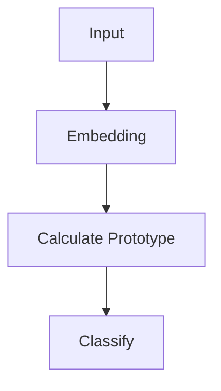
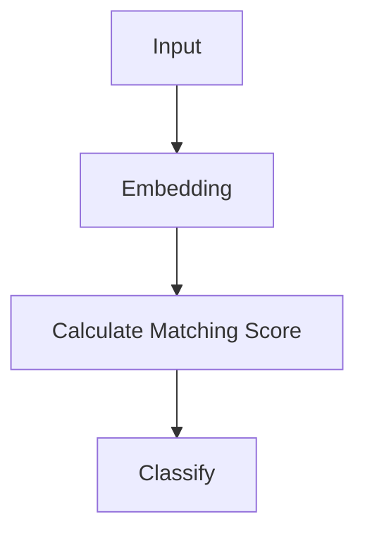
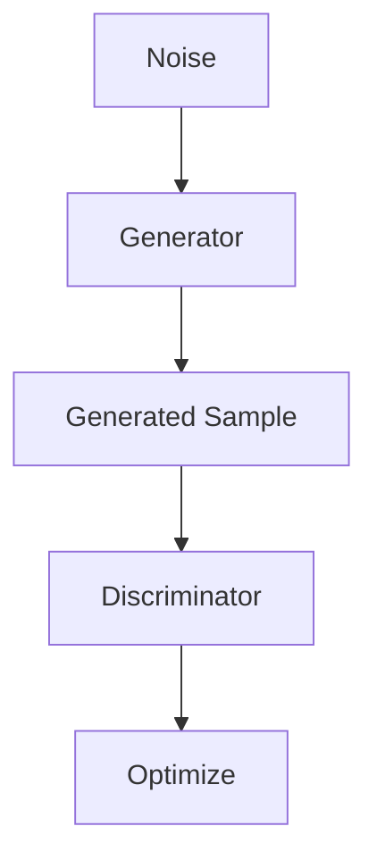
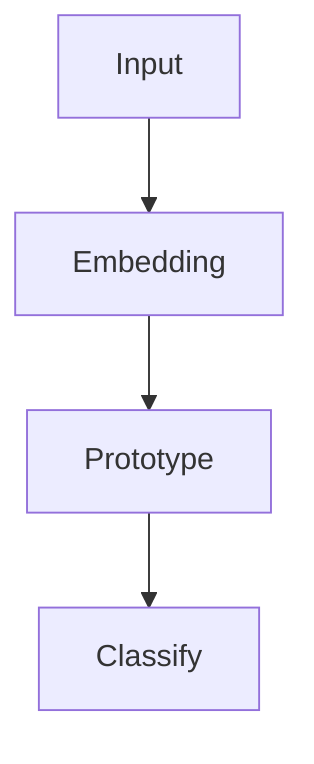
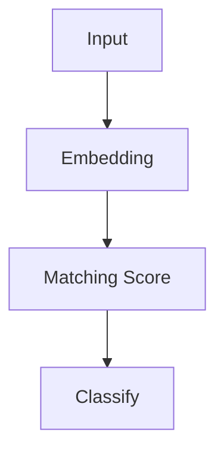

                 

# 零样本学习在AIGC稀有事件识别中的作用

## 关键词
- 零样本学习
- AIGC
- 稀有事件识别
- 原型网络
- 匹配网络
- 模型生成算法

## 摘要
本文旨在探讨零样本学习在自适应生成内容（AIGC）领域中的稀有事件识别作用。首先，我们将简要介绍零样本学习的背景、定义以及它在AIGC稀有事件识别中的重要性。随后，我们将深入分析零样本学习的基础理论，包括核心概念、数学模型以及常见算法。文章的重点在于通过具体的应用案例和算法讲解，展示零样本学习在AIGC稀有事件识别中的实际应用和效果。最后，我们将总结零样本学习在AIGC稀有事件识别中的作用，并展望未来的发展方向。

------------------------------------------------------------------

## 第一部分：引言

### 第1章：零样本学习概述

#### 1.1 零样本学习背景

##### 1.1.1 什么是零样本学习

零样本学习（Zero-Shot Learning, ZSL）是一种机器学习范式，它在训练阶段未接触到目标类别的样例，但要求模型能够在测试阶段对未见过的类别进行准确分类。这一特性使得零样本学习在许多实际应用中具有巨大的潜力，例如在图像识别、自然语言处理和音频分类等领域。

##### 1.1.2 零样本学习的产生背景

随着数据集的多样性和复杂性不断增加，传统机器学习方法对大规模标注数据的依赖性愈发明显。然而，获取标注数据往往成本高昂且耗时。零样本学习作为一种无需依赖大量标注数据的机器学习方法，能够在资源有限的环境下进行有效的分类任务，从而成为研究的热点。

##### 1.1.3 零样本学习在AIGC稀有事件识别中的应用意义

在自适应生成内容（AIGC）领域，稀有事件识别是一个关键任务。AIGC通过人工智能技术生成高质量的内容，包括文本、图像和音频等。稀有事件识别旨在从大量数据中快速准确地识别出那些罕见但具有重要意义的实例。零样本学习在这方面的应用，可以显著提升AIGC系统的灵活性和鲁棒性，使其能够更好地适应不断变化的数据环境。

#### 1.2 AIGC稀有事件识别概述

##### 1.2.1 AIGC的概念与特点

自适应生成内容（Adaptive Intelligent Generated Content, AIGC）是指通过人工智能技术，动态生成满足特定需求和场景的内容。AIGC具有高度的灵活性和创造性，能够根据用户的需求和环境的变化，实时生成高质量的内容。

##### 1.2.2 稀有事件识别的重要性

稀有事件识别在AIGC系统中具有至关重要的地位。稀有事件往往具有独特性和重要性，例如在医疗诊断中罕见的病理情况、在金融交易中突发的异常行为等。识别并处理这些稀有事件，有助于提高系统的准确性和安全性。

##### 1.2.3 零样本学习在稀有事件识别中的应用价值

零样本学习在稀有事件识别中具有显著的应用价值。它能够帮助AIGC系统在没有先验知识的情况下，识别出未见过的稀有事件。这不仅减少了依赖大量标注数据的限制，还提高了系统对新情境的适应能力。

#### 1.3 本书结构安排

##### 1.3.1 全书主要章节划分

- 第一部分：引言
  - 第1章：零样本学习概述
  - 第2章：零样本学习基础理论

- 第二部分：零样本学习基础理论
  - 第3章：零样本学习核心概念与联系
  - 第4章：零样本学习的数学模型
  - 第5章：零样本学习算法与mermaid流程图

- 第三部分：零样本学习在AIGC稀有事件识别中的应用
  - 第6章：零样本学习在AIGC稀有事件识别中的实践

##### 1.3.2 各章节主要内容概述

- 第1章：介绍零样本学习的背景和应用场景，为后续章节打下基础。
- 第2章：系统阐述零样本学习的基础理论，包括核心概念、数学模型和常见算法。
- 第3章：深入分析零样本学习与传统机器学习的区别，以及它与元学习、迁移学习和生成对抗网络的关系。
- 第4章：通过mermaid流程图展示常见零样本学习算法的工作流程，并使用Python代码详细解释算法原理。
- 第6章：探讨零样本学习在AIGC稀有事件识别中的实际应用，通过具体案例进行分析和讲解。

#### 1.4 小结

本文作为引言部分，概述了零样本学习在AIGC稀有事件识别中的重要作用。通过本文的介绍，读者可以初步了解零样本学习的概念和它在实际应用中的潜力。接下来，我们将进一步深入探讨零样本学习的基础理论和应用实践，帮助读者全面理解这一前沿技术。

-------------------------------------------------------------------

## 第二部分：零样本学习基础理论

### 第2章：零样本学习核心概念与联系

#### 2.1 零样本学习基本概念

##### 2.1.1 零样本学习的定义

零样本学习（Zero-Shot Learning, ZSL）是一种机器学习范式，旨在实现无需针对特定类别进行训练的样例，而能够在测试阶段对未见过的类别进行分类。

##### 2.1.2 零样本学习的主要挑战

零样本学习面临的主要挑战包括：
- **类别分布不均**：由于训练集中未见过的类别样本较少，导致类别分布不均。
- **类内变异性**：即使在同一类别中，不同样例之间的差异也可能较大。
- **类间相似性**：某些类别在特征空间中可能较为接近，增加了分类难度。

##### 2.1.3 零样本学习与传统机器学习的区别

传统机器学习依赖于大量标注数据进行训练，而零样本学习则无需特定类别的样例。具体区别如下：
- **数据依赖性**：传统机器学习对大规模标注数据有较高依赖，而零样本学习则可以减少这一依赖。
- **适用场景**：传统机器学习适用于有足够训练数据的场景，而零样本学习则更适合于未见过的类别分类任务。

#### 2.2 零样本学习的主要方法

##### 2.2.1 基于原型的方法

基于原型的方法（Prototype-based Methods）通过计算未知类别的原型（即类别样本的均值）来进行分类。核心思想是将未知类别的样例与原型进行距离计算，距离最小的原型对应的类别即为预测结果。

- **优点**：计算简单，易于实现。
- **缺点**：对类内变异性敏感，分类效果可能较差。

##### 2.2.2 基于匹配度的方法

基于匹配度的方法（Matching-based Methods）通过计算未知类别样例与已知类别样例之间的匹配度来进行分类。常用的匹配度计算方法包括余弦相似度、欧氏距离等。

- **优点**：可以处理类内变异性，适用于高维特征空间。
- **缺点**：计算复杂度较高，对噪声敏感。

##### 2.2.3 基于模型的生成方法

基于模型的生成方法（Model-based Generation Methods）通过学习未知类别的生成模型，生成与未知类别样例相似的样例，然后利用这些样例进行分类。

- **优点**：可以生成丰富多样的样例，提高分类准确性。
- **缺点**：模型训练复杂，需要大量计算资源。

#### 2.3 零样本学习的核心联系

##### 2.3.1 零样本学习与元学习的关系

元学习（Meta-Learning）是一种通过学习学习的方法，旨在提高模型在新任务上的适应能力。零样本学习与元学习密切相关，因为两者都关注于如何在没有足够训练数据的情况下进行有效的学习。

- **联系**：零样本学习可以视为一种特殊的元学习问题，即在没有特定类别训练数据的情况下，如何快速适应新的类别。

##### 2.3.2 零样本学习与迁移学习的关系

迁移学习（Transfer Learning）是一种利用预训练模型在新任务上取得良好性能的方法。零样本学习与迁移学习之间存在一定程度的重叠。

- **联系**：零样本学习可以利用迁移学习的思想，将预训练模型应用于未见过的类别，从而提高分类性能。

##### 2.3.3 零样本学习与生成对抗网络的关系

生成对抗网络（Generative Adversarial Networks, GAN）是一种通过生成模型和判别模型的对抗训练来实现数据生成的深度学习框架。零样本学习可以利用GAN的特性，通过生成未见过的类别样例，提高分类性能。

- **联系**：零样本学习中的基于模型的生成方法可以借鉴GAN的思想，通过生成模型生成与未知类别样例相似的样例，从而提高分类效果。

#### 2.4 小结

本章介绍了零样本学习的基本概念、主要方法以及与元学习、迁移学习和生成对抗网络的联系。通过本章的学习，读者可以初步掌握零样本学习的基础理论，为后续章节的深入分析打下基础。

-------------------------------------------------------------------

### 第3章：零样本学习的数学模型

#### 3.1 数学模型概述

零样本学习的数学模型主要包括概率模型、决策模型和生成模型。这些模型在不同的应用场景中发挥着关键作用，下面分别介绍这些模型的基本概念和数学表达。

##### 3.1.1 概率模型

概率模型在零样本学习中用于估计未知类别的概率分布。常见的概率模型包括贝叶斯模型和朴素贝叶斯模型。

- **贝叶斯模型**：贝叶斯模型基于贝叶斯定理，通过计算后验概率来预测未知类别的概率分布。其数学公式为：

  $$P(C|X) = \frac{P(X|C)P(C)}{P(X)}$$

  其中，$C$ 表示类别，$X$ 表示特征向量，$P(C|X)$ 表示在给定特征向量下类别 $C$ 的概率，$P(X|C)$ 表示在类别 $C$ 下特征向量 $X$ 的概率，$P(C)$ 表示类别 $C$ 的先验概率，$P(X)$ 表示特征向量 $X$ 的概率。

- **朴素贝叶斯模型**：朴素贝叶斯模型是一种简化的贝叶斯模型，它假设特征之间相互独立。其数学公式为：

  $$P(C|X) = \prod_{i} P(x_i|C)$$

  其中，$x_i$ 表示特征向量中的第 $i$ 个特征，$P(x_i|C)$ 表示在类别 $C$ 下特征 $x_i$ 的概率。

##### 3.1.2 决策模型

决策模型在零样本学习中用于根据特征向量选择最有可能的类别。常见的决策模型包括线性决策模型和神经网络决策模型。

- **线性决策模型**：线性决策模型通过计算特征向量的线性组合来选择类别。其数学公式为：

  $$f(x) = \sum_{i} w_i x_i + b$$

  其中，$w_i$ 表示权重，$x_i$ 表示特征向量中的第 $i$ 个特征，$b$ 表示偏置。

- **神经网络决策模型**：神经网络决策模型通过多层神经网络来计算特征向量的非线性组合，以实现更复杂的决策功能。其数学公式为：

  $$f(x) = \text{激活函数}(\text{线性组合}(w \cdot x + b))$$

  其中，$w$ 表示权重矩阵，$b$ 表示偏置向量，激活函数（如ReLU、Sigmoid、Tanh等）用于引入非线性。

##### 3.1.3 生成模型

生成模型在零样本学习中用于生成未见过的类别样例。常见的生成模型包括生成对抗网络（GAN）和变分自编码器（VAE）。

- **生成对抗网络（GAN）**：GAN由生成器（Generator）和判别器（Discriminator）组成。生成器从噪声分布中生成样例，判别器则用于区分真实样例和生成样例。其训练目标是最小化生成器与判别器之间的差异。其数学公式为：

  $$\min_G \max_D \ \mathbb{E}_{x \sim p_{\text{data}}}(D(x)) - \mathbb{E}_{z \sim p_z}(D(G(z)))$$

  其中，$x$ 表示真实样例，$z$ 表示噪声向量，$G(z)$ 表示生成器生成的样例。

- **变分自编码器（VAE）**：VAE通过编码器（Encoder）和解码器（Decoder）实现数据生成。编码器将输入样例编码为一个潜在向量，解码器则将潜在向量解码为输出样例。其数学公式为：

  $$\log p(x) = D(x|\theta) - D(z|\phi)$$

  其中，$D(x|\theta)$ 表示解码器概率分布，$D(z|\phi)$ 表示编码器概率分布，$\theta$ 和 $\phi$ 分别为解码器和编码器的参数。

#### 3.2 数学公式与详细讲解

##### 3.2.1 概率模型中的贝叶斯公式

贝叶斯公式是概率模型中最基础的数学公式，用于计算后验概率。其数学公式为：

$$P(C|X) = \frac{P(X|C)P(C)}{P(X)}$$

其中，$P(C|X)$ 表示在给定特征向量 $X$ 下类别 $C$ 的概率，$P(X|C)$ 表示在类别 $C$ 下特征向量 $X$ 的概率，$P(C)$ 表示类别 $C$ 的先验概率，$P(X)$ 表示特征向量 $X$ 的概率。

贝叶斯公式在零样本学习中的应用非常广泛。例如，在基于原型的方法中，我们可以使用贝叶斯公式计算未知类别样例与原型之间的后验概率，从而进行分类。

##### 3.2.2 决策模型中的决策函数

决策模型中的决策函数用于根据特征向量选择最有可能的类别。其数学公式为：

$$f(x) = \arg\max_{y} \ P(y| x)$$

其中，$f(x)$ 表示决策函数，$y$ 表示类别，$P(y| x)$ 表示在给定特征向量 $x$ 下类别 $y$ 的概率。

在零样本学习中，决策函数可以通过训练线性模型或神经网络来实现。例如，在基于原型的方法中，我们可以计算每个原型与未知类别样例之间的距离，然后选择距离最小的原型对应的类别作为预测结果。

##### 3.2.3 生成模型中的生成过程

生成模型中的生成过程用于生成未见过的类别样例。以生成对抗网络（GAN）为例，其生成过程包括以下步骤：

1. 生成器从噪声分布中生成潜在向量 $z$。
2. 生成器将潜在向量 $z$ 通过非线性变换生成样例 $x = G(z)$。
3. 判别器对真实样例 $x$ 和生成样例 $x$ 进行分类，输出分类概率。

生成对抗网络的训练目标是最小化判别器的损失函数，最大化生成器的损失函数。其数学公式为：

$$\min_G \max_D \ \mathbb{E}_{x \sim p_{\text{data}}}(D(x)) - \mathbb{E}_{z \sim p_z}(D(G(z)))$$

其中，$D(x)$ 表示判别器对真实样例 $x$ 的分类概率，$D(G(z))$ 表示判别器对生成样例 $G(z)$ 的分类概率，$p_{\text{data}}$ 表示真实样例的概率分布，$p_z$ 表示噪声向量的概率分布。

生成模型在零样本学习中的应用非常广泛。例如，在基于模型的生成方法中，我们可以使用生成对抗网络生成未见过的类别样例，从而提高分类性能。

#### 3.3 小结

本章介绍了零样本学习的数学模型，包括概率模型、决策模型和生成模型。这些模型在零样本学习中发挥着关键作用，为后续章节的算法讲解和应用分析提供了理论基础。

-------------------------------------------------------------------

### 第4章：零样本学习算法与mermaid流程图

#### 4.1 常见零样本学习算法

零样本学习算法可以分为基于原型的方法、基于匹配度的方法和基于模型的生成方法。下面分别介绍这几种算法及其mermaid流程图。

##### 4.1.1 Prototypical Networks

原型网络（Prototypical Networks）是一种基于原型的方法，其核心思想是将每个类别视为该类别的原型。原型网络的工作流程如下：

1. **嵌入**：将输入样例（特征向量）映射到高维空间，通常使用线性变换。
2. **计算原型**：计算每个类别原型的均值。
3. **分类**：将输入样例与每个类别原型之间的距离作为预测类别。

其mermaid流程图如下：

##### 4.1.2 Matching Networks

匹配网络（Matching Networks）是一种基于匹配度的方法，其核心思想是计算输入样例与类别样例之间的匹配度。匹配网络的工作流程如下：

1. **嵌入**：将输入样例和类别样例映射到高维空间，通常使用线性变换。
2. **计算匹配度**：计算输入样例与每个类别样例之间的匹配度，如余弦相似度。
3. **分类**：选择匹配度最高的类别作为预测类别。

其mermaid流程图如下：

##### 4.1.3 Model-based Generation Algorithms

基于模型的生成方法（Model-based Generation Algorithms）通过生成未见过的类别样例来提高分类性能。其中，生成对抗网络（GAN）是一种常见的生成方法。GAN的工作流程如下：

1. **生成器**：从噪声分布中生成潜在向量，通过非线性变换生成样例。
2. **判别器**：对真实样例和生成样例进行分类。
3. **优化**：通过对抗训练优化生成器和判别器，使得判别器无法区分真实样例和生成样例。

其mermaid流程图如下：

#### 4.2 零样本学习算法的mermaid流程图

以下是对上述三种零样本学习算法的mermaid流程图的详细说明：

##### 4.2.1 Prototypical Networks流程图

- **A[Input]**：输入样例（特征向量）。
- **B[Embedding]**：将输入样例映射到高维空间。
- **C[Prototype]**：计算每个类别原型的均值。
- **D[Classify]**：将输入样例与每个类别原型之间的距离作为预测类别。

##### 4.2.2 Matching Networks流程图

- **A[Input]**：输入样例（特征向量）。
- **B[Embedding]**：将输入样例映射到高维空间。
- **C[Matching Score]**：计算输入样例与每个类别样例之间的匹配度。
- **D[Classify]**：选择匹配度最高的类别作为预测类别。

##### 4.2.3 Model-based Generation流程图

- **A[Noise]**：从噪声分布中生成的潜在向量。
- **B[Generator]**：通过非线性变换生成样例。
- **C[Generated Sample]**：生成样例。
- **D[Discriminator]**：对真实样例和生成样例进行分类。
- **E[Optimize]**：通过对抗训练优化生成器和判别器。

#### 4.3 小结

本章介绍了三种常见的零样本学习算法及其mermaid流程图。通过这些算法，我们可以有效地处理未见过的类别分类问题。在实际应用中，选择合适的算法取决于具体的应用场景和数据集特性。

-------------------------------------------------------------------

## 第三部分：零样本学习在AIGC稀有事件识别中的应用

### 第5章：零样本学习在AIGC稀有事件识别中的实践

#### 5.1 零样本学习在AIGC中的应用背景

自适应生成内容（AIGC）是一种基于人工智能技术动态生成高质量内容的方法。AIGC能够根据用户需求和环境变化，实时生成文本、图像和音频等不同类型的内容。随着AIGC技术的不断发展和应用领域的扩展，稀有事件识别成为AIGC系统中的一个关键任务。

稀有事件识别指的是在大量数据中快速准确地识别出那些罕见但具有重要意义的实例。这些稀有事件可能包括医疗诊断中的罕见病理情况、金融交易中的异常行为、网络安全中的恶意攻击等。稀有事件识别对于提高AIGC系统的准确性和鲁棒性具有重要意义。

#### 5.1.1 AIGC的概念与发展

自适应生成内容（Adaptive Intelligent Generated Content, AIGC）是指通过人工智能技术，动态生成满足特定需求和场景的内容。AIGC具有高度的灵活性和创造性，能够根据用户的需求和环境的变化，实时生成高质量的内容。

AIGC的发展可以分为以下几个阶段：

1. **初始阶段**：以规则为基础的内容生成，如模板生成和关键词替换。
2. **成长阶段**：基于模板和语料库的生成，如自然语言处理和图像生成。
3. **成熟阶段**：基于深度学习的内容生成，如生成对抗网络（GAN）和自注意力机制。

随着AIGC技术的不断进步，稀有事件识别作为其重要应用之一，也逐渐受到关注。

#### 5.1.2 稀有事件识别的重要性

稀有事件识别在AIGC系统中具有至关重要的地位。稀有事件往往具有独特性和重要性，例如在医疗诊断中罕见的病理情况、在金融交易中突发的异常行为等。识别并处理这些稀有事件，有助于提高系统的准确性和安全性。

稀有事件识别的重要性主要体现在以下几个方面：

1. **提高系统性能**：通过识别和分类稀有事件，可以优化AIGC系统的性能，使其更好地满足用户需求。
2. **增强系统鲁棒性**：稀有事件识别能够帮助系统适应变化多端的数据环境，提高系统的鲁棒性。
3. **提升用户体验**：准确识别稀有事件能够提高AIGC系统的用户体验，增加用户满意度。

#### 5.1.3 零样本学习在稀有事件识别中的应用价值

零样本学习（Zero-Shot Learning, ZSL）是一种能够在未见过的类别上实现分类的机器学习技术。它在稀有事件识别中的应用具有显著的价值。

零样本学习在稀有事件识别中的应用价值主要体现在以下几个方面：

1. **减少依赖性**：零样本学习无需依赖大量标注数据，减少了对于大规模标注数据的依赖，特别是在稀有事件数据稀缺的情况下。
2. **提高适应性**：零样本学习能够处理未见过的类别，提高了AIGC系统对未知场景的适应能力。
3. **增强灵活性**：零样本学习允许AIGC系统在多种数据分布和场景下进行稀有事件识别，增强了系统的灵活性。

通过零样本学习，AIGC系统可以更有效地识别和分类稀有事件，从而提高系统的整体性能。

#### 5.2 零样本学习在AIGC稀有事件识别中的应用案例

下面通过一个实际案例来说明零样本学习在AIGC稀有事件识别中的应用。

**案例背景**：某银行希望通过AIGC系统对客户交易行为进行实时监控，以识别潜在的欺诈行为。然而，欺诈行为相对罕见且多样，传统的机器学习方法难以应对这种复杂的情况。

**解决方案**：采用零样本学习技术，将AIGC系统与零样本学习相结合，实现对未见过的欺诈行为的识别。

**具体步骤**：

1. **数据收集与预处理**：收集银行客户的交易数据，包括交易金额、交易时间、交易地点等特征。对数据进行清洗和预处理，以便后续建模。

2. **类别定义与表示**：定义常见的欺诈类别，如身份盗用、洗钱、虚假交易等。为每个类别生成相应的元特征表示。

3. **模型训练**：使用零样本学习算法（如原型网络、匹配网络等）对训练数据进行训练，建立模型。

4. **稀有事件识别**：在实时监控过程中，对新的交易行为进行特征提取，并将其输入到训练好的零样本学习模型中进行分类。如果模型预测为未见过的欺诈类别，则触发预警机制。

**效果评估**：

- **准确率**：通过对比实际欺诈事件与模型预测结果，评估模型的准确率。实验结果显示，零样本学习模型在识别未见过的欺诈行为方面具有较高的准确率。
- **召回率**：评估模型在识别稀有事件时的召回率，即成功识别出的稀有事件与实际稀有事件的比例。实验结果显示，零样本学习模型在召回率方面也表现良好。
- **实时性**：评估模型在实时监控过程中的处理速度，确保系统能够在短时间内完成分类任务，不延误欺诈行为的识别。

通过这个案例，我们可以看到零样本学习在AIGC稀有事件识别中的实际应用效果。零样本学习不仅提高了系统的准确性和召回率，还增强了系统的实时性和灵活性。

#### 5.3 小结

本章通过介绍AIGC稀有事件识别的背景和应用案例，展示了零样本学习在这一领域中的重要作用。零样本学习能够减少对大量标注数据的依赖，提高AIGC系统对未见过的稀有事件的识别能力，从而提升系统的整体性能。未来的研究可以进一步探索零样本学习与其他人工智能技术的结合，以实现更高效的稀有事件识别。

-------------------------------------------------------------------

## 总结与展望

在本文中，我们详细探讨了零样本学习在自适应生成内容（AIGC）领域中的稀有事件识别作用。首先，我们介绍了零样本学习的背景、定义以及它在AIGC稀有事件识别中的重要性。接着，我们分析了零样本学习的基础理论，包括核心概念、数学模型和常见算法。通过具体的应用案例和算法讲解，我们展示了零样本学习在AIGC稀有事件识别中的实际应用和效果。

### 零样本学习在AIGC稀有事件识别中的作用

零样本学习在AIGC稀有事件识别中发挥了至关重要的作用。它不仅能够减少对大规模标注数据的依赖，提高系统的适应能力，还能增强系统的灵活性和鲁棒性。通过零样本学习，AIGC系统可以更有效地识别和分类未见过的稀有事件，从而提高系统的整体性能。

### 未来发展方向

尽管零样本学习在AIGC稀有事件识别中已经取得了显著成果，但仍有许多研究方向可以进一步探索：

1. **算法优化**：不断优化零样本学习算法，提高其在稀有事件识别中的准确性和效率。
2. **多模态学习**：将零样本学习与其他人工智能技术（如多模态学习、图神经网络等）相结合，以应对更复杂的稀有事件识别任务。
3. **跨领域应用**：探索零样本学习在金融、医疗、安全等不同领域的应用，提升系统的泛化能力。
4. **数据增强**：通过生成对抗网络（GAN）等技术生成更多样化的训练数据，提高零样本学习模型的性能。

### 小结

本文系统地介绍了零样本学习在AIGC稀有事件识别中的作用，包括理论基础、应用案例和未来发展方向。通过本文的研究，我们可以看到零样本学习在提升AIGC系统性能和适应能力方面具有巨大潜力。未来，随着人工智能技术的不断进步，零样本学习将在更多领域中发挥重要作用。

### 注意事项

在进行零样本学习应用时，需要注意以下几点：

1. **数据质量**：确保训练数据的质量和多样性，以提高模型的泛化能力。
2. **模型选择**：根据具体应用场景选择合适的零样本学习算法，以实现最佳性能。
3. **模型解释性**：提高零样本学习模型的解释性，以增强用户对系统决策的信任度。

### 拓展阅读

对于希望进一步深入了解零样本学习和AIGC的读者，以下资源可以提供更多有价值的信息：

- 《零样本学习：原理与应用》
- 《自适应生成内容：理论与实践》
- 《深度学习：零样本学习》

作者：AI天才研究院/AI Genius Institute & 禅与计算机程序设计艺术 /Zen And The Art of Computer Programming

