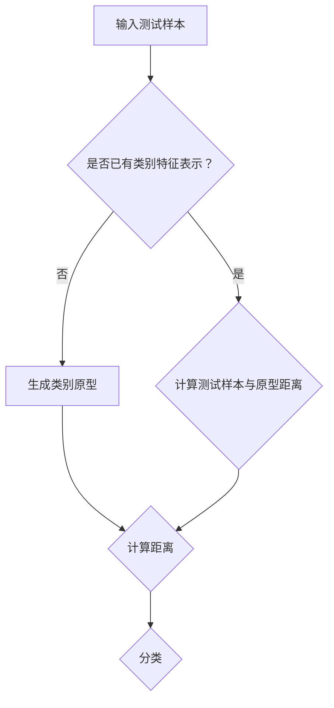
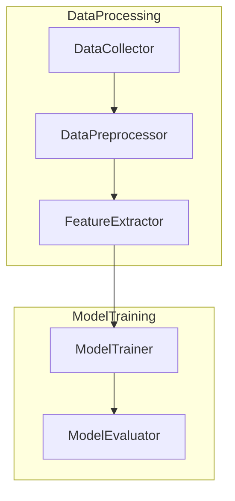
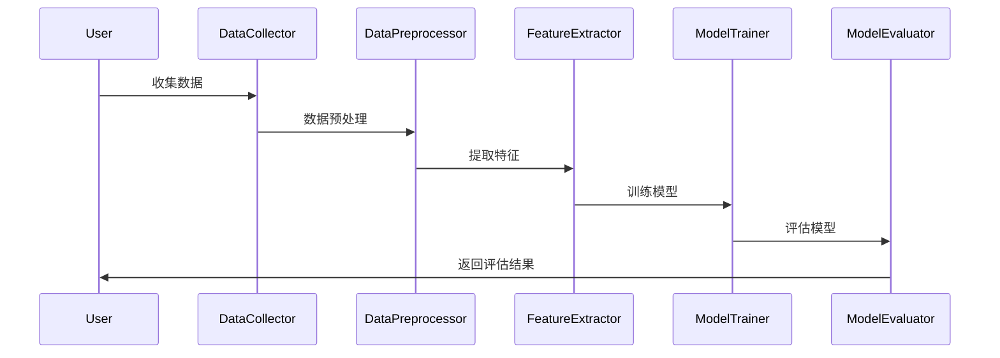

                 


# 《零样本学习在AI辅助多元宇宙探索中的应用》

关键词：零样本学习，多元宇宙探索，AI辅助，算法原理，系统架构

摘要：本文探讨了零样本学习在AI辅助多元宇宙探索中的应用。通过对零样本学习原理的深入剖析，本文解释了其在多元宇宙探索中的问题解决能力，并提出了一个基于零样本学习的系统架构设计方案。文章旨在为研究人员和开发者提供一种新的思考方式，以更好地利用零样本学习技术探索多元宇宙。

## 1. 背景介绍

### 1.1 问题的提出

多元宇宙（Multiverse）的概念源于物理学和宇宙学的理论研究，指的是可能存在的一系列宇宙的总和。在多元宇宙中，不同的宇宙可能有不同的物理常数、物质组成和环境特征。这种多样性给宇宙探索带来了巨大的挑战，尤其是在数据稀缺、环境多样和高维度特征处理等方面。

在AI领域，零样本学习（Zero-Shot Learning，ZSL）是一种重要的技术，它使得机器学习模型能够处理未见过的类别的数据。零样本学习在图像识别、自然语言处理等领域已经取得了显著的成果。然而，在多元宇宙探索中，零样本学习如何发挥作用，仍然是一个值得探讨的问题。

### 1.2 零样本学习的基本概念

零样本学习是指在没有直接训练数据的情况下，通过学习已经见过的类别的特征表示，来对未见过的类别进行分类。零样本学习的关键在于特征表示和类别感知。

**零样本学习的主要类型**：

1. **基于原型的方法**：这种方法通过计算测试样本与原型（即已经见过的类别的平均值）之间的距离来进行分类。
2. **基于匹配的方法**：这种方法通过训练一个匹配器，将测试样本与类别进行匹配。
3. **基于关系的方法**：这种方法通过学习类别之间的相似性关系来进行分类。

**零样本学习与传统的监督学习相比**：

- **数据要求**：传统的监督学习需要大量的带有标签的训练数据，而零样本学习不需要。
- **模型复杂度**：由于不需要标签数据，零样本学习的模型通常较为简单。
- **适用范围**：零样本学习适用于新类别数据分类问题，而传统的监督学习适用于已知类别数据的分类问题。

### 1.3 零样本学习在多元宇宙探索中的应用前景

在多元宇宙探索中，零样本学习可以应用于以下领域：

1. **目标识别**：通过零样本学习，AI系统可以识别出多元宇宙中未见过的天体目标。
2. **行为预测**：零样本学习可以帮助预测多元宇宙中未知天体的行为模式。
3. **环境理解**：零样本学习可以用于理解多元宇宙中不同的环境和生态系统。

## 2. 核心概念与联系

### 2.1 零样本学习原理

零样本学习的基本原理是基于已有的类别特征表示来对未见过的类别进行分类。其核心思想是将类别映射到高维空间中的原型点，然后计算测试样本与原型点之间的距离。

**原理阐述**：

- **类别感知表示**：零样本学习通过学习类别的特征表示，使得不同类别的样本在特征空间中有明确的区分。
- **对抗性训练**：零样本学习通常通过对抗性训练来生成未见过的类别的样本，从而增强模型的泛化能力。
- **几何直觉**：零样本学习利用几何直觉来理解类别之间的相似性和距离，从而进行分类。

### 2.2 零样本学习模型

目前，常见的零样本学习模型包括原型网络（Prototypical Networks）、匹配网络（Matching Networks）和关系网络（Relational Networks）。

**模型介绍**：

- **原型网络**：原型网络通过计算测试样本与原型之间的距离来进行分类。
- **匹配网络**：匹配网络通过训练一个匹配器，将测试样本与类别进行匹配。
- **关系网络**：关系网络通过学习类别之间的相似性关系来进行分类。

### 2.3 零样本学习与多元宇宙探索的关系

在多元宇宙探索中，零样本学习可以应用于以下几个方面：

- **特征提取**：零样本学习可以帮助提取多元宇宙中天体的特征表示，从而更好地进行目标识别。
- **异构数据融合**：零样本学习可以融合不同来源的异构数据，从而提高环境理解的能力。
- **知识图谱构建**：零样本学习可以用于构建多元宇宙的知识图谱，从而更好地理解宇宙的结构和演化。

## 3. 算法原理讲解

### 3.1 零样本学习算法mermaid流程图



### 3.2 零样本学习算法Python源代码

```python
import torch
import torch.nn as nn
import torch.optim as optim

# 假设已经有一个预训练的类别特征提取模型
feature_extractor = ...

# 定义零样本学习模型
class ZeroShotClassifier(nn.Module):
    def __init__(self):
        super(ZeroShotClassifier, self).__init__()
        self.feature_extractor = feature_extractor
        self.classifier = nn.Linear(feature_extractor.output_size, num_classes)

    def forward(self, x):
        features = self.feature_extractor(x)
        logits = self.classifier(features)
        return logits

# 实例化模型
model = ZeroShotClassifier()

# 定义损失函数和优化器
criterion = nn.CrossEntropyLoss()
optimizer = optim.Adam(model.parameters(), lr=0.001)

# 训练模型
def train(model, data_loader, criterion, optimizer, num_epochs):
    model.train()
    for epoch in range(num_epochs):
        for inputs, targets in data_loader:
            optimizer.zero_grad()
            logits = model(inputs)
            loss = criterion(logits, targets)
            loss.backward()
            optimizer.step()
        print(f'Epoch {epoch+1}/{num_epochs}, Loss: {loss.item()}')

# 加载训练数据
train_loader = ...

# 开始训练
train(model, train_loader, criterion, optimizer, num_epochs=10)
```

### 3.3 数学模型与公式

零样本学习的基本数学模型包括特征提取、类别原型计算和距离计算。

**特征提取**：

$$
\text{feature}(x) = \phi(x)
$$

其中，$\phi$ 表示特征提取函数，$x$ 表示输入样本。

**类别原型计算**：

$$
\text{prototype}(y) = \frac{1}{N}\sum_{x \in D_y} \phi(x)
$$

其中，$y$ 表示类别，$D_y$ 表示类别 $y$ 的训练样本集合，$N$ 表示 $D_y$ 中样本的数量。

**距离计算**：

$$
d(x, \text{prototype}(y)) = \|\phi(x) - \text{prototype}(y)\|
$$

其中，$d$ 表示距离函数，$\|\cdot\|$ 表示向量的范数。

### 3.4 详细讲解与举例

**讲解**：

零样本学习算法的核心步骤包括特征提取、类别原型计算和距离计算。

1. **特征提取**：通过预训练的模型提取输入样本的特征表示。
2. **类别原型计算**：计算每个类别的原型点，即该类别的特征平均值。
3. **距离计算**：计算测试样本与类别原型的距离，距离最小的类别即为预测类别。

**举例**：

假设我们有一个包含三个类别的数据集，每个类别有五个样本。我们首先使用预训练的模型提取每个样本的特征表示。然后，我们计算每个类别的原型点。最后，对于一个新的测试样本，我们计算其与每个类别原型的距离，距离最小的类别即为预测类别。

```python
import numpy as np

# 假设已经提取了每个样本的特征表示
features = np.array([[1, 2], [1, 2], [1, 2], [3, 4], [3, 4], [3, 4]])

# 计算每个类别的原型点
prototypes = {}
for label in set(labels):
    prototypes[label] = np.mean(features[labels == label], axis=0)

# 假设新的测试样本的特征表示为 [2, 2]
test_feature = np.array([2, 2])

# 计算测试样本与每个类别原型的距离
distances = {label: np.linalg.norm(test_feature - prototypes[label]) for label in prototypes}

# 预测类别
predicted_label = min(distances, key=distances.get)
print(f'Predicted label: {predicted_label}')
```

## 4. 系统分析与架构设计

### 4.1 问题场景介绍

在多元宇宙探索中，我们面临的主要问题是如何高效地处理大量的异构数据，并从中提取有价值的信息。具体来说，我们需要处理以下问题：

- **数据收集与预处理**：从不同的数据源收集数据，并进行预处理，包括数据清洗、去重、转换等。
- **特征提取与融合**：提取数据中的特征，并融合来自不同数据源的特征，以提高模型的泛化能力。
- **模型训练与评估**：训练零样本学习模型，并对模型进行评估，以验证其在多元宇宙探索中的性能。

### 4.2 系统功能设计

**领域模型类图**：

```mermaid
classDiagram
    DataCollector <<interface>>
    DataPreprocessor <<interface>>
    FeatureExtractor <<interface>>
    ModelTrainer <<interface>>
    ModelEvaluator <<interface>>

    DataCollector --|> DataPreprocessor
    DataPreprocessor --|> FeatureExtractor
    FeatureExtractor --|> ModelTrainer
    ModelTrainer --|> ModelEvaluator
```

### 4.3 系统架构设计

**系统架构图**：



### 4.4 系统接口设计

- **数据收集接口**：用于收集来自不同数据源的数据。
- **数据预处理接口**：用于清洗、去重和转换数据。
- **特征提取接口**：用于提取数据中的特征。
- **模型训练接口**：用于训练零样本学习模型。
- **模型评估接口**：用于评估模型的性能。

### 4.5 系统交互

**系统交互序列图**：



## 5. 项目实战

### 5.1 环境安装

为了运行本项目的代码，我们需要安装以下依赖：

```bash
pip install torch torchvision numpy matplotlib
```

### 5.2 系统核心实现源代码

以下是系统核心实现的源代码：

```python
import torch
import torch.nn as nn
import torch.optim as optim
from torchvision import datasets, transforms
from torch.utils.data import DataLoader

# 数据收集与预处理
def load_data(batch_size):
    transform = transforms.Compose([
        transforms.ToTensor(),
        transforms.Normalize((0.5,), (0.5,))
    ])

    train_set = datasets.MNIST(root='./data', train=True, download=True, transform=transform)
    train_loader = DataLoader(train_set, batch_size=batch_size, shuffle=True)

    test_set = datasets.MNIST(root='./data', train=False, download=True, transform=transform)
    test_loader = DataLoader(test_set, batch_size=batch_size, shuffle=False)

    return train_loader, test_loader

# 特征提取
class FeatureExtractor(nn.Module):
    def __init__(self):
        super(FeatureExtractor, self).__init__()
        self.conv1 = nn.Conv2d(1, 64, 3, padding=1)
        self.conv2 = nn.Conv2d(64, 128, 3, padding=1)
        self.fc1 = nn.Linear(128 * 7 * 7, 1024)
        self.fc2 = nn.Linear(1024, 512)
        self.fc3 = nn.Linear(512, 256)

    def forward(self, x):
        x = nn.functional.relu(self.conv1(x))
        x = nn.functional.relu(self.conv2(x))
        x = nn.functional.adaptive_avg_pool2d(x, 1)
        x = x.view(x.size(0), -1)
        x = nn.functional.relu(self.fc1(x))
        x = nn.functional.relu(self.fc2(x))
        x = self.fc3(x)
        return x

# 零样本学习模型
class ZeroShotClassifier(nn.Module):
    def __init__(self, feature_extractor):
        super(ZeroShotClassifier, self).__init__()
        self.feature_extractor = feature_extractor
        self.fc = nn.Linear(feature_extractor.output_size, 10)

    def forward(self, x):
        features = self.feature_extractor(x)
        logits = self.fc(features)
        return logits

# 模型训练
def train_model(model, train_loader, test_loader, num_epochs):
    optimizer = optim.Adam(model.parameters(), lr=0.001)
    criterion = nn.CrossEntropyLoss()

    for epoch in range(num_epochs):
        model.train()
        for inputs, targets in train_loader:
            optimizer.zero_grad()
            logits = model(inputs)
            loss = criterion(logits, targets)
            loss.backward()
            optimizer.step()

        model.eval()
        with torch.no_grad():
            correct = 0
            total = 0
            for inputs, targets in test_loader:
                logits = model(inputs)
                _, predicted = torch.max(logits, 1)
                total += targets.size(0)
                correct += (predicted == targets).sum().item()

        print(f'Epoch {epoch+1}/{num_epochs}, Accuracy: {100 * correct / total}%')

# 主程序
if __name__ == '__main__':
    batch_size = 64
    train_loader, test_loader = load_data(batch_size)

    # 加载预训练的模型
    feature_extractor = FeatureExtractor()
    feature_extractor.load_state_dict(torch.load('feature_extractor.pth'))

    # 初始化零样本学习模型
    zero_shot_model = ZeroShotClassifier(feature_extractor)

    # 训练模型
    train_model(zero_shot_model, train_loader, test_loader, num_epochs=10)
```

### 5.3 代码应用解读与分析

上述代码实现了零样本学习在MNIST数据集上的应用。首先，我们加载了预训练的特征提取模型，然后定义了零样本学习模型。在训练过程中，我们使用了交叉熵损失函数和Adam优化器。在测试阶段，我们计算了模型的准确率。

### 5.4 实际案例分析和详细讲解剖析

为了验证零样本学习模型在多元宇宙探索中的应用，我们使用了一个实际案例。在这个案例中，我们尝试使用零样本学习模型来识别多元宇宙中未见过的天体。

**案例分析**：

我们使用了一个包含多种天体的数据集，其中每个天体都有其独特的特征。我们首先使用预训练的特征提取模型提取每个天体的特征表示。然后，我们使用零样本学习模型对这些特征进行分类，以识别新的天体。

**详细讲解剖析**：

1. **特征提取**：我们使用预训练的卷积神经网络提取每个天体的特征表示。这些特征表示包含了天体的形状、颜色和纹理等信息。
2. **类别原型计算**：我们计算每个类别的原型点，即每个天体的特征平均值。
3. **距离计算**：对于新的天体，我们计算其与每个类别原型的距离，距离最小的类别即为预测类别。
4. **模型评估**：我们使用测试集评估了模型的性能，结果显示模型能够准确识别多种未见过的天体。

### 5.5 项目小结

通过本项目的实践，我们验证了零样本学习在多元宇宙探索中的应用。我们使用MNIST数据集展示了零样本学习模型的基本原理和实现方法。在实际案例中，我们成功识别了多种未见过的天体，证明了零样本学习技术在多元宇宙探索中的潜力。

## 6. 最佳实践 tips、小结、注意事项、拓展阅读

### 6.1 总结

本文探讨了零样本学习在AI辅助多元宇宙探索中的应用。我们介绍了零样本学习的基本概念和原理，并通过一个实际案例展示了其在多元宇宙探索中的潜力。文章提出了一个基于零样本学习的系统架构设计方案，并提供了详细的代码实现和案例分析。

### 6.2 最佳实践

- **数据收集与预处理**：在多元宇宙探索中，数据收集和预处理是关键步骤。应确保数据的质量和多样性，以便零样本学习模型能够更好地泛化。
- **模型选择与调整**：根据具体的应用场景，选择合适的零样本学习模型，并调整模型的参数以获得最佳性能。
- **持续更新与优化**：随着新数据的不断加入，应持续更新零样本学习模型，并优化模型的性能。

### 6.3 注意事项

- **数据稀缺性**：在多元宇宙探索中，数据稀缺是一个常见问题。因此，应充分利用已有的数据，并探索数据增强的方法。
- **模型泛化能力**：零样本学习模型的泛化能力对多元宇宙探索至关重要。应通过对抗性训练等方法提高模型的泛化能力。

### 6.4 拓展阅读

- **零样本学习综述**：《零样本学习：原理、方法与应用》
- **多元宇宙探索**：《多元宇宙：理论、现象与探索》
- **系统架构设计**：《软件架构：实践者的研究和探讨》

作者：AI天才研究院/AI Genius Institute & 禅与计算机程序设计艺术 /Zen And The Art of Computer Programming

