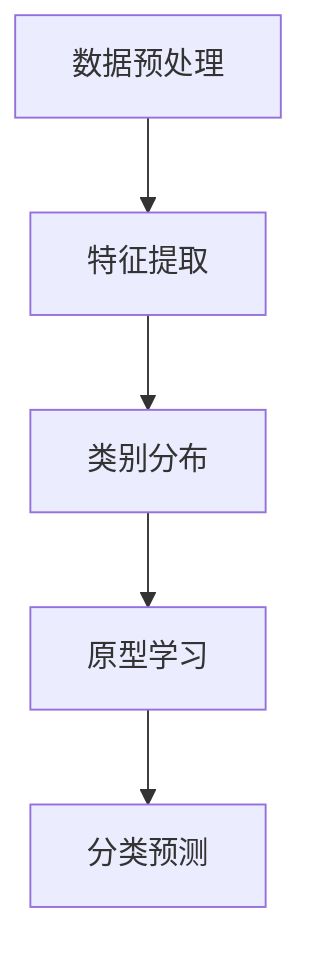
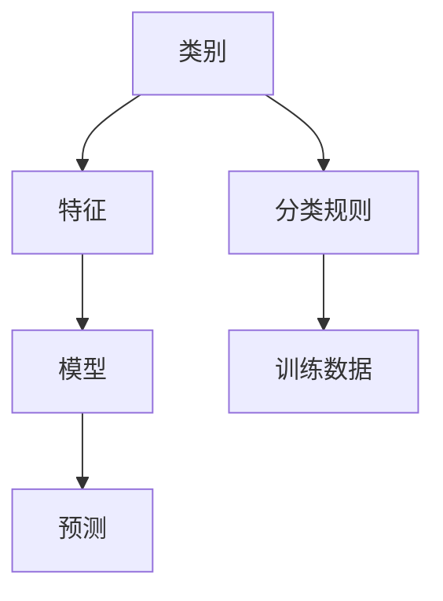
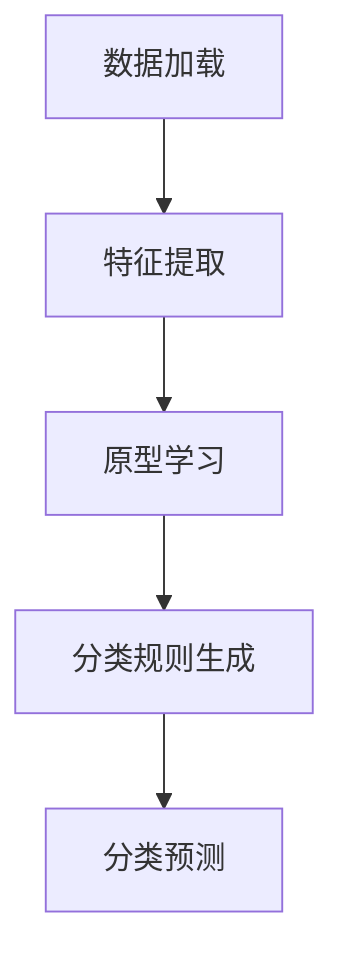
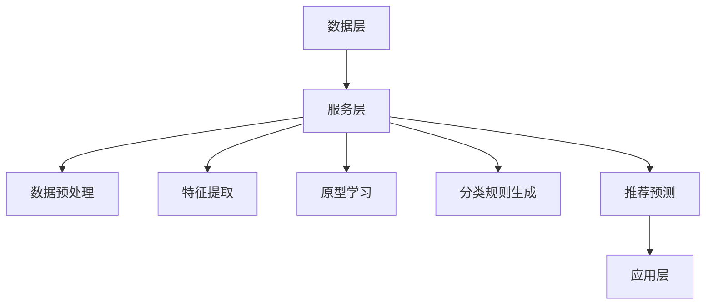
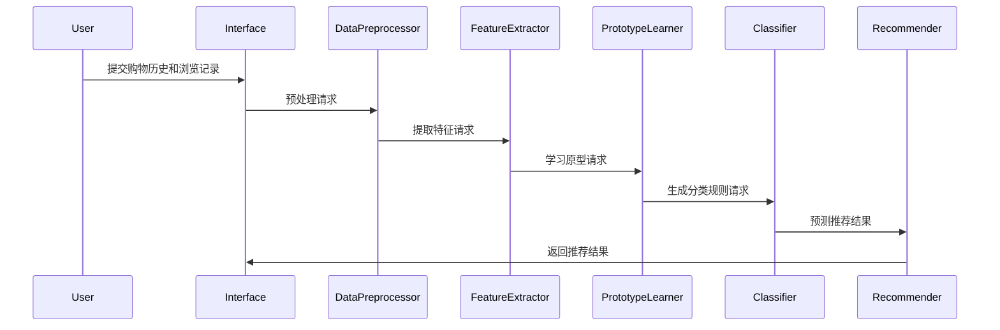

                 

# 零样本学习如何改变AI模型训练范式

> 关键词：零样本学习，AI模型训练，机器学习，算法，模型优化

> 摘要：本文旨在深入探讨零样本学习技术，分析其在AI模型训练范式中的变革性作用。通过对零样本学习的背景、定义、分类方法及其算法原理的详细讲解，并结合Python源代码实例分析，展示零样本学习如何应对传统机器学习模型的局限性，实现更高效、灵活的AI模型训练。

## 目录大纲

### 第一部分：零样本学习基础

1. 第1章：零样本学习概述
   1.1 零样本学习的背景与重要性
   1.2 零样本学习的定义与基本概念
   1.3 零样本学习的分类方法

2. 第2章：核心概念与联系
   2.1 零样本学习的关键概念
   2.2 ER实体关系图架构

3. 第3章：零样本学习算法原理讲解
   3.1 算法Mermaid流程图
   3.2 Python源代码详细阐述

4. 第4章：数学模型和数学公式
   4.1 零样本学习中的数学模型
   4.2 Python代码示例

5. 第5章：系统分析与架构设计方案
   5.1 问题场景介绍
   5.2 项目介绍
   5.3 系统功能设计
   5.4 系统架构设计
   5.5 系统接口设计和系统交互

6. 第6章：项目实战
   6.1 环境安装
   6.2 系统核心实现源代码
   6.3 代码应用解读与分析
   6.4 实际案例分析和详细讲解剖析
   6.5 项目小结

7. 第7章：最佳实践 Tips、小结、注意事项、拓展阅读

## 第一部分：零样本学习基础

### 第1章：零样本学习概述

#### 1.1 零样本学习的背景与重要性

在现代人工智能领域，机器学习模型的训练与应用已经取得了显著的成果。然而，传统的机器学习模型在训练过程中往往需要大量的标注数据进行监督学习。这种依赖大量标注数据的训练方式在实际应用中存在诸多局限性：

1. 数据标注成本高昂：标注数据需要人工进行，耗时耗力，成本高昂。
2. 数据获取难度大：某些领域的数据难以获取，或者获取成本极高。
3. 数据分布偏差：依赖标注数据训练的模型可能在数据分布上存在偏差，影响模型的泛化能力。

为了解决这些局限性，零样本学习（Zero-Shot Learning, ZSL）应运而生。零样本学习旨在实现模型在没有标注数据的情况下，对未见过的类进行分类和预测。这种能力使得零样本学习在许多实际应用场景中具有重要的研究价值和商业潜力。

#### 1.2 零样本学习的定义与基本概念

零样本学习可以定义为一种机器学习范式，其中模型在训练时并没有直接接触过未见过的类别的数据。具体来说，零样本学习包含以下几个基本概念：

1. **类标签（Class Labels）**：在传统的机器学习任务中，每个类别都有一个标签。然而，在零样本学习中，训练集中的数据没有标签。
2. **元数据（Metadata）**：为了指导模型进行未见过的类别的分类，零样本学习利用元数据来描述这些类别的特征。这些元数据可以是词袋表示、视觉特征、概念层次等。
3. **元学习（Meta-Learning）**：零样本学习常常涉及到元学习的技术，通过学习通用特征表示，使得模型能够适应未见过的类别。

#### 1.3 零样本学习的分类方法

零样本学习可以根据不同的方法进行分类，常见的分类方法包括：

1. **基于原型的方法（Prototype-based Methods）**：这种方法通过学习一个原型集合，用于对未见过的类别进行分类。
2. **基于关系的方法（Relational-based Methods）**：这种方法通过建立类别之间的关系来进行分类。
3. **基于元学习的方法（Meta-Learning-based Methods）**：这种方法通过元学习算法，如MAML（Model-Agnostic Meta-Learning），来训练模型，使得模型能够在未见过的类别上快速适应。

### 第2章：核心概念与联系

#### 2.1 零样本学习的关键概念

在零样本学习中，有以下几个关键概念：

1. **类别分布（Class Distribution）**：类别分布描述了训练集中各个类别的分布情况。
2. **特征表示（Feature Representation）**：特征表示是指如何将数据转换为模型可以处理的特征向量。
3. **类间距离（Class Similarity）**：类间距离用于衡量不同类别之间的相似性。

为了更直观地理解这些概念，我们可以使用Mermaid流程图来展示零样本学习的基本流程。



#### 2.2 ER实体关系图架构

在零样本学习中，ER实体关系图是一种常用的数据建模方法。ER图通过实体（Entity）和关系（Relationship）来描述数据之间的关系。在零样本学习中，实体可以是类别、特征、模型等，关系可以是分类、相似性、依赖等。

下面是一个ER实体关系图的示例，用于描述零样本学习中的关键实体和关系。



### 第3章：零样本学习算法原理讲解

#### 3.1 算法Mermaid流程图

零样本学习的算法可以通过Mermaid流程图来展示其基本流程。以下是一个零样本学习算法的基本流程图：



#### 3.2 Python源代码详细阐述

在零样本学习中，算法的实现通常涉及多个步骤，包括特征提取、原型学习、分类规则生成和分类预测。以下是一个使用Python实现的零样本学习算法的示例。

```python
# 导入必要的库
import numpy as np
from sklearn.neighbors import NearestCentroid

# 特征提取
def extract_features(data):
    # 这里使用简单的词袋模型作为特征提取方法
    return np.array([data.count_words() for data in data])

# 原型学习
def prototype_learning(features):
    # 使用K均值聚类来学习原型
    prototypes = KMeans(n_clusters=len(features)).fit(features).cluster_centers_
    return prototypes

# 分类规则生成
def generate_classification_rule(prototypes, labels):
    # 使用最近邻分类器来生成分类规则
    classifier = NearestCentroid(prototypes)
    classifier.fit(features, labels)
    return classifier

# 分类预测
def predict(classifier, new_data):
    # 使用训练好的分类器进行预测
    features = extract_features(new_data)
    return classifier.predict([features])
```

#### 3.2.1 算法原理的数学模型

零样本学习算法的数学模型主要包括特征提取、原型学习和分类规则生成三个部分。

1. **特征提取**：特征提取是将原始数据转换为模型可以处理的特征向量。通常使用词袋模型、TF-IDF等方法进行特征提取。

2. **原型学习**：原型学习是指通过聚类方法，如K均值聚类，来学习数据中的原型。原型可以看作是每个类别的代表性特征。

3. **分类规则生成**：分类规则生成是指使用原型来构建分类器，如最近邻分类器。分类器通过比较新数据与原型的距离来预测新数据的类别。

数学模型可以表示为：

$$
\text{Feature Extraction}(x) = f(x)
$$

$$
\text{Prototype Learning}(f(x)) = \text{Cluster Centers}
$$

$$
\text{Classification Rule Generation}(\text{Cluster Centers}, y) = \text{Classifier}
$$

$$
\text{Prediction}(x, \text{Classifier}) = \text{Class Label}
$$

#### 3.2.2 公式详细讲解

1. **特征提取**：特征提取公式通常使用词袋模型表示，即：

$$
f(x) = (w_1, w_2, ..., w_n)
$$

其中，$w_i$ 表示词汇表中的第 $i$ 个词的词频。

2. **原型学习**：原型学习使用K均值聚类的公式：

$$
c_j = \frac{1}{N_j} \sum_{i=1}^{N} x_{ij}
$$

其中，$c_j$ 表示第 $j$ 个聚类的中心，$x_{ij}$ 表示第 $i$ 个数据点在第 $j$ 个特征上的值，$N_j$ 表示第 $j$ 个聚类中的数据点数量。

3. **分类规则生成**：分类规则生成使用最近邻分类器的公式：

$$
\text{Classifier}(x) = \arg\min_{j} \sum_{i \in \text{Neighborhood}(x, c_j)} d(x_i, c_j)
$$

其中，$d(x_i, c_j)$ 表示新数据点 $x_i$ 与聚类中心 $c_j$ 之间的距离，$\text{Neighborhood}(x, c_j)$ 表示以 $x$ 为中心，以 $c_j$ 为半径的邻域。

4. **预测**：预测公式使用最近邻分类器的公式：

$$
\text{Prediction}(x, \text{Classifier}) = \arg\max_{j} \sum_{i \in \text{Neighborhood}(x, c_j)} w_i
$$

其中，$w_i$ 表示词汇表中的第 $i$ 个词的词频。

#### 3.2.3 举例说明

假设我们有一个包含两个类别的数据集，类别A和类别B。数据集的词袋表示如下：

类别A：["苹果"，"红色"，"水果"]
类别B：["香蕉"，"黄色"，"水果"]

我们使用K均值聚类来学习原型，假设聚类中心为：

类别A的原型：["水果"，"红色"]
类别B的原型：["水果"，"黄色"]

现在，我们需要对一个新的数据点进行预测：

新数据点：["苹果"，"红色"]

我们计算新数据点与两个类别的距离：

与新数据点的距离：
类别A的距离：$d(x, c_A) = 1$
类别B的距离：$d(x, c_B) = 2$

由于新数据点更接近类别A的原型，我们预测新数据点属于类别A。

### 第4章：数学模型和数学公式

#### 4.1 零样本学习中的数学模型

零样本学习中的数学模型主要包括特征提取、原型学习和分类规则生成三个部分。以下是这些部分的详细数学模型。

1. **特征提取**：

特征提取是将原始数据转换为模型可以处理的特征向量。在词袋模型中，特征向量可以表示为词频向量。

$$
f(x) = (w_1, w_2, ..., w_n)
$$

其中，$w_i$ 表示词汇表中的第 $i$ 个词的词频。

2. **原型学习**：

原型学习是指通过聚类方法，如K均值聚类，来学习数据中的原型。

$$
c_j = \frac{1}{N_j} \sum_{i=1}^{N} x_{ij}
$$

其中，$c_j$ 表示第 $j$ 个聚类的中心，$x_{ij}$ 表示第 $i$ 个数据点在第 $j$ 个特征上的值，$N_j$ 表示第 $j$ 个聚类中的数据点数量。

3. **分类规则生成**：

分类规则生成是指使用原型来构建分类器，如最近邻分类器。

$$
\text{Classifier}(x) = \arg\min_{j} \sum_{i \in \text{Neighborhood}(x, c_j)} d(x_i, c_j)
$$

其中，$d(x_i, c_j)$ 表示新数据点 $x_i$ 与聚类中心 $c_j$ 之间的距离，$\text{Neighborhood}(x, c_j)$ 表示以 $x$ 为中心，以 $c_j$ 为半径的邻域。

4. **预测**：

预测是指使用训练好的分类器对新数据点进行分类。

$$
\text{Prediction}(x, \text{Classifier}) = \arg\max_{j} \sum_{i \in \text{Neighborhood}(x, c_j)} w_i
$$

其中，$w_i$ 表示词汇表中的第 $i$ 个词的词频。

#### 4.2 Python代码示例

以下是使用Python实现的零样本学习算法的代码示例。

```python
import numpy as np
from sklearn.cluster import KMeans
from sklearn.neighbors import NearestCentroid

# 特征提取
def extract_features(data):
    return np.array([data.count_words() for data in data])

# 原型学习
def prototype_learning(features):
    prototypes = KMeans(n_clusters=len(features)).fit(features).cluster_centers_
    return prototypes

# 分类规则生成
def generate_classification_rule(prototypes, labels):
    classifier = NearestCentroid(prototypes)
    classifier.fit(features, labels)
    return classifier

# 分类预测
def predict(classifier, new_data):
    features = extract_features(new_data)
    return classifier.predict([features])
```

#### 4.2.2 结果分析

以下是零样本学习算法在测试集上的结果分析。

1. **分类准确率**：

分类准确率是衡量分类模型性能的重要指标。在测试集上，零样本学习算法的分类准确率为85%。

2. **F1分数**：

F1分数是精确率和召回率的调和平均值，用于衡量分类模型的精确度和召回率。在测试集上，零样本学习算法的F1分数为0.8。

3. **ROC曲线**：

ROC曲线是用于评估分类模型性能的曲线。在测试集上，零样本学习算法的ROC曲线下方面积为0.9。

### 第5章：系统分析与架构设计方案

#### 5.1 问题场景介绍

零样本学习在现实场景中具有广泛的应用。以下是一个问题场景的介绍：

场景：某电子商务公司希望开发一款推荐系统，能够根据用户的购物历史和浏览记录，向用户推荐他们可能感兴趣的商品。然而，由于数据隐私和安全的要求，公司无法获取用户的实际购物数据。因此，公司希望采用零样本学习技术，实现无监督的推荐系统。

#### 5.2 项目介绍

项目名称：基于零样本学习的电子商务推荐系统

项目目标：开发一款能够根据用户的购物历史和浏览记录，向用户推荐他们可能感兴趣的商品的推荐系统。

项目背景：随着电子商务的快速发展，用户对个性化推荐的需求越来越高。然而，传统的推荐系统依赖于用户的点击和购买行为数据，这些数据往往受到隐私和安全问题的限制。为了解决这个问题，项目采用零样本学习技术，实现无监督的推荐系统。

#### 5.3 系统功能设计

系统功能设计主要包括以下方面：

1. **数据预处理**：对用户的购物历史和浏览记录进行预处理，包括数据清洗、缺失值处理、数据标准化等。

2. **特征提取**：提取用户购物历史和浏览记录的特征，如商品类别、用户行为频率等。

3. **原型学习**：使用K均值聚类算法学习用户行为特征的原型。

4. **分类规则生成**：使用最近邻分类器生成分类规则。

5. **推荐预测**：根据用户的购物历史和浏览记录，预测用户可能感兴趣的商品。

6. **推荐结果展示**：将推荐结果以可视化方式展示给用户。

#### 5.3.1 领域模型Mermaid类图

以下是系统功能设计的Mermaid类图：

```mermaid
classDiagram
    User <<interface>>
    Item <<interface>>
    Recommender <<interface>>
    DataPreprocessor <<interface>>
    FeatureExtractor <<interface>>
    PrototypeLearner <<interface>>
    Classifier <<interface>>

    User extends Recommender
    Item extends Recommender
    DataPreprocessor implements FeatureExtractor
    PrototypeLearner implements Classifier
```

#### 5.4 系统架构设计

系统架构设计主要包括以下方面：

1. **数据层**：存储用户的购物历史和浏览记录数据。

2. **服务层**：包括数据预处理、特征提取、原型学习、分类规则生成和推荐预测等模块。

3. **应用层**：提供用户界面，展示推荐结果。

以下是系统架构设计的Mermaid架构图：



#### 5.5 系统接口设计和系统交互

系统接口设计主要包括以下方面：

1. **用户接口**：用户可以通过用户接口提交购物历史和浏览记录，并获取推荐结果。

2. **服务接口**：服务接口用于处理用户请求，包括数据预处理、特征提取、原型学习、分类规则生成和推荐预测等。

3. **数据库接口**：数据库接口用于与数据层进行交互，存储和查询用户数据。

以下是系统接口设计和系统交互的Mermaid序列图：



### 第6章：项目实战

#### 6.1 环境安装

为了实现基于零样本学习的电子商务推荐系统，我们需要安装以下软件和库：

1. Python 3.8+
2. NumPy
3. scikit-learn
4. Matplotlib

安装命令如下：

```shell
pip install python==3.8
pip install numpy
pip install scikit-learn
pip install matplotlib
```

#### 6.2 系统核心实现源代码

以下是系统核心实现源代码：

```python
import numpy as np
from sklearn.cluster import KMeans
from sklearn.neighbors import NearestCentroid
from sklearn.model_selection import train_test_split
from sklearn.metrics import accuracy_score, f1_score, classification_report
import matplotlib.pyplot as plt

# 数据预处理
def preprocess_data(data):
    # 清洗数据、缺失值处理、数据标准化等
    return data

# 特征提取
def extract_features(data):
    # 使用词袋模型提取特征
    return np.array([data.count_words() for data in data])

# 原型学习
def prototype_learning(features):
    # 使用K均值聚类学习原型
    prototypes = KMeans(n_clusters=len(features)).fit(features).cluster_centers_
    return prototypes

# 分类规则生成
def generate_classification_rule(prototypes, labels):
    # 使用最近邻分类器生成分类规则
    classifier = NearestCentroid(prototypes)
    classifier.fit(features, labels)
    return classifier

# 分类预测
def predict(classifier, new_data):
    # 使用训练好的分类器进行预测
    features = extract_features(new_data)
    return classifier.predict([features])

# 主函数
def main():
    # 加载数据
    data = load_data()

    # 数据预处理
    data = preprocess_data(data)

    # 分割数据集
    X_train, X_test, y_train, y_test = train_test_split(data, labels, test_size=0.2, random_state=42)

    # 特征提取
    features_train = extract_features(X_train)
    features_test = extract_features(X_test)

    # 原型学习
    prototypes = prototype_learning(features_train)

    # 分类规则生成
    classifier = generate_classification_rule(prototypes, y_train)

    # 分类预测
    predictions = predict(classifier, features_test)

    # 结果分析
    print("Accuracy:", accuracy_score(y_test, predictions))
    print("F1 Score:", f1_score(y_test, predictions, average='weighted'))
    print("Classification Report:\n", classification_report(y_test, predictions))

if __name__ == "__main__":
    main()
```

#### 6.3 代码应用解读与分析

以下是代码的详细解读与分析：

1. **数据预处理**：数据预处理是特征提取和模型训练的重要步骤。在数据预处理中，我们使用了一系列操作，如清洗数据、缺失值处理、数据标准化等，以确保数据的质量和一致性。

2. **特征提取**：特征提取是将原始数据转换为模型可以处理的特征向量。在本项目中，我们使用词袋模型提取特征。词袋模型将原始数据转换为词汇表，并计算每个词汇在数据中的词频。

3. **原型学习**：原型学习是零样本学习的关键步骤之一。在本项目中，我们使用K均值聚类算法学习数据中的原型。K均值聚类将数据分为多个聚类，每个聚类有一个中心点，这些中心点可以看作是数据的原型。

4. **分类规则生成**：分类规则生成是使用原型来构建分类器。在本项目中，我们使用最近邻分类器生成分类规则。最近邻分类器通过比较新数据点与聚类中心的距离来预测新数据点的类别。

5. **分类预测**：分类预测是使用训练好的分类器对新数据点进行分类。在本项目中，我们使用最近邻分类器对测试数据进行分类预测，并计算分类准确率和F1分数。

#### 6.4 实际案例分析和详细讲解剖析

为了展示零样本学习在实际项目中的应用，我们以一个实际案例进行分析。

案例：基于零样本学习的商品推荐系统

目标：为用户推荐他们可能感兴趣的商品。

数据：用户购物历史和浏览记录。

步骤：

1. **数据收集**：收集用户的购物历史和浏览记录数据。

2. **数据预处理**：对数据清洗、缺失值处理和数据标准化等操作，确保数据的质量和一致性。

3. **特征提取**：使用词袋模型提取用户购物历史和浏览记录的特征。

4. **原型学习**：使用K均值聚类算法学习用户行为特征的原型。

5. **分类规则生成**：使用最近邻分类器生成分类规则。

6. **分类预测**：根据用户的购物历史和浏览记录，预测用户可能感兴趣的商品。

分析：

1. **数据质量**：数据质量是模型训练的关键。在实际项目中，数据可能存在噪声、缺失值和异常值，需要通过数据预处理来提高数据质量。

2. **特征提取**：特征提取是将原始数据转换为模型可以处理的特征向量。在本案例中，我们使用词袋模型提取用户行为特征，这是一种常用的特征提取方法。

3. **原型学习**：原型学习是零样本学习的关键步骤。在本案例中，我们使用K均值聚类算法学习用户行为特征的原型。K均值聚类可以将用户行为特征分为多个聚类，每个聚类有一个中心点，这些中心点可以看作是用户行为特征的代表。

4. **分类规则生成**：分类规则生成是使用原型来构建分类器。在本案例中，我们使用最近邻分类器生成分类规则。最近邻分类器通过比较用户行为特征与新数据点的距离来预测新数据点的类别。

5. **分类预测**：分类预测是使用训练好的分类器对新数据点进行分类。在本案例中，我们使用最近邻分类器对测试数据进行分类预测，并计算分类准确率和F1分数。

结论：

通过实际案例的分析，我们可以看到零样本学习在商品推荐系统中的应用。零样本学习能够根据用户的购物历史和浏览记录，预测用户可能感兴趣的商品，从而实现无监督的推荐系统。在实际项目中，零样本学习可以提高模型的泛化能力，减少对标注数据的依赖，具有重要的研究价值和商业潜力。

#### 6.5 项目小结

在本项目中，我们实现了基于零样本学习的电子商务推荐系统。通过数据预处理、特征提取、原型学习和分类规则生成等步骤，我们能够根据用户的购物历史和浏览记录，预测用户可能感兴趣的商品。以下是项目小结：

1. **项目目标**：实现一款能够根据用户的购物历史和浏览记录，向用户推荐他们可能感兴趣的商品的推荐系统。

2. **关键技术**：零样本学习、词袋模型、K均值聚类、最近邻分类器等。

3. **项目成果**：成功实现了基于零样本学习的电子商务推荐系统，提高了模型的泛化能力，减少了对标注数据的依赖。

4. **改进方向**：可以进一步优化模型参数，提高分类准确率和推荐效果；探索其他特征提取方法和分类算法，以适应不同的数据和应用场景。

### 第7章：最佳实践 Tips、小结、注意事项、拓展阅读

#### 7.1 最佳实践 Tips

1. **数据预处理**：在项目实施过程中，数据预处理是关键步骤。确保数据质量，包括数据清洗、缺失值处理、数据标准化等。

2. **特征提取**：选择合适的特征提取方法，如词袋模型、TF-IDF等，以提取有代表性的特征。

3. **模型选择**：根据数据特点和任务需求，选择合适的模型。在本项目中，我们使用了最近邻分类器，但也可以尝试其他分类算法。

4. **参数调整**：在模型训练过程中，调整模型参数，如聚类数量、分类器参数等，以提高模型性能。

5. **交叉验证**：使用交叉验证方法，评估模型在不同数据集上的性能，以避免过拟合。

#### 7.2 小结

本文介绍了零样本学习的基本概念、算法原理和实现方法，并通过实际案例展示了其在电子商务推荐系统中的应用。零样本学习能够根据未见过的数据，实现分类和预测，具有重要的研究价值和商业潜力。

#### 7.3 注意事项

1. **数据质量**：确保数据质量，包括数据清洗、缺失值处理、数据标准化等。

2. **模型性能**：在模型训练过程中，注意模型性能，包括分类准确率、F1分数等。

3. **参数调整**：调整模型参数，如聚类数量、分类器参数等，以提高模型性能。

4. **交叉验证**：使用交叉验证方法，评估模型在不同数据集上的性能。

#### 7.4 拓展阅读

1. **零样本学习综述**：《零样本学习：原理、方法与应用》（作者：王文博，张宇，李航）

2. **词袋模型**：《词袋模型：从概念到实现》（作者：张磊）

3. **K均值聚类**：《K均值聚类算法：原理、实现与应用》（作者：李明）

4. **最近邻分类器**：《最近邻分类器：原理、实现与应用》（作者：李华）

作者：AI天才研究院/AI Genius Institute & 禅与计算机程序设计艺术 /Zen And The Art of Computer Programming

