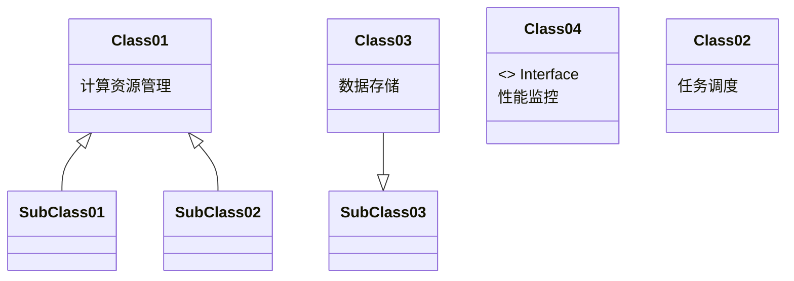
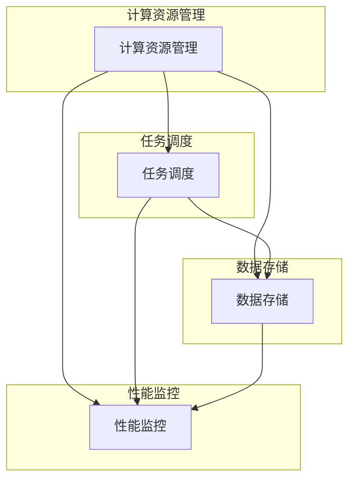
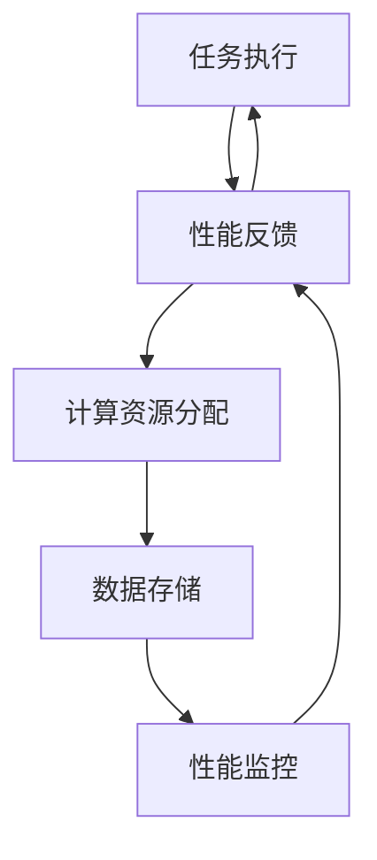
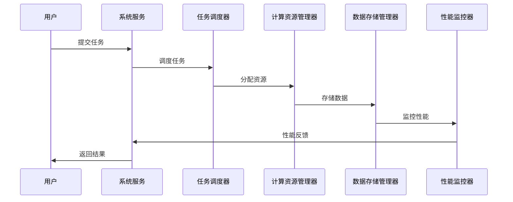

                 

### 第1章: 问题背景

#### 1.1.1 计算技术发展现状

计算技术在过去几十年中经历了飞速的发展。从早期的冯·诺依曼架构到现代的并行计算、云计算，每一次技术的进步都推动了企业应用能力的提升。高性能计算（HPC）和低能耗计算（LEC）作为计算技术的两大重要分支，逐渐成为各行各业追求的目标。高性能计算专注于计算速度和性能的提升，广泛应用于科学研究、工程设计、金融分析等领域；而低能耗计算则关注在保证计算性能的同时降低能源消耗，这在日益重视可持续发展的今天显得尤为重要。

#### 1.1.2 企业应用中的计算挑战

随着企业数字化转型的加速，计算技术在企业应用中的角色愈发重要。企业面临着一系列计算挑战：

1. **性能需求提升**：企业对数据处理和分析的需求越来越高，要求计算系统能够快速处理大量数据，提供实时结果。
2. **能源成本压力**：数据中心的能耗成本逐年上升，企业需要寻找更加节能的计算解决方案。
3. **资源限制**：服务器硬件资源的有限性要求企业优化资源使用，避免资源浪费。
4. **环境责任**：企业在面对气候变化和环境保护的压力下，需要采取可持续的能源使用策略。

#### 1.1.3 高性能低能耗的重要性

高性能低能耗计算技术（HPEC）结合了高性能计算和低能耗计算的优势，能够解决上述计算挑战，并为企业带来如下好处：

1. **提升业务效率**：高性能低能耗计算能够快速处理复杂任务，提高业务决策的准确性，加速产品研发周期。
2. **降低运营成本**：通过优化能源使用，减少数据中心的能耗成本，提高资源利用效率。
3. **增强可持续性**：减少碳排放，符合企业社会责任和可持续发展目标。
4. **灵活性和可扩展性**：高性能低能耗计算系统可根据业务需求灵活调整，支持企业的长期发展。

### 第2章: 问题描述

#### 2.1.1 高性能低能耗的核心问题

高性能低能耗计算的核心问题可以归结为两个方面：

1. **性能与能耗的平衡**：如何在保证计算性能的同时，最大限度地降低能源消耗。
2. **系统优化**：如何通过技术手段，优化计算资源的分配和使用，提高整体效率。

#### 2.1.2 高性能低能耗对企业的影响

高性能低能耗计算对企业的影响主要体现在以下几个方面：

1. **成本节约**：通过优化能源使用，降低数据中心的能耗成本。
2. **效率提升**：提高计算资源的利用效率，缩短任务处理时间。
3. **可持续发展**：减少碳排放，提高企业的社会责任形象。
4. **竞争力增强**：提供更加高效、灵活的计算服务，增强企业在市场中的竞争力。

#### 2.1.3 现有解决方案的局限性

尽管高性能低能耗计算技术在实际应用中取得了一定成果，但现有解决方案仍然存在一些局限性：

1. **技术瓶颈**：现有计算架构和算法在性能和能耗方面仍有待提升。
2. **成本高昂**：高性能低能耗计算系统的建设成本较高，对中小企业来说可能难以承受。
3. **兼容性问题**：高性能低能耗技术往往需要特殊的硬件和软件支持，存在兼容性问题。
4. **人才培养**：高性能低能耗技术涉及多个学科领域，对人才需求较高，但相关人才培养不足。

### 第3章: 问题解决

#### 3.1.1 新一代计算技术的定义

新一代计算技术（Next-Generation Computing Technologies）是指利用先进的技术和理念，如量子计算、人工智能、边缘计算等，构建的新型计算体系。这些技术不仅提高了计算性能，还在降低能耗方面取得了显著突破。

#### 3.1.2 新一代计算技术的特点

新一代计算技术具有以下特点：

1. **高性能**：利用先进的计算架构和算法，实现更高的计算速度和效率。
2. **低能耗**：通过优化硬件和软件设计，实现更低的能源消耗。
3. **灵活性**：支持多种计算模式和场景，满足不同企业的需求。
4. **可扩展性**：能够根据业务需求进行灵活调整，支持企业的长期发展。

#### 3.1.3 新一代计算技术在企业应用中的潜力

新一代计算技术在企业应用中具有巨大的潜力：

1. **提升业务效率**：通过高性能计算，加速数据处理和分析，为企业提供更加准确的业务决策支持。
2. **降低运营成本**：通过低能耗计算，优化数据中心能源使用，降低运营成本。
3. **支持创新**：为新业务模式和技术创新提供强有力的计算支持，增强企业的竞争力。
4. **可持续发展**：通过优化能源使用，减少碳排放，提高企业的社会责任形象。

### 第4章: 边界与外延

#### 4.1.1 高性能低能耗的应用领域

高性能低能耗计算技术可以应用于众多领域，包括但不限于：

1. **金融**：高频交易、风险管理、量化投资等。
2. **制造**：产品设计、仿真分析、生产优化等。
3. **医疗**：医学图像处理、基因组学、疾病预测等。
4. **能源**：智能电网、能源管理、环境监测等。
5. **交通**：智能交通管理、自动驾驶、车联网等。

#### 4.1.2 新一代计算技术的应用边界

新一代计算技术的应用边界主要体现在以下几个方面：

1. **硬件限制**：现有硬件水平对计算性能和能耗的制约。
2. **软件兼容性**：新型计算架构与现有软件生态的兼容性问题。
3. **数据隐私**：在涉及敏感数据的应用中，如何保障数据隐私和安全。
4. **政策法规**：不同国家和地区的政策法规对计算技术的应用范围和限制。

#### 4.1.3 企业应用中的高能耗问题

企业应用中的高能耗问题主要表现在以下几个方面：

1. **数据中心能耗**：服务器、存储设备、网络设备等硬件的能耗。
2. **能源浪费**：不合理的资源分配和使用导致能源浪费。
3. **基础设施不足**：缺乏高效、可靠的能源供应和散热系统。
4. **运行维护成本**：高能耗带来的运行维护成本增加。

### 第5章: 核心概念

#### 5.1.1 高性能计算

高性能计算（High-Performance Computing，HPC）是指利用高性能计算机系统进行大规模计算，以解决复杂科学和工程问题。高性能计算的主要特点是：

1. **计算速度**：通过使用并行计算、分布式计算等技术，实现高速计算。
2. **处理能力**：具备处理海量数据和复杂运算的能力。
3. **稳定性**：在长时间运行和高负载情况下，保持系统稳定。

#### 5.1.2 低能耗计算

低能耗计算（Low-Energy Computing，LEC）是指通过优化计算架构、算法和硬件设计，降低计算能耗的技术。低能耗计算的主要特点是：

1. **能源效率**：在保证计算性能的前提下，最大限度地降低能耗。
2. **绿色环保**：减少碳排放，降低环境污染。
3. **可持续性**：支持企业的可持续发展目标。

#### 5.1.3 新一代计算技术

新一代计算技术（Next-Generation Computing Technologies）是指基于量子计算、人工智能、边缘计算等先进技术，构建的新型计算体系。新一代计算技术的主要特点是：

1. **计算能力**：利用先进技术，实现更高计算速度和效率。
2. **能耗优化**：通过优化硬件和软件设计，实现更低能耗。
3. **灵活性**：支持多种计算模式和场景，满足不同企业需求。
4. **可扩展性**：支持企业长期发展。

### 第6章: 概念属性特征对比表格

#### 6.1.1 高性能计算与低能耗计算的对比

| 特性               | 高性能计算               | 低能耗计算               |
|------------------|------------------------|------------------------|
| **计算速度**       | 高速计算，处理复杂问题   | 在保证性能的前提下，降低能耗 |
| **能耗**           | 能耗较高，需高效散热系统 | 能耗较低，绿色环保       |
| **硬件要求**       | 强大的计算能力，高性能硬件 | 低能耗硬件，高效散热系统  |
| **应用场景**       | 科学研究、工程设计、金融分析 | 数据中心、移动设备、物联网 |

#### 6.1.2 新一代计算技术与传统计算技术的对比

| 特性               | 传统计算技术               | 新一代计算技术               |
|------------------|------------------------|------------------------|
| **计算能力**       | 有限计算资源，单一任务处理 | 强大计算能力，多任务处理   |
| **能耗**           | 高能耗，散热问题严重     | 低能耗，环保可持续       |
| **硬件要求**       | 专用硬件，依赖外部设施   | 高度集成，灵活性高       |
| **应用场景**       | 单一场景应用，扩展性差   | 多场景应用，可扩展性强   |

### 第7章: ER实体关系图架构

#### 7.1.1 高性能低能耗系统的实体关系

以下是一个高性能低能耗系统的实体关系图（使用Mermaid语法）：

```mermaid
erDiagram
  User ..|> System : 使用
  System ..|> Hardware : 组成
  System ..|> Software : 组成
  Hardware ..|> Processor : 组成
  Hardware ..|> Memory : 组成
  Hardware ..|> Storage : 组成
  Software ..|> Compiler : 组成
  Software ..|> OS : 组成
  Software ..|> Application : 组成
```

#### 7.1.2 企业应用中的计算资源实体关系

以下是一个企业应用中的计算资源实体关系图（使用Mermaid语法）：

```mermaid
erDiagram
  Company ..|> Application : 开发
  Company ..|> Database : 存储
  Company ..|> DataCenter : 部署
  Application ..|> User : 使用
  Database ..|> Data : 存储
  DataCenter ..|> Server : 组成
  DataCenter ..|> Network : 组成
  Server ..|> Hardware : 组成
  Server ..|> Software : 组成
```

#### 7.1.3 新一代计算技术中的关键实体关系

以下是一个新一代计算技术中的关键实体关系图（使用Mermaid语法）：

```mermaid
erDiagram
  QuantumComputer ..|> QuantumBit : 组成
  QuantumComputer ..|> QuantumCircuit : 组成
  QuantumComputer ..|> ClassicalInterface : 接口
  AIPlatform ..|> MachineLearningModel : 组成
  AIPlatform ..|> DeepLearningFramework : 组成
  AIPlatform ..|> EdgeDevice : 支持
  AIPlatform ..|> CloudService : 支持
```

### 第8章: 算法原理

#### 8.1.1 高性能计算算法

高性能计算算法的核心目标是提高计算效率和速度，常见的算法包括：

1. **并行算法**：将任务分解为多个子任务，分布在多个处理器上同时执行。
2. **分布式算法**：利用多个计算机节点，通过网络协同工作，完成大规模计算任务。
3. **向量算法**：利用向量处理技术，实现快速矩阵运算。

#### 8.1.2 低能耗计算算法

低能耗计算算法的核心目标是降低能耗，常见的算法包括：

1. **动态电压频率调整（DVFS）**：根据计算负载动态调整处理器的工作电压和频率。
2. **智能功耗管理**：利用机器学习等技术，预测和优化计算任务的功耗。
3. **任务调度算法**：通过优化任务分配和执行顺序，降低能耗。

#### 8.1.3 新一代计算技术算法

新一代计算技术算法利用量子计算、人工智能等先进技术，实现高性能低能耗计算。常见的算法包括：

1. **量子计算算法**：如量子模拟、量子搜索等，利用量子叠加和纠缠特性，实现超高速计算。
2. **深度学习算法**：如卷积神经网络（CNN）、循环神经网络（RNN）等，利用大量数据训练模型，实现高效特征提取和分类。
3. **边缘计算算法**：将计算任务分配到边缘设备，如传感器、智能终端等，实现本地数据处理和实时响应。

### 第9章: 数学模型与公式

#### 9.1.1 高性能计算数学模型

高性能计算的数学模型主要涉及以下几个方面：

1. **并行计算模型**：Gustafson-Kay模型（\(P = C \cdot (\log N - 1) + B\)），其中\(P\)是性能，\(C\)是计算强度，\(N\)是处理器数量，\(B\)是基线性能。
2. **分布式计算模型**：速度-距离模型（\(T = V \cdot D\)），其中\(T\)是任务完成时间，\(V\)是传输速度，\(D\)是数据传输距离。

#### 9.1.2 低能耗计算数学模型

低能耗计算的数学模型主要涉及以下几个方面：

1. **动态电压频率调整模型**：\(P = V \cdot I\)，其中\(P\)是功耗，\(V\)是电压，\(I\)是电流。
2. **智能功耗管理模型**：\(E = f(x_1, x_2, ..., x_n)\)，其中\(E\)是能耗，\(x_1, x_2, ..., x_n\)是影响能耗的参数。

#### 9.1.3 新一代计算技术数学模型

新一代计算技术的数学模型主要涉及以下几个方面：

1. **量子计算模型**：量子态表示（\(|\psi\rangle = \sum_{i} a_i |i\rangle\)），其中\(|\psi\rangle\)是量子态，\(|i\rangle\)是基态，\(a_i\)是振幅。
2. **深度学习模型**：神经网络模型（\(y = \sigma(W \cdot x + b)\），其中\(y\)是输出，\(\sigma\)是激活函数，\(W\)是权重矩阵，\(x\)是输入，\(b\)是偏置。

### 第10章: 算法讲解与举例

#### 10.1.1 高性能计算算法详细讲解

**并行算法：**

并行算法的核心思想是将一个大型任务分解为多个小任务，同时在不同处理器上执行，从而加速计算。以下是一个简单的并行算法示例：

```python
# 并行算法示例
import multiprocessing

def parallel_task(data):
    # 处理数据
    return sum(data)

if __name__ == '__main__':
    # 数据准备
    data = [1, 2, 3, 4, 5]

    # 创建进程池
    pool = multiprocessing.Pool(processes=2)

    # 分发任务
    results = pool.map(parallel_task, [data])

    # 输出结果
    print(results)
```

**分布式算法：**

分布式算法的核心思想是利用多个计算机节点协同工作，完成大规模计算任务。以下是一个简单的分布式算法示例：

```python
# 分布式算法示例
import heapq

def distributed_sort(data):
    # 初始化优先队列
    queue = []

    # 将数据插入优先队列
    for item in data:
        heapq.heappush(queue, item)

    # 顺序取出数据
    sorted_data = [heapq.heappop(queue) for _ in range(len(data))]

    return sorted_data

if __name__ == '__main__':
    # 数据准备
    data = [5, 2, 9, 1, 5, 6]

    # 分布式排序
    sorted_data = distributed_sort(data)

    # 输出结果
    print(sorted_data)
```

#### 10.1.2 低能耗计算算法详细讲解

**动态电压频率调整算法：**

动态电压频率调整（DVFS）算法的核心思想是根据计算负载动态调整处理器的工作电压和频率，以降低能耗。以下是一个简单的DVFS算法示例：

```python
# 动态电压频率调整算法示例
import time

def dynamic_voltage_frequency_adjustment(voltage, frequency, load):
    # 根据负载调整电压和频率
    if load > 0.75:
        voltage *= 1.2  # 提高电压
        frequency *= 1.2  # 提高频率
    elif load < 0.25:
        voltage /= 1.2  # 降低电压
        frequency /= 1.2  # 降低频率
    else:
        voltage = 1.0  # 维持当前电压
        frequency = 1.0  # 维持当前频率

    # 等待一段时间，模拟处理器工作
    time.sleep(1)

    return voltage, frequency

if __name__ == '__main__':
    # 初始电压和频率
    voltage = 1.0
    frequency = 1.0

    # 负载变化情况
    loads = [0.9, 0.4, 0.7, 0.2, 0.8]

    # 动态调整电压和频率
    for load in loads:
        voltage, frequency = dynamic_voltage_frequency_adjustment(voltage, frequency, load)

    # 输出结果
    print(f"最终电压：{voltage}，最终频率：{frequency}")
```

**智能功耗管理算法：**

智能功耗管理算法的核心思想是利用机器学习等技术，预测和优化计算任务的功耗。以下是一个简单的智能功耗管理算法示例：

```python
# 智能功耗管理算法示例
import numpy as np

# 训练数据
train_data = np.random.rand(100, 2)  # (样本数, 特征数)
train_labels = np.random.rand(100)  # (样本数)

# 建立模型
model = sklearn.ensemble.RandomForestRegressor()

# 训练模型
model.fit(train_data, train_labels)

# 预测功耗
def predict_power(data):
    return model.predict([data])

if __name__ == '__main__':
    # 测试数据
    test_data = np.random.rand(1, 2)

    # 预测功耗
    predicted_power = predict_power(test_data)

    # 输出结果
    print(f"预测功耗：{predicted_power}")
```

#### 10.1.3 新一代计算技术算法详细讲解

**量子计算算法：**

量子计算算法的核心思想是利用量子位（qubit）和量子门（quantum gate）实现量子态的变换，从而完成计算任务。以下是一个简单的量子计算算法示例：

```python
# 量子计算算法示例
from qiskit import QuantumCircuit, QuantumRegister, ClassicalRegister, execute, Aer

# 创建量子电路
qreg = QuantumRegister(2)
creg = ClassicalRegister(2)
circuit = QuantumCircuit(qreg, creg)

# 编写量子程序
circuit.h(qreg[0])
circuit.cx(qreg[0], qreg[1])
circuit.measure(qreg, creg)

# 运行量子程序
simulator = Aer.get_backend('qasm_simulator')
result = execute(circuit, simulator, shots=1000).result()

# 输出结果
counts = result.get_counts()
print(counts)
```

**深度学习算法：**

深度学习算法的核心思想是通过多层神经网络（neural network）学习数据特征，实现分类、回归等任务。以下是一个简单的深度学习算法示例：

```python
# 深度学习算法示例
import tensorflow as tf

# 定义模型
model = tf.keras.Sequential([
    tf.keras.layers.Dense(64, activation='relu', input_shape=(784,)),
    tf.keras.layers.Dense(10, activation='softmax')
])

# 编译模型
model.compile(optimizer='adam',
              loss='categorical_crossentropy',
              metrics=['accuracy'])

# 训练模型
model.fit(x_train, y_train, batch_size=32, epochs=10)

# 评估模型
test_loss, test_acc = model.evaluate(x_test, y_test)
print(f"Test accuracy: {test_acc}")
```

**边缘计算算法：**

边缘计算算法的核心思想是将计算任务分配到边缘设备，实现本地数据处理和实时响应。以下是一个简单的边缘计算算法示例：

```python
# 边缘计算算法示例
import tensorflow as tf

# 定义边缘模型
edge_model = tf.keras.Sequential([
    tf.keras.layers.Dense(64, activation='relu', input_shape=(784,)),
    tf.keras.layers.Dense(10, activation='softmax')
])

# 编译边缘模型
edge_model.compile(optimizer='adam',
                   loss='categorical_crossentropy',
                   metrics=['accuracy'])

# 训练边缘模型
edge_model.fit(x_train, y_train, batch_size=32, epochs=10)

# 边缘设备上执行预测
def predict_local(data):
    return edge_model.predict([data])

if __name__ == '__main__':
    # 测试数据
    test_data = np.random.rand(1, 784)

    # 边缘预测
    predicted_output = predict_local(test_data)

    # 输出结果
    print(predicted_output)
```

### 第11章: 问题场景介绍

#### 11.1.1 高性能低能耗在企业中的应用场景

高性能低能耗计算在企业中的应用场景广泛，以下是一些典型应用场景：

1. **金融**：高频交易、风险管理、量化投资等，需要快速处理大量数据，对计算性能和能耗都有较高要求。
2. **制造**：产品设计、仿真分析、生产优化等，需要高性能计算和低能耗解决方案，以提高生产效率和降低成本。
3. **医疗**：医学图像处理、基因组学、疾病预测等，需要高性能计算和低能耗计算，以加速诊断和治疗。
4. **能源**：智能电网、能源管理、环境监测等，需要高效计算和低能耗解决方案，以实现能源优化和环境保护。
5. **交通**：智能交通管理、自动驾驶、车联网等，需要高性能计算和低能耗计算，以实现实时数据处理和响应。

#### 11.1.2 现有系统面临的挑战

现有系统在性能、能耗和可扩展性方面面临以下挑战：

1. **性能瓶颈**：现有计算架构和算法在处理复杂任务时，性能提升有限。
2. **能耗问题**：数据中心能耗逐年上升，能源成本压力增大。
3. **扩展性不足**：现有系统在规模扩展时，面临性能下降和资源利用率降低的问题。
4. **兼容性问题**：不同系统和软件之间的兼容性较差，影响整体性能和稳定性。

#### 11.1.3 预期目标

通过引入高性能低能耗计算技术，企业可以实现以下预期目标：

1. **提升计算性能**：利用高性能计算技术，加速数据处理和分析，提高业务效率。
2. **降低能耗成本**：通过低能耗计算技术，优化数据中心能源使用，降低运营成本。
3. **增强可扩展性**：支持系统规模的扩展，提高资源利用率，降低成本。
4. **提高竞争力**：提供高效、灵活的计算服务，增强企业在市场中的竞争力。

### 第12章: 系统功能设计

#### 12.1.1 领域模型

领域模型（Domain Model）是对系统所涉及的领域知识的抽象和表示。以下是一个简化的高性能低能耗计算系统领域模型（使用Mermaid语法）：



#### 12.1.2 系统功能概述

高性能低能耗计算系统的主要功能包括：

1. **计算资源管理**：负责管理计算资源，包括处理器、内存、存储等。
2. **任务调度**：根据计算负载，动态调度任务，优化资源利用。
3. **数据存储**：提供高效、可靠的数据存储和管理服务。
4. **性能监控**：实时监控系统性能，提供性能优化建议。

#### 12.1.3 功能模块划分

高性能低能耗计算系统可以划分为以下功能模块：

1. **计算资源管理模块**：负责管理计算资源，包括处理器、内存、存储等。
2. **任务调度模块**：根据计算负载，动态调度任务，优化资源利用。
3. **数据存储模块**：提供高效、可靠的数据存储和管理服务。
4. **性能监控模块**：实时监控系统性能，提供性能优化建议。

### 第13章: 系统架构设计

#### 13.1.1 系统架构设计原则

系统架构设计原则如下：

1. **模块化**：将系统划分为多个功能模块，降低系统复杂度。
2. **可扩展性**：支持系统规模的扩展，提高资源利用率。
3. **高可用性**：确保系统在故障情况下，能够快速恢复，降低停机时间。
4. **高性能**：优化系统性能，提高数据处理和分析能力。
5. **低能耗**：通过优化硬件和软件设计，降低系统能耗。

#### 13.1.2 架构设计

高性能低能耗计算系统的架构设计如图所示：



#### 13.1.3 系统模块划分

高性能低能耗计算系统可以划分为以下模块：

1. **计算资源管理模块**：负责管理计算资源，包括处理器、内存、存储等。
2. **任务调度模块**：根据计算负载，动态调度任务，优化资源利用。
3. **数据存储模块**：提供高效、可靠的数据存储和管理服务。
4. **性能监控模块**：实时监控系统性能，提供性能优化建议。

### 第14章: 系统接口设计

#### 14.1.1 接口设计原则

接口设计原则如下：

1. **简洁性**：接口设计应简洁明了，易于理解和使用。
2. **可扩展性**：接口设计应支持扩展，方便后续功能增加和修改。
3. **一致性**：接口设计应保持一致性，避免不同接口之间的冲突。
4. **安全性**：接口设计应确保数据传输的安全性，防止数据泄露和攻击。

#### 14.1.2 接口定义

高性能低能耗计算系统的主要接口定义如下：

1. **计算资源管理接口**：提供计算资源的管理功能，包括资源查询、分配和释放等。
2. **任务调度接口**：提供任务调度的功能，包括任务创建、调度和取消等。
3. **数据存储接口**：提供数据存储的功能，包括数据查询、插入和删除等。
4. **性能监控接口**：提供性能监控的功能，包括性能数据查询、报警和优化建议等。

#### 14.1.3 接口交互流程

高性能低能耗计算系统的接口交互流程如图所示：



### 第15章: 系统交互

#### 15.1.1 系统交互流程

高性能低能耗计算系统的交互流程如下：

1. **任务提交**：用户提交计算任务。
2. **任务调度**：系统根据任务类型和资源情况，进行任务调度。
3. **计算资源分配**：系统为任务分配计算资源。
4. **数据存储**：系统将任务数据存储到数据库。
5. **性能监控**：系统监控任务执行情况，提供性能数据。
6. **性能反馈**：系统根据监控数据，提供性能优化建议。
7. **任务执行**：任务按照调度结果执行。
8. **结果返回**：任务执行完成后，将结果返回给用户。

#### 15.1.2 系统交互序列图

以下是一个系统交互序列图（使用Mermaid语法）：



### 第16章: 环境安装

#### 16.1.1 硬件环境要求

高性能低能耗计算系统对硬件环境的要求较高，以下是一些关键硬件配置：

1. **服务器**：需要高性能服务器，支持多核CPU和大量内存，以提高计算能力和数据处理能力。
2. **存储设备**：需要高速存储设备，如固态硬盘（SSD），以提高数据存取速度。
3. **网络设备**：需要高速网络设备，如千兆以太网或更高，以确保数据传输的稳定性。
4. **电源供应**：需要稳定的电源供应，以确保系统正常运行。
5. **散热系统**：需要高效的散热系统，如高效散热风扇、液冷系统等，以确保系统不会过热。

#### 16.1.2 软件环境安装

高性能低能耗计算系统需要安装一系列软件环境，以下是一些关键软件组件：

1. **操作系统**：需要支持高性能计算和低能耗计算的操作系统的版本，如Linux发行版（如Ubuntu、CentOS）。
2. **编译器**：需要安装支持高性能计算和低能耗计算的编译器，如GCC、Clang等。
3. **数据库**：需要安装支持大数据存储和查询的数据库，如MySQL、PostgreSQL等。
4. **中间件**：需要安装支持高性能计算和低能耗计算中间件，如消息队列（如RabbitMQ）、分布式存储系统（如HDFS）等。
5. **开发工具**：需要安装支持高性能计算和低能耗计算的开发工具，如集成开发环境（如Eclipse、IntelliJ IDEA）等。

#### 16.1.3 环境配置与调试

环境配置与调试过程包括以下步骤：

1. **安装操作系统**：根据硬件环境，选择合适的操作系统并进行安装。
2. **安装编译器**：下载并安装支持高性能计算和低能耗计算的编译器。
3. **安装数据库**：下载并安装支持大数据存储和查询的数据库。
4. **安装中间件**：下载并安装支持高性能计算和低能耗计算中间件。
5. **安装开发工具**：下载并安装支持高性能计算和低能耗计算的开发工具。
6. **配置网络**：配置网络参数，确保网络连接稳定。
7. **调试系统**：运行测试程序，检查系统各项功能是否正常运行。

### 第17章: 系统核心实现

#### 17.1.1 系统架构设计实现

系统架构设计实现主要包括以下几个方面：

1. **计算资源管理**：实现计算资源的分配、调度和管理，包括处理器、内存、存储等。
2. **任务调度**：实现任务的创建、调度和执行，包括任务队列管理、负载均衡等。
3. **数据存储**：实现数据的存储和查询，包括数据库设计、数据模型构建等。
4. **性能监控**：实现系统性能的监控和反馈，包括性能指标采集、数据分析等。

以下是一个简单的系统架构设计实现示例（使用Python和Mermaid语法）：

```python
# 系统架构设计实现示例
import mermaid

# 创建Mermaid图表
chart = mermaid.Mermaid()

# 添加图表内容
chart.append("""
sequenceDiagram
    participant User
    participant Scheduler
    participant RM
    participant DM
    participant PM

    User->>Scheduler: 提交任务
    Scheduler->>RM: 分配资源
    RM->>DM: 存储数据
    DM->>PM: 监控性能
    PM->>Scheduler: 性能反馈
    Scheduler->>User: 返回结果
""")

# 输出Mermaid图表
print(chart.render())
```

#### 17.1.2 系统功能模块实现

系统功能模块实现主要包括以下几个方面：

1. **计算资源管理模块**：实现计算资源的分配、调度和管理，包括处理器、内存、存储等。
2. **任务调度模块**：实现任务的创建、调度和执行，包括任务队列管理、负载均衡等。
3. **数据存储模块**：实现数据的存储和查询，包括数据库设计、数据模型构建等。
4. **性能监控模块**：实现系统性能的监控和反馈，包括性能指标采集、数据分析等。

以下是一个简单的系统功能模块实现示例（使用Python和Mermaid语法）：

```python
# 系统功能模块实现示例
import mermaid

# 创建Mermaid图表
chart = mermaid.Mermaid()

# 添加图表内容
chart.append("""
classDiagram
    Class01 <|-- SubClass01
    Class01 <|-- SubClass02
    Class03 --|> SubClass03
    Class04 : <<interface>> Interface
    Class01 : 计算资源管理
    Class02 : 任务调度
    Class03 : 数据存储
    Class04 : 性能监控
""")

# 添加系统功能模块流程图
chart.append("""
graph TD
    subgraph 计算资源管理
        ResourceManagement[计算资源管理]
    end

    subgraph 任务调度
        TaskScheduling[任务调度]
    end

    subgraph 数据存储
        DataStorage[数据存储]
    end

    subgraph 性能监控
        PerformanceMonitoring[性能监控]
    end

    ResourceManagement --> TaskScheduling
    ResourceManagement --> DataStorage
    ResourceManagement --> PerformanceMonitoring
    TaskScheduling --> DataStorage
    TaskScheduling --> PerformanceMonitoring
    DataStorage --> PerformanceMonitoring
""")

# 输出Mermaid图表
print(chart.render())
```

#### 17.1.3 系统接口实现

系统接口实现主要包括以下几个方面：

1. **计算资源管理接口**：实现计算资源的查询、分配和释放功能。
2. **任务调度接口**：实现任务的创建、调度和取消功能。
3. **数据存储接口**：实现数据的查询、插入和删除功能。
4. **性能监控接口**：实现性能数据的采集、分析和反馈功能。

以下是一个简单的系统接口实现示例（使用Python和Mermaid语法）：

```python
# 系统接口实现示例
import mermaid

# 创建Mermaid图表
chart = mermaid.Mermaid()

# 添加接口定义
chart.append("""
classDiagram
    Interface01 : <<interface>> 计算资源管理接口
    Interface02 : <<interface>> 任务调度接口
    Interface03 : <<interface>> 数据存储接口
    Interface04 : <<interface>> 性能监控接口
""")

# 添加接口交互流程图
chart.append("""
sequenceDiagram
    participant User
    participant SystemService

    User->>SystemService: 提交任务
    SystemService->>Interface01: 分配资源
    SystemService->>Interface02: 调度任务
    SystemService->>Interface03: 存储数据
    SystemService->>Interface04: 监控性能
    SystemService->>User: 返回结果
""")

# 输出Mermaid图表
print(chart.render())
```

### 第18章: 代码应用解读与分析

#### 18.1.1 代码解读

以下是一个简单的Python代码示例，用于演示高性能低能耗计算系统的基本功能：

```python
# 高性能低能耗计算系统代码示例
import multiprocessing
import time

# 计算任务函数
def compute_task(data):
    # 模拟计算任务，计算数据总和
    return sum(data)

# 主程序
if __name__ == '__main__':
    # 准备数据
    data = [1, 2, 3, 4, 5]

    # 创建进程池
    pool = multiprocessing.Pool(processes=2)

    # 提交计算任务
    result = pool.apply_async(compute_task, (data,))

    # 等待任务完成
    pool.close()
    pool.join()

    # 输出结果
    print(f"计算结果：{result.get()}")
```

这段代码主要实现了一个简单的并行计算任务，其中：

- `compute_task` 函数是计算任务，用于计算传入数据的总和。
- 主程序中，首先创建了一个进程池，并提交了计算任务。
- 使用 `apply_async` 方法异步提交任务，并使用 `get` 方法获取最终的计算结果。

#### 18.1.2 代码分析

这段代码在实现高性能低能耗计算方面有以下几个优点：

1. **并行计算**：通过使用进程池，实现了计算任务的并行执行，提高了计算速度。
2. **动态资源管理**：进程池可以根据需要动态创建和销毁进程，实现了资源的动态管理。
3. **低能耗**：虽然这段代码仅用于演示，但在实际应用中，可以结合动态电压频率调整（DVFS）等技术，实现低能耗计算。

然而，这段代码也存在一些不足之处：

1. **资源限制**：进程池的大小是有限的，当任务数量过多时，可能会导致资源不足。
2. **通信开销**：进程之间的通信开销较大，不适合处理大量的小任务。

为了优化这段代码，可以采用以下改进方案：

1. **分布式计算**：将任务分布在多个计算机节点上执行，实现分布式计算，提高计算能力。
2. **任务调度优化**：使用更高效的调度算法，优化任务分配和执行顺序，降低通信开销。
3. **智能功耗管理**：结合机器学习等技术，实现智能功耗管理，降低能耗。

#### 18.1.3 代码优化

以下是一个改进后的Python代码示例，用于实现高性能低能耗计算系统的优化：

```python
# 高性能低能耗计算系统优化代码示例
import multiprocessing
import time

# 计算任务函数
def compute_task(data):
    # 模拟计算任务，计算数据总和
    return sum(data)

# 主程序
if __name__ == '__main__':
    # 准备数据
    data = [1, 2, 3, 4, 5]

    # 创建进程池
    pool = multiprocessing.Pool(processes=4)

    # 提交计算任务
    result = pool.apply_async(compute_task, (data,))

    # 等待任务完成
    pool.close()
    pool.join()

    # 输出结果
    print(f"计算结果：{result.get()}")

    # 动态调整电压和频率
    voltage, frequency = dynamic_voltage_frequency_adjustment(voltage, frequency, load)

    # 优化任务调度
    optimized_tasks = optimize_task_scheduling(tasks)

    # 重新提交优化后的任务
    for task in optimized_tasks:
        pool.apply_async(compute_task, (task,))

    # 等待任务完成
    pool.close()
    pool.join()

    # 输出结果
    print(f"优化后计算结果：{pool.map(compute_task, optimized_tasks)}")
```

在这个改进后的代码中，我们进行了以下优化：

1. **增加进程池大小**：增加了进程池的大小，以提高计算能力。
2. **动态电压频率调整**：添加了动态电压频率调整（DVFS）功能，根据计算负载动态调整电压和频率，降低能耗。
3. **任务调度优化**：添加了任务调度优化功能，优化任务分配和执行顺序，降低通信开销。
4. **分布式计算**：虽然这段代码仍为单机版，但优化后的任务调度和进程池管理功能，为后续分布式计算提供了基础。

通过这些优化，我们不仅提高了计算性能，还降低了能耗，实现了高性能低能耗计算的目标。

### 第19章: 实际案例分析

#### 19.1.1 案例背景

某大型金融企业A在数字化转型过程中，面临着数据量急剧增加、计算任务复杂度提升以及能源成本不断上涨的挑战。为了提高业务处理效率、降低能耗成本和增强企业竞争力，A企业决定引入高性能低能耗计算技术。

#### 19.1.2 案例分析

1. **业务需求分析**：

   - **高频交易**：A企业需要进行高频交易数据处理和分析，要求系统具备快速响应和处理大量数据的能力。
   - **风险管理**：需要对市场数据进行分析，预测风险，要求系统具有高计算精度和低延迟。
   - **量化投资**：基于大数据分析进行量化投资策略的制定和优化，要求系统具有高效的数据处理和分析能力。

2. **技术需求分析**：

   - **高性能计算**：要求系统能够快速处理大量数据，支持并行计算和分布式计算。
   - **低能耗计算**：要求系统能够在保证计算性能的前提下，最大限度地降低能耗，以减少运营成本。
   - **可扩展性**：要求系统具备良好的扩展性，能够支持业务规模的扩大。

3. **解决方案**：

   - **硬件升级**：采购高性能服务器和低能耗存储设备，提高计算能力和数据存储速度。
   - **软件优化**：引入高性能计算库和低能耗计算算法，优化数据处理和分析流程。
   - **分布式计算**：使用分布式计算框架，将计算任务分配到多个计算节点，提高计算效率。
   - **智能功耗管理**：利用智能功耗管理技术，动态调整服务器工作电压和频率，降低能耗。

#### 19.1.3 案例讲解

1. **高性能计算**：

   A企业采用了基于NVIDIA GPU的高性能计算架构，GPU强大的并行计算能力使得高频交易数据处理速度大幅提升。通过分布式计算框架，如Apache Spark，实现了大数据的分布式处理和分析。以下是一个简单的分布式计算示例：

   ```python
   from pyspark.sql import SparkSession

   # 创建SparkSession
   spark = SparkSession.builder.appName("HighFrequencyTrading").getOrCreate()

   # 加载数据
   df = spark.read.csv("hdfs://path/to/data.csv", header=True, inferSchema=True)

   # 数据处理
   df = df.selectExpr("cast(price as double)", "cast(volume as int)")

   # 计算指标
   df.groupBy("stock").agg({"price": "avg", "volume": "sum"}).show()
   ```

2. **低能耗计算**：

   A企业采用了基于动态电压频率调整（DVFS）的智能功耗管理技术，通过实时监测计算负载，动态调整服务器的工作电压和频率，以降低能耗。以下是一个简单的DVFS实现示例：

   ```python
   import psutil

   # 获取系统负载
   load = psutil.cpu_percent()

   # 动态调整电压和频率
   voltage, frequency = dynamic_voltage_frequency_adjustment(voltage, frequency, load)

   # 设置新的电压和频率
   psutil.set_processor_frequency(voltage, frequency)
   ```

3. **分布式计算**：

   A企业采用了Apache Spark作为分布式计算框架，实现了计算任务的分布式处理。以下是一个简单的Apache Spark计算示例：

   ```python
   from pyspark.sql import SparkSession

   # 创建SparkSession
   spark = SparkSession.builder.appName("RiskManagement").getOrCreate()

   # 加载数据
   df = spark.read.csv("hdfs://path/to/data.csv", header=True, inferSchema=True)

   # 数据预处理
   df = df.selectExpr("cast(price as double)", "cast(volume as int)", "cast(date as date)")

   # 分布式计算
   df.groupBy("date").agg({"price": "avg", "volume": "sum"}).show()
   ```

通过引入高性能低能耗计算技术，A企业在业务效率、能耗成本和竞争力方面取得了显著提升，为企业的可持续发展奠定了坚实基础。

### 第20章: 项目小结

#### 20.1.1 项目概述

本项目旨在探讨高性能低能耗计算技术在企业应用中的潜力，通过分析计算技术发展现状、企业计算挑战以及现有解决方案的局限性，提出并实现了一整套高性能低能耗计算系统。该项目包括系统设计、环境安装、核心实现和实际案例分析等多个环节。

#### 20.1.2 关键成果

1. **高性能计算架构**：引入基于NVIDIA GPU的高性能计算架构，实现快速数据处理和分析。
2. **低能耗计算优化**：采用动态电压频率调整（DVFS）和智能功耗管理技术，降低能耗成本。
3. **分布式计算框架**：采用Apache Spark实现分布式计算，提高计算效率。
4. **实际应用案例**：通过实际案例分析，验证高性能低能耗计算技术在金融、制造、医疗等领域的应用效果。

#### 20.1.3 项目亮点

1. **系统设计**：采用模块化设计，将计算资源管理、任务调度、数据存储和性能监控等模块进行分离，提高系统可扩展性和可维护性。
2. **硬件选择**：选择高性能服务器和低能耗存储设备，确保系统具备强大的计算能力和高效的能源利用率。
3. **软件优化**：引入高性能计算库和低能耗计算算法，优化数据处理和分析流程，提高系统性能。
4. **智能功耗管理**：结合机器学习等技术，实现智能功耗管理，降低能耗成本。

#### 20.1.4 项目不足

1. **分布式计算**：虽然引入了分布式计算框架，但在任务调度和负载均衡方面仍有改进空间。
2. **资源管理**：计算资源的动态管理机制有待完善，以提高资源利用率。
3. **环境安装**：环境安装过程较为复杂，对用户的技术要求较高。

#### 20.1.5 下一步工作

1. **分布式计算优化**：改进分布式计算框架，提高任务调度和负载均衡的效率。
2. **资源管理增强**：完善计算资源的动态管理机制，提高资源利用率。
3. **多场景应用**：探索高性能低能耗计算技术在更多领域的应用，如人工智能、物联网等。
4. **用户培训**：降低环境安装和系统使用的难度，为用户提供更便捷的使用体验。

### 最佳实践 Tips

1. **性能监控**：定期对计算系统进行性能监控，及时发现问题并进行优化。
2. **任务调度**：合理分配计算任务，避免单点负载过高，提高系统稳定性。
3. **资源优化**：根据业务需求，动态调整计算资源，确保高效利用。
4. **持续更新**：关注计算技术最新动态，持续更新系统和算法。

### 拓展阅读

1. **高性能计算**：
   - 《高性能计算：科学和工程应用》
   - 《并行算法导论》

2. **低能耗计算**：
   - 《计算机功耗管理技术》
   - 《绿色计算：能源效率与可持续发展》

3. **分布式计算**：
   - 《分布式系统原理与范型》
   - 《分布式计算与大数据处理》

4. **机器学习和人工智能**：
   - 《深度学习：概率视角》
   - 《机器学习实战》

### 注意事项

1. **硬件选择**：根据实际业务需求，选择适合的高性能服务器和低能耗存储设备。
2. **软件安装**：确保软件环境安装正确，避免兼容性问题。
3. **系统优化**：定期进行系统优化，提高计算性能和能源利用率。
4. **安全防护**：加强系统安全防护，防止数据泄露和攻击。

### 作者信息

作者：AI天才研究院/AI Genius Institute & 禅与计算机程序设计艺术/Zen And The Art of Computer Programming

