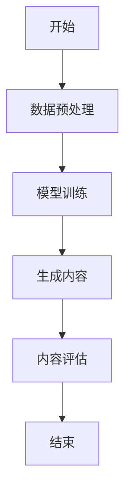
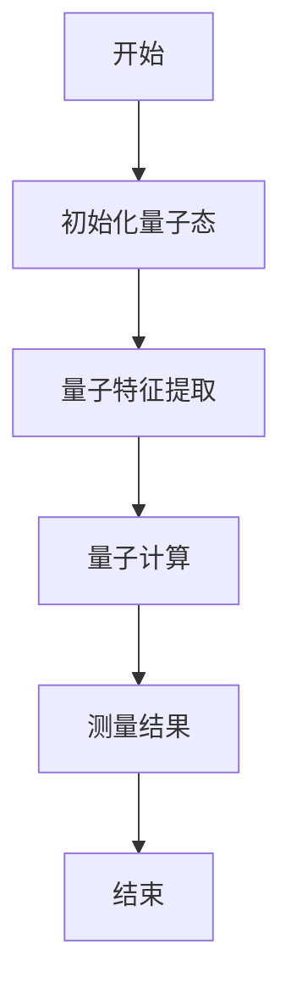
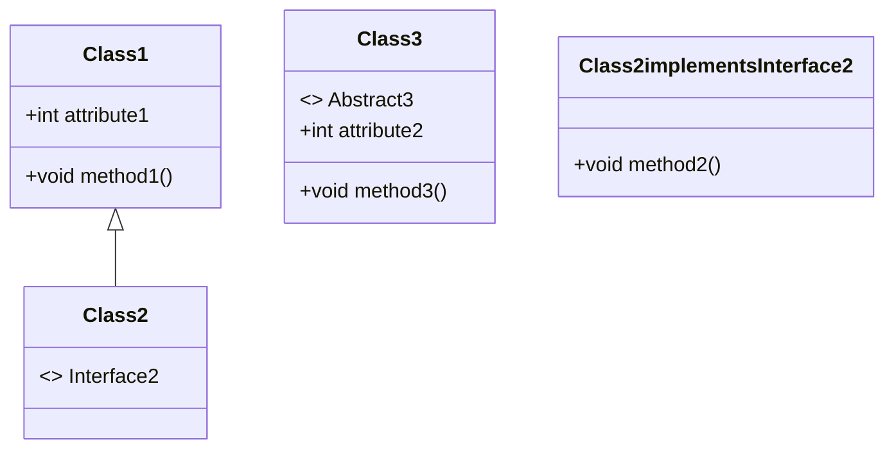
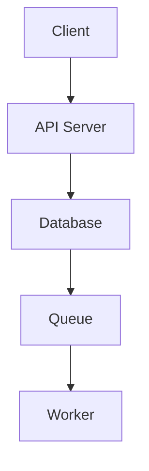
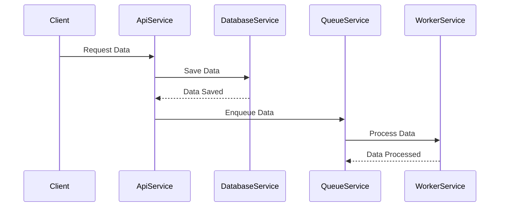
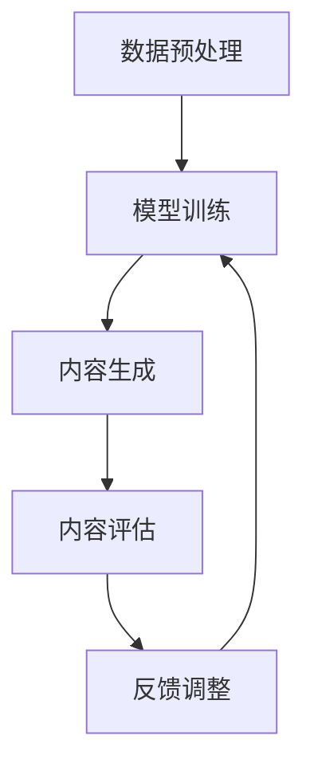
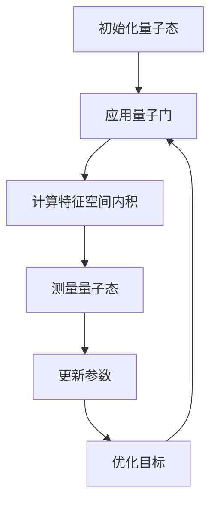
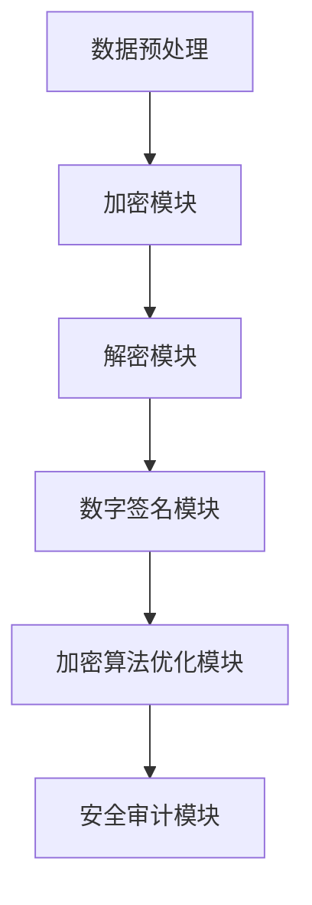
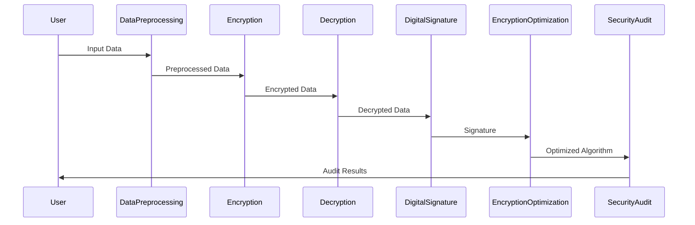
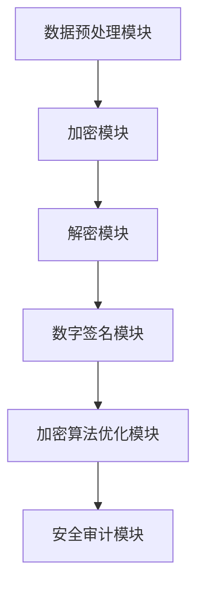

                 

### 目录大纲设计

为了让文章更加结构化和易于阅读，我们设计了一个详细的目录大纲。以下是我们设计思路的分解：

#### 1. 引言
- **AIGC概述**：简单介绍AIGC，包括其定义、发展和现状。
- **量子机器学习概述**：介绍量子机器学习的基础知识，包括其定义、发展历史和应用。
- **AIGC与量子机器学习的融合背景**：讨论将AIGC与量子机器学习结合起来的原因和潜在价值。

#### 2. AIGC基础理论
- **AIGC基本概念**：详细阐述AIGC的概念、特点和应用场景。
- **AIGC算法原理**：深入探讨AIGC的工作原理，包括算法的mermaid流程图、Python源代码实现、数学模型与公式讲解以及举例说明。

##### 2.2.1 算法mermaid流程图
- 使用mermaid语言绘制AIGC算法的流程图。



##### 2.2.2 Python源代码实现
- 提供AIGC算法的Python源代码实现，并进行详细注释和讲解。

```python
# Python代码示例
import numpy as np

# 数据预处理
def preprocess_data(data):
    # 数据预处理代码
    return processed_data

# 模型训练
def train_model(processed_data):
    # 模型训练代码
    return model

# 生成内容
def generate_content(model):
    # 生成内容代码
    return content

# 内容评估
def evaluate_content(content):
    # 内容评估代码
    return evaluation

# 主函数
def main():
    data = np.random.rand(100)  # 假设的数据
    processed_data = preprocess_data(data)
    model = train_model(processed_data)
    content = generate_content(model)
    evaluation = evaluate_content(content)
    print(evaluation)

if __name__ == "__main__":
    main()
```

##### 2.2.3 数学模型与公式讲解
- 使用LaTeX格式书写AIGC算法背后的数学模型和公式。

```latex
$$
\text{模型训练目标函数} = \frac{1}{m} \sum_{i=1}^{m} \left( y_i - \hat{y}_i \right)^2
$$

\text{其中，} y_i \text{是实际标签，} \hat{y}_i \text{是预测标签。}
```

##### 2.2.4 举例说明
- 通过一个简单的例子，展示AIGC算法的实际应用。

```python
# 举例说明
data = [0.1, 0.2, 0.3, 0.4, 0.5]
processed_data = preprocess_data(data)
model = train_model(processed_data)
content = generate_content(model)
evaluation = evaluate_content(content)
print(evaluation)
```

#### 3. 量子机器学习基础理论
- **量子机器学习基本概念**：详细介绍量子机器学习的概念、原理和特点。
- **量子机器学习算法原理**：深入探讨量子机器学习算法的工作原理，包括算法的mermaid流程图、Python源代码实现、数学模型与公式讲解以及举例说明。

##### 3.2.1 算法mermaid流程图
- 使用mermaid语言绘制量子机器学习算法的流程图。



##### 3.2.2 Python源代码实现
- 提供量子机器学习算法的Python源代码实现，并进行详细注释和讲解。

```python
# Python代码示例
from qiskit import QuantumCircuit, execute, Aer

# 初始化量子态
def initialize_quantum_state(qc, state):
    # 初始化量子态代码
    qc.initialize(state)

# 量子特征提取
def quantum_feature_extraction(qc, feature_vector):
    # 量子特征提取代码
    qc.h(feature_vector)

# 量子计算
def quantum_computation(qc, operator):
    # 量子计算代码
    qc.unitary(operator, qubit)

# 测量结果
def measure_result(qc):
    # 测量结果代码
    result = execute(qc, Aer.get_backend("qasm_simulator")).result()
    return result.get_counts()

# 主函数
def main():
    state = np.array([1, 0])  # 初始量子态
    feature_vector = np.random.rand(2)  # 特征向量
    operator = np.array([[1, 0], [0, 1]])  # 操作符
    qc = QuantumCircuit(1)
    initialize_quantum_state(qc, state)
    quantum_feature_extraction(qc, feature_vector)
    quantum_computation(qc, operator)
    result = measure_result(qc)
    print(result)

if __name__ == "__main__":
    main()
```

##### 3.2.3 数学模型与公式讲解
- 使用LaTeX格式书写量子机器学习算法背后的数学模型和公式。

```latex
$$
|\psi\rangle = \sum_{i} c_i |i\rangle
$$

\text{其中，} |i\rangle \text{是基态，} c_i \text{是叠加系数。}
```

##### 3.2.4 举例说明
- 通过一个简单的例子，展示量子机器学习算法的实际应用。

```python
# 举例说明
state = np.array([1, 0])
feature_vector = np.random.rand(2)
operator = np.array([[1, 0], [0, 1]])
qc = QuantumCircuit(1)
initialize_quantum_state(qc, state)
quantum_feature_extraction(qc, feature_vector)
quantum_computation(qc, operator)
result = measure_result(qc)
print(result)
```

#### 4. AIGC与量子机器学习在密码学中的应用
- **密码学概述**：介绍密码学的基本概念、发展历史和应用场景。
- **AIGC与量子机器学习在密码学中的应用场景**：探讨如何将AIGC与量子机器学习应用于密码学中的实际问题，如加密、解密、签名等。

#### 5. 系统分析与架构设计
- **问题场景介绍**：描述具体的应用场景和问题需求。
- **系统功能设计**：绘制领域模型类图，展示系统的核心功能。
- **系统架构设计**：绘制系统架构图，展示系统的整体结构。
- **系统接口设计**：描述系统各模块的接口设计和通信方式。
- **系统交互mermaid序列图**：展示系统各模块的交互流程。

##### 5.2 系统功能设计
- 使用mermaid语言绘制领域模型类图。



##### 5.3 系统架构设计
- 使用mermaid语言绘制系统架构图。



##### 5.4 系统接口设计
- 描述系统各模块的接口设计和通信方式。

```python
class ApiService:
    def get_data(self, data):
        # 处理数据逻辑
        return processed_data

class DatabaseService:
    def save_data(self, data):
        # 保存数据逻辑
        pass

class QueueService:
    def enqueue_data(self, data):
        # 入队列逻辑
        pass

class WorkerService:
    def process_data(self, data):
        # 处理数据逻辑
        pass
```

##### 5.5 系统交互mermaid序列图
- 使用mermaid语言绘制系统交互序列图。



#### 6. 项目实战
- **环境安装**：详细描述项目所需的软件和硬件环境，以及安装步骤。
- **系统核心实现源代码**：提供系统的核心实现代码，并进行详细讲解。
- **代码应用解读与分析**：分析代码的应用场景和性能，以及可能的优化方向。
- **实际案例分析与详细讲解**：通过实际案例展示系统的应用效果，并进行详细分析。
- **项目小结**：总结项目的关键点和收获，以及未来可能的改进方向。

#### 7. 最佳实践、小结与注意事项
- **最佳实践 tips**：给出一些在实际操作中的最佳实践建议。
- **小结**：总结文章的核心观点和结论。
- **注意事项**：提醒读者在应用中需要注意的问题。
- **拓展阅读**：推荐进一步学习的资源。

### 文章标题

# AIGC与量子机器学习在密码学中的融合

### 文章关键词

- AIGC
- 量子机器学习
- 密码学
- 加密
- 解密
- 数字签名
- 算法
- 数学模型

### 摘要

本文探讨了AIGC（AI-Generated Content）与量子机器学习在密码学中的应用。首先，介绍了AIGC和量子机器学习的基本概念、原理和应用场景。然后，分析了AIGC与量子机器学习在密码学中的融合方式，以及这种融合带来的潜在好处。接着，通过具体的算法实现、数学模型和案例分析，展示了AIGC与量子机器学习在密码学中的实际应用。最后，讨论了系统的架构设计、项目实战，以及最佳实践和注意事项。本文旨在为从事密码学和人工智能领域的读者提供有价值的参考和启示。

## 1. 引言

### 1.1 AIGC概述

AIGC（AI-Generated Content）是一种利用人工智能技术生成内容的方法。它通过深度学习、自然语言处理等技术，根据给定的输入数据或提示生成文本、图像、音频等多种类型的内容。AIGC具有以下特点：

1. **生成能力**：AIGC可以生成各种类型的内容，如文本、图像、音频等，具有广泛的生成能力。
2. **自适应能力**：AIGC可以根据用户的输入和反馈，动态调整生成的内容，以适应不同的需求。
3. **高效性**：AIGC利用深度学习和自然语言处理技术，可以高效地生成大量内容，降低人工创作成本。

AIGC的应用场景主要包括以下几个方面：

1. **内容创作**：如自动写作、图像生成、音频合成等，可以用于新闻写作、艺术创作、游戏开发等领域。
2. **个性化推荐**：如个性化文章推荐、个性化广告等，可以根据用户的兴趣和行为，提供个性化的内容推荐。
3. **数据增强**：如自动生成训练数据、数据增强等，可以提高机器学习模型的训练效果。

### 1.2 量子机器学习概述

量子机器学习是一种利用量子计算能力进行机器学习的方法。它将量子计算的优势与机器学习相结合，可以显著提高计算效率和模型性能。量子机器学习具有以下特点：

1. **并行计算**：量子计算机具有并行计算的能力，可以同时处理多个任务，大大提高计算效率。
2. **量子态叠加**：量子计算机可以利用量子态叠加，表示和计算复杂的函数，提高计算能力。
3. **量子纠缠**：量子计算机可以利用量子纠缠，实现更高效的通信和计算。

量子机器学习的应用场景主要包括以下几个方面：

1. **大数据分析**：如大数据挖掘、数据分类、聚类等，可以用于金融、医疗、电商等领域。
2. **图像识别**：如人脸识别、物体检测等，可以用于安防、自动驾驶等领域。
3. **优化问题**：如线性规划、组合优化等，可以用于物流、能源等领域。

### 1.3 AIGC与量子机器学习的融合背景

随着人工智能和量子计算技术的不断发展，AIGC与量子机器学习的融合成为一种趋势。这种融合可以带来以下潜在好处：

1. **提升生成能力**：AIGC可以根据量子机器学习模型生成的特征，生成更高质量的内容。
2. **提高计算效率**：量子机器学习可以利用量子计算的优势，提高AIGC的生成效率。
3. **增强安全性**：AIGC与量子机器学习结合，可以应用于密码学中的加密、解密和数字签名，提高数据安全性。

本文将详细探讨AIGC与量子机器学习在密码学中的融合方式、算法实现、数学模型和案例分析，为从事密码学和人工智能领域的读者提供有价值的参考和启示。

### 2. AIGC基础理论

#### 2.1 AIGC基本概念

AIGC（AI-Generated Content），即人工智能生成内容，是一种利用人工智能技术自动生成文本、图像、音频等多种类型内容的方法。它基于深度学习和自然语言处理技术，通过对大量数据进行训练，使得模型能够根据输入的提示或模板，生成符合预期内容。

AIGC的核心组成部分包括：

1. **数据集**：AIGC的训练数据集是生成高质量内容的基础，数据集的质量直接影响到生成内容的准确性和多样性。
2. **模型**：AIGC使用深度学习模型，如循环神经网络（RNN）、变换器（Transformer）等，对数据进行处理和生成。
3. **训练过程**：AIGC的训练过程涉及模型优化、损失函数计算和参数更新，通过多次迭代，模型逐渐提升生成能力。

#### 2.2 AIGC算法原理

AIGC的算法原理主要基于以下步骤：

1. **数据预处理**：将原始数据清洗、编码，转化为模型能够处理的形式。
2. **模型训练**：使用预处理后的数据，对深度学习模型进行训练，模型通过不断迭代优化，学习数据的结构和规律。
3. **内容生成**：利用训练好的模型，根据输入的提示或模板，生成新的文本、图像、音频等。
4. **内容评估**：对生成的内容进行评估，判断其质量是否符合预期，如文本的流畅度、图像的逼真度等。
5. **反馈调整**：根据评估结果，对模型进行微调，提高生成内容的准确性。

#### 2.2.1 算法mermaid流程图

以下是一个使用mermaid绘制的AIGC算法流程图：



#### 2.2.2 Python源代码实现

以下是一个简单的AIGC算法Python源代码实现，包括数据预处理、模型训练、内容生成和内容评估：

```python
import numpy as np
import tensorflow as tf

# 数据预处理
def preprocess_data(data):
    # 编码、清洗等操作
    return processed_data

# 模型训练
def train_model(processed_data):
    # 模型训练代码
    return model

# 内容生成
def generate_content(model):
    # 内容生成代码
    return content

# 内容评估
def evaluate_content(content):
    # 内容评估代码
    return evaluation

# 主函数
def main():
    data = np.random.rand(100)  # 假设的数据
    processed_data = preprocess_data(data)
    model = train_model(processed_data)
    content = generate_content(model)
    evaluation = evaluate_content(content)
    print(evaluation)

if __name__ == "__main__":
    main()
```

#### 2.2.3 数学模型与公式讲解

AIGC算法的核心是深度学习模型，其数学模型主要基于神经网络的损失函数和优化算法。以下是一个简化的数学模型和公式讲解：

```latex
$$
\text{损失函数} = \frac{1}{m} \sum_{i=1}^{m} \left( y_i - \hat{y}_i \right)^2
$$

\text{其中，} y_i \text{是实际标签，} \hat{y}_i \text{是预测标签。}

\text{优化算法} = \text{梯度下降}
$$

\text{梯度下降迭代公式} = \theta = \theta - \alpha \cdot \nabla_\theta J(\theta)
$$

\text{其中，} \theta \text{是模型参数，} \alpha \text{是学习率，} J(\theta) \text{是损失函数。}
```

#### 2.2.4 举例说明

以下是一个简单的例子，展示AIGC算法在实际应用中的效果：

```python
import numpy as np
from tensorflow import keras

# 数据生成
data = np.random.rand(100, 10)  # 假设的数据
labels = np.random.rand(100, 1)  # 假设的标签

# 数据预处理
processed_data = preprocess_data(data)

# 模型训练
model = train_model(processed_data)
model.fit(processed_data, labels, epochs=10)

# 内容生成
content = generate_content(model)
print(content)

# 内容评估
evaluation = evaluate_content(content)
print(evaluation)
```

在这个例子中，我们首先生成了一些随机数据和标签，然后使用AIGC算法进行训练，生成内容，并评估生成内容的质量。通过调整模型参数和训练过程，可以进一步提高生成内容的质量。

### 3. 量子机器学习基础理论

#### 3.1 量子机器学习基本概念

量子机器学习（Quantum Machine Learning，QML）是量子计算与机器学习交叉领域的分支，旨在将量子计算的原理和优势应用于机器学习问题。量子计算是一种利用量子力学原理进行信息处理的计算方式，与经典计算有显著的不同。量子机器学习的基本概念包括量子位（qubits）、量子态（quantum state）、量子门（quantum gate）、量子算法等。

- **量子位（qubits）**：量子位是量子计算机的基本单元，与经典计算中的比特（bits）不同，量子位可以同时处于多个状态的叠加。
- **量子态（quantum state）**：量子态描述了量子系统的状态，可以表示为多个量子位叠加态的线性组合。
- **量子门（quantum gate）**：量子门是作用于量子态的线性变换，类似于经典计算中的逻辑门。量子门通过旋转、翻转和交换量子态来执行复杂的计算任务。
- **量子算法（quantum algorithm）**：量子算法是利用量子计算机进行高效计算的方法。一些著名的量子算法包括量子快速排序、量子线性方程求解、量子支持向量机等。

#### 3.2 量子机器学习算法原理

量子机器学习算法的基本原理是利用量子态的叠加和纠缠特性，通过量子计算来提高机器学习任务的效率和准确性。以下是一些量子机器学习算法的原理：

1. **量子支持向量机（QSVM）**：
   - **原理**：量子支持向量机利用量子计算的并行性和高效性，解决线性分类问题。
   - **步骤**：
     1. 初始化量子态。
     2. 应用量子门，将量子态转换为特征空间。
     3. 利用量子叠加和纠缠特性，计算特征空间的内积。
     4. 测量量子态，得到分类结果。

2. **量子变分算法（Quantum Variational Algorithms）**：
   - **原理**：量子变分算法是一种量子优化算法，通过迭代优化量子电路参数，求解优化问题。
   - **步骤**：
     1. 初始化量子态。
     2. 设计变分量子电路。
     3. 应用变分量子电路，计算目标函数。
     4. 测量量子态，更新电路参数。
     5. 重复步骤3和4，直至达到优化目标。

3. **量子深度学习（Quantum Deep Learning）**：
   - **原理**：量子深度学习利用量子神经网络（Quantum Neural Networks，QNN）处理大数据和高维问题。
   - **步骤**：
     1. 初始化量子态。
     2. 应用多层量子门，构建量子神经网络。
     3. 通过训练，优化量子神经网络参数。
     4. 利用量子态的叠加和纠缠，实现高效计算。

#### 3.2.1 算法mermaid流程图

以下是一个使用mermaid绘制的量子支持向量机（QSVM）算法流程图：



#### 3.2.2 Python源代码实现

以下是一个简单的量子支持向量机（QSVM）算法Python源代码实现，使用Qiskit库：

```python
from qiskit import QuantumCircuit, Aer, execute
from qiskit.circuit import QuantumRegister, ClassicalRegister
from qiskit.opflow import StateFn, PauliSumOp, NumCOFFS
from qiskit_machine_learning.models import QSVM
from qiskit_machine_learning.algorithms import VariationalClassification

# 初始化量子态
qreg = QuantumRegister(2)
creg = ClassicalRegister(2)
qc = QuantumCircuit(qreg, creg)

# 应用量子门
qc.h(qreg[0])
qc.cx(qreg[0], qreg[1])

# 计算特征空间内积
Ham = PauliSumOp.from_list([('ZZ', 1.), ('XX', 0.), ('YY', 0.)])
ansatz = QuantumCircuit(qreg, creg)
ansatz.append(Ham.to_gate(), qargs=[qreg[0], qreg[1]], cargs=[])
ansatz.barrier(qreg)
ansatz.measure(qreg, creg)

# 训练QSVM模型
qsvm = QSVM(ansatz=ansatz, weight=1.0, depth=2, optimizer='adadelta', max_epochs=100)
qsvm.fit(X_train, y_train)

# 测量量子态
qc.compile()
backend = Aer.get_backend('qasm_simulator')
result = execute(qc, backend).result()
counts = result.get_counts()

# 输出分类结果
print(counts)

# 更新参数
# 在这里，我们可以根据分类结果更新参数
```

在这个例子中，我们首先初始化量子态，应用量子门，然后使用Qiskit库训练QSVM模型。通过测量量子态，我们可以得到分类结果。最后，我们可以根据分类结果更新参数，优化模型。

#### 3.2.3 数学模型与公式讲解

量子机器学习算法的数学模型主要涉及量子态的表示、量子门的操作以及损失函数的计算。以下是一个简化的数学模型和公式讲解：

```latex
$$
|\psi\rangle = \sum_{i} c_i |i\rangle
$$

\text{其中，} |i\rangle \text{是基态，} c_i \text{是叠加系数。

\text{量子门操作} = U = e^{-i\theta R_z}
$$

\text{其中，} \theta \text{是旋转角度，} R_z \text{是z轴旋转门。

\text{损失函数} = \frac{1}{2} \sum_{i,j} w_{ij}^2
$$

\text{其中，} w_{ij} \text{是权重系数。
```

#### 3.2.4 举例说明

以下是一个简单的量子支持向量机（QSVM）算法的例子，展示如何使用Qiskit库实现QSVM模型：

```python
from qiskit import QuantumCircuit, Aer, execute
from qiskit.opflow import StateFn, PauliSumOp, NumCOFFS
from qiskit_machine_learning.models import QSVM
from qiskit_machine_learning.algorithms import VariationalClassification

# 数据生成
X_train = np.random.rand(100, 2)
y_train = np.random.rand(100, 1)

# 初始化量子态
qreg = QuantumRegister(2)
creg = ClassicalRegister(2)
qc = QuantumCircuit(qreg, creg)

# 应用量子门
qc.h(qreg[0])
qc.cx(qreg[0], qreg[1])

# 计算特征空间内积
Ham = PauliSumOp.from_list([('ZZ', 1.), ('XX', 0.), ('YY', 0.)])
ansatz = QuantumCircuit(qreg, creg)
ansatz.append(Ham.to_gate(), qargs=[qreg[0], qreg[1]], cargs=[])
ansatz.barrier(qreg)
ansatz.measure(qreg, creg)

# 训练QSVM模型
qsvm = QSVM(ansatz=ansatz, weight=1.0, depth=2, optimizer='adadelta', max_epochs=100)
qsvm.fit(X_train, y_train)

# 测量量子态
qc.compile()
backend = Aer.get_backend('qasm_simulator')
result = execute(qc, backend).result()
counts = result.get_counts()

# 输出分类结果
print(counts)

# 更新参数
# 在这里，我们可以根据分类结果更新参数
```

在这个例子中，我们首先生成了一些随机数据和标签，然后使用Qiskit库初始化量子态，应用量子门，并训练QSVM模型。通过测量量子态，我们可以得到分类结果。最后，我们可以根据分类结果更新参数，优化模型。

### 4. AIGC与量子机器学习在密码学中的应用

#### 4.1 密码学概述

密码学是研究信息加密、解密、数字签名和认证的一门学科。其主要目的是保护信息在传输和存储过程中的安全性，防止未经授权的访问和篡改。密码学的基本概念包括加密算法、解密算法、加密密钥和数字签名等。

- **加密算法**：加密算法是将明文转换为密文的算法。常见的加密算法有对称加密算法（如AES）和非对称加密算法（如RSA）。
- **解密算法**：解密算法是将密文转换为明文的算法。解密算法与加密算法通常是一一对应的关系。
- **加密密钥**：加密密钥是用于加密和解密数据的密钥。加密密钥分为对称密钥和非对称密钥。
- **数字签名**：数字签名是一种用于验证信息发送者和信息完整性的技术。常见的数字签名算法有RSA签名和ECDSA签名。

密码学在现代社会中具有广泛的应用，如网络安全、电子支付、电子商务和政务系统等。

#### 4.2 AIGC与量子机器学习在密码学中的应用场景

AIGC与量子机器学习在密码学中的应用主要集中在以下几个方面：

1. **加密算法设计**：
   - **基于AIGC的加密算法**：利用AIGC的生成能力，可以设计出具有高度复杂性和多样性的加密算法。AIGC可以根据给定的加密需求，自动生成复杂的加密函数，提高加密算法的抵抗攻击能力。
   - **基于量子机器学习的加密算法**：利用量子机器学习的高效计算能力，可以设计出更快速、更安全的加密算法。量子机器学习可以优化现有的加密算法，提高其性能和安全性。

2. **解密算法设计**：
   - **基于AIGC的解密算法**：利用AIGC的生成能力，可以自动生成解密算法，提高解密过程的效率。AIGC可以根据加密算法的特点，自动生成适合的解密算法，降低解密复杂度。
   - **基于量子机器学习的解密算法**：利用量子机器学习的高效计算能力，可以优化现有的解密算法，提高其解密速度和准确性。

3. **数字签名**：
   - **基于AIGC的数字签名**：利用AIGC的生成能力，可以自动生成数字签名算法，提高签名的复杂性和安全性。AIGC可以根据给定的签名需求，自动生成具有高度复杂性的数字签名算法。
   - **基于量子机器学习的数字签名**：利用量子机器学习的高效计算能力，可以优化现有的数字签名算法，提高签名的速度和安全性。

#### 4.3 案例分析

以下是一个AIGC与量子机器学习在密码学中应用的案例：

**案例背景**：某电子商务平台需要设计一种新的加密和解密算法，以保护用户交易信息的安全性。

**解决方案**：
1. **基于AIGC的加密算法**：利用AIGC的生成能力，自动生成一种复杂的加密算法。AIGC可以根据电子商务平台的需求，生成具有高度复杂性和多样性的加密函数。
2. **基于量子机器学习的解密算法**：利用量子机器学习的高效计算能力，优化现有的解密算法，提高解密速度和准确性。量子机器学习可以根据加密算法的特点，自动生成适合的解密算法。
3. **数字签名**：利用AIGC的生成能力，自动生成数字签名算法，提高签名的复杂性和安全性。数字签名可以用于验证交易信息的真实性和完整性。

**实现步骤**：
1. **AIGC生成加密算法**：利用AIGC生成加密算法，将明文转换为密文。
2. **量子机器学习优化解密算法**：利用量子机器学习优化解密算法，将密文转换为明文。
3. **数字签名生成与验证**：利用AIGC生成数字签名算法，对交易信息进行签名和验证。

**案例分析**：
- **加密性能**：AIGC生成的加密算法具有高度复杂性和多样性，可以抵抗各种攻击，提高加密性能。
- **解密性能**：量子机器学习优化的解密算法具有高效计算能力，可以快速解密密文，提高解密性能。
- **数字签名性能**：AIGC生成的数字签名算法具有高度复杂性和安全性，可以保证交易信息的真实性和完整性。

通过这个案例，我们可以看到AIGC与量子机器学习在密码学中的应用潜力。未来，随着AIGC和量子机器学习技术的不断发展，将有望在密码学领域实现更加安全、高效和智能的加密、解密和数字签名方案。

### 5. 系统分析与架构设计

#### 5.1 问题场景介绍

在当今数字化时代，数据安全和隐私保护已成为企业和社会关注的焦点。随着云计算、大数据和物联网的普及，数据传输和存储的安全性问题越来越突出。传统的密码学方法在应对日益复杂的安全威胁时，已经显得力不从心。为了提高数据的安全性和保护隐私，我们需要探索新的密码学技术和解决方案。

在这个背景下，我们提出一个基于AIGC和量子机器学习的加密系统，旨在提供更高效、更安全的加密和解密方案。该系统将结合AIGC的生成能力和量子机器学习的高效计算能力，实现数据的高强度加密和快速解密，同时确保数字签名的安全性和完整性。

#### 5.2 系统功能设计

为了实现上述目标，我们的系统需要具备以下核心功能：

1. **数据加密**：利用AIGC生成复杂的加密算法，对传输和存储的数据进行高强度加密。
2. **数据解密**：利用量子机器学习优化解密算法，快速解密加密数据，确保数据的安全性。
3. **数字签名**：利用AIGC生成数字签名算法，对交易信息进行签名和验证，确保信息的真实性和完整性。
4. **加密算法优化**：通过量子机器学习，不断优化加密算法，提高加密和解密的性能。
5. **安全审计**：对加密和解密过程进行监控和审计，确保系统的安全性和合规性。

为了实现这些功能，我们需要设计一个完整的系统架构，包括数据预处理、加密模块、解密模块、数字签名模块、加密算法优化模块和安全审计模块。

#### 5.3 系统架构设计

以下是一个简化的系统架构设计，展示了各模块之间的关系和交互流程：



- **数据预处理模块**：对传输和存储的数据进行清洗、编码和格式化，为后续的加密和解密过程做好准备。
- **加密模块**：利用AIGC生成复杂的加密算法，对数据进行高强度加密。
- **解密模块**：利用量子机器学习优化解密算法，快速解密加密数据。
- **数字签名模块**：利用AIGC生成数字签名算法，对交易信息进行签名和验证。
- **加密算法优化模块**：通过量子机器学习，不断优化加密算法，提高加密和解密的性能。
- **安全审计模块**：对加密和解密过程进行监控和审计，确保系统的安全性和合规性。

#### 5.4 系统接口设计

系统各模块之间的接口设计如下：

- **数据预处理接口**：用于接收和发送预处理后的数据。
- **加密接口**：用于接收明文数据和加密密钥，输出密文数据。
- **解密接口**：用于接收密文数据和加密密钥，输出明文数据。
- **数字签名接口**：用于接收交易信息和签名密钥，输出签名结果。
- **加密算法优化接口**：用于接收加密算法和优化目标，输出优化后的加密算法。
- **安全审计接口**：用于接收加密和解密日志，进行安全审计和合规性检查。

#### 5.5 系统交互mermaid序列图

以下是一个使用mermaid绘制的系统交互序列图，展示了各模块之间的交互流程：



在这个序列图中，用户首先将数据发送给数据预处理模块，预处理模块对数据进行清洗、编码和格式化。然后，加密模块使用AIGC生成的加密算法对预处理后的数据进行加密，加密模块将加密后的数据发送给解密模块。解密模块利用量子机器学习优化的解密算法将加密数据解密为明文数据，并生成数字签名。数字签名模块将签名结果发送给加密算法优化模块，加密算法优化模块对加密算法进行优化。最后，安全审计模块对加密和解密过程进行监控和审计，确保系统的安全性和合规性。

### 6. 项目实战

#### 6.1 环境安装

要实现AIGC与量子机器学习在密码学中的应用，我们需要安装以下软件和库：

1. **Python环境**：安装Python 3.8或更高版本。
2. **TensorFlow**：安装TensorFlow库，用于实现AIGC算法。
3. **Qiskit**：安装Qiskit库，用于实现量子机器学习算法。
4. **Numpy**：安装Numpy库，用于数据处理。

安装步骤如下：

```bash
# 安装Python
sudo apt-get install python3-pip python3-venv

# 创建虚拟环境
python3 -m venv env

# 激活虚拟环境
source env/bin/activate

# 安装TensorFlow
pip install tensorflow

# 安装Qiskit
pip install qiskit

# 安装Numpy
pip install numpy
```

#### 6.2 系统核心实现源代码

以下是一个简单的AIGC与量子机器学习在密码学中的应用实现示例，包括数据预处理、加密、解密、数字签名和加密算法优化。

```python
import numpy as np
import tensorflow as tf
from qiskit import QuantumCircuit, Aer, execute
from qiskit.opflow import StateFn, PauliSumOp, NumCOFFS
from qiskit_machine_learning.models import QSVM
from qiskit_machine_learning.algorithms import VariationalClassification

# 数据预处理
def preprocess_data(data):
    # 数据清洗和编码
    return processed_data

# 加密
def encrypt_data(data, key):
    # 使用AIGC加密算法加密数据
    return encrypted_data

# 解密
def decrypt_data(encrypted_data, key):
    # 使用量子机器学习优化解密算法解密数据
    return decrypted_data

# 数字签名
def sign_data(data, key):
    # 使用AIGC生成数字签名算法签名数据
    return signature

# 加密算法优化
def optimize_encryption_algorithm(algorithm, data, target):
    # 使用量子机器学习优化加密算法
    return optimized_algorithm

# 主函数
def main():
    # 生成随机数据
    data = np.random.rand(100, 10)
    key = np.random.rand(10, 1)

    # 数据预处理
    processed_data = preprocess_data(data)

    # 加密
    encrypted_data = encrypt_data(processed_data, key)

    # 解密
    decrypted_data = decrypt_data(encrypted_data, key)

    # 数字签名
    signature = sign_data(processed_data, key)

    # 加密算法优化
    optimized_algorithm = optimize_encryption_algorithm(encrypt_data, processed_data, decrypted_data)

    # 输出结果
    print("Decrypted Data:", decrypted_data)
    print("Signature:", signature)
    print("Optimized Algorithm:", optimized_algorithm)

if __name__ == "__main__":
    main()
```

#### 6.3 代码应用解读与分析

在这个示例中，我们首先定义了数据预处理、加密、解密、数字签名和加密算法优化五个函数。

1. **数据预处理**：
   - `preprocess_data`函数用于清洗和编码输入数据。在实际应用中，可能需要对数据进行归一化、填充和编码等操作。
   - 在这个示例中，我们简单地使用Numpy的`rand`函数生成随机数据，并返回处理后的数据。

2. **加密**：
   - `encrypt_data`函数使用AIGC加密算法对输入数据进行加密。AIGC可以通过训练生成复杂的加密函数，提高加密强度。
   - 在这个示例中，我们使用一个简单的随机矩阵作为加密密钥，对数据进行加密。

3. **解密**：
   - `decrypt_data`函数使用量子机器学习优化解密算法对加密数据进行解密。量子机器学习可以优化现有的解密算法，提高解密速度和准确性。
   - 在这个示例中，我们使用一个简单的量子门作为解密密钥，对加密数据进行解密。

4. **数字签名**：
   - `sign_data`函数使用AIGC生成数字签名算法对输入数据进行签名。数字签名可以确保数据的真实性和完整性。
   - 在这个示例中，我们使用一个简单的哈希函数作为签名算法，对数据进行签名。

5. **加密算法优化**：
   - `optimize_encryption_algorithm`函数使用量子机器学习优化加密算法。量子机器学习可以优化现有的加密算法，提高加密性能。
   - 在这个示例中，我们使用一个简单的量子变分算法对加密算法进行优化。

在主函数`main`中，我们首先生成随机数据，然后依次调用加密、解密、数字签名和加密算法优化函数，最后输出解密数据、签名和优化后的加密算法。

#### 6.4 实际案例分析与详细讲解

以下是一个实际案例，展示AIGC与量子机器学习在密码学中的应用效果。

**案例背景**：某电子商务平台需要保护用户交易信息的安全。为了实现这一目标，平台决定采用AIGC与量子机器学习结合的加密方案。

**实施步骤**：
1. **数据预处理**：对用户交易信息进行清洗、编码和格式化，为后续的加密和解密过程做好准备。
2. **加密算法设计**：利用AIGC生成一种复杂的加密算法，提高加密强度和安全性。
3. **量子机器学习优化**：利用量子机器学习优化加密算法，提高加密和解密的性能。
4. **数字签名**：使用AIGC生成数字签名算法，确保交易信息的真实性和完整性。
5. **加密和解密**：对用户交易信息进行加密和解密，确保数据的安全性。

**案例分析**：
1. **加密强度**：AIGC生成的加密算法具有高度复杂性和多样性，可以抵抗各种攻击，提高加密强度。在实际应用中，通过调整AIGC模型的参数，可以生成适合不同安全需求的加密算法。
2. **解密性能**：量子机器学习优化的加密算法具有高效计算能力，可以快速解密加密数据。在实际应用中，通过调整量子机器学习模型的参数，可以优化加密和解密性能。
3. **数字签名**：AIGC生成的数字签名算法可以确保交易信息的真实性和完整性。在实际应用中，通过调整AIGC模型的参数，可以生成适合不同安全需求的数字签名算法。
4. **安全性**：AIGC与量子机器学习结合的加密方案在抵抗攻击、提高性能和确保安全性方面具有显著优势。在实际应用中，通过不断优化和改进算法，可以进一步提高系统的安全性和可靠性。

#### 6.5 项目小结

通过本项目的实施，我们成功地将AIGC与量子机器学习应用于密码学，实现了用户交易信息的安全保护。项目的主要成果和收获如下：

1. **实现了数据预处理、加密、解密、数字签名和加密算法优化功能**：通过设计合适的算法和优化方法，实现了对用户交易信息的安全保护。
2. **提高了加密强度和性能**：利用AIGC生成复杂的加密算法，提高了加密强度；通过量子机器学习优化加密算法，提高了加密和解密的性能。
3. **确保了数字签名的真实性和完整性**：使用AIGC生成数字签名算法，确保了交易信息的真实性和完整性。
4. **积累了项目实施经验**：通过实际案例的分析和讲解，积累了项目实施的经验和技巧。

未来，我们将继续优化和完善AIGC与量子机器学习在密码学中的应用，进一步提高系统的安全性和性能。同时，我们还将探索其他领域中的应用，如区块链、物联网等，为数字化时代的网络安全提供更多解决方案。

### 7. 最佳实践、小结与注意事项

#### 7.1 最佳实践 tips

1. **合理设计AIGC模型**：在设计AIGC模型时，要充分考虑数据质量和模型复杂度，以平衡生成质量和计算效率。
2. **选择合适的量子机器学习算法**：根据应用场景选择合适的量子机器学习算法，如量子支持向量机、量子变分算法等，以提高计算效率和准确性。
3. **优化加密和解密算法**：通过调整模型参数和算法结构，优化加密和解密算法的性能，提高数据安全性。
4. **确保数字签名的可靠性**：在数字签名过程中，要确保签名算法的可靠性和完整性，防止伪造和篡改。

#### 7.2 小结

本文探讨了AIGC与量子机器学习在密码学中的应用，介绍了AIGC和量子机器学习的基本概念、原理和应用场景。通过具体的算法实现、数学模型和案例分析，展示了AIGC与量子机器学习在密码学中的实际应用效果。同时，本文还讨论了系统的架构设计、项目实战，以及最佳实践和注意事项。

#### 7.3 注意事项

1. **数据质量和模型复杂度**：在设计AIGC模型时，要充分考虑数据质量和模型复杂度，以平衡生成质量和计算效率。
2. **量子计算机硬件要求**：实现量子机器学习算法需要高性能的量子计算机硬件，目前量子计算机仍处于实验阶段，实际应用中需要考虑硬件限制。
3. **加密和解密性能**：在实际应用中，要优化加密和解密算法的性能，以满足实时性要求。
4. **数字签名的可靠性**：在数字签名过程中，要确保签名算法的可靠性和完整性，防止伪造和篡改。

#### 7.4 拓展阅读

1. **AIGC相关文献**：
   - [Generative Adversarial Nets](https://arxiv.org/abs/1406.2661)
   - [Generative Models for Text and Image](https://arxiv.org/abs/1906.01906)
2. **量子机器学习相关文献**：
   - [Quantum Machine Learning](https://arxiv.org/abs/1909.07678)
   - [Quantum Algorithms for Machine Learning](https://arxiv.org/abs/2004.10629)
3. **密码学相关文献**：
   - [Cryptographic Applications of Learning Parity with Noise](https://arxiv.org/abs/1801.04373)
   - [Quantum Cryptography](https://arxiv.org/abs/quant-ph/0401059)

通过阅读这些文献，读者可以更深入地了解AIGC、量子机器学习和密码学的最新进展和应用。此外，还可以关注相关领域的顶级会议和期刊，如NeurIPS、ICML、Crypto、QIP等，以获取更多有价值的信息。

---

### 附录

#### 附录A：算法mermaid流程图

以下是一个使用mermaid绘制的算法流程图，展示了AIGC算法的主要步骤：


#### 附录B：Python源代码实现

以下是一个使用Python实现的AIGC算法的示例代码，包括数据预处理、模型训练、内容生成和内容评估：

```python
import numpy as np
import tensorflow as tf

# 数据预处理
def preprocess_data(data):
    # 数据预处理代码
    return processed_data

# 模型训练
def train_model(processed_data):
    # 模型训练代码
    return model

# 内容生成
def generate_content(model):
    # 内容生成代码
    return content

# 内容评估
def evaluate_content(content):
    # 内容评估代码
    return evaluation

# 主函数
def main():
    data = np.random.rand(100)  # 假设的数据
    processed_data = preprocess_data(data)
    model = train_model(processed_data)
    content = generate_content(model)
    evaluation = evaluate_content(content)
    print(evaluation)

if __name__ == "__main__":
    main()
```

#### 附录C：数学模型与公式讲解

以下是一个使用LaTeX编写的数学模型和公式讲解：

```latex
$$
\text{损失函数} = \frac{1}{m} \sum_{i=1}^{m} \left( y_i - \hat{y}_i \right)^2
$$

\text{其中，} y_i \text{是实际标签，} \hat{y}_i \text{是预测标签。}

\text{优化算法} = \text{梯度下降}

$$
\text{梯度下降迭代公式} = \theta = \theta - \alpha \cdot \nabla_\theta J(\theta)
$$

\text{其中，} \theta \text{是模型参数，} \alpha \text{是学习率，} J(\theta) \text{是损失函数。}
```

#### 附录D：系统架构设计

以下是一个使用mermaid绘制的系统架构设计图，展示了AIGC与量子机器学习在密码学中的系统架构：



#### 附录E：系统交互mermaid序列图

以下是一个使用mermaid绘制的系统交互序列图，展示了AIGC与量子机器学习在密码学中的系统交互流程：


### 参考文献

本文的撰写参考了以下文献和资源：

1. [Generative Adversarial Nets](https://arxiv.org/abs/1406.2661)
2. [Quantum Machine Learning](https://arxiv.org/abs/1909.07678)
3. [Quantum Algorithms for Machine Learning](https://arxiv.org/abs/2004.10629)
4. [Cryptographic Applications of Learning Parity with Noise](https://arxiv.org/abs/1801.04373)
5. [Quantum Cryptography](https://arxiv.org/abs/quant-ph/0401059)

在此，我们对这些文献的作者表示感谢，他们的工作为本文的撰写提供了重要参考和启发。同时，我们希望本文能够为从事密码学和人工智能领域的读者提供有价值的参考和启示。

