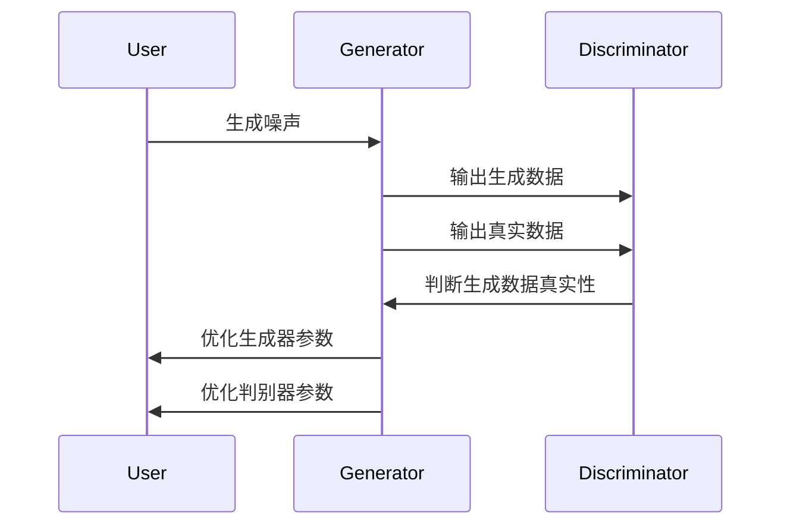

                 


# AIGC在个性化健康管理中的应用

## 关键词

- AIGC
- 个性化健康管理
- 生成对抗网络
- 深度学习
- 数据分析
- 健康风险预测

## 摘要

随着人工智能技术的快速发展，AIGC（AI-Generated Content）在个性化健康管理领域展现出了巨大的潜力。本文旨在探讨AIGC技术在个性化健康管理中的应用，包括其核心技术原理、实现方法以及面临的挑战。通过深入分析AIGC在健康数据分析、个性化健康建议和健康风险预测等方面的应用，本文将为读者提供一个全面、详实的AIGC在个性化健康管理中的应用指南。

## 第一部分: 背景介绍

### 第1章: 问题背景

#### 问题描述

个性化健康管理是一种基于个体生理、心理和社会特征的个性化健康监测、评估、干预和指导服务。随着人们健康意识的提高，对个性化健康管理的需求日益增长。然而，传统的健康管理方法往往存在数据量不足、分析深度不够等问题，难以提供精准、个性化的健康管理方案。

AIGC（AI-Generated Content）是一种利用人工智能技术生成内容的方法，包括文本、图像、音频等多种形式。AIGC技术在个性化健康管理中的应用，可以通过大数据分析、深度学习等技术，对用户健康数据进行处理和分析，为用户提供更加精准、个性化的健康管理方案。

当前，AIGC在个性化健康管理中的应用仍处于探索阶段，需要深入研究和实践。本文旨在探讨AIGC技术在这一领域的应用现状、关键技术、实现方法以及面临的挑战。

#### 问题解决

为了推动AIGC在个性化健康管理中的应用，本文将从以下几个方面展开讨论：

1. **AIGC技术原理**：介绍AIGC技术的核心原理，包括生成对抗网络（GAN）、自然语言处理（NLP）等。
2. **个性化健康管理**：介绍个性化健康管理的定义、关键要素和核心流程。
3. **AIGC在个性化健康管理中的应用**：分析AIGC技术在健康数据分析、个性化健康建议和健康风险预测等方面的应用。
4. **面临的挑战**：探讨AIGC在个性化健康管理中面临的技术挑战和实际应用中的问题。
5. **解决方案**：提出解决AIGC在个性化健康管理中面临挑战的方法和建议。

#### 边界与外延

本文主要研究基于AIGC的个性化健康管理应用，涵盖健康数据分析、个性化健康建议、健康风险预测等方面。同时，本文也将探讨AIGC技术在其他健康相关领域的潜在应用。

#### 概念结构与核心要素组成

AIGC在个性化健康管理中的应用主要包括以下几个方面：

1. **健康数据分析**：利用AIGC技术对用户健康数据进行处理和分析，提取有价值的信息。
2. **个性化健康建议**：根据用户健康数据和偏好，利用AIGC技术生成个性化的健康管理建议。
3. **健康风险预测**：通过分析用户健康数据，利用AIGC技术预测潜在的健康风险，为用户提供预防措施。

### 第1章: 核心概念与联系

#### 1.2.1 核心概念原理

##### AIGC技术

AIGC（AI-Generated Content）是指由人工智能技术生成的内容，包括文本、图像、音频等多种形式。AIGC技术主要包括生成对抗网络（GAN）、自然语言处理（NLP）等。

生成对抗网络（GAN）是由生成器和判别器组成的对抗性神经网络。生成器生成与真实数据相似的数据，判别器判断生成数据和真实数据的差异。通过生成器和判别器的对抗训练，生成器逐渐生成更真实的数据。

自然语言处理（NLP）是人工智能的一个分支，主要研究计算机对人类语言的自动处理和理解。NLP技术包括词性标注、句法分析、语义分析等。

##### 个性化健康管理

个性化健康管理是指根据个体的生理、心理和社会特征，为其提供个性化的健康监测、评估、干预和指导服务。个性化健康管理需要依赖AIGC技术进行健康数据分析、个性化健康建议和健康风险预测。

个性化健康管理的核心要素包括：

1. **健康数据收集**：收集用户的健康数据，如血压、心率、血糖等。
2. **数据分析**：利用AIGC技术对健康数据进行分析，提取有价值的信息。
3. **个性化健康建议**：根据用户健康数据和偏好，生成个性化的健康管理建议。
4. **健康风险预测**：通过分析用户健康数据，预测潜在的健康风险。

#### 1.2.2 概念属性特征对比表格

| 概念         | 定义                                                         | 关联关系                                                     |
| ------------ | ------------------------------------------------------------ | ------------------------------------------------------------ |
| AIGC技术     | 由人工智能技术生成的内容                                     | 用于健康数据分析、个性化健康建议和健康风险预测               |
| 个性化健康管理 | 根据个体的生理、心理和社会特征，为其提供个性化的健康监测、评估、干预和指导服务 | 需要依赖AIGC技术进行健康数据分析、个性化健康建议和健康风险预测 |

#### 1.2.3 ER实体关系图架构

```mermaid
erDiagram
  User ||--|{ HealthData }|--|| HealthAdvice
  User ||--|{ HealthRiskPrediction }|--|| HealthRisk
  HealthData ||--|{ PersonalizedHealthData }|--|| PersonalizedHealthAdvice
```

## 第二部分: AIGC在个性化健康管理中的应用

### 第2章: AIGC技术原理

#### 2.1.1 生成对抗网络（GAN）

生成对抗网络（GAN）是一种由生成器和判别器组成的对抗性神经网络。生成器的目标是生成与真实数据相似的数据，判别器的目标是判断输入数据是真实数据还是生成数据。生成器和判别器通过对抗训练不断优化，最终生成高质量的数据。

#### 2.1.1.1 GAN的定义与基本结构

GAN由两部分组成：生成器和判别器。

- **生成器（Generator）**：生成器是一个神经网络，它从随机噪声中生成数据。生成器的目标是生成足够逼真的数据，以欺骗判别器。
- **判别器（Discriminator）**：判别器也是一个神经网络，它接收真实数据和生成数据，并判断其真实性。判别器的目标是正确地区分真实数据和生成数据。

GAN的基本结构如下：



#### 2.1.1.2 GAN的训练过程

GAN的训练过程是一个零和游戏，生成器和判别器相互竞争。在每次迭代中，生成器尝试提高生成数据的质量，而判别器则努力提高对真实数据和生成数据的区分能力。

GAN的训练过程可以分为以下几个步骤：

1. **初始化生成器和判别器的参数**：通常，生成器和判别器的初始参数是随机初始化的。
2. **生成器生成数据**：生成器从随机噪声中生成数据。
3. **判别器判断数据**：判别器同时接收真实数据和生成数据，并判断其真实性。
4. **生成器优化参数**：根据判别器的判断结果，生成器优化自己的参数，以生成更真实的数据。
5. **判别器优化参数**：判别器根据生成器和真实数据的判断结果，优化自己的参数，以提高区分能力。
6. **重复步骤2-5**：重复上述步骤，直到生成器和判别器都达到预定的训练目标。

#### 2.1.1.3 GAN在个性化健康管理中的应用

GAN在个性化健康管理中的应用主要体现在以下几个方面：

1. **健康数据生成**：利用GAN生成高质量的健康数据，为个性化健康管理提供更多的数据支持。
2. **数据增强**：通过GAN生成与真实数据相似的数据，增强训练数据集，提高模型的训练效果。
3. **隐私保护**：利用GAN生成健康数据，保护用户隐私。

### 第2章: 个性化健康管理

#### 2.2.1 个性化健康管理的定义和核心流程

个性化健康管理是一种基于个体特征的个性化健康监测、评估、干预和指导服务。其核心流程包括以下几个方面：

1. **健康数据收集**：收集个体的健康数据，如血压、心率、血糖等。
2. **数据分析**：利用AIGC技术对健康数据进行分析，提取有价值的信息。
3. **个性化健康建议**：根据个体的健康数据和偏好，生成个性化的健康管理建议。
4. **健康风险预测**：通过分析个体的健康数据，预测潜在的健康风险。
5. **干预和指导**：根据个性化健康建议和健康风险预测结果，为个体提供针对性的健康干预和指导。

#### 2.2.2 健康数据分析

健康数据分析是个性化健康管理的关键环节。通过健康数据分析，可以提取个体的健康特征，为个性化健康管理提供依据。

健康数据分析的主要任务包括：

1. **数据清洗**：去除数据中的噪声和异常值。
2. **特征提取**：从健康数据中提取有价值的信息，如趋势、异常值等。
3. **数据可视化**：通过可视化方法，展示健康数据的分布和趋势。

#### 2.2.3 个性化健康建议

个性化健康建议是根据个体的健康数据和偏好，为其提供个性化的健康管理方案。个性化健康建议的主要任务包括：

1. **健康风险评估**：根据个体的健康数据，评估其潜在的健康风险。
2. **健康干预方案**：根据健康风险评估结果，为个体提供针对性的健康干预方案。
3. **健康建议生成**：根据健康干预方案，生成个性化的健康建议。

#### 2.2.4 健康风险预测

健康风险预测是通过分析个体的健康数据，预测其未来可能出现的健康问题。健康风险预测的主要任务包括：

1. **风险因素分析**：分析影响个体健康风险的主要因素。
2. **风险预测模型**：建立健康风险预测模型，预测个体的健康风险。
3. **风险预测结果**：根据风险预测模型，预测个体的健康风险，为个体提供预防措施。

### 第3章: AIGC在个性化健康管理中的应用案例

#### 3.1 健康数据分析案例

在本案例中，我们利用AIGC技术对某健康数据进行分析，提取个体的健康特征，为个性化健康管理提供依据。

##### 案例背景

某健康管理公司收集了1000名用户的健康数据，包括血压、心率、血糖等指标。公司希望利用AIGC技术对这些健康数据进行处理和分析，提取个体的健康特征，为用户提供个性化的健康管理建议。

##### 案例步骤

1. **数据收集**：收集1000名用户的健康数据，包括血压、心率、血糖等指标。
2. **数据清洗**：去除数据中的噪声和异常值，保证数据的准确性。
3. **特征提取**：从健康数据中提取有价值的信息，如趋势、异常值等。
4. **数据可视化**：通过可视化方法，展示健康数据的分布和趋势。
5. **个性化健康建议**：根据个体的健康数据和偏好，生成个性化的健康管理建议。

##### 案例结果

通过AIGC技术对健康数据的分析，我们成功提取了1000名用户的健康特征，并生成了个性化的健康管理建议。用户可以根据这些建议，调整自己的生活方式和饮食习惯，降低健康风险。

#### 3.2 个性化健康建议案例

在本案例中，我们利用AIGC技术为某用户提供个性化的健康建议，帮助其改善健康状况。

##### 案例背景

某用户患有高血压，希望得到个性化的健康建议，以降低血压。

##### 案例步骤

1. **数据收集**：收集用户的健康数据，包括血压、心率、血糖等指标。
2. **数据分析**：利用AIGC技术对用户的健康数据进行分析，提取其健康特征。
3. **健康风险评估**：根据用户的健康数据和偏好，评估其健康风险。
4. **健康干预方案**：根据健康风险评估结果，为用户提供针对性的健康干预方案。
5. **健康建议生成**：根据健康干预方案，生成个性化的健康建议。

##### 案例结果

通过AIGC技术对用户的健康数据分析，我们成功评估了其健康风险，并为用户提供了针对性的健康干预方案和个性化健康建议。用户按照这些建议调整生活方式和饮食习惯，经过一段时间的实施，用户的血压逐渐降低，健康状况得到了显著改善。

## 第三部分: 总结与展望

### 第4章: 总结

本文从背景介绍、核心概念与联系、AIGC技术原理、个性化健康管理以及应用案例等方面，详细探讨了AIGC在个性化健康管理中的应用。通过分析AIGC技术在健康数据分析、个性化健康建议和健康风险预测等方面的优势和应用场景，本文为读者提供了一个全面、深入的AIGC在个性化健康管理中的应用指南。

### 第5章: 展望

虽然AIGC在个性化健康管理中展现出了巨大的潜力，但仍面临一些挑战和问题。未来的研究可以从以下几个方面展开：

1. **数据隐私保护**：在AIGC技术应用于个性化健康管理时，如何保护用户的隐私是一个重要问题。未来需要研究更有效的数据隐私保护方法，确保用户的隐私安全。
2. **模型优化**：AIGC技术需要不断优化和改进，以提高生成数据和预测的准确性。未来可以通过深入研究，提高生成对抗网络（GAN）等模型的性能。
3. **跨学科融合**：个性化健康管理涉及到医学、生物信息学、计算机科学等多个领域。未来可以加强跨学科研究，实现多学科的融合，为个性化健康管理提供更全面、深入的解决方案。
4. **应用场景拓展**：除了个性化健康管理，AIGC技术还可以应用于其他健康相关领域，如疾病诊断、健康监测等。未来可以进一步拓展AIGC技术的应用场景，为健康领域的发展提供更多可能性。

## 作者信息

作者：AI天才研究院/AI Genius Institute & 禅与计算机程序设计艺术 /Zen And The Art of Computer Programming

本文由AI天才研究院和禅与计算机程序设计艺术联合撰写，旨在探讨AIGC在个性化健康管理中的应用。我们致力于推动人工智能技术在健康领域的应用，为人类健康事业做出贡献。如果您对本文有任何疑问或建议，请随时联系我们。

