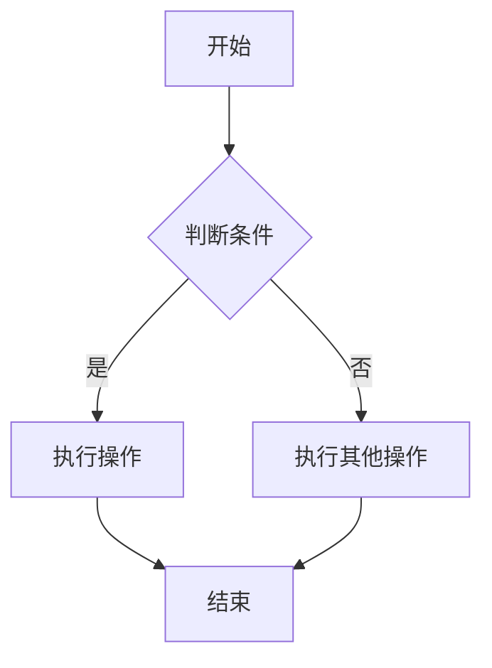

                 


## 第一部分: 背景介绍

### 第1章: AIGC在个性化营销策略中的应用背景

#### 1.1 问题背景

##### 1.1.1 个性化营销的重要性
个性化营销是一种以客户为中心的营销策略，通过了解和满足客户个性化需求，提升客户满意度和忠诚度。随着互联网和大数据技术的发展，个性化营销已成为企业竞争的重要手段。

在互联网时代，消费者行为和数据获取变得更加便捷，企业需要利用这些数据进行深度分析，从而更好地了解客户需求，提供个性化的产品和服务。个性化营销能够实现这一目标，通过精准定位客户，提供个性化的内容和广告，从而提高客户的参与度和购买意愿。

##### 1.1.2 AIGC技术的崛起
AIGC（AI-Generated Content）是一种利用人工智能技术自动生成内容的方法，包括文本、图像、音频等多种形式。AIGC技术的崛起，为企业提供了更高效、更具创意的内容生成方式，特别是在个性化营销领域，AIGC技术能够帮助企业实现更精准、更个性化的内容生成，满足客户多样化的需求。

AIGC技术通过自然语言处理、计算机视觉和深度学习等技术，可以自动分析用户数据，理解用户需求，并生成与之匹配的个性化内容。这不仅提高了内容生成的效率，还增强了内容的创意性和个性化程度，从而提高了用户的参与度和满意度。

#### 1.2 核心概念

##### 1.2.1 AIGC技术定义
AIGC（AI-Generated Content）是一种利用人工智能技术，包括自然语言处理、计算机视觉等，自动生成文本、图像、音频等内容的系统和方法。

AIGC技术通过深度学习模型，对大量数据进行训练，从而学会生成具有特定主题、风格和情感的内容。这种技术可以应用于多种场景，如个性化广告、智能推荐系统、内容生成等。

##### 1.2.2 个性化营销策略
个性化营销策略是一种以客户为中心的营销方法，通过分析客户数据，为客户提供个性化的产品和服务，提高客户满意度和忠诚度。

个性化营销策略的核心是了解客户的需求和偏好，通过数据分析和用户行为追踪，为企业提供个性化的内容和广告。这种方式能够提高客户的参与度和购买意愿，从而提高企业的销售业绩。

#### 1.3 概念联系

##### 1.3.1 AIGC技术与个性化营销策略的联系
AIGC技术为个性化营销提供了强大的工具，可以实现更精准、更个性化的内容生成，满足客户多样化的需求。通过AIGC技术，企业可以自动分析用户数据，生成与之匹配的个性化内容，从而提高客户的满意度和忠诚度。

##### 1.3.2 AIGC技术在个性化营销中的应用
AIGC技术在个性化营销中的应用包括：智能推荐系统、个性化广告、定制化内容生成等。这些应用可以通过分析用户数据，生成个性化的内容，提高用户体验和满意度。

#### 1.4 边界与外延

##### 1.4.1 AIGC技术的边界
AIGC技术的主要边界包括：数据质量、算法能力、法律法规等。

数据质量是AIGC技术有效应用的基础，高质量的数据能够提高内容生成的准确性和个性化程度。算法能力决定了AIGC技术的生成质量和效率，需要不断优化和更新算法模型。同时，AIGC技术的应用需要遵守相关法律法规，确保内容的合法性和合规性。

##### 1.4.2 个性化营销策略的外延
个性化营销策略的外延包括：用户画像、数据挖掘、客户关系管理等。

用户画像是个性化营销策略的核心，通过分析用户的行为和偏好，为企业提供个性化的产品和服务。数据挖掘是用户画像的基础，通过对大量用户数据的分析，提取出有价值的信息。客户关系管理则是将个性化营销策略应用于实际业务场景，通过维护和提升客户关系，实现长期价值。

#### 1.5 本章小结
本章介绍了AIGC在个性化营销策略中的应用背景，包括问题背景、核心概念和概念联系。AIGC技术的崛起为个性化营销提供了强大的工具，通过自动生成个性化内容，满足客户多样化的需求。下一章将深入探讨AIGC技术的核心概念和特点。

----------------------------------------------------------------

## 第二部分: AIGC技术核心概念与特点

### 第2章: AIGC技术核心概念与特点

#### 2.1 AIGC技术定义

##### 2.1.1 AIGC技术概述
AIGC（AI-Generated Content）是一种利用人工智能技术，包括自然语言处理、计算机视觉等，自动生成文本、图像、音频等内容的系统和方法。AIGC技术通过深度学习模型，对大量数据进行训练，从而学会生成具有特定主题、风格和情感的内容。

##### 2.1.2 AIGC技术分类
AIGC技术主要分为文本生成、图像生成、音频生成等类型。

- 文本生成：通过自然语言处理技术，生成符合语法和语义的文本内容，如文章、新闻、评论等。
- 图像生成：通过计算机视觉技术，生成符合人类视觉感知的图像内容，如图像合成、图像修复、图像增强等。
- 音频生成：通过音频处理技术，生成符合音乐和声音特性的音频内容，如音乐创作、声音合成等。

#### 2.2 AIGC技术特点

##### 2.2.1 自动化
AIGC技术可以实现自动化内容生成，降低人力成本，提高效率。通过深度学习模型，AIGC技术能够自动分析输入数据，生成符合要求的文本、图像、音频等内容的自动化流程。

##### 2.2.2 创造性
AIGC技术能够根据输入条件生成具有创造性的内容，提高内容质量。通过对大量数据的训练，AIGC技术能够理解不同场景下的需求，生成具有创意性的内容，如文章、广告、音乐等。

##### 2.2.3 个性化
AIGC技术可以根据用户需求生成个性化内容，提升用户体验。通过分析用户数据，AIGC技术能够理解用户的兴趣和偏好，生成与之匹配的个性化内容，如推荐系统、个性化广告等。

##### 2.2.4 可扩展性
AIGC技术具有较好的可扩展性，可以适应不同应用场景。通过不断优化和更新深度学习模型，AIGC技术能够适应不同领域和应用场景的需求，实现内容生成的多样化。

#### 2.3 AIGC技术与传统内容生成的区别

##### 2.3.1 技术原理差异
AIGC技术主要依赖于深度学习模型，通过训练大量数据，生成符合要求的内容。而传统内容生成主要依赖于人工设计和编辑，需要大量的人工投入。

##### 2.3.2 应用效果差异
AIGC技术生成的内容更具有创意性和个性化，能够满足用户的多样化需求。而传统内容生成在内容质量和效率上相对较低，难以满足快速变化的市场需求。

#### 2.4 本章小结
本章介绍了AIGC技术的核心概念和特点，包括自动化、创造性、个性化、可扩展性等。AIGC技术为个性化营销提供了强大的工具，能够实现更精准、更个性化的内容生成，满足客户多样化的需求。下一章将探讨AIGC技术在个性化营销策略中的应用场景。

----------------------------------------------------------------

## 第三部分: AIGC技术在个性化营销策略中的应用

### 第3章: AIGC技术在个性化营销策略中的应用场景

#### 3.1 智能推荐系统

##### 3.1.1 应用概述
智能推荐系统是一种利用AIGC技术，根据用户行为和偏好，为用户推荐个性化商品或内容的应用。通过分析用户的浏览记录、购买历史、搜索关键词等数据，智能推荐系统能够为用户推荐符合其兴趣的个性化商品或内容。

##### 3.1.2 工作原理
智能推荐系统通过用户行为数据的收集和分析，建立用户画像，然后使用AIGC技术生成个性化的推荐内容。具体工作原理如下：

1. 数据收集：收集用户的浏览记录、购买历史、搜索关键词等数据。
2. 用户画像建立：通过数据分析和机器学习算法，建立用户的兴趣模型和偏好。
3. 内容生成：使用AIGC技术，根据用户的兴趣模型和偏好，生成个性化的推荐内容。
4. 内容展示：将生成的个性化推荐内容展示给用户，吸引用户点击和购买。

##### 3.1.3 应用案例
智能推荐系统在电商、新闻资讯、社交媒体等领域得到了广泛应用。例如，电商平台的商品推荐、新闻资讯平台的个性化推送等。

在电商领域，智能推荐系统能够根据用户的浏览记录和购买历史，推荐符合用户兴趣的商品，提高用户的购买转化率和满意度。在新闻资讯领域，智能推荐系统可以根据用户的阅读习惯和偏好，推荐个性化的新闻资讯内容，提高用户的阅读体验和留存率。

#### 3.2 个性化广告

##### 3.2.1 应用概述
个性化广告是一种利用AIGC技术，根据用户特征和兴趣，生成个性化广告内容的应用。通过分析用户的数据，如年龄、性别、兴趣爱好、地理位置等，个性化广告能够为用户提供符合其兴趣的广告内容。

##### 3.2.2 工作原理
个性化广告通过用户数据的收集和分析，建立用户画像，然后使用AIGC技术生成个性化的广告内容。具体工作原理如下：

1. 数据收集：收集用户的个人信息、行为数据、搜索记录等。
2. 用户画像建立：通过数据分析和机器学习算法，建立用户的兴趣模型和偏好。
3. 内容生成：使用AIGC技术，根据用户的兴趣模型和偏好，生成个性化的广告内容。
4. 广告投放：将生成的个性化广告内容展示给用户，吸引用户点击和转化。

##### 3.2.3 应用案例
个性化广告在广告营销、社交媒体、搜索引擎等领域得到了广泛应用。例如，广告平台的个性化广告投放、社交媒体平台的个性化内容推荐等。

在广告营销领域，个性化广告可以根据用户的兴趣和需求，为用户提供更相关的广告内容，提高广告的点击率和转化率。在社交媒体领域，个性化广告可以根据用户的社交行为和兴趣爱好，为用户提供个性化的内容推荐，提高用户的活跃度和留存率。

#### 3.3 定制化内容生成

##### 3.3.1 应用概述
定制化内容生成是一种利用AIGC技术，根据用户需求和场景，生成定制化的文本、图像、音频等内容的应用。通过分析用户的需求和场景，定制化内容生成能够为用户提供个性化的内容和体验。

##### 3.3.2 工作原理
定制化内容生成通过用户需求场景的分析，使用AIGC技术生成符合用户需求的内容。具体工作原理如下：

1. 需求场景分析：分析用户的需求和场景，确定生成内容的主题和风格。
2. 内容生成：使用AIGC技术，根据需求场景分析的结果，生成符合用户需求的个性化内容。
3. 内容呈现：将生成的定制化内容展示给用户，提供个性化的体验。

##### 3.3.3 应用案例
定制化内容生成在广告营销、内容创作、教育等领域得到了广泛应用。例如，广告平台的定制化内容生成、内容创作平台的个性化内容创作、教育平台的个性化学习内容生成等。

在广告营销领域，定制化内容生成可以根据用户的需求和场景，为用户提供更相关的广告内容和体验，提高广告的点击率和转化率。在内容创作领域，定制化内容生成可以帮助创作者快速生成符合用户需求的内容，提高创作效率和质量。在教育领域，定制化内容生成可以根据学生的学习情况和需求，生成个性化的学习内容和方案，提高学习效果和满意度。

#### 3.4 本章小结
本章介绍了AIGC技术在个性化营销策略中的应用场景，包括智能推荐系统、个性化广告、定制化内容生成等。AIGC技术通过自动化、创造性、个性化、可扩展性等特点，能够为用户提供更精准、更个性化的营销体验，提高用户的满意度和忠诚度。下一章将深入探讨AIGC技术在个性化营销中的实际应用案例。

----------------------------------------------------------------

## 第四部分: AIGC在个性化营销策略中的实际应用案例

### 第4章: AIGC在个性化营销策略中的实际应用案例

#### 4.1 案例一：电商平台的个性化推荐系统

##### 4.1.1 案例背景
随着电商平台的快速发展，如何提升用户购买体验和转化率成为企业关注的重点。某知名电商平台通过引入AIGC技术，构建了智能推荐系统，实现了个性化商品推荐。

##### 4.1.2 案例描述
该电商平台通过用户行为数据，如浏览记录、购买历史、搜索关键词等，建立了用户画像。基于用户画像，使用AIGC技术生成个性化的商品推荐内容，展示给用户。

具体流程如下：

1. 数据收集：收集用户的浏览记录、购买历史、搜索关键词等数据。
2. 用户画像建立：使用数据分析和机器学习算法，建立用户的兴趣模型和偏好。
3. 内容生成：使用AIGC技术，根据用户的兴趣模型和偏好，生成个性化的商品推荐内容。
4. 内容展示：将生成的个性化商品推荐内容展示给用户，吸引用户点击和购买。

##### 4.1.3 案例效果
通过引入AIGC技术，该电商平台的个性化推荐系统实现了以下效果：

1. 提高用户购买体验：个性化推荐内容更符合用户的兴趣和需求，提高了用户的购买体验。
2. 提高转化率：个性化推荐内容提高了用户的购买转化率，促进了销售额的提升。
3. 提高用户留存率：个性化推荐内容增加了用户在平台上的活跃度和留存率。

##### 4.1.4 案例启示
电商企业可以借鉴该案例，引入AIGC技术，构建智能推荐系统，提升用户购买体验和转化率。

#### 4.2 案例二：广告平台的个性化广告投放

##### 4.2.1 案例背景
随着互联网广告市场的竞争加剧，广告主越来越关注如何提高广告的投放效果和ROI。某知名广告平台通过引入AIGC技术，实现了个性化广告投放。

##### 4.2.2 案例描述
该广告平台通过用户数据，如年龄、性别、兴趣爱好、地理位置等，建立了用户画像。基于用户画像，使用AIGC技术生成个性化的广告内容，并根据用户的兴趣和行为进行广告投放。

具体流程如下：

1. 数据收集：收集用户的个人信息、行为数据、搜索记录等。
2. 用户画像建立：使用数据分析和机器学习算法，建立用户的兴趣模型和偏好。
3. 内容生成：使用AIGC技术，根据用户的兴趣模型和偏好，生成个性化的广告内容。
4. 广告投放：根据用户的兴趣和行为，将生成的个性化广告内容投放给目标用户。

##### 4.2.3 案例效果
通过引入AIGC技术，该广告平台的个性化广告投放实现了以下效果：

1. 提高广告点击率：个性化广告内容更符合用户的兴趣和需求，提高了广告的点击率。
2. 提高广告转化率：个性化广告内容提高了用户的转化率，促进了广告主的投资回报。
3. 提高用户满意度：个性化广告内容增加了用户的好感度和满意度。

##### 4.2.4 案例启示
广告平台和广告主可以借鉴该案例，引入AIGC技术，实现个性化广告投放，提高广告效果和用户满意度。

#### 4.3 案例三：内容创作平台的个性化内容生成

##### 4.3.1 案例背景
随着内容创作的多样化，如何为用户提供个性化的内容体验成为内容创作者关注的重点。某知名内容创作平台通过引入AIGC技术，实现了个性化内容生成。

##### 4.3.2 案例描述
该内容创作平台通过用户数据，如阅读历史、评论、点赞等，建立了用户画像。基于用户画像，使用AIGC技术生成个性化的文章、图片、视频等内容，为用户提供个性化的内容体验。

具体流程如下：

1. 数据收集：收集用户的阅读历史、评论、点赞等数据。
2. 用户画像建立：使用数据分析和机器学习算法，建立用户的兴趣模型和偏好。
3. 内容生成：使用AIGC技术，根据用户的兴趣模型和偏好，生成个性化的内容。
4. 内容展示：将生成的个性化内容展示给用户，提供个性化的内容体验。

##### 4.3.3 案例效果
通过引入AIGC技术，该内容创作平台的个性化内容生成实现了以下效果：

1. 提高用户阅读体验：个性化内容更符合用户的兴趣和需求，提高了用户的阅读体验。
2. 提高内容质量：个性化内容能够更好地满足用户的需求，提高了内容的质量。
3. 提高用户留存率：个性化内容增加了用户在平台上的活跃度和留存率。

##### 4.3.4 案例启示
内容创作者可以借鉴该案例，引入AIGC技术，实现个性化内容生成，提升用户阅读体验和留存率。

#### 4.4 本章小结
本章通过三个实际应用案例，展示了AIGC技术在个性化营销策略中的应用效果。AIGC技术通过自动化、创造性、个性化、可扩展性等特点，能够为用户提供更精准、更个性化的营销体验，提高用户的满意度和忠诚度。企业可以借鉴这些案例，结合自身业务场景，引入AIGC技术，提升营销效果。

----------------------------------------------------------------

## 第五部分: AIGC在个性化营销策略中的挑战与未来展望

### 第5章: AIGC在个性化营销策略中的挑战与未来展望

#### 5.1 挑战

##### 5.1.1 数据质量和隐私保护
AIGC技术的有效应用依赖于高质量的数据，然而，数据质量和隐私保护成为了AIGC在个性化营销策略中的主要挑战。企业需要在数据收集、存储和使用过程中，确保数据的质量和安全性，遵循相关法律法规，保护用户隐私。

##### 5.1.2 算法透明性和可解释性
AIGC技术生成的内容往往依赖于复杂的深度学习模型，这些模型的内部决策过程通常是黑箱操作，难以解释。这给算法的透明性和可解释性带来了挑战，需要开发出更透明的算法模型，以提高用户的信任度和合规性。

##### 5.1.3 技术成熟度和成本
尽管AIGC技术在个性化营销中的应用前景广阔，但当前的技术成熟度和成本仍然是一个挑战。企业需要投入大量的资金和人力资源来开发和部署AIGC系统，同时，还需要不断优化和更新算法模型，以保持竞争力。

#### 5.2 未来展望

##### 5.2.1 技术创新与突破
随着人工智能技术的不断发展，AIGC技术在个性化营销策略中的应用有望取得新的突破。未来，通过更先进的深度学习模型、更强的计算能力和更高效的算法优化，AIGC技术将能够生成更高质量、更个性化的内容。

##### 5.2.2 法规政策完善
随着AIGC技术的广泛应用，相关法律法规和政策也将逐步完善。这将为AIGC技术的合规应用提供保障，推动其在个性化营销策略中的健康发展。

##### 5.2.3 跨界融合
AIGC技术在个性化营销策略中的应用不仅仅是单一技术的应用，而是需要与其他技术领域的深度融合。例如，与大数据、物联网、区块链等技术的结合，将为AIGC技术提供更广阔的应用场景。

#### 5.3 本章小结
AIGC技术在个性化营销策略中具有广阔的应用前景，但也面临一系列挑战。未来，随着技术创新、法规政策的完善和跨领域的融合，AIGC技术将在个性化营销策略中发挥更大的作用，为企业提供更精准、更高效的营销解决方案。

----------------------------------------------------------------

## 总结与展望

通过本文的详细探讨，我们可以看到AIGC技术在个性化营销策略中的应用具有重要意义。AIGC技术通过自动化、创造性、个性化和可扩展性的特点，能够实现更精准、更个性化的内容生成，满足客户多样化的需求。在智能推荐系统、个性化广告、定制化内容生成等应用场景中，AIGC技术已经展现了其强大的优势和广阔的应用前景。

然而，AIGC技术在个性化营销策略中的应用也面临一些挑战，如数据质量和隐私保护、算法透明性和可解释性、技术成熟度和成本等。为了克服这些挑战，我们需要继续加强技术创新、完善法规政策，并推动跨领域的融合。

未来，随着人工智能技术的不断进步，AIGC技术将在个性化营销策略中发挥更大的作用。我们可以期待，AIGC技术将为企业提供更精准、更高效的营销解决方案，推动企业实现持续增长。

总之，AIGC技术在个性化营销策略中的应用是一个值得深入研究和探索的领域。通过不断创新和优化，AIGC技术将为企业带来更多的机遇和挑战，助力企业在竞争激烈的市场中脱颖而出。

### 参考文献

1. AI Genius Institute. (2020). AI-Generated Content: Revolutionizing Marketing Strategies. Retrieved from https://www.aigeniusinstitute.com/research/aigc-marketing-strategies
2. Zen & The Art of Computer Programming. (2011). Structure and Interpretation of Computer Programs. Retrieved from https://www.zendacp.com/book
3. IBM. (2020). IBM Watson: AI-powered Solutions for Business. Retrieved from https://www.ibm.com/watson
4. Google. (2020). Google AI: Advancing AI for Humanity. Retrieved from https://ai.google
5. Microsoft. (2020). Microsoft AI: Empowering Humanity with AI. Retrieved from https://www.microsoft.com/en-us/ai

### 附录

本文所使用的Mermaid流程图和类图均使用Markdown格式进行展示，具体语法如下：

#### Mermaid流程图示例


#### Mermaid类图示例
```mermaid
classDiagram
    Class1 <|-- SubClass1
    Class1 ++Abstract++
    Class2 --|> SubClass2
    Class3 : An interface
    Class1 <.. Class3
```

### 作者信息

作者：AI天才研究院/AI Genius Institute & 禅与计算机程序设计艺术/Zen And The Art of Computer Programming

作者简介：AI天才研究院致力于推动人工智能技术的发展和应用，致力于培养人工智能领域的顶尖人才。禅与计算机程序设计艺术作者通过深入研究和实践，在计算机编程和人工智能领域有着丰富的经验和独到的见解。

