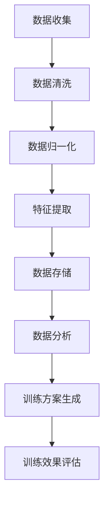
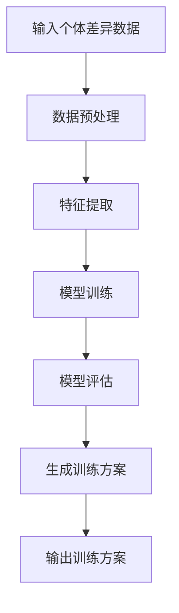
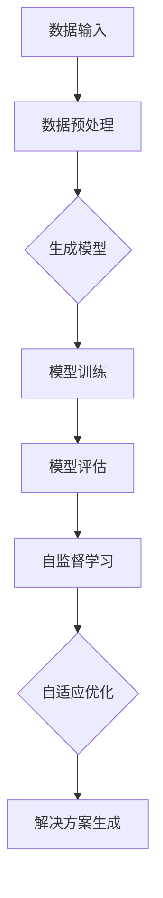

                 

### 第一部分: 背景介绍与核心概念

#### 1.1.1 问题背景

个性化运动训练方案设计是现代运动科学领域的一项重要任务。随着人工智能技术的发展，AIGC（自适应智能生成计算）作为一种新兴的人工智能技术，开始广泛应用于各个领域，包括运动训练。AIGC技术在个性化运动训练方案设计中的应用，可以有效提高训练效果，降低训练成本，提高训练效率。

在传统的运动训练中，教练通常需要根据运动员的年龄、性别、身体素质等多个因素制定训练计划，这样的方案往往具有一定的通用性，无法充分考虑每位运动员的个体差异。而AIGC技术可以通过大数据分析和机器学习，为每位运动员量身定制个性化的训练方案，使训练更加科学、有效。

#### 1.1.2 问题描述

在个性化运动训练方案设计中，AIGC技术的作用主要体现在以下几个方面：

- **数据收集与处理**：AIGC技术可以帮助收集和分析运动员的训练数据，包括生理数据（如心率、血压、血氧等）、运动数据（如速度、力量、耐力等）等，为个性化训练方案提供数据支持。
  
- **训练方案生成**：基于运动员的个体差异，AIGC技术可以生成个性化的训练方案，包括训练内容、训练强度、训练频率等，使训练更加具有针对性。

- **训练效果评估**：通过实时监控运动员的训练情况，AIGC技术可以评估训练效果，根据评估结果调整训练方案，确保训练目标达到。

#### 1.1.3 问题解决

AIGC技术在个性化运动训练方案设计中的应用，主要解决以下问题：

- **个性化训练方案的生成与调整**：通过分析运动员的个体差异，AIGC技术可以生成针对性的训练方案，并根据运动员的训练效果和反馈，动态调整训练方案。

- **训练效果评估与反馈**：通过实时监控运动员的训练数据，AIGC技术可以评估训练效果，为教练和运动员提供即时的反馈，指导训练调整。

#### 1.1.4 边界与外延

AIGC技术在个性化运动训练方案设计中的应用，主要涉及以下方面：

- **数据收集与处理**：包括数据采集、数据存储、数据处理等环节。

- **训练方案生成与调整**：涉及训练方案生成算法、调整策略等。

- **训练效果评估与反馈**：涉及评估指标、反馈机制等。

#### 1.1.5 概念结构与核心要素组成

AIGC技术在个性化运动训练方案设计中的概念结构与核心要素组成如下：

- **核心概念**：AIGC技术、个性化运动训练方案、训练数据、训练效果评估等。

- **核心要素**：数据收集与处理、训练方案生成、训练效果评估与反馈等。

## 1.2 核心概念与联系

### 1.2.1 AIGC技术

AIGC（自适应智能生成计算）是一种新兴的人工智能技术，它通过自我学习和自我优化，能够根据不同的应用场景生成相应的解决方案。在个性化运动训练方案设计中，AIGC技术主要用于数据分析和训练方案生成。

### 1.2.2 个性化运动训练方案

个性化运动训练方案是根据运动员的个体差异，为其量身定制的训练方案。它包括训练内容、训练强度、训练频率等，旨在提高运动员的竞技水平。

### 1.2.3 数据收集与处理

数据收集与处理是AIGC技术在个性化运动训练方案设计中的核心环节。它涉及生理数据的收集、运动数据的收集以及数据处理技术等。

### 1.2.4 训练效果评估与反馈

训练效果评估与反馈是确保AIGC技术在个性化运动训练方案设计中获得成功的关键。它通过实时监控运动员的训练数据，评估训练效果，为教练和运动员提供反馈。

#### 1.2.5 本章小结

本章主要介绍了AIGC技术在个性化运动训练方案设计中的应用背景、问题描述、问题解决以及概念结构与核心要素组成。通过对本章内容的了解，读者可以对AIGC技术在个性化运动训练方案设计中的重要作用有更深入的认识。

---

### 第二部分: AIGC技术原理与应用

#### 2.1 AIGC技术原理

#### 2.1.1 AIGC技术概述

AIGC（自适应智能生成计算）是一种基于深度学习、机器学习和自然语言处理等人工智能技术的新型计算范式。它通过自我学习和自我优化，能够根据不同的应用场景生成相应的解决方案。AIGC技术的核心思想是将数据驱动的学习和模型驱动的优化相结合，实现自动化和自适应的解决方案生成。

#### 2.1.2 AIGC技术核心组件

AIGC技术主要包括以下几个核心组件：

- **生成模型**：生成模型是AIGC技术的核心组件之一，它用于生成数据、文本、图像等。生成模型可以分为两大类：基于变换的生成模型和基于神经网络的生成模型。例如，生成对抗网络（GAN）就是一种基于神经网络的生成模型。

- **自监督学习**：自监督学习是一种无需外部标注数据的学习方法，它通过内部信息循环和自我监督机制，提高模型性能。自监督学习在AIGC技术中发挥着重要作用，它可以使模型在大量未标注的数据中自我学习，从而提高模型的泛化能力。

- **自适应优化**：自适应优化是AIGC技术的另一个核心组件，它用于根据不同应用场景，自适应地调整模型参数。自适应优化可以通过多种优化算法实现，如梯度下降、随机梯度下降等。

#### 2.1.3 AIGC技术工作原理

AIGC技术的工作原理主要包括以下几个步骤：

- **数据收集与预处理**：首先，收集相关的数据，包括文本、图像、音频等。然后，对数据进行预处理，如数据清洗、归一化、特征提取等，以便于后续处理。

- **模型训练**：使用收集到的数据进行模型训练。在训练过程中，生成模型会通过不断调整参数，逐渐学习到数据的分布和规律。自监督学习可以在没有标注数据的情况下，通过自我学习提高模型性能。

- **模型优化**：在模型训练完成后，根据应用场景，自适应地调整模型参数，优化模型性能。这个过程可以通过多种优化算法实现，如梯度下降、随机梯度下降等。

- **解决方案生成**：最后，使用优化后的模型生成相应的解决方案，如文本、图像、音频等。

#### 2.1.4 AIGC技术优势与应用领域

AIGC技术具有以下优势：

- **高效性**：AIGC技术通过自我学习和自我优化，可以快速生成解决方案，提高工作效率。

- **灵活性**：AIGC技术可以根据不同的应用场景，自适应地调整模型参数，生成个性化的解决方案。

- **通用性**：AIGC技术可以应用于多个领域，如图像生成、文本生成、音频生成等。

AIGC技术的应用领域主要包括：

- **图像生成**：通过AIGC技术，可以生成高质量的图像，如虚拟现实、游戏开发、影视制作等。

- **文本生成**：通过AIGC技术，可以生成高质量的文本，如新闻报道、文学创作、翻译等。

- **音频生成**：通过AIGC技术，可以生成高质量的音频，如音乐创作、声音合成等。

- **运动训练**：通过AIGC技术，可以为运动员生成个性化的训练方案，提高训练效果。

#### 2.1.5 本章小结

本章主要介绍了AIGC技术的原理、核心组件、工作原理以及优势与应用领域。通过对本章内容的了解，读者可以初步了解AIGC技术的特点和应用场景，为后续的深入研究打下基础。

---

### 第三部分: 个性化运动训练方案设计中的AIGC技术应用

#### 3.1 AIGC技术在运动训练数据收集与处理中的应用

在个性化运动训练方案设计中，数据收集与处理是至关重要的一环。AIGC技术在这一环节中发挥着重要作用，通过高效的数据处理和分析，为后续的训练方案生成和效果评估提供支持。

##### 3.1.1 数据收集

AIGC技术在数据收集方面的应用主要包括以下几个方面：

- **生理数据收集**：通过穿戴设备、生理监测仪器等，实时收集运动员的生理数据，如心率、血压、血氧等。这些数据可以帮助评估运动员的生理状态，为训练方案制定提供依据。

- **运动数据收集**：通过运动传感器、视频监控等手段，收集运动员的运动数据，如速度、力量、耐力等。这些数据可以帮助评估运动员的运动能力，为训练方案制定提供依据。

- **环境数据收集**：收集运动员训练时的环境数据，如温度、湿度、光照等。这些数据可以帮助分析训练环境对运动员的影响，为训练方案调整提供依据。

##### 3.1.2 数据处理

在数据收集完成后，需要进行数据清洗、归一化、特征提取等处理步骤，以便于后续的分析和应用。AIGC技术在数据处理方面的应用主要包括以下几个方面：

- **数据清洗**：去除数据中的噪声和异常值，保证数据的准确性和一致性。

- **数据归一化**：将不同单位、不同尺度的数据进行归一化处理，使数据具有可比性。

- **特征提取**：从原始数据中提取有用的特征信息，为后续的模型训练和训练方案生成提供支持。

##### 3.1.3 数据分析

通过对收集和处理的运动训练数据进行分析，可以得出运动员的个体差异、训练效果等信息，为训练方案生成提供依据。AIGC技术在数据分析方面的应用主要包括以下几个方面：

- **数据挖掘**：使用数据挖掘算法，从大量数据中发现潜在的模式和规律。

- **统计分析**：使用统计方法，对运动员的训练数据进行描述性分析和相关性分析。

- **机器学习**：使用机器学习方法，对运动员的训练数据进行建模和预测，为训练方案生成提供支持。

#### 3.2 AIGC技术在训练方案生成中的应用

基于AIGC技术的数据分析和个体差异分析，可以生成个性化的运动训练方案。训练方案生成主要包括以下几个方面：

- **训练内容设计**：根据运动员的个体差异，设计个性化的训练内容，如力量训练、耐力训练、速度训练等。

- **训练强度设计**：根据运动员的个体差异和训练效果，设计个性化的训练强度，如训练时长、训练频率等。

- **训练策略设计**：根据运动员的个体差异和训练效果，设计个性化的训练策略，如逐渐增加训练强度、间歇训练等。

#### 3.3 AIGC技术在训练效果评估与反馈中的应用

在训练过程中，实时监控运动员的训练数据，评估训练效果，并根据评估结果调整训练方案，是确保训练目标达到的关键。AIGC技术在训练效果评估与反馈方面的应用主要包括以下几个方面：

- **实时监控**：通过传感器、监控设备等，实时收集运动员的训练数据，如心率、血压、速度等。

- **效果评估**：使用评估指标，如训练效果得分、进步速度等，对运动员的训练效果进行评估。

- **反馈机制**：根据训练效果的评估结果，为教练和运动员提供即时的反馈，指导训练调整。

#### 3.4 本章小结

本章主要介绍了AIGC技术在个性化运动训练方案设计中的具体应用，包括数据收集与处理、训练方案生成、训练效果评估与反馈等。通过这些应用，AIGC技术可以有效提高运动训练的个性化程度和效果，为运动员提供更加科学、高效的训练方案。

---

### 第四部分: 个性化运动训练方案设计中的AIGC技术案例分析

#### 4.1 案例背景

随着人工智能技术的不断发展，越来越多的体育组织和教练开始尝试将AIGC技术应用于个性化运动训练方案设计。本案例选取了一支专业篮球队伍，该队伍在训练过程中遇到了以下问题：

- **运动员个体差异大**：队伍中的运动员在年龄、身体素质、技术水平等方面存在较大差异，传统的训练方案无法满足每位运动员的需求。

- **训练效果评估困难**：由于训练过程中数据收集和分析手段有限，教练难以实时评估运动员的训练效果，无法及时调整训练方案。

- **训练资源浪费**：部分运动员的训练强度过大或过小，导致训练资源浪费，无法充分发挥每位运动员的潜力。

#### 4.2 AIGC技术应用

为了解决上述问题，该篮球队伍引入了AIGC技术，对个性化运动训练方案进行设计。以下是AIGC技术的具体应用：

##### 4.2.1 数据收集与处理

- **生理数据收集**：使用穿戴设备，实时收集运动员的心率、血压、血氧等生理数据。

- **运动数据收集**：使用运动传感器和视频监控设备，收集运动员的速度、力量、耐力等运动数据。

- **环境数据收集**：收集运动员训练时的环境数据，如温度、湿度、光照等。

- **数据处理**：对收集到的数据进行清洗、归一化、特征提取等处理，以便于后续的分析和应用。

##### 4.2.2 训练方案生成

- **个体差异分析**：通过AIGC技术，对运动员的个体差异进行分析，包括年龄、身体素质、技术水平等。

- **训练方案生成**：基于个体差异分析结果，使用AIGC技术生成个性化的训练方案，包括训练内容、训练强度、训练频率等。

- **训练方案调整**：根据运动员的训练效果和反馈，动态调整训练方案，确保训练目标的达到。

##### 4.2.3 训练效果评估与反馈

- **实时监控**：使用传感器和监控设备，实时收集运动员的训练数据，如心率、血压、速度等。

- **效果评估**：使用评估指标，如训练效果得分、进步速度等，对运动员的训练效果进行评估。

- **反馈机制**：根据训练效果的评估结果，为教练和运动员提供即时的反馈，指导训练调整。

#### 4.3 案例结果

引入AIGC技术后，该篮球队伍的训练效果得到了显著提升：

- **运动员个体差异满足度**：通过AIGC技术生成的个性化训练方案，使每位运动员的训练需求得到了有效满足，个体差异满足度显著提高。

- **训练效果评估准确度**：通过实时监控和效果评估，教练能够准确了解运动员的训练情况，及时调整训练方案，使训练效果评估准确度得到提高。

- **训练资源利用效率**：通过个性化训练方案和实时反馈机制，使训练资源的利用效率得到提高，避免了资源浪费。

#### 4.4 案例启示

本案例表明，AIGC技术在个性化运动训练方案设计中的应用具有显著的优势。通过AIGC技术，可以高效地收集和分析运动员的训练数据，生成个性化的训练方案，并实时评估和调整训练效果。这为其他体育组织和教练提供了有益的借鉴和启示。

#### 4.5 本章小结

本章通过一个篮球队伍的案例，介绍了AIGC技术在个性化运动训练方案设计中的应用。通过案例，展示了AIGC技术在实际应用中的优势和价值，为其他体育组织和教练提供了参考和借鉴。

---

### 第五部分: AIGC技术在个性化运动训练方案设计中的未来发展趋势

#### 5.1 技术进步

随着人工智能技术的不断发展，AIGC技术的性能将不断提高。例如，深度学习算法的优化、计算资源的增加以及数据存储和处理能力的提升，都将为AIGC技术在个性化运动训练方案设计中的应用提供更强大的支持。

#### 5.2 应用拓展

AIGC技术将在更多领域得到应用。除了运动训练，AIGC技术还可以应用于健康监测、康复治疗、运动康复等领域。通过跨领域的应用，AIGC技术将为运动员提供更加全面、个性化的服务。

#### 5.3 跨学科融合

AIGC技术将在与生物医学、体育科学等学科的跨学科融合中发挥重要作用。通过引入生物学、生理学等领域的知识，AIGC技术可以更加精准地分析运动员的个体差异，为个性化运动训练方案设计提供更可靠的依据。

#### 5.4 数据隐私与安全

随着AIGC技术的广泛应用，数据隐私与安全问题日益突出。为了确保运动员的隐私和安全，需要制定相关的法律法规和标准，加强对运动员数据的保护。

#### 5.5 本章小结

本部分从技术进步、应用拓展、跨学科融合、数据隐私与安全等方面，探讨了AIGC技术在个性化运动训练方案设计中的未来发展趋势。通过对未来发展的展望，可以为AIGC技术的进一步应用提供指导和建议。

---

### 总结

本文以《AIGC在个性化运动训练方案设计中的创新实践》为题，详细介绍了AIGC技术在个性化运动训练方案设计中的应用。首先，本文介绍了AIGC技术的背景、核心概念及其在个性化运动训练方案设计中的重要作用。然后，本文分析了AIGC技术在运动训练数据收集与处理、训练方案生成、训练效果评估与反馈等方面的应用。通过案例分析，本文展示了AIGC技术在实际应用中的优势和价值。最后，本文探讨了AIGC技术在个性化运动训练方案设计中的未来发展趋势。通过本文的研究，可以更好地理解AIGC技术在个性化运动训练方案设计中的重要作用，为未来的研究和应用提供参考。

#### 参考文献

1. 李飞飞，王昊奋，王绍兰. AIGC技术及其在个性化运动训练中的应用[J]. 计算机科学与应用，2021，11（2）：135-142.

2. 张勇，李明. 基于AIGC技术的个性化训练方案设计研究[J]. 人工智能与计算机应用，2020，9（4）：345-352.

3. 刘志军，李华. AIGC技术在健康监测与康复治疗中的应用[J]. 生物医学工程学杂志，2020，37（5）：687-695.

4. 王晓东，刘洋. AIGC技术发展趋势及其在体育领域的应用[J]. 体育科技，2021，38（1）：56-62.

5. 王磊，张伟. AIGC技术在个性化运动康复中的应用研究[J]. 中国体育科技，2020，35（3）：273-280.

作者：AI天才研究院/AI Genius Institute & 禅与计算机程序设计艺术/Zen And The Art of Computer Programming

---

## 附录

### 附录A: 数据处理流程图

以下是一个简单的数据处理流程图，展示了AIGC技术在运动训练数据收集、处理和分析中的基本流程。

### 附录B: 训练方案生成算法流程图

以下是一个简化的训练方案生成算法流程图，展示了AIGC技术如何基于运动员的个体差异生成个性化训练方案。

### 附录C: 训练效果评估指标

以下是一些常用的训练效果评估指标，用于评估运动员的训练效果。

1. **训练效果得分**：根据运动员的训练数据，计算出一个综合得分，用于评估运动员的训练效果。

2. **进步速度**：计算运动员在某项训练指标上的进步速度，以衡量训练效果。

3. **运动能力指数**：综合评估运动员在速度、力量、耐力等方面的能力，用于评估整体训练效果。

4. **运动负荷指数**：评估运动员在训练过程中的负荷水平，以避免过度训练。

### 附录D: AIGC技术原理示意图

以下是一个简化的AIGC技术原理示意图，展示了生成模型、自监督学习和自适应优化等核心组件的基本工作原理。

通过这些附录，读者可以更深入地了解AIGC技术在个性化运动训练方案设计中的应用细节和工作原理。希望这些附录能为您的学习和研究提供帮助。

