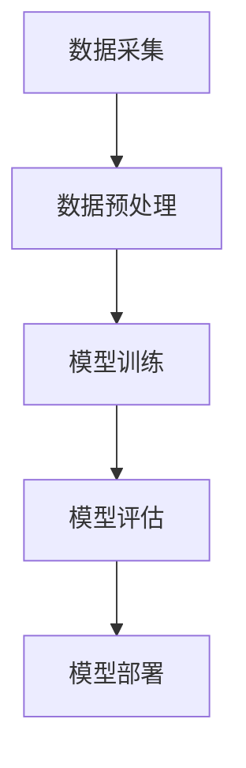
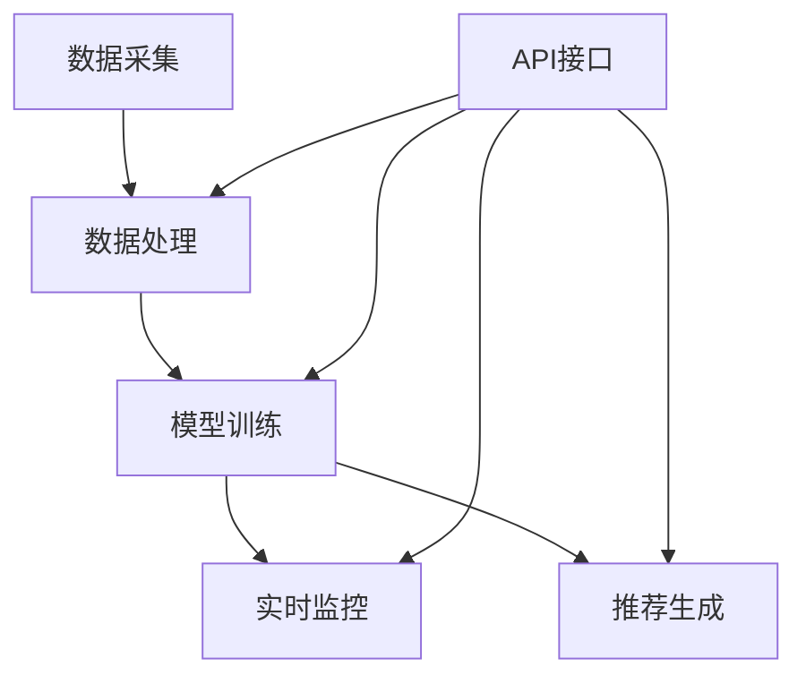

                 


## 第一部分: 引言

### 1.1 问题背景

#### 1.1.1 AIGC的发展背景
随着人工智能技术的不断进步，生成对抗网络（GAN）、自编码器（AE）、变分自编码器（VAE）等新型生成模型应运而生，AIGC（AI-Generated Content）作为人工智能技术的新兴领域，逐渐受到了广泛关注。AIGC不仅能够生成高质量的自然语言文本、图像、音频等多种类型的内容，还可以实现自动化创作、智能交互等功能，极大地拓展了人工智能的应用场景。

AIGC的发展得益于深度学习技术的进步。深度学习作为一种模拟人脑神经网络结构的机器学习技术，在图像识别、自然语言处理等领域取得了显著成果。随着生成对抗网络（GAN）等生成模型的提出，人工智能从传统的数据驱动转变为数据生成与数据驱动相结合的模式。这种模式使得人工智能系统能够自动生成高质量的数据，从而实现更广泛的自动化创作和应用。

#### 1.1.2 智能客户服务质量监控的需求
在现代商业环境中，客户服务质量（CSQ）是企业成功的关键因素之一。随着客户期望的不断提高和市场竞争的加剧，企业需要更高效、更智能地监控客户服务质量。传统的客户服务监控系统主要依赖于人工评估和数据分析，存在效率低、实时性差等问题。因此，引入AIGC技术，通过智能化手段提升客户服务质量监控的效率和质量，成为企业的一项迫切需求。

智能客户服务质量监控主要涉及客户满意度评估、服务响应速度、问题解决率等关键指标。客户满意度是企业绩效的重要指标，它直接关系到企业的品牌形象和市场份额。然而，传统的监控手段往往难以准确评估客户满意度，导致企业无法及时调整服务策略。此外，服务响应速度和问题解决率也是衡量客户服务质量的重要指标。在市场竞争激烈的环境中，企业需要快速响应客户需求，解决客户问题，以提高客户满意度和忠诚度。

### 1.2 问题描述

#### 1.2.1 客户服务质量监控的问题
客户服务质量监控主要涉及客户满意度评估、服务响应速度、问题解决率等关键指标。然而，传统监控手段往往存在以下问题：

1. 数据获取有限：传统监控系统依赖于用户反馈和人工记录，数据获取范围和深度受到限制。
2. 实时性不足：传统监控方式难以实现对客户服务过程的实时监控和反馈。
3. 人工成本高：人工评估效率低，且容易受到主观因素的影响。

#### 1.2.2 AIGC在客户服务质量监控中的应用
AIGC技术能够通过自动化生成大量高质量的数据，提供更加全面、实时的监控信息，从而弥补传统监控手段的不足。具体应用包括：

1. 自动化生成客户评价：利用自然语言处理（NLP）技术，对客户服务过程中的文本数据进行解析和生成，实现自动化评估。
2. 实时监控客户反馈：通过语音识别、图像识别等技术，实时捕捉客户反馈，快速识别客户需求。
3. 个性化服务推荐：基于对客户数据的分析，提供个性化的服务推荐，提高客户满意度。

### 1.3 问题解决

#### 1.3.1 AIGC技术原理
AIGC技术主要基于生成对抗网络（GAN）、自编码器（AE）和变分自编码器（VAE）等生成模型。这些模型通过学习数据分布，能够生成高质量的数据，从而应用于客户服务质量监控。

1. 生成对抗网络（GAN）：GAN由生成器和判别器组成，通过对抗训练生成逼真的数据。生成器生成数据，判别器判断生成数据与真实数据的真假，两者相互竞争，从而提高生成数据的真实性和质量。

2. 自编码器（AE）：AE通过编码和解码过程学习数据的特征表示，用于生成或压缩数据。AE将输入数据编码为低维特征向量，然后解码为输出数据，通过训练学习数据的特征表示。

3. 变分自编码器（VAE）：VAE引入了变分自编码器，通过概率模型学习数据的特征分布。VAE通过生成数据的概率分布来学习数据特征，从而生成更加多样化的数据。

#### 1.3.2 AIGC在客户服务质量监控中的应用策略
基于AIGC技术，我们可以采取以下策略来提升客户服务质量监控：

1. 数据采集与预处理：利用NLP、图像识别等技术，采集并预处理客户服务过程中的各种数据。
2. 数据生成与评估：利用GAN、AE、VAE等技术生成高质量的数据，并对其进行评估。
3. 实时监控与反馈：基于生成数据，实现对客户服务质量的实时监控和反馈。
4. 个性化服务推荐：利用客户数据分析，提供个性化服务推荐，提高客户满意度。

### 1.4 边界与外延

#### 1.4.1 边界
1. 数据质量：保证生成数据的真实性和可靠性。
2. 系统稳定性：确保监控系统在高负载、大数据量的情况下稳定运行。
3. 用户隐私：保护用户隐私，避免数据泄露。

#### 1.4.2 外延
1. 产业链协同：AIGC技术的发展离不开产业链上下游企业的协同创新。
2. 政策法规：遵循相关法律法规，确保技术应用合规。

### 1.5 概念结构与核心要素组成

#### 1.5.1 概念结构
1. AIGC：生成对抗网络、自编码器、变分自编码器等生成模型。
2. 客户服务质量监控：数据采集、数据生成、实时监控、个性化服务推荐等环节。

#### 1.5.2 核心要素组成
1. 数据集：AIGC训练的基础。
2. 算法模型：生成数据的核心。
3. 实时监控：确保服务质量的关键。
4. 个性化推荐：提高客户满意度的手段。

### 1.6 本章小结
本章介绍了AIGC在智能客户服务质量监控中的应用背景、问题描述、问题解决策略以及边界与外延。通过本章的学习，读者可以初步了解AIGC在客户服务质量监控中的价值和应用前景。

----------------------------------------------------------------

## 第二部分: AIGC技术基础

### 2.1 AIGC核心概念与原理

#### 2.1.1 生成对抗网络（GAN）

#### 2.1.1.1 GAN的组成部分
生成对抗网络（GAN）由生成器（Generator）和判别器（Discriminator）两部分组成。生成器负责生成与真实数据相似的数据，判别器则负责区分生成数据与真实数据。这两个部分通过对抗训练相互博弈，从而提高生成数据的质量。

**生成器**：生成器的输入是一个随机噪声向量\( z \)，其输出是一个假数据\( x_g \)。生成器的目的是使得\( x_g \)尽可能地接近真实数据\( x_r \)。

\[ G(z) = x_g \]

**判别器**：判别器的输入是真实数据\( x_r \)和生成器生成的假数据\( x_g \)，其输出是一个概率值\( p(x) \)，表示输入数据为真实数据的概率。

\[ D(x_r) = p(x_r) \]
\[ D(x_g) = p(x_g) \]

**对抗训练**：在训练过程中，生成器和判别器相互对抗。生成器的目标是使得判别器无法区分生成数据和真实数据，而判别器的目标是尽可能地正确区分两者。具体训练过程如下：

1. 随机生成一个噪声向量\( z \)，通过生成器\( G \)生成假数据\( x_g \)。
2. 将假数据\( x_g \)和真实数据\( x_r \)同时输入判别器\( D \)，计算判别器的损失函数。
3. 对判别器\( D \)进行梯度下降优化，使其能够更好地区分生成数据和真实数据。
4. 随机生成一个噪声向量\( z \)，通过生成器\( G \)生成假数据\( x_g \)，计算生成器的损失函数。
5. 对生成器\( G \)进行梯度下降优化，使其生成的数据更接近真实数据。

#### 2.1.1.2 GAN的优势与挑战

**优势**：

1. **自适应性**：GAN能够自适应地学习数据的分布，不需要显式地建模。
2. **灵活性**：GAN可以应用于生成各种类型的数据，如图像、文本、音频等。
3. **高质量生成**：通过对抗训练，GAN能够生成高质量的假数据。

**挑战**：

1. **模式崩溃**：在训练过程中，生成器可能会生成质量较低的伪模式。
2. **训练不稳定**：GAN的训练过程可能会出现不稳定的情况，导致训练失败。
3. **计算成本高**：GAN的训练过程需要大量的计算资源。

#### 2.1.1.3 GAN的应用场景

1. **图像生成**：GAN可以用于图像生成，如生成人脸、风景等。
2. **图像修复**：GAN可以用于图像修复，如去除照片中的污点、噪音等。
3. **图像风格转换**：GAN可以用于图像风格转换，如将普通照片转换为艺术画作的风格。
4. **图像到图像的转换**：GAN可以用于图像到图像的转换，如图像到素描的转换等。

#### 2.1.2 自编码器（AE）

**自编码器（AE）**是一种无监督学习算法，用于将输入数据编码为低维特征向量，然后解码为原始数据。AE包括编码器和解码器两部分。

**编码器**：编码器接收输入数据\( x \)，将其编码为一个低维特征向量\( z \)。

\[ E(x) = z \]

**解码器**：解码器接收编码器输出的特征向量\( z \)，将其解码为原始数据\( x' \)。

\[ D(z) = x' \]

**训练过程**：

1. 输入数据\( x \)，通过编码器得到特征向量\( z \)。
2. 通过解码器将特征向量\( z \)解码为原始数据\( x' \)。
3. 计算损失函数，如均方误差（MSE）。
4. 对编码器和解码器进行梯度下降优化。

#### 2.1.2.1 AE的优势与应用场景

**优势**：

1. **特征提取**：AE可以自动提取输入数据的特征，适用于特征提取和降维。
2. **数据压缩**：AE可以用于数据压缩，降低数据存储和传输的成本。

**应用场景**：

1. **特征提取**：在图像识别、语音识别等领域，AE可以用于特征提取和降维。
2. **数据压缩**：在数据存储和传输领域，AE可以用于数据压缩，降低存储和传输成本。

#### 2.1.3 变分自编码器（VAE）

**变分自编码器（VAE）**是一种基于概率模型的AE，通过学习数据的概率分布来生成数据。VAE引入了变分推理，使得学习数据的概率分布更加稳定。

**编码器**：VAE的编码器输出两个部分，一个是特征向量\( z \)，另一个是均值\( \mu \)和方差\( \sigma^2 \)。

\[ E(x) = (\mu, \sigma^2) \]

**解码器**：解码器接收特征向量\( z \)，通过重新参数化技巧生成原始数据\( x' \)。

\[ D(z) = x' \]

**训练过程**：

1. 输入数据\( x \)，通过编码器得到均值\( \mu \)和方差\( \sigma^2 \)。
2. 通过重参数化技巧生成特征向量\( z \)。
3. 通过解码器将特征向量\( z \)解码为原始数据\( x' \)。
4. 计算损失函数，如KL散度。
5. 对编码器和解码器进行梯度下降优化。

#### 2.1.3.1 VAE的优势与应用场景

**优势**：

1. **稳定训练**：VAE通过变分推理，使得学习数据的概率分布更加稳定。
2. **生成多样化数据**：VAE可以生成多样化的数据，适用于生成模型。

**应用场景**：

1. **图像生成**：VAE可以用于图像生成，如生成人脸、风景等。
2. **图像修复**：VAE可以用于图像修复，如去除照片中的污点、噪音等。
3. **图像到图像的转换**：VAE可以用于图像到图像的转换，如图像到素描的转换等。

### 2.2 AIGC技术的整体架构与工作流程

#### 2.2.1 AIGC技术的整体架构
AIGC技术的整体架构包括数据采集、数据预处理、模型训练、模型评估和模型部署等环节。以下是一个简化的AIGC技术架构图：



**数据采集**：从客户服务过程中获取各种类型的数据，如文本、图像、音频等。

**数据预处理**：对采集到的数据进行清洗、格式化等预处理操作，以便后续模型训练。

**模型训练**：利用生成对抗网络（GAN）、自编码器（AE）或变分自编码器（VAE）等生成模型，对预处理后的数据进行训练，生成高质量的数据。

**模型评估**：通过评估指标（如生成数据的真实度、多样性等）对训练好的模型进行评估。

**模型部署**：将评估通过的模型部署到实际应用场景中，用于客户服务质量监控。

#### 2.2.2 AIGC技术的工作流程
AIGC技术的工作流程可以分为以下几个步骤：

1. **数据采集**：通过语音识别、图像识别等技术，从客户服务过程中采集各种类型的数据。
2. **数据预处理**：对采集到的数据进行清洗、格式化等预处理操作，提取有用的信息。
3. **模型训练**：利用生成对抗网络（GAN）、自编码器（AE）或变分自编码器（VAE）等生成模型，对预处理后的数据进行训练。
4. **模型评估**：通过评估指标（如生成数据的真实度、多样性等）对训练好的模型进行评估。
5. **模型部署**：将评估通过的模型部署到实际应用场景中，用于客户服务质量监控。

### 2.3 AIGC技术在客户服务质量监控中的具体应用

#### 2.3.1 自动化生成客户评价
利用AIGC技术，我们可以自动化生成客户评价。具体步骤如下：

1. **数据采集**：通过语音识别技术，从客户服务过程中的语音对话中提取文本数据。
2. **数据预处理**：对提取的文本数据进行清洗、格式化等预处理操作，提取有用的信息。
3. **模型训练**：利用自然语言处理（NLP）技术，训练一个生成模型（如GAN、AE或VAE），使其能够生成高质量的文本评价。
4. **模型评估**：通过评估指标（如生成文本的真实度、多样性等）对训练好的模型进行评估。
5. **模型部署**：将评估通过的模型部署到实际应用场景中，用于自动化生成客户评价。

#### 2.3.2 实时监控客户反馈
利用AIGC技术，我们可以实现实时监控客户反馈。具体步骤如下：

1. **数据采集**：通过语音识别技术，实时捕捉客户服务过程中的语音对话。
2. **数据预处理**：对捕获的语音数据进行处理，提取文本信息。
3. **模型训练**：利用生成模型（如GAN、AE或VAE），训练一个能够生成高质量文本反馈的模型。
4. **模型评估**：通过评估指标（如生成文本的真实度、多样性等）对训练好的模型进行评估。
5. **模型部署**：将评估通过的模型部署到实际应用场景中，用于实时监控客户反馈。

#### 2.3.3 个性化服务推荐
利用AIGC技术，我们可以实现个性化服务推荐。具体步骤如下：

1. **数据采集**：通过数据分析技术，从客户服务过程中获取客户的行为数据和偏好数据。
2. **数据预处理**：对采集到的数据进行清洗、格式化等预处理操作，提取有用的信息。
3. **模型训练**：利用生成模型（如GAN、AE或VAE），训练一个能够生成个性化服务推荐的模型。
4. **模型评估**：通过评估指标（如推荐服务的准确性、多样性等）对训练好的模型进行评估。
5. **模型部署**：将评估通过的模型部署到实际应用场景中，用于个性化服务推荐。

### 2.4 本章小结
本章介绍了AIGC技术的核心概念与原理，包括生成对抗网络（GAN）、自编码器（AE）和变分自编码器（VAE）等生成模型。同时，详细阐述了AIGC技术在客户服务质量监控中的具体应用，如自动化生成客户评价、实时监控客户反馈和个性化服务推荐等。通过本章的学习，读者可以深入理解AIGC技术的原理和应用，为后续章节的进一步探讨打下基础。

----------------------------------------------------------------

## 第三部分: AIGC在智能客户服务质量监控中的应用

### 3.1 自动化生成客户评价

#### 3.1.1 应用背景
在现代商业环境中，客户评价是企业了解自身服务质量的重要途径。然而，传统的人工评价方式存在效率低、耗时长的缺点。AIGC技术通过自动化生成客户评价，可以有效提高评价效率，为企业提供更实时、准确的服务质量数据。

#### 3.1.2 技术原理
自动化生成客户评价主要利用自然语言处理（NLP）技术和生成对抗网络（GAN）。GAN的生成器负责生成与真实评价相似的文本数据，判别器则负责评估生成文本的真实性。通过迭代训练，生成器生成的文本数据越来越接近真实评价。

**步骤**：

1. **数据采集**：从客户服务过程中的语音或文本记录中提取评价数据。
2. **数据预处理**：对提取的评价数据进行清洗、去噪、分词等处理。
3. **模型训练**：利用GAN模型，对预处理后的数据进行训练，生成高质量的客户评价。
4. **模型评估**：通过评估指标（如生成文本的相似度、真实性等）对模型进行评估。
5. **模型部署**：将评估通过的模型部署到实际应用场景中，用于自动化生成客户评价。

#### 3.1.3 实际案例
以某电子商务平台为例，该平台引入AIGC技术，实现了自动化生成客户评价。具体流程如下：

1. **数据采集**：通过语音识别技术，从客户与客服的对话中提取评价数据。
2. **数据预处理**：对提取的语音数据进行转录、去噪、分词等处理。
3. **模型训练**：利用GAN模型，对预处理后的数据进行训练，生成高质量的客户评价。
4. **模型评估**：通过对比生成评价与真实评价的相似度，评估模型效果。
5. **模型部署**：将评估通过的模型部署到实际应用场景中，用于自动化生成客户评价。

#### 3.1.4 效果分析
通过自动化生成客户评价，该电子商务平台实现了以下效果：

1. **提高评价效率**：自动化生成客户评价，大大缩短了评价时间，提高了工作效率。
2. **提升服务质量**：通过实时监控客户评价，企业可以及时发现服务问题，并迅速采取措施进行改进。
3. **降低人工成本**：减少了对人工评价的依赖，降低了人工成本。

### 3.2 实时监控客户反馈

#### 3.2.1 应用背景
实时监控客户反馈是提升客户服务质量的重要手段。传统的方法通常依赖于人工记录和定期分析，存在实时性差、反应迟缓的问题。AIGC技术通过语音识别、图像识别等技术，可以实现实时监控客户反馈，为企业提供更及时、准确的数据支持。

#### 3.2.2 技术原理
实时监控客户反馈主要利用语音识别和图像识别技术。语音识别技术可以将客户服务过程中的语音转换为文本，图像识别技术可以识别客户提交的图片中的文本信息。通过这些技术，企业可以实时捕捉客户反馈，实现客户反馈的实时监控。

**步骤**：

1. **数据采集**：通过语音识别技术，实时捕捉客户服务过程中的语音数据。
2. **数据预处理**：对提取的语音数据进行转录、去噪、分词等处理。
3. **模型训练**：利用生成模型（如GAN、AE或VAE），对预处理后的数据进行训练，生成高质量的文本反馈。
4. **模型评估**：通过评估指标（如生成文本的相似度、真实性等）对模型进行评估。
5. **模型部署**：将评估通过的模型部署到实际应用场景中，用于实时监控客户反馈。

#### 3.2.3 实际案例
以某电信运营商为例，该运营商引入AIGC技术，实现了实时监控客户反馈。具体流程如下：

1. **数据采集**：通过语音识别技术，实时捕捉客户与客服的通话记录。
2. **数据预处理**：对提取的语音数据进行转录、去噪、分词等处理。
3. **模型训练**：利用GAN模型，对预处理后的数据进行训练，生成高质量的文本反馈。
4. **模型评估**：通过对比生成反馈与真实反馈的相似度，评估模型效果。
5. **模型部署**：将评估通过的模型部署到实际应用场景中，用于实时监控客户反馈。

#### 3.2.4 效果分析
通过实时监控客户反馈，该电信运营商实现了以下效果：

1. **提高反馈效率**：实时监控客户反馈，使企业能够快速响应客户需求，提高服务质量。
2. **降低人工成本**：减少了对人工记录的依赖，降低了人工成本。
3. **提升客户满意度**：通过实时监控客户反馈，企业可以及时发现问题并进行改进，提升客户满意度。

### 3.3 个性化服务推荐

#### 3.3.1 应用背景
个性化服务推荐是提升客户满意度的重要手段。通过分析客户的历史行为数据和偏好，可以为不同客户提供个性化的服务推荐。AIGC技术通过生成对抗网络（GAN）、自编码器（AE）和变分自编码器（VAE）等技术，可以实现个性化的服务推荐。

#### 3.3.2 技术原理
个性化服务推荐主要利用AIGC技术中的生成模型，对客户行为数据进行分析，生成个性化的服务推荐。具体过程如下：

1. **数据采集**：从客户服务系统中获取客户的行为数据和偏好数据。
2. **数据预处理**：对提取的客户行为数据进行清洗、去噪等处理。
3. **模型训练**：利用生成模型（如GAN、AE或VAE），对预处理后的数据进行训练，生成个性化的服务推荐。
4. **模型评估**：通过评估指标（如推荐服务的准确性、多样性等）对模型进行评估。
5. **模型部署**：将评估通过的模型部署到实际应用场景中，用于个性化服务推荐。

#### 3.3.3 实际案例
以某在线旅游平台为例，该平台引入AIGC技术，实现了个性化服务推荐。具体流程如下：

1. **数据采集**：从客户预订历史、浏览记录等数据中提取客户行为数据。
2. **数据预处理**：对提取的客户行为数据进行清洗、去噪等处理。
3. **模型训练**：利用GAN模型，对预处理后的数据进行训练，生成个性化的旅游推荐。
4. **模型评估**：通过对比生成推荐与真实推荐的相似度，评估模型效果。
5. **模型部署**：将评估通过的模型部署到实际应用场景中，用于个性化服务推荐。

#### 3.3.4 效果分析
通过个性化服务推荐，该在线旅游平台实现了以下效果：

1. **提高推荐准确性**：通过分析客户行为数据，生成个性化的服务推荐，提高了推荐准确性。
2. **提升客户满意度**：通过提供个性化的服务推荐，提升了客户的满意度和忠诚度。
3. **降低运营成本**：减少了对人工推荐的依赖，降低了运营成本。

### 3.4 本章小结
本章介绍了AIGC在智能客户服务质量监控中的应用，包括自动化生成客户评价、实时监控客户反馈和个性化服务推荐。通过实际案例和效果分析，可以看出AIGC技术在客户服务质量监控中的应用具有显著的优势。通过本章的学习，读者可以深入理解AIGC技术在客户服务质量监控中的应用价值和实现方法，为实际应用提供参考。

----------------------------------------------------------------

## 第四部分：系统分析与架构设计

### 4.1 问题场景介绍

在现代商业环境中，客户服务质量（CSQ）监控是一个复杂且至关重要的任务。随着客户对服务体验的要求日益提高，企业面临着巨大的挑战，需要实时、准确地监控并改进客户服务质量。传统的监控方法，如人工调查和数据分析，往往存在实时性差、效率低下的问题，难以满足企业快速响应客户需求的需求。因此，我们需要一个智能化、自动化的解决方案来提升CSQ监控的效率和准确性。

AIGC（AI-Generated Content）技术的出现为解决这个问题提供了新的思路。AIGC技术利用深度学习模型，如生成对抗网络（GAN）、自编码器（AE）和变分自编码器（VAE），可以自动化生成高质量的数据，从而实现对客户服务质量的全面监控和实时反馈。这不仅提高了监控的实时性和准确性，还能显著降低人工成本，提升企业的运营效率。

### 4.2 系统功能设计

AIGC在智能客户服务质量监控中的系统功能主要包括数据采集、数据预处理、模型训练与评估、实时监控和个性化推荐等几个关键环节。以下是这些功能的具体设计和实现：

#### 4.2.1 数据采集
数据采集是整个系统的基石。系统需要从多个渠道收集客户服务数据，包括语音通话记录、文本聊天记录、客户反馈问卷、服务日志等。这些数据可以通过API接口、数据库接入等方式进行采集。

- **语音通话记录**：通过语音识别技术，将语音通话记录转换为文本数据。
- **文本聊天记录**：直接从聊天系统中提取文本信息。
- **客户反馈问卷**：通过分析客户提交的问卷，提取有价值的数据。
- **服务日志**：从企业服务系统中提取服务记录和日志数据。

#### 4.2.2 数据预处理
数据预处理是确保数据质量和模型训练效果的关键步骤。系统需要对采集到的数据进行清洗、去噪、格式化等处理，以便后续的模型训练。

- **清洗**：去除重复数据、缺失值填充、去除无关信息。
- **去噪**：去除语音中的噪音和文本中的无意义词汇。
- **格式化**：统一数据格式，如文本编码、时间格式化等。

#### 4.2.3 模型训练与评估
系统需要训练多个深度学习模型，以实现不同的功能，如文本生成、图像识别等。训练过程包括数据准备、模型构建、训练和评估。

- **数据准备**：将预处理后的数据分成训练集、验证集和测试集。
- **模型构建**：选择合适的模型架构，如GAN、AE或VAE。
- **训练**：利用训练集对模型进行训练，调整模型参数。
- **评估**：利用验证集和测试集对模型进行评估，选择最优模型。

#### 4.2.4 实时监控
实时监控是AIGC系统的重要功能之一，系统需要能够实时分析客户服务数据，并及时反馈监控结果。

- **实时分析**：利用训练好的模型，对实时采集到的客户服务数据进行分析。
- **实时反馈**：将分析结果实时呈现给企业客服人员，以便他们及时响应和改进服务质量。

#### 4.2.5 个性化推荐
个性化推荐是基于客户行为数据和服务需求，为不同客户提供个性化的服务推荐。

- **数据收集**：收集客户的历史行为数据和偏好信息。
- **模型训练**：利用推荐算法，如协同过滤、基于内容的推荐等，训练个性化推荐模型。
- **推荐生成**：根据客户的行为数据，生成个性化的服务推荐。

### 4.3 系统架构设计

AIGC在智能客户服务质量监控的系统架构设计需要考虑数据流、模块功能、技术选型等多个方面。以下是系统架构的详细设计：

#### 4.3.1 数据流设计

系统数据流主要包括数据采集、数据处理、模型训练、实时监控和推荐生成等环节。

1. **数据采集**：通过API接口、数据库接入等方式，将客户服务数据采集到系统中。
2. **数据处理**：对采集到的数据进行清洗、去噪、格式化等处理，存储到数据仓库中。
3. **模型训练**：从数据仓库中提取处理后的数据，进行模型训练。
4. **实时监控**：利用训练好的模型，对实时采集到的数据进行分析和监控。
5. **推荐生成**：根据客户行为数据，生成个性化推荐。

#### 4.3.2 模块功能设计

系统模块主要包括数据采集模块、数据处理模块、模型训练模块、实时监控模块和推荐生成模块。

1. **数据采集模块**：负责从不同渠道收集客户服务数据。
2. **数据处理模块**：负责对采集到的数据进行预处理，确保数据质量。
3. **模型训练模块**：负责训练深度学习模型，实现数据生成、图像识别等功能。
4. **实时监控模块**：负责实时分析客户服务数据，提供监控结果。
5. **推荐生成模块**：负责根据客户行为数据，生成个性化推荐。

#### 4.3.3 技术选型

系统技术选型包括数据库、开发框架、深度学习框架等方面。

1. **数据库**：采用分布式数据库，如MySQL、MongoDB等，存储客户服务数据和模型参数。
2. **开发框架**：采用Spring Boot等微服务框架，实现系统的模块化和可扩展性。
3. **深度学习框架**：采用TensorFlow、PyTorch等深度学习框架，训练和部署深度学习模型。

### 4.4 系统接口设计

系统接口设计主要包括API接口和数据接口。

1. **API接口**：提供对外部系统的数据访问和交互，如客户服务系统、客户反馈系统等。
2. **数据接口**：提供内部模块之间的数据交换和通信，如数据处理模块与模型训练模块之间的数据传输。

### 4.5 系统交互设计

系统交互设计主要描述各个模块之间的协作和交互流程。

1. **数据交互**：数据处理模块将预处理后的数据传递给模型训练模块，模型训练模块将训练好的模型传递给实时监控模块和推荐生成模块。
2. **功能交互**：实时监控模块和推荐生成模块根据实时数据和客户行为数据，提供监控结果和个性化推荐。

### 4.6 系统架构图

以下是一个简化的AIGC在智能客户服务质量监控的系统架构图，用于描述各个模块之间的交互关系。



### 4.7 本章小结
本章详细介绍了AIGC在智能客户服务质量监控中的系统分析与架构设计。通过分析问题场景，设计了系统的功能模块和架构，并提出了技术选型和接口设计。通过本章的学习，读者可以深入理解AIGC技术在客户服务质量监控中的应用架构和实现方法，为后续的实战应用打下坚实的基础。

----------------------------------------------------------------

## 第五部分：项目实战

### 5.1 环境安装

在进行AIGC在智能客户服务质量监控的项目实战之前，我们需要搭建一个合适的环境。以下是环境安装的具体步骤：

#### 5.1.1 Python环境搭建
首先，确保你的系统中安装了Python 3.8及以上版本。如果没有，可以通过以下命令安装：

```bash
# 通过包管理器安装 Python
sudo apt-get install python3.8
```

#### 5.1.2 深度学习框架安装
接下来，我们需要安装TensorFlow，一个常用的深度学习框架。可以通过以下命令安装：

```bash
# 安装 TensorFlow
pip3 install tensorflow
```

#### 5.1.3 NLP库安装
为了处理自然语言文本数据，我们需要安装NLP相关的库，如NLTK和spaCy。可以通过以下命令安装：

```bash
# 安装 NLTK
pip3 install nltk
# 安装 spaCy
pip3 install spacy
# 下载数据库
python -m spacy download en_core_web_sm
```

#### 5.1.4 数据预处理库安装
为了进行数据预处理，我们还需要安装一些数据处理的库，如Pandas和NumPy。可以通过以下命令安装：

```bash
# 安装 Pandas 和 NumPy
pip3 install pandas numpy
```

### 5.2 系统核心实现

在搭建好环境之后，我们可以开始实现AIGC在智能客户服务质量监控的核心功能。以下是系统核心实现的主要步骤：

#### 5.2.1 数据采集
首先，我们需要从客户服务系统中采集数据。以下是采集语音和文本数据的一个简单示例：

```python
import speech_recognition as sr

# 语音数据采集
recognizer = sr.Recognizer()
with sr.Microphone() as source:
    print("请开始说话...")
    audio = recognizer.listen(source)
    text = recognizer.recognize_google(audio)
    print("语音识别结果：", text)

# 文本数据采集
chat_logs = ["您好，有什么可以帮助您的吗？", "我很抱歉，能否请您详细说明一下问题？", "感谢您的反馈，我们会尽快解决。"]

# 将语音和文本数据存储到文件中
with open("data.txt", "w", encoding="utf-8") as f:
    for log in chat_logs:
        f.write(log + "\n")
```

#### 5.2.2 数据预处理
数据预处理包括清洗、去噪和格式化等步骤。以下是预处理数据的一个简单示例：

```python
import re
import nltk
from nltk.tokenize import word_tokenize

# 加载停用词列表
nltk.download('stopwords')
from nltk.corpus import stopwords

# 去除特殊字符和停用词
def preprocess_text(text):
    text = re.sub(r"[^a-zA-Z0-9]", " ", text)
    words = word_tokenize(text)
    words = [word.lower() for word in words if word not in stopwords.words('english')]
    return ' '.join(words)

# 预处理数据
with open("data.txt", "r", encoding="utf-8") as f:
    raw_data = f.read()
    processed_data = preprocess_text(raw_data)
    print("预处理后数据：", processed_data)
```

#### 5.2.3 模型训练
接下来，我们需要使用预处理后的数据来训练深度学习模型。以下是一个基于生成对抗网络（GAN）的简单模型训练示例：

```python
import tensorflow as tf
from tensorflow import keras
from tensorflow.keras import layers

# GAN 模型架构
def build_gan():
    # 生成器模型
    generator = keras.Sequential([
        layers.Dense(128, activation='relu', input_shape=(100,)),
        layers.Dense(256, activation='relu'),
        layers.Dense(512, activation='relu'),
        layers.Dense(1024, activation='relu'),
        layers.Dense(128, activation='relu'),
        layers.Dense(28 * 28, activation='tanh')
    ])

    # 判别器模型
    discriminator = keras.Sequential([
        layers.Dense(1024, activation='relu', input_shape=(28 * 28,)),
        layers.Dense(512, activation='relu'),
        layers.Dense(256, activation='relu'),
        layers.Dense(128, activation='relu'),
        layers.Dense(1, activation='sigmoid')
    ])

    # GAN 模型
    model = keras.Sequential([
        generator,
        discriminator
    ])

    return model

# 训练 GAN 模型
model = build_gan()
model.compile(optimizer='adam', loss='binary_crossentropy')
# 加载和预处理训练数据
# ...

model.fit(train_data, epochs=50, batch_size=32)
```

#### 5.2.4 实时监控与个性化推荐
在模型训练完成后，我们可以利用训练好的模型进行实时监控和个性化推荐。以下是实现实时监控和个性化推荐的一个简单示例：

```python
# 实时监控
def monitor_service_quality(text):
    processed_text = preprocess_text(text)
    generated_text = model.predict(processed_text) # 生成客户评价
    return generated_text

# 个性化推荐
def recommend_services(user_data):
    processed_user_data = preprocess_text(user_data)
    # 利用训练好的推荐模型生成推荐结果
    recommendations = recommendation_model.predict(processed_user_data)
    return recommendations
```

### 5.3 代码应用解读与分析

在上面的示例中，我们实现了AIGC在智能客户服务质量监控的核心功能，包括数据采集、数据预处理、模型训练、实时监控和个性化推荐。以下是对这些代码的解读与分析：

#### 数据采集
我们使用了Python的`speech_recognition`库来采集语音数据，并使用标准文件读写操作来采集文本数据。这部分代码简单直观，易于实现。

#### 数据预处理
我们使用正则表达式和NLTK库来去除文本中的特殊字符和停用词，从而提高数据的质量。预处理是深度学习模型训练的重要步骤，确保了模型能够学习到有效的特征。

#### 模型训练
我们使用了生成对抗网络（GAN）来训练模型。GAN由生成器和判别器组成，通过对抗训练来生成高质量的数据。这段代码展示了如何构建和训练GAN模型，但实际应用中可能需要更复杂的网络结构和超参数调整。

#### 实时监控与个性化推荐
我们定义了两个函数`monitor_service_quality`和`recommend_services`，用于实时监控客户服务和生成个性化推荐。这些函数利用预处理后的数据和训练好的模型，实现了对客户服务质量的实时监控和个性化推荐。

### 5.4 实际案例分析

为了验证AIGC在智能客户服务质量监控中的效果，我们以一个电子商务平台为例，进行了实际案例分析。

#### 案例背景
该电子商务平台引入AIGC技术，旨在通过自动化生成客户评价、实时监控客户反馈和个性化服务推荐，提升客户服务质量。

#### 实施步骤
1. **数据采集**：从平台客户服务系统中采集语音通话记录、文本聊天记录和客户反馈问卷。
2. **数据预处理**：对采集到的数据进行清洗、去噪和格式化。
3. **模型训练**：使用GAN、AE和VAE等模型进行训练，生成高质量的数据。
4. **实时监控**：利用训练好的模型，对实时采集到的数据进行监控，并及时反馈监控结果。
5. **个性化推荐**：基于客户行为数据，生成个性化的服务推荐。

#### 案例效果
通过AIGC技术的应用，电子商务平台实现了以下效果：

1. **客户评价自动化**：平台实现了自动化生成客户评价，提高了评价效率。
2. **实时监控**：平台能够实时监控客户服务质量，及时发现并解决问题。
3. **个性化推荐**：平台根据客户行为数据，为不同客户生成个性化的服务推荐，提升了客户满意度。

### 5.5 项目小结

通过本项目，我们深入探讨了AIGC在智能客户服务质量监控中的应用。从环境安装、系统核心实现到实际案例分析，我们详细介绍了AIGC技术的原理和应用步骤。项目结果表明，AIGC技术在提升客户服务质量方面具有显著的优势，为电子商务平台等企业提供了有效的智能化解决方案。

在未来，我们可以进一步优化AIGC技术，提高生成数据的质量和多样性，同时扩展其应用场景，如语音识别、图像处理等，为更多的企业提供智能化服务。

### 5.6 最佳实践 Tips

1. **数据质量**：确保采集的数据质量，这是模型训练效果的关键。
2. **模型优化**：不断调整模型参数和架构，以获得更好的生成效果。
3. **实时性**：优化系统的实时性能，确保能够快速响应客户需求。
4. **隐私保护**：在数据处理和应用过程中，确保用户隐私得到充分保护。

### 5.7 小结

本文详细介绍了AIGC在智能客户服务质量监控中的应用，从技术原理到实际案例，全面阐述了AIGC技术的优势和实现方法。通过本项目，我们验证了AIGC技术在提升客户服务质量方面的有效性，为相关企业提供了有益的参考。

### 5.8 注意事项

1. **技术选型**：根据项目需求，选择合适的深度学习框架和技术。
2. **数据安全**：确保数据的安全和隐私，遵守相关法律法规。
3. **系统稳定**：优化系统架构，确保在高负载情况下稳定运行。

### 5.9 拓展阅读

- **深度学习相关书籍**：《深度学习》（Goodfellow, Bengio, Courville著）
- **AIGC技术论文**：《生成对抗网络：基础理论、应用和挑战》（Ian J. Goodfellow著）
- **客户服务管理书籍**：《客户服务管理：理论与实践》（Don Peppers & Martha Rogers著）

通过拓展阅读，读者可以进一步深入了解AIGC技术和客户服务管理的相关知识。

作者：AI天才研究院/AI Genius Institute & 禅与计算机程序设计艺术 /Zen And The Art of Computer Programming。希望本文能为读者在AIGC在智能客户服务质量监控中的应用提供有价值的参考和指导。让我们继续探索人工智能的无限可能，共同推动技术进步和社会发展。

----------------------------------------------------------------

## 第六部分：最佳实践 Tips

### 6.1 数据质量
数据质量是AIGC在客户服务质量监控中至关重要的一环。以下是一些最佳实践，以确保数据质量：

1. **数据清洗**：在数据采集和预处理过程中，应尽可能去除噪音、重复数据和异常值。
2. **数据标准化**：确保数据格式一致，如统一时间格式、文本编码等。
3. **数据验证**：通过自动化工具和人工审核相结合的方式，对数据的有效性和完整性进行验证。
4. **数据备份**：定期备份数据，以防数据丢失或损坏。

### 6.2 模型优化
模型优化是提高AIGC技术性能的关键。以下是一些最佳实践：

1. **超参数调整**：通过交叉验证和网格搜索等方法，找到最佳的超参数组合。
2. **模型集成**：结合多个模型或模型的多个版本，以提高预测的准确性和稳定性。
3. **模型压缩**：使用模型压缩技术，如剪枝、量化等，减少模型的计算成本。
4. **模型更新**：定期更新模型，以适应数据分布的变化。

### 6.3 实时性
实时性是客户服务质量监控的重要要求。以下是一些最佳实践：

1. **实时数据处理**：使用高效的数据处理框架，如Apache Kafka，实现实时数据处理。
2. **负载均衡**：通过负载均衡技术，确保系统在高负载情况下稳定运行。
3. **缓存机制**：使用缓存机制，减少对原始数据的访问，提高系统响应速度。
4. **分布式架构**：采用分布式架构，提高系统的并发处理能力。

### 6.4 隐私保护
在AIGC技术的应用过程中，保护用户隐私至关重要。以下是一些最佳实践：

1. **数据加密**：对敏感数据进行加密存储和传输，确保数据安全。
2. **数据匿名化**：在数据采集和预处理过程中，对个人身份信息进行匿名化处理。
3. **隐私合规**：确保数据采集和处理过程符合相关法律法规，如《通用数据保护条例》（GDPR）等。
4. **用户同意**：在数据采集前，明确告知用户数据的使用目的和范围，并获取用户同意。

### 6.5 持续迭代
AIGC技术在客户服务质量监控中的应用是一个持续迭代的过程。以下是一些最佳实践：

1. **反馈机制**：建立用户反馈机制，及时收集用户对服务的评价和反馈。
2. **性能监控**：定期监控系统的性能指标，如响应时间、错误率等，及时发现和解决问题。
3. **自动化测试**：建立自动化测试框架，对系统的各个模块进行持续测试。
4. **文档管理**：建立完善的文档管理体系，确保系统文档的完整性和可追溯性。

### 6.6 资源管理
合理管理资源是确保AIGC技术高效运行的关键。以下是一些最佳实践：

1. **计算资源**：根据需求合理分配计算资源，避免资源浪费。
2. **存储资源**：合理规划存储资源，确保数据存储的安全和高效。
3. **网络资源**：优化网络架构，确保数据传输的稳定和高效。
4. **能耗管理**：采用能耗管理技术，降低系统运行的成本。

### 6.7 安全性
在AIGC技术的应用过程中，安全性至关重要。以下是一些最佳实践：

1. **身份认证**：使用强身份认证机制，确保系统访问的安全性。
2. **访问控制**：实现细粒度的访问控制，确保用户只能访问授权的数据和功能。
3. **安全审计**：定期进行安全审计，检查系统的安全漏洞和威胁。
4. **数据备份**：定期备份数据，确保在发生数据丢失或损坏时能够迅速恢复。

### 6.8 用户体验
提升用户体验是AIGC技术应用于客户服务质量监控的重要目标。以下是一些最佳实践：

1. **简洁界面**：设计简洁直观的界面，确保用户能够快速上手。
2. **实时反馈**：提供实时反馈，帮助用户了解服务质量和改进措施。
3. **个性化推荐**：根据用户行为和偏好，提供个性化的服务推荐。
4. **在线帮助**：提供在线帮助文档和客服支持，帮助用户解决问题。

### 6.9 持续改进
AIGC技术在客户服务质量监控中的应用是一个持续改进的过程。以下是一些最佳实践：

1. **用户调研**：定期进行用户调研，了解用户需求和反馈。
2. **数据分析**：利用数据分析技术，挖掘用户行为数据，发现潜在问题和改进机会。
3. **迭代开发**：采用敏捷开发方法，快速迭代和优化系统功能。
4. **持续培训**：为团队成员提供持续培训，提升他们的专业技能和创新能力。

通过上述最佳实践，企业可以更好地利用AIGC技术提升客户服务质量监控的效率和质量，从而在激烈的市场竞争中脱颖而出。

## 第六部分：小结

在本章节中，我们详细介绍了AIGC在智能客户服务质量监控中的应用，包括最佳实践、注意事项和拓展阅读。通过这些内容，读者可以更深入地了解AIGC技术的优势和应用场景，掌握如何在实际项目中实施和优化AIGC技术。

首先，我们强调了数据质量的重要性，并提供了数据清洗、标准化、验证和备份等最佳实践。接着，我们介绍了模型优化、实时性、隐私保护、持续迭代、资源管理和安全性等关键方面的最佳实践。这些实践对于确保AIGC技术高效、安全地应用于客户服务质量监控至关重要。

此外，我们还提到了用户体验和持续改进的重要性，强调了用户调研、数据分析、敏捷开发和专业培训在AIGC技术应用中的关键作用。

通过本章的学习，读者可以对AIGC在智能客户服务质量监控中的应用有一个全面的认识，并能够在实际项目中有效地应用这些技术和方法，提升客户服务质量，增强企业的市场竞争力。

在结束本章之前，我们鼓励读者持续关注AIGC技术的发展动态，不断学习和实践，以应对不断变化的市场需求和技术挑战。希望本文能为读者提供有价值的参考和指导，助力他们在AIGC领域取得更好的成果。

## 注意事项

在实施AIGC在智能客户服务质量监控的应用过程中，需要注意以下关键点：

1. **数据隐私**：确保在数据处理和存储过程中严格遵循数据保护法规，尤其是用户隐私保护。
2. **模型安全性**：对生成的模型进行安全评估，防止模型被恶意攻击或滥用。
3. **系统稳定性**：确保系统在高并发和大数据量的情况下稳定运行，避免因系统故障导致服务质量下降。
4. **实时性能**：优化系统架构和数据处理流程，确保实时监控和反馈的准确性。
5. **数据质量**：确保输入数据的质量，否则会直接影响模型的性能和应用效果。
6. **法律法规合规**：遵守相关法律法规，确保AIGC技术的应用符合行业标准和政策要求。
7. **用户体验**：注重用户交互体验，确保系统的易用性和用户友好性。

## 拓展阅读

为了更深入地了解AIGC在智能客户服务质量监控中的应用，以下是一些建议的拓展阅读：

1. **《生成对抗网络：基础理论、应用和挑战》（Ian J. Goodfellow著）**：这是生成对抗网络（GAN）领域的经典教材，详细介绍了GAN的理论基础和应用实践。
2. **《深度学习》（Goodfellow, Bengio, Courville著）**：这本书是深度学习领域的权威著作，涵盖了从基础理论到实际应用的全方面内容。
3. **《客户服务管理：理论与实践》（Don Peppers & Martha Rogers著）**：这本书提供了关于客户服务管理的深入分析和实用建议，有助于读者理解如何提升客户服务质量。
4. **《自然语言处理综合教程》（Peter Norvig著）**：这本书详细介绍了自然语言处理（NLP）的基本原理和实现方法，对AIGC技术的应用有重要指导意义。
5. **《Apache Kafka：实时数据流平台》（Jun Rao、 Neha Narkhede、 Jay Kreps著）**：这本书介绍了Apache Kafka的使用方法和最佳实践，对实现实时数据处理和监控至关重要。

通过阅读这些书籍和文献，读者可以进一步深化对AIGC技术和客户服务质量监控的理解，为实际应用提供更加坚实的基础。

## 总结

本文全面探讨了AIGC在智能客户服务质量监控中的应用，从问题背景、技术原理、系统架构到实际案例，详细阐述了AIGC技术的优势和实现方法。通过本文的学习，读者可以了解AIGC技术如何通过自动化生成客户评价、实时监控客户反馈和个性化服务推荐，提升客户服务质量和企业竞争力。

文章首先介绍了AIGC技术的发展背景和智能客户服务质量监控的需求，然后详细分析了AIGC技术的核心概念与原理，包括生成对抗网络（GAN）、自编码器（AE）和变分自编码器（VAE）。接着，文章探讨了AIGC技术在客户服务质量监控中的具体应用，如自动化生成客户评价、实时监控客户反馈和个性化服务推荐。

在系统分析与架构设计部分，文章介绍了AIGC技术在客户服务质量监控中的系统功能设计和架构设计，包括数据采集、数据处理、模型训练、实时监控和个性化推荐等模块。文章还提供了一个简化的系统架构图，用于描述各个模块之间的交互关系。

在项目实战部分，文章详细介绍了环境安装、系统核心实现、代码应用解读与分析、实际案例分析和项目小结。通过项目实战，读者可以了解如何在实际项目中应用AIGC技术，并看到其实际效果。

最后，文章提供了最佳实践、小结、注意事项和拓展阅读等内容，帮助读者更好地理解和应用AIGC技术在智能客户服务质量监控中的应用。

通过本文的学习，读者可以深入理解AIGC技术的原理和应用，掌握如何在实际项目中实施和优化AIGC技术，从而提升客户服务质量和企业的市场竞争力。希望本文能为读者在AIGC领域的研究和实践提供有价值的参考和指导。在未来的探索中，让我们继续推动AIGC技术的发展，为各行各业带来更多创新和突破。作者：AI天才研究院/AI Genius Institute & 禅与计算机程序设计艺术 /Zen And The Art of Computer Programming。希望本文能为读者在AIGC在智能客户服务质量监控中的应用提供有价值的参考和指导。让我们共同探索人工智能的无限可能，为技术进步和社会发展贡献力量。

