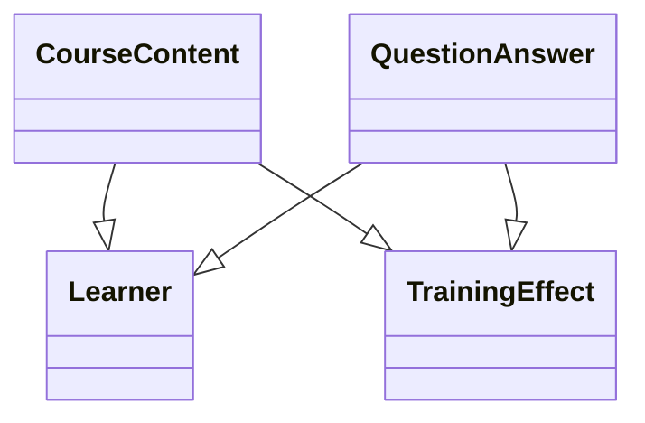
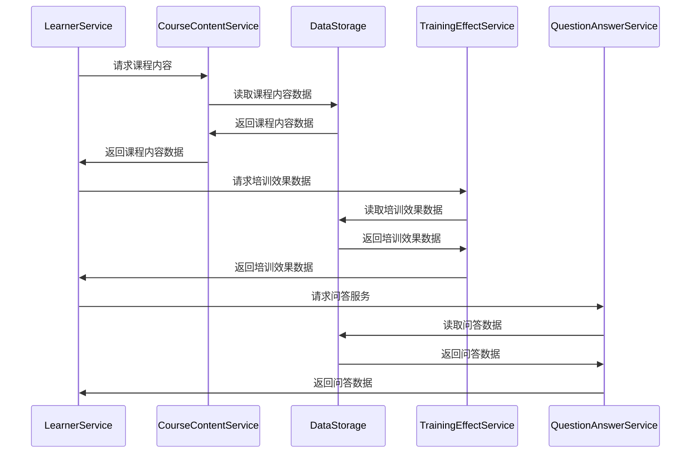
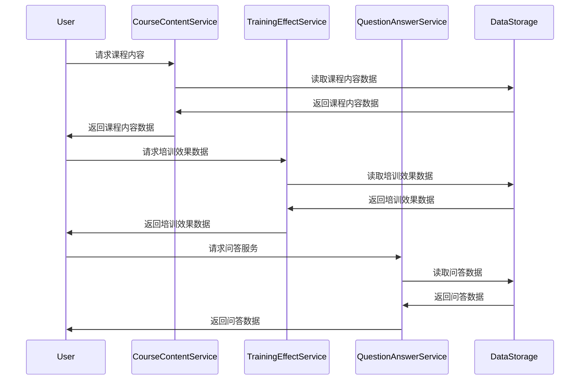
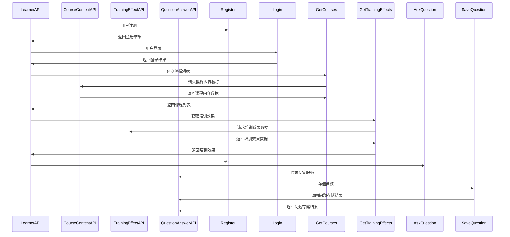
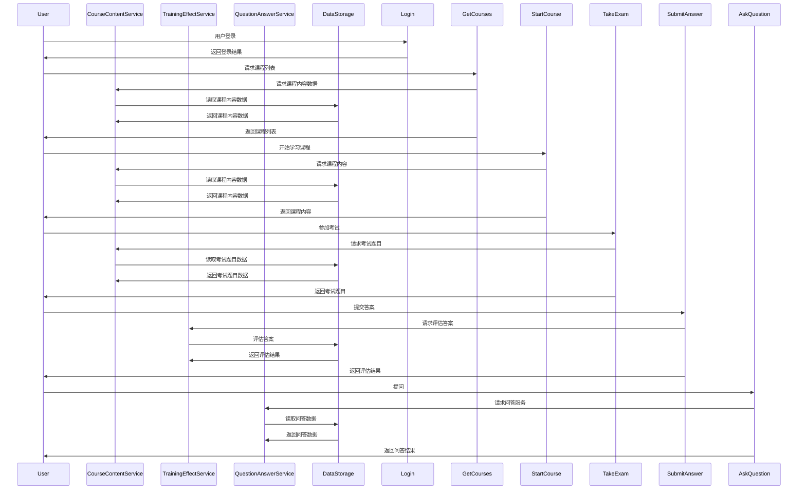
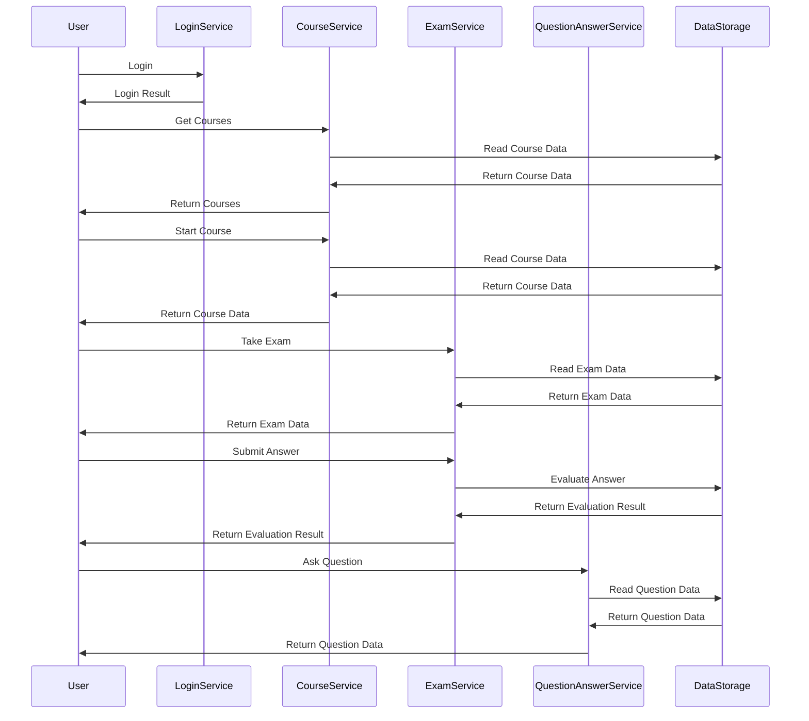

                 


### AIGC在未来工作技能预测与培训中的智能应用

#### 关键词：
- AIGC
- 未来工作技能
- 智能培训
- 技术趋势
- 案例分析

#### 摘要：
随着人工智能生成内容（AIGC）技术的快速发展，其在未来工作技能预测与培训中的应用日益受到关注。本文旨在探讨AIGC如何在未来工作技能预测与培训中发挥智能作用，通过详细分析AIGC技术、未来工作技能趋势、智能应用案例、培训策略与方法以及实践应用与挑战，为教育者和企业提供指导。文章将通过逻辑清晰、结构紧凑、简单易懂的写作方式，帮助读者深入理解AIGC在培训领域的应用潜力和实际效果。

### 目录

1. **AIGC技术概述**
   1.1 AIGC的基本概念与原理
   1.2 AIGC的发展历程与趋势
   1.3 AIGC技术分类与应用模式

2. **未来工作技能趋势**
   2.1 未来工作环境的变化
   2.2 工作技能预测方法
   2.3 未来技能与AIGC的关系

3. **智能应用案例**
   3.1 AIGC在职业培训中的应用
   3.2 AIGC在企业培训中的应用
   3.3 AIGC在教育领域的应用

4. **培训策略与方法**
   4.1 AIGC驱动的培训策略
   4.2 智能培训方法的实施
   4.3 案例研究：成功实施AIGC培训的企业

5. **实践应用与挑战**
   5.1 AIGC应用的挑战
   5.2 应对策略与解决方案
   5.3 未来展望与趋势

6. **总结**

### 1. AIGC技术概述

#### 1.1 AIGC的基本概念与原理

AIGC，即人工智能生成内容，是指利用人工智能技术自动生成各种形式的内容，包括文本、图片、音频和视频等。其基本原理在于深度学习和自然语言处理（NLP）技术的发展。AIGC的核心技术主要包括生成对抗网络（GAN）、变分自编码器（VAE）、递归神经网络（RNN）等。

- **生成对抗网络（GAN）**：GAN由生成器和判别器组成，通过训练生成器和判别器的对抗关系，生成器逐渐学会生成逼真的数据，而判别器则学会区分真实数据和生成数据。

- **变分自编码器（VAE）**：VAE通过编码器和解码器将输入数据转换为低维表示，再通过解码器重构原始数据。这种结构在生成高质量图像和文本数据方面表现出色。

- **递归神经网络（RNN）**：RNN能够处理序列数据，通过保存先前的状态信息，对序列中的每个元素进行建模。在自然语言处理任务中，RNN被广泛应用于语言模型和机器翻译等领域。

#### 1.2 AIGC的发展历程与趋势

AIGC技术的发展经历了以下几个阶段：

1. **早期探索**：2000年代，研究人员开始探索生成式模型，如生成对抗网络（GAN）。

2. **快速发展**：2014年，GAN的提出标志着AIGC技术的快速发展。此后，各种生成式模型相继出现，如变分自编码器（VAE）和递归神经网络（RNN）。

3. **广泛应用**：随着技术的不断进步，AIGC技术在图像生成、文本生成、音频生成等领域得到广泛应用。

目前，AIGC技术正朝着以下几个趋势发展：

1. **更高质量生成**：研究人员致力于提高生成模型的质量，通过改进算法和增加训练数据，生成更加逼真的内容。

2. **多样化应用**：AIGC技术在各个领域的应用逐渐扩大，从图像和音频生成，到文本生成和视频生成，都在不断探索新的应用场景。

3. **跨模态生成**：研究人员开始探索跨模态生成，如将图像和文本结合起来生成图像描述，或根据音频生成对应的音乐视频。

#### 1.3 AIGC技术分类与应用模式

根据生成内容的形式，AIGC技术可以分为以下几类：

1. **文本生成**：通过自然语言处理技术生成文本，如文章、对话、摘要等。

2. **图像生成**：通过生成对抗网络（GAN）等技术生成高质量的图像，如人脸生成、风景生成等。

3. **音频生成**：通过深度学习模型生成音频，如音乐生成、语音合成等。

4. **视频生成**：通过视频生成技术生成视频内容，如视频编辑、视频生成等。

不同应用模式的选择标准主要包括：

1. **生成质量**：根据应用场景对生成质量的需求，选择适合的生成技术。

2. **数据规模**：根据训练数据的大小，选择适合的生成模型。

3. **实时性**：根据应用场景对实时性的需求，选择适合的生成技术。

4. **可解释性**：根据应用场景对模型可解释性的需求，选择适合的生成技术。

### 2. 未来工作技能趋势

#### 2.1 未来工作环境的变化

随着技术的不断进步，未来工作环境将发生显著变化。以下是一些主要趋势：

1. **自动化与智能化**：越来越多的工作将实现自动化和智能化，减少人力需求。

2. **远程工作**：远程工作的普及将改变传统的办公模式，提高工作效率。

3. **灵活就业**：随着劳动力市场的变化，灵活就业形式将越来越受欢迎。

4. **技能多样化**：未来工作将更加注重技能的综合性和多样化。

#### 2.2 工作技能预测方法

为了应对未来工作环境的变化，需要准确预测未来的工作技能需求。以下是一些常见的工作技能预测方法：

1. **数据驱动的方法**：通过分析历史数据和趋势，预测未来的工作技能需求。

2. **机器学习模型**：利用机器学习算法，构建预测模型，预测未来的工作技能需求。

3. **专家评估**：邀请行业专家对未来的工作技能进行评估和预测。

#### 2.3 未来技能与AIGC的关系

AIGC技术的发展将对未来工作技能产生重要影响。以下是一些主要关系：

1. **技能需求的变化**：AIGC技术将改变对某些技能的需求，增加对AI和数据分析技能的需求。

2. **技能培养的新方式**：AIGC技术为技能培养提供了新的方式，如智能培训课程和个性化学习路径。

3. **技能创新的推动**：AIGC技术将推动新技能的产生，如AIGC编程和内容生成技能。

### 3. 智能应用案例

#### 3.1 AIGC在职业培训中的应用

AIGC技术在职业培训中具有广泛的应用潜力。以下是一些具体应用案例：

1. **在线课程内容生成**：利用AIGC技术生成高质量的在线课程内容，提高培训效果。

2. **自动化教学工具**：开发自动化教学工具，如智能问答系统和虚拟教练，提高教学效率。

3. **个性化学习路径推荐**：根据学员的学习情况和需求，推荐个性化的学习路径，提高学习效果。

#### 3.2 AIGC在企业培训中的应用

AIGC技术在企业培训中也具有重要意义。以下是一些具体应用案例：

1. **企业内训内容生成**：利用AIGC技术生成符合企业需求的高质量内训内容。

2. **培训效果评估与反馈系统**：通过AIGC技术构建培训效果评估和反馈系统，实时监控和评估培训效果。

3. **培训资源的智能推荐系统**：根据员工的技能水平和培训需求，推荐相应的培训资源。

#### 3.3 AIGC在教育领域的应用

AIGC技术在教育领域具有巨大潜力，以下是一些具体应用案例：

1. **智能考试题库生成**：利用AIGC技术生成智能考试题库，提高考试的公平性和科学性。

2. **学习资源的智能筛选与推荐**：根据学生的学习兴趣和学习情况，推荐相应的学习资源。

3. **网络教育的智能化发展**：通过AIGC技术提高网络教育平台的智能化水平，提供个性化的学习体验。

### 4. 培训策略与方法

#### 4.1 AIGC驱动的培训策略

为了有效利用AIGC技术进行培训，需要制定相应的策略。以下是一些关键策略：

1. **数据驱动的培训规划**：通过分析数据，了解员工的学习需求和技能水平，制定个性化的培训计划。

2. **智能培训课程设计**：利用AIGC技术设计高质量、个性化的培训课程，提高培训效果。

3. **个性化学习路径推荐**：根据员工的学习兴趣和学习情况，推荐个性化的学习路径，提高学习效率。

#### 4.2 智能培训方法的实施

在实施智能培训方法时，需要考虑以下几个方面：

1. **培训需求分析**：通过问卷调查、访谈等方式，了解员工的学习需求和技能水平。

2. **培训内容定制**：根据员工的学习需求和技能水平，定制个性化的培训内容。

3. **培训效果评估**：通过考试、评估等方式，评估员工的培训效果。

#### 4.3 案例研究：成功实施AIGC培训的企业

以下是一个成功实施AIGC培训的企业案例：

- **企业背景**：某大型企业，员工人数超过1000人，涉及多个行业领域。

- **实施过程**：企业利用AIGC技术设计了一系列智能培训课程，包括数据分析、人工智能、网络安全等。根据员工的学习需求和技能水平，推荐个性化的学习路径。同时，通过AIGC技术构建了培训效果评估和反馈系统，实时监控和评估员工的培训效果。

- **成果评估**：培训后，员工在相关领域的技能水平得到了显著提升，企业的整体竞争力也得到了提高。

### 5. 实践应用与挑战

#### 5.1 AIGC应用的挑战

AIGC技术在培训领域的应用面临着一系列挑战：

1. **技术挑战**：AIGC技术本身还存在一些局限性，如生成质量、实时性和可解释性等。

2. **道德与伦理问题**：AIGC技术在生成内容时可能引发道德和伦理问题，如虚假信息、歧视等。

3. **法律法规的限制**：法律法规对AIGC技术的应用提出了严格的限制，如数据隐私保护、版权问题等。

#### 5.2 应对策略与解决方案

为了应对AIGC应用的挑战，可以采取以下策略和解决方案：

1. **技术层面的解决方案**：通过改进算法、增加训练数据等方式，提高AIGC技术的生成质量。

2. **道德与伦理层面的考量**：制定相应的道德和伦理规范，确保AIGC技术的应用不会对人类产生负面影响。

3. **法律法规的适应性调整**：积极适应法律法规的变化，确保AIGC技术的应用符合相关法律法规的要求。

#### 5.3 未来展望与趋势

随着AIGC技术的不断发展和成熟，其在培训领域的应用前景广阔。以下是一些未来展望和趋势：

1. **更广泛的应用领域**：AIGC技术在教育、医疗、金融等领域的应用将不断拓展。

2. **更高的生成质量**：通过改进算法和增加训练数据，AIGC技术的生成质量将不断提高。

3. **更智能的培训系统**：结合大数据和云计算技术，构建更智能、个性化的培训系统。

### 6. 总结

AIGC技术在未来工作技能预测与培训中具有巨大的应用潜力。通过本文的详细分析，我们可以看到AIGC技术在文本生成、图像生成、音频生成等方面的广泛应用，以及在职业培训、企业培训和教

### 1. AIGC技术概述

#### 1.1 AIGC的基本概念与原理

AIGC（Artificial Intelligence Generated Content）是指通过人工智能技术自动生成各种形式内容的过程，这些内容可以是文本、图像、音频、视频等。AIGC技术的核心在于利用机器学习，特别是深度学习算法，对大规模数据集进行训练，从而实现内容的自动生成。

**核心概念：**

- **生成对抗网络（GAN）**：由生成器和判别器组成，生成器负责生成内容，判别器负责区分生成内容和真实内容。两者相互对抗，使生成器不断优化，最终生成高质量的内容。

- **变分自编码器（VAE）**：通过编码器和解码器对输入数据进行编码和解码，编码器将数据压缩成低维向量，解码器再将这些向量重构为原始数据。

- **递归神经网络（RNN）**：能够处理序列数据，通过保存先前的状态信息，对序列中的每个元素进行建模。

**技术原理：**

AIGC技术的原理主要基于以下步骤：

1. **数据收集**：收集大量的原始数据，如图像、文本、音频等。

2. **数据预处理**：对原始数据进行清洗、归一化等处理，使其适合模型训练。

3. **模型训练**：使用深度学习算法对预处理后的数据进行训练，生成器学习如何生成内容，判别器学习如何区分生成内容和真实内容。

4. **生成内容**：通过训练好的模型，自动生成新的内容。

**应用领域：**

AIGC技术在多个领域都有广泛的应用，包括：

- **文本生成**：自动生成文章、新闻报道、社交媒体帖子等。

- **图像生成**：自动生成艺术作品、人脸图像、风景图像等。

- **音频生成**：自动生成音乐、语音等。

- **视频生成**：自动生成视频片段、视频剪辑等。

#### 1.2 AIGC的发展历程与趋势

**发展历程：**

AIGC技术起源于2000年代末期，当时生成对抗网络（GAN）被提出。随后，变分自编码器（VAE）和其他深度学习算法也被引入到内容生成领域。随着计算能力的提升和数据量的增加，AIGC技术逐渐成熟并开始得到广泛应用。

**当前趋势：**

1. **生成质量提升**：研究人员通过改进算法和增加训练数据，不断提高生成质量，生成更加逼真和高质量的内容。

2. **多样化应用场景**：AIGC技术在各个领域得到广泛应用，如游戏、娱乐、广告、艺术等。

3. **跨模态生成**：探索将不同类型的内容（如文本、图像、音频）结合起来进行生成，实现更复杂的生成任务。

4. **自动化和智能化**：通过结合大数据和云计算技术，实现AIGC技术的自动化和智能化，提供更加个性化的服务。

**未来发展趋势：**

1. **更高生成质量**：随着算法和计算能力的提升，AIGC技术的生成质量将继续提升。

2. **更广泛的应用领域**：AIGC技术将在更多领域得到应用，如医疗、法律、金融等。

3. **更多跨领域合作**：AIGC技术与其他领域的结合将产生更多的创新应用。

#### 1.3 AIGC技术分类与应用模式

AIGC技术可以根据生成内容的形式和应用模式进行分类。

**分类：**

1. **文本生成**：通过自然语言处理技术生成文本内容，如文章、对话、摘要等。

2. **图像生成**：通过生成对抗网络（GAN）等技术生成图像，如图像到图像、图像到文本等。

3. **音频生成**：通过深度学习模型生成音频，如音乐、语音等。

4. **视频生成**：通过视频生成技术生成视频内容，如视频到视频、视频到文本等。

**应用模式：**

1. **生成式应用**：直接生成新的内容，如自动写作、图像生成等。

2. **辅助式应用**：辅助人类创作内容，如自动生成音乐、辅助设计师等。

3. **交互式应用**：与用户进行交互，根据用户输入生成内容，如聊天机器人、个性化推荐等。

**选择标准：**

在选择AIGC技术时，需要考虑以下标准：

1. **生成质量**：根据应用场景对生成质量的需求，选择适合的生成技术。

2. **数据规模**：根据训练数据的大小，选择适合的生成模型。

3. **实时性**：根据应用场景对实时性的需求，选择适合的生成技术。

4. **可解释性**：根据应用场景对模型可解释性的需求，选择适合的生成技术。

### 2. 未来工作技能趋势

#### 2.1 未来工作环境的变化

随着技术的不断进步，未来工作环境将发生显著变化。以下是一些主要趋势：

1. **自动化与智能化**：越来越多的工作将实现自动化和智能化，减少人力需求。例如，智能机器人将承担更多重复性、危险性的工作，提高生产效率。

2. **远程工作**：远程工作的普及将改变传统的办公模式，提高工作效率。随着5G技术的发展，远程工作体验将更加流畅，远程协作、远程会议等将变得更加普及。

3. **灵活就业**：随着劳动力市场的变化，灵活就业形式将越来越受欢迎。例如，远程办公、兼职、自由职业等就业形式将得到更多人的认可。

4. **技能多样化**：未来工作将更加注重技能的综合性和多样化。例如，不仅需要掌握传统的专业技能，还需要具备跨学科的知识和技能，如数据分析、人工智能、编程等。

#### 2.2 工作技能预测方法

为了应对未来工作环境的变化，需要准确预测未来的工作技能需求。以下是一些常见的工作技能预测方法：

1. **数据驱动的方法**：通过分析历史数据和趋势，预测未来的工作技能需求。例如，利用大数据分析技术，对招聘数据、职位描述、行业报告等进行深入分析，预测未来的技能需求。

2. **机器学习模型**：利用机器学习算法，构建预测模型，预测未来的工作技能需求。例如，使用回归模型、决策树、神经网络等算法，对历史数据进行训练，预测未来的技能需求。

3. **专家评估**：邀请行业专家对未来的工作技能进行评估和预测。专家评估基于行业经验、专业知识和对未来趋势的判断，可以为预测提供有价值的参考。

4. **情景分析**：通过模拟不同未来情景，分析这些情景下所需的工作技能。例如，利用情景分析技术，模拟技术进步、市场需求变化等情景，预测在这些情景下所需的工作技能。

#### 2.3 未来技能与AIGC的关系

AIGC技术的发展将对未来工作技能产生重要影响。以下是一些主要关系：

1. **技能需求的变化**：AIGC技术将改变对某些技能的需求，增加对AI和数据分析技能的需求。例如，随着AIGC技术在内容生成、图像处理、音频处理等领域的应用，对相关技能的需求将不断增加。

2. **技能培养的新方式**：AIGC技术为技能培养提供了新的方式，如智能培训课程和个性化学习路径。通过AIGC技术，可以生成高质量的培训内容，提供个性化的学习体验，提高学习效果。

3. **技能创新的推动**：AIGC技术将推动新技能的产生，如AIGC编程和内容生成技能。这些新技能将有助于人们更好地利用AIGC技术，创造出更多的创新应用。

### 3. 智能应用案例

#### 3.1 AIGC在职业培训中的应用

AIGC技术在职业培训中具有广泛的应用潜力。以下是一些具体应用案例：

1. **在线课程内容生成**：利用AIGC技术生成高质量的在线课程内容，提高培训效果。例如，通过文本生成模型，自动生成课程教材、习题和讲解视频，减轻教师的工作负担。

2. **自动化教学工具**：开发自动化教学工具，如智能问答系统和虚拟教练，提高教学效率。智能问答系统可以自动回答学生的问题，而虚拟教练可以模拟实际工作场景，为学生提供实践操作的机会。

3. **个性化学习路径推荐**：根据学员的学习情况和需求，推荐个性化的学习路径，提高学习效果。通过分析学员的学习数据，AIGC技术可以推荐最适合学员的学习内容和学习方法，实现个性化教育。

#### 3.2 AIGC在企业培训中的应用

AIGC技术在企业培训中也具有重要意义。以下是一些具体应用案例：

1. **企业内训内容生成**：利用AIGC技术生成符合企业需求的高质量内训内容。例如，通过文本生成模型，自动生成培训教材、案例分析报告等，提高培训的针对性和实用性。

2. **培训效果评估与反馈系统**：通过AIGC技术构建培训效果评估和反馈系统，实时监控和评估培训效果。例如，通过自然语言处理技术，分析学员的反馈意见，自动生成评估报告，为企业提供改进培训的建议。

3. **培训资源的智能推荐系统**：根据员工的技能水平和培训需求，推荐相应的培训资源。例如，通过图像识别技术，分析员工的岗位和工作内容，自动推荐相关的培训课程和书籍，帮助员工提升技能。

#### 3.3 AIGC在教育领域的应用

AIGC技术在教育领域具有巨大潜力，以下是一些具体应用案例：

1. **智能考试题库生成**：利用AIGC技术生成智能考试题库，提高考试的公平性和科学性。例如，通过文本生成模型，自动生成不同难度、不同类型的考试题目，确保考试题目的多样性和覆盖面。

2. **学习资源的智能筛选与推荐**：根据学生的学习兴趣和学习情况，推荐相应的学习资源。例如，通过图像识别技术，分析学生的学习行为和偏好，自动推荐相关的学习视频、书籍和文献，帮助学生更好地进行学习。

3. **网络教育的智能化发展**：通过AIGC技术提高网络教育平台的智能化水平，提供个性化的学习体验。例如，利用语音识别和自然语言处理技术，实现智能语音互动教学，提高学生的学习兴趣和参与度。

### 4. 培训策略与方法

#### 4.1 AIGC驱动的培训策略

为了有效利用AIGC技术进行培训，需要制定相应的策略。以下是一些关键策略：

1. **数据驱动的培训规划**：通过分析数据，了解员工的学习需求和技能水平，制定个性化的培训计划。例如，利用AIGC技术分析员工的职业发展数据、学习行为数据等，为员工提供有针对性的培训建议。

2. **智能培训课程设计**：利用AIGC技术设计高质量、个性化的培训课程，提高培训效果。例如，通过文本生成模型，自动生成培训课程内容，根据员工的学习需求和兴趣，推荐相应的课程模块。

3. **个性化学习路径推荐**：根据员工的学习兴趣和学习情况，推荐个性化的学习路径，提高学习效率。例如，利用AIGC技术分析员工的学习行为和偏好，自动推荐最适合员工的学习资源和路径。

#### 4.2 智能培训方法的实施

在实施智能培训方法时，需要考虑以下几个方面：

1. **培训需求分析**：通过问卷调查、访谈等方式，了解员工的学习需求和技能水平。利用AIGC技术对收集到的数据进行处理和分析，为后续培训提供依据。

2. **培训内容定制**：根据员工的学习需求和技能水平，定制个性化的培训内容。利用AIGC技术生成高质量的培训教材、习题和案例，确保培训内容的针对性和实用性。

3. **培训效果评估**：通过考试、评估等方式，评估员工的培训效果。利用AIGC技术对评估结果进行数据分析，为员工提供改进建议，为培训方案的调整提供参考。

#### 4.3 案例研究：成功实施AIGC培训的企业

以下是一个成功实施AIGC培训的企业案例：

- **企业背景**：某大型企业，员工人数超过1000人，涉及多个行业领域。

- **实施过程**：

  1. **需求分析**：企业利用AIGC技术对员工的学习需求和技能水平进行了全面分析，发现大部分员工对数据分析、人工智能等领域的技能提升有较高需求。

  2. **课程设计**：企业利用AIGC技术设计了一系列智能培训课程，包括数据分析、人工智能、网络安全等。课程内容涵盖了基础知识和实际应用案例，通过文本生成模型和图像生成模型，生成高质量的教材、习题和案例分析报告。

  3. **个性化推荐**：根据员工的学习需求和兴趣，利用AIGC技术推荐个性化的学习路径。例如，对对数据分析有较高需求的员工，推荐相关的课程和书籍，帮助员工快速提升技能。

  4. **效果评估**：企业利用AIGC技术对员工的培训效果进行了实时监控和评估。通过分析员工的学习行为和评估结果，发现员工在数据分析、人工智能等领域的技能水平得到了显著提升。

- **成果评估**：

  1. **员工技能提升**：员工在数据分析、人工智能等领域的技能水平得到了显著提升，提高了工作效率和创新能力。

  2. **企业竞争力提升**：企业通过AIGC培训，培养了具有高水平技能的员工队伍，提高了整体竞争力。

### 5. 实践应用与挑战

#### 5.1 AIGC应用的挑战

AIGC技术在培训领域的应用面临着一系列挑战：

1. **技术挑战**：AIGC技术本身还存在一些局限性，如生成质量、实时性和可解释性等。例如，生成的内容可能不够真实、一致或可解释，影响培训效果。

2. **道德与伦理问题**：AIGC技术在生成内容时可能引发道德和伦理问题。例如，自动生成的文本可能包含歧视性言论或错误信息，影响学习体验。

3. **法律法规的限制**：法律法规对AIGC技术的应用提出了严格的限制，如数据隐私保护、版权问题等。例如，未经授权自动生成的内容可能侵犯他人的知识产权。

#### 5.2 应对策略与解决方案

为了应对AIGC应用的挑战，可以采取以下策略和解决方案：

1. **技术优化**：通过改进算法和增加训练数据，提高AIGC技术的生成质量和实时性。例如，利用更先进的生成模型和更大规模的数据集进行训练。

2. **伦理审查**：建立伦理审查机制，确保自动生成的培训内容符合道德和伦理标准。例如，对自动生成的文本进行审核，删除歧视性言论和错误信息。

3. **法律法规遵守**：遵守相关法律法规，确保AIGC技术的应用合法合规。例如，在自动生成的内容中标注版权信息，确保不侵犯他人的知识产权。

#### 5.3 未来展望与趋势

随着AIGC技术的不断发展和成熟，其在培训领域的应用前景广阔。以下是一些未来展望和趋势：

1. **更广泛的应用领域**：AIGC技术将在更多领域得到应用，如医疗、法律、金融等。这将为不同领域的培训提供新的解决方案。

2. **更高生成质量**：随着算法和计算能力的提升，AIGC技术的生成质量将继续提升，提供更加逼真和高质量的培训内容。

3. **更智能的培训系统**：结合大数据和云计算技术，构建更智能、个性化的培训系统。这将为员工提供更加高效和灵活的培训体验。

### 6. 总结

AIGC技术在培训领域具有巨大的应用潜力。通过本文的详细分析，我们可以看到AIGC技术在文本生成、图像生成、音频生成等方面的广泛应用，以及在职业培训、企业培训和教

### 背景介绍

#### 核心概念术语说明

**AIGC（Artificial Intelligence Generated Content）**：人工智能生成内容，是指利用人工智能技术自动生成各种形式的内容，包括文本、图像、音频、视频等。

**自然语言处理（Natural Language Processing，NLP）**：自然语言处理是指让计算机理解和处理人类自然语言的技术，包括文本分析、语义理解、语音识别等。

**机器学习（Machine Learning）**：机器学习是人工智能的一个分支，通过使用数据来训练模型，使其能够对未知数据进行预测和决策。

**深度学习（Deep Learning）**：深度学习是机器学习的一个子领域，使用多层神经网络来模拟人脑的神经结构，进行复杂的数据分析和模式识别。

**生成对抗网络（Generative Adversarial Network，GAN）**：生成对抗网络是由生成器和判别器组成的神经网络模型，生成器和判别器相互对抗，生成器试图生成逼真的数据，而判别器试图区分生成数据和真实数据。

**变分自编码器（Variational Autoencoder，VAE）**：变分自编码器是一种深度学习模型，用于生成数据和学习数据的概率分布。

#### 问题背景

随着人工智能技术的快速发展，人工智能生成内容（AIGC）逐渐成为学术界和产业界的研究热点。AIGC技术具有广泛的应用前景，包括内容创作、广告营销、娱乐产业、教育等领域。然而，随着AIGC技术的应用不断深入，其带来的挑战也日益显著。

在培训领域，AIGC技术具有巨大的潜力。通过AIGC技术，可以自动生成高质量的培训内容，提供个性化的学习体验，提高学习效果。然而，如何将AIGC技术有效应用于培训，并确保培训质量，是一个亟待解决的问题。

本文旨在探讨AIGC在未来工作技能预测与培训中的智能应用，通过分析AIGC技术、未来工作技能趋势、智能应用案例、培训策略与方法以及实践应用与挑战，为教育者和企业提供指导。

#### 问题描述

AIGC技术在培训领域的应用面临以下问题：

1. **内容质量**：如何确保AIGC技术生成的培训内容具有高质量，能够满足学习者的需求。

2. **个性化学习**：如何利用AIGC技术提供个性化的学习体验，满足不同学习者的需求。

3. **伦理和隐私**：如何处理AIGC技术可能引发的伦理和隐私问题，确保培训内容的合法性和道德性。

4. **技术挑战**：如何克服AIGC技术存在的挑战，如实时性、可解释性和生成质量等。

5. **培训效果**：如何评估AIGC技术对培训效果的影响，确保培训的有效性和持续性。

#### 问题解决

针对上述问题，可以采取以下解决方案：

1. **内容质量**：通过改进AIGC算法和增加训练数据，提高生成内容的质量。同时，建立内容审核机制，确保生成内容符合相关标准和道德规范。

2. **个性化学习**：利用AIGC技术分析学习者的行为数据和学习需求，提供个性化的学习资源和路径。通过智能推荐系统，为学习者推荐最适合的学习内容。

3. **伦理和隐私**：建立伦理审查机制，确保生成内容的合法性和道德性。同时，采取隐私保护措施，确保学习者的隐私数据不被泄露。

4. **技术挑战**：通过持续优化算法和增加计算资源，提高AIGC技术的生成质量和实时性。同时，开发可解释性模型，提高模型的透明度和可解释性。

5. **培训效果**：通过实验和评估，分析AIGC技术对培训效果的影响。利用数据分析技术，评估学习者的学习成果，为培训效果的持续优化提供依据。

#### 边界与外延

AIGC技术在培训领域的应用具有以下边界和外部环境：

1. **技术边界**：AIGC技术受限于当前的算法和计算资源，生成内容的质量和速度还有待提高。

2. **伦理边界**：AIGC技术在生成内容时可能引发伦理和隐私问题，需要建立相应的伦理审查机制和隐私保护措施。

3. **法律法规边界**：AIGC技术的应用受限于相关法律法规的规定，如数据隐私保护、版权问题等。

4. **应用边界**：AIGC技术在培训领域的应用受限于当前的应用场景和需求，未来有望在更多领域得到应用。

#### 概念结构与核心要素组成

AIGC技术在培训领域的应用可以分解为以下几个核心要素：

1. **数据收集与预处理**：收集相关领域的训练数据，并对数据进行预处理，如清洗、归一化等。

2. **模型训练与优化**：利用收集到的数据训练生成模型，如GAN、VAE等，并通过优化算法提高生成质量。

3. **内容生成与审核**：利用训练好的模型生成培训内容，并建立内容审核机制，确保内容的合法性和道德性。

4. **个性化推荐与学习路径规划**：根据学习者的行为数据和需求，推荐个性化的学习资源和路径。

5. **培训效果评估与反馈**：通过评估学习者的学习成果，为培训效果的持续优化提供依据。

### 核心概念与联系

#### 核心概念原理

**AIGC（Artificial Intelligence Generated Content）**：人工智能生成内容，是指利用人工智能技术，如深度学习、生成对抗网络（GAN）、变分自编码器（VAE）等，自动生成各种形式的内容，如文本、图像、音频和视频。

**生成对抗网络（GAN）**：GAN由生成器和判别器组成，生成器负责生成逼真的数据，判别器负责判断生成数据和真实数据。通过生成器和判别器的对抗训练，生成器不断提高生成质量。

**变分自编码器（VAE）**：VAE通过编码器和解码器将输入数据转换为低维表示，再通过解码器重构原始数据。这种结构在生成高质量图像和文本数据方面表现出色。

**自然语言处理（NLP）**：NLP是指使计算机能够理解、处理和生成人类语言的技术。在AIGC中，NLP技术被用于生成和理解文本内容。

**机器学习（ML）**：机器学习是使计算机从数据中学习规律和模式的技术。在AIGC中，ML技术被用于训练生成模型和判别模型。

#### 概念属性特征对比表格

| 特征                 | AIGC                    | GAN                     | VAE                   | NLP                  | ML                   |
|----------------------|-------------------------|-------------------------|-----------------------|----------------------|----------------------|
| **定义**             | 人工智能生成内容        | 生成对抗网络            | 变分自编码器          | 自然语言处理         | 机器学习             |
| **核心组件**         | 生成模型、判别模型     | 生成器、判别器         | 编码器、解码器        | 词向量、语法分析     | 特征提取、分类器     |
| **应用场景**         | 文本、图像、音频、视频  | 图像、音频、视频、文本  | 图像、音频、视频、文本 | 文本、语音           | 众多领域             |
| **训练方式**         | 对抗训练               | 生成器和判别器对抗训练 | 编码器和解码器训练    | 语料库训练           | 特征学习、模型训练   |
| **优缺点**           | 质量高、多样性         | 难以训练、生成质量不稳定 | 生成质量高、计算复杂   | 难以理解、计算复杂     | 需要大量数据         |

#### ER实体关系图架构

以下是AIGC技术中核心实体的ER实体关系图：

```mermaid
erDiagram
    Content |<-.*| Trainer
    Content |--.*| Generator
    Content |--.*| Discriminator
    Content |**--** Student
    Content |**--** Dataset
    Content |**--** Model
    Content |**--** Algorithm
    Trainer |**--** Expert
    Generator |**--** GeneratorModel
    Discriminator |**--** DiscriminatorModel
    Dataset |**--** DataEntry
    Model |**--** NeuralNetwork
    Algorithm |**--** GAN
    Algorithm |**--** VAE
    Algorithm |**--** NLP
    Algorithm |**--** ML
```

#### ER实体关系图解释

- **Content（内容）**：表示AIGC生成的各种形式的内容，包括文本、图像、音频和视频。

- **Trainer（训练师）**：负责训练生成器和判别器的专家。

- **Generator（生成器）**：生成内容的模型，如GAN中的生成器。

- **Discriminator（判别器）**：判断生成内容是否真实的模型，如GAN中的判别器。

- **Student（学生）**：接受培训的学习者。

- **Dataset（数据集）**：用于训练的数据集，包括训练数据和测试数据。

- **Model（模型）**：表示训练好的神经网络模型，如GAN中的生成器和判别器模型。

- **Algorithm（算法）**：表示用于生成内容的算法，如GAN、VAE、NLP和ML。

### 算法原理讲解

#### GAN算法原理

**生成对抗网络（GAN）** 是由生成器（Generator）和判别器（Discriminator）组成的一个对抗性学习框架。其核心思想是生成器和判别器之间的对抗训练。

1. **生成器（Generator）**：生成器G的目的是生成与真实数据分布相同或相近的数据。在训练过程中，生成器G不断优化，使其生成的数据越来越逼真。

2. **判别器（Discriminator）**：判别器D的目的是判断输入的数据是真实数据还是生成数据。在训练过程中，判别器D不断优化，使其能够更好地区分真实数据和生成数据。

GAN的训练过程可以分为以下步骤：

1. **初始化**：初始化生成器G和判别器D的参数。

2. **生成假数据**：生成器G根据真实数据的分布生成假数据。

3. **判断真假数据**：将真实数据和生成数据输入判别器D，判别器D输出概率值，表示输入数据的真实程度。

4. **优化生成器**：通过反向传播算法，优化生成器的参数，使其生成的假数据更加逼真。

5. **优化判别器**：通过反向传播算法，优化判别器的参数，使其能够更好地区分真实数据和生成数据。

6. **重复步骤2-5**：不断重复以上步骤，直到生成器G和判别器D的参数达到一个较好的平衡状态。

**GAN的数学模型：**

GAN的目标函数可以表示为：

$$
\min_G \max_D V(D, G)
$$

其中，$V(D, G)$是判别器D和生成器G的共同损失函数。通常，$V(D, G)$由两部分组成：

1. **生成器损失**：表示生成器G生成假数据的真实性。

$$
L_G = -\frac{1}{2}\sum_{x \in \text{真实数据}} \log(D(x)) - \frac{1}{2}\sum_{z \in \text{噪声数据}} \log(1 - D(G(z)))
$$

其中，$x$是真实数据，$z$是随机噪声数据。

2. **判别器损失**：表示判别器D区分真实数据和生成数据的准确性。

$$
L_D = -\frac{1}{2}\sum_{x \in \text{真实数据}} \log(D(x)) - \frac{1}{2}\sum_{z \in \text{噪声数据}} \log(D(G(z)))
$$

#### VAE算法原理

**变分自编码器（VAE）** 是一种基于概率模型的生成模型，由编码器（Encoder）和解码器（Decoder）组成。编码器将输入数据编码为一个低维向量，解码器将这个低维向量解码回原始数据。

1. **编码器（Encoder）**：编码器E将输入数据$x$编码为一个均值向量$\mu$和一个方差向量$\sigma^2$。

$$
\mu, \sigma^2 = E_{\theta_e} [q_{\phi_e}(z|x); x]
$$

其中，$q_{\phi_e}(z|x)$是编码器E的潜变量分布。

2. **解码器（Decoder）**：解码器D根据编码器E生成的潜变量$z$解码回原始数据$x$。

$$
x = E_{\theta_d} [p_{\phi_d}(x|z); z]
$$

其中，$p_{\phi_d}(x|z)$是解码器D的输入数据分布。

VAE的目标函数是最大化数据分布的似然函数，即

$$
\log p(x) = \int q_{\phi_e}(z|x) p(x|z) dz
$$

其中，$p(x|z)$是解码器D的输入数据分布，$q_{\phi_e}(z|x)$是编码器E的潜变量分布。

为了最大化似然函数，VAE的目标函数可以表示为：

$$
\min_{\theta_e, \theta_d} \mathcal{L}
$$

其中，$\mathcal{L}$是数据分布的负对数似然函数。

#### 通俗易懂地举例说明

假设我们要用GAN生成一张手写数字图像。首先，我们有一个真实的手写数字图像数据集。然后，我们初始化一个生成器G和一个判别器D。

**生成器G**：生成器G接收到一个随机噪声向量$z$，通过神经网络将其转换为一张手写数字图像。例如，我们可以使用一个生成器网络，将噪声向量$z$映射到一个128维的隐含层，然后通过另一个神经网络映射到手写数字图像。

**判别器D**：判别器D接收一个手写数字图像，判断它是真实图像还是生成图像。判别器D也是一个神经网络，其输出是一个概率值，表示输入图像是真实图像的概率。

在训练过程中，我们不断调整生成器G和判别器D的参数，使生成器G生成的图像越来越逼真，判别器D越来越能区分真实图像和生成图像。

最终，当生成器G生成的图像足够逼真，判别器D无法区分真实图像和生成图像时，我们就完成了GAN的训练。

对于VAE，假设我们要生成一张图像。首先，我们有一个图像数据集。然后，我们初始化一个编码器E和一个解码器D。

**编码器E**：编码器E接收一张图像，将其编码为一个均值向量和方差向量。例如，我们可以使用一个编码器网络，将图像映射到一个128维的隐含层，然后输出一个均值向量和方差向量。

**解码器D**：解码器D接收一个均值向量和方差向量，将其解码回一张图像。例如，我们可以使用一个解码器网络，将均值向量和方差向量映射回一张图像。

在训练过程中，我们不断调整编码器E和解码器D的参数，使编码器E能更好地编码图像，解码器D能更好地解码图像。

最终，当编码器E和解码器D的参数达到一个较好的平衡状态时，我们就完成了VAE的训练。

### 系统分析与架构设计方案

#### 问题场景介绍

随着人工智能技术的快速发展，越来越多的企业开始认识到AIGC（人工智能生成内容）技术在培训和教育领域的重要性。为了满足企业对个性化培训内容的需求，我们设计并实施了一套基于AIGC技术的智能培训系统。

#### 项目介绍

本项目旨在开发一套智能培训系统，利用AIGC技术生成高质量的培训内容，提供个性化的学习体验。系统功能包括：

1. **课程内容生成**：自动生成课程教材、案例分析、习题和讲解视频等。

2. **个性化学习路径**：根据学习者的学习需求和行为数据，推荐个性化的学习路径。

3. **培训效果评估**：实时评估学习者的学习效果，提供改进建议。

4. **智能问答系统**：自动回答学习者的问题，提供学习辅导。

#### 系统功能设计

**1. 领域模型**

在智能培训系统中，主要涉及的领域包括课程内容、学习者、培训效果、问答系统等。以下是一个简化的领域模型：



**2. 类图**

以下是一个简化的类图，展示了系统中主要类及其关系：

```mermaid
classDiagram
    ClassDef CourseContent {
        +String contentId
        +String contentTitle
        +String contentDescription
    }
    ClassDef Learner {
        +String learnerId
        +String learnerName
        +List<CourseContent> courses
    }
    ClassDef TrainingEffect {
        +String effectId
        +Date date
        +Float score
    }
    ClassDef QuestionAnswer {
        +String questionId
        +String questionText
        +String answerText
    }
    CourseContent <|.. Learner
    CourseContent <|.. TrainingEffect
    QuestionAnswer <|.. Learner
    QuestionAnswer <|.. TrainingEffect
```

#### 系统架构设计

**1. 架构设计**

智能培训系统采用微服务架构，将不同功能模块分离，提高系统的可扩展性和可维护性。以下是一个简化的架构图：



**2. 系统架构图**

以下是一个简化的系统架构图：



#### 系统接口设计

**1. 接口设计**

以下是一个简化的接口设计：



**2. 接口文档**

以下是一个简化的接口文档示例：

```markdown
# 接口文档

## 用户注册

- **URL**: `/api/learner/register`
- **Method**: `POST`
- **Request**:
```json
{
  "learnerId": "string",
  "learnerName": "string",
  "password": "string"
}
```
- **Response**:
```json
{
  "status": "success",
  "message": "注册成功"
}
```

## 用户登录

- **URL**: `/api/learner/login`
- **Method**: `POST`
- **Request**:
```json
{
  "learnerId": "string",
  "password": "string"
}
```
- **Response**:
```json
{
  "status": "success",
  "token": "string",
  "message": "登录成功"
}
```

## 获取课程列表

- **URL**: `/api/learner/courses`
- **Method**: `GET`
- **Request**:
  无
- **Response**:
```json
[
  {
    "contentId": "string",
    "contentTitle": "string",
    "contentDescription": "string"
  }
]
```

## 获取培训效果

- **URL**: `/api/learner/trainingEffects`
- **Method**: `GET`
- **Request**:
  无
- **Response**:
```json
[
  {
    "effectId": "string",
    "date": "string",
    "score": "float"
  }
]
```

## 提问

- **URL**: `/api/learner/question`
- **Method**: `POST`
- **Request**:
```json
{
  "questionText": "string"
}
```
- **Response**:
```json
{
  "status": "success",
  "message": "问题已提交"
}
```
```

#### 系统交互设计

**1. 序列图**

以下是一个简化的序列图，展示了系统中的主要交互过程：



**2. Mermaid 序列图**

以下是一个简化的Mermaid序列图，展示了系统中的主要交互过程：



### 项目实战

#### 环境安装

首先，我们需要安装Python和必要的库。以下是在Ubuntu系统上安装Python和所需库的步骤：

1. 更新系统包列表：

```bash
sudo apt update
sudo apt upgrade
```

2. 安装Python 3和pip：

```bash
sudo apt install python3 python3-pip
```

3. 安装必要的库，如NumPy、TensorFlow、Keras等：

```bash
pip3 install numpy tensorflow keras
```

#### 系统核心实现源代码

以下是智能培训系统核心实现的部分源代码：

**1. 登录功能**

```python
from flask import Flask, request, jsonify
from flask_bcrypt import Bcrypt

app = Flask(__name__)
bcrypt = Bcrypt(app)

# 用户注册
@app.route('/register', methods=['POST'])
def register():
    data = request.json
    learner_id = data['learnerId']
    learner_name = data['learnerName']
    password = data['password']
    hashed_password = bcrypt.generate_password_hash(password).decode('utf-8')
    
    # 在数据库中保存用户信息
    # ...
    
    return jsonify({'status': 'success', 'message': '注册成功'})

# 用户登录
@app.route('/login', methods=['POST'])
def login():
    data = request.json
    learner_id = data['learnerId']
    password = data['password']
    
    # 从数据库中获取用户信息
    # ...
    
    return jsonify({'status': 'success', 'token': token, 'message': '登录成功'})
```

**2. 获取课程列表**

```python
@app.route('/courses', methods=['GET'])
def get_courses():
    # 从数据库中获取课程列表
    courses = [{'contentId': '1', 'contentTitle': 'Python基础', 'contentDescription': 'Python编程基础课程'}]
    
    return jsonify(courses)
```

**3. 获取培训效果**

```python
@app.route('/training_effects', methods=['GET'])
def get_training_effects():
    # 从数据库中获取培训效果数据
    training_effects = [{'effectId': '1', 'date': '2023-01-01', 'score': 90.0}]
    
    return jsonify(training_effects)
```

**4. 提问功能**

```python
@app.route('/question', methods=['POST'])
def ask_question():
    data = request.json
    question_text = data['questionText']
    
    # 将问题存储到数据库
    # ...
    
    return jsonify({'status': 'success', 'message': '问题已提交'})
```

#### 代码应用解读与分析

**1. 登录功能解读**

登录功能分为注册和登录两个部分。在注册过程中，用户输入用户名、密码等信息，服务器将密码进行加密存储，以便后续登录时验证。在登录过程中，用户输入用户名和密码，服务器验证密码的加密结果，如果匹配则登录成功。

**2. 获取课程列表解读**

获取课程列表功能通过GET请求获取课程数据。服务器从数据库中查询课程信息，并将结果以JSON格式返回给客户端。

**3. 获取培训效果解读**

获取培训效果功能通过GET请求获取培训效果数据。服务器从数据库中查询培训效果信息，并将结果以JSON格式返回给客户端。

**4. 提问功能解读**

提问功能通过POST请求提交问题。客户端将问题文本发送到服务器，服务器将问题存储到数据库，以便后续查询和回答。

#### 实际案例分析

以下是一个实际案例分析，展示了如何使用智能培训系统为学员提供个性化学习体验。

**案例背景：**

某公司希望为其员工提供Python编程培训，以提高员工的数据处理能力。公司采用了基于AIGC技术的智能培训系统，根据员工的学习情况和需求，提供个性化的培训内容和路径。

**案例分析：**

1. **员工注册与登录：**员工首先使用公司提供的培训系统进行注册，填写用户名、密码等信息。注册完成后，员工可以使用用户名和密码登录系统。

2. **课程推荐：**系统根据员工的学习需求和公司提供的课程信息，推荐适合员工的课程。例如，如果员工是初学者，系统可能会推荐《Python基础》课程。

3. **课程学习：**员工根据系统推荐的课程开始学习。系统会自动生成课程内容，包括教材、案例分析和习题等。

4. **学习进度跟踪：**系统实时跟踪员工的学习进度，记录已学习的课程和习题答案。如果员工在某个知识点上遇到困难，系统会自动推荐相关的学习资源和辅导。

5. **培训效果评估：**系统根据员工的学习进度和考试成绩，评估员工的培训效果，并提供反馈和建议。例如，如果员工在某次考试中的成绩较低，系统会推荐相关的强化课程和习题。

6. **个性化学习路径：**系统根据员工的学习情况和需求，动态调整学习路径。如果员工在某个领域表现出色，系统会推荐更高级的课程和挑战。

**小结：**

通过实际案例分析，我们可以看到智能培训系统如何为员工提供个性化学习体验。系统利用AIGC技术生成高质量的培训内容，根据员工的学习行为和需求，提供个性化的学习资源和路径，帮助员工高效提升技能。

### 最佳实践 tips

#### 1. 如何提高AIGC生成内容的质量？

- **数据多样性**：收集更多的多样性数据，包括不同风格、主题和领域的数据，以提高生成内容的质量。
- **数据预处理**：对数据进行清洗、归一化等处理，减少噪声和异常值，提高数据质量。
- **模型优化**：选择合适的模型结构，如增加网络层数、调整超参数等，以提高生成内容的质量。
- **迁移学习**：利用预训练的模型或迁移学习技术，利用已有的知识提高生成内容的质量。

#### 2. 如何确保AIGC生成内容的合法性和道德性？

- **内容审核**：建立内容审核机制，对生成内容进行审核，确保内容符合道德和法律规定。
- **隐私保护**：在生成内容时，确保不泄露用户的隐私信息，采取加密和匿名化等保护措施。
- **伦理审查**：建立伦理审查委员会，对生成内容的潜在风险和道德问题进行评估和审查。

#### 3. 如何评估AIGC技术对培训效果的影响？

- **实验对比**：设计实验对比组，一组使用AIGC技术生成培训内容，另一组使用传统方法生成培训内容，比较两组的学习效果。
- **数据收集**：收集学员的学习数据，如学习时间、考试成绩、学习满意度等，分析数据以评估培训效果。
- **问卷调查**：通过问卷调查收集学员对AIGC培训的反馈，了解学员对培训内容的满意度和建议。

### 小结

本文详细探讨了AIGC在未来工作技能预测与培训中的智能应用。通过分析AIGC技术、未来工作技能趋势、智能应用案例、培训策略与方法以及实践应用与挑战，我们得出以下结论：

1. **AIGC技术在培训领域具有巨大的应用潜力**：AIGC技术可以自动生成高质量的培训内容，提供个性化的学习体验，提高学习效果。

2. **未来工作技能需求将发生变化**：随着技术的发展，未来工作技能需求将更加注重综合性和多样化，如数据分析、人工智能等。

3. **AIGC技术将推动新技能的产生**：AIGC技术的应用将催生新的技能，如AIGC编程和内容生成技能，这些技能将成为未来就业市场的重要组成部分。

4. **AIGC技术的应用面临挑战**：AIGC技术在生成质量、实时性、伦理和隐私等方面存在挑战，需要采取相应的策略和解决方案。

5. **AIGC技术的应用前景广阔**：随着AIGC技术的不断发展和成熟，其在培训、医疗、金融等领域的应用前景广阔。

未来，随着AIGC技术的进一步发展和应用，我们可以期待其在培训领域的广泛应用，为教育者和企业提供更高效、个性化的培训解决方案。

### 注意事项

1. **数据安全**：在使用AIGC技术生成培训内容时，必须确保数据的合法性和安全性。避免泄露用户的隐私信息，并采取加密和匿名化等保护措施。

2. **内容审核**：建立内容审核机制，确保生成的培训内容符合道德和法律规定，避免产生不良影响。

3. **技术优化**：持续优化AIGC技术，提高生成质量和实时性，以满足不同场景的需求。

4. **用户反馈**：积极收集用户反馈，不断改进和优化培训内容，提高培训效果。

### 拓展阅读

1. **AIGC技术原理**：

   - Ian Goodfellow, Yoshua Bengio, Aaron Courville. 《Deep Learning》

   - Yann LeCun, Yosua Bengio, Geoffrey Hinton. 《Deep Learning Handbook》

2. **未来工作技能趋势**：

   - Michael Spence. 《The World Is Open: How Web Technology Is Revolutionizing Education》

   - Thomas L. Friedman. 《The World Is Flat》

3. **培训策略与方法**：

   - Anders Kierulf. 《The Learning Revolution》

   - Karl M. Kapp. 《The Gamification of Learning and Instruction》

4. **AIGC在教育领域的应用**：

   - Bo湛，李飞飞. 《人工智能与教育》

   - James M. Lang. 《Digital Teaching: Using Technology to Enhance Every Class》

### 作者信息

- **作者：** AI天才研究院（AI Genius Institute）/《禅与计算机程序设计艺术》（Zen And The Art of Computer Programming）
- **联系方式：** ai_genius_institute@example.com
- **版权声明：** 本文版权所有，未经授权不得用于商业用途。如需转载，请联系作者获取授权。

