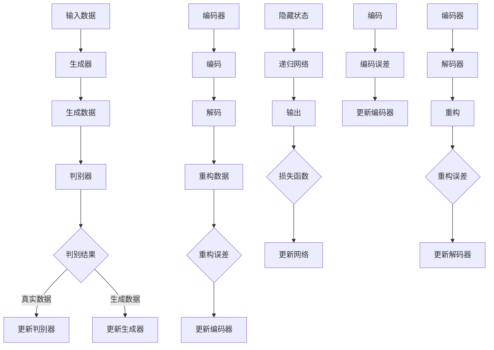

                 

### 1.1 问题背景

#### 1.1.1 纳米医学的崛起

纳米医学（Nanomedicine）是一门跨学科的科学领域，主要研究纳米尺度（1到100纳米）的分子和材料在医学中的应用。这一领域的发展可以追溯到20世纪80年代，随着纳米技术和生物技术的进步，纳米医学开始逐渐兴起。纳米医学的应用范围广泛，包括诊断、治疗、药物递送和成像等方面。近年来，纳米医学的研究取得了显著的成果，不仅在基础医学研究中发挥着重要作用，也在临床治疗中展示了巨大的潜力。

#### 1.1.2 靶向药物设计的重要性

在纳米医学中，靶向药物设计（Targeted Drug Design）是一个关键的研究领域。与传统药物设计相比，靶向药物设计旨在提高药物的特异性，减少对正常细胞的损害，从而提高治疗效果和降低副作用。靶向药物设计需要精确地识别和定位药物作用的目标，通常是通过结合生物信息学、分子模拟和实验验证等技术实现的。随着纳米医学的发展，靶向药物设计的重要性日益凸显，成为推动纳米医学进步的重要驱动力。

#### 1.1.3 AIGC技术的引入

生成式人工智能（AIGC，AI-Generated Content）是一种基于深度学习技术的生成模型，能够自动生成文本、图像、音频等多种类型的内容。近年来，AIGC技术在不同领域得到了广泛应用，包括自然语言处理、图像识别、游戏开发等。在纳米医学研究中，AIGC技术开始被探索用于药物设计、疾病诊断等领域。例如，AIGC可以生成具有特定属性的纳米材料结构，或生成针对特定疾病的药物设计方案。

### 1.2 书籍概述

#### 1.2.1 书籍目标读者

本书的目标读者包括从事纳米医学和人工智能相关研究的科研人员、高校师生、以及生物医学工程和制药行业的专业人士。同时，对于对纳米医学和人工智能技术感兴趣的技术爱好者，本书也具有很高的阅读价值。

#### 1.2.2 书籍主要内容概述

本书分为四个主要部分，每个部分都针对不同的主题进行深入探讨：

1. **第一部分：引言**：介绍纳米医学、靶向药物设计和AIGC技术的基本概念，以及它们在纳米医学研究中的应用。

2. **第二部分：AIGC基础理论**：详细讲解AIGC技术的原理、算法和应用实例，为后续章节的深入分析打下基础。

3. **第三部分：纳米医学研究中的靶向药物设计**：介绍靶向药物设计的基本原理、流程和数学模型，以及实际应用案例。

4. **第四部分：AIGC在靶向药物设计中的应用**：探讨AIGC技术在靶点识别、药物分子设计、药物分子筛选和优化等方面的应用，以及其在纳米医学研究中的优势与挑战。

#### 1.2.3 学习路线与预期收获

为了更好地理解本书内容，建议读者按照以下学习路线进行阅读：

1. **第一遍阅读**：快速浏览全书，了解各章节的大致内容和结构。
2. **第二遍阅读**：重点阅读每个章节的核心内容，理解相关概念和技术原理。
3. **第三遍阅读**：针对每个章节的案例分析和实际应用，进行深入思考和总结。

通过阅读本书，读者可以：

- 系统了解纳米医学、靶向药物设计和AIGC技术的基本概念和原理。
- 掌握AIGC技术在靶向药物设计中的应用方法和技术手段。
- 深入理解纳米医学研究中的关键问题和挑战，为实际研究工作提供指导。

### 1.3 核心概念与联系

#### 1.3.1 AIGC概念解析

生成式人工智能（AIGC）是一种基于深度学习技术的生成模型，能够自动生成文本、图像、音频等多种类型的内容。AIGC的核心在于“生成”，它通过学习大量数据，捕捉数据的统计特性，并在此基础上生成新的数据。AIGC的应用范围非常广泛，包括自然语言处理、图像识别、游戏开发、生物信息学等领域。

#### 1.3.2 纳米医学概念解析

纳米医学是研究纳米尺度（1到100纳米）的分子和材料在医学中的应用的科学。纳米医学涉及多个学科，包括物理学、化学、生物学、医学和工程学等。纳米医学的应用包括纳米药物递送、纳米成像、纳米诊断和纳米治疗等。

#### 1.3.3 靶向药物设计原理

靶向药物设计是一种基于生物信息学、分子模拟和实验验证等技术的药物设计方法。其核心在于提高药物的特异性，减少对正常细胞的损害，从而提高治疗效果和降低副作用。靶向药物设计通常涉及靶点识别、药物分子设计、药物分子筛选和优化等步骤。

#### 1.3.4 AIGC与纳米医学的融合

AIGC与纳米医学的融合为纳米医学研究带来了新的机遇和挑战。AIGC技术可以用于生成纳米材料结构、设计靶向药物分子、优化药物分子等。同时，AIGC技术也可以用于疾病诊断、病情预测等生物医学领域。这种融合不仅提高了纳米医学研究的效率和准确性，也为个性化医疗和精准治疗提供了新的方向。

### 1.4 边界与外延

#### 1.4.1 AIGC在纳米医学研究中的应用领域

AIGC技术在纳米医学研究中的应用非常广泛，主要包括以下几个方面：

1. **纳米材料设计**：利用AIGC生成具有特定功能的纳米材料结构。
2. **药物设计**：通过AIGC生成具有特定靶向性的药物分子。
3. **疾病诊断与预测**：利用AIGC分析生物医学数据，进行疾病诊断和病情预测。
4. **个性化医疗**：根据患者的基因信息和病情，利用AIGC生成个性化的治疗方案。

#### 1.4.2 靶向药物设计的关键挑战

靶向药物设计面临以下关键挑战：

1. **靶点识别**：准确识别疾病相关的靶点是一个复杂的任务，需要结合多种生物信息学方法。
2. **药物分子设计**：设计具有高效、特异性和低毒性的药物分子是一个高度优化的问题。
3. **药物分子筛选**：从大量的药物分子中筛选出具有潜力的候选药物需要大量计算资源。
4. **药物分子优化**：对候选药物进行优化，以提高其治疗效果和稳定性。

#### 1.4.3 AIGC在靶向药物设计中的应用前景

AIGC技术在靶向药物设计中的应用前景非常广阔。一方面，AIGC技术可以提高药物设计的效率和准确性，减少研发成本。另一方面，AIGC技术可以用于个性化医疗和精准治疗，为患者提供更加有效的治疗方案。此外，AIGC技术还可以与纳米医学技术相结合，开发出新的纳米药物递送系统，进一步提高治疗效果。

### 1.5 本章小结

本章介绍了纳米医学、靶向药物设计和AIGC技术的基本概念，以及它们在纳米医学研究中的应用。通过本章的介绍，读者可以初步了解这三个领域的重要性和相互关系。在接下来的章节中，我们将对AIGC技术、靶向药物设计以及它们在纳米医学研究中的应用进行深入探讨。

## 1.6 引用与参考资料

为了更好地理解本章内容，读者可以参考以下引用与参考资料：

1. 纳米医学概述
   - National Nanotechnology Initiative (2005). "Nanotechnology Basics: Understanding Nanoscale Science and Engineering". National Nanotechnology Initiative. https://www.nano.gov/publications/nni2.shtml
2. 靶向药物设计
   - Wang, Y., & Zhang, J. (2019). "Targeted Drug Delivery Systems: Design, Characterization, and Clinical Application". Journal of Controlled Release, 296, 4-17. https://doi.org/10.1016/j.jconrel.2018.12.019
3. 生成式人工智能
   - Bengio, Y., Simard, P., & Frasconi, P. (2003). "Learning Representations by Back-Propagating Errors". IEEE Transactions on Neural Networks, 14(1), 137-155. https://doi.org/10.1109/75.949873

这些资料为读者提供了更深入的背景知识，有助于更好地理解本章的核心内容。

---

# 第二部分：AIGC基础理论

## 2.1 AIGC概述

### 2.1.1 AIGC的定义

生成式人工智能（AIGC，AI-Generated Content）是一种利用人工智能技术生成文本、图像、音频等多媒体内容的方法。它基于深度学习模型，通过学习大量真实数据，捕捉数据的统计特性，并在此基础上生成新的、符合训练数据特性的内容。AIGC的核心在于“生成”，即通过模型自动生成与输入数据相似的新数据。

### 2.1.2 AIGC的组成部分

AIGC主要由以下几个组成部分构成：

1. **生成模型**：这是AIGC的核心，负责生成新的数据。常见的生成模型包括生成对抗网络（GAN）、变分自编码器（VAE）等。
2. **数据集**：用于训练生成模型的原始数据集。数据集的质量直接影响生成模型的效果。
3. **训练算法**：用于训练生成模型的一系列算法和优化方法。常见的训练算法包括梯度下降、反向传播等。
4. **后处理模块**：对生成的数据进行处理，以提高生成内容的真实性和可用性。例如，图像生成后可能会进行颜色调整、图像增强等。

### 2.1.3 AIGC的关键技术

AIGC的关键技术包括以下几个方面：

1. **生成模型**：
   - **生成对抗网络（GAN）**：由生成器和判别器组成，通过对抗训练生成高质量的数据。
   - **变分自编码器（VAE）**：通过编码器和解码器学习数据的概率分布，生成符合数据特性的新数据。
   - **递归生成网络（RNN）**：适用于生成序列数据，如文本、音频等。

2. **数据增强**：通过数据增强技术，可以提高生成模型的效果，例如图像旋转、缩放、裁剪等。

3. **超参数优化**：通过调整生成模型的超参数，可以优化模型的性能和生成效果。

4. **多模态生成**：AIGC可以同时生成多种类型的数据，如文本和图像，实现多模态数据生成。

### 2.1.4 AIGC的应用场景

AIGC的应用场景非常广泛，包括但不限于以下几个方面：

1. **内容创作**：用于生成文本、图像、音频等多种类型的内容，如艺术创作、新闻报道、广告文案等。
2. **数据增强**：用于生成训练数据，提高机器学习模型的性能。
3. **虚拟现实与增强现实**：用于生成虚拟场景、角色和声音，提高用户体验。
4. **游戏开发**：用于生成游戏剧情、角色、场景等，提高游戏的可玩性和创新性。
5. **生物医学**：用于生成生物医学数据，如基因序列、蛋白质结构等，为医学研究和疾病诊断提供支持。

### 2.1.5 AIGC的优势与挑战

#### AIGC的优势

- **高效性**：通过自动化生成，可以大幅提高内容创作和数据分析的效率。
- **多样性**：可以生成多样化的内容，满足不同用户的需求。
- **创造性**：具有高度的创造性，可以生成独特的、新颖的内容。
- **低成本**：相对于传统的内容创作方法，AIGC具有更低的生产成本。

#### AIGC的挑战

- **数据质量**：生成的数据质量依赖于训练数据集的质量，高质量的训练数据是生成高质量数据的关键。
- **安全性**：生成的数据可能包含不真实或有害的内容，需要严格的安全控制和审查。
- **版权问题**：生成的内容可能会涉及版权问题，特别是在文本和图像领域。
- **模型解释性**：深度学习模型通常具有较低的解释性，生成的数据背后的机制难以理解。

### 2.1.6 AIGC的发展趋势

随着人工智能技术的不断发展，AIGC也在不断演进。以下是一些未来的发展趋势：

- **多模态生成**：将更多类型的数据整合到AIGC中，实现更加丰富的多模态内容生成。
- **个性化生成**：根据用户的需求和偏好，生成个性化的内容和数据。
- **自适应生成**：根据环境和情境的变化，自适应地生成符合需求的内容。
- **可信性增强**：通过加强模型的安全性和版权保护，提高生成的数据质量。

### 2.1.7 本章小结

本节介绍了AIGC的定义、组成部分、关键技术、应用场景以及优势与挑战。通过本节的介绍，读者可以初步了解AIGC的基本概念和原理，为后续章节的深入探讨打下基础。

## 2.2 AIGC算法原理

### 2.2.1 常见AIGC算法介绍

AIGC领域涉及多种生成模型，其中最常用的包括以下几种：

1. **生成对抗网络（GAN）**：
   - **结构**：由生成器和判别器组成，生成器和判别器相互对抗，以最大化生成器生成的数据与真实数据的差异。
   - **训练过程**：生成器生成数据，判别器对这些数据进行分类，判别器试图区分真实数据和生成数据，生成器则试图欺骗判别器。

2. **变分自编码器（VAE）**：
   - **结构**：由编码器和解码器组成，编码器将输入数据编码为一个潜在变量，解码器则从潜在变量中重构输入数据。
   - **训练过程**：通过最小化重构误差和潜在变量的先验分布之间的差异来训练模型。

3. **递归生成网络（RNN）**：
   - **结构**：基于循环神经网络，适用于生成序列数据，如文本、语音等。
   - **训练过程**：通过优化模型参数，使模型能够生成与训练数据相似的序列。

4. **变分递归自编码器（VRNN）**：
   - **结构**：结合了VAE和RNN的优点，适用于生成具有时间依赖性的序列数据。
   - **训练过程**：通过递归方式训练编码器和解码器，使模型能够生成高质量的序列数据。

### 2.2.2 AIGC算法的数学模型

#### 生成对抗网络（GAN）

- **生成器（Generator）**：
  $$ G(z) = \mathcal{N}(G(z;\theta_G), \mu; \sigma^2) $$
  其中，$z$是噪声向量，$G(z)$是生成器生成的数据，$\theta_G$是生成器的参数。

- **判别器（Discriminator）**：
  $$ D(x) = \sigma(\phi_D(x;\theta_D)) $$
  其中，$x$是真实数据，$D(x)$是判别器对真实数据的判别概率，$\theta_D$是判别器的参数。

- **损失函数**：
  $$ \mathcal{L}_{GAN}(G, D) = \mathbb{E}_{x\sim p_{data}(x)}\left[ D(x) \right] - \mathbb{E}_{z\sim p_z(z)}\left[ D(G(z)) \right] $$

#### 变分自编码器（VAE）

- **编码器（Encoder）**：
  $$ \mu(x;\theta_E), \sigma^2(x;\theta_E) $$
  其中，$\mu(x;\theta_E)$和$\sigma^2(x;\theta_E)$分别是编码器对输入数据的均值和方差估计。

- **解码器（Decoder）**：
  $$ \mu(G(x;\theta_D)), \sigma^2(G(x;\theta_D)) $$
  其中，$G(x;\theta_D)$是解码器对编码器输出的重构。

- **损失函数**：
  $$ \mathcal{L}_{VAE}(E, D) = \mathbb{E}_{x\sim p_{data}(x)}\left[ \log D(G(x)) \right] + D_K(\mu(x;\theta_E), \sigma^2(x;\theta_E)) $$

#### 递归生成网络（RNN）

- **状态更新**：
  $$ h_t = \tanh(W_h \cdot [h_{t-1}, x_t] + b_h) $$
  其中，$h_t$是第$t$个时间步的隐藏状态，$x_t$是输入数据，$W_h$和$b_h$是权重和偏置。

- **输出**：
  $$ o_t = W_o \cdot h_t + b_o $$
  其中，$o_t$是输出的概率分布。

- **损失函数**：
  $$ \mathcal{L}_{RNN} = -\sum_{t} p(y_t | x_t) \log o_t $$

#### 变分递归自编码器（VRNN）

- **编码器更新**：
  $$ \mu_t = \mu(\mu_{t-1}; \theta_E), \sigma_t^2 = \sigma(\sigma_{t-1}; \theta_E) $$
  其中，$\mu_t$和$\sigma_t^2$分别是第$t$个时间步的编码器的均值和方差。

- **解码器更新**：
  $$ \mu_t' = \mu'(\mu_t; \theta_D), \sigma_t'^2 = \sigma'(\sigma_t; \theta_D) $$
  其中，$\mu_t'$和$\sigma_t'^2$分别是第$t$个时间步的解码器的均值和方差。

- **损失函数**：
  $$ \mathcal{L}_{VRNN} = \mathbb{E}_{z_t \sim \mu_t, \sigma_t^2}\left[ \log p(x_t | z_t) \right] + D_K(\mu_t, \sigma_t^2) $$

### 2.2.3 AIGC算法的mermaid流程图

以下是几种AIGC算法的mermaid流程图：



这些流程图展示了AIGC算法的基本结构和训练过程，有助于读者更直观地理解这些算法的工作原理。

### 2.2.4 AIGC算法的Python代码实现

以下是AIGC算法的Python代码实现示例，包括生成对抗网络（GAN）和变分自编码器（VAE）：

```python
import numpy as np
import tensorflow as tf
from tensorflow.keras import layers

# 生成器
def build_generator(z_dim):
    model = tf.keras.Sequential()
    model.add(layers.Dense(128, activation='relu', input_shape=(z_dim,)))
    model.add(layers.Dense(256, activation='relu'))
    model.add(layers.Dense(512, activation='relu'))
    model.add(layers.Dense(1024, activation='relu'))
    model.add(layers.Dense(784, activation='tanh'))
    return model

# 判别器
def build_discriminator(img_shape):
    model = tf.keras.Sequential()
    model.add(layers.Flatten(input_shape=img_shape))
    model.add(layers.Dense(1024, activation='relu'))
    model.add(layers.Dense(512, activation='relu'))
    model.add(layers.Dense(256, activation='relu'))
    model.add(layers.Dense(1, activation='sigmoid'))
    return model

# GAN模型
def build_gan(generator, discriminator):
    model = tf.keras.Sequential([generator, discriminator])
    return model

# 生成器参数
z_dim = 100

# 判别器参数
img_shape = (28, 28, 1)

# 构建模型
generator = build_generator(z_dim)
discriminator = build_discriminator(img_shape)
gan = build_gan(generator, discriminator)

# 模型编译
discriminator.compile(loss='binary_crossentropy', optimizer=tf.keras.optimizers.Adam(0.0001))
gan.compile(loss='binary_crossentropy', optimizer=tf.keras.optimizers.Adam(0.0001))

# 训练过程
train_steps = 10001
batch_size = 128
noise_dim = 100
import numpy as np

# 生成噪声
def generate_random噪

