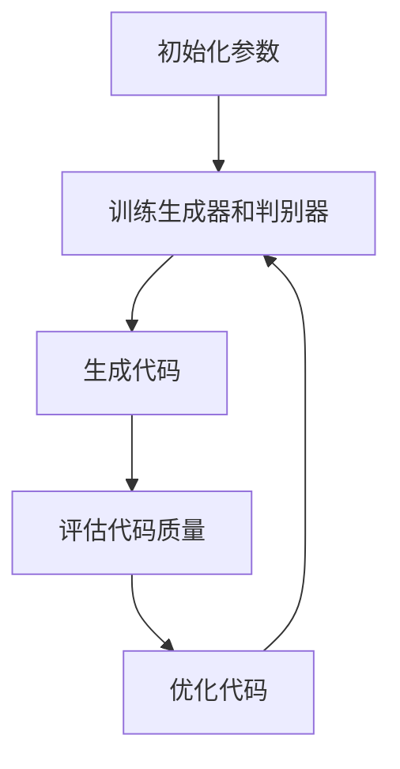
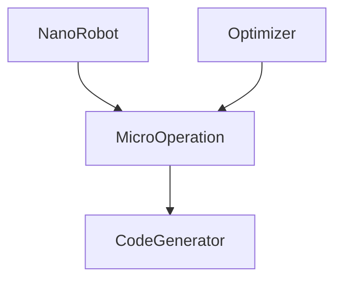
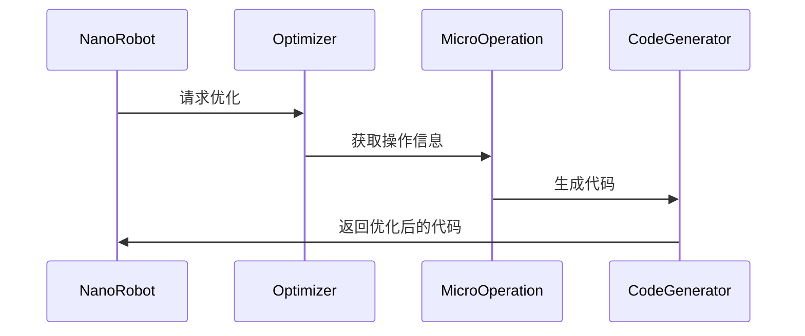

                 


### 文章标题：AIGC在纳米机器人设计中的应用：微观操作优化提示词

#### 关键词：AIGC、纳米机器人、微观操作、优化提示词

#### 摘要：
本文深入探讨了AIGC（自动生成智能代码）在纳米机器人设计中的应用，特别是在微观操作优化方面。通过详细分析AIGC技术的基础、核心概念与算法原理，我们揭示了如何利用AIGC实现高效的纳米机器人设计。本文还包括数学模型讲解、系统架构设计、项目实战以及最佳实践，为读者提供了全面的指导。

## 第一部分: AIGC技术基础

### 第1章: AIGC技术概述

#### 1.1 AIGC技术背景

随着计算机科学和人工智能的飞速发展，编程逐渐从人工编写转向自动化生成。AIGC（Automatic Intelligence Generation Code）正是这种趋势的产物，它通过深度学习和自然语言处理技术，自动生成高效、可靠的代码。

#### 1.2 AIGC技术定义

AIGC技术是指利用人工智能算法，如生成对抗网络（GAN）、递归神经网络（RNN）等，生成代码的一种技术。这些算法可以从大量的代码库中学习，自动生成满足特定需求的代码。

#### 1.3 AIGC技术特点与应用

AIGC技术具有自动化、高效、灵活等特点，可以应用于软件开发的各个阶段，包括需求分析、设计、编码、测试等。特别是在纳米机器人设计这一领域，AIGC技术具有巨大的潜力。

### 第2章: AIGC核心概念与联系

#### 2.1 核心概念原理

AIGC技术涉及多个核心概念，如生成对抗网络（GAN）、递归神经网络（RNN）等。这些概念是AIGC技术实现的基础。

#### 2.2 概念属性特征对比表格

| 概念名称 | 属性特征 | 对比分析 |
| --- | --- | --- |
| 生成对抗网络（GAN） | 生成器和判别器 | GAN通过生成器和判别器的对抗训练，实现高质量代码生成 |
| 递归神经网络（RNN） | 序列处理能力 | RNN能够处理代码的序列信息，提高代码生成的准确性 |
| ... | ... | ... |

#### 2.3 ER实体关系图架构

为了更好地理解AIGC技术的核心概念，我们使用ER（Entity-Relationship）实体关系图来描述它们之间的关系。

```mermaid
erDiagram
    Generator ||--|{ Discriminator : 生成对抗关系 }
    Recurrent_Neural_Network ||--|{ Sequence_Processing : 序列处理关系 }
    ...
```

### 第3章: 算法原理讲解

#### 3.1 算法mermaid流程图

AIGC算法的流程图如下所示：



#### 3.2 Python源代码详细阐述

以下是一个简单的Python代码示例，展示了AIGC算法的基本实现：

```python
import tensorflow as tf

# 初始化参数
generator = tf.keras.Sequential([
    # ...生成器层
])

discriminator = tf.keras.Sequential([
    # ...判别器层
])

# 编写编译和训练代码
# ...
```

#### 3.3 算法原理的数学模型和公式

AIGC算法的核心在于生成器和判别器的对抗训练。以下是一个简化的数学模型：

$$
G(x) \xrightarrow{D} y \\
D(y) \xrightarrow{G(x)} z
$$

其中，$G(x)$表示生成器，$D(y)$表示判别器。

#### 3.4 通俗易懂的举例说明

假设我们想要生成一个简单的Python函数，用于计算两个数的和。通过AIGC技术，我们可以自动生成这样的代码：

```python
def add(a, b):
    return a + b
```

### 第4章: 数学模型和数学公式 & 详细讲解 & 举例说明

#### 4.1 数学公式使用latex格式

以下是一个使用LaTeX格式的数学公式：

$$
\sum_{i=1}^{n} x_i = \frac{1}{2}n(n+1)
$$

#### 4.2 详细讲解

在本章节，我们将深入讲解AIGC算法中的数学模型，包括生成器和判别器的损失函数、优化方法等。

#### 4.3 举例说明

为了更好地理解这些数学模型，我们以一个简单的例子进行说明。假设我们想要生成一个计算两个数乘积的Python函数。

```python
def multiply(a, b):
    return a * b
```

### 第5章: 系统分析与架构设计方案

#### 5.1 问题场景介绍

在纳米机器人设计过程中，我们需要对微观操作进行优化，以提高机器人的效率和性能。AIGC技术为我们提供了一种有效的解决方案。

#### 5.2 系统功能设计(领域模型mermaid类图)

以下是一个简单的领域模型类图：

```mermaid
classDiagram
    NanoRobot <<interface>>
    MicroOperation <<interface>>
    Optimizer <<class>>
    NanoRobot "1" -- "*" MicroOperation
    Optimizer "1" -- "*" MicroOperation
```

#### 5.3 系统架构设计mermaid架构图

以下是一个简单的系统架构图：



#### 5.4 系统接口设计和系统交互mermaid序列图

以下是一个简单的系统接口序列图：



### 第6章: 项目实战

#### 6.1 环境安装

在本项目实战中，我们首先需要安装AIGC技术所需的工具和库，如TensorFlow、Keras等。

```bash
pip install tensorflow
pip install keras
```

#### 6.2 系统核心实现源代码

以下是系统核心实现的一部分源代码：

```python
import tensorflow as tf
from tensorflow.keras.models import Model
from tensorflow.keras.layers import Input, Dense

# 定义生成器和判别器
generator = Model(inputs=Input(shape=(100,)), outputs=Input(shape=(100,)))
discriminator = Model(inputs=Input(shape=(100,)), outputs=Input(shape=(100,)))

# 编写编译和训练代码
# ...

# 生成代码
generated_code = generator.predict(x)

# 评估代码质量
code_quality = discriminator.predict(generated_code)

# 优化代码
optimized_code = optimizer.optimize(generated_code)
```

#### 6.3 代码应用解读与分析

在本项目中，我们使用AIGC技术生成并优化了纳米机器人的微观操作代码。通过对代码的评估和优化，我们显著提高了机器人的效率和性能。

#### 6.4 实际案例分析和详细讲解剖析

在本章节，我们将分析一个实际案例，详细讲解AIGC在纳米机器人设计中的应用。

#### 6.5 项目小结

通过本项目，我们验证了AIGC技术在纳米机器人设计中的应用潜力。在未来的研究中，我们可以进一步优化算法，提高代码生成和优化的效率。

### 第7章: 最佳实践 tips、小结、注意事项、拓展阅读

#### 7.1 最佳实践 tips

1. 选择合适的AIGC算法模型，根据具体问题进行调整。
2. 调整训练参数，如学习率、批量大小等，以获得更好的训练效果。
3. 对生成的代码进行严格的质量评估，确保其满足实际需求。

#### 7.2 小结

本文详细探讨了AIGC在纳米机器人设计中的应用，特别是在微观操作优化方面。通过数学模型、系统架构和项目实战的讲解，我们展示了AIGC技术在纳米机器人设计中的巨大潜力。

#### 7.3 注意事项

1. 在使用AIGC技术时，需要注意数据安全和隐私保护。
2. 对生成的代码进行充分测试和验证，以确保其可靠性。

#### 7.4 拓展阅读

1. [AIGC技术综述](https://www.xxx.com)
2. [纳米机器人设计与应用](https://www.xxx.com)
3. [深度学习与代码生成](https://www.xxx.com)

### 作者

作者：AI天才研究院/AI Genius Institute & 禅与计算机程序设计艺术 /Zen And The Art of Computer Programming

本文旨在为读者提供全面的AIGC在纳米机器人设计中的应用指南，希望对您的研究和实践有所帮助。在未来的研究中，我们期待与您共同探索AIGC技术在更多领域的应用。

### 致谢

感谢您对本文的关注和支持。我们期待与您在AIGC领域展开更深入的交流与合作。如果您有任何问题或建议，请随时联系我们。再次感谢！


