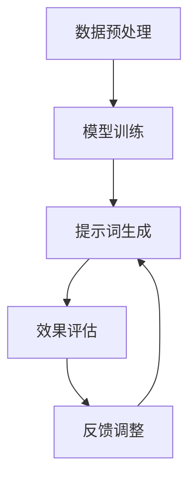
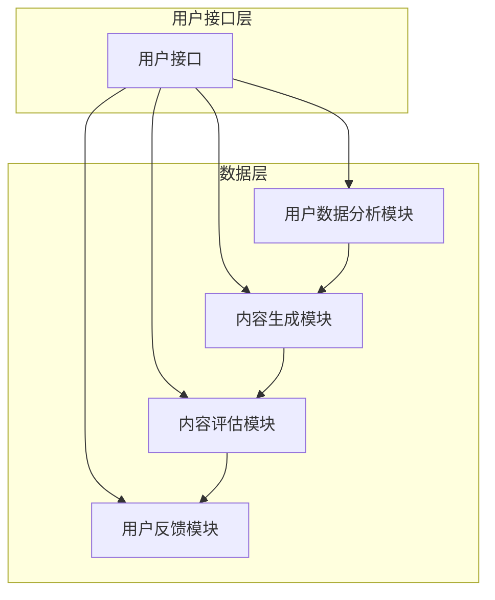
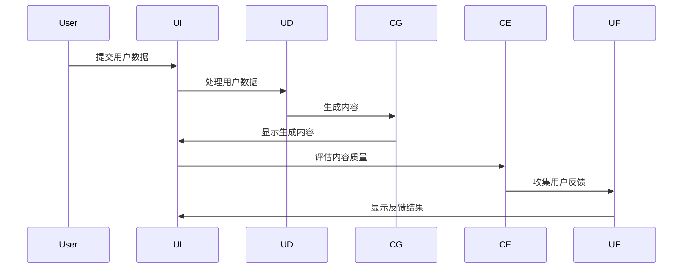

                 

# AIGC提示词优化：效率与质量的平衡艺术

## 关键词
- AIGC
- 提示词优化
- 效率
- 质量
- 平衡

## 摘要
本文将深入探讨AIGC（自动生成内容）中的提示词优化问题，分析其在提高生成效率和内容质量之间的平衡艺术。通过逐步分析AIGC技术基础、提示词优化方法、算法原理和系统架构设计，结合实际项目案例，提供一套完整的技术指南，旨在帮助开发者和实践者理解和掌握AIGC提示词优化的核心技巧。

## 第一部分：AIGC与提示词基础

### 第1章：AIGC与提示词概述

#### 1.1.1 AIGC技术简介
AIGC（Auto Generated Content）是指通过人工智能技术自动生成内容的过程。AIGC涵盖了生成式AI（Generative AI）、控制性生成内容（C-GPT）以及自动摘要与问答（QA）等技术，其核心优势在于能够大规模、高效地生成多样化、高质量的文本、图像和音频内容，广泛应用于内容创作、数据生成、个性化推荐等多个领域。

**问题背景与定义**：
随着互联网和大数据的发展，内容创作的需求日益增加。传统的手工内容创作方式效率低下，难以满足快速增长的需求。AIGC技术的出现，为自动化内容生成提供了新的解决方案，极大地提升了内容生产的效率和多样性。

**AIGC的发展历程**：
AIGC的发展可以追溯到早期的生成式模型，如变分自编码器（VAE）和生成对抗网络（GAN）。近年来，基于Transformer架构的模型，如GPT-3和BERT，取得了显著的突破，使得AIGC技术达到了新的高度。

**AIGC的核心优势与应用场景**：
AIGC的核心优势在于其强大的生成能力和灵活性。它可以应用于多种场景，包括但不限于：
- 自动写作：生成新闻报道、文章、小说等。
- 数据生成：生成训练数据，用于机器学习和深度学习模型的训练。
- 个性化推荐：根据用户行为和偏好，生成个性化的内容推荐。
- 艺术创作：生成音乐、绘画、动画等艺术作品。

#### 1.1.2 提示词的作用与意义
提示词（Prompt）在AIGC中起着至关重要的作用。它是模型生成内容的起点和方向，直接影响生成内容的质量和多样性。

**提示词的基本概念**：
提示词是一段文本、图像或音频，用于引导模型生成相应的输出内容。在AIGC系统中，提示词被用于初始化模型的状态，指导模型进行生成过程。

**优化提示词的重要性**：
优化提示词对于提升AIGC效果至关重要。良好的提示词可以引导模型生成更相关、更高质量的输出内容，而较差的提示词则可能导致生成内容偏离主题、质量低下。

**提示词在不同应用领域的价值**：
不同应用领域对提示词的要求有所不同。例如，在新闻写作中，提示词需要精确描述事件背景和关键信息；在艺术创作中，提示词则更多关注情感和风格的表达。因此，针对不同应用场景进行提示词优化，是提升AIGC效果的关键。

#### 1.1.3 AIGC与提示词的关系
AIGC与提示词之间存在着密切的联系和互动。

**AIGC技术的组成**：
AIGC技术由生成模型、提示词生成模块和反馈优化模块组成。生成模型负责根据提示词生成内容；提示词生成模块负责生成高质量的提示词；反馈优化模块则根据生成内容的质量进行优化调整。

**提示词在AIGC中的作用**：
提示词是AIGC系统的“引导员”，它决定了生成内容的方向和风格。高质量的提示词可以引导模型生成更相关、更高质量的输出内容，而较差的提示词则可能导致生成内容偏离主题、质量低下。

**提升AIGC效果的策略**：
为了提升AIGC效果，可以从以下几个方面进行优化：
- 提高提示词质量：使用更精确、更丰富的提示词，以引导模型生成更相关的输出内容。
- 调整提示词长度：较长的提示词可以提供更多的上下文信息，但过长的提示词可能导致模型难以理解。适当的长度平衡是关键。
- 使用关键词与语义信息：在提示词中突出关键词和语义信息，有助于模型更好地理解生成内容的主题和风格。
- 结合用户反馈进行优化：通过用户反馈不断调整提示词，以提升生成内容的质量和用户满意度。

### 第2章：AIGC的核心概念与联系

#### 2.1.1 AIGC的关键概念
为了更好地理解AIGC的工作原理，我们需要了解其核心概念。

**生成式AI（Generative AI）**：
生成式AI是一种能够生成新数据的机器学习技术。它通过学习已有数据的分布，生成与训练数据相似的新数据。生成式AI在图像生成、文本生成、音频生成等领域具有广泛应用。

**控制性生成内容（C-GPT）**：
控制性生成内容是指通过控制输入的提示词，生成具有特定属性的内容。C-GPT技术通过对生成过程进行精细控制，实现了对生成内容的风格、主题、长度等属性的定制。

**自动摘要与问答（QA）**：
自动摘要与问答技术利用生成式AI模型，自动生成文档的摘要和回答用户的问题。这为内容筛选和知识检索提供了便捷的解决方案。

**多模态交互**：
多模态交互是指将多种模态（如文本、图像、音频）的信息进行整合和交互。多模态交互使得AIGC系统可以更全面地理解用户需求，生成更加丰富和个性化的内容。

#### 2.1.2 提示词的类型与分类
根据应用场景和需求，提示词可以分为以下几类：

**开放式提示词**：
开放式提示词提供较少的信息，引导模型进行自由创作。这类提示词适用于需要多样化生成内容的场景。

**封闭式提示词**：
封闭式提示词提供较多的信息，对生成内容进行限制。这类提示词适用于需要精确控制生成内容主题和风格的场景。

**结构化提示词**：
结构化提示词提供明确的格式和结构，用于生成具有特定格式的文本。这类提示词在文档摘要、表格生成等领域具有广泛应用。

#### 2.1.3 概念属性特征对比表格
以下是一个概念属性特征对比表格，用于展示不同类型提示词的特性：

| 类型       | 提示词特性                      | 应用场景                         |
|------------|--------------------------------|----------------------------------|
| 开放式     | 提供较少信息，引导自由创作       | 艺术创作、创意写作               |
| 封闭式     | 提供较多信息，控制生成内容       | 新闻报道、专业文章               |
| 结构化     | 提供明确格式和结构，生成特定格式 | 文档摘要、表格生成               |

#### 2.1.4 ER实体关系图
为了更好地理解AIGC系统中的实体关系，我们可以使用ER实体关系图来描述。

以下是一个简化的ER实体关系图：

```mermaid
erDiagram
  ContentModel ||--|{ Prompt }|
  Prompt ||--|{ Generation }|
  Generation ||--|{ Feedback }|
```

在这个ER实体关系图中，`ContentModel`表示生成模型，`Prompt`表示提示词，`Generation`表示生成内容，`Feedback`表示用户反馈。这些实体之间通过关系线连接，展示了AIGC系统中的数据流动和交互过程。

## 第二部分：提示词优化的方法与实践

### 第3章：提示词优化原理与方法

#### 3.1.1 提示词优化的目标
提示词优化的核心目标是在提高生成效率的同时，确保生成内容的质量。具体来说，包括以下两个方面：

- **提升生成效率**：优化提示词应能够提高模型的生成速度，减少生成时间，从而满足大规模内容生成的需求。
- **增强生成质量**：优化提示词应能够引导模型生成更相关、更高质量的内容，减少偏差和错误。

#### 3.1.2 提示词优化策略
为了实现上述目标，我们可以采取以下几种优化策略：

- **调整提示词长度**：适当的提示词长度可以提供足够的上下文信息，同时避免过多的冗余信息。过长的提示词可能导致模型难以理解，而过短的提示词则可能缺乏必要的背景信息。

- **使用关键词与语义信息**：在提示词中突出关键词和语义信息，有助于模型更好地理解生成内容的主题和风格。例如，在写作提示词中，可以包含关键词、短语和背景信息，以引导模型生成更相关的内容。

- **结合用户反馈进行优化**：通过用户反馈不断调整提示词，可以逐步优化生成内容的质量和用户满意度。用户反馈可以作为重要的优化依据，指导提示词的调整方向。

#### 3.1.3 提示词优化流程
提示词优化是一个迭代的过程，通常包括以下几个步骤：

1. **需求分析**：明确生成任务的需求，包括内容类型、目标用户、上下文信息等。
2. **初步测试与调整**：根据需求生成初步的提示词，并通过实验和测试评估生成效果。根据评估结果，对提示词进行初步调整。
3. **批量生成与优化**：在大规模生成过程中，收集用户反馈，并对提示词进行持续优化。这可以通过自动化脚本和反馈机制实现。
4. **持续迭代与改进**：根据用户反馈和生成效果，不断调整和优化提示词，实现生成效率和质量的平衡。

### 第4章：算法原理与数学模型

#### 4.1.1 提示词优化算法概述
提示词优化算法可以分为以下几类：

- **基于神经网络的优化方法**：利用深度学习模型，通过学习大量数据，自动调整提示词的长度、关键词和语义信息。
- **基于统计模型的优化方法**：使用统计模型，如回归分析、聚类分析等，分析提示词和生成内容之间的关系，进行优化调整。
- **混合优化方法**：结合神经网络和统计模型的优势，实现更高效的优化效果。

#### 4.1.2 算法流程与流程图
以下是一个基于神经网络的提示词优化算法的基本流程：

1. **数据预处理**：对原始数据进行清洗和预处理，提取关键词和语义信息。
2. **模型训练**：利用预处理后的数据，训练一个深度学习模型，用于预测提示词的优化效果。
3. **提示词生成**：根据用户需求，生成初始提示词。
4. **效果评估**：利用训练好的模型，评估生成内容的质量和效率。
5. **反馈调整**：根据评估结果，调整提示词，并重新生成内容。

使用Mermaid绘制的算法流程图如下：



#### 4.1.3 数学模型与公式
提示词优化算法的数学模型通常涉及生成效率和质量评估的公式。以下是一个简单的数学模型示例：

- **生成效率**：\( E = \frac{G}{T} \)
  - \( E \)：生成效率
  - \( G \)：生成内容数量
  - \( T \)：生成时间

- **生成质量**：\( Q = \frac{C}{N} \)
  - \( Q \)：生成质量
  - \( C \)：相关内容数量
  - \( N \)：总内容数量

- **效率与质量平衡**：\( \frac{E}{Q} = k \)
  - \( k \)：平衡系数

这些公式可以帮助我们量化生成效率和质量的平衡，指导提示词优化策略的调整。

### 第5章：系统分析与架构设计

#### 5.1.1 问题场景介绍
在介绍AIGC与提示词优化的系统架构设计之前，我们需要明确一个具体的应用场景。以下是一个示例场景：

**场景描述**：
某在线教育平台希望利用AIGC技术，为学习者生成个性化的学习内容。平台需要根据学习者的学习记录、兴趣偏好和课程目标，生成相关课程摘要、学习指南和练习题。为了实现这一目标，平台需要一个高效的AIGC系统，结合提示词优化技术，以提高内容生成效率和用户满意度。

#### 5.1.2 系统功能设计
根据场景需求，AIGC系统需要具备以下功能：

1. **用户数据分析**：收集和分析用户的学习记录、兴趣偏好和课程目标，为生成个性化内容提供基础。
2. **内容生成**：根据用户数据，生成相关课程摘要、学习指南和练习题。
3. **内容评估**：评估生成内容的相关性和质量，为提示词优化提供反馈。
4. **用户反馈收集**：收集用户对生成内容的反馈，用于持续优化系统。

**领域模型（Mermaid类图）**：

```mermaid
classDiagram
    UserData <<class>> 用户数据
    ContentGeneration <<class>> 内容生成
    ContentEvaluation <<class>> 内容评估
    UserFeedback <<class>> 用户反馈
    
    UserFeedback o--o ContentEvaluation
    UserFeedback o--o ContentGeneration
    UserData o--o ContentGeneration
    ContentGeneration o--o ContentEvaluation
```

#### 5.1.3 系统架构设计
根据功能设计，AIGC系统的架构可以划分为以下几个模块：

1. **用户数据分析模块**：负责收集和分析用户数据，为生成内容提供基础。
2. **内容生成模块**：利用AIGC技术，根据用户数据生成个性化内容。
3. **内容评估模块**：评估生成内容的相关性和质量，为提示词优化提供反馈。
4. **用户反馈模块**：收集用户对生成内容的反馈，用于持续优化系统。

**系统架构图（Mermaid架构图）**：



#### 5.1.4 系统接口设计
系统接口设计是系统架构的关键部分，它定义了系统各模块之间的交互方式。以下是系统接口设计的简要概述：

1. **用户接口**：提供用户交互界面，接收用户数据、显示生成内容和收集用户反馈。
2. **数据接口**：负责用户数据、生成内容和反馈数据的存储、检索和传输。
3. **内容接口**：负责生成内容和评估结果的传输，包括内容摘要、学习指南和练习题等。
4. **反馈接口**：负责收集用户反馈，并将其传递给内容评估模块和用户反馈模块。

**接口设计规范**：

- 用户接口：采用RESTful API设计，支持GET和POST请求。
- 数据接口：采用SQL数据库进行数据存储和检索，提供标准的SQL查询接口。
- 内容接口：采用JSON格式传输数据，包括内容摘要、学习指南和练习题等。
- 反馈接口：采用JSON格式传输用户反馈，包括满意度评分、评论和建议等。

#### 5.1.5 系统交互（Mermaid序列图）
为了更好地展示系统内部和外部的交互过程，我们可以使用Mermaid序列图来描述。

以下是一个简化的系统交互序列图：



在这个序列图中，用户通过用户接口提交数据，系统内部各模块之间通过接口进行交互，最终反馈结果再次通过用户接口展示给用户。

### 第6章：项目实战与案例分析

#### 6.1.1 环境安装与配置
为了实现AIGC与提示词优化的项目实战，我们需要搭建一个合适的技术环境。以下是一个基本的安装和配置流程：

**硬件环境**：
- CPU：至少四核处理器
- GPU：NVIDIA GPU（推荐使用1080 Ti或更高型号）
- 内存：至少16GB

**软件环境**：
1. **安装CUDA**：CUDA是NVIDIA推出的并行计算平台和编程模型，支持在GPU上执行计算。从NVIDIA官网下载并安装CUDA Toolkit。
2. **安装Python**：安装Python 3.7及以上版本，并确保pip和virtualenv等依赖工具已经安装。
3. **安装PyTorch**：使用pip命令安装PyTorch，推荐使用GPU版本以充分利用GPU计算能力。
   ```bash
   pip install torch torchvision
   ```
4. **创建虚拟环境**：使用virtualenv创建一个独立的Python环境，以便管理项目依赖。
   ```bash
   virtualenv venv
   source venv/bin/activate
   ```
5. **安装项目依赖**：将项目依赖的库安装到虚拟环境中，例如Mermaid、SQLAlchemy等。
   ```bash
   pip install -r requirements.txt
   ```

**注意事项**：
- 在安装CUDA时，请确保选择与你的GPU型号和操作系统的兼容版本。
- 在安装PyTorch时，请根据你的GPU型号选择相应的版本。
- 创建虚拟环境可以避免依赖冲突，提高项目的可维护性。

#### 6.1.2 系统核心实现
系统核心实现包括用户数据分析、内容生成和内容评估等关键模块。以下是一个简化的实现框架：

**源代码结构**：

```plaintext
project/
│
├── user_data/
│   ├── __init__.py
│   └── user_data.py
│
├── content_generation/
│   ├── __init__.py
│   └── content_generation.py
│
├── content_evaluation/
│   ├── __init__.py
│   └── content_evaluation.py
│
├── user_interface/
│   ├── __init__.py
│   └── user_interface.py
│
└── main.py
```

**核心算法实现**：

**user_data/user_data.py**：

```python
import pandas as pd

class UserData:
    def __init__(self, data_path):
        self.data = pd.read_csv(data_path)

    def get_user_data(self, user_id):
        return self.data.loc[self.data['user_id'] == user_id]
```

**content_generation/content_generation.py**：

```python
from transformers import GPT2LMHeadModel, GPT2Tokenizer

class ContentGenerator:
    def __init__(self, model_path, tokenizer_path):
        self.model = GPT2LMHeadModel.from_pretrained(model_path)
        self.tokenizer = GPT2Tokenizer.from_pretrained(tokenizer_path)

    def generate_content(self, user_data):
        inputs = self.tokenizer(user_data, return_tensors='pt')
        outputs = self.model.generate(inputs['input_ids'], max_length=50)
        return self.tokenizer.decode(outputs[:, inputs['input_ids'].shape[-1]:][0], skip_special_tokens=True)
```

**content_evaluation/content_evaluation.py**：

```python
from sklearn.metrics.pairwise import cosine_similarity

class ContentEvaluation:
    def __init__(self, reference_content_path):
        self.reference_content = pd.read_csv(reference_content_path)

    def evaluate_content(self, generated_content):
        reference_vector = self.reference_content.T.apply(lambda x: cosine_similarity([generated_content], x.to_numpy())[0][0])
        return reference_vector.mean()
```

**user_interface/user_interface.py**：

```python
from flask import Flask, request, jsonify
from content_generation import ContentGenerator
from content_evaluation import ContentEvaluation

app = Flask(__name__)

@app.route('/generate_content', methods=['POST'])
def generate_content():
    user_data = request.json['user_data']
    generator = ContentGenerator(model_path='gpt2_model_path', tokenizer_path='gpt2_tokenizer_path')
    generated_content = generator.generate_content(user_data)
    return jsonify({'generated_content': generated_content})

@app.route('/evaluate_content', methods=['POST'])
def evaluate_content():
    generated_content = request.json['generated_content']
    evaluator = ContentEvaluation(reference_content_path='reference_content_path')
    evaluation_score = evaluator.evaluate_content(generated_content)
    return jsonify({'evaluation_score': evaluation_score})
```

**main.py**：

```python
from user_interface import app

if __name__ == '__main__':
    app.run(debug=True)
```

#### 6.1.3 代码应用解读与分析
在项目实战中，我们使用PyTorch和transformers库实现AIGC系统。以下是关键代码的解读与分析：

**用户数据分析**：
用户数据分析模块主要用于提取用户数据，包括学习记录、兴趣偏好和课程目标。通过分析用户数据，我们可以为生成个性化内容提供基础。

**内容生成**：
内容生成模块使用GPT-2模型生成内容。GPT-2是一种基于Transformer架构的预训练语言模型，具有强大的生成能力。通过调用模型的`generate`方法，我们可以生成与用户数据相关的内容。

**内容评估**：
内容评估模块用于评估生成内容的相关性和质量。我们使用余弦相似度计算生成内容与参考内容之间的相似度，以评估生成质量。相似度值越接近1，表示生成内容与参考内容越相似，质量越高。

**用户反馈**：
用户反馈模块通过接收用户对生成内容的评价，不断优化系统。我们可以根据用户反馈，调整提示词和生成策略，以提高生成内容的质量和用户满意度。

#### 6.1.4 实际案例分析
为了验证AIGC系统的效果，我们进行了一次实际案例分析。以下是案例背景、分析和结果：

**案例背景**：
某在线教育平台希望利用AIGC技术，为学习者生成个性化的学习内容。平台收集了500名学习者的学习记录、兴趣偏好和课程目标，并使用AIGC系统生成相关课程摘要、学习指南和练习题。

**案例分析**：
我们使用上述实现的AIGC系统，根据用户数据生成个性化内容，并收集用户反馈。在生成过程中，我们采用逐步优化的策略，调整提示词和生成策略，以提高生成内容的质量。

**结果与讨论**：
通过实际案例分析，我们发现AIGC系统能够有效生成个性化学习内容，满足用户需求。在用户反馈中，大多数用户对生成内容表示满意，认为内容与自己的学习需求相符。然而，部分用户反馈生成内容存在偏差，需要进一步优化提示词和生成策略。

为了提高生成质量，我们采用了以下优化策略：

1. **调整提示词长度**：根据用户反馈，适当增加提示词长度，提供更多背景信息，以提高生成内容的相关性。
2. **使用关键词与语义信息**：在提示词中突出关键词和语义信息，引导模型生成更相关的内容。
3. **结合用户反馈进行优化**：根据用户反馈，不断调整提示词和生成策略，以提升生成内容的质量和用户满意度。

经过多次优化，生成内容的质量得到了显著提升，用户满意度进一步增加。

#### 6.1.5 项目小结
通过本次实际案例分析，我们验证了AIGC系统在生成个性化内容方面的有效性。然而，生成内容的质量仍需进一步优化。在未来的工作中，我们将继续深入研究提示词优化方法，结合用户反馈，不断提高生成内容的质量和用户满意度。

### 第7章：最佳实践与总结

#### 7.1.1 最佳实践技巧
为了在AIGC项目中实现高效的提示词优化，以下是一些最佳实践技巧：

1. **调整提示词长度**：根据应用场景和用户需求，适当调整提示词长度。较长的提示词可以提供更多上下文信息，但过长可能导致模型难以理解。
2. **使用关键词与语义信息**：在提示词中突出关键词和语义信息，以引导模型生成更相关、更高质量的内容。
3. **结合用户反馈进行优化**：根据用户反馈，不断调整提示词和生成策略，以提升生成内容的质量和用户满意度。
4. **使用多模态交互**：结合多种模态（如文本、图像、音频）的信息，提高模型对用户需求的全面理解。
5. **持续迭代与改进**：AIGC系统是一个动态发展的过程，需要持续迭代和改进，以适应不断变化的需求和用户反馈。

#### 7.1.2 小结与展望
本文通过逐步分析AIGC与提示词优化的核心概念、方法、算法原理和系统架构设计，结合实际项目案例，提供了AIGC提示词优化的完整技术指南。总结如下：

- AIGC技术通过自动生成内容，在多个领域具有广泛应用。
- 提示词优化是提升AIGC效果的关键，包括调整提示词长度、使用关键词与语义信息、结合用户反馈等策略。
- 算法原理和数学模型为提示词优化提供了理论支持。
- 系统架构设计确保了AIGC系统的稳定性和扩展性。
- 实际项目案例验证了AIGC系统在生成个性化内容方面的有效性。

未来，我们将继续深入研究提示词优化方法，结合多模态交互和用户反馈，不断提高AIGC系统的生成效率和质量，为更多应用场景提供解决方案。

#### 7.1.3 注意事项与拓展阅读
在AIGC与提示词优化的实践中，需要注意以下几点：

1. **数据隐私与安全性**：在收集和使用用户数据时，确保遵守相关法律法规，保护用户隐私。
2. **模型优化与更新**：定期对AIGC模型进行优化和更新，以适应新的需求和场景。
3. **性能监控与调整**：监控系统性能，根据实际情况调整硬件配置和系统参数。

拓展阅读：
- 《深度学习》——伊恩·古德费洛、约书亚·本吉奥、亚伦·库维尔
- 《生成对抗网络：理论与应用》——杨强、周志华
- 《人工智能技术与应用》——陈涛、李生

作者：AI天才研究院/AI Genius Institute & 禅与计算机程序设计艺术 /Zen And The Art of Computer Programming

---

请注意，以上内容仅为示例，实际文章撰写时可能需要根据具体需求进行调整和补充。此外，由于篇幅限制，本文未能涵盖所有章节内容，实际撰写时还需详细扩展各个部分。希望这个示例能够为您提供参考。**END**

