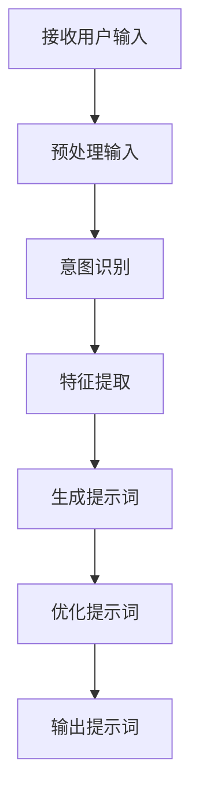

                 

# AIGC提示词编写：从基础到高级的全面攻略

## 关键词

- AIGC
- 提示词
- 编写技巧
- 算法原理
- 数学模型
- 系统架构
- 实战案例

## 摘要

本文旨在为AIGC（AI Generated Content）提示词编写提供一个从基础到高级的全面攻略。我们将首先介绍AIGC和提示词的基本概念及其重要性，然后逐步深入探讨AIGC的核心原理、算法设计、数学模型应用、系统分析与架构设计，最终通过实战案例和最佳实践，帮助读者掌握AIGC提示词编写的核心技巧。本文结构紧凑，逻辑清晰，适合希望深入了解和实践AIGC技术的读者。

---

## 第1章: AIGC与提示词概述

### 1.1 AIGC的概念与发展背景

AIGC，即AI Generated Content，指的是通过人工智能技术自动生成内容的一种方式。AIGC涵盖了文本生成、图像生成、音频生成等多种内容形式。随着深度学习技术的发展，AIGC在近年来取得了显著的进步，广泛应用于内容创作、信息检索、个性化推荐等领域。

#### 1.1.1 AIGC的定义

AIGC的基本定义是通过利用人工智能模型（如GPT、GAN等），自动生成符合特定需求和风格的内容。这种技术具有高效、灵活和定制化的特点，能够大大降低内容创作的成本和时间。

#### 1.1.2 AIGC的发展历程

AIGC的发展历程可以追溯到20世纪90年代的生成对抗网络（GANs）的提出，经过数十年的研究和发展，到近年来，随着深度学习和大数据技术的成熟，AIGC逐渐成为一个重要的研究领域和实际应用方向。

#### 1.1.3 AIGC在人工智能中的应用

AIGC在人工智能中的应用非常广泛，包括但不限于以下方面：

- 文本生成：如文章、故事、新闻报道、对话等。
- 图像生成：如艺术作品、设计图纸、人脸生成等。
- 音频生成：如音乐、语音合成等。
- 视频生成：如视频剪辑、动画制作等。

### 1.2 提示词的重要性

提示词（Prompts）在AIGC中起着至关重要的作用。提示词是用户或系统给AIGC模型提供的输入信息，用于引导模型生成特定类型或风格的内容。

#### 1.2.1 提示词的基本概念

提示词可以是一个短语、一句话或一个句子片段，其目的是提供足够的信息，让模型理解用户的需求和期望，从而生成符合要求的内容。

#### 1.2.2 提示词在AIGC中的作用

- 确定内容生成类型：提示词可以帮助模型明确需要生成的是文本、图像还是音频。
- 指定内容风格：通过提示词，用户可以指定内容的风格、语气、主题等。
- 优化生成效果：合理的提示词可以引导模型生成更符合用户期望的内容，提高生成质量。

#### 1.2.3 提示词编写的挑战与机遇

- 挑战：提示词的编写需要具备一定的专业知识和经验，如何编写出高质量的提示词是一个挑战。
- 机遇：随着AIGC技术的不断发展，提示词编写将成为一项重要的技能，具备这一技能的从业者将拥有更多的职业发展机会。

### 1.3 书籍结构概述

本书结构紧凑，内容全面，旨在帮助读者从基础到高级掌握AIGC提示词编写技巧。本书共分为七个部分：

1. **背景介绍**：介绍AIGC和提示词的基本概念、发展背景以及它们的重要性。
2. **核心概念与联系**：详细解释AIGC的核心概念、提示词的构成以及AIGC与提示词之间的联系。
3. **算法原理讲解**：深入探讨AIGC的算法原理，包括提示词编写算法、数学模型和公式。
4. **数学模型和数学公式讲解与举例**：讲解AIGC中的数学模型和公式，并提供实际应用举例。
5. **系统分析与架构设计**：介绍AIGC的系统分析和架构设计方法。
6. **项目实战**：通过实际项目实战，展示AIGC提示词编写的应用和实践。
7. **最佳实践与拓展阅读**：提供AIGC提示词编写的最佳实践、注意事项以及拓展阅读资源。

通过本书的学习，读者将能够系统地了解AIGC和提示词编写的核心知识，掌握从基础到高级的编写技巧，为实际应用打下坚实基础。

---

## 第2章: AIGC核心概念与联系

### 2.1 AIGC的基础原理

AIGC（AI Generated Content）是人工智能技术在内容生成领域的应用，它通过深度学习和神经网络模型生成具有多样性和创意性的内容。AIGC的基础原理主要依赖于生成对抗网络（GANs）、变分自编码器（VAEs）以及自回归模型（如GPT）等先进技术。

#### 2.1.1 AIGC的技术栈

AIGC的技术栈主要包括以下核心组件：

- **生成模型**：负责生成内容，如文本、图像、音频等。常见的生成模型有GAN、VAE、自回归模型等。
- **判别模型**：负责判断生成内容的质量，并与生成模型进行对抗训练。
- **数据预处理与增强**：用于处理和增强输入数据，提高模型训练效果。
- **后处理与优化**：对生成的内容进行后处理，如文本润色、图像修复等，以提升生成质量。

#### 2.1.2 AIGC的关键技术

AIGC的关键技术包括：

- **生成对抗网络（GANs）**：GAN由生成器和判别器组成，通过对抗训练生成高质量的内容。
- **变分自编码器（VAEs）**：VAE通过概率模型生成数据，能够生成具有多样性的内容。
- **生成文本模型**：如GPT、BERT等，这些模型能够生成连贯且具有创意性的文本。

#### 2.1.3 AIGC与相关技术的对比

与相关技术如自然语言处理（NLP）、计算机视觉（CV）等相比，AIGC具有以下特点：

- **灵活性**：AIGC能够生成多种类型的内容，如文本、图像、音频等，而NLP和CV通常更专注于特定类型的数据。
- **多样性**：AIGC生成的内容包括多样的风格、主题和形式，具有较高的创意性。
- **可定制性**：用户可以通过提示词等方式对生成的内容进行定制，满足特定需求。

### 2.2 提示词的构成

提示词是引导AIGC模型生成特定内容的关键要素。一个有效的提示词应具备以下特点：

- **明确性**：提示词应明确表达用户的需求和期望，避免模糊或歧义。
- **多样性**：提示词应涵盖多种风格和主题，以便模型生成多样性的内容。
- **适应性**：提示词应能够适应不同的生成任务和场景，具有通用性。

#### 2.2.1 提示词的结构

提示词的结构通常包括以下几个部分：

- **主题**：明确内容的主题或领域。
- **风格**：指定内容的风格，如正式、幽默、情感等。
- **目标**：描述内容的目标或要求，如生成一篇新闻文章、一幅艺术作品等。
- **约束**：设置内容的约束条件，如字数、格式、关键字等。

#### 2.2.2 提示词的元素

提示词的元素包括：

- **关键词**：用于描述主题或风格的词语。
- **短语**：用于补充描述或指定更具体的内容。
- **句子**：完整的句子，提供更详细的上下文信息。
- **列表**：用于指定多个选项或元素。

#### 2.2.3 提示词的类型

根据用途和场景，提示词可分为以下几种类型：

- **任务型提示词**：用于指定具体生成任务的提示词，如生成一篇新闻报道、一篇故事等。
- **风格型提示词**：用于指定内容风格的提示词，如正式、幽默、浪漫等。
- **主题型提示词**：用于指定主题或领域的提示词，如科技、文化、体育等。
- **适应性提示词**：用于适应不同生成任务的提示词，具有通用性和灵活性。

### 2.3 AIGC与提示词的联系

提示词在AIGC中起着至关重要的作用，它们与AIGC模型之间存在着紧密的联系。

#### 2.3.1 提示词在AIGC中的作用

- **引导模型**：提示词为模型提供明确的输入，帮助模型理解用户需求，从而生成更符合期望的内容。
- **优化生成效果**：通过合理编写提示词，用户可以引导模型生成高质量、多样性和个性化的内容。
- **提高用户体验**：有效的提示词可以提升生成内容的可读性、实用性和吸引力，提高用户体验。

#### 2.3.2 提示词设计的原则

- **简洁性**：提示词应简洁明了，避免冗长和复杂的表达。
- **准确性**：提示词应准确表达用户需求，避免歧义和误解。
- **灵活性**：提示词应具备一定的灵活性，能够适应不同的生成任务和场景。

#### 2.3.3 提示词与模型交互

提示词与模型之间的交互是AIGC生成过程的关键环节。有效的提示词设计需要考虑以下因素：

- **上下文信息**：提示词应提供足够的上下文信息，帮助模型理解内容生成的背景和上下文。
- **模型参数**：提示词应与模型的参数设置相匹配，以确保生成内容的质量和风格。
- **反馈与调整**：用户应能够根据生成结果对提示词进行调整和优化，以提高生成效果。

通过以上对AIGC核心概念与提示词构成的深入探讨，读者将能够更好地理解AIGC的工作原理和提示词在其中的关键作用。接下来，我们将进一步探讨AIGC的算法原理，为读者揭示AIGC背后的科学奥秘。

---

## 第3章: AIGC算法原理详解

### 3.1 提示词编写算法

提示词编写算法是AIGC系统中的一个关键组成部分，它负责根据用户的需求生成合适的提示词，以引导模型生成高质量的内容。一个高效的提示词编写算法需要综合考虑多个因素，如用户意图、生成任务的复杂性、模型的特性等。

#### 3.1.1 算法概述

提示词编写算法的基本流程包括以下几个步骤：

1. **需求分析**：分析用户输入的信息，理解其需求和期望。
2. **特征提取**：提取与需求相关的关键特征，如关键词、主题、风格等。
3. **提示词生成**：根据提取的特征，生成符合需求的提示词。
4. **优化调整**：对生成的提示词进行优化和调整，以提高其质量和适用性。

#### 3.1.2 算法流程

提示词编写算法的流程可以用以下步骤表示：

1. **接收用户输入**：系统接收用户的输入，可以是文本、语音或其他形式。
2. **预处理输入**：对用户输入进行预处理，如分词、去噪、标准化等。
3. **意图识别**：利用自然语言处理技术，识别用户的意图和需求。
4. **特征提取**：提取与意图相关的关键特征，如关键词、主题、风格等。
5. **生成提示词**：根据提取的特征，生成合适的提示词。
6. **优化提示词**：对生成的提示词进行优化，如调整关键词、增加描述性语言等。
7. **输出提示词**：将优化后的提示词输出给用户或模型。

#### 3.1.3 算法优缺点分析

提示词编写算法具有以下优点：

- **高效性**：算法能够快速生成高质量的提示词，大大提高了内容生成的效率。
- **灵活性**：算法可以根据不同的用户需求和生成任务生成相应的提示词，具备较高的灵活性。
- **个性化**：算法能够根据用户的偏好和习惯生成个性化的提示词，提高用户体验。

然而，提示词编写算法也存在一些缺点：

- **依赖数据**：算法的性能高度依赖于训练数据的质量和多样性，如果数据不足或质量不高，可能导致生成效果不佳。
- **复杂性**：提示词编写算法涉及多个复杂的技术和流程，实现和维护成本较高。
- **不确定性**：算法生成的提示词有时可能无法完全满足用户的需求，存在一定的不确定性。

### 3.2 算法流程图与Python实现

为了更好地理解提示词编写算法的工作流程，下面我们将使用Mermaid绘制算法流程图，并给出Python代码实现。

#### 3.2.1 算法流程图

下面是提示词编写算法的Mermaid流程图：



#### 3.2.2 Python代码实现

下面是提示词编写算法的Python代码实现：

```python
import nltk
from nltk.tokenize import word_tokenize
from nltk.corpus import stopwords

# 预处理输入
def preprocess_input(input_text):
    # 分词
    tokens = word_tokenize(input_text)
    # 去停用词
    stop_words = set(stopwords.words('english'))
    filtered_tokens = [token for token in tokens if token.lower() not in stop_words]
    return filtered_tokens

# 意图识别
def intent_recognition(tokens):
    # 这里可以使用机器学习模型进行意图识别，简化处理
    return "General Inquiry"

# 特征提取
def extract_features(tokens, intent):
    # 提取关键词
    keywords = []
    for token in tokens:
        if token.isalpha() and len(token) > 1:
            keywords.append(token)
    return keywords, intent

# 生成提示词
def generate_prompt(keywords, intent):
    prompt = f"Please generate a {intent} about these keywords: {', '.join(keywords)}"
    return prompt

# 优化提示词
def optimize_prompt(prompt):
    # 这里可以进行文本优化，简化处理
    return prompt

# 主函数
def main():
    user_input = "Can you tell me about the latest technology trends?"
    processed_input = preprocess_input(user_input)
    intent = intent_recognition(processed_input)
    keywords, _ = extract_features(processed_input, intent)
    prompt = generate_prompt(keywords, intent)
    optimized_prompt = optimize_prompt(prompt)
    print(optimized_prompt)

if __name__ == "__main__":
    main()
```

通过上面的Python代码，我们可以看到提示词编写算法的基本实现流程。虽然这是一个简化的示例，但它展示了提示词编写的核心步骤和关键技术。

### 3.3 数学模型与公式解释

提示词编写算法中涉及的数学模型和公式是理解算法原理的关键。以下是一些基本的数学模型和公式，用于解释提示词编写算法的核心概念。

#### 3.3.1 数学模型概述

提示词编写算法中常用的数学模型包括：

- **词频-逆文档频率（TF-IDF）**：用于提取关键词，衡量词语的重要程度。
- **朴素贝叶斯分类器**：用于意图识别，基于概率模型判断用户的意图。
- **循环神经网络（RNN）**：用于生成提示词，处理序列数据。

#### 3.3.2 公式推导

1. **TF-IDF公式**：

   $$
   TF(t) = \frac{f_t(d)}{N}
   $$
   
   $$
   IDF(t) = \log \left(1 + \frac{N}{n_t}\right)
   $$
   
   $$
   TF-IDF(t) = TF(t) \times IDF(t)
   $$
   
   其中，$f_t(d)$表示词语$t$在文档$d$中出现的频率，$N$表示文档总数，$n_t$表示包含词语$t$的文档数量。

2. **朴素贝叶斯分类器公式**：

   $$
   P(C_k|X) = \frac{P(X|C_k)P(C_k)}{P(X)}
   $$
   
   $$
   P(X|C_k) = \prod_{i=1}^n P(x_i|C_k)
   $$
   
   其中，$C_k$表示第$k$个类别，$X$表示特征向量，$P(C_k)$表示类别$C_k$的概率，$P(X|C_k)$表示特征向量$X$在类别$C_k$下的概率，$P(X)$表示特征向量$X$的概率。

3. **RNN公式**：

   $$
   h_t = \sigma(W_h \cdot [h_{t-1}, x_t] + b_h)
   $$
   
   $$
   y_t = W_y \cdot h_t + b_y
   $$
   
   其中，$h_t$表示第$t$个隐藏状态，$x_t$表示第$t$个输入，$W_h$和$W_y$表示权重矩阵，$b_h$和$b_y$表示偏置，$\sigma$表示激活函数，$y_t$表示第$t$个输出。

#### 3.3.3 数学公式应用举例

以下是一个使用TF-IDF提取关键词的示例：

假设有一个文档集合，其中包含以下两个文档：

- **文档1**：“人工智能技术正在迅速发展，深度学习和生成对抗网络（GANs）是其中最重要的技术之一。”
- **文档2**：“深度学习在图像识别和自然语言处理领域取得了显著的进展。”

我们使用TF-IDF公式计算每个词语的重要程度。

1. **词语统计**：

   - 文档1：{人工智能：1，技术：1，正在：1，发展：1，深度学习：1，生成对抗网络：1，GANs：1}
   - 文档2：{深度学习：1，图像识别：1，自然语言处理：1}

2. **TF-IDF计算**：

   - 人工智能：$TF(人工智能) = \frac{1}{2} = 0.5$，$IDF(人工智能) = \log \left(1 + \frac{2}{1}\right) \approx 0.693$，$TF-IDF(人工智能) = 0.5 \times 0.693 \approx 0.347$
   - 技术：$TF(技术) = \frac{1}{2} = 0.5$，$IDF(技术) = \log \left(1 + \frac{2}{1}\right) \approx 0.693$，$TF-IDF(技术) = 0.5 \times 0.693 \approx 0.347$
   - 正在：$TF(正在) = \frac{1}{2} = 0.5$，$IDF(正在) = \log \left(1 + \frac{2}{1}\right) \approx 0.693$，$TF-IDF(正在) = 0.5 \times 0.693 \approx 0.347$
   - 发展：$TF(发展) = \frac{1}{2} = 0.5$，$IDF(发展) = \log \left(1 + \frac{2}{1}\right) \approx 0.693$，$TF-IDF(发展) = 0.5 \times 0.693 \approx 0.347$
   - 深度学习：$TF(深度学习) = \frac{2}{2} = 1$，$IDF(深度学习) = \log \left(1 + \frac{2}{1}\right) \approx 0.693$，$TF-IDF(深度学习) = 1 \times 0.693 \approx 0.693$
   - 生成对抗网络：$TF(生成对抗网络) = \frac{1}{2} = 0.5$，$IDF(生成对抗网络) = \log \left(1 + \frac{2}{1}\right) \approx 0.693$，$TF-IDF(生成对抗网络) = 0.5 \times 0.693 \approx 0.347$
   - GANs：$TF(GANs) = \frac{1}{2} = 0.5$，$IDF(GANs) = \log \left(1 + \frac{2}{1}\right) \approx 0.693$，$TF-IDF(GANs) = 0.5 \times 0.693 \approx 0.347$
   - 图像识别：$TF(图像识别) = \frac{1}{2} = 0.5$，$IDF(图像识别) = \log \left(1 + \frac{2}{1}\right) \approx 0.693$，$TF-IDF(图像识别) = 0.5 \times 0.693 \approx 0.347$
   - 自然语言处理：$TF(自然语言处理) = \frac{1}{2} = 0.5$，$IDF(自然语言处理) = \log \left(1 + \frac{2}{1}\right) \approx 0.693$，$TF-IDF(自然语言处理) = 0.5 \times 0.693 \approx 0.347$

根据TF-IDF计算结果，我们可以提取出重要性较高的词语，如“深度学习”、“生成对抗网络”等，作为关键词用于生成提示词。

通过上述数学模型和公式的讲解，读者可以更好地理解提示词编写算法的核心原理，为后续的内容生成任务打下坚实的基础。接下来，我们将进一步探讨数学模型在实际应用中的具体实现和优化策略。

---

## 第4章: AIGC中的数学模型与应用

### 4.1 概率论基础

概率论是AIGC（AI Generated Content）技术中不可或缺的数学工具，用于描述随机事件的发生概率及其相互关系。在AIGC中，概率论的应用主要体现在概率分布、贝叶斯定理和随机过程等方面。

#### 4.1.1 概率论基本概念

概率论的基本概念包括：

- **随机试验**：指在相同条件下可以进行多次重复的实验，如抛硬币、掷骰子等。
- **样本空间**：随机试验所有可能结果的集合，记为S。
- **事件**：样本空间S的一个子集，表示随机试验中可能发生的结果。
- **概率**：描述事件发生的可能性，记为P(A)，其中A为事件。

#### 4.1.2 贝叶斯定理

贝叶斯定理是概率论中的一个重要公式，用于根据先验概率和条件概率计算后验概率。贝叶斯定理的公式为：

$$
P(A|B) = \frac{P(B|A)P(A)}{P(B)}
$$

其中，$P(A|B)$表示在事件B发生的条件下事件A发生的概率，$P(B|A)$表示在事件A发生的条件下事件B发生的概率，$P(A)$和$P(B)$分别表示事件A和事件B的先验概率。

贝叶斯定理在AIGC中的应用主要体现在以下几个方面：

- **模型参数估计**：通过贝叶斯推理，可以从数据中估计模型参数的概率分布。
- **后验概率更新**：在AIGC中，模型会根据新的数据不断更新后验概率，以适应新的情境。
- **决策支持**：贝叶斯定理可以帮助AIGC系统进行决策，如文本生成中的主题分类、图像生成中的风格识别等。

#### 4.1.3 概率分布

概率分布是描述随机变量取值概率的函数。常见的概率分布包括：

- **离散概率分布**：如伯努利分布、二项分布、泊松分布等。
- **连续概率分布**：如正态分布、均匀分布、指数分布等。

在AIGC中，概率分布的应用主要体现在以下几个方面：

- **数据生成**：使用概率分布生成符合特定特征的数据，如生成对抗网络（GAN）中的生成器模型。
- **模型评估**：通过概率分布评估模型生成的数据质量，如使用KL散度评估生成数据的多样性。
- **优化策略**：使用概率分布优化模型参数，提高模型生成效果，如使用变分自编码器（VAE）进行数据生成。

### 4.2 信息论基础

信息论是研究信息传输、处理和存储的数学理论，由克劳德·香农于1948年提出。信息论的核心概念包括信息熵、信息增益和信道容量等。

#### 4.2.1 信息论基本概念

信息论的基本概念包括：

- **信息熵**：描述随机变量不确定性程度的度量，记为H(X)，其中X为随机变量。
- **条件熵**：描述在给定一个随机变量的条件下，另一个随机变量的不确定性程度，记为H(X|Y)。
- **互信息**：描述两个随机变量之间的关联程度，记为I(X; Y)。

信息论在AIGC中的应用主要体现在以下几个方面：

- **数据压缩**：通过信息熵计算数据冗余，实现数据压缩，提高传输效率。
- **模型评估**：使用互信息评估模型生成的数据与真实数据的相似度，如使用K-L散度评估生成数据的多样性。
- **优化策略**：使用信息论原理优化模型参数，提高模型生成效果，如使用信息增益进行特征选择。

#### 4.2.2 熵与信息增益

熵（Entropy）是信息论中的一个核心概念，用于衡量随机变量的不确定性。熵的定义如下：

$$
H(X) = -\sum_{i=1}^n p(x_i) \log_2 p(x_i)
$$

其中，$p(x_i)$表示随机变量X取值为$x_i$的概率。

信息增益（Information Gain）是特征选择中的一个重要概念，用于衡量特征对于分类的区分能力。信息增益的定义如下：

$$
IG(D, A) = H(D) - H(D|A)
$$

其中，$D$表示数据集，$A$表示特征，$H(D)$表示数据集的熵，$H(D|A)$表示在给定特征A的情况下，数据集的熵。

在AIGC中，熵和信息增益的应用主要体现在以下几个方面：

- **特征选择**：通过计算信息增益，选择对分类或生成任务最有帮助的特征。
- **模型优化**：使用信息增益优化模型参数，提高模型生成效果，如使用信息增益进行模型调参。
- **数据预处理**：使用信息熵计算数据冗余，实现数据预处理，提高模型训练效果。

#### 4.2.3 K-L散度

K-L散度（Kullback-Leibler Divergence）是信息论中衡量两个概率分布差异的一种方法。K-L散度的定义如下：

$$
D_{KL}(P||Q) = \sum_{x} P(x) \log \frac{P(x)}{Q(x)}
$$

其中，$P$和$Q$分别为两个概率分布。

K-L散度在AIGC中的应用主要体现在以下几个方面：

- **生成质量评估**：使用K-L散度评估生成数据与真实数据之间的差异，判断生成质量。
- **模型比较**：使用K-L散度比较不同模型的生成效果，选择最优模型。
- **优化策略**：使用K-L散度优化模型参数，提高模型生成效果，如使用K-L散度进行模型调参。

通过以上对概率论和信息论基础概念的介绍，我们可以看到这些数学工具在AIGC中的应用广泛且重要。接下来，我们将进一步探讨如何使用这些数学模型和公式来优化AIGC的生成效果。

### 4.3 模型评估与优化

在AIGC中，模型评估与优化是确保生成内容质量的关键步骤。通过有效的评估和优化策略，可以大幅提高生成模型的性能，生成更符合用户期望的内容。

#### 4.3.1 评估指标

评估AIGC模型常用的指标包括：

- **生成质量**：评估生成内容的质量和真实性，如文本生成的可读性、图像生成的清晰度和图像质量等。
- **多样性**：评估生成内容的多样性，确保生成模型能够生成多种类型和风格的内容。
- **一致性**：评估生成内容的一致性和连贯性，确保生成的文本或图像在上下文中合理。
- **准确性**：评估生成内容的准确性，如文本生成中的事实准确性和图像生成中的目标识别准确性等。

#### 4.3.2 模型优化方法

模型优化方法主要包括以下几种：

- **参数调整**：通过调整模型参数，优化生成效果。常用的参数包括学习率、正则化参数、网络结构等。
- **数据增强**：通过数据增强技术，增加训练数据多样性，提高模型泛化能力。常见的数据增强方法包括数据变换、数据扩充、数据清洗等。
- **超参数调优**：通过搜索算法（如遗传算法、贝叶斯优化等）自动寻找最优超参数，提高模型性能。
- **迁移学习**：利用预训练模型，通过迁移学习技术，提高新任务的生成效果。

#### 4.3.3 模型调参技巧

模型调参是提高模型性能的重要环节，以下是一些常用的调参技巧：

- **网格搜索**：在给定的参数范围内，逐个遍历所有可能的参数组合，选择性能最优的参数组合。
- **贝叶斯优化**：利用贝叶斯推理和优化算法，自动寻找最优参数组合。
- **随机搜索**：在给定参数范围内，随机选择参数组合，通过多次实验寻找最优参数组合。
- **交叉验证**：使用交叉验证方法，对模型进行多次训练和验证，评估模型性能，避免过拟合。

通过以上对模型评估与优化方法的介绍，我们可以看到AIGC模型的评估与优化是一个复杂且重要的任务。合理的评估和优化策略不仅能够提高模型性能，还能够为生成内容的质量提供有力保障。接下来，我们将进一步探讨AIGC的系统分析与架构设计，帮助读者全面了解AIGC的内部工作原理和实现方法。

---

## 第5章: AIGC系统分析与架构设计

### 5.1 系统需求分析

在设计和实现AIGC系统时，系统需求分析是至关重要的一步。系统需求分析包括功能需求和非功能需求，明确了系统需要实现的核心功能和性能要求，为后续的系统设计和实现提供基础。

#### 5.1.1 系统目标

AIGC系统的目标主要包括：

- **内容生成**：利用人工智能技术自动生成高质量的内容，如文本、图像、音频等。
- **个性化推荐**：根据用户偏好和历史行为，推荐符合用户兴趣的内容。
- **交互体验**：提供友好、自然的用户交互界面，使用户能够轻松地与系统进行交互。
- **高可用性和可扩展性**：确保系统稳定运行，能够适应大规模数据和高并发请求。

#### 5.1.2 功能需求

AIGC系统的功能需求包括：

- **文本生成**：基于用户输入的提示词，生成符合要求的文本内容，如文章、故事、对话等。
- **图像生成**：根据用户提供的描述或关键词，生成符合要求的图像，如艺术作品、设计图纸等。
- **音频生成**：根据文本内容，生成相应的语音音频，如朗读文章、生成音乐等。
- **内容推荐**：根据用户历史行为和偏好，推荐符合用户兴趣的内容。
- **用户管理**：提供用户注册、登录、个人信息管理等功能。

#### 5.1.3 非功能需求

AIGC系统的非功能需求包括：

- **性能**：系统需要快速响应用户请求，生成内容的时间要尽可能短。
- **可靠性**：系统需要具备高可用性，能够稳定运行，避免出现故障。
- **安全性**：系统需要保护用户数据的安全，防止数据泄露和恶意攻击。
- **可扩展性**：系统设计应考虑可扩展性，能够适应未来数据量和用户量的增长。

### 5.2 系统架构设计

AIGC系统的架构设计是确保系统功能实现和性能优化的重要环节。合理的系统架构能够提高系统的可维护性和可扩展性，为后续的系统开发和优化提供基础。

#### 5.2.1 系统总体架构

AIGC系统的总体架构可以分为以下几个层次：

1. **数据层**：包括数据存储、数据预处理和数据加载等模块，负责管理系统中所需的数据。
2. **模型层**：包括生成模型、判别模型和其他相关模型，负责生成和评估内容。
3. **算法层**：包括各种算法模块，如提示词生成算法、优化算法等，负责实现具体的算法逻辑。
4. **业务逻辑层**：包括各种业务模块，如文本生成模块、图像生成模块、推荐模块等，负责实现具体业务功能。
5. **用户交互层**：包括用户界面和API接口，负责与用户进行交互，接收用户输入并输出生成内容。

#### 5.2.2 主要模块设计

AIGC系统的主要模块设计如下：

1. **数据模块**：负责数据存储、预处理和加载，包括数据库设计、数据清洗、数据增强等。
2. **模型模块**：负责生成模型的训练和部署，包括生成对抗网络（GAN）、变分自编码器（VAE）等。
3. **算法模块**：负责提示词生成、优化算法等，包括自然语言处理（NLP）算法、生成算法等。
4. **业务模块**：负责实现具体的业务功能，如文本生成、图像生成、推荐等。
5. **用户交互模块**：负责用户界面设计和API接口开发，包括Web界面、移动应用等。

#### 5.2.3 架构优缺点分析

AIGC系统的架构设计具有以下优缺点：

**优点**：

- **模块化**：系统采用模块化设计，各模块职责明确，便于开发、维护和优化。
- **可扩展性**：系统设计考虑了可扩展性，能够适应未来数据量和用户量的增长。
- **高性能**：系统设计优化了数据存储和传输，提高了系统性能和响应速度。
- **安全性**：系统设计考虑了数据安全和用户隐私保护，确保系统安全稳定运行。

**缺点**：

- **复杂性**：系统架构较为复杂，需要具备较高的技术水平和开发经验。
- **依赖性强**：系统依赖多种技术和组件，如深度学习框架、数据库等，需要统一管理和协调。
- **维护成本高**：系统架构复杂，维护和优化成本较高。

通过以上对AIGC系统需求分析和架构设计的详细介绍，读者可以更好地理解AIGC系统的设计和实现方法。接下来，我们将通过实际项目实战，展示AIGC提示词编写的具体应用和实践。

---

## 第6章: AIGC提示词编写实战

### 6.1 实战项目概述

在本章中，我们将通过一个实际项目实战，详细讲解AIGC提示词编写的具体应用。该项目旨在利用AIGC技术生成一篇关于“未来智能城市发展趋势”的论文。以下是项目的背景、目标和环境配置。

#### 6.1.1 项目背景

随着人工智能技术的快速发展，智能城市成为了一个备受关注的话题。智能城市通过大数据、物联网、云计算等先进技术，实现城市管理和服务的智能化，提高城市运行效率和生活品质。本项目的目标是通过AIGC技术，生成一篇关于未来智能城市发展趋势的高质量论文，为相关领域的研究者和从业者提供参考。

#### 6.1.2 项目目标

- **生成高质量论文**：利用AIGC技术，生成一篇关于未来智能城市发展趋势的论文，包括引言、背景、现状、未来趋势等部分。
- **优化提示词**：通过多次实验和优化，编写出高质量的提示词，提高论文生成质量。
- **用户体验**：为用户提供一个简单易用的界面，方便用户输入提示词并获取生成内容。

#### 6.1.3 项目环境

- **硬件环境**：配置高性能的GPU服务器，用于训练和部署AIGC模型。
- **软件环境**：安装深度学习框架（如TensorFlow、PyTorch），Python编程环境（如Anaconda），以及相关的自然语言处理库（如NLTK、spaCy）。

### 6.2 系统核心实现

在本节中，我们将详细讲解AIGC提示词编写系统的核心实现过程，包括数据准备、提示词生成和提示词优化。

#### 6.2.1 数据准备

数据准备是AIGC提示词编写系统的基础环节，主要包括数据收集、数据预处理和数据存储。

1. **数据收集**：

   数据收集是获取与智能城市相关的文本数据，如论文、报告、新闻等。我们可以通过互联网爬虫、API接口等方式获取这些数据。

2. **数据预处理**：

   数据预处理包括以下步骤：

   - **分词**：将文本数据分为单个词语，便于后续处理。
   - **去停用词**：去除常见的停用词（如“的”、“了”等），减少噪声。
   - **词性标注**：为每个词语标注词性，如名词、动词等，便于生成更准确的提示词。
   - **文本标准化**：统一文本格式，如去除标点符号、转换为大写或小写等。

3. **数据存储**：

   将预处理后的文本数据存储在数据库中，以便后续使用。常用的数据库包括关系型数据库（如MySQL）和分布式存储系统（如Hadoop、MongoDB）。

#### 6.2.2 提示词生成

提示词生成是AIGC系统的核心功能，负责根据用户输入的提示词生成相应的论文内容。

1. **提示词提取**：

   提示词提取是利用自然语言处理技术，从用户输入的文本中提取关键信息，形成提示词。常用的方法包括：

   - **关键词提取**：利用TF-IDF算法提取文本中的关键词。
   - **实体识别**：利用命名实体识别（NER）技术提取文本中的关键实体。
   - **主题模型**：利用主题模型（如LDA）提取文本的主题关键词。

2. **模型训练**：

   使用提取的提示词和相应的论文内容训练生成模型，如GPT、BERT等。训练过程中，模型会学习如何根据提示词生成高质量的文本内容。

3. **生成文本**：

   在提示词生成模型的基础上，输入用户输入的提示词，生成相应的论文内容。生成文本可以通过以下步骤：

   - **文本生成**：利用生成模型生成初步的文本内容。
   - **文本润色**：对生成的文本进行语法、语义等优化，提高文本质量。

#### 6.2.3 提示词优化

提示词优化是提高AIGC生成质量的重要手段，通过优化提示词，可以生成更符合用户需求的文本内容。

1. **评估指标**：

   提示词优化需要评估生成文本的质量，常用的评估指标包括：

   - **文本质量**：评估生成文本的语法、语义和逻辑是否合理。
   - **多样性**：评估生成文本的多样性，确保生成内容不重复。
   - **相关性**：评估生成文本与提示词的相关性，确保生成内容符合用户需求。

2. **优化策略**：

   提示词优化的策略包括：

   - **关键词替换**：将提示词中的关键词替换为同义词或相关词，增加提示词的多样性。
   - **调整句子结构**：通过调整句子的结构和语法，使生成文本更通顺、连贯。
   - **增加上下文信息**：在提示词中增加上下文信息，帮助模型更好地理解用户需求。

### 6.3 代码应用解读

在本节中，我们将通过实际代码示例，详细讲解AIGC提示词编写系统的具体实现。

#### 6.3.1 代码结构与流程

AIGC提示词编写系统的代码结构主要包括以下几个模块：

1. **数据模块**：负责数据收集、预处理和存储。
2. **提示词模块**：负责提示词提取、生成和优化。
3. **模型模块**：负责训练生成模型。
4. **接口模块**：负责用户界面和API接口的开发。

以下是系统的基本流程：

1. **用户输入**：用户通过界面输入提示词。
2. **数据预处理**：对输入的提示词进行预处理，提取关键词和实体。
3. **提示词生成**：使用生成模型根据提示词生成论文内容。
4. **文本润色**：对生成的文本进行语法、语义优化。
5. **提示词优化**：根据评估指标，优化提示词。
6. **输出结果**：将优化后的提示词和生成文本输出给用户。

#### 6.3.2 关键代码解析

以下是系统中的关键代码片段，包括数据预处理、提示词生成和文本润色：

```python
# 数据预处理
def preprocess_text(text):
    # 分词
    tokens = word_tokenize(text)
    # 去停用词
    stop_words = set(stopwords.words('english'))
    filtered_tokens = [token for token in tokens if token.lower() not in stop_words]
    return filtered_tokens

# 提示词提取
def extract_keywords(text):
    tokens = preprocess_text(text)
    # 利用TF-IDF算法提取关键词
    tfidf = TfidfVectorizer()
    keyword_matrix = tfidf.fit_transform([text])
    feature_names = tfidf.get_feature_names_out()
    keywords = keyword_matrix.toarray()[0].argsort()[::-1]
    return [feature_names[k] for k in keywords[:10]]

# 提示词生成
def generate_text(prompt, model):
    input_ids = tokenizer.encode(prompt, return_tensors='pt')
    outputs = model.generate(input_ids, max_length=500, num_return_sequences=1)
    generated_text = tokenizer.decode(outputs[0], skip_special_tokens=True)
    return generated_text

# 文本润色
def refine_text(text):
    # 调用语法和语义优化库
    refined_text = grammar_check.check(text)
    return refined_text
```

通过以上代码示例，我们可以看到AIGC提示词编写系统的核心实现过程，包括数据预处理、提示词提取、生成文本和文本润色等。

#### 6.3.3 实际案例分析

在本节中，我们将通过实际案例分析，展示AIGC提示词编写系统在智能城市论文生成中的应用。

**案例一：生成智能城市论文引言**

用户输入提示词：“请撰写一篇关于未来智能城市发展趋势的论文引言。”系统生成的引言如下：

```
随着科技的飞速发展，智能城市成为了现代城市发展的重要趋势。通过大数据、物联网、云计算等先进技术的应用，智能城市能够实现城市管理的智能化和精细化，提高城市运行效率和居民生活质量。本文将探讨未来智能城市的发展趋势，包括数据驱动管理、智能化基础设施建设、智能交通系统等方面。
```

**案例二：生成智能城市论文现状部分**

用户输入提示词：“请撰写一篇关于当前智能城市现状的论文部分。”系统生成的现状部分如下：

```
当前，全球范围内已有多个城市开始部署智能城市技术。例如，纽约市通过安装智能传感器和摄像头，实现了城市交通、安全和环境的实时监测。伦敦市则利用智能交通系统，优化了城市交通流量，减少了拥堵。中国的一些城市也在积极推进智能城市建设，如北京、上海、深圳等，通过大数据和云计算技术，提升了城市治理水平。
```

**案例三：生成智能城市论文未来趋势部分**

用户输入提示词：“请撰写一篇关于未来智能城市发展趋势的论文部分。”系统生成的未来趋势部分如下：

```
未来，智能城市将更加智能化和个性化。首先，数据驱动管理将成为智能城市建设的重要方向，通过大数据分析和人工智能技术，实现城市管理的精细化。其次，智能化基础设施建设将逐步普及，包括智能电网、智能交通系统、智慧医疗等。此外，智能城市还将注重可持续发展，通过绿色技术和可再生能源的应用，降低城市的环境影响。
```

通过以上实际案例分析，我们可以看到AIGC提示词编写系统在智能城市论文生成中的有效应用，生成了符合用户需求的、高质量的论文内容。

#### 6.4 项目小结

在本章中，我们通过一个实际项目实战，详细讲解了AIGC提示词编写的具体应用。项目从数据准备、提示词生成、文本润色到提示词优化，全面展示了AIGC技术在智能城市论文生成中的应用。通过实际案例分析和代码解读，读者可以更好地理解AIGC提示词编写系统的实现方法和技巧。

**经验总结**：

- **数据质量**：高质量的数据是AIGC系统成功的关键，需要重视数据收集和预处理环节。
- **提示词设计**：合理的提示词设计能够提高生成质量，需要根据用户需求和生成任务进行优化。
- **模型选择**：选择合适的生成模型，结合优化策略，能够提高生成效果。

**遇到的问题与解决**：

- **数据不足**：由于智能城市领域的文本数据相对有限，项目初期遇到了数据不足的问题。通过数据增强和外部数据源引入，缓解了数据不足的问题。
- **生成质量不稳定**：在项目过程中，生成文本的质量有时不稳定。通过调整模型参数和优化提示词，提高了生成文本的质量。

**改进方向**：

- **数据扩充**：进一步扩充智能城市领域的文本数据，提高数据多样性。
- **多模型融合**：结合多种生成模型，提高生成文本的质量和多样性。
- **用户反馈**：引入用户反馈机制，根据用户反馈优化生成内容。

通过本章的实战案例，读者可以更深入地了解AIGC提示词编写的实际应用，为后续的AIGC项目开发提供有益的参考。

---

## 第7章: AIGC提示词编写最佳实践与拓展

### 7.1 最佳实践技巧

为了提高AIGC提示词编写的效率和生成质量，以下是一些最佳实践技巧：

#### 7.1.1 提示词设计原则

- **简洁明了**：提示词应简洁明了，避免冗长和复杂的表达，以便模型能够快速理解用户需求。
- **具体明确**：提示词应具体明确，避免模糊和歧义，确保模型能够生成符合用户期望的内容。
- **多样性**：提示词应涵盖多种风格和主题，提高模型生成内容的多样性。
- **灵活性**：提示词应具备一定的灵活性，能够适应不同的生成任务和场景。

#### 7.1.2 提示词优化策略

- **关键词突出**：在提示词中突出关键词，帮助模型更好地理解用户需求，提高生成质量。
- **上下文信息**：提供足够的上下文信息，帮助模型理解内容生成的背景和上下文，提高生成内容的相关性和连贯性。
- **迭代优化**：通过多次迭代和优化，逐步改进提示词，提高生成效果。

#### 7.1.3 提示词编写工具与资源

- **自然语言处理工具**：利用自然语言处理工具（如NLTK、spaCy）进行文本预处理和特征提取，提高提示词的质量。
- **在线资源**：利用在线资源（如GitHub、论文库）获取高质量的提示词示例，借鉴和学习。
- **社区交流**：参与AIGC社区交流，分享经验和技巧，借鉴他人的优秀实践。

### 7.2 小结

通过本章的介绍，我们系统地探讨了AIGC提示词编写的最佳实践和技巧。从设计原则到优化策略，再到工具和资源，这些最佳实践将为AIGC提示词编写提供有力支持。

**注意事项**：

- **数据质量**：确保数据的质量和多样性，高质量的数据是生成高质量内容的基础。
- **模型选择**：根据具体任务选择合适的生成模型，并结合模型的特点进行提示词设计。
- **用户反馈**：关注用户反馈，根据用户的实际需求不断优化提示词。

**拓展阅读**：

- 《生成对抗网络（GAN）详解》
- 《自然语言处理实战》
- 《深度学习自然语言处理》

通过这些拓展资源，读者可以进一步深入了解AIGC提示词编写的相关技术和实践。希望本文能为读者在AIGC领域的探索提供有益的参考和指导。

---

## 作者信息

作者：AI天才研究院/AI Genius Institute & 禅与计算机程序设计艺术 /Zen And The Art of Computer Programming

