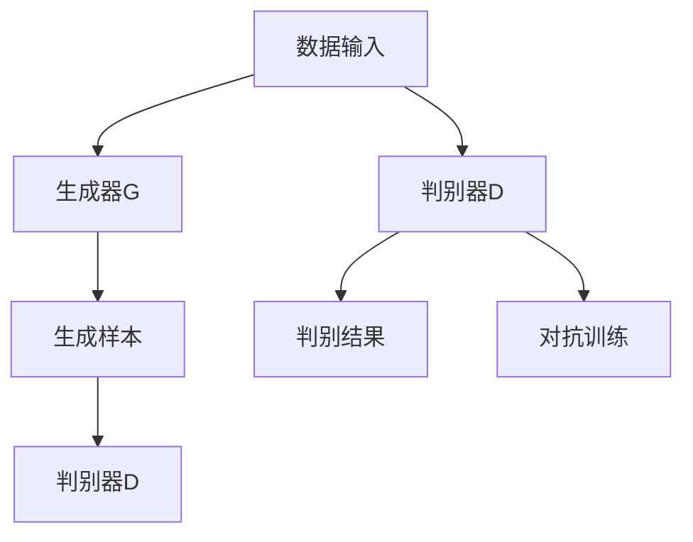

                 

# AIGC提示词设计：原则、方法与创新实践的深度探索

## 关键词
- AI-Generated Content (AIGC)
- 提示词设计
- 生成对抗网络 (GAN)
- 多模态融合
- 质量控制与审核

## 摘要
本文深入探讨了AI-Generated Content（AIGC）提示词设计的原则、方法及其创新实践。通过对AIGC的核心概念、算法原理、系统架构以及项目实战的详细分析，本文旨在为开发者提供一套系统化、结构化的AIGC提示词设计指南，助力实现高效、高质量的内容生成。

----------------------------------------------------------------

## 第一部分: 背景介绍与核心概念

### 第1章: AIGC概述

#### 1.1 问题背景
在数字时代，内容生成已经成为各行各业的重要组成部分。从文本生成到图像、音频甚至视频，内容生成的需求不断增长。然而，传统的生成方式往往依赖于人工编写或手工制作，效率低下，难以满足大规模、高质量的内容生成需求。因此，出现了AIGC（AI-Generated Content）这一概念，旨在通过人工智能技术实现自动化、智能化的内容生成。

#### 1.2 问题描述
AIGC涉及到多个领域的技术，包括自然语言处理、计算机视觉、音频处理等。如何有效地整合这些技术，设计出既高效又灵活的AIGC系统，是一个关键问题。此外，如何保证生成的内容质量，避免出现错误或偏见，也是需要深入探讨的。

#### 1.3 问题解决
AIGC通过以下方法解决上述问题：

1. **多模态融合**：将文本、图像、音频等多种模态的内容融合在一起，提高内容生成的多样性。
2. **生成模型与优化**：利用生成对抗网络（GAN）、变分自编码器（VAE）等生成模型，优化生成过程，提高内容质量。
3. **质量控制与审核**：通过构建预训练模型、自定义训练数据集等方法，提高生成内容的质量，并设置审核机制，确保内容的准确性和公正性。

#### 1.4 边界与外延
AIGC的应用范围广泛，包括但不限于以下领域：

1. **媒体与娱乐**：如生成文章、视频、音乐等。
2. **教育与培训**：如自动生成课件、教学视频等。
3. **市场营销与广告**：如生成创意广告、文案等。
4. **设计与艺术**：如自动生成艺术作品、服装设计等。

#### 1.5 概念结构与核心要素组成
AIGC的核心结构包括：

1. **生成模型**：如GPT、GAN等。
2. **数据源**：包括文本、图像、音频等。
3. **优化算法**：如损失函数、优化器等。
4. **质量控制与审核机制**：如内容审核、预训练等。

### 第2章: AIGC的核心概念与联系

#### 2.1 AIGC核心概念原理

1. **生成对抗网络（GAN）**：一种通过两个神经网络（生成器和判别器）进行博弈的过程，用于生成高质量数据。
2. **变分自编码器（VAE）**：一种基于概率模型的生成模型，能够生成多样化且具有可信度的数据。
3. **生成文本模型**：如GPT、BERT等，用于生成高质量的自然语言文本。
4. **生成图像模型**：如DALL-E、StyleGAN等，用于生成逼真的图像。

#### 2.2 AIGC核心概念属性特征对比

| 概念         | 特征                       | 对比               |
|------------|-------------------------|------------------|
| GAN        | 对抗性学习、高质量生成       | 与VAE相比，GAN更擅长生成独特、多样化的数据 |
| VAE        | 概率模型、易于训练           | 与GAN相比，VAE生成的数据质量可能较低 |
| GPT        | 大规模语言模型、高效生成文本  | 主要针对文本生成 |
| DALL-E     | 图像生成、多模态融合        | 主要针对图像生成 |

#### 2.3 AIGC ER实体关系图架构

```mermaid
erDiagram
  Data -> Model
  Model -> Optimization
  Model -> QualityControl
  Data -> QualityControl
  QualityControl -> Model
  Optimization -> Model
```

### 第3章: AIGC的算法原理讲解

#### 3.1 GAN算法原理与mermaid流程图



#### 3.2 GAN算法Python源代码

```python
import tensorflow as tf
from tensorflow.keras.layers import Dense, Flatten, Conv2D, BatchNormalization
from tensorflow.keras.models import Sequential

# 生成器模型
def build_generator():
    model = Sequential()
    model.add(Dense(128, input_dim=100, activation='tanh'))
    model.add(BatchNormalization())
    model.add(Dense(256, activation='tanh'))
    model.add(BatchNormalization())
    model.add(Dense(512, activation='tanh'))
    model.add(BatchNormalization())
    model.add(Dense(1024, activation='tanh'))
    model.add(BatchNormalization())
    model.add(Dense(784, activation='sigmoid'))
    return model

# 判别器模型
def build_discriminator():
    model = Sequential()
    model.add(Flatten(input_shape=(28, 28)))
    model.add(Dense(1024, activation='sigmoid'))
    model.add(BatchNormalization())
    model.add(Dense(512, activation='sigmoid'))
    model.add(BatchNormalization())
    model.add(Dense(256, activation='sigmoid'))
    model.add(BatchNormalization())
    model.add(Dense(1, activation='sigmoid'))
    return model

# GAN模型
def build_gan(generator, discriminator):
    model = Sequential()
    model.add(generator)
    model.add(discriminator)
    return model
```

## 第二部分: AIGC提示词设计的原则与方法

### 第4章: AIGC提示词设计的原则

#### 4.1 提示词设计的意义

提示词（Prompt）是引导AIGC模型生成特定内容的关键输入，其设计质量直接影响内容生成的效果。一个优秀的提示词应具备以下特点：

1. **明确性**：能够清晰传达生成内容的意图和目标。
2. **多样性**：能够引导模型生成多种风格和类型的内容。
3. **灵活性**：能够适应不同的生成场景和需求。
4. **准确性**：避免生成错误或不准确的内容。

#### 4.2 提示词设计原则

1. **用户需求导向**：以用户需求为核心，确保生成的

