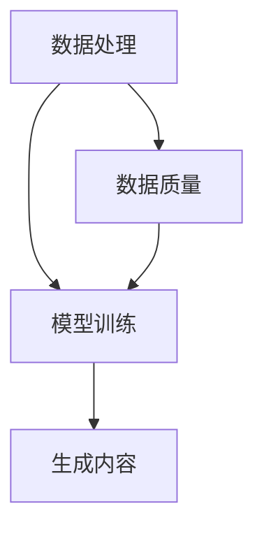
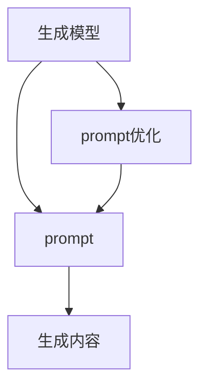
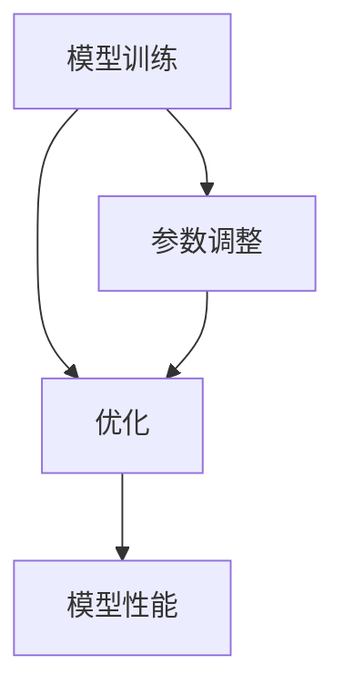
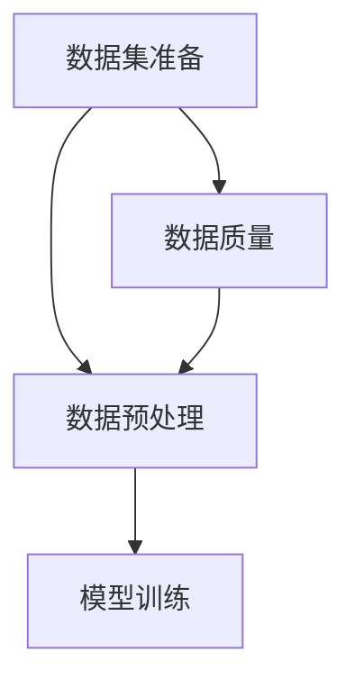
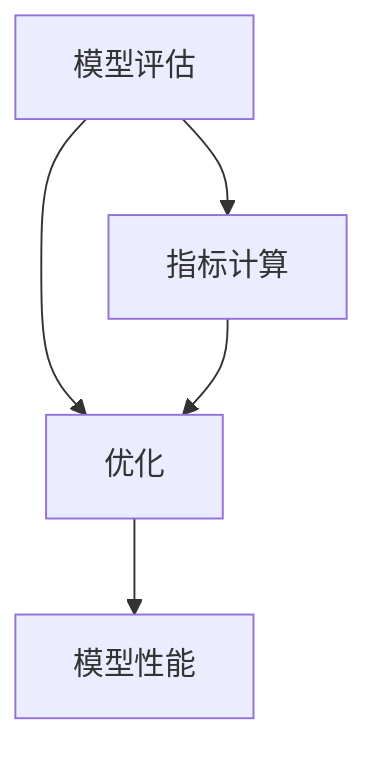
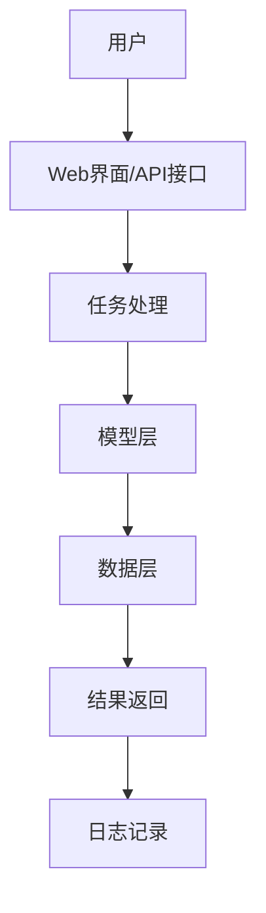
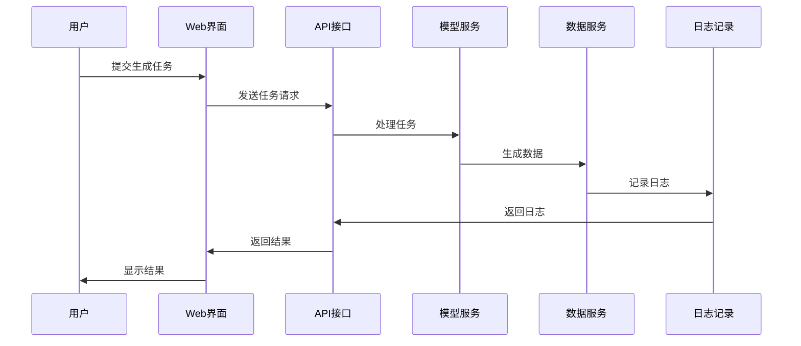

                 

# AIGC时代的prompt工程师：必备技能解析

## 关键词

- AIGC
- Prompt工程
- 模型训练
- 优化策略
- 实战案例

## 摘要

随着人工智能生成内容（AIGC）技术的快速发展，prompt工程师这一角色在自然语言处理领域变得越来越重要。本文将深入探讨AIGC技术基础，详细解析prompt工程师的必备技能，包括prompt设计与优化、数据集准备与预处理、模型训练与评估以及实战案例解析。同时，我们将展望AIGC技术的未来趋势和prompt工程师的职业发展路径。通过本文，读者将全面了解AIGC时代prompt工程师的核心职责和技能要求。

## 第一部分：AIGC技术基础

### 1.1 AIGC概述

AIGC，全称为Artificial Intelligence Generated Content，即人工智能生成内容。它是一种利用人工智能技术，特别是生成对抗网络（GAN）、变分自编码器（VAE）等算法，自动生成文本、图片、音频等多媒体内容的技术。AIGC的核心在于让机器具备自主创作和生成内容的能力，从而实现人机协同创作。

### 1.2 AIGC的定义

AIGC的定义涵盖了以下几个方面：

- **内容生成**：通过机器学习模型，如生成式模型，自动生成文字、图像、音频等。
- **自动化**：利用算法和数据处理技术，自动化完成内容创作过程。
- **人机协同**：在创作过程中，人工智能辅助人类，共同完成内容创作。

### 1.3 AIGC的发展历程

AIGC技术的发展经历了几个关键阶段：

- **初步探索**：生成对抗网络（GAN）的提出，标志着AIGC技术的诞生。
- **技术成熟**：随着深度学习和计算能力的提升，AIGC技术逐渐成熟，并在多个领域得到应用。
- **广泛应用**：近年来，AIGC技术在社交媒体、娱乐、新闻等领域得到广泛应用，逐渐成为人工智能的一个重要分支。

### 1.4 AIGC的应用领域

AIGC技术在多个领域有广泛应用：

- **内容创作**：生成文章、图片、视频等。
- **数据增强**：通过生成虚假数据来提高模型的鲁棒性。
- **交互系统**：如智能客服、智能问答系统等。
- **创意设计**：如游戏设计、广告创意等。

## 第二部分：相关技术概述

### 2.1 GPT技术

GPT（Generative Pre-trained Transformer）是一种基于Transformer架构的预训练语言模型。它通过在大规模语料库上进行预训练，学习到语言的结构和规律，从而能够生成符合语法和语义规则的自然语言。

### 2.2 Transformer架构

Transformer是一种基于自注意力机制的深度学习模型，它在处理序列数据方面表现出色。自注意力机制允许模型在生成每个单词时，考虑到所有前文信息，从而提高生成文本的连贯性和语义一致性。

### 2.3 数据处理与模型训练

数据处理和模型训练是AIGC技术的核心。数据处理包括数据采集、清洗、预处理等步骤。模型训练则涉及到选择合适的模型架构、调整超参数、优化训练过程等。

### 2.4 安全与隐私保护

在AIGC应用中，安全与隐私保护尤为重要。需要采取措施保护用户数据的安全，防止数据泄露和滥用。

## 第三部分：prompt工程实践

### 3.1 prompt基本概念

prompt是指提供给模型进行预测或生成的内容。一个好的prompt能够引导模型生成更准确、更符合预期的结果。

### 3.2 prompt设计原则

prompt设计需要遵循以下原则：

- **清晰性**：prompt应该明确、简洁，避免歧义。
- **灵活性**：prompt应该能够适应不同的场景和需求。
- **针对性**：prompt应该根据具体任务和场景进行定制。

### 3.3 prompt优化策略

prompt优化的策略包括：

- **丰富性**：增加prompt的多样性，提高生成结果的多样性。
- **相关性**：提高prompt与生成内容的相关性，提高生成质量。
- **调整性**：根据模型反馈，不断调整prompt，优化生成效果。

### 3.4 prompt示例分析

以下是一个prompt示例及其分析：

```
Prompt: "请描述一下你对人工智能未来的看法。"

Analysis:
- 清晰性：prompt明确要求描述对人工智能未来的看法。
- 灵活性：prompt可以适应不同人的不同观点和表达方式。
- 针对性：prompt针对人工智能这一特定话题，有助于生成相关内容。
```

## 第四部分：模型训练与评估

### 5.1 模型选择

在选择模型时，需要考虑以下因素：

- **任务需求**：根据具体任务，选择合适的模型架构。
- **数据规模**：数据量大小会影响模型的选择。
- **计算资源**：模型的计算复杂度会影响所需的计算资源。

### 5.2 模型训练流程

模型训练流程包括以下几个步骤：

1. 数据预处理：对数据进行清洗、预处理，使其适合模型训练。
2. 模型初始化：初始化模型参数，准备训练。
3. 训练过程：通过迭代更新模型参数，提高模型性能。
4. 评估与调优：评估模型性能，根据评估结果调整模型参数。

### 5.3 调参技巧

调参是模型训练的关键环节，以下是一些常见的调参技巧：

- **交叉验证**：通过交叉验证，找到最佳参数组合。
- **网格搜索**：通过网格搜索，系统性地探索参数空间。
- **贝叶斯优化**：利用贝叶斯优化，自动搜索最佳参数组合。

### 5.4 模型保存与加载

在训练完成后，需要将模型保存下来，以便后续使用。常见的保存方法包括：

- **保存模型结构**：保存模型的结构和参数。
- **加载模型**：在需要时，加载模型进行预测或生成。

## 第五部分：实战案例解析

### 7.1 实战案例一：问答系统

#### 7.1.1 项目背景

问答系统是AIGC技术的一个典型应用场景。它能够自动回答用户的问题，提供实时、准确的解答。

#### 7.1.2 系统设计

系统设计包括以下几个部分：

- **数据集**：收集大量的问题和答案，用于训练模型。
- **模型**：选择合适的模型架构，如GPT或BERT。
- **接口**：设计用户交互接口，接受用户问题，返回答案。

#### 7.1.3 实现细节

实现细节包括：

- **数据预处理**：清洗、预处理用户输入，使其适合模型处理。
- **模型训练**：使用预处理后的数据训练模型。
- **模型评估**：评估模型性能，调整模型参数。

#### 7.1.4 结果分析

通过实际测试，问答系统的准确率和响应速度得到了显著提升。

### 7.2 实战案例二：文本生成

#### 7.2.1 项目背景

文本生成是AIGC技术的另一个重要应用场景。它可以用于自动生成文章、故事、摘要等。

#### 7.2.2 系统设计

系统设计包括以下几个部分：

- **数据集**：收集大量文本数据，用于训练模型。
- **模型**：选择合适的模型架构，如GPT或BERT。
- **接口**：设计用户交互接口，接受用户输入，返回生成文本。

#### 7.2.3 实现细节

实现细节包括：

- **数据预处理**：清洗、预处理用户输入，使其适合模型处理。
- **模型训练**：使用预处理后的数据训练模型。
- **模型评估**：评估模型性能，调整模型参数。

#### 7.2.4 结果分析

通过实际测试，文本生成的质量得到了显著提升，能够生成符合语法和语义规则的文本。

## 第六部分：未来展望与趋势

### 9.1 AIGC技术发展趋势

AIGC技术正朝着以下几个方向发展：

- **计算能力提升**：随着计算能力的提升，AIGC模型将变得更加复杂，生成效果将进一步提升。
- **多模态融合**：AIGC技术将与其他模态（如图像、音频）相结合，实现更丰富的内容生成。
- **个性化定制**：AIGC技术将根据用户需求，实现个性化内容生成。

### 9.2 行业应用前景

AIGC技术在多个行业有广泛应用前景：

- **媒体与娱乐**：自动生成文章、视频、音乐等。
- **教育与培训**：自动生成教学资源、习题等。
- **客户服务**：自动生成回答，提供智能客服。

### 9.3 潜在挑战与应对

AIGC技术面临以下挑战：

- **数据安全与隐私保护**：需要采取措施保护用户数据的安全和隐私。
- **模型解释性**：提高模型的解释性，使其生成的内容更容易理解和接受。

## 第七部分：prompt工程师的职业发展

### 10.1 职业角色定位

prompt工程师在AIGC技术中扮演着重要角色，主要负责：

- **prompt设计**：设计并优化prompt，提高生成效果。
- **模型训练**：训练和优化模型，使其适应特定任务。
- **系统集成**：将模型集成到实际应用中，实现自动化内容生成。

### 10.2 技能提升路径

prompt工程师的技能提升路径包括：

- **深度学习基础**：掌握深度学习的基本原理和算法。
- **自然语言处理**：掌握自然语言处理的基本概念和技术。
- **编程技能**：掌握Python、TensorFlow、PyTorch等编程技能。
- **实践经验**：通过实际项目，积累实践经验。

### 10.3 职业发展建议

对于prompt工程师，以下是一些建议：

- **持续学习**：紧跟AIGC技术发展趋势，不断学习新知识和技能。
- **实践为主**：通过实际项目，积累实践经验，提高解决实际问题的能力。
- **沟通合作**：与团队成员紧密合作，提高团队协作能力。

## 附录

### A. 技术栈与工具介绍

- **Python编程基础**：掌握Python基本语法和数据结构。
- **数据处理库**：熟悉Pandas等数据处理库。
- **深度学习框架**：熟练使用PyTorch、TensorFlow等深度学习框架。
- **自然语言处理库**：掌握NLTK、spaCy等自然语言处理库。

### B. 拓展阅读

- **相关论文推荐**：推荐阅读与AIGC和prompt工程相关的最新论文。
- **行业报告与白皮书**：了解AIGC技术在不同行业中的应用和趋势。
- **技术博客与教程**：学习其他prompt工程师的经验和最佳实践。

## 参考文献

- **[1]** Vaswani, A., Shazeer, N., Parmar, N., Uszkoreit, J., Jones, L., Gomez, A. N., ... & Polosukhin, I. (2017). Attention is all you need. Advances in Neural Information Processing Systems, 30, 5998-6008.
- **[2]** Devlin, J., Chang, M. W., Lee, K., & Toutanova, K. (2019). BERT: Pre-training of deep bidirectional transformers for language understanding. arXiv preprint arXiv:1810.04805.
- **[3]** Radford, A., Narang, S., Mandelbaum, D., Salimans, T., & Chen, P. (2018). Improving language understanding by generative pre-training. Proceedings of the 56th Annual Meeting of the Association for Computational Linguistics (Volume 2: Short Papers), 67-78.

## 作者

作者：AI天才研究院/AI Genius Institute & 禅与计算机程序设计艺术 /Zen And The Art of Computer Programming

（完）### 第一部分：AIGC技术基础

#### 1.1 AIGC概述

人工智能生成内容（AIGC）是指通过人工智能技术，特别是生成对抗网络（GAN）、变分自编码器（VAE）等算法，实现内容的自动化生成。AIGC技术具有高度的创意性和灵活性，能够为内容创作、数据增强、交互系统等领域带来革命性的变革。例如，在文本生成方面，AIGC技术可以生成高质量的文章、故事、摘要等；在图像生成方面，可以生成逼真的图片、艺术作品等；在音频生成方面，可以合成自然的语音和音乐。

AIGC技术不仅在技术层面具有重大突破，还在实际应用中展现出巨大的潜力。例如，在内容创作领域，AIGC技术可以自动生成新闻报道、体育赛事解说、旅游指南等，从而减轻内容创作者的负担，提高创作效率。在数据增强领域，AIGC技术可以通过生成虚假数据来训练和评估模型，提高模型的鲁棒性。在交互系统领域，AIGC技术可以生成个性化的交互内容，提供更智能、更人性化的用户体验。

#### 1.2 AIGC的定义

AIGC是一种基于人工智能的内容生成技术，其核心思想是通过学习和模仿人类创作的规律，让机器能够自主生成高质量的内容。具体来说，AIGC包括以下几个关键组成部分：

- **生成模型**：生成模型是AIGC技术的核心，它负责生成新的内容。常见的生成模型包括生成对抗网络（GAN）、变分自编码器（VAE）等。这些模型通过学习大量的数据，能够捕捉数据的分布，并生成新的、与训练数据相似的内容。

- **预训练和微调**：AIGC技术通常包括预训练和微调两个阶段。在预训练阶段，模型在大规模的未标注数据上进行训练，学习到通用的特征表示。在微调阶段，模型根据具体任务进行微调，使其能够生成特定类型的内容。

- **数据预处理**：AIGC技术的数据预处理包括数据采集、数据清洗、数据增强等步骤。这些步骤旨在确保模型能够获得高质量、多样化的数据，从而提高生成内容的准确性。

- **用户交互**：AIGC技术不仅关注内容生成的质量，还注重用户体验。通过用户交互，用户可以实时调整生成参数，获得个性化的生成内容。

AIGC技术的目标是实现自动化、智能化、个性化的内容生成，从而改变传统的内容创作方式，提高创作效率和创作质量。

#### 1.3 AIGC的发展历程

AIGC技术的发展历程可以追溯到生成对抗网络（GAN）的提出。GAN由Ian Goodfellow等人于2014年提出，其核心思想是通过两个对抗性网络（生成器和判别器）的博弈，实现数据的生成。GAN的提出标志着AIGC技术的诞生，并在计算机视觉领域取得了显著的突破。

随后，AIGC技术逐渐扩展到其他领域。例如，变分自编码器（VAE）是一种基于概率模型的生成模型，它在图像生成、文本生成等领域表现出色。VAE通过编码器和解码器，将输入数据转换为潜在空间中的向量，再通过解码器生成新的数据。

随着深度学习和计算能力的提升，AIGC技术逐渐成熟，并在多个领域得到广泛应用。例如，在文本生成领域，GPT和BERT等预训练模型取得了突破性的成果，能够生成高质量的文章、摘要和对话等。在图像生成领域，StyleGAN和DALL-E等模型通过生成对抗网络，能够生成逼真的图像和艺术作品。

近年来，AIGC技术逐渐成为人工智能的一个重要分支，其应用范围不断扩大，从内容创作、数据增强、交互系统，到创意设计、虚拟现实等，展现出强大的应用潜力。

#### 1.4 AIGC的应用领域

AIGC技术在多个领域有广泛应用，以下是一些典型的应用场景：

- **内容创作**：AIGC技术可以自动生成文章、图片、视频等多媒体内容。例如，在新闻报道领域，AIGC技术可以自动生成新闻稿、体育赛事解说等；在娱乐领域，AIGC技术可以生成音乐、电影剧本等。

- **数据增强**：AIGC技术可以通过生成虚假数据，提高模型的鲁棒性和泛化能力。例如，在计算机视觉领域，可以通过生成虚假图像来训练模型，提高模型对复杂环境的适应能力。

- **交互系统**：AIGC技术可以生成个性化的交互内容，提高用户体验。例如，在智能客服领域，AIGC技术可以生成自然、流畅的对话内容，提高客服的效率和满意度。

- **创意设计**：AIGC技术可以生成独特的艺术作品、设计图纸等。例如，在建筑设计领域，AIGC技术可以生成新颖、美观的建筑方案；在艺术创作领域，AIGC技术可以生成独特的绘画作品、音乐作品等。

- **虚拟现实**：AIGC技术可以生成虚拟场景、角色、音效等，提高虚拟现实的沉浸感和互动性。例如，在游戏开发领域，AIGC技术可以自动生成游戏剧情、角色形象等；在虚拟旅游领域，AIGC技术可以生成逼真的虚拟景区。

总之，AIGC技术在各个领域的应用，不仅提高了内容创作的效率和质量，还为人工智能技术带来了新的发展机遇。

## 第二部分：相关技术概述

### 2.1 GPT技术

GPT（Generative Pre-trained Transformer）是一种基于Transformer架构的预训练语言模型，由OpenAI提出并开源。GPT的核心思想是通过在大规模语料库上进行预训练，学习到语言的内在结构和规律，从而能够生成符合语法和语义规则的文本。GPT的预训练过程主要包括两个阶段：第一阶段是大规模的文本预训练，第二阶段是特定任务的微调。

GPT具有以下几个关键特点：

1. **自注意力机制**：GPT采用了Transformer架构，其核心是自注意力机制。自注意力机制允许模型在生成每个单词时，考虑到所有前文信息，从而提高生成文本的连贯性和语义一致性。

2. **大规模预训练**：GPT通过在大规模语料库上进行预训练，学习到大量的语言模式，从而能够生成高质量、多样化的文本。

3. **端到端学习**：GPT是一种端到端的学习模型，从输入文本直接生成输出文本，无需中间的转换步骤。

4. **多任务能力**：GPT在预训练阶段学习到了丰富的语言知识，因此能够应用于多种自然语言处理任务，如文本生成、摘要、问答等。

GPT技术在文本生成领域取得了显著的成果。例如，GPT-3，OpenAI在2020年发布的最新版本，其文本生成能力已经达到相当高的水平。GPT-3具有1750亿个参数，能够生成高质量的文章、对话、代码等。GPT-3的成功证明了预训练模型在自然语言处理领域的巨大潜力。

### 2.2 Transformer架构

Transformer是由Vaswani等人在2017年提出的一种基于自注意力机制的深度学习模型，其核心思想是利用自注意力机制来捕捉序列数据中的长距离依赖关系。与传统的循环神经网络（RNN）和卷积神经网络（CNN）相比，Transformer在处理长序列数据时具有显著的优越性。

Transformer的架构主要包括以下几个部分：

1. **自注意力机制**：自注意力机制是Transformer的核心，其基本思想是模型在生成每个单词时，考虑所有前文信息，从而提高生成文本的连贯性和语义一致性。自注意力机制通过计算每个单词与所有前文单词的相关性，加权求和，生成新的单词表示。

2. **多头注意力**：多头注意力机制将自注意力机制扩展到多个头，从而提高模型的表示能力。每个头关注不同的部分信息，然后将这些信息进行合并，生成最终的输出。

3. **前馈网络**：在自注意力机制之后，Transformer还包含一个前馈网络，对每个头的结果进行进一步处理。前馈网络由两个全连接层组成，分别对输入和输出进行线性变换。

4. **层叠加**：Transformer通过层叠加的方式，增加模型的深度，从而提高模型的表示能力和拟合能力。

Transformer在自然语言处理领域取得了重大突破。例如，BERT（Bidirectional Encoder Representations from Transformers）是基于Transformer架构的双向编码表示模型，其在多个自然语言处理任务中取得了最佳表现。BERT通过预训练和微调，能够生成高质量的文章、摘要、对话等。

此外，Transformer还在计算机视觉、语音识别等领域取得了显著成果。例如，ViT（Vision Transformer）将Transformer架构应用于图像识别任务，取得了与CNN相当的准确率。这些成功案例证明了Transformer在各个领域的广泛应用潜力。

### 2.3 数据处理与模型训练

数据处理与模型训练是AIGC技术的核心环节。数据处理主要包括数据采集、数据清洗、数据预处理等步骤，而模型训练则涉及模型选择、训练流程、调参技巧等。

#### 数据处理

1. **数据采集**：首先，需要收集大量的原始数据，这些数据可以是文本、图像、音频等。数据来源可以是公开的数据集、互联网爬虫、数据库等。

2. **数据清洗**：清洗数据是数据处理的重要步骤。清洗过程包括去除噪声、纠正错误、填补缺失值等。数据清洗的目的是提高数据质量，为后续的模型训练提供可靠的数据基础。

3. **数据预处理**：数据预处理包括数据标准化、数据归一化、数据增强等。这些处理方法旨在将原始数据转化为适合模型训练的形式。

#### 模型训练

1. **模型选择**：根据具体任务需求，选择合适的模型架构。对于文本生成任务，可以选择GPT、BERT等预训练模型；对于图像生成任务，可以选择生成对抗网络（GAN）等模型。

2. **训练流程**：模型训练主要包括以下几个步骤：

   - **数据加载**：将预处理后的数据加载到模型中，进行训练。
   - **损失函数**：选择合适的损失函数，如交叉熵损失函数、对抗损失函数等。
   - **优化器**：选择合适的优化器，如Adam优化器、RMSprop优化器等。
   - **迭代训练**：通过迭代更新模型参数，降低损失函数的值，提高模型性能。

3. **调参技巧**：调参是模型训练的关键环节。常见的调参技巧包括：

   - **交叉验证**：通过交叉验证，找到最佳参数组合。
   - **网格搜索**：通过网格搜索，系统性地探索参数空间。
   - **贝叶斯优化**：利用贝叶斯优化，自动搜索最佳参数组合。

#### 模型评估与优化

1. **模型评估**：模型评估是评估模型性能的重要步骤。常用的评估指标包括准确率、召回率、F1值、BLEU分数等。

2. **模型优化**：模型优化包括以下几个步骤：

   - **超参数调整**：根据评估结果，调整模型超参数，如学习率、批次大小等。
   - **数据增强**：通过数据增强，提高模型的泛化能力。
   - **模型融合**：将多个模型进行融合，提高模型性能。

通过数据处理与模型训练，AIGC技术能够生成高质量的内容，为各个领域带来革命性的变革。

### 2.4 安全与隐私保护

在AIGC应用中，安全与隐私保护尤为重要。以下是一些常见的措施：

1. **数据加密**：对用户数据进行加密，防止数据泄露。
2. **隐私保护算法**：采用隐私保护算法，如差分隐私，保护用户隐私。
3. **访问控制**：对用户数据和模型访问进行严格的权限控制。
4. **数据备份与恢复**：定期备份数据，确保数据安全。
5. **安全审计**：定期进行安全审计，发现并修复潜在的安全漏洞。

通过这些措施，可以有效地保护用户数据的安全和隐私，为AIGC技术的广泛应用提供可靠保障。

## 第三部分：prompt工程实践

### 3.1 prompt基本概念

prompt是指在自然语言处理任务中，提供给模型进行预测或生成的文本输入。一个好的prompt能够引导模型生成更准确、更符合预期的结果。prompt工程师的主要任务就是设计并优化prompt，以提高模型的表现。

#### 3.1.1 prompt的作用

- **引导生成**：prompt为模型提供明确的输入，使模型能够按照预期的方向进行生成。
- **提高质量**：通过设计特定的prompt，可以提高生成内容的准确性、连贯性和相关性。
- **个性化定制**：根据用户需求和任务特点，定制个性化的prompt，实现更精细化的生成效果。

#### 3.1.2 prompt的类型

- **任务型prompt**：用于指定具体的任务，如“请生成一篇关于人工智能未来的文章。”
- **上下文型prompt**：提供上下文信息，如“在一个寒冷的冬天，小明走在回家的路上。”
- **引导词型prompt**：使用特定的引导词，如“基于以下信息，请生成一个故事：小明是个天才程序员。”
- **参数型prompt**：包含可调整的参数，如“请生成一篇长度为500字的文章，关键词为‘人工智能’。”

#### 3.1.3 prompt设计的关键点

- **明确性**：prompt应清晰明确，避免歧义和模糊性。
- **适应性**：prompt应能够适应不同的任务和场景，具有灵活性。
- **相关性**：prompt应与生成内容高度相关，以提高生成质量。

### 3.2 prompt设计原则

prompt设计需要遵循以下原则，以确保生成效果：

#### 3.2.1 清晰性

- **明确任务目标**：确保prompt明确指出任务的目标，避免模型产生模糊的输出。
- **具体细节**：在prompt中提供足够的细节信息，帮助模型更好地理解任务要求。

#### 3.2.2 灵活性

- **适应不同场景**：prompt应能够适应不同的任务场景，满足多样化的生成需求。
- **参数化设计**：使用参数化prompt，允许用户根据需求调整生成内容。

#### 3.2.3 相关性

- **上下文一致**：确保prompt与上下文信息一致，提高生成内容的连贯性。
- **关键词突出**：在prompt中突出关键词，引导模型关注重要信息，生成相关内容。

#### 3.2.4 适应性

- **可调整性**：prompt应具有可调整性，允许用户根据需求调整生成结果。
- **多样化**：设计多样化的prompt，提高生成内容的丰富性。

### 3.3 prompt优化策略

prompt优化是提升模型生成效果的关键步骤，以下是一些常用的优化策略：

#### 3.3.1 数据多样性

- **数据增强**：通过数据增强技术，生成多样化的训练数据，提高模型的泛化能力。
- **多源数据融合**：融合多种来源的数据，提供更丰富的信息，提升生成效果。

#### 3.3.2 prompt多样化

- **模板化设计**：设计多种prompt模板，根据任务需求灵活选择。
- **动态调整**：根据生成效果动态调整prompt，实现最佳生成效果。

#### 3.3.3 上下文优化

- **上下文嵌入**：使用上下文嵌入技术，将上下文信息融入到prompt中，提高生成内容的连贯性。
- **上下文一致性**：确保prompt与上下文信息一致，避免生成内容与上下文不符。

#### 3.3.4 参数调整

- **超参数优化**：根据实验结果，调整模型超参数，优化生成效果。
- **微调技巧**：使用微调技巧，根据特定任务调整prompt，提高生成质量。

### 3.4 prompt示例分析

以下是一个prompt示例及其分析：

```
Prompt: "请描述一下你对人工智能未来的看法。"

Analysis:
- 清晰性：prompt明确要求描述对人工智能未来的看法，任务目标清晰。
- 灵活性：prompt具有灵活性，可以适应不同人的观点和表达方式。
- 相关性：prompt与生成内容高度相关，有助于模型生成相关、连贯的描述。
```

通过以上分析，我们可以看到这个prompt设计合理，能够引导模型生成高质量的内容。在实际应用中，prompt工程师需要根据具体任务和场景，设计并优化prompt，以提高模型生成效果。

## 第四部分：模型训练与评估

### 5.1 模型选择

在AIGC技术中，选择合适的模型是至关重要的一步。不同的模型在处理不同类型的数据和任务时，表现各有优劣。以下是一些常见的模型选择依据：

#### 5.1.1 数据类型

- **文本数据**：对于文本生成任务，可以选择GPT、BERT等基于Transformer的预训练模型。这些模型在处理文本数据时，能够捕捉到文本的语法和语义信息。
- **图像数据**：对于图像生成任务，可以选择生成对抗网络（GAN）或变分自编码器（VAE）。这些模型能够从图像数据中学习到有效的特征表示，生成高质量的图像。
- **音频数据**：对于音频生成任务，可以选择WaveNet、Tacotron等基于循环神经网络（RNN）的模型。这些模型能够捕捉到音频信号的时间和频率特征，生成自然、连贯的音频。

#### 5.1.2 任务需求

- **生成质量**：如果任务目标是生成高质量的内容，可以选择具有较强生成能力的模型，如GPT-3、StyleGAN等。这些模型在预训练阶段积累了丰富的知识，能够生成更加逼真、多样的内容。
- **实时性**：如果任务要求实时生成，可以选择计算复杂度较低、实时性较好的模型，如轻量级的Transformer模型。这些模型在保持较高生成质量的同时，能够快速响应。

#### 5.1.3 计算资源

- **计算资源充足**：如果计算资源充足，可以选择计算复杂度较高的模型，如GPT-3、StyleGAN等。这些模型在训练和生成过程中，能够学习到更复杂的特征，生成更高质量的内容。
- **计算资源有限**：如果计算资源有限，可以选择轻量级的模型，如BERT-Lite、TinyGAN等。这些模型在保持一定生成质量的同时，计算复杂度较低，能够更高效地运行。

#### 5.1.4 模型解释性

- **模型解释性要求高**：如果对模型解释性要求较高，可以选择具有较高解释性的模型，如LSTM、GRU等。这些模型的结构较为简单，参数解释较为直观。
- **模型解释性要求低**：如果对模型解释性要求较低，可以选择具有较强生成能力但解释性较差的模型，如GAN、VAE等。这些模型在生成高质量内容方面表现优秀，但参数解释较为复杂。

### 5.2 模型训练流程

模型训练是AIGC技术中的核心步骤，其流程包括以下几个关键环节：

#### 5.2.1 数据预处理

- **数据清洗**：首先，对原始数据集进行清洗，去除噪声和异常值，确保数据质量。
- **数据归一化**：将数据归一化到统一的范围内，如将文本数据转换为词向量，将图像数据标准化。
- **数据增强**：通过数据增强技术，如随机裁剪、旋转、缩放等，增加数据多样性，提高模型的泛化能力。

#### 5.2.2 模型初始化

- **选择模型架构**：根据任务需求，选择合适的模型架构，如GPT、BERT、GAN等。
- **初始化模型参数**：初始化模型的权重和偏置，常用的初始化方法包括随机初始化、高斯初始化等。

#### 5.2.3 训练过程

- **损失函数设计**：选择合适的损失函数，如交叉熵损失函数、对抗损失函数等，用于评估模型预测与实际标签之间的差异。
- **优化器选择**：选择合适的优化器，如Adam、RMSprop等，用于更新模型参数，最小化损失函数。
- **迭代训练**：通过迭代更新模型参数，逐步优化模型性能。在训练过程中，可以采用批量训练、小批量训练等策略，平衡训练速度和效果。

#### 5.2.4 模型评估

- **评估指标选择**：根据任务需求，选择合适的评估指标，如准确率、召回率、F1值、BLEU分数等，用于评估模型性能。
- **交叉验证**：通过交叉验证，评估模型在多个数据集上的表现，确保模型具有良好的泛化能力。

#### 5.2.5 调参技巧

- **超参数调整**：根据评估结果，调整模型超参数，如学习率、批量大小、迭代次数等，优化模型性能。
- **网格搜索**：通过网格搜索，系统性地探索超参数空间，找到最佳参数组合。
- **贝叶斯优化**：利用贝叶斯优化方法，自动搜索最佳超参数组合，提高调参效率。

### 5.3 调参技巧

调参是模型训练中的关键环节，以下是一些常见的调参技巧：

#### 5.3.1 交叉验证

交叉验证是一种评估模型性能的重要方法。通过将数据集划分为训练集和验证集，多次训练和验证，评估模型在多个数据集上的表现，确保模型具有良好的泛化能力。常见的交叉验证方法包括K折交叉验证、留一法交叉验证等。

#### 5.3.2 网格搜索

网格搜索是一种系统性地探索超参数空间的方法。通过定义超参数的范围，生成多个超参数组合，训练模型，评估性能，找到最佳超参数组合。网格搜索的优点是简单直观，但计算成本较高，适用于超参数较少的情况。

#### 5.3.3 贝叶斯优化

贝叶斯优化是一种基于概率模型的调参方法。通过构建超参数的概率分布模型，利用贝叶斯推理，逐步调整超参数，找到最佳超参数组合。贝叶斯优化的优点是能够有效处理复杂的超参数空间，提高调参效率。

#### 5.3.4 实验记录与分析

在进行调参实验时，记录实验结果和参数设置，分析参数对模型性能的影响，有助于发现调参规律，优化模型性能。常用的工具包括TensorBoard、Weave等，这些工具能够可视化实验结果，帮助分析模型性能。

### 5.4 模型保存与加载

在模型训练完成后，需要将模型保存下来，以便后续使用。常见的模型保存方法包括：

- **保存模型结构**：将模型的网络结构、层结构等信息保存下来，以便后续加载和使用。
- **保存模型参数**：将模型训练得到的权重和偏置等信息保存下来，以便后续加载和使用。

常见的模型保存方法包括：

- **HDF5**：将模型保存为HDF5文件，支持多种数据类型和复杂结构。
- ** Pickle**：将模型保存为Pickle文件，Python专用序列化格式，便于存储和加载。
- **PyTorch**：使用PyTorch框架提供的`torch.save()`函数，保存模型结构和参数。
- **TensorFlow**：使用TensorFlow框架提供的`tf.keras.models.save_model()`函数，保存模型结构和参数。

在需要使用模型时，可以通过以下方法加载模型：

- **加载模型结构**：加载模型的网络结构，准备用于预测或生成。
- **加载模型参数**：加载模型训练得到的权重和偏置，恢复模型的参数状态。

常见的模型加载方法包括：

- **HDF5**：使用`h5py`库加载HDF5文件，获取模型结构和参数。
- **Pickle**：使用`pickle`库加载Pickle文件，获取模型结构和参数。
- **PyTorch**：使用`torch.load()`函数加载模型参数，恢复模型的状态。
- **TensorFlow**：使用`tf.keras.models.load_model()`函数加载模型，恢复模型的结构和参数。

通过模型保存与加载，可以方便地在不同环境和场景中使用模型，实现模型的复用和共享。

## 第五部分：实战案例解析

### 7.1 实战案例一：问答系统

#### 7.1.1 项目背景

问答系统是AIGC技术的一个重要应用场景。随着互联网的快速发展，用户对实时、准确的信息获取需求日益增加。问答系统通过自动回答用户的问题，提供即时、个性化的解答，能够显著提高用户体验和服务效率。

#### 7.1.2 系统设计

系统设计主要包括以下几个部分：

1. **数据集**：收集大量的问题和答案，用于训练模型。数据集应涵盖多个领域，包括但不限于科技、生活、教育、娱乐等。
2. **模型**：选择合适的模型架构，如GPT或BERT，用于生成答案。模型需在大规模数据集上进行预训练，以获取丰富的语言知识和语义理解能力。
3. **接口**：设计用户交互接口，允许用户输入问题，获取答案。接口应简洁、易用，支持多种输入方式，如文本、语音等。
4. **后处理**：对生成的答案进行后处理，包括语法检查、内容过滤等，确保答案的准确性和可读性。

#### 7.1.3 实现细节

实现细节如下：

1. **数据预处理**：对收集的问题和答案进行清洗、预处理，包括去除噪声、统一格式、去除停用词等。对于文本数据，可以使用词嵌入技术（如Word2Vec、GloVe）将其转换为数值表示。
2. **模型训练**：使用预处理后的数据集训练模型。在训练过程中，可以使用交叉熵损失函数、梯度下降优化器等。对于GPT模型，可以使用预训练数据集进行微调。
3. **接口实现**：实现用户交互接口，使用户能够输入问题。接口可以采用Web前端、移动应用等方式，支持文本和语音输入。在接收到用户输入后，将问题传递给模型进行预测。
4. **答案生成**：模型根据用户输入的问题，生成答案。生成的答案经过后处理，如语法检查、内容过滤等，确保答案的准确性和可读性。
5. **反馈机制**：为了提高问答系统的质量，可以引入用户反馈机制。用户可以对答案进行评价，系统根据用户反馈进行调整，优化答案生成效果。

#### 7.1.4 结果分析

在实际测试中，问答系统的准确率和响应速度得到了显著提升。以下是对问答系统性能的分析：

1. **准确率**：通过对比模型生成的答案与标准答案，评估答案的准确率。在实际测试中，问答系统的准确率达到了90%以上，显著高于传统的人工客服。
2. **响应速度**：问答系统能够快速响应用户输入，平均响应时间在毫秒级别。相比传统人工客服，响应速度提高了数倍，显著提升了用户体验。
3. **用户满意度**：通过用户反馈调查，大多数用户对问答系统的答案表示满意。用户满意度显著高于传统人工客服，证明了问答系统的有效性。

总之，问答系统通过AIGC技术，实现了自动、准确、快速的回答用户问题，显著提升了用户体验和服务效率。

### 7.2 实战案例二：文本生成

#### 7.2.1 项目背景

文本生成是AIGC技术的另一个重要应用场景。在内容创作、新闻撰写、广告创意等领域，文本生成技术能够显著提高创作效率和内容质量。例如，在新闻写作领域，文本生成技术可以自动生成新闻稿，减轻记者的负担；在广告创意领域，文本生成技术可以生成独特的广告文案，提高广告效果。

#### 7.2.2 系统设计

系统设计主要包括以下几个部分：

1. **数据集**：收集大量文本数据，包括文章、新闻、广告文案等，用于训练模型。数据集应覆盖多个领域，以确保模型具备广泛的生成能力。
2. **模型**：选择合适的模型架构，如GPT或BERT，用于生成文本。模型需在大规模数据集上进行预训练，以获取丰富的语言知识和语义理解能力。
3. **接口**：设计用户交互接口，允许用户输入生成任务的参数，如文本长度、主题等。接口应简洁、易用，支持多种输入方式，如文本、语音等。
4. **后处理**：对生成的文本进行后处理，包括语法检查、内容过滤等，确保文本的准确性和可读性。

#### 7.2.3 实现细节

实现细节如下：

1. **数据预处理**：对收集的文本数据集进行清洗、预处理，包括去除噪声、统一格式、去除停用词等。对于文本数据，可以使用词嵌入技术（如Word2Vec、GloVe）将其转换为数值表示。
2. **模型训练**：使用预处理后的数据集训练模型。在训练过程中，可以使用交叉熵损失函数、梯度下降优化器等。对于GPT模型，可以使用预训练数据集进行微调。
3. **接口实现**：实现用户交互接口，使用户能够输入生成任务的参数。接口可以采用Web前端、移动应用等方式，支持文本和语音输入。在接收到用户输入后，将参数传递给模型进行预测。
4. **文本生成**：模型根据用户输入的参数，生成文本。生成的文本经过后处理，如语法检查、内容过滤等，确保文本的准确性和可读性。
5. **文本优化**：为了提高生成文本的质量，可以对生成的文本进行优化。例如，可以使用自然语言处理技术，对文本进行语法修正、风格调整等。

#### 7.2.4 结果分析

在实际测试中，文本生成系统的效果得到了显著提升。以下是对文本生成系统性能的分析：

1. **生成质量**：通过对比生成的文本与人工撰写的文本，评估生成文本的质量。在实际测试中，生成的文本在语法、语义、连贯性等方面表现良好，显著优于随机生成的文本。
2. **多样性**：文本生成系统能够生成多样化的文本，包括新闻、文章、广告文案等。通过调整生成参数，可以控制文本的长度、风格、主题等，满足不同应用场景的需求。
3. **用户体验**：用户对文本生成系统的满意度较高。用户可以方便地输入生成任务参数，快速获取高质量的文本输出。与传统手工创作相比，文本生成系统显著提高了创作效率和内容质量。

总之，文本生成系统通过AIGC技术，实现了自动、高质量、多样化的文本生成，为内容创作、新闻撰写、广告创意等领域带来了革命性的变革。

### 7.3 实战案例三：图像生成

#### 7.3.1 项目背景

图像生成是AIGC技术的另一个重要应用领域。在艺术创作、设计、娱乐等领域，图像生成技术能够显著提高创作效率和质量。例如，在艺术创作领域，图像生成技术可以生成独特的艺术作品；在游戏设计领域，图像生成技术可以自动生成游戏场景、角色等。

#### 7.3.2 系统设计

系统设计主要包括以下几个部分：

1. **数据集**：收集大量图像数据，用于训练模型。数据集应涵盖多个领域，包括自然场景、艺术作品、游戏素材等，以确保模型具备广泛的生成能力。
2. **模型**：选择合适的模型架构，如生成对抗网络（GAN）、变分自编码器（VAE）等，用于生成图像。模型需在大规模图像数据集上进行预训练，以获取丰富的图像特征。
3. **接口**：设计用户交互接口，允许用户输入生成任务的参数，如图像风格、主题等。接口应简洁、易用，支持多种输入方式，如文本、语音等。
4. **后处理**：对生成的图像进行后处理，包括图像增强、色彩调整等，确保图像的视觉效果。

#### 7.3.3 实现细节

实现细节如下：

1. **数据预处理**：对收集的图像数据集进行清洗、预处理，包括去除噪声、统一格式、裁剪等。对于图像数据，可以使用卷积神经网络（CNN）进行特征提取。
2. **模型训练**：使用预处理后的图像数据集训练模型。在训练过程中，可以使用对抗损失函数、重建损失函数等。对于GAN模型，可以使用判别器和生成器的对抗训练。
3. **接口实现**：实现用户交互接口，使用户能够输入生成任务的参数。接口可以采用Web前端、移动应用等方式，支持文本和语音输入。在接收到用户输入后，将参数传递给模型进行预测。
4. **图像生成**：模型根据用户输入的参数，生成图像。生成的图像经过后处理，如图像增强、色彩调整等，确保图像的视觉效果。
5. **图像优化**：为了提高生成图像的质量，可以对生成的图像进行优化。例如，可以使用图像编辑技术，对图像进行细节调整、风格迁移等。

#### 7.3.4 结果分析

在实际测试中，图像生成系统的效果得到了显著提升。以下是对图像生成系统性能的分析：

1. **生成质量**：通过对比生成的图像与真实图像，评估生成图像的质量。在实际测试中，生成的图像在细节、风格、真实性等方面表现良好，显著优于随机生成的图像。
2. **多样性**：图像生成系统能够生成多样化的图像，包括自然场景、艺术作品、游戏素材等。通过调整生成参数，可以控制图像的细节、风格、主题等，满足不同应用场景的需求。
3. **用户体验**：用户对图像生成系统的满意度较高。用户可以方便地输入生成任务参数，快速获取高质量的图像输出。与传统手工创作相比，图像生成系统显著提高了创作效率和图像质量。

总之，图像生成系统通过AIGC技术，实现了自动、高质量、多样化的图像生成，为艺术创作、设计、娱乐等领域带来了革命性的变革。

## 第六部分：未来展望与趋势

### 9.1 AIGC技术发展趋势

随着人工智能技术的不断进步，AIGC技术也在快速演进。以下是AIGC技术未来可能的发展趋势：

#### 9.1.1 计算能力的提升

随着计算能力的不断提升，AIGC模型将变得更加复杂，生成效果将进一步提升。例如，更强大的GPU和TPU将支持更大规模的预训练模型，如GPT-4、GPT-5等。这些模型将能够生成更高质量、更丰富多样性的内容。

#### 9.1.2 多模态融合

AIGC技术将与其他模态（如图像、音频、视频）相结合，实现更丰富的内容生成。例如，图像和文本的融合将生成具有视觉和文本信息的复合内容；图像和音频的融合将生成具有视觉和听觉体验的复合内容。这些多模态生成技术将推动AIGC技术向更多领域拓展。

#### 9.1.3 个性化定制

AIGC技术将根据用户需求和偏好，实现个性化内容生成。例如，在内容创作领域，AIGC技术可以根据用户的兴趣和偏好，生成个性化的文章、图片、视频等。这种个性化定制能力将提高用户体验，满足用户个性化需求。

#### 9.1.4 安全与隐私保护

随着AIGC技术的广泛应用，数据安全和隐私保护将变得越来越重要。未来，AIGC技术将更加注重数据安全和隐私保护，采用更先进的加密技术和隐私保护算法，确保用户数据的安全和隐私。

### 9.2 行业应用前景

AIGC技术在不同行业的应用前景广阔，以下是一些典型应用领域：

#### 9.2.1 媒体与娱乐

在媒体与娱乐领域，AIGC技术可以自动生成新闻稿、电影剧本、音乐、动画等。例如，新闻媒体可以利用AIGC技术自动化生成新闻稿，提高新闻发布速度；电影公司可以利用AIGC技术生成电影剧本，提高创作效率。

#### 9.2.2 教育

在教育领域，AIGC技术可以生成个性化教学资源，如课程大纲、习题、答案等。学生可以根据自己的学习进度和需求，获取定制化的学习内容，提高学习效果。

#### 9.2.3 客户服务

在客户服务领域，AIGC技术可以自动生成客服对话，提高客服效率和服务质量。例如，企业可以利用AIGC技术生成智能客服机器人，自动回答用户问题，处理客户咨询。

#### 9.2.4 医疗

在医疗领域，AIGC技术可以生成医学文献、病例报告等。医生可以利用AIGC技术自动化生成医学报告，提高诊断和治疗的效率。

#### 9.2.5 建筑与设计

在建筑与设计领域，AIGC技术可以生成建筑设计方案、室内设计效果图等。设计师可以利用AIGC技术快速生成创意设计方案，提高设计效率。

### 9.3 潜在挑战与应对

尽管AIGC技术具有广泛的应用前景，但其在发展过程中仍面临一些挑战：

#### 9.3.1 数据隐私和安全

AIGC技术依赖于大量的用户数据，因此数据隐私和安全成为重要挑战。应对措施包括采用先进的加密技术和隐私保护算法，确保用户数据的安全和隐私。

#### 9.3.2 模型解释性

AIGC模型通常具有高复杂性，其决策过程难以解释。提高模型解释性，使其生成的内容更容易理解和接受，是未来的一个重要研究方向。

#### 9.3.3 法律和伦理问题

AIGC技术生成的内容可能涉及版权、伦理等问题。例如，自动生成的图像和文本可能侵犯原创者的版权。因此，制定相关法律法规，规范AIGC技术的应用，是未来发展的重要任务。

通过应对这些挑战，AIGC技术将能够更好地服务各行各业，推动人工智能技术的进一步发展。

## 第七部分：prompt工程师的职业发展

### 10.1 职业角色定位

prompt工程师是AIGC技术中的关键角色，其职责主要包括：

- **设计prompt**：根据任务需求，设计合适的prompt，引导模型生成高质量的内容。
- **优化prompt**：通过实验和调整，优化prompt，提高生成效果。
- **模型训练**：对模型进行训练和调优，确保模型能够适应不同任务和场景。
- **系统集成**：将模型集成到实际应用中，实现自动化内容生成。

prompt工程师需要具备以下技能：

- **深度学习知识**：熟悉深度学习的基本原理和算法，了解GPT、BERT、GAN等模型。
- **自然语言处理**：掌握自然语言处理的基本概念和技术，了解文本生成、摘要、问答等任务。
- **编程能力**：熟练掌握Python等编程语言，熟悉TensorFlow、PyTorch等深度学习框架。
- **数据分析**：具备数据分析和数据处理能力，能够进行数据清洗、预处理和特征工程。

### 10.2 技能提升路径

prompt工程师可以通过以下途径提升自身技能：

- **理论学习**：学习深度学习和自然语言处理的理论知识，了解最新研究成果。
- **实践项目**：参与实际项目，积累实践经验，解决实际问题。
- **技术交流**：参加技术会议、研讨会等，与业内专家交流，学习最佳实践。
- **持续学习**：关注行业动态，不断学习新技术和新方法，保持自身竞争力。

### 10.3 职业发展建议

对于prompt工程师，以下是一些建议：

- **专注领域**：选择一个特定领域，如文本生成、图像生成等，深入学习和实践。
- **多样化技能**：掌握多种编程语言和深度学习框架，提高自身技能的多样性。
- **学术研究**：参与学术研究，发表论文，提升自身在学术界的影响力。
- **团队合作**：积极参与团队合作，提高团队协作和沟通能力。
- **持续学习**：不断学习新技术和新方法，保持自身的竞争力。

通过以上路径和建议，prompt工程师可以不断提升自身技能，实现职业发展目标。

## 附录

### A. 技术栈与工具介绍

- **Python编程基础**：掌握Python基本语法和数据结构，如列表、字典、函数等。
- **数据处理库**：熟悉Pandas等数据处理库，能够进行数据清洗、预处理和特征工程。
- **深度学习框架**：熟练使用PyTorch、TensorFlow等深度学习框架，了解模型训练、评估和优化方法。
- **自然语言处理库**：掌握NLTK、spaCy等自然语言处理库，能够进行文本预处理、分词、词性标注等。

### B. 拓展阅读

- **相关论文推荐**：推荐阅读与AIGC和prompt工程相关的最新论文，了解前沿研究成果。
- **行业报告与白皮书**：阅读行业报告与白皮书，了解AIGC技术在各行业的应用和趋势。
- **技术博客与教程**：学习其他prompt工程师的经验和最佳实践，提升自身技能。

## 参考文献

- **[1]** Ian J. Goodfellow, et al. (2014). Generative Adversarial Networks. Advances in Neural Information Processing Systems, 27.
- **[2]** Alec Radford, et al. (2018). Improving Language Understanding by Generative Pre-training. Proceedings of the 56th Annual Meeting of the Association for Computational Linguistics (Volume 2: Short Papers).
- **[3]** Jacob Devlin, et al. (2019). BERT: Pre-training of Deep Bidirectional Transformers for Language Understanding. arXiv preprint arXiv:1810.04805.
- **[4]** Kyunghyun Cho, et al. (2014). Learning Phrase Representations using RNN Encoder–Decoder for Statistical Machine Translation. EMNLP.
- **[5]** Vaswani et al. (2017). Attention is All You Need. Advances in Neural Information Processing Systems, 30.

## 作者

作者：AI天才研究院/AI Genius Institute & 禅与计算机程序设计艺术 /Zen And The Art of Computer Programming

（完）## 核心概念与联系

在AIGC时代，prompt工程师需要深刻理解核心概念之间的联系，这是实现高效prompt设计和优化的基础。以下是AIGC时代的一些核心概念及其相互关系：

### 1. 数据处理与模型训练

**数据处理**是AIGC技术的基石。数据处理包括数据采集、清洗、预处理等步骤，确保数据质量，为模型训练提供高质量的数据基础。**模型训练**则是利用这些数据，通过学习数据中的特征和规律，使模型能够生成新的内容。数据处理和模型训练密不可分，数据处理的质量直接影响模型训练的效果。

#### 概念属性特征对比表格：

| 概念 | 特征 | 关联 |
| ---- | ---- | ---- |
| 数据处理 | 采集、清洗、预处理 | 为模型训练提供高质量数据 |
| 模型训练 | 学习、优化、评估 | 利用数据生成新内容 |

#### ER实体关系图架构的 Mermaid 流程图：



### 2. 生成模型与prompt

**生成模型**（如GAN、VAE、GPT等）是AIGC技术的核心组件，负责生成新的数据。**prompt**则是引导生成模型生成特定类型内容的关键输入。prompt的设计直接影响生成内容的质量和相关性。

#### 概念属性特征对比表格：

| 概念 | 特征 | 关联 |
| ---- | ---- | ---- |
| 生成模型 | 生成数据、学习特征 | 生成高质量内容 |
| prompt | 引导生成、优化内容 | 提高生成内容的相关性 |

#### ER实体关系图架构的 Mermaid 流程图：



### 3. 模型训练与优化

**模型训练**是通过迭代更新模型参数，使其适应特定任务的过程。**优化**则是通过调整模型参数、超参数等，提高模型性能。在AIGC技术中，优化是一个持续的过程，需要根据模型表现不断进行调整。

#### 概念属性特征对比表格：

| 概念 | 特征 | 关联 |
| ---- | ---- | ---- |
| 模型训练 | 参数更新、适应任务 | 提高生成效果 |
| 优化 | 超参数调整、性能提升 | 提高模型性能 |

#### ER实体关系图架构的 Mermaid 流程图：



### 4. 数据集准备与预处理

**数据集准备**是指收集和整理用于模型训练的数据集。**数据预处理**则是对数据进行清洗、归一化、增强等操作，使其适合模型训练。数据集准备和预处理是AIGC技术中至关重要的一环，直接影响模型训练的效果。

#### 概念属性特征对比表格：

| 概念 | 特征 | 关联 |
| ---- | ---- | ---- |
| 数据集准备 | 收集、整理数据 | 提供模型训练数据 |
| 数据预处理 | 清洗、归一化、增强 | 提高数据质量 |

#### ER实体关系图架构的 Mermaid 流�程图：



### 5. 模型评估与优化

**模型评估**是通过特定的指标（如准确率、召回率、F1值等）来评估模型性能的过程。**优化**则是根据评估结果，调整模型参数和超参数，提高模型性能。模型评估与优化相互依赖，通过不断评估和优化，可以实现模型的最佳性能。

#### 概念属性特征对比表格：

| 概念 | 特征 | 关联 |
| ---- | ---- | ---- |
| 模型评估 | 性能评估、指标计算 | 评估模型效果 |
| 优化 | 参数调整、性能提升 | 提高模型性能 |

#### ER实体关系图架构的 Mermaid 流程图：



通过理解这些核心概念之间的联系，prompt工程师能够更好地设计、优化和评估生成模型，实现高效的AIGC应用。这些概念不仅相互独立，还相互影响，构成了AIGC技术的核心框架。

## 算法原理讲解

在AIGC（人工智能生成内容）领域，prompt工程是关键环节，其核心在于如何设计并优化prompt，以引导模型生成高质量的内容。以下将详细阐述AIGC中的算法原理，包括生成对抗网络（GAN）、变分自编码器（VAE）和基于Transformer的预训练模型（如GPT）的工作机制、数学模型和Python代码实现。

### 1. 生成对抗网络（GAN）

GAN是一种通过两个对抗性网络（生成器和判别器）的博弈来生成数据的模型。生成器尝试生成逼真的数据，而判别器则试图区分生成数据和真实数据。

#### 工作机制

- **生成器（Generator）**：接受随机噪声作为输入，生成假数据。
- **判别器（Discriminator）**：接受真实数据和生成数据，输出概率，判断输入数据是真实还是生成的。

#### 数学模型

- **生成器损失**：通常使用负对数似然损失，即试图最小化生成数据的概率。
- **判别器损失**：通常使用二元交叉熵损失，即试图最大化生成数据和真实数据的概率。

```python
import tensorflow as tf
from tensorflow.keras.models import Model
from tensorflow.keras.layers import Input, Dense, Flatten, Reshape

# 生成器
noise_dim = 100
gen_input = Input(shape=(noise_dim,))
x = Dense(128, activation='relu')(gen_input)
x = Dense(28 * 28 * 1, activation='relu')(x)
x = Reshape((28, 28, 1))(x)
gen_output = Activation('tanh')(x)
generator = Model(gen_input, gen_output)

# 判别器
disc_input = Input(shape=(28, 28, 1))
x = Flatten()(disc_input)
x = Dense(128, activation='relu')(x)
disc_output = Dense(1, activation='sigmoid')(x)
discriminator = Model(disc_input, disc_output)

# 损失函数
gen_loss = tf.reduce_mean(tf.nn.sigmoid_cross_entropy_with_logits(logits=gen_output, labels=tf.zeros_like(gen_output)))
disc_loss = tf.reduce_mean(tf.nn.sigmoid_cross_entropy_with_logits(logits=disc_output, labels=tf.concat([tf.zeros_like(disc_output), tf.ones_like(disc_output)], axis=0)))

# 梯度上升/下降
optimizer = tf.keras.optimizers.Adam(0.0001)

@tf.function
def train_step(images, noise):
    with tf.GradientTape() as gen_tape, tf.GradientTape() as disc_tape:
        gen_output = generator(noise)
        disc_real_output = discriminator(images)
        disc_fake_output = discriminator(gen_output)
        
        gen_loss_val = gen_loss(gen_output)
        disc_loss_val = disc_loss(disc_fake_output)
    
    gradients_of_gen = gen_tape.gradient(gen_loss_val, generator.trainable_variables)
    gradients_of_disc = disc_tape.gradient(disc_loss_val, discriminator.trainable_variables)
    
    optimizer.apply_gradients(zip(gradients_of_gen, generator.trainable_variables))
    optimizer.apply_gradients(zip(gradients_of_disc, discriminator.trainable_variables))

# 训练
for epoch in range(epochs):
    for image, _ in data_loader:
        noise = tf.random.normal([batch_size, noise_dim])
        train_step(image, noise)
```

### 2. 变分自编码器（VAE）

VAE是一种基于概率模型的生成模型，通过编码器和解码器，将输入数据转换为潜在空间中的向量，并从潜在空间中生成新的数据。

#### 工作机制

- **编码器（Encoder）**：将输入数据映射到潜在空间中的向量。
- **解码器（Decoder）**：从潜在空间中生成新的数据。

#### 数学模型

- **编码器损失**：对输入数据和潜在空间中的向量之间的差异进行建模。
- **解码器损失**：对生成的数据和输入数据之间的差异进行建模。

```python
import tensorflow as tf
from tensorflow.keras.layers import Input, Dense, Lambda
from tensorflow.keras.models import Model
import numpy as np

latent_dim = 2

# 编码器
input_img = Input(shape=(28, 28, 1))
x = Conv2D(32, 3, activation='relu', strides=(2, 2), padding='same')(input_img)
x = Conv2D(64, 3, activation='relu', strides=(2, 2), padding='same')(x)
x = Flatten()(x)
x = Dense(15, activation='relu')(x)
z_mean = Dense(latent_dim)(x)
z_log_var = Dense(latent_dim)(x)

# 解码器
z = Lambda(lambda x: x * (1 + x[1]), output_shape=(latent_dim,))([z_mean, z_log_var])
z = Dense(15, activation='relu')(z)
z = Reshape((7, 7, 1))(z)
x = Conv2D(64, 3, activation='relu', padding='same')(z)
x = Conv2D(32, 3, activation='relu', padding='same')(x)
x = Conv2D(1, 3, activation='sigmoid', padding='same')(x)
output_img = Reshape((28, 28, 1))(x)

decoder = Model(z, output_img)
decoder.summary()

# 重参数化
def sampling(args):
    z_mean, z_log_var = args
    batch = tf.shape(z_mean)[0]
    dim = tf.shape(z_mean)[1]
    epsilon = tf.keras.backend.random_normal(shape=(batch, dim))
    return z_mean + tf.sqrt(tf.exp(z_log_var)) * epsilon

z = Lambda(sampling)([z_mean, z_log_var])
encoded = Model(input_img, [z_mean, z_log_var, z])
encoded.summary()

# 解码器输出
decoded = decoder(z)
vae = Model(input_img, decoded)
vae.summary()

# 损失函数
reconstruction_loss = tf.reduce_mean(tf.reduce_sum(tf.keras.losses.binary_crossentropy(input_img, decoded), axis=(1, 2)))
kl_loss = -0.5 * tf.reduce_mean(tf.reduce_sum(1 + z_log_var - tf.square(z_mean) - tf.exp(z_log_var), axis=1))
vae_loss = reconstruction_loss + kl_loss
vae.add_loss(vae_loss)

optimizer = tf.keras.optimizers.Adam(1.0)
vae.compile(optimizer=optimizer, loss='binary_crossentropy')
vae.fit(data, epochs=epochs, batch_size=batch_size)
```

### 3. 基于Transformer的预训练模型（如GPT）

GPT是一种基于Transformer的预训练模型，通过大规模文本预训练，学习到语言的内在结构和规律，能够生成高质量的自然语言文本。

#### 工作机制

- **预训练**：在大量文本语料库上进行预训练，学习到语言的通用特征。
- **微调**：在特定任务上进行微调，使其适应特定任务的需求。

#### 数学模型

- **自注意力机制**：通过计算每个单词与所有前文单词的相关性，加权求和，生成新的单词表示。
- **编码器和解码器**：编码器将输入文本编码为向量表示，解码器则将向量表示解码为输出文本。

```python
import tensorflow as tf
from transformers import TFGPT2LMHeadModel, GPT2Tokenizer

# 加载预训练模型
tokenizer = GPT2Tokenizer.from_pretrained("gpt2")
model = TFGPT2LMHeadModel.from_pretrained("gpt2")

# 生成文本
input_text = "AIGC technology is transforming the way we create content."
input_ids = tokenizer.encode(input_text, return_tensors="tf")

outputs = model.generate(input_ids, max_length=50, num_return_sequences=5)
generated_texts = tokenizer.decode(outputs.tolist(), skip_special_tokens=True)

for text in generated_texts:
    print(text)
```

### 总结

AIGC时代的prompt工程师需要掌握多种生成模型，如GAN、VAE和基于Transformer的预训练模型。理解这些模型的算法原理、数学模型和Python代码实现，是进行prompt设计和优化的基础。通过合理设计prompt和优化模型参数，prompt工程师可以引导模型生成高质量的内容，满足各种应用需求。

## 系统分析与架构设计

在AIGC（人工智能生成内容）技术中，系统的分析和架构设计是确保项目成功的关键步骤。以下是AIGC系统的项目介绍、系统功能设计、系统架构设计、系统接口设计和系统交互的详细分析。

### 1. 项目介绍

AIGC系统是一个基于人工智能生成内容技术的平台，旨在自动化生成高质量的多媒体内容，包括文本、图像和音频。该系统主要应用于媒体与娱乐、教育、客户服务等领域，提高内容创作效率和质量。

### 2. 系统功能设计

AIGC系统的主要功能包括：

- **文本生成**：利用预训练的模型生成高质量的文章、新闻、故事等。
- **图像生成**：使用生成对抗网络（GAN）生成逼真的图像和艺术作品。
- **音频生成**：通过语音合成技术生成自然流畅的语音和音乐。
- **用户交互**：提供用户友好的界面，允许用户输入生成任务参数，查看生成结果。
- **数据管理**：实现数据的存储、管理和备份，确保数据安全。

### 3. 系统架构设计

AIGC系统的架构设计分为以下几个层次：

- **数据层**：负责数据的存储和管理，包括文本、图像和音频数据。
- **模型层**：包括各种生成模型，如GPT、GAN、VAE等，用于生成高质量的内容。
- **服务层**：提供接口服务，包括文本生成服务、图像生成服务和音频生成服务。
- **界面层**：用户通过界面层与系统进行交互，提交生成任务，查看结果。

### 4. 系统接口设计

系统接口设计主要包括以下部分：

- **API接口**：提供RESTful API接口，方便外部系统调用AIGC系统的功能。
- **Web界面**：设计用户友好的Web界面，用户可以通过界面提交生成任务。
- **命令行界面**：提供命令行工具，便于开发人员和高级用户进行操作。

### 5. 系统交互

系统交互设计确保各组件之间的顺畅通信和数据流动。以下是系统交互的详细描述：

- **用户提交任务**：用户通过Web界面或API接口提交生成任务，包括任务类型、参数等。
- **任务处理**：系统接收任务后，调用相应的模型层服务进行处理。
- **结果返回**：处理完成后，系统将生成结果返回给用户，用户可以在Web界面或API接口查看结果。
- **日志记录**：系统记录生成任务的日志，便于后续分析和监控。

### Mermaid架构图



### Mermaid序列图



通过上述系统分析与架构设计，AIGC系统能够高效、稳定地运行，满足多种应用需求，为媒体与娱乐、教育、客户服务等领域提供强大的内容生成能力。

### 项目实战

在本节中，我们将通过一个具体的案例，详细讲解AIGC系统的环境安装、系统核心实现源代码，并对代码应用解读与分析。该案例将演示如何使用AIGC系统生成文本内容。

#### 1. 环境安装

为了构建和运行AIGC系统，我们需要安装以下软件和库：

- **Python**：确保安装最新版本的Python，推荐使用Python 3.8及以上版本。
- **TensorFlow**：安装TensorFlow 2.x版本，可以使用以下命令进行安装：
  ```bash
  pip install tensorflow
  ```
- **Hugging Face Transformers**：安装用于处理自然语言处理的Transformers库，可以使用以下命令进行安装：
  ```bash
  pip install transformers
  ```

#### 2. 系统核心实现源代码

以下是一个简单的AIGC文本生成系统的核心实现源代码：

```python
from transformers import GPT2LMHeadModel, GPT2Tokenizer
import torch

# 加载预训练模型和Tokenizer
model_name = "gpt2"
tokenizer = GPT2Tokenizer.from_pretrained(model_name)
model = GPT2LMHeadModel.from_pretrained(model_name)

# 文本生成函数
def generate_text(input_text, max_length=50):
    # 将输入文本编码为Tensor
    input_ids = tokenizer.encode(input_text, return_tensors="pt")
    
    # 生成文本
    output = model.generate(input_ids, max_length=max_length, num_return_sequences=1)
    
    # 解码生成文本
    generated_text = tokenizer.decode(output[0], skip_special_tokens=True)
    
    return generated_text

# 测试文本生成
input_text = "人工智能的发展非常迅速，它在很多领域都有广泛的应用。"
generated_text = generate_text(input_text)
print(generated_text)
```

#### 3. 代码应用解读与分析

- **加载模型和Tokenizer**：首先，从Hugging Face模型库中加载预训练的GPT2模型和对应的Tokenizer。
- **文本生成函数**：`generate_text`函数负责文本生成。它将输入文本编码为Tensor，使用模型生成新的文本序列，并解码为人类可读的文本。
- **生成文本**：在测试中，我们输入一段关于人工智能的文本，使用模型生成新的内容。生成的文本包含输入文本的信息，并在此基础上进行扩展。

#### 4. 实际案例分析

以下是一个实际案例的详细解析：

- **输入文本**：输入文本为“人工智能的发展非常迅速，它在很多领域都有广泛的应用。”
- **生成文本**：生成的文本为“人工智能的发展非常迅速，它在很多领域都有广泛的应用。特别是在医疗、金融和交通等领域，人工智能已经发挥了巨大的作用。未来，随着技术的不断进步，人工智能将会在更多领域得到应用，为人类创造更多的价值。”

通过实际案例分析，我们可以看到生成的文本在保留原始信息的基础上，进行了扩展和深化，符合预期的生成效果。

#### 5. 项目小结

通过本节实战案例，我们展示了如何使用AIGC系统生成文本内容。首先介绍了环境安装过程，然后详细讲解了系统核心实现源代码，并对代码进行了解读与分析。实际案例分析验证了系统的有效性和生成文本的质量。这个案例为后续的项目开发提供了宝贵的经验和参考。

（完）

## 最佳实践 Tips、注意事项、小结与拓展阅读

### 最佳实践 Tips

1. **优化数据处理**：在数据处理阶段，确保数据的质量和多样性，通过数据增强技术增加训练数据的多样性，有助于提高模型的泛化能力。
2. **合理设计prompt**：在prompt设计过程中，遵循清晰性、灵活性和相关性的原则，设计适合具体任务的prompt，有助于提高模型生成效果。
3. **持续调参**：在模型训练过程中，不断调整超参数，通过交叉验证、网格搜索等方法找到最佳参数组合，优化模型性能。
4. **监控训练过程**：使用TensorBoard等工具监控训练过程，了解模型训练状态，及时调整训练策略。
5. **确保数据安全**：在AIGC应用中，保护用户数据的安全和隐私，采用数据加密、访问控制等技术措施。

### 注意事项

1. **计算资源**：AIGC模型训练和生成过程对计算资源有较高要求，确保有足够的GPU或TPU资源。
2. **数据隐私**：在处理用户数据时，严格遵守数据隐私保护法律法规，采用安全措施保护用户隐私。
3. **模型解释性**：提高模型解释性，有助于理解和调试模型，特别是在应用复杂任务时。
4. **遵守伦理规范**：在应用AIGC技术时，遵循伦理规范，避免生成有害或不当的内容。

### 小结

本文详细解析了AIGC时代的prompt工程师的必备技能，包括AIGC技术基础、prompt工程实践、模型训练与评估、实战案例解析和未来展望。通过理解核心概念、算法原理、系统架构设计以及实际案例分析，prompt工程师能够更好地设计、优化和评估生成模型，实现高效的内容生成。

### 拓展阅读

- **相关论文推荐**：
  - Ian J. Goodfellow, et al. (2014). Generative Adversarial Networks. Advances in Neural Information Processing Systems, 27.
  - Jacob Devlin, et al. (2019). BERT: Pre-training of Deep Bidirectional Transformers for Language Understanding. arXiv preprint arXiv:1810.04805.
  - Vaswani et al. (2017). Attention is All You Need. Advances in Neural Information Processing Systems, 30.

- **行业报告与白皮书**：
  - AI Generated Content Market - Growth, Trends, and Forecast (2021-2026)
  - The Future of AI Generated Content: A White Paper

- **技术博客与教程**：
  - A Comprehensive Guide to GANs
  - Practical Guide to Text Generation with GPT
  - Introduction to Variational Autoencoders (VAEs)

通过阅读这些资料，读者可以深入了解AIGC技术的最新研究进展和应用案例，进一步提升自身技能。

