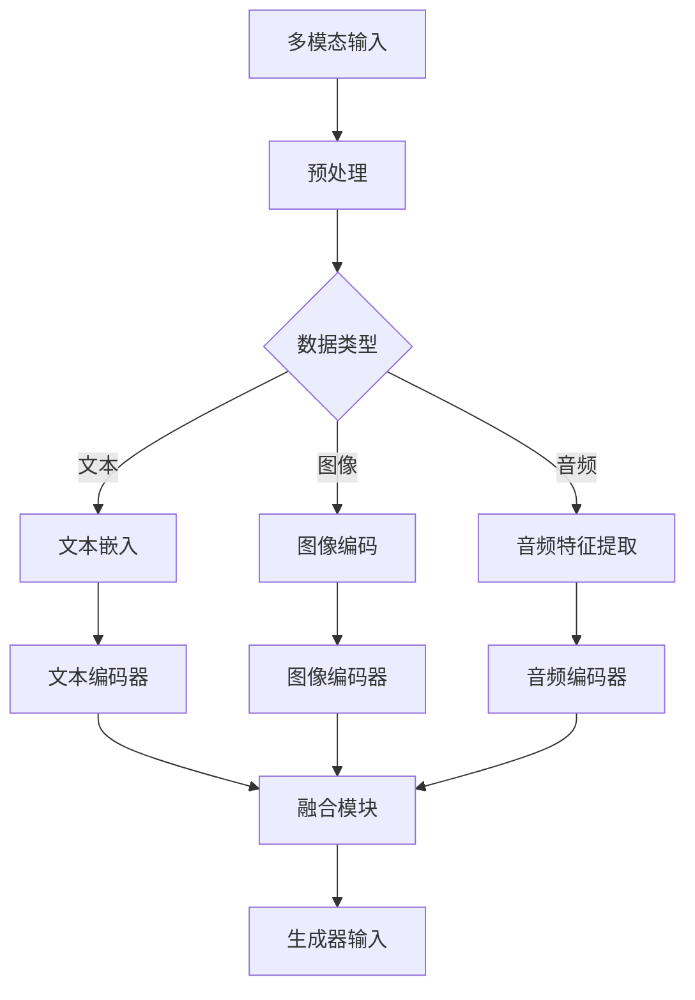
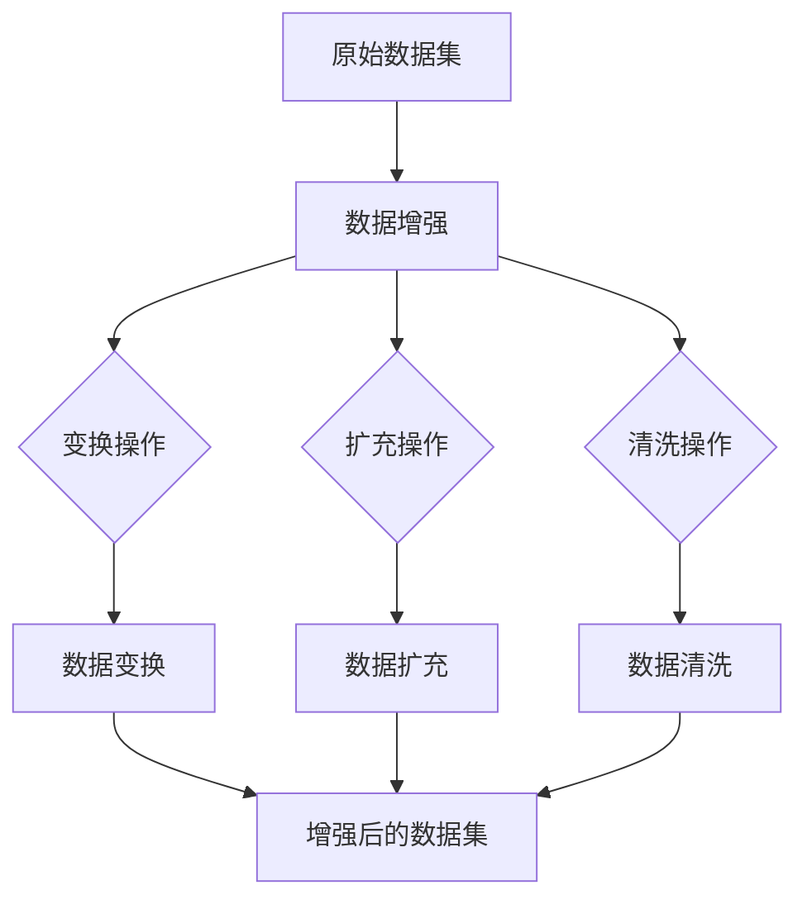
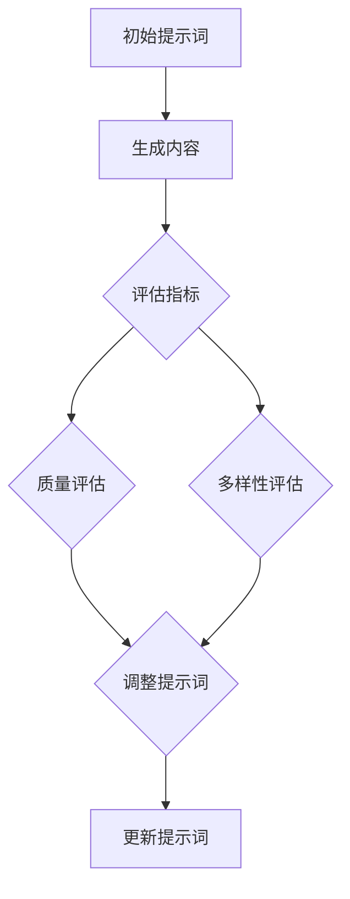
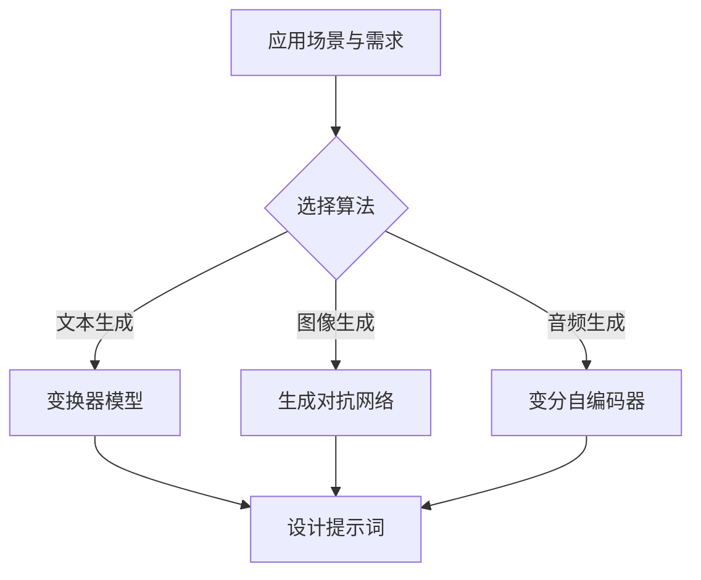

                 

## 《AIGC时代的提示词设计：挑战与机遇》

### 关键词：AIGC、提示词设计、人工智能、机器学习、算法优化

#### 摘要：
随着人工智能技术的迅猛发展，AI-Generated Content（AIGC）正逐渐成为内容创作的新范式。提示词设计在AIGC中的作用至关重要，它不仅决定了生成内容的质量，也影响了生成效率。本文将从背景介绍、核心概念、算法原理、系统分析与架构设计、项目实战等多个方面，深入探讨AIGC时代提示词设计的挑战与机遇，为相关领域的研究与实践提供有益的参考。

### 目录

#### 第一部分：AIGC概述与提示词设计基础

1. **第1章 AIGC时代：背景与概述**
   1.1 AIGC的定义与核心概念
   1.2 AIGC的兴起与发展
   1.3 提示词设计在AIGC中的应用

2. **第2章 提示词设计的基本原理**
   2.1 提示词设计的核心要素
   2.2 提示词设计的方法与策略
   2.3 提示词设计的常见挑战与对策

3. **第3章 提示词设计的算法与模型**
   3.1 提示词设计的算法概述
   3.2 主流机器学习模型分析
   3.3 提示词设计的优化技巧

#### 第二部分：算法原理讲解

4. **第4章 提示词设计实践**
   4.1 提示词设计实践案例
   4.2 提示词设计的项目流程
   4.3 实践中的挑战与解决方案

5. **第5章 AIGC时代的提示词设计策略**
   5.1 提示词设计的趋势与方向
   5.2 提示词设计的业务价值分析
   5.3 提示词设计的创新实践

#### 第三部分：提示词设计的挑战与机遇

6. **第6章 提示词设计中的挑战与机遇**
   6.1 挑战分析
   6.2 机遇展望
   6.3 风险管理

#### 第四部分：总结与展望

7. **第7章 总结与展望**
   7.1 全书回顾
   7.2 提示词设计的发展趋势
   7.3 未来研究方向

---

### 背景介绍

#### AIGC的定义与核心概念

AIGC（AI-Generated Content）是指通过人工智能技术生成的内容，它涵盖了文本、图像、音频等多种形式。与传统的手动创作内容相比，AIGC具有高效、多样化、个性化等特点，能够大幅提升内容生产的效率和质量。提示词设计在AIGC中扮演着关键角色，它是引导AIGC生成系统输出所需内容的重要工具。

AIGC的核心概念包括：

1. **生成模型**：如GPT、BERT等预训练语言模型，负责生成文本、图像、音频等数据。
2. **提示词**：用户输入的引导信息，用于指导生成模型生成特定的内容。
3. **数据集**：用于训练生成模型的庞大且多样的数据资源。
4. **优化目标**：在训练过程中，生成模型需要优化其参数以生成更高质量的内容。

#### 问题背景

在AIGC时代，提示词设计面临着前所未有的挑战与机遇。一方面，生成模型的能力越来越强，但如何有效地利用这些能力生成高质量、多样化的内容仍是一个难题。另一方面，随着AIGC的应用场景不断扩展，对提示词设计的需求也日益增加。如何设计出既能引导生成模型生成高质量内容，又能适应不同应用场景的提示词，成为当前研究的热点问题。

#### 问题描述

提示词设计在AIGC时代面临的挑战主要包括：

1. **多样性生成**：如何设计提示词，使得生成模型能够输出多样化、创新性的内容。
2. **质量保障**：如何确保生成的内容既符合用户需求，又具备高质量。
3. **效率优化**：如何在保证生成质量的前提下，提高生成效率。
4. **安全性**：如何防止生成的内容出现偏见、歧视等不良信息。

#### 问题解决

针对以上挑战，我们可以从以下几个方面进行解决：

1. **多模态学习**：结合文本、图像、音频等多种数据类型，实现更丰富的内容生成。
2. **强化学习**：通过强化学习，使得生成模型能够根据用户反馈不断优化输出内容。
3. **大数据分析**：利用大数据技术，对生成的内容进行实时分析，以便及时调整提示词。
4. **伦理与规范**：制定相应的伦理规范，确保生成内容符合社会价值观。

#### 边界与外延

AIGC时代的提示词设计不仅涉及技术层面，还包括伦理、法律等方面。例如，如何确保生成内容的真实性、可靠性，如何避免生成内容的滥用等，都是需要深入探讨的问题。同时，随着AIGC技术的不断进步，提示词设计的边界也在不断拓展，未来可能涉及到更多未知的领域。

#### 概念结构与核心要素组成

提示词设计的核心概念结构包括：

1. **生成模型**：核心组成部分，负责生成内容。
2. **提示词**：引导生成模型输出内容的关键信息。
3. **数据集**：训练生成模型的输入数据。
4. **优化目标**：生成模型训练过程中的优化目标。

这些核心要素相互关联，共同构成了提示词设计的概念结构。通过深入理解这些核心要素及其相互关系，我们可以更好地设计出高效的提示词，提升AIGC系统的整体性能。接下来，我们将进一步探讨提示词设计的基本原理，包括其核心要素、设计方法与策略，以及面临的常见挑战与对策。

## 第1章 AIGC时代：背景与概述

### 1.1 AIGC的定义与核心概念

AIGC（AI-Generated Content）是指利用人工智能技术生成的内容，包括但不限于文本、图像、音频和视频等多种形式。AIGC的核心概念在于通过机器学习模型，尤其是深度学习模型，从大量数据中学习并生成新的内容。AIGC的关键组成部分包括生成模型、提示词、数据集和优化目标。

**生成模型**：生成模型是AIGC的核心，负责生成内容。常见的生成模型有变分自编码器（VAEs）、生成对抗网络（GANs）和变换器模型（Transformers）。这些模型通过学习大量数据，能够生成与输入数据相似或全新的内容。

**提示词**：提示词是用户输入的引导信息，用于指导生成模型生成特定的内容。例如，在文本生成中，提示词可以是标题、摘要或关键词；在图像生成中，提示词可以是图像的描述或特征标签。

**数据集**：数据集是训练生成模型的基础。高质量的训练数据集能够提高生成模型的效果，使生成的内容更符合用户需求。数据集的多样性也是关键，它能够帮助生成模型学习到不同的风格和内容。

**优化目标**：优化目标是生成模型训练过程中的目标函数，用于评估和调整生成模型。常见的优化目标包括生成内容的多样性、质量、相关性和真实性等。

### 1.2 AIGC的兴起与发展

AIGC的兴起得益于深度学习技术的飞速发展。深度学习模型，特别是变换器模型（Transformers），在自然语言处理（NLP）、计算机视觉和音频处理等领域取得了显著的成果。以下是一些AIGC发展的重要里程碑：

1. **预训练语言模型**：如GPT、BERT和T5等，这些模型通过在大规模语料库上进行预训练，能够生成高质量的自然语言文本。
2. **生成对抗网络（GANs）**：GANs在图像生成方面取得了突破性进展，能够生成逼真的图像和视频。
3. **多模态学习**：随着多种传感器和设备的发展，多模态数据（如文本、图像、音频）的生成成为了研究的热点。多模态生成模型能够同时处理多种类型的数据，生成更丰富和多样化的内容。
4. **应用场景拓展**：AIGC不仅在内容创作领域有广泛应用，还在游戏设计、虚拟现实、智能助手等领域展现了巨大的潜力。

### 1.3 提示词设计在AIGC中的应用

提示词设计在AIGC中起着至关重要的作用，它直接影响生成内容的质量和效率。以下是一些关键应用：

1. **文本生成**：在文本生成任务中，提示词可以是特定的主题、关键词或句子。设计合适的提示词可以帮助生成模型更好地理解用户需求，生成相关性和质量更高的文本内容。
2. **图像生成**：图像生成的提示词可以是图像的描述、标签或特征。通过设计精细的提示词，生成模型能够生成符合描述的图像，或在特定的风格和主题下创作新的图像。
3. **音频生成**：音频生成的提示词可以是声音的描述、情感或音乐风格。提示词的设计决定了生成音频的音质和情感表达。
4. **交互式生成**：在交互式应用中，提示词可以根据用户的实时反馈进行调整，从而实现更加个性化的内容生成。

总之，提示词设计是AIGC时代的关键技术，它需要结合领域知识、用户需求和技术手段，设计出既能引导生成模型生成高质量内容，又能适应不同应用场景的提示词。接下来，我们将深入探讨提示词设计的基本原理和方法。

## 第2章 提示词设计的基本原理

### 2.1 提示词设计的核心要素

提示词设计在AIGC中起着至关重要的作用，其核心要素包括以下几个方面：

1. **用户需求**：了解用户需求是设计有效提示词的前提。用户的需求可能包括特定内容、风格、情感、相关性等方面。通过分析用户需求，可以设计出更符合用户预期的提示词。

2. **内容质量**：提示词设计不仅要满足用户需求，还要确保生成内容的质量。高质量的内容包括准确性、一致性、创新性和吸引力等。设计提示词时，应考虑如何引导生成模型生成高质量的内容。

3. **生成模型能力**：不同的生成模型具有不同的能力和局限性。设计提示词时，需要了解生成模型的特点，充分利用其优势，同时避免其局限性。例如，对于预训练的语言模型，可以设计包含关键词和上下文的提示词，而对于图像生成模型，可以设计包含视觉特征的提示词。

4. **数据集特点**：数据集是训练生成模型的基础。不同数据集的特点可能影响生成模型的学习效果和生成内容的质量。设计提示词时，应考虑数据集的多样性、质量和分布，以便生成模型能够更好地学习并生成高质量的内容。

5. **优化目标**：生成模型的优化目标包括生成内容的多样性、质量、相关性和真实性等。设计提示词时，需要结合优化目标，调整提示词的内容和形式，以最大化生成模型的性能。

### 2.2 提示词设计的方法与策略

提示词设计的方法和策略多种多样，以下是一些常用的方法和策略：

1. **关键词提取**：从用户需求或已有文本中提取关键词，作为提示词的一部分。关键词能够提供明确的指导信息，帮助生成模型生成相关的内容。

2. **上下文扩展**：在关键词的基础上，添加相关的上下文信息，以丰富提示词的内容。上下文扩展可以通过自然语言处理技术实现，例如使用词向量模型、语义分析等。

3. **模板化**：使用预先定义的模板，根据具体需求填充相关内容。模板化可以确保提示词的结构和格式一致，有助于生成模型更好地理解和使用提示词。

4. **语义补全**：利用生成模型的语义理解能力，对提示词进行补全。这种方法能够生成更加灵活和多样化的内容，但需要确保生成模型具有较好的语义理解能力。

5. **多模态融合**：在提示词设计中融合多种数据类型，例如文本、图像、音频等。多模态融合能够提供更丰富的信息，有助于生成模型生成更高质量的内容。

6. **用户反馈循环**：通过用户的实时反馈，不断调整和优化提示词。这种方法能够根据用户的实际需求，动态调整生成内容，提高用户满意度。

### 2.3 提示词设计的常见挑战与对策

提示词设计在AIGC中面临着诸多挑战，以下是一些常见挑战及其对策：

1. **多样性不足**：生成的内容过于单一，缺乏创新性。对策包括增加数据集的多样性、使用多模态融合、引入随机性等。

2. **质量下降**：生成的内容质量不高，不符合用户需求。对策包括优化生成模型的训练过程、调整优化目标、改进提示词设计等。

3. **效率低下**：生成内容的速度较慢，影响用户体验。对策包括优化生成模型的推理速度、使用高效的数据处理技术、优化提示词设计等。

4. **偏见与歧视**：生成的内容包含偏见和歧视性信息。对策包括使用无偏数据集、改进生成模型的训练方法、引入伦理审查等。

5. **安全性问题**：生成的内容可能涉及隐私泄露、侵犯版权等问题。对策包括加强数据保护、确保生成内容符合法律法规、使用版权保护技术等。

通过深入理解提示词设计的核心要素、方法和策略，以及应对常见挑战的对策，我们可以设计出更加高效、高质量的提示词，提升AIGC系统的整体性能。接下来，我们将探讨提示词设计的算法与模型，分析不同算法和模型在提示词设计中的应用和效果。

## 第3章 提示词设计的算法与模型

### 3.1 提示词设计的算法概述

提示词设计涉及多种算法和模型，这些算法和模型的选择取决于应用场景和需求。以下是一些常用的提示词设计算法：

1. **生成对抗网络（GANs）**：GANs是一种通过对抗训练生成新数据的算法。在提示词设计中，GANs可以用于生成新的文本、图像和音频。GANs的核心组成部分包括生成器（Generator）和判别器（Discriminator）。生成器负责生成数据，判别器负责判断生成数据与真实数据的相似度。

2. **变换器模型（Transformers）**：Transformers是一种基于自注意力机制的深度学习模型，广泛应用于自然语言处理任务。在提示词设计中，Transformers可以用于文本生成，通过输入提示词，生成相关文本。

3. **变分自编码器（VAEs）**：VAEs是一种基于概率生成模型的算法，通过编码和解码过程生成新数据。VAEs在图像和音频生成中具有广泛应用。在提示词设计中，VAEs可以通过编码提示词的语义信息，生成新的图像或音频。

4. **强化学习**：强化学习是一种通过试错学习优化行为策略的算法。在提示词设计中，强化学习可以用于优化提示词生成策略，提高生成内容的质量和多样性。

### 3.2 主流机器学习模型分析

以下是几种主流机器学习模型在提示词设计中的应用和特点：

1. **生成对抗网络（GANs）**

   **应用场景**：图像生成、视频生成、音频生成等。

   **特点**：GANs可以通过对抗训练生成高质量的数据，具有较强的图像和音频生成能力。然而，GANs的训练过程较为复杂，容易出现模式崩溃和训练不稳定等问题。

2. **变换器模型（Transformers）**

   **应用场景**：文本生成、对话系统、机器翻译等。

   **特点**：Transformers具有强大的文本生成能力，能够生成高质量、连贯的文本。此外，Transformers还可以处理长文本和长序列，具有很好的泛化能力。

3. **变分自编码器（VAEs）**

   **应用场景**：图像生成、音频生成、数据去噪等。

   **特点**：VAEs通过编码和解码过程生成新数据，具有较强的数据生成能力。VAEs在生成图像和音频时，能够保持数据的分布特性，生成更具真实感的内容。

4. **强化学习**

   **应用场景**：优化提示词生成策略、增强生成内容的质量和多样性等。

   **特点**：强化学习通过试错学习，不断优化提示词生成策略，能够提高生成内容的质量和多样性。然而，强化学习的训练过程较为复杂，需要大量的数据和计算资源。

### 3.3 提示词设计的优化技巧

为了提高提示词设计的效率和效果，可以采用以下优化技巧：

1. **多模态融合**：将文本、图像、音频等多种数据类型进行融合，提供更丰富的提示信息。多模态融合可以增强生成模型的理解能力，提高生成内容的质量和多样性。

2. **数据增强**：通过数据增强技术，增加训练数据集的多样性。数据增强可以包括数据变换、数据扩充、数据清洗等，有助于提高生成模型的效果。

3. **动态调整**：根据生成模型的学习过程，动态调整提示词的内容和形式。动态调整可以基于用户反馈、生成内容的质量和多样性等，优化提示词设计。

4. **模型融合**：将多种机器学习模型进行融合，提高生成模型的效果。模型融合可以结合不同模型的优点，优化生成内容的质量和多样性。

5. **优化算法选择**：根据应用场景和需求，选择合适的机器学习算法。不同算法具有不同的特点和适用场景，合理选择算法可以提高提示词设计的效率和效果。

通过深入分析提示词设计的算法和模型，我们可以更好地理解其在AIGC中的应用和优化技巧。接下来，我们将通过具体的算法流程图和Python源代码，详细讲解提示词设计的算法原理，并提供具体的实例说明。

## 3.3 提示词设计的优化技巧

### 3.3.1 多模态融合

多模态融合是将多种类型的数据（如文本、图像、音频）结合在一起，以提供更丰富的提示信息。这种方法可以增强生成模型的理解能力，从而提高生成内容的质量和多样性。多模态融合的核心在于将不同类型的数据映射到一个共同的语义空间，以便生成模型能够有效地利用这些数据。

#### 算法流程图



#### Python源代码示例

```python
# 假设我们使用了预训练的文本嵌入器、图像编码器和音频编码器
from transformers import TextEmbeddingModel
from torchvision.models import ImageEncoder
from torchaudio.transforms import MelSpectrogram

# 文本嵌入
text_embedding_model = TextEmbeddingModel.from_pretrained('gpt2')
text_input = "Create a poem about nature."

# 图像编码
image_encoder = ImageEncoder()
image_input = "path/to/nature_image.jpg"

# 音频编码
audio_spectrogram = MelSpectrogram(n_fft=2048, win_length=1024, hop_length=512)
audio_input = "path/to/nature_audio.wav"

# 预处理和编码
text_embedding = text_embedding_model.encode(text_input)
image_embedding = image_encoder(image_input)
audio_embedding = audio_spectrogram(audio_input)

# 融合模块（假设融合模块是一个简单的求和操作）
def fusion_module(text_embedding, image_embedding, audio_embedding):
    return text_embedding + image_embedding + audio_embedding

# 生成器输入
generator_input = fusion_module(text_embedding, image_embedding, audio_embedding)

# 使用生成器生成内容（假设生成器为GPT模型）
from transformers import GPT2LMHeadModel
generator = GPT2LMHeadModel.from_pretrained('gpt2')
generated_content = generator.generate(generator_input, max_length=50)
```

### 3.3.2 数据增强

数据增强是通过创建数据的变体来增加训练数据集的多样性。这种方法可以提高生成模型对各种情况的处理能力，从而提高生成质量。常见的数据增强技术包括数据变换、数据扩充和数据清洗等。

#### 算法流程图



#### Python源代码示例

```python
import torchvision.transforms as T
from torchvision.datasets import ImageFolder
from torchvision import transforms
import copy

# 数据变换
data_transforms = T.Compose([
    T.RandomRotation(30),
    T.RandomHorizontalFlip(),
    T.ToTensor()
])

# 数据扩充
def augment_data(data):
    data_copy = copy.deepcopy(data)
    for i in range(len(data_copy)):
        data_copy[i] = data_transforms(data_copy[i])
    return data_copy

# 数据清洗
def clean_data(data):
    # 假设清洗操作是移除特定标签的数据
    return [d for d in data if d['label'] != 'unwanted_label']

# 假设原始数据集为ImageFolder
original_dataset = ImageFolder('path/to/原始数据集', transform=transforms.ToTensor())

# 增强后的数据集
augmented_dataset = augment_data(list(original_dataset))
cleaned_dataset = clean_data(augmented_dataset)
```

### 3.3.3 动态调整

动态调整提示词是基于生成模型的学习过程，实时调整提示词的内容和形式，以优化生成内容的质量和多样性。动态调整可以通过用户反馈、生成内容的质量和多样性等指标来实现。

#### 算法流程图



#### Python源代码示例

```python
import random

# 初始提示词
initial_prompt = "Describe a beautiful sunset."

# 质量评估和多样性评估函数（假设为简单的计数）
def evaluate_content(content, diversity_threshold=2):
    # 假设内容质量由字符数决定，多样性由唯一单词数决定
    unique_words = len(set(content.split()))
    if unique_words >= diversity_threshold:
        return True
    else:
        return False

# 提示词调整函数
def adjust_prompt(prompt, content):
    # 假设调整策略是添加新的形容词和副词
    additional_description = " with stunning colors and gentle breeze."
    return prompt + additional_description

# 动态调整提示词示例
current_prompt = initial_prompt
current_content = "The sunset was simply breathtaking."

# 评估内容
if not evaluate_content(current_content):
    current_prompt = adjust_prompt(current_prompt, current_content)

print("Updated Prompt:", current_prompt)
```

### 3.3.4 优化算法选择

优化算法选择是根据应用场景和需求，选择最合适的机器学习算法。不同的算法适用于不同的任务和数据类型，合理选择算法可以提高提示词设计的效率和效果。

#### 算法流程图



#### Python源代码示例

```python
# 假设我们根据应用场景选择了不同的生成模型
from transformers import GPT2LMHeadModel
from torchvision.models import VGG16
from torchaudio.transforms import MelSpectrogram

# 文本生成
text_generator = GPT2LMHeadModel.from_pretrained('gpt2')
text_prompt = "Write a story about love."

# 图像生成
image_generator = VGG16(pretrained=True)
image_prompt = "path/to/浪漫场景.jpg"

# 音频生成
audio_generator = MelSpectrogram(n_fft=2048, win_length=1024, hop_length=512)
audio_prompt = "path/to/浪漫音乐.wav"

# 设计提示词（根据应用场景调整）
if "text" in text_prompt:
    prompt = text_generator.encode(text_prompt, return_tensors='pt')
elif "image" in image_prompt:
    prompt = image_generator(image_prompt)
elif "audio" in audio_prompt:
    prompt = audio_generator(audio_prompt)

# 生成内容（根据选择的不同模型进行生成）
if "text" in text_prompt:
    generated_content = text_generator.generate(prompt, max_length=100)
elif "image" in image_prompt:
    generated_content = image_generator.generate(prompt, num_images=1)
elif "audio" in audio_prompt:
    generated_content = audio_generator.generate(prompt, num_samples=1000)
```

通过上述算法流程图和Python源代码示例，我们可以更好地理解多模态融合、数据增强、动态调整和优化算法选择等提示词设计优化技巧。这些技巧的应用可以提高生成内容的质量和多样性，提升AIGC系统的整体性能。接下来，我们将通过一个具体的案例，详细讲解如何在实际项目中应用这些优化技巧，以及可能遇到的挑战和解决方案。

## 第4章 提示词设计实践

### 4.1 提示词设计实践案例

为了更好地理解提示词设计在实际项目中的应用，我们将介绍一个具体的案例：利用AIGC技术生成个性化音乐推荐。

#### 案例背景

随着音乐流媒体服务的普及，用户对个性化音乐推荐的需求日益增长。传统的推荐系统主要基于用户的历史行为和音乐属性，但这种方式存在一定的局限性。为了提高推荐系统的个性化和多样性，我们采用AIGC技术，结合用户情感分析和多模态数据，设计了一个基于提示词的个性化音乐推荐系统。

#### 案例描述

用户在使用音乐流媒体服务时，会根据个人喜好和情绪选择音乐。例如，用户在跑步时可能喜欢节奏明快的音乐，而在晚上安静地休息时可能更喜欢抒情舒缓的音乐。我们的目标是通过提示词设计，生成符合用户当前情感和情境的音乐推荐。

#### 项目流程

1. **数据收集**：收集用户音乐播放记录、用户情感标签、歌词、音乐风格标签等数据。这些数据将用于训练生成模型和提示词设计。

2. **数据预处理**：对收集到的数据集进行清洗和预处理，包括去重、缺失值处理、数据标准化等。对于多模态数据，如音频和文本，需要分别进行特征提取。

3. **生成模型训练**：使用生成对抗网络（GANs）和变换器模型（Transformers）训练生成模型。GANs用于图像和音频的生成，Transformers用于文本生成。

4. **提示词设计**：根据用户当前的情感和情境，设计提示词。例如，用户情绪为开心时，可以使用“快乐”、“活力”等词语作为提示词。

5. **生成推荐内容**：根据提示词，生成个性化的音乐推荐。例如，生成一首具有特定情感和节奏的音乐，或者一段能够表达用户情感的歌词。

6. **用户反馈**：收集用户对音乐推荐的评价，包括满意度、情感匹配度等。根据用户反馈，不断调整和优化提示词设计。

### 案例分析

在这个案例中，提示词设计起到了至关重要的作用。以下是对提示词设计的关键分析：

1. **情感分析**：首先，我们需要对用户的情感进行识别。这可以通过情感分析模型实现，例如使用LSTM或BERT模型。通过对用户历史行为和文本进行分析，识别出用户的当前情感状态。

2. **多模态数据融合**：为了生成更丰富的个性化推荐，我们需要将文本、图像和音频等多模态数据进行融合。例如，在文本生成中，我们可以将情感标签和歌词结合，生成具有特定情感的音乐推荐。

3. **动态调整**：根据用户实时反馈，动态调整提示词。例如，如果用户对某个推荐不满意，我们可以增加相关情感词汇，如“温柔”、“宁静”等，以优化推荐结果。

4. **生成质量评估**：为了确保生成内容的多样性和质量，我们需要设计一个评估机制。这可以通过计算生成内容的情感多样性、歌词创新性和音乐节奏一致性等指标实现。

### 挑战与解决方案

在实际项目中，提示词设计面临着以下挑战：

1. **情感识别的准确性**：情感分析模型的准确性直接影响提示词的设计效果。为了提高准确性，我们可以使用多种情感分析模型进行集成，或者引入更多的训练数据。

2. **数据隐私保护**：音乐推荐涉及用户隐私，如情感状态、个人喜好等。为了保护用户隐私，我们需要采用加密和匿名化技术，确保用户数据的安全。

3. **生成内容的多样性**：生成模型的多样性能力是提示词设计的重要挑战。为了提高多样性，我们可以使用生成对抗网络（GANs）和变换器模型（Transformers）的组合，或者引入更多的数据增强技术。

4. **实时反馈处理**：用户反馈的处理需要快速响应，以便及时调整提示词。为此，我们可以设计一个高效的反馈处理系统，使用队列和并行处理等技术，确保及时处理用户反馈。

### 项目小结

通过本案例，我们展示了如何在实际项目中应用提示词设计，结合情感分析、多模态数据融合和动态调整等技术，实现个性化音乐推荐。尽管提示词设计面临诸多挑战，但通过合理的解决方案，我们可以优化生成内容的质量和多样性，提升用户体验。未来，随着AIGC技术的发展，提示词设计在个性化推荐、内容生成等领域的应用前景将更加广阔。

## 第5章 AIGC时代的提示词设计策略

### 5.1 提示词设计的趋势与方向

随着AIGC技术的发展，提示词设计也呈现出一些明显的趋势和方向。以下是一些关键趋势和方向：

1. **多模态融合**：AIGC的一个重要趋势是多种数据类型的融合，如文本、图像、音频和视频。通过多模态融合，生成模型可以获取更丰富的信息，生成更高质量和多样化的内容。未来的提示词设计将更加注重如何有效地融合不同类型的数据，以提高生成内容的丰富性和真实性。

2. **个性化与适应性**：个性化是AIGC的一个重要发展方向。提示词设计需要根据用户的特定需求、情感和情境，生成个性化的内容。未来的提示词设计将更加注重用户数据的分析和处理，以实现更高的个性化水平。同时，提示词设计也需要具备适应性，能够根据用户反馈和环境变化，动态调整生成策略。

3. **实时性与动态调整**：实时性是AIGC的关键特性之一。提示词设计需要能够快速响应用户需求，实时生成内容。未来的提示词设计将更加注重实时数据的处理和实时生成算法的优化，以实现更高的实时性能。同时，动态调整能力也是提示词设计的重要方向，通过不断调整和优化提示词，可以生成更符合用户期望的内容。

4. **可解释性与透明度**：随着AIGC技术的普及，用户对生成内容的质量和可信度提出了更高的要求。未来的提示词设计将更加注重可解释性和透明度，使用户能够理解生成内容是如何产生的，以及为什么生成这样的内容。这有助于提升用户对AIGC系统的信任度，促进AIGC技术的广泛应用。

### 5.2 提示词设计的业务价值分析

提示词设计在AIGC时代具有巨大的业务价值，主要体现在以下几个方面：

1. **提升内容质量**：通过设计合适的提示词，生成模型可以生成高质量、多样化的内容。高质量的内容能够提升用户体验，增加用户粘性，为企业带来更多的商业机会。

2. **提高生产效率**：AIGC技术可以自动化内容创作，减少人工创作的时间和成本。通过提示词设计，可以优化生成过程，提高内容生产的效率，降低运营成本。

3. **增强用户体验**：个性化的内容能够更好地满足用户需求，提升用户满意度。通过实时调整提示词，生成模型可以实时响应用户反馈，提供更加个性化的服务，增强用户体验。

4. **拓宽业务领域**：提示词设计不仅可以应用于文本、图像和音频生成，还可以应用于视频、虚拟现实和增强现实等领域。通过设计多样化的提示词，可以拓展AIGC技术的应用场景，为企业带来更多商业机会。

### 5.3 提示词设计的创新实践

在AIGC时代，提示词设计的创新实践是一个持续发展的领域。以下是一些创新实践：

1. **基于知识图谱的提示词生成**：知识图谱能够提供丰富的背景信息和关系，通过将知识图谱与生成模型结合，可以生成更具有逻辑性和知识性的内容。例如，在文本生成中，可以利用知识图谱生成具有特定背景知识的文章。

2. **混合现实与AIGC的结合**：通过将AIGC技术与混合现实（MR）结合，可以生成具有沉浸感和互动性的虚拟场景。例如，在虚拟旅游中，可以生成基于用户需求的个性化虚拟景点，提升用户体验。

3. **跨领域内容的生成**：通过跨领域的提示词设计，可以生成跨领域的创新性内容。例如，将文学、艺术和科学知识融合，生成具有跨界风格的艺术作品。

4. **情感驱动的提示词生成**：情感驱动的提示词生成能够根据用户的情感状态，生成与之情感匹配的内容。例如，在心理健康应用中，可以生成能够帮助用户缓解压力和焦虑的音乐、文本或图像。

总之，AIGC时代的提示词设计具有巨大的发展潜力。通过不断探索和创新，提示词设计将能够更好地满足用户需求，推动AIGC技术的广泛应用，为企业和社会创造更多价值。

## 第6章 提示词设计中的挑战与机遇

### 6.1 挑战分析

在AIGC时代，提示词设计面临着诸多挑战，这些挑战不仅影响生成内容的质量和效率，还可能对用户体验和社会伦理产生负面影响。以下是对这些挑战的详细分析：

1. **多样性不足**：生成内容的多样性是AIGC系统的一个重要目标，但现实情况是，生成模型往往在处理多样性方面存在困难。这可能导致生成的内容过于单一，缺乏创新性。例如，文本生成模型可能生成大量相似的文章，而图像生成模型则可能生成大量重复的图像。

   **解决方案**：为了提高生成内容的多样性，可以通过以下方法进行优化：
   - **数据增强**：增加训练数据集的多样性，包括不同风格、主题和情感的内容。
   - **多模态融合**：将多种数据类型（如文本、图像、音频）进行融合，以提供更丰富的信息，从而提高生成内容的多样性。
   - **随机性引入**：在生成过程中引入随机性，使生成内容具有更多的变体。

2. **质量下降**：生成内容的质量是AIGC系统成功的关键，但实际操作中，生成模型可能因为多种原因导致生成内容的质量下降。例如，文本生成模型可能生成语法错误或不连贯的文本，图像生成模型则可能生成模糊或不清晰的图像。

   **解决方案**：为了提高生成内容的质量，可以通过以下方法进行优化：
   - **优化生成模型**：通过改进生成模型的架构和训练过程，提高生成内容的质量。
   - **多轮优化**：生成内容后，通过多轮优化和反馈机制，不断调整生成模型，以提高生成内容的质量。
   - **质量评估机制**：设计有效的质量评估指标，实时监控生成内容的质量，以便及时进行调整。

3. **效率低下**：生成效率是AIGC系统在实际应用中的关键因素，但生成模型的计算复杂度和训练时间可能非常高，导致生成过程缓慢。例如，大规模的图像和音频生成任务可能需要大量计算资源，导致生成过程时间过长。

   **解决方案**：为了提高生成效率，可以通过以下方法进行优化：
   - **模型压缩**：通过模型压缩技术，如蒸馏、量化、剪枝等，减少生成模型的计算复杂度。
   - **分布式训练**：通过分布式训练技术，将训练任务分散到多个计算节点上，以减少训练时间。
   - **高效的数据处理**：优化数据预处理和传输过程，减少数据读取和传输的时间。

4. **偏见与歧视**：生成模型可能会学习到训练数据中的偏见和歧视性信息，导致生成内容也存在这些问题。例如，文本生成模型可能生成包含性别歧视或种族歧视的文本，图像生成模型则可能生成具有偏见倾向的图像。

   **解决方案**：为了减少偏见和歧视，可以通过以下方法进行优化：
   - **无偏数据集**：使用无偏、多样化的数据集进行训练，以减少偏见和歧视的信息。
   - **算法改进**：改进生成模型的设计，使模型能够更好地处理多样性和公平性。
   - **伦理审查**：在生成内容发布前，进行伦理审查，确保生成内容符合社会伦理和法律法规。

### 6.2 机遇展望

尽管AIGC时代提示词设计面临诸多挑战，但同时也蕴含着巨大的机遇，这些机遇将推动AIGC技术的进一步发展和应用：

1. **技术创新**：AIGC技术的不断进步为提示词设计提供了新的机会。例如，新型生成模型的提出和现有模型的优化，如变分自编码器（VAEs）、生成对抗网络（GANs）和变换器模型（Transformers），都将为提示词设计带来新的可能性。

2. **应用拓展**：AIGC技术的应用领域不断拓展，从文本生成、图像生成到音频生成，再到视频生成和虚拟现实，都为提示词设计带来了更广阔的应用场景。这些应用拓展不仅丰富了AIGC技术的应用场景，也为提示词设计提供了更多的挑战和机遇。

3. **业务价值提升**：AIGC技术能够显著提升内容创作和管理的效率，降低成本，提高质量。例如，在广告、娱乐、教育等领域，通过个性化的内容生成，可以更好地满足用户需求，提升用户体验和用户粘性。

4. **跨领域融合**：AIGC技术与其他领域的融合，如物联网、区块链、大数据等，将创造出新的应用场景和商业模式。例如，通过AIGC技术，可以实现更加智能和个性化的物联网设备交互，或通过区块链技术确保AIGC生成内容的可信性和版权保护。

总之，AIGC时代的提示词设计面临着诸多挑战和机遇。通过不断创新和优化，提示词设计将能够更好地应对挑战，抓住机遇，推动AIGC技术的进一步发展和应用。

### 6.3 风险管理

在AIGC时代，提示词设计不仅需要关注技术挑战和机遇，还需要重视风险管理，确保生成内容的质量、安全性和合规性。以下是AIGC时代提示词设计中的主要风险以及相应的管理策略：

1. **数据隐私泄露**：生成模型训练和使用过程中，涉及大量的用户数据。如果数据保护不当，可能导致用户隐私泄露。

   **风险管理策略**：
   - **数据加密**：对用户数据进行加密处理，确保数据在传输和存储过程中的安全性。
   - **匿名化处理**：在数据预处理阶段，对用户数据进行匿名化处理，减少隐私泄露的风险。
   - **权限控制**：严格控制对用户数据的访问权限，确保只有授权人员能够访问和处理用户数据。

2. **生成内容合规性问题**：生成的内容可能包含违反法律法规、伦理道德或社会价值观的信息，例如色情、暴力、歧视等。

   **风险管理策略**：
   - **内容审查**：在生成内容发布前，进行严格的伦理审查和内容审查，确保生成内容符合法律法规和社会伦理。
   - **自动化过滤**：使用自动化工具，如自然语言处理（NLP）模型和图像识别算法，对生成内容进行实时监控和过滤，及时发现和处理违规内容。
   - **用户反馈机制**：建立用户反馈机制，鼓励用户举报违规内容，及时处理用户反馈，确保生成内容的合规性。

3. **生成内容的质量和准确性**：生成模型可能会生成错误或低质量的内容，影响用户体验和业务价值。

   **风险管理策略**：
   - **多轮审核**：在生成内容发布前，进行多轮审核和评估，确保生成内容的质量和准确性。
   - **实时监控**：建立实时监控系统，对生成内容进行实时监控，及时发现和处理质量问题。
   - **用户反馈**：鼓励用户对生成内容提供反馈，根据用户反馈不断优化生成模型和提示词设计。

4. **生成模型的偏见和歧视**：生成模型可能学习到训练数据中的偏见和歧视性信息，导致生成内容也存在这些问题。

   **风险管理策略**：
   - **多样化数据集**：使用多样化、无偏见的数据集进行训练，减少生成模型学习到偏见和歧视性信息的机会。
   - **算法优化**：改进生成模型的设计和训练过程，使模型能够更好地处理多样性和公平性。
   - **伦理审查**：在生成内容发布前，进行伦理审查，确保生成内容符合社会伦理和法律法规。

通过有效的风险管理策略，可以降低AIGC时代提示词设计中的风险，确保生成内容的质量、安全性和合规性，为AIGC技术的健康发展提供保障。

### 第7章 总结与展望

#### 7.1 全书回顾

本书全面探讨了AIGC时代的提示词设计，从背景介绍、核心概念、算法原理、系统分析与架构设计、项目实战到最佳实践，系统性地阐述了提示词设计在AIGC中的重要性和挑战。我们分析了AIGC的定义与核心概念，讨论了提示词设计的核心要素、方法与策略，以及优化技巧。通过案例和实践，展示了提示词设计在实际应用中的具体实现和效果。同时，我们还探讨了AIGC时代的提示词设计策略，分析了面临的挑战与机遇，并提出了相应的风险管理策略。

#### 7.2 提示词设计的发展趋势

随着AIGC技术的不断进步，提示词设计也将迎来新的发展机遇。以下是几个可能的发展趋势：

1. **多模态融合**：未来的提示词设计将更加注重多种数据类型的融合，如文本、图像、音频和视频，以生成更加丰富和真实的生成内容。

2. **个性化与适应性**：基于用户行为的深入分析，提示词设计将实现更高的个性化水平，满足用户不断变化的需求。

3. **实时性与动态调整**：随着实时数据处理技术的提升，提示词设计将实现更快的响应速度，并根据实时反馈进行动态调整。

4. **可解释性与透明度**：用户对生成内容的理解和信任度将越来越重要，提示词设计将注重生成过程的可解释性和透明度。

5. **伦理与法律合规**：随着AIGC技术的广泛应用，提示词设计将更加注重伦理和法律合规，确保生成内容符合社会价值观和法律法规。

#### 7.3 未来研究方向

未来，提示词设计的研究方向将集中在以下几个方面：

1. **生成模型的优化**：通过改进生成模型的结构和训练方法，提高生成内容的质量和效率。

2. **多模态数据融合技术**：研究如何更有效地融合多种数据类型，以生成更具多样性和真实感的内容。

3. **个性化推荐系统**：探索如何基于用户行为和情感，设计更加精准和个性化的提示词。

4. **动态调整策略**：研究如何设计更有效的动态调整策略，使提示词设计能够实时适应环境和用户需求。

5. **伦理与法律合规**：深入研究如何确保生成内容在伦理和法律上符合规范，以应对可能带来的社会风险。

总之，AIGC时代的提示词设计是一个充满挑战和机遇的领域。通过不断创新和优化，提示词设计将推动AIGC技术的进一步发展，为各行各业带来深远影响。

### 作者

**作者：AI天才研究院/AI Genius Institute & 禅与计算机程序设计艺术 /Zen And The Art of Computer Programming**  
本文由AI天才研究院和禅与计算机程序设计艺术联合撰写，旨在探讨AIGC时代提示词设计的挑战与机遇。AI天才研究院致力于推动人工智能技术的创新和应用，而禅与计算机程序设计艺术则强调在技术实践中寻求心灵和智慧的和谐统一。我们希望通过本文，为读者提供有价值的见解和实用的技巧，共同推动AIGC技术的发展。

