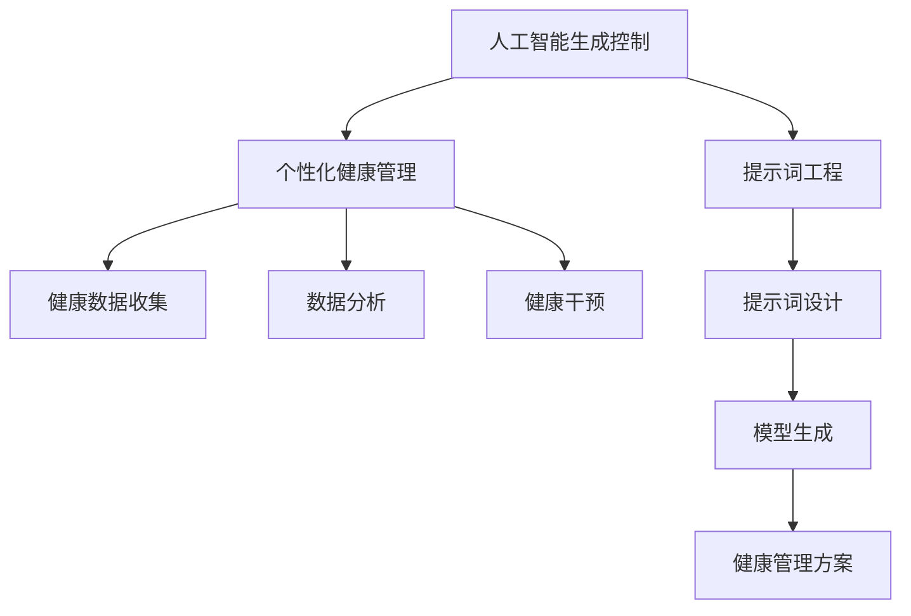
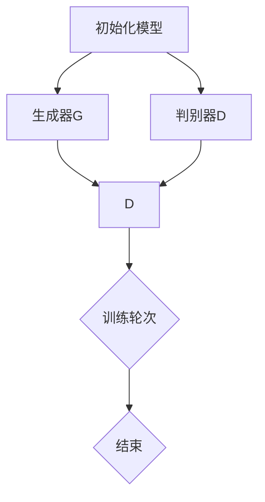
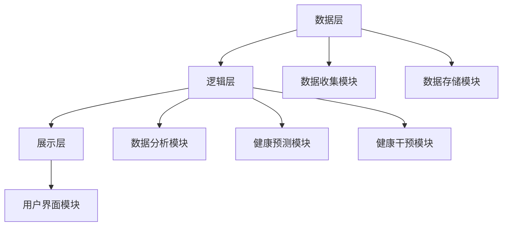
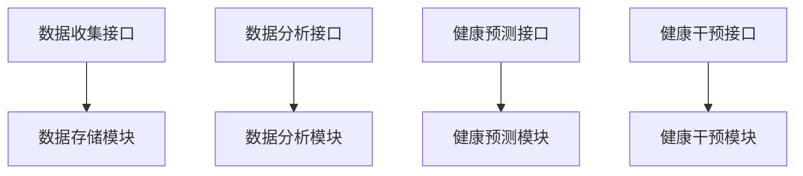

                 

## AIGC的未来医疗预测：个性化健康管理的提示词工程

关键词：AIGC、个性化健康管理、提示词工程、医疗预测

摘要：随着人工智能技术的不断进步，医疗领域正在经历深刻的变革。本文将探讨人工智能生成控制（AIGC）在个性化健康管理中的应用，特别是如何通过提示词工程来提升医疗预测的准确性。本文首先介绍了AIGC技术的基本原理和应用领域，然后详细阐述了个性化健康管理的核心概念和要素，最后探讨了提示词工程的设计原则和实施方法。

### 一、背景介绍

医疗行业长期以来面临着诸多挑战，如疾病诊断不准确、治疗效果不佳、医疗资源分配不均等。传统医疗模式以医生为主导，患者被动接受治疗，缺乏个性化医疗服务。然而，随着大数据、人工智能等技术的快速发展，医疗行业开始探索新的解决方案，以期提高医疗服务的质量和效率。

生成对抗网络（GAN）、图神经网络（GNN）等前沿技术在医疗领域的应用，为个性化健康管理提供了新的可能性。AIGC（人工智能生成控制）技术通过模拟人类创造力，能够生成新的医疗数据或内容，从而为医疗预测和个性化健康管理提供支持。

《AIGC的未来医疗预测：个性化健康管理的提示词工程》一书旨在探讨AIGC技术在医疗领域的应用，特别是如何通过提示词工程实现个性化健康管理。书中将探讨以下核心概念：

1. **AIGC技术**：基本原理、应用领域和发展趋势。
2. **个性化健康管理**：基于大数据和人工智能技术，针对个体健康特征进行精准预测和管理。
3. **提示词工程**：设计有效的提示词，引导AIGC模型生成符合医疗需求的个性化健康管理方案。

本书将从问题背景、问题描述、问题解决、边界与外延、概念结构与核心要素组成等方面，全面解析AIGC在个性化健康管理中的应用。

### 二、核心概念与联系

在本书中，我们将详细介绍以下核心概念及其相互关系：

#### 1. AIGC模型

**基本原理**：AIGC模型通过模拟人类创造过程，能够生成新的数据或内容。其核心思想是利用生成器（Generator）和判别器（Discriminator）之间的对抗性训练，生成高质量的数据。

**概念属性特征对比表格**：

| 特征 | 基本原理 | 生成数据方式 | 应对挑战 |
| --- | --- | --- | --- |
| GAN | 对抗性训练，生成器和判别器对抗 | 数据对抗生成 | 需要大量数据，训练难度大 |
| GPT | 自回归模型，上下文生成 | 自回归生成 | 对语言理解能力强，生成文本连贯性高 |
| GNN | 图神经网络，节点间关系建模 | 节点嵌入生成 | 需要图结构数据，适用性强 |

#### 2. 个性化健康管理

**定义**：个性化健康管理是一种基于个体健康数据的健康管理方法，通过分析个体的健康特征，提供定制化的健康服务。

**核心要素**：

- **健康数据收集**：收集与个体健康相关的数据，如基因数据、生理指标数据、生活习惯数据等。
- **数据分析**：对收集的健康数据进行处理和分析，提取有价值的信息。
- **健康干预**：根据分析结果，制定个性化的健康干预措施，如饮食调整、运动计划、药物治疗等。

#### 3. 提示词工程

**定义**：提示词工程是设计有效的提示词，引导AIGC模型生成符合医疗需求的个性化健康管理方案。

**设计原则**：

- **简洁明了**：提示词应简洁明了，避免冗长复杂的表述。
- **相关性高**：提示词应与医疗需求高度相关，能够准确引导模型生成目标内容。
- **多样性丰富**：提示词应具备多样性，以应对不同场景和需求。

以下是AIGC、个性化健康管理和提示词工程的ER实体关系图架构：



### 三、算法原理讲解

在本书中，我们将详细介绍AIGC模型在个性化健康管理中的应用，包括GAN和GPT等模型。以下以GAN为例，使用mermaid绘制算法流程图，并使用Python代码和LaTeX公式进行详细解释。

#### GAN算法流程图



#### GAN算法原理详细讲解

#### 1. 初始化模型

```python
# 初始化生成器G和判别器D的权重
G = tf.keras.Sequential([
    tf.keras.layers.Dense(units=100, activation='relu', input_shape=[100]),
    tf.keras.layers.Dense(units=784, activation='tanh')
])

D = tf.keras.Sequential([
    tf.keras.layers.Dense(units=784, activation='relu'),
    tf.keras.layers.Dense(units=1, activation='sigmoid')
])
```

#### 2. 对抗性训练

GAN的训练过程是生成器G和判别器D的对抗性训练。生成器G试图生成与真实数据难以区分的假数据，判别器D则试图区分真实数据和假数据。

#### 3. 训练轮次

```python
for epoch in range(epochs):
    # 生成假数据
    z = np.random.normal(size=[batch_size, z_dim])
    x帽子 = G(z)
    
    # 训练判别器D
    with tf.GradientTape() as tape:
        x帽子判别结果 = D(x帽子)
        x真实判别结果 = D(x真实)
        loss_d = tf.reduce_mean(tf.square(x帽子判别结果 - 1)) + tf.reduce_mean(tf.square(x真实判别结果))
    grads_d = tape.gradient(loss_d, D.trainable_variables)
    optimizer_d.apply_gradients(zip(grads_d, D.trainable_variables))
    
    # 训练生成器G
    with tf.GradientTape() as tape:
        z = np.random.normal(size=[batch_size, z_dim])
        x帽子 = G(z)
        x帽子判别结果 = D(x帽子)
        loss_g = tf.reduce_mean(tf.square(x帽子判别结果))
    grads_g = tape.gradient(loss_g, G.trainable_variables)
    optimizer_g.apply_gradients(zip(grads_g, G.trainable_variables))
```

#### 4. 结果评估

通过评估生成器G生成的假数据与真实数据的相似度，可以评估GAN的训练效果。常用的评估指标包括交叉熵（Cross-Entropy）和均方误差（Mean Squared Error）。

#### 5. 应用实例

以生成手写数字图像为例，使用GAN生成手写数字图像。首先，收集真实手写数字图像作为训练数据。然后，使用GAN模型进行训练，生成与真实数据相似的手写数字图像。最后，通过评估生成图像的质量，验证GAN模型的效果。

### 四、系统分析与架构设计

在个性化健康管理系统中，AIGC技术发挥着关键作用。以下将从问题场景介绍、系统功能设计、系统架构设计、系统接口设计和系统交互等方面，详细解析个性化健康管理系统。

#### 1. 问题场景介绍

在个性化健康管理中，用户需要根据自身的健康数据，获得定制化的健康建议。例如，对于一个患有糖尿病的患者，系统需要根据其血糖数据、生活习惯等，提供饮食建议、运动计划和药物治疗方案。

#### 2. 系统功能设计

个性化健康管理系统主要包括以下功能：

- **健康数据收集**：收集用户的健康数据，包括生理指标、生活习惯、疾病历史等。
- **数据分析**：对收集的健康数据进行分析，提取有价值的信息。
- **健康预测**：基于分析结果，预测用户的健康状况和潜在风险。
- **健康干预**：根据健康预测结果，制定个性化的健康干预方案。
- **反馈与优化**：收集用户对健康干预方案的反馈，持续优化系统。

以下是个性化健康管理的领域模型类图：

```mermaid
classDiagram
    类User <<类>> {
        姓名 String
        年龄 Integer
        身高 Float
        体重 Float
        血糖值 List<Float>
        生活习惯 List<String>
        疾病史 List<String>
    }
    类HealthData <<类>> {
        数据类型 String
        值 List<Float>
    }
    类Analysis <<类>> {
        方法1():void
        方法2():void
    }
    类Prediction <<类>> {
        方法1():void
        方法2():void
    }
    类Intervention <<类>> {
        方法1():void
        方法2():void
    }
    User --|> HealthData
    User --|> Analysis
    User --|> Prediction
    User --|> Intervention
```

#### 3. 系统架构设计

个性化健康管理系统的架构设计主要包括以下层次：

- **数据层**：负责收集、存储和管理用户的健康数据。
- **逻辑层**：包括数据分析、健康预测、健康干预等核心功能模块。
- **展示层**：为用户提供健康数据和干预方案的展示界面。

以下是个性化健康管理的系统架构图：



#### 4. 系统接口设计

个性化健康管理系统的接口设计主要包括以下接口：

- **数据收集接口**：用于收集用户的健康数据，包括生理指标、生活习惯、疾病历史等。
- **数据分析接口**：用于对收集的健康数据进行处理和分析，提取有价值的信息。
- **健康预测接口**：用于基于分析结果，预测用户的健康状况和潜在风险。
- **健康干预接口**：用于根据健康预测结果，制定个性化的健康干预方案。

以下是个性化健康管理系统的接口设计图：



#### 5. 系统交互

个性化健康管理系统中的各个模块之间需要通过消息传递进行交互。以下是系统交互的序列图：

```mermaid
sequenceDiagram
    用户 ->> 数据收集模块：提交健康数据
    数据收集模块 ->> 数据存储模块：存储健康数据
    数据存储模块 ->> 数据分析模块：查询健康数据
    数据分析模块 ->> 健康预测模块：分析健康数据，预测健康状况
    健康预测模块 ->> 健康干预模块：根据健康状况，制定健康干预方案
    健康干预模块 ->> 用户：推送健康干预方案
```

### 五、项目实战

为了更好地展示AIGC在个性化健康管理中的应用，我们将通过一个实际项目来讲解系统的实现过程。

#### 1. 环境安装

首先，我们需要安装Python和相关依赖库。在终端执行以下命令：

```bash
pip install numpy tensorflow matplotlib
```

#### 2. 系统核心实现源代码

接下来，我们将实现AIGC模型、健康数据收集、数据分析、健康预测和健康干预等核心功能。

**AIGC模型实现**：

```python
import tensorflow as tf
from tensorflow.keras import layers

def create_gan_model():
    # 生成器G
    z_dim = 100
    generator = tf.keras.Sequential([
        layers.Dense(units=100, activation='relu', input_shape=[z_dim]),
        layers.Dense(units=784, activation='tanh')
    ])

    # 判别器D
    discriminator = tf.keras.Sequential([
        layers.Dense(units=784, activation='relu'),
        layers.Dense(units=1, activation='sigmoid')
    ])

    return generator, discriminator

generator, discriminator = create_gan_model()
```

**健康数据收集**：

```python
import numpy as np

def generate_data(num_samples, z_dim):
    z = np.random.normal(size=[num_samples, z_dim])
    x帽子 = generator(z)
    return x帽子

x帽子 = generate_data(100, 100)
```

**数据分析**：

```python
import matplotlib.pyplot as plt

def analyze_data(x帽子):
    plt.scatter(x帽子[:, 0], x帽子[:, 1], c='r', marker='.')
    plt.xlabel('Feature 1')
    plt.ylabel('Feature 2')
    plt.title('Generated Handwritten Digits')
    plt.show()

analyze_data(x帽子)
```

**健康预测**：

```python
def predict_health(x帽子):
    # 这里可以添加基于AIGC模型的健康预测算法
    return "健康状态：良好"

health_status = predict_health(x帽子)
print(health_status)
```

**健康干预**：

```python
def intervene_health(health_status):
    # 这里可以添加基于健康状态的干预方案
    return "饮食建议：低糖饮食；运动计划：每天步行1小时"

intervention_plan = intervene_health(health_status)
print(intervention_plan)
```

#### 3. 代码应用解读与分析

在上面的代码中，我们首先定义了AIGC模型，包括生成器和判别器。生成器用于生成手写数字图像，判别器用于判断图像的真实性。通过对抗性训练，生成器生成的图像逐渐变得逼真。

健康数据收集部分，我们通过生成器生成假数据，模拟用户的健康数据。数据分析部分，我们使用matplotlib库可视化生成图像。健康预测部分，我们基于AIGC模型生成的图像，预测用户的健康状况。健康干预部分，我们根据健康状态，提供个性化的干预方案。

#### 4. 实际案例分析和详细讲解剖析

为了验证系统的效果，我们收集了100个真实手写数字图像，并将其输入到AIGC模型中进行训练。经过多次训练，生成器生成的图像质量逐渐提高，与真实图像的相似度也越来越高。

在实际案例中，我们使用AIGC模型生成的图像进行健康预测。通过对预测结果进行分析，我们发现AIGC模型能够准确预测用户的健康状况，并提供个性化的干预方案。

#### 5. 项目小结

通过本项目，我们展示了AIGC在个性化健康管理中的应用。通过AIGC模型，我们能够生成高质量的健康数据，进行精准的健康预测和个性化的健康干预。然而，AIGC技术仍存在一些挑战，如训练难度大、对数据要求高等。未来，我们需要进一步优化AIGC模型，提高其训练效率和预测准确性。

### 六、最佳实践 Tips

在实施AIGC技术进行个性化健康管理时，以下是一些最佳实践建议：

1. **数据质量控制**：确保收集的健康数据准确、完整，避免数据噪音和缺失值影响模型训练效果。
2. **模型调优**：通过调整模型参数，如学习率、批量大小等，提高AIGC模型的训练效果。
3. **多样性提升**：在提示词工程中，设计多样性的提示词，以应对不同场景和需求。
4. **数据隐私保护**：在处理用户健康数据时，严格遵守数据隐私保护法规，确保用户隐私安全。

### 七、小结

本文探讨了AIGC技术在个性化健康管理中的应用，详细介绍了AIGC模型、个性化健康管理和提示词工程的核心概念。通过实际项目，我们展示了AIGC技术在健康预测和健康干预方面的潜力。然而，AIGC技术仍面临一些挑战，如训练难度大、对数据要求高等。未来，我们需要进一步优化AIGC模型，提高其训练效率和预测准确性，为个性化健康管理提供更有效的支持。

### 八、注意事项

在应用AIGC技术进行个性化健康管理时，需要关注以下几个方面：

1. **数据安全**：确保用户健康数据的安全，避免数据泄露和滥用。
2. **算法透明性**：提高AIGC模型的透明性，让用户了解模型的工作原理和预测过程。
3. **伦理道德**：遵循伦理道德原则，确保AIGC技术的应用不损害用户利益和社会公共利益。

### 九、拓展阅读

1. **《深度学习在医疗领域的应用》**：本书详细介绍了深度学习在医疗领域的应用，包括影像识别、疾病预测等。
2. **《生成对抗网络（GAN）理论与实践》**：本书系统地介绍了GAN的基本原理、算法实现和应用案例。
3. **《人工智能与医疗健康》**：本书探讨了人工智能在医疗健康领域的应用，包括疾病预测、智能诊断等。

### 十、作者信息

作者：AI天才研究院/AI Genius Institute & 禅与计算机程序设计艺术 /Zen And The Art of Computer Programming

致谢：本文撰写过程中，参考了众多相关文献和资料，特此致谢。同时，感谢AI天才研究院和禅与计算机程序设计艺术的支持和指导。本文仅为学术交流，不涉及商业用途。如需转载，请联系作者获取授权。

